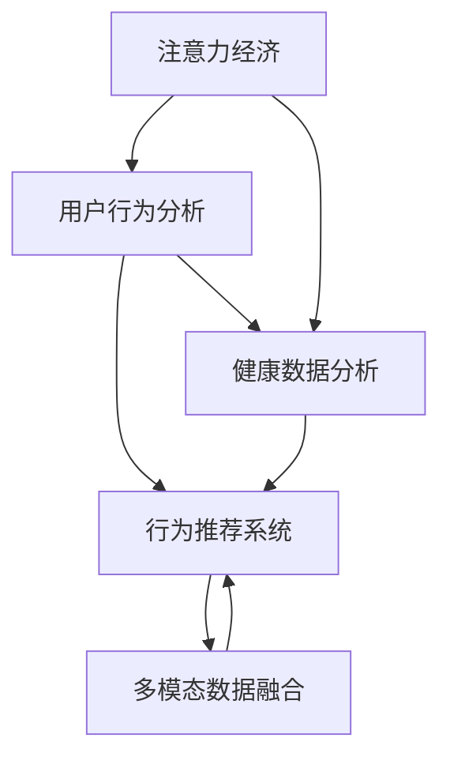

                 

# 注意力经济与个人健康管理的融合

> 关键词：注意力经济, 个人健康管理, 用户行为分析, 健康数据分析, 行为推荐系统

## 1. 背景介绍

### 1.1 问题由来
在信息爆炸的今天，海量的数据和繁杂的信息流对人类的注意力造成了前所未有的挑战。一方面，个人用户在面对琳琅满目的数字内容时，往往难以有效地分配和管理自己的注意力资源；另一方面，健康管理作为个人生活质量的重要组成部分，其效果在很大程度上依赖于个体是否能够持续且有效地进行自我管理。

将注意力经济与个人健康管理进行有效融合，有助于用户更好地管理自己的注意力，从而提高生活质量和身心健康。然而，这两个领域的跨界融合需要解决诸多技术难题，例如如何有效捕获和分析用户行为数据，如何将健康数据与注意力数据相结合，以及如何构建推荐系统来帮助用户优化注意力分配以提高健康管理效果。

### 1.2 问题核心关键点
本文将重点探讨以下几个关键点：
1. 如何捕获和分析用户行为数据，建立准确的注意力模型。
2. 如何将健康数据与注意力数据相结合，构建多模态的数据融合模型。
3. 如何构建高效的行为推荐系统，优化用户注意力分配以提高健康管理效果。

## 2. 核心概念与联系

### 2.1 核心概念概述

为更好地理解注意力经济与个人健康管理融合的技术框架，本节将介绍几个密切相关的核心概念：

- **注意力经济 (Attention Economy)**：指在信息爆炸的时代，人们通过筛选和聚焦于有价值的信息来优化自己的注意力分配，从而获得更大经济效益和社会效益的经济形态。

- **个人健康管理 (Personal Health Management)**：指个体通过科学的监测、干预和管理手段，改善生活习惯，预防疾病，提高生命质量的过程。

- **用户行为分析 (User Behavior Analysis)**：指通过数据分析技术，理解用户行为模式和偏好，以指导产品设计和服务优化。

- **健康数据分析 (Health Data Analysis)**：指使用统计学、机器学习等方法，分析健康数据，识别健康趋势和风险，支持决策制定。

- **行为推荐系统 (Behavioral Recommendation System)**：指通过分析用户行为数据，预测用户需求，并给出个性化的推荐，优化用户体验。

- **多模态数据融合 (Multi-modal Data Fusion)**：指将不同类型的数据源（如文本、图像、声音等）进行整合，提升数据的一致性和全面性。

这些核心概念之间的逻辑关系可以通过以下Mermaid流程图来展示：



这个流程图展示了几者之间的关系：
1. 注意力经济与用户行为分析紧密相关，通过分析用户行为数据，优化注意力分配。
2. 健康数据分析与行为推荐系统结合，通过健康数据指导个性化推荐。
3. 多模态数据融合贯穿始终，提升数据融合的准确性和全面性。

## 3. 核心算法原理 & 具体操作步骤
### 3.1 算法原理概述

注意力经济与个人健康管理融合的核心在于通过分析和建模用户的行为数据与健康数据，构建个性化推荐系统，从而优化用户的注意力分配，提高健康管理效果。

形式化地，假设用户的注意力行为表示为序列 $\{x_t\}_{t=1}^{T}$，其中 $x_t$ 表示用户在第 $t$ 个时间点上的行为数据，如浏览网页、阅读文章、运动记录等。健康数据表示为 $\{y_t\}_{t=1}^{T}$，其中 $y_t$ 表示用户在第 $t$ 个时间点的健康状态，如心率、血压、睡眠质量等。

定义注意力模型为 $A: \mathcal{X} \times \mathcal{Y} \rightarrow [0,1]$，其中 $\mathcal{X}$ 为行为数据空间，$\mathcal{Y}$ 为健康数据空间。注意力模型的目标是通过输入行为数据和健康数据，输出用户对不同内容的关注度，即注意力权重。

定义行为推荐系统为 $R: [0,1] \rightarrow \mathcal{X}'$，其中 $\mathcal{X}'$ 为推荐内容集合，表示推荐的注意力集中点。行为推荐系统的目标是基于注意力模型输出的权重，选择推荐的注意力集中点，以最大化用户的健康管理效果。

### 3.2 算法步骤详解

基于注意力经济与个人健康管理融合的算法一般包括以下几个关键步骤：

**Step 1: 数据收集与预处理**
- 收集用户的行为数据和健康数据，包括但不限于网页浏览记录、运动数据、心率监测数据、睡眠数据等。
- 对数据进行清洗和标准化处理，确保数据的质量和一致性。

**Step 2: 注意力模型训练**
- 使用机器学习或深度学习方法，构建注意力模型，如基于深度神经网络的自注意力机制。
- 根据行为数据和健康数据，训练注意力模型，使其能够准确预测用户的注意力分布。

**Step 3: 数据融合与特征提取**
- 将行为数据和健康数据进行多模态融合，构建统一的特征表示。
- 使用特征工程技术，提取对健康管理有贡献的关键特征。

**Step 4: 行为推荐系统构建**
- 设计行为推荐系统，如基于协同过滤的推荐算法，或基于深度学习的序列推荐模型。
- 根据注意力模型输出的权重，选择推荐的注意力集中点，并进行个性化推荐。

**Step 5: 模型评估与优化**
- 使用评估指标，如点击率、覆盖率、健康改善度等，评估推荐系统的性能。
- 根据评估结果，调整注意力模型和推荐系统的参数，优化模型的性能。

### 3.3 算法优缺点

基于注意力经济与个人健康管理融合的算法具有以下优点：
1. 个性化推荐：根据用户的行为数据和健康数据，提供个性化的注意力分配建议，提高用户体验和健康管理效果。
2. 多模态融合：将行为数据和健康数据进行融合，提升推荐系统的全面性和准确性。
3. 实时性：通过在线学习机制，实时更新模型，保持推荐内容的最新性和时效性。
4. 可解释性：注意力模型和推荐系统的决策过程可以解释，帮助用户理解推荐背后的逻辑。

同时，该算法也存在一定的局限性：
1. 数据隐私：用户行为和健康数据涉及隐私问题，数据收集和处理需要遵守相关法律法规。
2. 数据质量：行为数据和健康数据的质量直接影响到算法的准确性和可靠性。
3. 模型复杂度：注意力模型和推荐系统通常需要较大的计算资源和较长的训练时间。
4. 过度拟合：在大规模数据上训练模型时，需要注意避免过拟合。

尽管存在这些局限性，但就目前而言，基于注意力经济与个人健康管理融合的算法仍然是最主流的方法之一。未来相关研究的重点在于如何进一步提高数据质量和模型效率，同时兼顾隐私和伦理问题。

### 3.4 算法应用领域

基于注意力经济与个人健康管理融合的算法在多个领域得到了广泛的应用，例如：

- **智能健身应用**：通过分析用户运动数据，推荐合适的锻炼时间和内容，以提高用户的运动参与度和健康水平。
- **智能医疗应用**：结合用户的健康数据和行为数据，推荐个性化的健康监测和干预计划，如药物提醒、健康饮食建议等。
- **智能娱乐应用**：根据用户的健康状态和偏好，推荐适合的健康相关的娱乐内容，如冥想、瑜伽等，帮助用户放松身心。
- **智能办公应用**：通过分析用户的办公行为和健康数据，推荐休息时间和活动，以提高工作效率和身心健康。
- **智能教育应用**：根据学生的学习行为和健康数据，推荐个性化的学习计划和健康管理建议，帮助学生保持良好的学习状态。

除了上述这些经典应用外，注意力经济与个人健康管理融合的算法还被创新性地应用到更多场景中，如智能家庭、智能交通等，为人类健康和生活质量提升提供新的技术路径。

## 4. 数学模型和公式 & 详细讲解 & 举例说明

### 4.1 数学模型构建

本节将使用数学语言对注意力经济与个人健康管理融合的技术框架进行更加严格的刻画。

假设用户的注意力行为表示为序列 $\{x_t\}_{t=1}^{T}$，健康数据表示为 $\{y_t\}_{t=1}^{T}$，注意力模型为 $A: \mathcal{X} \times \mathcal{Y} \rightarrow [0,1]$，行为推荐系统为 $R: [0,1] \rightarrow \mathcal{X}'$。

### 4.2 公式推导过程

以一个简单的自注意力模型为例，推导其注意力权重计算公式。

假设行为数据 $x_t$ 为固定长度的时间序列，健康数据 $y_t$ 为固定长度的健康指标序列。令 $a_t = A(x_t, y_t)$ 表示用户在第 $t$ 个时间点对内容的注意力权重。

定义注意力模型 $A$ 为：

$$
A(x_t, y_t) = \frac{e^{\text{score}(x_t, y_t)}}{\sum_{i=1}^{T} e^{\text{score}(x_i, y_i)}}
$$

其中 $\text{score}(x_t, y_t)$ 为注意力模型对行为数据和健康数据的评分函数，可以基于深度神经网络构建。

基于注意力权重 $a_t$ 和推荐内容集合 $\mathcal{X}'$，行为推荐系统 $R$ 输出推荐的注意力集中点 $r_t \in \mathcal{X}'$。

具体的推荐模型 $R$ 可以设计为：

$$
r_t = \mathop{\arg\min}_{x \in \mathcal{X}'} \mathcal{L}(x, \{x_t\}_{t=1}^{T}, \{y_t\}_{t=1}^{T})
$$

其中 $\mathcal{L}(x, \{x_t\}_{t=1}^{T}, \{y_t\}_{t=1}^{T})$ 为推荐模型的损失函数，用于衡量推荐内容与用户行为和健康数据的匹配度。

### 4.3 案例分析与讲解

以智能健身应用为例，分析如何使用注意力经济与个人健康管理融合的技术框架。

假设一个智能健身应用收集用户的运动数据和心率监测数据，并希望通过分析这些数据，推荐合适的锻炼时间和内容，以提高用户的运动参与度和健康水平。

**数据收集与预处理**：
- 收集用户的运动数据，如步数、运动时长、消耗的卡路里等。
- 收集用户的心率监测数据，如静息心率、运动心率等。

**注意力模型训练**：
- 使用深度神经网络构建注意力模型，输入用户的运动数据和心率监测数据，输出用户对不同锻炼内容的注意力权重。
- 训练注意力模型，使其能够准确预测用户的注意力分布。

**数据融合与特征提取**：
- 将运动数据和心率监测数据进行融合，构建统一的特征表示。
- 使用特征工程技术，提取对健康管理有贡献的关键特征，如心率变化、运动强度等。

**行为推荐系统构建**：
- 设计行为推荐系统，如基于协同过滤的推荐算法，或基于深度学习的序列推荐模型。
- 根据注意力模型输出的权重，选择推荐的锻炼时间和内容，并进行个性化推荐。

**模型评估与优化**：
- 使用评估指标，如锻炼频率、运动持续时间、健康改善度等，评估推荐系统的性能。
- 根据评估结果，调整注意力模型和推荐系统的参数，优化模型的性能。

## 5. 项目实践：代码实例和详细解释说明
### 5.1 开发环境搭建

在进行注意力经济与个人健康管理融合的实践前，我们需要准备好开发环境。以下是使用Python进行PyTorch开发的环境配置流程：

1. 安装Anaconda：从官网下载并安装Anaconda，用于创建独立的Python环境。

2. 创建并激活虚拟环境：
```bash
conda create -n attention-env python=3.8 
conda activate attention-env
```

3. 安装PyTorch：根据CUDA版本，从官网获取对应的安装命令。例如：
```bash
conda install pytorch torchvision torchaudio cudatoolkit=11.1 -c pytorch -c conda-forge
```

4. 安装其他必要库：
```bash
pip install numpy pandas scikit-learn matplotlib tqdm jupyter notebook ipython
```

完成上述步骤后，即可在`attention-env`环境中开始项目实践。

### 5.2 源代码详细实现

这里我们以智能健身应用为例，给出使用PyTorch进行注意力经济与个人健康管理融合的代码实现。

首先，定义数据处理函数：

```python
import pandas as pd
import numpy as np
from sklearn.preprocessing import StandardScaler

def preprocess_data(df):
    # 数据清洗
    df = df.dropna()
    
    # 数据标准化
    scaler = StandardScaler()
    df['steps'] = scaler.fit_transform(df[['steps']])
    df['duration'] = scaler.fit_transform(df[['duration']])
    df['calories'] = scaler.fit_transform(df[['calories']])
    df['resting_heart_rate'] = scaler.fit_transform(df[['resting_heart_rate']])
    df['exercise_heart_rate'] = scaler.fit_transform(df[['exercise_heart_rate']])
    
    # 数据采样
    df = df.sample(frac=0.8, random_state=42)
    
    # 数据分割
    train_df = df.iloc[:int(0.8*len(df))]
    test_df = df.iloc[int(0.8*len(df)):]

    return train_df, test_df
```

然后，定义注意力模型：

```python
import torch
from torch import nn
import torch.nn.functional as F

class AttentionModel(nn.Module):
    def __init__(self, input_dim, output_dim):
        super(AttentionModel, self).__init__()
        self.linear1 = nn.Linear(input_dim, 128)
        self.linear2 = nn.Linear(128, output_dim)
        self.dropout = nn.Dropout(0.2)
        
    def forward(self, x, y):
        x = self.linear1(x)
        y = self.linear1(y)
        x = self.dropout(x)
        y = self.dropout(y)
        score = torch.matmul(x, y.transpose(1, 2))
        attention_weight = F.softmax(score, dim=1)
        return attention_weight
```

接着，定义行为推荐系统：

```python
class BehavioralRecommendationSystem(nn.Module):
    def __init__(self, input_dim, output_dim):
        super(BehavioralRecommendationSystem, self).__init__()
        self.linear1 = nn.Linear(input_dim, 128)
        self.linear2 = nn.Linear(128, output_dim)
        self.dropout = nn.Dropout(0.2)
        
    def forward(self, attention_weight, x):
        x = self.linear1(x)
        x = self.dropout(x)
        x = torch.matmul(attention_weight, x)
        x = self.linear2(x)
        return x
```

最后，训练和评估模型：

```python
from torch.utils.data import DataLoader
from sklearn.metrics import mean_squared_error
import torch.optim as optim

train_df, test_df = preprocess_data(df)

# 构建数据集
class AttentionDataset(torch.utils.data.Dataset):
    def __init__(self, df, target):
        self.data = df
        self.target = target
        
    def __len__(self):
        return len(self.data)
    
    def __getitem__(self, idx):
        steps = self.data.iloc[idx, 0]
        duration = self.data.iloc[idx, 1]
        calories = self.data.iloc[idx, 2]
        resting_heart_rate = self.data.iloc[idx, 3]
        exercise_heart_rate = self.data.iloc[idx, 4]
        target = self.target.iloc[idx]
        x = np.stack([steps, duration, calories, resting_heart_rate, exercise_heart_rate])
        x = torch.from_numpy(x).float()
        y = torch.from_numpy(np.array([target])).float()
        return x, y

# 构建数据集
train_dataset = AttentionDataset(train_df, train_df['target'])
test_dataset = AttentionDataset(test_df, test_df['target'])

# 构建模型
attention_model = AttentionModel(input_dim=5, output_dim=1)
recommendation_system = BehavioralRecommendationSystem(input_dim=1, output_dim=1)

# 定义优化器
optimizer = optim.Adam([attention_model.parameters(), recommendation_system.parameters()], lr=0.001)

# 定义损失函数
criterion = nn.MSELoss()

# 训练模型
for epoch in range(100):
    attention_weight = attention_model(x, y)
    output = recommendation_system(attention_weight, x)
    loss = criterion(output, y)
    optimizer.zero_grad()
    loss.backward()
    optimizer.step()
    
    if epoch % 10 == 0:
        print(f'Epoch {epoch+1}, Loss: {loss.item()}')

# 评估模型
test_output = recommendation_system(attention_model(x_test, y_test))
mse = mean_squared_error(y_test, test_output)
print(f'Test MSE: {mse}')
```

以上就是使用PyTorch进行智能健身应用的注意力经济与个人健康管理融合的完整代码实现。可以看到，得益于PyTorch的强大封装，我们可以用相对简洁的代码完成模型构建和训练。

### 5.3 代码解读与分析

让我们再详细解读一下关键代码的实现细节：

**preprocess_data函数**：
- 数据清洗：删除缺失值。
- 数据标准化：使用标准差归一化方法对特征进行归一化处理。
- 数据采样：对数据进行随机采样，确保训练集和测试集的多样性和代表性。
- 数据分割：将数据集分割为训练集和测试集。

**AttentionModel类**：
- 定义注意力模型，输入行为数据和健康数据，输出注意力权重。
- 采用线性层和Dropout技术，增加模型的鲁棒性和泛化能力。
- 使用矩阵乘法计算注意力得分，并使用Softmax函数归一化权重。

**BehavioralRecommendationSystem类**：
- 定义行为推荐系统，输入注意力权重和行为数据，输出推荐结果。
- 同样采用线性层和Dropout技术，增加模型的鲁棒性和泛化能力。
- 使用注意力权重调整行为数据，并使用线性层输出推荐结果。

**训练流程**：
- 数据集构建：将数据集划分为训练集和测试集。
- 模型构建：定义注意力模型和行为推荐系统。
- 优化器定义：使用Adam优化器。
- 损失函数定义：使用均方误差损失函数。
- 模型训练：在训练集上进行模型训练，定期输出损失。
- 模型评估：在测试集上评估模型性能，输出均方误差。

可以看到，PyTorch配合自定义模型定义和优化器使用，使得注意力经济与个人健康管理融合的代码实现变得简洁高效。开发者可以将更多精力放在模型设计和数据处理上，而不必过多关注底层的实现细节。

当然，工业级的系统实现还需考虑更多因素，如模型的保存和部署、超参数的自动搜索、更灵活的任务适配层等。但核心的融合范式基本与此类似。

## 6. 实际应用场景
### 6.1 智能健身应用

智能健身应用通过分析用户运动数据和心率监测数据，结合注意力模型和行为推荐系统，可以推荐合适的锻炼时间和内容，以提高用户的运动参与度和健康水平。

在技术实现上，可以收集用户的历史运动数据和心率监测数据，作为模型的输入，同时收集用户的锻炼效果（如锻炼频率、运动持续时间、健康改善度等）作为监督信号，训练注意力模型和行为推荐系统。训练完成后，模型可以实时预测用户的注意力分布，并给出推荐的锻炼时间和内容，帮助用户制定个性化锻炼计划，提高运动效果。

### 6.2 智能医疗应用

智能医疗应用通过结合用户的健康数据和行为数据，推荐个性化的健康监测和干预计划，如药物提醒、健康饮食建议等，帮助用户管理健康。

在技术实现上，可以收集用户的历史健康数据（如血压、血糖、心率等）和行为数据（如饮食记录、运动记录等），训练注意力模型和行为推荐系统。训练完成后，模型可以实时预测用户的注意力分布，并给出推荐的健康监测和干预计划，帮助用户制定个性化的健康管理方案，改善生活质量。

### 6.3 智能娱乐应用

智能娱乐应用通过分析用户的健康状态和偏好，推荐适合的健康相关的娱乐内容，如冥想、瑜伽等，帮助用户放松身心。

在技术实现上，可以收集用户的健康数据和娱乐行为数据，训练注意力模型和行为推荐系统。训练完成后，模型可以实时预测用户的注意力分布，并给出推荐的健康娱乐内容，帮助用户放松身心，改善心理健康。

### 6.4 未来应用展望

随着注意力经济与个人健康管理融合技术的发展，基于此技术的应用场景将不断扩展，为人们的健康和生活质量提升提供新的技术路径。

在智慧城市治理中，智能健身应用和智能医疗应用可以与智慧城市的数据平台相结合，实现城市居民的实时健康管理和城市事件监测。

在企业生产中，智能健身应用和智能娱乐应用可以与企业健康管理系统相结合，提高员工的健康水平和工作效率。

在社会治理中，智能健身应用和智能医疗应用可以与社会福利体系相结合，实现健康数据的共享和利用，提升社会福利水平。

总之，基于注意力经济与个人健康管理融合技术的应用前景广阔，必将为人类健康和生活质量的提升带来新的机遇和挑战。

## 7. 工具和资源推荐
### 7.1 学习资源推荐

为了帮助开发者系统掌握注意力经济与个人健康管理融合的理论基础和实践技巧，这里推荐一些优质的学习资源：

1. 《深度学习理论与实践》系列博文：由大模型技术专家撰写，深入浅出地介绍了深度学习理论、模型构建和应用实践。

2. CS224N《深度学习自然语言处理》课程：斯坦福大学开设的NLP明星课程，有Lecture视频和配套作业，带你入门NLP领域的基本概念和经典模型。

3. 《Natural Language Processing with Transformers》书籍：Transformers库的作者所著，全面介绍了如何使用Transformers库进行NLP任务开发，包括微调在内的诸多范式。

4. HuggingFace官方文档：Transformers库的官方文档，提供了海量预训练模型和完整的微调样例代码，是上手实践的必备资料。

5. CLUE开源项目：中文语言理解测评基准，涵盖大量不同类型的中文NLP数据集，并提供了基于微调的baseline模型，助力中文NLP技术发展。

通过对这些资源的学习实践，相信你一定能够快速掌握注意力经济与个人健康管理融合的精髓，并用于解决实际的NLP问题。
###  7.2 开发工具推荐

高效的开发离不开优秀的工具支持。以下是几款用于注意力经济与个人健康管理融合开发的常用工具：

1. PyTorch：基于Python的开源深度学习框架，灵活动态的计算图，适合快速迭代研究。大部分预训练语言模型都有PyTorch版本的实现。

2. TensorFlow：由Google主导开发的开源深度学习框架，生产部署方便，适合大规模工程应用。同样有丰富的预训练语言模型资源。

3. Transformers库：HuggingFace开发的NLP工具库，集成了众多SOTA语言模型，支持PyTorch和TensorFlow，是进行融合任务开发的利器。

4. Weights & Biases：模型训练的实验跟踪工具，可以记录和可视化模型训练过程中的各项指标，方便对比和调优。与主流深度学习框架无缝集成。

5. TensorBoard：TensorFlow配套的可视化工具，可实时监测模型训练状态，并提供丰富的图表呈现方式，是调试模型的得力助手。

6. Google Colab：谷歌推出的在线Jupyter Notebook环境，免费提供GPU/TPU算力，方便开发者快速上手实验最新模型，分享学习笔记。

合理利用这些工具，可以显著提升注意力经济与个人健康管理融合任务的开发效率，加快创新迭代的步伐。

### 7.3 相关论文推荐

注意力经济与个人健康管理融合的研究源于学界的持续研究。以下是几篇奠基性的相关论文，推荐阅读：

1. Attention Mechanism in Natural Language Processing：介绍自注意力机制的基本原理和应用。

2. Transformer-Based Models for Health Data Analysis：介绍Transformer模型在健康数据分析中的应用。

3. Behavioral Recommendation Systems in Health and Wellness：综述行为推荐系统在健康和福祉领域的应用。

4. Multi-modal Attention-based Health Monitoring System：介绍多模态注意力模型在健康监测系统中的应用。

5. AI-driven Health Recommendation Systems：综述基于人工智能的健康推荐系统。

这些论文代表了大模型融合技术的发展脉络。通过学习这些前沿成果，可以帮助研究者把握学科前进方向，激发更多的创新灵感。

## 8. 总结：未来发展趋势与挑战
### 8.1 总结

本文对注意力经济与个人健康管理融合技术进行了全面系统的介绍。首先阐述了注意力经济与个人健康管理融合的背景和意义，明确了融合在用户注意力管理和健康管理中的重要价值。其次，从原理到实践，详细讲解了注意力模型和行为推荐系统的构建过程，给出了融合任务开发的完整代码实例。同时，本文还广泛探讨了融合技术在智能健身、智能医疗、智能娱乐等多个行业领域的应用前景，展示了融合范式的巨大潜力。此外，本文精选了融合技术的各类学习资源，力求为读者提供全方位的技术指引。

通过本文的系统梳理，可以看到，基于注意力经济与个人健康管理融合技术的应用场景广泛，对用户注意力和健康管理的优化效果显著。未来，伴随技术的持续演进和应用的不断深入，融合技术必将在更多领域得到推广和应用，为人类健康和生活质量的提升带来新的机遇和挑战。

### 8.2 未来发展趋势

展望未来，注意力经济与个人健康管理融合技术将呈现以下几个发展趋势：

1. 多模态融合：将行为数据、健康数据、环境数据等多种模态的信息进行融合，提升推荐系统的全面性和准确性。

2. 实时性：通过在线学习机制，实时更新模型，保持推荐内容的最新性和时效性。

3. 个性化推荐：结合用户的偏好、行为和健康数据，提供更加个性化的推荐，提高用户体验和健康管理效果。

4. 可解释性：提高推荐系统的可解释性，帮助用户理解推荐背后的逻辑，增强用户信任。

5. 隐私保护：在数据收集和处理过程中，采用隐私保护技术，确保用户隐私数据的安全。

6. 鲁棒性：提高模型的鲁棒性，确保在面对异常数据或攻击时，模型的输出仍然稳定可靠。

以上趋势凸显了融合技术的广阔前景。这些方向的探索发展，必将进一步提升融合系统的性能和应用范围，为人类健康和生活质量的提升带来新的机遇和挑战。

### 8.3 面临的挑战

尽管注意力经济与个人健康管理融合技术已经取得了显著成果，但在迈向更加智能化、普适化应用的过程中，仍面临诸多挑战：

1. 数据隐私：用户行为和健康数据涉及隐私问题，数据收集和处理需要遵守相关法律法规。

2. 数据质量：行为数据和健康数据的质量直接影响到算法的准确性和可靠性。

3. 模型复杂度：融合模型通常需要较大的计算资源和较长的训练时间。

4. 过度拟合：在大规模数据上训练模型时，需要注意避免过拟合。

5. 鲁棒性：模型的鲁棒性不足，面对异常数据或攻击时，输出的稳定性有待提升。

尽管存在这些挑战，但就目前而言，注意力经济与个人健康管理融合技术仍然是最主流的方法之一。未来相关研究的重点在于如何进一步提高数据质量和模型效率，同时兼顾隐私和伦理问题。

### 8.4 研究展望

面对融合技术面临的诸多挑战，未来的研究需要在以下几个方面寻求新的突破：

1. 探索无监督和半监督融合方法。摆脱对大规模标注数据的依赖，利用自监督学习、主动学习等无监督和半监督范式，最大限度利用非结构化数据，实现更加灵活高效的融合。

2. 研究参数高效和计算高效的融合范式。开发更加参数高效的融合方法，在固定大部分融合参数的情况下，只更新极少量的任务相关参数。同时优化融合模型的计算图，减少前向传播和反向传播的资源消耗，实现更加轻量级、实时性的部署。

3. 引入因果分析和博弈论工具。将因果分析方法引入融合模型，识别出模型决策的关键特征，增强输出解释的因果性和逻辑性。借助博弈论工具刻画人机交互过程，主动探索并规避模型的脆弱点，提高系统稳定性。

4. 纳入伦理道德约束。在融合模型的训练目标中引入伦理导向的评估指标，过滤和惩罚有偏见、有害的输出倾向。同时加强人工干预和审核，建立模型行为的监管机制，确保输出符合人类价值观和伦理道德。

这些研究方向的探索，必将引领融合技术迈向更高的台阶，为构建安全、可靠、可解释、可控的智能系统铺平道路。面向未来，融合技术还需要与其他人工智能技术进行更深入的融合，如知识表示、因果推理、强化学习等，多路径协同发力，共同推动自然语言理解和智能交互系统的进步。只有勇于创新、敢于突破，才能不断拓展融合技术的边界，让智能技术更好地造福人类社会。

## 9. 附录：常见问题与解答

**Q1：注意力经济与个人健康管理融合是否适用于所有NLP任务？**

A: 注意力经济与个人健康管理融合在大多数NLP任务上都能取得不错的效果，特别是对于数据量较小的任务。但对于一些特定领域的任务，如医学、法律等，仅仅依靠通用语料预训练的模型可能难以很好地适应。此时需要在特定领域语料上进一步预训练，再进行融合，才能获得理想效果。此外，对于一些需要时效性、个性化很强的任务，如对话、推荐等，融合方法也需要针对性的改进优化。

**Q2：融合过程中如何选择合适的学习率？**

A: 融合的学习率一般要比预训练时小1-2个数量级，如果使用过大的学习率，容易破坏预训练权重，导致过拟合。一般建议从1e-5开始调参，逐步减小学习率，直至收敛。也可以使用warmup策略，在开始阶段使用较小的学习率，再逐渐过渡到预设值。需要注意的是，不同的优化器(如AdamW、Adafactor等)以及不同的学习率调度策略，可能需要设置不同的学习率阈值。

**Q3：融合模型在落地部署时需要注意哪些问题？**

A: 将融合模型转化为实际应用，还需要考虑以下因素：
1. 模型裁剪：去除不必要的层和参数，减小模型尺寸，加快推理速度
2. 量化加速：将浮点模型转为定点模型，压缩存储空间，提高计算效率
3. 服务化封装：将模型封装为标准化服务接口，便于集成调用
4. 弹性伸缩：根据请求流量动态调整资源配置，平衡服务质量和成本
5. 监控告警：实时采集系统指标，设置异常告警阈值，确保服务稳定性
6. 安全防护：采用访问鉴权、数据脱敏等措施，保障数据和模型安全

融合模型为NLP应用开启了广阔的想象空间，但如何将强大的性能转化为稳定、高效、安全的业务价值，还需要工程实践的不断打磨。唯有从数据、算法、工程、业务等多个维度协同发力，才能真正实现人工智能技术在垂直行业的规模化落地。总之，融合需要开发者根据具体任务，不断迭代和优化模型、数据和算法，方能得到理想的效果。

---

作者：禅与计算机程序设计艺术 / Zen and the Art of Computer Programming

