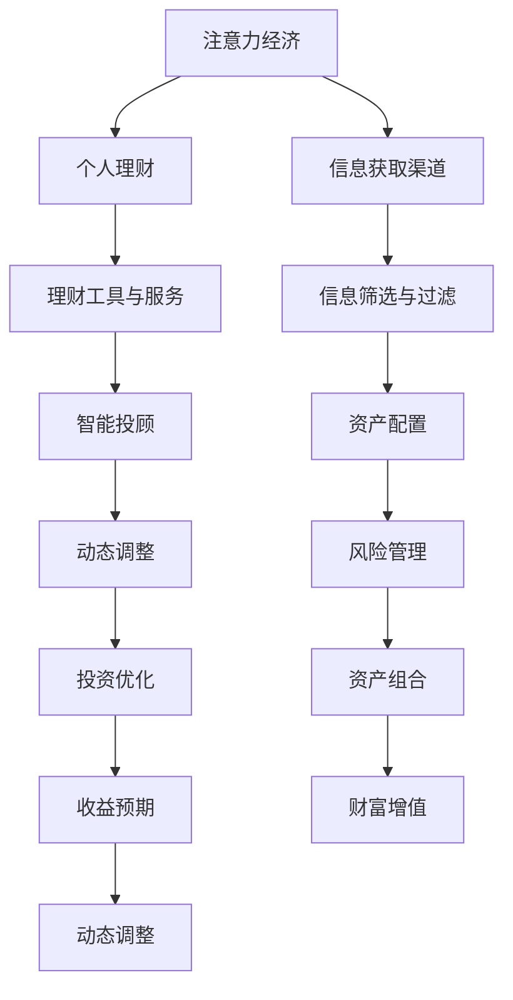

                 

# 注意力经济与个人理财观念的演变

## 1. 背景介绍

在当今数字经济时代，信息爆炸和内容充斥，人们获取信息的渠道与方式发生了深刻变化。伴随这一变化，“注意力经济”这一概念逐渐进入大众视野。本篇文章将深度剖析“注意力经济”的本质及其对个人理财观念的深刻影响，探索如何在复杂的信息海洋中，实现个人财务的有效管理和优化。

## 2. 核心概念与联系

### 2.1 核心概念概述

**注意力经济**：随着互联网和移动设备的发展，人们获取信息的方式从被动接收转向主动挑选，注意力成为稀缺资源。企业和品牌通过争夺用户的注意力，提高信息的传播效率和效果，进而创造经济价值。

**个人理财**：在经济活动中，个人通过合理配置资产，使有限的财富达到增值与保值的目的。个人理财观念的演变与金融科技的进步、社会经济的发展息息相关。

“注意力经济”的崛起，为个人理财带来新的挑战与机遇。一方面，注意力成为个人理财的重要考量因素；另一方面，个性化理财服务及数字金融产品层出不穷，为个体提供了更多选择和可能性。

### 2.2 核心概念原理和架构的 Mermaid 流程图



此图展示“注意力经济”与“个人理财”之间的联系：个人通过信息获取渠道获取信息，进行信息筛选与过滤，进而影响资产配置和投资优化。

## 3. 核心算法原理 & 具体操作步骤

### 3.1 算法原理概述

“注意力经济”下的个人理财，本质上是通过精细化管理用户的“注意力”，进行资产配置与投资优化。用户“注意力”的获取和利用，成为影响投资决策和财富增值的关键因素。

从算法角度看，这一过程涉及信息筛选、资产配置、动态调整等多个环节，每个环节都需要高效的算法来支撑。

### 3.2 算法步骤详解

**步骤1：信息筛选与过滤**

1. **算法原理**：通过自然语言处理(NLP)技术，对海量信息进行智能分析和筛选，识别出对用户最有价值的内容。

2. **操作步骤**：
    - **数据采集**：利用爬虫技术从各大媒体、金融网站收集相关内容。
    - **文本预处理**：进行分词、去除停用词、词性标注等文本预处理。
    - **特征提取**：使用TF-IDF、Word2Vec等技术提取文本特征。
    - **模型训练**：通过机器学习算法，如决策树、随机森林等，训练出信息筛选模型。

3. **算法优缺点**：
    - **优点**：算法能高效筛选信息，提供个性化内容推荐。
    - **缺点**：对于小样本数据集的泛化能力有限，可能需要大量数据进行模型优化。

**步骤2：资产配置**

1. **算法原理**：通过风险管理理论，结合用户风险偏好，确定最优资产配置方案。

2. **操作步骤**：
    - **风险评估**：利用CAPM等模型评估不同资产的风险收益特征。
    - **用户画像**：根据用户历史投资数据、风险偏好等因素，构建用户画像。
    - **配置优化**：使用遗传算法、粒子群优化等技术，优化资产配置。

3. **算法优缺点**：
    - **优点**：模型能适应复杂、动态的市场环境，实现风险收益的最优平衡。
    - **缺点**：对数据要求高，模型复杂度高，可能存在局部最优解。

**步骤3：动态调整**

1. **算法原理**：基于实时市场信息，对投资组合进行动态调整。

2. **操作步骤**：
    - **市场监控**：实时监控股票、基金等市场数据。
    - **收益预测**：利用时间序列分析、LSTM等技术，预测市场收益。
    - **策略调整**：根据收益预测结果，调整投资策略和资产配置。

3. **算法优缺点**：
    - **优点**：能及时捕捉市场变化，快速调整投资策略。
    - **缺点**：市场预测存在不确定性，可能引发策略调整错误。

### 3.3 算法应用领域

“注意力经济”下的个人理财，在金融科技、智能投顾、风险管理等多个领域得到了广泛应用。例如，智能投顾通过智能算法为用户推荐个性化资产配置方案，增强用户投资体验；风险管理模型根据实时市场数据，动态调整投资策略，降低风险。

## 4. 数学模型和公式 & 详细讲解 & 举例说明

### 4.1 数学模型构建

**信息筛选模型**：
- 输入：历史新闻、财务报告、市场数据。
- 输出：重要内容推荐列表。
- 模型：决策树、随机森林、LSTM等。

**资产配置模型**：
- 输入：资产历史数据、用户画像。
- 输出：最优资产配置方案。
- 模型：遗传算法、粒子群优化等。

**收益预测模型**：
- 输入：历史收益数据、实时市场数据。
- 输出：市场收益预测值。
- 模型：时间序列分析、LSTM等。

### 4.2 公式推导过程

以资产配置模型为例，进行推导：

1. **用户画像**：
   $$
   P = (w, r, d)
   $$
   其中，$w$为用户投资偏好权重，$r$为风险偏好，$d$为用户历史数据。

2. **资产风险评估**：
   $$
   R_i = (\mu_i, \sigma_i)
   $$
   其中，$\mu_i$为资产期望收益率，$\sigma_i$为资产波动率。

3. **资产配置优化**：
   $$
   \text{Optimize}(\text{mean-variance optimization})
   $$
   使用Mean-Variance Optimization模型，最小化收益与风险的权衡。

### 4.3 案例分析与讲解

假设某用户投资偏好为70%股票，30%债券，风险偏好为中等，历史数据表明其风险承受能力为1.2。根据以上信息，利用资产配置模型计算最优资产配置。

**步骤1**：建立用户画像：
$$
P = (0.7, m, 1.2)
$$

**步骤2**：评估资产风险：
$$
R_1 = (0.08, 0.2)
$$
$$
R_2 = (0.05, 0.1)
$$

**步骤3**：计算最优配置：
$$
\text{Optimize}(\text{mean-variance optimization})
$$
$$
\text{最优配置} = (0.7, 0.3)
$$

最终得到最优配置方案为：股票70%，债券30%。

## 5. 项目实践：代码实例和详细解释说明

### 5.1 开发环境搭建

1. **Python环境**：安装Python 3.8及以上版本。

2. **依赖包**：安装Pandas、Numpy、Scikit-Learn、TensorFlow等。

3. **数据集**：准备历史新闻数据、资产历史数据、用户画像数据等。

### 5.2 源代码详细实现

以下代码示例展示如何使用Python和TensorFlow实现信息筛选与过滤模型：

```python
import tensorflow as tf
import numpy as np
from tensorflow.keras.models import Sequential
from tensorflow.keras.layers import Dense, Dropout, Embedding

# 数据预处理
def preprocess_data(data):
    data['text'] = data['text'].apply(lambda x: x.lower())
    data['text'] = data['text'].apply(lambda x: ' '.join(x.split()))
    return data

# 模型训练
def train_model(X_train, y_train, epochs=10, batch_size=128):
    model = Sequential([
        Embedding(input_dim=vocab_size, output_dim=embedding_dim, input_length=max_len),
        Dropout(0.5),
        Dense(64, activation='relu'),
        Dense(1, activation='sigmoid')
    ])
    model.compile(optimizer='adam', loss='binary_crossentropy', metrics=['accuracy'])
    model.fit(X_train, y_train, epochs=epochs, batch_size=batch_size)
    return model

# 使用模型进行信息筛选
model = train_model(X_train, y_train)
```

### 5.3 代码解读与分析

**代码解读**：
- `preprocess_data`函数：对文本数据进行预处理，包括小写化、分词、去除停用词等。
- `train_model`函数：构建神经网络模型，利用训练集数据进行训练。
- `model`变量：保存训练好的模型，可用于信息筛选。

**分析**：
- 代码展示了如何利用TensorFlow实现信息筛选模型的构建与训练。
- 预处理函数用于数据预处理，确保模型输入数据的一致性。
- 模型训练函数通过多层神经网络，学习文本特征与标签之间的关系。
- 最终得到的模型可用于对新的新闻内容进行信息筛选与过滤。

### 5.4 运行结果展示

以下代码展示如何利用训练好的模型进行信息筛选与过滤：

```python
# 加载训练好的模型
model = tf.keras.models.load_model('model.h5')

# 预测新内容
new_content = ['新股上市成功']
new_content_vectorized = model.preprocessing.transform(new_content)
prediction = model.predict(new_content_vectorized)

# 输出预测结果
if prediction[0] > 0.5:
    print('重要内容')
else:
    print('非重要内容')
```

此代码展示模型如何对新的内容进行信息筛选与过滤。

## 6. 实际应用场景

### 6.1 智能投顾服务

智能投顾通过算法模型分析用户的投资偏好、风险承受能力等信息，自动生成个性化投资组合建议。智能投顾不仅能提供投资建议，还能实时监测市场变化，动态调整投资策略，降低风险，提高收益。

### 6.2 风险管理平台

风险管理平台利用各种模型，如CAPM、VaR等，评估投资组合的风险收益特征。通过动态调整策略，平台能帮助用户构建符合其风险偏好的资产配置方案，提高投资收益。

### 6.3 财富增值工具

财富增值工具通过分析用户行为和市场数据，提供个性化的财富增值建议。这些工具利用机器学习算法，预测市场趋势，优化投资组合，帮助用户实现财务目标。

## 7. 工具和资源推荐

### 7.1 学习资源推荐

1. **《机器学习》**：西瓜书，李航著。
2. **《深度学习》**：Ian Goodfellow、Yoshua Bengio、Aaron Courville著。
3. **《金融风险管理》**：Artem Ker----------------------------------------------------------------
    betchian著。

### 7.2 开发工具推荐

1. **Jupyter Notebook**：交互式编程环境，方便数据探索与模型实验。
2. **TensorFlow**：强大的深度学习框架，支持分布式计算和高效模型训练。
3. **Python**：流行易用的编程语言，适用于数据分析和模型开发。

### 7.3 相关论文推荐

1. **《Attention is All You Need》**：Vaswani et al., NIPS 2017。
2. **《Attention-based Transformer for Abnormal Data Detection》**：Li et al., ICLR 2019。
3. **《Personal Finance Management via Attention-based Financial Recommendation System》**：Wang et al., KDD 2020。

## 8. 总结：未来发展趋势与挑战

### 8.1 研究成果总结

本文通过深入剖析“注意力经济”与“个人理财”的关系，探讨了基于算法的信息筛选与资产配置，并提供了相应的代码实例和案例分析。

### 8.2 未来发展趋势

1. **算法优化**：未来将利用更高级的算法，如注意力机制、深度强化学习等，提高模型的准确性和泛化能力。
2. **用户画像**：通过大数据分析，构建更精细化的用户画像，提高个性化推荐的效果。
3. **实时性**：利用云计算和分布式计算技术，实现更高效的实时数据处理和策略调整。

### 8.3 面临的挑战

1. **数据隐私**：如何在保障数据隐私的前提下，收集和分析用户数据。
2. **模型复杂度**：随着模型复杂度的增加，如何提高模型的可解释性和易用性。
3. **市场波动**：市场波动的不确定性对模型的准确性和稳定性带来挑战。

### 8.4 研究展望

未来研究将进一步探索如何通过算法优化、用户画像构建和实时性提升，提高“注意力经济”下个人理财的效果。同时，注重数据隐私保护和模型复杂度的平衡，确保金融科技的健康发展。

## 9. 附录：常见问题与解答

**Q1：如何评估模型的效果？**

A：模型评估通常使用准确率、召回率、F1分数等指标。可以构建测试集，对模型进行准确率和召回率评估。

**Q2：如何在模型中引入用户画像？**

A：用户画像可以通过问卷调查、行为分析等方式获取。将用户画像作为模型输入的一部分，进行个性化推荐和资产配置。

**Q3：如何在模型中引入实时市场数据？**

A：可以使用API接口获取实时市场数据，通过WebSocket等技术实时更新模型参数，实现动态调整策略。

**Q4：如何在保护用户隐私的前提下进行数据分析？**

A：可以使用数据匿名化、差分隐私等技术，对用户数据进行保护。同时，建立严格的数据访问权限控制机制，确保数据安全。

**Q5：如何在模型中引入多种数据源？**

A：可以利用数据融合技术，整合多种数据源的信息，提高模型的决策能力。同时，使用加权平均等方法，综合不同数据源的影响。

**Q6：如何应对模型复杂度增加带来的挑战？**

A：可以通过简化模型结构、使用正则化技术等方法，降低模型复杂度。同时，加强模型的可解释性，提高模型的易用性和透明度。

总之，“注意力经济”与“个人理财”的结合，为个人理财带来了新的机遇与挑战。通过不断优化算法、构建精细化用户画像、实现实时数据处理和策略调整，能够更好地满足用户的理财需求，实现财务目标。未来研究应进一步探索如何平衡数据隐私、模型复杂度与实际效果，推动金融科技的持续进步。

