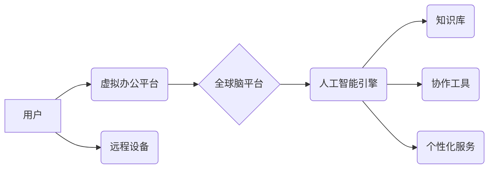

> 虚拟办公，全球脑，远程协作，人工智能，协同计算，分布式系统，云计算，区块链

## 1. 背景介绍

随着科技的飞速发展，远程办公已成为一种越来越普遍的趋势。新冠疫情的爆发更是加速了这一趋势，许多企业和个人开始尝试远程办公模式。然而，传统的远程办公模式存在着诸多局限性，例如沟通效率低下、协作能力不足、信息孤岛等问题。

为了解决这些问题，我们需要探索更加高效、便捷、智能的远程协作模式。而“全球脑”的概念为我们提供了新的思路。

“全球脑”是指通过人工智能、大数据、云计算等技术的融合，构建一个全球范围内的智慧协作平台，实现人类智慧的共享和协同。在这个平台上，每个人都可以成为“脑细胞”，通过网络连接，共同完成复杂的任务。

## 2. 核心概念与联系

### 2.1 全球脑的概念

全球脑是一个由众多个体“脑细胞”组成的分布式智能网络。每个“脑细胞”代表一个拥有独立思考和决策能力的个体，例如人类专家、机器学习模型、传感器等。

通过网络连接，这些“脑细胞”可以共享信息、协同工作，并通过学习和进化不断提升整体智能。

### 2.2 虚拟办公与全球脑的结合

虚拟办公与全球脑的结合，可以构建一个全新的远程协作模式，即“虚拟办公：全球脑驱动的远程协作模式”。

在这个模式下，虚拟办公平台将与全球脑平台进行深度融合，实现以下功能：

* **智能协作:** 利用人工智能技术，自动匹配任务和人员，并提供协作工具和流程，提高协作效率。
* **知识共享:** 建立一个全球范围内的知识库，方便用户共享和获取知识，打破信息孤岛。
* **个性化服务:** 根据用户的需求和工作习惯，提供个性化的办公环境和服务。
* **持续学习:** 通过与全球脑的交互，用户可以不断学习新知识、提升技能，实现个人成长。

### 2.3 架构图



## 3. 核心算法原理 & 具体操作步骤

### 3.1 算法原理概述

虚拟办公：全球脑驱动的远程协作模式的核心算法主要包括：

* **智能任务分配算法:** 根据任务的复杂度、人员的技能和可用时间等因素，智能分配任务给合适的成员。
* **协作流程优化算法:** 分析协作过程中的瓶颈和冗余环节，优化协作流程，提高效率。
* **知识图谱构建算法:** 将知识点和关系进行结构化存储，方便用户搜索和理解。
* **个性化推荐算法:** 根据用户的行为和偏好，推荐相关资源和服务。

### 3.2 算法步骤详解

**智能任务分配算法:**

1. 收集任务信息，包括任务描述、复杂度、所需技能等。
2. 收集人员信息，包括人员技能、可用时间、工作状态等。
3. 利用机器学习算法，构建任务分配模型，预测每个人员完成任务的可能性和效率。
4. 根据模型预测结果，智能分配任务给合适的成员。

**协作流程优化算法:**

1. 收集协作过程中的数据，包括任务执行时间、沟通记录、成员参与度等。
2. 利用数据分析和流程建模技术，分析协作流程中的瓶颈和冗余环节。
3. 设计优化方案，例如简化流程、优化沟通方式、分配任务更合理等。
4. 实施优化方案，并持续监控效果，不断迭代优化。

### 3.3 算法优缺点

**优点:**

* 提高协作效率
* 优化资源分配
* 个性化服务
* 促进知识共享

**缺点:**

* 算法复杂度高
* 数据安全问题
* 人工智能技术发展瓶颈

### 3.4 算法应用领域

* 远程办公
* 项目管理
* 知识管理
* 教育培训
* 医疗诊断

## 4. 数学模型和公式 & 详细讲解 & 举例说明

### 4.1 数学模型构建

**任务分配模型:**

假设有N个任务和M个人员，每个任务有相应的复杂度值$c_i$，每个人员有相应的技能值$s_j$。

任务分配模型的目标是找到一个分配方案，使得总的完成时间最小。

我们可以使用以下数学模型来表示任务分配问题：

$$
min \sum_{i=1}^{N} \frac{c_i}{s_{j_i}}
$$

其中，$j_i$表示第i个任务分配给的第j个人员。

**协作流程优化模型:**

协作流程优化模型可以利用图论和网络分析方法，构建协作流程的网络图，并使用算法分析网络结构，找到优化方案。

### 4.2 公式推导过程

**任务分配模型的优化:**

我们可以使用贪婪算法来解决任务分配问题。

1. 将任务按照复杂度排序，从复杂度最高的开始分配。
2. 对于每个任务，找到技能值最高的可用人员进行分配。

**协作流程优化模型的优化:**

我们可以使用网络流算法来优化协作流程。

1. 将协作流程转化为网络流问题。
2. 使用网络流算法找到最优的流量分配方案。

### 4.3 案例分析与讲解

**任务分配模型案例:**

假设有3个任务和4个人员，任务的复杂度分别为5、3、2，人员的技能值分别为7、5、4、3。

使用贪婪算法，我们可以得到以下任务分配方案：

* 任务1分配给人员1
* 任务2分配给人员2
* 任务3分配给人员3

**协作流程优化模型案例:**

假设一个软件开发项目，协作流程包含多个阶段，例如需求分析、设计、编码、测试等。

我们可以使用网络流算法分析每个阶段的资源分配和时间消耗，找到优化方案，例如调整阶段顺序、分配人员更合理等。

## 5. 项目实践：代码实例和详细解释说明

### 5.1 开发环境搭建

* 操作系统：Ubuntu 20.04
* 编程语言：Python 3.8
* 框架：Flask
* 数据库：MongoDB

### 5.2 源代码详细实现

```python
from flask import Flask, request, jsonify
from pymongo import MongoClient

app = Flask(__name__)

# 连接数据库
client = MongoClient('mongodb://localhost:27017/')
db = client['global_brain']
tasks_collection = db['tasks']

@app.route('/tasks', methods=['POST'])
def create_task():
    data = request.get_json()
    task = {
        'description': data['description'],
        'complexity': data['complexity'],
        'status': 'pending'
    }
    tasks_collection.insert_one(task)
    return jsonify({'message': 'Task created successfully'}), 201

@app.route('/tasks', methods=['GET'])
def get_tasks():
    tasks = tasks_collection.find()
    return jsonify([{'id': task['_id'], 'description': task['description'], 'complexity': task['complexity'], 'status': task['status']} for task in tasks])

if __name__ == '__main__':
    app.run(debug=True)
```

### 5.3 代码解读与分析

* 该代码实现了一个简单的任务管理API，使用Flask框架和MongoDB数据库。
* `/tasks`接口用于创建和获取任务。
* 创建任务时，需要提供任务描述和复杂度信息。
* 获取任务时，会返回所有任务的列表。

### 5.4 运行结果展示

* 运行代码后，访问`http://localhost:5000/tasks`，可以查看所有任务列表。
* 使用`POST`请求发送任务数据到`http://localhost:5000/tasks`，可以创建新的任务。

## 6. 实际应用场景

### 6.1 远程团队协作

虚拟办公：全球脑驱动的远程协作模式可以帮助远程团队更高效地协作。

例如，软件开发团队可以使用该模式进行代码编写、测试和部署，提高协作效率和项目进度。

### 6.2 开源项目开发

开源项目开发通常需要来自全球各地的开发者参与。

虚拟办公：全球脑驱动的远程协作模式可以帮助开源项目更好地组织和管理开发工作，提高项目效率和质量。

### 6.3 教育培训

虚拟办公：全球脑驱动的远程协作模式可以用于在线教育和培训。

例如，教师可以利用该模式与学生进行互动，分享知识和经验，提高教学效果。

### 6.4 未来应用展望

随着人工智能、大数据、云计算等技术的不断发展，虚拟办公：全球脑驱动的远程协作模式将有更广泛的应用场景。

例如，可以应用于医疗诊断、科学研究、金融分析等领域，帮助人类解决更复杂的问题。

## 7. 工具和资源推荐

### 7.1 学习资源推荐

* **书籍:**
    * 《人工智能：一种现代方法》
    * 《深度学习》
    * 《云计算》
* **在线课程:**
    * Coursera
    * edX
    * Udacity

### 7.2 开发工具推荐

* **编程语言:** Python, Java, C++
* **框架:** Flask, Django, Spring Boot
* **数据库:** MongoDB, PostgreSQL, MySQL
* **云平台:** AWS, Azure, Google Cloud

### 7.3 相关论文推荐

* **全球脑概念:**
    * "The Global Brain: A New Paradigm for Understanding Intelligence"
* **人工智能与协作:**
    * "Artificial Intelligence for Collaborative Work"
* **虚拟办公与远程协作:**
    * "Virtual Office: A Review of the Literature"

## 8. 总结：未来发展趋势与挑战

### 8.1 研究成果总结

虚拟办公：全球脑驱动的远程协作模式是一个新兴的领域，已经取得了一些重要的研究成果。

例如，已经开发了一些基于人工智能的协作工具，并成功应用于一些实际场景。

### 8.2 未来发展趋势

未来，虚拟办公：全球脑驱动的远程协作模式将朝着以下方向发展：

* **更智能的协作工具:** 利用更先进的人工智能技术，开发更智能的协作工具，例如自动生成会议记录、自动分配任务等。
* **更个性化的服务:** 根据用户的需求和工作习惯，提供更个性化的服务，例如定制化的办公环境、个性化的学习推荐等。
* **更广泛的应用场景:** 将虚拟办公：全球脑驱动的远程协作模式应用于更多领域，例如医疗诊断、科学研究、金融分析等。

### 8.3 面临的挑战

虚拟办公：全球脑驱动的远程协作模式也面临一些挑战：

* **数据安全问题:** 远程协作需要处理大量敏感数据，如何保证数据安全是一个重要问题。
* **算法复杂度高:** 构建高效的协作算法需要克服算法复杂度高的问题。
* **伦理问题:** 人工智能技术的应用可能会带来一些伦理问题，例如算法偏见、隐私泄露等。

### 8.4 研究展望

未来，我们需要继续深入研究虚拟办公：全球脑驱动的远程协作模式，解决其面临的挑战，并将其应用于更多领域，为人类社会带来更多福祉。

## 9. 附录：常见问题与解答

**Q1: 虚拟办公：全球脑驱动的远程协作模式与传统的远程办公模式有什么区别？**

**A1:** 传统的远程办公模式主要依靠网络连接和协作工具，而虚拟办公：全球脑驱动的远程协作模式则利用人工智能、大数据等技术，构建一个更加智能、高效的协作平台。

**Q2: 虚拟办公：全球脑驱动的远程协作模式