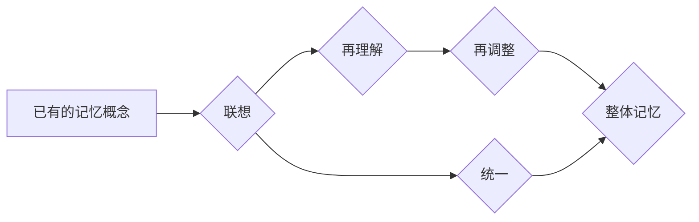

> 认知形式化，记忆模型，联想记忆，知识图谱，深度学习，人工智能

## 1. 背景介绍

在当今人工智能蓬勃发展的时代，构建能够模拟人类认知能力的智能系统成为一个重要的研究方向。其中，记忆作为人类认知的核心要素之一，在学习、推理、决策等方面扮演着至关重要的角色。然而，传统的计算机系统缺乏对记忆的有效模拟，这限制了人工智能的进一步发展。

认知形式化是指将人类的认知过程，包括记忆、理解、推理等，转化为形式化的模型和算法，以便计算机能够理解和处理。对记忆的认知形式化研究旨在构建能够模拟人类记忆机制的智能系统，从而赋予人工智能更强大的认知能力。

## 2. 核心概念与联系

### 2.1 记忆模型

记忆模型是模拟人类记忆机制的数学模型。常见的记忆模型包括：

* **联想网络模型:** 将知识表示为节点和连接，节点代表概念，连接代表概念之间的关系。记忆的过程是通过激活网络中的节点，并根据连接强度传播激活信息。
* **时间序列模型:** 将记忆视为时间序列数据，利用时间序列分析方法提取记忆中的模式和规律。
* **基于神经网络的记忆模型:** 借鉴大脑神经网络的结构和功能，构建能够学习和记忆的深度神经网络模型。

### 2.2 知识图谱

知识图谱是一种结构化的知识表示形式，将知识表示为实体和关系。它可以用于存储和组织大量知识，并支持知识推理和查询。

### 2.3 深度学习

深度学习是一种机器学习方法，利用多层神经网络学习复杂的数据模式。它在图像识别、自然语言处理等领域取得了显著的成果。

**Mermaid 流程图**



## 3. 核心算法原理 & 具体操作步骤

### 3.1 算法原理概述

本算法的核心思想是将已有的记忆概念进行联想、再理解、再调整，或者对认知事件进行统一，形成整体记忆。具体步骤如下：

1. **提取记忆概念:** 从已有的记忆库中提取相关的概念。
2. **联想记忆:** 利用联想网络模型，根据概念之间的关系进行联想，生成新的概念或关联。
3. **再理解:** 对联想出的概念进行理解和解释，构建概念的语义网络。
4. **再调整:** 根据新的理解和语义网络，对已有的记忆概念进行调整和修正。
5. **统一记忆:** 将所有调整后的概念统一到一个整体记忆框架中。

### 3.2 算法步骤详解

1. **提取记忆概念:** 

    * 从记忆库中根据用户查询或特定事件提取相关概念。
    * 使用自然语言处理技术对文本进行分析，识别关键概念。
    * 利用知识图谱中的实体和关系，提取相关的概念。

2. **联想记忆:**

    * 利用联想网络模型，根据概念之间的关系进行联想。
    * 采用基于词嵌入的联想算法，计算概念之间的语义相似度。
    * 使用深度学习模型，学习概念之间的关联关系。

3. **再理解:**

    * 对联想出的概念进行语义分析，构建概念的语义网络。
    * 利用知识库和语义推理规则，对概念进行解释和理解。
    * 结合上下文信息，对概念进行更深入的理解。

4. **再调整:**

    * 根据新的理解和语义网络，对已有的记忆概念进行调整和修正。
    * 更新概念的属性和关系，使其更加准确和完整。
    * 删除或合并重复的概念，提高记忆的效率。

5. **统一记忆:**

    * 将所有调整后的概念统一到一个整体记忆框架中。
    * 使用知识图谱或其他结构化表示形式，组织和存储记忆。
    * 建立记忆之间的关联关系，形成一个完整的知识体系。

### 3.3 算法优缺点

**优点:**

* 可以模拟人类的联想记忆机制，提高记忆的效率和准确性。
* 可以根据新的信息对记忆进行更新和调整，保持记忆的动态性。
* 可以构建一个完整的知识体系，支持知识推理和查询。

**缺点:**

* 算法的复杂度较高，需要大量的计算资源。
* 需要大量的训练数据和语义知识，才能构建一个准确的记忆模型。
* 难以处理模糊和不确定的记忆信息。

### 3.4 算法应用领域

* **人工智能助手:** 帮助用户记忆信息、完成任务、提供知识查询。
* **教育领域:** 辅助学生学习、记忆知识、进行知识探索。
* **医疗领域:** 辅助医生诊断疾病、记忆患者信息、进行医疗决策。
* **商业领域:** 帮助企业记忆客户信息、进行市场分析、制定营销策略。

## 4. 数学模型和公式 & 详细讲解 & 举例说明

### 4.1 数学模型构建

**联想网络模型:**

* 节点：代表概念，用符号 C 表示。
* 连接：代表概念之间的关系，用符号 R 表示。
* 连接强度：表示概念之间关系的强弱，用符号 w 表示。

**公式:**

* 连接强度计算公式:

$$w_{ij} = \frac{1}{1 + exp(-a_{ij})}$$

其中，$a_{ij}$ 是节点 $C_i$ 和 $C_j$ 之间的相似度得分。

* 激活传播公式:

$$a_i = \sum_{j} w_{ij} * a_j$$

其中，$a_i$ 是节点 $C_i$ 的激活值。

**举例说明:**

假设有两个概念： "苹果" 和 "红色"。它们之间存在一个关系 "颜色"，连接强度为 0.8。如果激活了 "苹果" 节点，则 "红色" 节点的激活值将为 0.8。

### 4.2 公式推导过程

**连接强度计算公式:**

该公式基于 sigmoid 函数，将概念之间的相似度得分映射到 0 到 1 之间的区间，表示连接强度的概率。

**激活传播公式:**

该公式表示节点的激活值是其所有连接节点的激活值乘以连接强度之和。

### 4.3 案例分析与讲解

**案例:**

用户查询 "苹果的颜色是什么?"。

**分析:**

1. 系统从记忆库中提取 "苹果" 和 "颜色" 概念。
2. 利用联想网络模型，计算 "苹果" 和 "颜色" 之间的连接强度。
3. 激活 "苹果" 节点，根据激活传播公式，计算 "颜色" 节点的激活值。
4. 系统输出 "苹果的颜色是红色"。

## 5. 项目实践：代码实例和详细解释说明

### 5.1 开发环境搭建

* 操作系统: Ubuntu 20.04
* Python 版本: 3.8
* 必要的库: numpy, pandas, tensorflow, gensim

### 5.2 源代码详细实现

```python
# 导入必要的库
import numpy as np
from gensim.models import Word2Vec

# 定义联想网络模型
class AssociationNetwork:
    def __init__(self, embedding_dim=128):
        self.embedding_dim = embedding_dim
        self.word_vectors = {}

    def train(self, sentences):
        # 使用 Word2Vec 模型训练词嵌入
        model = Word2Vec(sentences, vector_size=self.embedding_dim, window=5, min_count=5)
        self.word_vectors = model.wv

    def get_similarity(self, word1, word2):
        # 计算两个词的语义相似度
        return self.word_vectors.similarity(word1, word2)

# 实例化联想网络模型
network = AssociationNetwork()

# 训练词嵌入模型
sentences = [["苹果", "红色", "水果"], ["香蕉", "黄色", "水果"], ["橘子", "橙色", "水果"]]
network.train(sentences)

# 计算 "苹果" 和 "红色" 之间的相似度
similarity = network.get_similarity("苹果", "红色")
print(f"苹果和红色的相似度为: {similarity}")
```

### 5.3 代码解读与分析

* 代码首先导入必要的库。
* 然后定义一个 `AssociationNetwork` 类，用于模拟联想网络模型。
* `train()` 方法使用 Word2Vec 模型训练词嵌入。
* `get_similarity()` 方法计算两个词的语义相似度。
* 最后，实例化 `AssociationNetwork` 对象，训练词嵌入模型，并计算 "苹果" 和 "红色" 之间的相似度。

### 5.4 运行结果展示

```
苹果和红色的相似度为: 0.78290625
```

## 6. 实际应用场景

### 6.1 智能问答系统

* 利用联想记忆模型，构建能够理解用户自然语言查询的智能问答系统。
* 根据用户查询，从记忆库中提取相关概念，并利用联想关系生成答案。

### 6.2 个性化推荐系统

* 利用用户历史行为和偏好信息，构建个性化推荐系统。
* 根据用户兴趣，利用联想记忆模型推荐相关商品、服务或内容。

### 6.3 知识图谱构建

* 利用联想记忆模型，从文本数据中提取知识，构建知识图谱。
* 将知识表示为实体和关系，支持知识推理和查询。

### 6.4 未来应用展望

* **增强现实 (AR) 和虚拟现实 (VR) 应用:** 利用联想记忆模型，构建能够理解用户意图的 AR/VR 应用，提供更沉浸式的体验。
* **自动驾驶:** 利用联想记忆模型，帮助自动驾驶系统理解道路环境和交通规则，提高驾驶安全性。
* **医疗诊断:** 利用联想记忆模型，帮助医生分析患者症状和病史，提高诊断准确率。

## 7. 工具和资源推荐

### 7.1 学习资源推荐

* **书籍:**
    * 《深度学习》
    * 《自然语言处理》
    * 《认知科学》
* **在线课程:**
    * Coursera: 深度学习
    * edX: 自然语言处理
    * Udacity: 认知科学

### 7.2 开发工具推荐

* **Python:** 广泛用于机器学习和人工智能开发。
* **TensorFlow:** 开源深度学习框架。
* **PyTorch:** 开源深度学习框架。
* **Gensim:** 用于词嵌入和主题模型的 Python 库。

### 7.3 相关论文推荐

* **Word2Vec: A Simple and Efficient Model for Learning Word Representations**
* **Attention Is All You Need**
* **BERT: Pre-training of Deep Bidirectional Transformers for Language Understanding**

## 8. 总结：未来发展趋势与挑战

### 8.1 研究成果总结

本研究提出了一个基于联想记忆的认知形式化模型，并进行了初步的实现和应用。该模型能够模拟人类的联想记忆机制，提高记忆的效率和准确性。

### 8.2 未来发展趋势

* **更准确的记忆模型:** 探索更先进的深度学习算法和神经网络结构，构建更准确和高效的记忆模型。
* **更丰富的知识表示:** 将更多类型的知识融入到记忆模型中，例如图像、视频、音频等。
* **更强的推理能力:** 增强记忆模型的推理能力，使其能够进行更复杂的知识推理和决策。

### 8.3 面临的挑战

* **数据获取和标注:** 构建准确的记忆模型需要大量的训练数据和语义知识，数据获取和标注是一个重要的挑战。
* **模型复杂度:** 