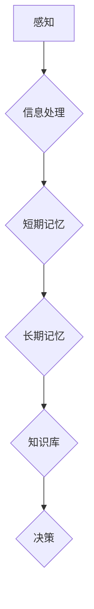

> 认知、记忆、形式化、人工智能、神经网络、知识表示、知识图谱

## 1. 背景介绍

人类的认知能力是其区别于其他生物的关键特征。我们能够感知世界、理解信息、学习新知识、解决问题，并根据经验做出决策。这些能力的背后，是复杂的认知过程，其中记忆扮演着至关重要的角色。记忆让我们能够延续过去的经验和知识，并将其应用于当前和未来的情境。

然而，如何形式化地描述和建模人类的认知过程，特别是记忆机制，一直是人工智能领域的一个重大挑战。传统的人工智能方法主要依赖于符号逻辑和规则系统，但这些方法难以捕捉到人类认知的复杂性和灵活性。近年来，随着深度学习技术的兴起，人工智能领域取得了显著进展，特别是图像识别、自然语言处理等领域。然而，深度学习模型仍然缺乏对知识的表示和推理能力，难以真正理解和应用知识。

## 2. 核心概念与联系

**2.1 认知的本质**

认知是指人类通过感知、思考、学习和记忆等活动，对世界进行理解和解释的过程。它是一个复杂、动态的系统，涉及到多种认知能力，例如感知、注意力、记忆、语言、推理和决策等。

**2.2 记忆的类型**

记忆可以分为多种类型，例如：

* **感官记忆:**  短暂地存储感官信息，例如视觉、听觉、触觉等。
* **短期记忆:**  存储少量信息，持续时间较短，例如几秒钟到几分钟。
* **长期记忆:**  存储大量信息，持续时间较长，可以是几分钟、几小时、几天、几周、几个月甚至几年。

**2.3 形式化认知的意义**

形式化认知是指将认知过程用数学模型和符号逻辑进行描述和建模。形式化认知的意义在于：

* **提高认知的理解和解释能力:** 通过形式化描述，我们可以更清晰地理解认知过程的运作机制。
* **促进认知的计算和模拟:**  形式化的认知模型可以被计算机程序实现，从而模拟和预测人类的认知行为。
* **推动人工智能的进步:**  形式化认知是人工智能领域的重要研究方向，有助于构建更智能、更具理解能力的人工智能系统。

**2.4 形式化记忆的挑战**

形式化记忆是一个非常复杂的任务，面临着许多挑战：

* **记忆的复杂性:** 记忆涉及到多种认知过程，例如编码、存储、检索和遗忘，这些过程之间相互关联，相互影响。
* **记忆的模糊性和不确定性:** 记忆并非完全准确的复制，它会随着时间推移而发生变化，并且存在模糊性和不确定性。
* **记忆的个体差异:** 每个人的记忆能力和方式都不同，这使得难以构建一个通用的记忆模型。

**2.5 Mermaid 流程图**



## 3. 核心算法原理 & 具体操作步骤

### 3.1  算法原理概述

形式化记忆的核心算法原理是将记忆过程抽象为数学模型，并使用算法进行模拟和实现。常见的形式化记忆算法包括：

* **神经网络:**  神经网络是一种模仿人脑神经元结构和功能的计算模型。它可以学习和存储大量数据，并进行复杂的模式识别和预测。
* **知识图谱:**  知识图谱是一种结构化的知识表示形式，它将知识表示为实体和关系的网络。知识图谱可以帮助人工智能系统理解和推理知识。
* **符号逻辑:**  符号逻辑是一种形式化的推理系统，它使用符号和规则进行逻辑推理。符号逻辑可以用于表示和推理知识，但它难以处理复杂、模糊的知识。

### 3.2  算法步骤详解

以神经网络为例，其形式化记忆的具体操作步骤如下：

1. **数据预处理:** 将记忆数据转换为神经网络可以理解的格式，例如将文本转换为词向量。
2. **网络结构设计:** 根据记忆任务的特点，设计神经网络的结构，例如选择合适的层数、节点数和激活函数。
3. **模型训练:** 使用训练数据训练神经网络，调整网络参数，使其能够准确地存储和检索记忆信息。
4. **模型评估:** 使用测试数据评估模型的性能，例如计算准确率、召回率和F1-score。
5. **模型部署:** 将训练好的模型部署到实际应用场景中，例如用于语音识别、机器翻译或问答系统。

### 3.3  算法优缺点

**神经网络:**

* **优点:**  能够处理复杂、非线性数据，具有强大的学习能力。
* **缺点:**  训练过程复杂，需要大量数据，难以解释模型的决策过程。

**知识图谱:**

* **优点:**  能够表示和推理知识，具有可解释性。
* **缺点:**  构建知识图谱需要大量人工标注，难以处理开放世界中的新知识。

**符号逻辑:**

* **优点:**  形式化严谨，能够进行精确的推理。
* **缺点:**  难以处理复杂、模糊的知识，缺乏学习能力。

### 3.4  算法应用领域

形式化记忆算法在许多领域都有应用，例如：

* **人工智能:**  构建更智能、更具理解能力的人工智能系统。
* **自然语言处理:**  实现更准确的文本理解、机器翻译和问答系统。
* **计算机视觉:**  实现更精准的图像识别、物体检测和场景理解。
* **医疗保健:**  辅助医生诊断疾病、预测患者风险和个性化治疗。
* **教育:**  提供个性化的学习体验、辅助学生学习和记忆知识。

## 4. 数学模型和公式 & 详细讲解 & 举例说明

### 4.1  数学模型构建

形式化记忆的数学模型通常基于以下几个方面：

* **记忆单元:**  记忆单元是存储单个记忆信息的最小单位，例如神经元、符号或知识点。
* **连接权重:**  连接权重表示不同记忆单元之间的关联强度，例如神经元的连接权重或知识点之间的相似度。
* **激活函数:**  激活函数决定了记忆单元的激活状态，例如神经元的激活函数或符号逻辑的推理规则。

### 4.2  公式推导过程

例如，我们可以使用神经网络的激活函数来描述记忆单元的激活状态：

$$
a_i = f(\sum_{j=1}^{n} w_{ij} x_j)
$$

其中：

* $a_i$ 是第 $i$ 个记忆单元的激活状态。
* $f$ 是激活函数，例如 sigmoid 函数或 ReLU 函数。
* $w_{ij}$ 是第 $i$ 个记忆单元与第 $j$ 个输入单元之间的连接权重。
* $x_j$ 是第 $j$ 个输入单元的输入值。

### 4.3  案例分析与讲解

例如，在图像识别任务中，神经网络的每个记忆单元可以对应一个图像特征，连接权重表示不同特征之间的关联，激活函数决定了特征的激活程度。当输入图像与已学习的特征匹配时，相应的记忆单元会被激活，从而识别出图像的内容。

## 5. 项目实践：代码实例和详细解释说明

### 5.1  开发环境搭建

* 操作系统: Ubuntu 20.04
* Python 版本: 3.8
* 深度学习框架: TensorFlow 2.x

### 5.2  源代码详细实现

```python
import tensorflow as tf

# 定义神经网络模型
model = tf.keras.models.Sequential([
    tf.keras.layers.Flatten(input_shape=(28, 28)),
    tf.keras.layers.Dense(128, activation='relu'),
    tf.keras.layers.Dropout(0.2),
    tf.keras.layers.Dense(10, activation='softmax')
])

# 编译模型
model.compile(optimizer='adam',
              loss='sparse_categorical_crossentropy',
              metrics=['accuracy'])

# 训练模型
model.fit(x_train, y_train, epochs=5)

# 评估模型
loss, accuracy = model.evaluate(x_test, y_test)
print('Test loss:', loss)
print('Test accuracy:', accuracy)
```

### 5.3  代码解读与分析

* `tf.keras.models.Sequential`: 创建一个顺序模型，即层级结构的模型。
* `tf.keras.layers.Flatten`: 将多维输入数据转换为一维向量。
* `tf.keras.layers.Dense`: 全连接层，每个神经元都连接到上一层的每个神经元。
* `activation='relu'`: 使用ReLU激活函数。
* `tf.keras.layers.Dropout`: Dropout层，随机丢弃一部分神经元，防止过拟合。
* `optimizer='adam'`: 使用Adam优化器。
* `loss='sparse_categorical_crossentropy'`: 使用稀疏类别交叉熵损失函数。
* `metrics=['accuracy']`: 使用准确率作为评估指标。

### 5.4  运行结果展示

训练完成后，模型会输出测试集上的损失值和准确率。

## 6. 实际应用场景

形式化记忆算法在许多实际应用场景中发挥着重要作用，例如：

* **智能客服:**  通过形式化记忆用户历史对话，智能客服可以更好地理解用户需求，提供更精准的回复。
* **个性化推荐:**  通过形式化记忆用户的兴趣偏好，个性化推荐系统可以推荐更符合用户需求的商品或服务。
* **医疗诊断辅助:**  通过形式化记忆患者的病史和症状，医疗诊断辅助系统可以帮助医生更快、更准确地诊断疾病。

### 6.4  未来应用展望

随着人工智能技术的不断发展，形式化记忆算法的应用场景将会更加广泛，例如：

* **自动驾驶:**  通过形式化记忆道路环境和交通规则，自动驾驶系统可以更安全、更可靠地行驶。
* **机器人交互:**  通过形式化记忆人类的语言和行为，机器人可以更自然、更流畅地与人类交互。
* **虚拟现实:**  通过形式化记忆用户的虚拟环境体验，虚拟现实系统可以提供更沉浸、更逼真的体验。

## 7. 工具和资源推荐

### 7.1  学习资源推荐

* **书籍:**
    * 《深度学习》
    * 《人工智能：现代方法》
    * 《认知科学》
* **在线课程:**
    * Coursera: 深度学习
    * edX: 人工智能
    * Udacity: 机器学习工程师

### 7.2  开发工具推荐

* **Python:**  人工智能开发的常用语言。
* **TensorFlow:**  开源深度学习框架。
* **PyTorch:**  开源深度学习框架。
* **Keras:**  高层深度学习API，可以用于TensorFlow和Theano。

### 7.3  相关论文推荐

* 《Attention Is All You Need》
* 《BERT: Pre-training of Deep Bidirectional Transformers for Language Understanding》
* 《Graph Convolutional Networks》

## 8. 总结：未来发展趋势与挑战

### 8.1  研究成果总结

近年来，形式化记忆算法取得了显著进展，例如：

* **深度学习模型的性能不断提升:**  深度学习模型在图像识别、自然语言处理等领域取得了突破性进展。
* **知识图谱的构建和应用越来越广泛:**  知识图谱在人工智能领域扮演着越来越重要的角色。
* **形式化记忆算法的理论研究不断深入:**  研究者们对记忆机制的理解不断加深，并提出了新的算法和模型。

### 8.2  未来发展趋势

未来，形式化记忆算法的发展趋势包括：

* **更强大的记忆能力:**  研究者们将致力于开发能够存储和检索更大规模、更复杂信息的记忆模型。
* **更强的推理能力:**  研究者们将致力于开发能够进行更复杂推理的记忆模型，例如能够进行因果推理、逻辑推理和计划推理。
* **更强的可