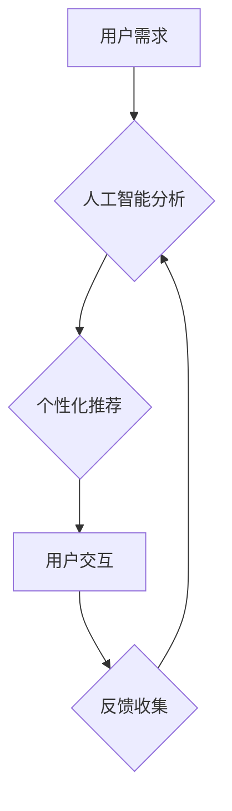

> 用户体验设计，软件2.0，人工智能，自然语言交互，可视化编程，沉浸式体验，个性化定制

## 1. 背景介绍

软件行业正处于一个前所未有的变革时期。传统的软件开发模式正在被颠覆，以用户体验为中心的“软件2.0”时代正在到来。

随着人工智能、自然语言处理、可视化编程等技术的飞速发展，软件不再仅仅是功能的集合，而是需要能够理解用户需求、提供个性化服务、并创造沉浸式体验的智能化系统。

用户体验设计（User Experience Design，简称UXD）在软件2.0时代显得尤为重要。它不再局限于界面设计和交互设计，而是需要从用户的认知、情感、行为等多方面进行全面的考虑，打造更加人性化、便捷、愉悦的软件使用体验。

## 2. 核心概念与联系

**2.1 软件2.0的定义**

软件2.0是指以用户体验为核心，融合人工智能、自然语言交互、可视化编程等新技术的下一代软件。它具有以下特点：

* **智能化:** 软件能够理解用户的意图，并提供个性化的服务和建议。
* **自然化:** 用户与软件的交互更加自然，类似于与人交流。
* **沉浸式:** 软件能够创造出更加逼真、沉浸式的体验。
* **个性化:** 软件能够根据用户的喜好和需求进行定制。

**2.2 用户体验设计（UXD）**

用户体验设计是指通过一系列的设计方法和流程，优化用户与软件的交互体验，使其更加便捷、愉悦和高效。

**2.3 核心概念联系**

软件2.0的本质是将人工智能技术融入到软件开发过程中，从而提升软件的智能化水平，最终实现更加人性化的用户体验。

用户体验设计是实现软件2.0目标的关键环节，它需要从用户的角度出发，深入理解用户的需求和行为模式，并设计出符合用户心理和认知的交互体验。

**2.4 Mermaid 流程图**



## 3. 核心算法原理 & 具体操作步骤

**3.1 算法原理概述**

在软件2.0中，人工智能算法扮演着至关重要的角色。例如，自然语言处理算法可以理解用户的语音和文本输入，而机器学习算法可以根据用户的行为数据进行个性化推荐。

**3.2 算法步骤详解**

以自然语言处理算法为例，其基本步骤包括：

1. **文本预处理:** 清洗和格式化文本数据，例如去除停用词、标点符号等。
2. **词语分词:** 将文本分割成一个个独立的词语。
3. **词向量化:** 将每个词语映射到一个向量空间中，以便进行语义分析。
4. **语义分析:** 利用词向量和语法规则，分析文本的语义内容。
5. **意图识别:** 识别用户表达的意图，例如查询信息、完成任务等。
6. **对话管理:** 根据用户的意图，进行相应的对话处理。

**3.3 算法优缺点**

自然语言处理算法具有以下优点：

* 可以理解人类语言，实现人机自然交互。
* 可以自动提取文本信息，提高信息处理效率。
* 可以根据用户需求进行个性化服务。

但也存在一些缺点：

* 理解复杂语言和上下文信息仍然存在挑战。
* 需要大量的训练数据才能达到较高的准确率。
* 容易受到噪音和歧义的影响。

**3.4 算法应用领域**

自然语言处理算法广泛应用于以下领域：

* **智能客服:** 自动回复用户咨询，提供24小时服务。
* **搜索引擎:** 理解用户搜索意图，提供更精准的搜索结果。
* **机器翻译:** 将文本从一种语言翻译成另一种语言。
* **文本摘要:** 自动生成文本的简要摘要。

## 4. 数学模型和公式 & 详细讲解 & 举例说明

**4.1 数学模型构建**

在软件2.0中，数学模型可以用于描述用户行为、预测用户需求、优化交互体验等。例如，可以使用贝叶斯网络模型来预测用户的下一步操作，或者使用马尔科夫链模型来分析用户的浏览路径。

**4.2 公式推导过程**

以贝叶斯网络模型为例，其核心公式为：

$$P(A|B) = \frac{P(B|A)P(A)}{P(B)}$$

其中：

* $P(A|B)$ 表示在已知事件B发生的情况下，事件A发生的概率。
* $P(B|A)$ 表示在已知事件A发生的情况下，事件B发生的概率。
* $P(A)$ 表示事件A发生的概率。
* $P(B)$ 表示事件B发生的概率。

**4.3 案例分析与讲解**

假设我们有一个电商平台，想要预测用户是否会购买某个商品。我们可以使用贝叶斯网络模型，将用户浏览历史、购买记录、商品属性等信息作为输入，预测用户购买该商品的概率。

## 5. 项目实践：代码实例和详细解释说明

**5.1 开发环境搭建**

为了实现软件2.0的用户体验设计，需要搭建一个合适的开发环境。

* **操作系统:** Linux、macOS 或 Windows
* **编程语言:** Python、Java 或 JavaScript
* **人工智能框架:** TensorFlow、PyTorch 或 Keras
* **数据库:** MySQL、MongoDB 或 PostgreSQL

**5.2 源代码详细实现**

以下是一个简单的自然语言处理代码示例，使用Python和NLTK库实现文本分词功能：

```python
import nltk

# 下载 NLTK 词典
nltk.download('punkt')

# 文本内容
text = "今天天气很好，适合出去散步。"

# 分词
tokens = nltk.word_tokenize(text)

# 打印分词结果
print(tokens)
```

**5.3 代码解读与分析**

这段代码首先使用`nltk.download('punkt')`下载NLTK词典，然后使用`nltk.word_tokenize(text)`函数对文本进行分词，并将结果存储在`tokens`变量中。最后，打印分词结果。

**5.4 运行结果展示**

运行这段代码后，输出结果为：

```
['今天', '天气', '很好', ',', '适合', '出去', '散步', '.']
```

## 6. 实际应用场景

**6.1 智能客服**

智能客服系统可以利用自然语言处理技术，自动回复用户咨询，提供24小时服务。例如，用户可以向智能客服询问产品信息、订单状态等问题，智能客服可以根据预先设定的规则和知识库，自动提供准确的答案。

**6.2 个性化推荐**

软件2.0可以根据用户的行为数据和偏好，提供个性化的推荐服务。例如，电商平台可以根据用户的浏览历史和购买记录，推荐用户可能感兴趣的商品；音乐平台可以根据用户的听歌习惯，推荐用户可能喜欢的歌曲。

**6.3 沉浸式体验**

软件2.0可以利用虚拟现实（VR）和增强现实（AR）技术，创造出更加沉浸式的体验。例如，游戏玩家可以身临其境地体验游戏场景；设计师可以利用AR技术，在现实世界中预览设计方案。

**6.4 未来应用展望**

软件2.0的应用场景还在不断扩展，未来将更加深入地融入到我们的生活各个方面。例如，智能家居、自动驾驶汽车、远程医疗等领域都将受益于软件2.0技术的应用。

## 7. 工具和资源推荐

**7.1 学习资源推荐**

* **书籍:**
    * 《深度学习》
    * 《自然语言处理》
    * 《人机交互》
* **在线课程:**
    * Coursera
    * edX
    * Udacity

**7.2 开发工具推荐**

* **人工智能框架:** TensorFlow、PyTorch、Keras
* **自然语言处理库:** NLTK、spaCy、Gensim
* **可视化编程工具:** Blockly、Scratch

**7.3 相关论文推荐**

* 《Attention Is All You Need》
* 《BERT: Pre-training of Deep Bidirectional Transformers for Language Understanding》
* 《Generative Adversarial Networks》

## 8. 总结：未来发展趋势与挑战

**8.1 研究成果总结**

软件2.0的研发取得了显著成果，人工智能技术在软件开发中得到广泛应用，用户体验也得到了显著提升。

**8.2 未来发展趋势**

未来，软件2.0将朝着更加智能化、个性化、沉浸式的方向发展。例如，

* 人工智能技术将更加成熟，能够更好地理解用户的需求和行为。
* 自然语言交互将更加自然流畅，用户与软件的交互体验将更加便捷。
* 虚拟现实和增强现实技术将更加普及，创造出更加逼真、沉浸式的体验。

**8.3 面临的挑战**

软件2.0的发展也面临着一些挑战，例如：

* 如何确保人工智能算法的安全性、可靠性和公平性。
* 如何保护用户的隐私和数据安全。
* 如何让软件2.0更加易于使用和理解。

**8.4 研究展望**

未来，我们需要继续加强对软件2.0的研究和探索，推动其技术创新和应用推广，为用户创造更加便捷、愉悦、智能的软件体验。

## 9. 附录：常见问题与解答

**9.1 如何学习软件2.0相关知识？**

可以参考文章中推荐的书籍、在线课程和论文。

**9.2 如何参与软件2.0的开发？**

可以关注相关开源项目，或者加入软件2.0相关的社区和论坛。

**9.3 软件2.0对未来社会有什么影响？**

软件2.0将深刻地改变我们的生活方式，带来更加智能化、便捷化、个性化的体验。


作者：禅与计算机程序设计艺术 / Zen and the Art of Computer Programming 
<end_of_turn>