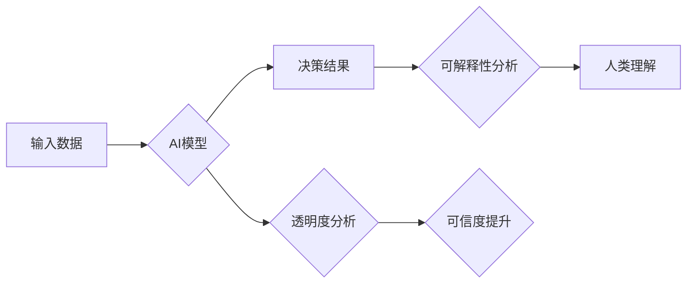

>人工智能，透明度，可解释性，信任，模型解释，可视化，伦理

## 1. 背景介绍

人工智能（AI）正以惊人的速度发展，在各个领域展现出巨大的潜力。从医疗诊断到金融预测，从自动驾驶到个性化推荐，AI正在改变着我们的生活。然而，随着AI技术的日益成熟，其黑盒性质也引发了越来越多的担忧。

AI模型通常是复杂的算法组合，其决策过程难以被人类理解。这导致了对AI系统决策的信任度下降，也阻碍了AI技术的广泛应用。例如，在医疗领域，医生可能难以接受由不可解释的AI模型进行的诊断建议，而金融机构也可能担心AI系统在风险评估中的潜在偏差。

为了解决这一问题，透明度和可解释性成为AI领域研究的热点。透明度是指AI系统决策过程的可追踪性和可审计性，而可解释性是指AI系统决策结果的可理解性和可解释性。

## 2. 核心概念与联系

**2.1 透明度**

透明度是指AI系统决策过程的可见性和可追踪性。这意味着我们可以了解AI系统是如何接收输入、处理信息、生成输出的。

**2.2 可解释性**

可解释性是指AI系统决策结果的可理解性和可解释性。这意味着我们可以理解AI系统为什么做出特定的决策，以及决策背后的逻辑和推理过程。

**2.3 联系**

透明度和可解释性是相互关联的，但并非完全等同。透明度提供了AI系统决策过程的“地图”，而可解释性则提供了“指南”。

**Mermaid 流程图**



## 3. 核心算法原理 & 具体操作步骤

**3.1 算法原理概述**

可解释性算法旨在揭示AI模型决策背后的逻辑和推理过程。常见的可解释性算法包括：

* **局部解释方法:** 例如LIME（Local Interpretable Model-Agnostic Explanations）和SHAP（SHapley Additive exPlanations），它们通过构建简单的模型来解释单个预测结果。
* **全局解释方法:** 例如特征重要性分析和决策树可视化，它们试图解释模型整体的决策逻辑。

**3.2 算法步骤详解**

以LIME为例，其步骤如下：

1. **选择一个预测实例:** 
2. **生成 perturbed 数据集:** 对该实例进行微小扰动，生成一个新的数据集。
3. **训练一个简单模型:** 在 perturbed 数据集上训练一个简单模型，例如线性回归。
4. **解释模型预测:** 分析简单模型的权重和系数，解释其对预测结果的影响。

**3.3 算法优缺点**

**优点:**

* 可以提供对单个预测结果的解释。
* 可以应用于各种类型的AI模型。

**缺点:**

* 解释结果可能难以理解。
* 局部解释方法可能无法捕捉到全局的决策逻辑。

**3.4 算法应用领域**

可解释性算法在医疗诊断、金融风险评估、法律判决等领域具有广泛的应用前景。

## 4. 数学模型和公式 & 详细讲解 & 举例说明

**4.1 数学模型构建**

假设我们有一个AI模型f(x)，其中x是输入数据，f(x)是输出预测结果。

**4.2 公式推导过程**

LIME算法的目标是找到一个简单的模型g(x)来近似f(x)在某个特定实例x0附近。

LIME使用以下公式计算g(x)的权重：

$$
w_i = \frac{exp(-(f(x_i) - f(x_0))^2 / 2\sigma^2)}{\sum_{j} exp(-(f(x_j) - f(x_0))^2 / 2\sigma^2)}
$$

其中：

* $x_i$ 是 perturbed 数据集中的实例。
* $f(x_i)$ 是模型f(x)在实例$x_i$上的预测结果。
* $\sigma$ 是一个控制扰动程度的参数。

**4.3 案例分析与讲解**

假设我们有一个AI模型用于预测房价，我们想要解释模型对某个特定房子的预测结果。

我们可以使用LIME算法生成一个 perturbed 数据集，其中每个实例都是该房子的微小扰动版本。然后，我们训练一个简单模型（例如线性回归）在 perturbed 数据集上，并分析其权重和系数。

例如，如果模型的权重表明“卧室数量”对预测结果影响很大，则我们可以推断出模型认为该房子的卧室数量是导致高房价的主要因素。

## 5. 项目实践：代码实例和详细解释说明

**5.1 开发环境搭建**

* Python 3.6+
* TensorFlow 2.0+
* scikit-learn 0.22+
* Jupyter Notebook

**5.2 源代码详细实现**

```python
import tensorflow as tf
from lime import lime_tabular

# 加载模型
model = tf.keras.models.load_model('my_model.h5')

# 准备数据
data = ...

# 使用LIME解释模型预测
explainer = lime_tabular.LimeTabularExplainer(data, feature_names=feature_names)
explanation = explainer.explain_instance(data_point, model.predict, top_labels=1)

# 可视化解释结果
explanation.as_list()
explanation.as_pyplot_figure()
```

**5.3 代码解读与分析**

* 首先，我们加载模型和准备数据。
* 然后，我们使用LIME算法解释模型对某个特定数据点的预测结果。
* 最后，我们使用LIME提供的函数可视化解释结果。

**5.4 运行结果展示**

运行代码后，我们将得到一个可视化的解释结果，例如：

* 特征重要性：哪些特征对预测结果影响最大。
* 决策边界：模型如何将数据点分类。

## 6. 实际应用场景

**6.1 医疗诊断**

可解释性AI可以帮助医生理解AI模型的诊断建议，提高对AI系统的信任度。

**6.2 金融风险评估**

可解释性AI可以帮助金融机构理解AI模型的风险评估结果，降低潜在的风险。

**6.3 自动驾驶**

可解释性AI可以帮助自动驾驶系统解释其决策过程，提高安全性。

**6.4 未来应用展望**

随着AI技术的不断发展，可解释性AI将应用于越来越多的领域，例如法律判决、教育教学、科学研究等。

## 7. 工具和资源推荐

**7.1 学习资源推荐**

* **书籍:**
    * "Interpretable Machine Learning" by Christoph Molnar
    * "The Master Algorithm" by Pedro Domingos
* **在线课程:**
    * Coursera: "Machine Learning" by Andrew Ng
    * edX: "Artificial Intelligence" by Columbia University

**7.2 开发工具推荐**

* **LIME:** https://github.com/marcotcr/lime
* **SHAP:** https://github.com/slundberg/shap
* **TensorBoard:** https://www.tensorflow.org/tensorboard

**7.3 相关论文推荐**

* "Local Interpretable Model-Agnostic Explanations" by Ribeiro et al. (2016)
* "SHAP: A Unified Approach to Interpreting Model Predictions" by Lundberg et al. (2017)

## 8. 总结：未来发展趋势与挑战

**8.1 研究成果总结**

近年来，AI可解释性研究取得了显著进展，涌现出多种可解释性算法和工具。这些算法和工具为理解AI模型决策过程提供了新的视角，也推动了AI技术的应用推广。

**8.2 未来发展趋势**

* **更强大的可解释性算法:** 研究人员将继续开发更强大的可解释性算法，能够解释更复杂的AI模型。
* **更易于理解的解释结果:** 研究人员将致力于开发更易于理解的解释结果，使非技术人员也能理解AI模型的决策过程。
* **自动化可解释性分析:** 研究人员将探索自动化可解释性分析的方法，使可解释性分析成为AI开发流程的一部分。

**8.3 面临的挑战**

* **可解释性与准确性之间的权衡:** 某些可解释性算法可能会牺牲一定的准确性以换取可解释性。
* **不同领域的可解释性需求:** 不同领域对可解释性的需求可能不同，需要开发针对不同领域的可解释性方法。
* **可解释性标准的制定:** 目前尚缺乏统一的可解释性标准，需要制定更完善的可解释性评估指标。

**8.4 研究展望**

未来，AI可解释性研究将继续朝着更强大、更易于理解、更自动化方向发展，为AI技术的广泛应用提供坚实的理论基础和技术支撑。

## 9. 附录：常见问题与解答

**9.1 Q: 为什么需要AI可解释性？**

**A:** AI可解释性可以帮助我们理解AI模型的决策过程，提高对AI系统的信任度，并帮助我们发现潜在的偏差和错误。

**9.2 Q: 如何评估AI模型的可解释性？**

**A:** 目前尚缺乏统一的可解释性标准，但一些常用的评估指标包括准确性、鲁棒性、可理解性等。

**9.3 Q: 哪些AI模型更容易解释？**

**A:** 规则型模型和线性模型更容易解释，而深度神经网络等复杂模型则更难解释。

作者：禅与计算机程序设计艺术 / Zen and the Art of Computer Programming


<end_of_turn>