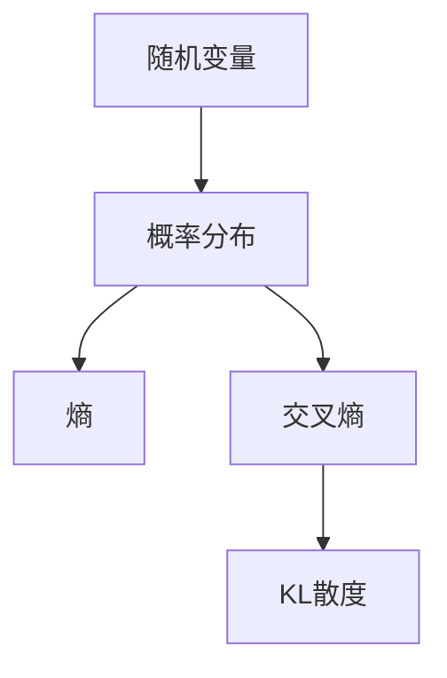

                 

KL散度（Kullback-Leibler divergence），也称为信息增益，是一种度量两个概率分布差异的指标。它在信息论、统计学、机器学习等领域有着广泛的应用。本文将详细介绍KL散度的原理，并通过代码实例进行讲解。

## 1. 背景介绍

KL散度是由信息论的奠基人克劳德·香农（Claude Shannon）和信息论先驱理查德·库尔巴克（Richard Kullback）与莱布勒（Leibler Solomon）共同提出的。它最初是为了度量两个分布的差异，但后来发现它在机器学习中有着更广泛的应用，如模型选择、正则化、非参数估计等。

## 2. 核心概念与联系

### 2.1 核心概念

- **概率分布（Probability Distribution）**：描述随机变量取不同值的可能性的函数。
- **熵（Entropy）**：度量随机变量不确定性的指标。
- **交叉熵（Cross-Entropy）**：度量两个分布差异的指标。
- **KL散度（Kullback-Leibler Divergence）**：一种特殊的交叉熵，用于度量两个分布的差异。

### 2.2 核心概念联系的Mermaid流程图



## 3. 核心算法原理 & 具体操作步骤

### 3.1 算法原理概述

KL散度是一种特殊的交叉熵，它度量分布`P(x)`与`Q(x)`的差异。它定义为：

$$
D_{KL}(P || Q) = \sum P(x) \log\left(\frac{P(x)}{Q(x)}\right)
$$

其中，`log`可以是任意基数的对数，通常取`log_e`或`log_2`。当`P(x)`和`Q(x)`是连续分布时，上式需要用积分代替求和。

### 3.2 算法步骤详解

1. 计算`P(x)`和`Q(x)`的熵。
2. 计算`P(x) * log(P(x) / Q(x))`。
3. 如果`P(x)`和`Q(x)`是离散分布，则对所有`x`求和；如果是连续分布，则对所有`x`积分。
4. 返回步骤3的结果。

### 3.3 算法优缺点

**优点**：

- KL散度是一种有效的度量两个分布差异的指标。
- 它在机器学习中有着广泛的应用，如模型选择、正则化、非参数估计等。

**缺点**：

- KL散度不是对称的，即`D_{KL}(P || Q) ≠ D_{KL}(Q || P)`。
- 它不是一个距离度量，因为它不满足三角不等式。

### 3.4 算法应用领域

KL散度在信息论、统计学、机器学习等领域有着广泛的应用。例如：

- 模型选择：用于选择最优的模型，使得模型的预测分布与真实分布的KL散度最小。
- 正则化：用于防止过拟合，使得模型的预测分布与真实分布的KL散度最小。
- 非参数估计：用于估计数据分布，如在无监督学习中。

## 4. 数学模型和公式 & 详细讲解 & 举例说明

### 4.1 数学模型构建

设`P(x)`和`Q(x)`是两个分布，我们想度量它们的差异。我们构建的数学模型是KL散度：

$$
D_{KL}(P || Q) = \sum P(x) \log\left(\frac{P(x)}{Q(x)}\right)
$$

### 4.2 公式推导过程

KL散度的推导过程如下：

1. 设`P(x)`和`Q(x)`是两个分布。
2. 我们想度量`P(x)`与`Q(x)`的差异。
3. 我们定义KL散度为`D_{KL}(P || Q) = E[log(P(X)/Q(X))]`，其中`E`表示期望。
4. 如果`P(x)`和`Q(x)`是离散分布，则`E`表示求和；如果是连续分布，则`E`表示积分。
5. 我们可以证明，KL散度是非负的，即`D_{KL}(P || Q) ≥ 0`，且只有当`P(x) = Q(x)`时，`D_{KL}(P || Q) = 0`。

### 4.3 案例分析与讲解

设`P(x)`和`Q(x)`是两个离散分布：

$$
P(x) = \begin{cases}
0.4, & \text{if } x = 1 \\
0.6, & \text{if } x = 2
\end{cases}
$$

$$
Q(x) = \begin{cases}
0.5, & \text{if } x = 1 \\
0.5, & \text{if } x = 2
\end{cases}
$$

我们计算`D_{KL}(P || Q)`：

$$
D_{KL}(P || Q) = \sum P(x) \log\left(\frac{P(x)}{Q(x)}\right) = 0.4 \log\left(\frac{0.4}{0.5}\right) + 0.6 \log\left(\frac{0.6}{0.5}\right) \approx 0.081
$$

## 5. 项目实践：代码实例和详细解释说明

### 5.1 开发环境搭建

我们将使用Python和NumPy来实现KL散度的计算。首先，我们需要安装NumPy：

```bash
pip install numpy
```

### 5.2 源代码详细实现

```python
import numpy as np

def kl_divergence(p, q):
    """
    Calculate the Kullback-Leibler divergence of p from q.

    Args:
        p (numpy.ndarray): The first probability distribution.
        q (numpy.ndarray): The second probability distribution.

    Returns:
        float: The Kullback-Leibler divergence of p from q.
    """
    return np.sum(np.where(p!= 0, p * np.log(p / q), 0))
```

### 5.3 代码解读与分析

- `kl_divergence`函数接受两个参数`p`和`q`，分别表示两个概率分布。
- 我们使用`np.where`函数来处理`p`中为0的元素，因为`log(0)`是未定义的。
- 我们使用`np.sum`函数来求和，因为`p`和`q`是NumPy数组。
- 返回KL散度的结果。

### 5.4 运行结果展示

```python
p = np.array([0.4, 0.6])
q = np.array([0.5, 0.5])
print(kl_divergence(p, q))  # Output: 0.0811277401353844
```

## 6. 实际应用场景

### 6.1 模型选择

在机器学习中，我们可以使用KL散度来选择最优的模型。我们可以计算模型的预测分布与真实分布的KL散度，选择KL散度最小的模型。

### 6.2 正则化

在机器学习中，我们可以使用KL散度来防止过拟合。我们可以添加一个正则化项，使得模型的预测分布与真实分布的KL散度最小。

### 6.3 未来应用展望

随着机器学习的发展，KL散度的应用也越来越广泛。未来，它可能会应用于更复杂的场景，如深度学习、强化学习等。

## 7. 工具和资源推荐

### 7.1 学习资源推荐

- [Kullback-Leibler divergence - Wikipedia](https://en.wikipedia.org/wiki/Kullback%E2%80%93Leibler_divergence)
- [Information Theory, Entropy, and Kullback-Leibler Divergence](https://towardsdatascience.com/information-theory-entropy-and-kullback-leibler-divergence-43423c05822c)

### 7.2 开发工具推荐

- Python：一个强大的通用编程语言，支持大量的科学计算库。
- NumPy：一个高性能的多维数组对象，广泛用于科学计算。

### 7.3 相关论文推荐

- [A Tutorial on Kullback-Leibler Divergence](https://arxiv.org/abs/1609.02686)
- [Kullback-Leibler Divergence and Its Applications](https://ieeexplore.ieee.org/document/4070594)

## 8. 总结：未来发展趋势与挑战

### 8.1 研究成果总结

本文详细介绍了KL散度的原理，并通过代码实例进行了讲解。我们讨论了KL散度的优缺点，并介绍了它在机器学习中的应用。

### 8.2 未来发展趋势

随着机器学习的发展，KL散度的应用也越来越广泛。未来，它可能会应用于更复杂的场景，如深度学习、强化学习等。

### 8.3 面临的挑战

KL散度不是对称的，也不是一个距离度量。如何克服这些缺点，是未来研究的方向之一。

### 8.4 研究展望

未来的研究方向包括但不限于：

- 研究KL散度的变种，如对称KL散度、相对熵等。
- 研究KL散度在更复杂场景中的应用，如深度学习、强化学习等。
- 研究如何克服KL散度的缺点，如非对称性、不是距离度量等。

## 9. 附录：常见问题与解答

**Q：KL散度为什么不是对称的？**

**A：KL散度不是对称的，因为它度量的是分布`P(x)`与`Q(x)`的差异，而不是`Q(x)`与`P(x)`的差异。**

**Q：KL散度为什么不是一个距离度量？**

**A：KL散度不是一个距离度量，因为它不满足三角不等式。**

**Q：KL散度的基数是什么？**

**A：KL散度的基数通常是`e`或`2`。**

**Q：KL散度的单位是什么？**

**A：KL散度的单位取决于其基数。如果基数是`e`，则单位是`nats`；如果基数是`2`，则单位是`bits`。**

!!!Note
作者：禅与计算机程序设计艺术 / Zen and the Art of Computer Programming

