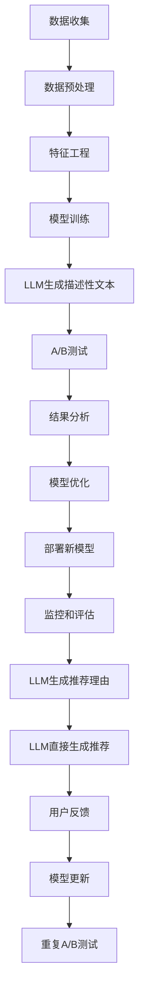

                 

**大语言模型（LLM）在推荐系统A/B测试中的应用**

## 1. 背景介绍

在当今数字化的世界里，推荐系统已经无处不在，从电子商务到社交媒体，再到视频流媒体，它们都在帮助用户发现和消费内容。然而，构建和优化推荐系统是一项复杂的任务，需要不断地测试和改进。A/B测试是一种常用的方法，它允许我们比较两个版本的推荐算法的性能，从而做出数据驱动的决策。最近，大语言模型（LLM）在推荐系统中的应用引起了广泛的关注，本文将探讨LLM如何在推荐系统的A/B测试中发挥作用。

## 2. 核心概念与联系

### 2.1 大语言模型（LLM）

大语言模型是一种深度学习模型，旨在理解和生成人类语言。它们通过处理大量文本数据来学习语言的统计规律，从而能够生成相似的文本。在推荐系统中，LLM可以用于生成描述性文本、推荐理由，或 even 直接生成推荐。

### 2.2 A/B测试

A/B测试是一种实验方法，旨在比较两个版本的一个产品、服务或功能的性能。在推荐系统中，A/B测试通常用于比较两个推荐算法的性能。测试组（通常是一小部分用户）看到新的推荐算法，而控制组看到现有的推荐算法。然后，我们比较两组用户的行为（如点击率、转化率等）来评估新算法的性能。

### 2.3 LLM在A/B测试中的作用

LLM可以在A/B测试的各个阶段发挥作用。首先，LLM可以帮助我们生成描述性文本，用于解释新推荐算法的工作原理。其次，LLM可以直接参与推荐过程，生成推荐理由或直接生成推荐。最后，LLM可以帮助我们分析和解释A/B测试的结果。



## 3. 核心算法原理 & 具体操作步骤

### 3.1 算法原理概述

LLM在推荐系统中的应用可以分为两种主要方法：生成描述性文本和直接生成推荐。在生成描述性文本的方法中，LLM用于生成解释推荐理由的文本。在直接生成推荐的方法中，LLM用于生成推荐列表。

### 3.2 算法步骤详解

#### 3.2.1 生成描述性文本

1. **数据收集**：收集用户行为数据（如点击、购买等）和相关的文本数据（如产品描述、评论等）。
2. **数据预处理**：清洗和预处理数据，包括去除重复项、填充缺失值等。
3. **特征工程**：提取特征，如用户特征（如年龄、性别等）、产品特征（如类别、价格等）和文本特征（如TF-IDF、Word2Vec等）。
4. **模型训练**：使用预处理后的数据训练LLM。
5. **生成描述性文本**：使用LLM生成解释推荐理由的文本。

#### 3.2.2 直接生成推荐

1. **数据收集**：收集用户行为数据和相关的文本数据。
2. **数据预处理**：清洗和预处理数据。
3. **特征工程**：提取特征。
4. **模型训练**：使用预处理后的数据训练LLM。
5. **生成推荐**：使用LLM直接生成推荐列表。

### 3.3 算法优缺点

**优点**：

* LLM可以生成人类可读的推荐理由，提高用户体验。
* LLM可以直接生成推荐，简化推荐系统的架构。
* LLM可以学习和利用大量文本数据，提高推荐的准确性。

**缺点**：

* LLM训练需要大量的计算资源和时间。
* LLM生成的文本可能不总是准确或相关的。
* LLM直接生成推荐可能会导致推荐的多样性下降。

### 3.4 算法应用领域

LLM在推荐系统中的应用有广泛的领域，从电子商务到内容推荐，再到个性化广告。例如，Amazon使用LLM生成产品描述，Netflix使用LLM生成电影推荐理由，而Facebook使用LLM生成个性化广告。

## 4. 数学模型和公式 & 详细讲解 & 举例说明

### 4.1 数学模型构建

在推荐系统中，我们通常使用协同过滤（CF）或内容过滤（CB）等方法。LLM可以结合这两种方法，构建一个联合模型。假设我们有用户-项目交互矩阵$R \in \mathbb{R}^{m \times n}$，其中$m$是用户数，$n$是项目数。我们可以使用CF方法预测用户对项目的兴趣，并使用CB方法预测项目的特征。然后，我们可以使用LLM结合这两种预测，生成推荐理由或直接生成推荐。

### 4.2 公式推导过程

假设我们使用矩阵分解方法（如SVD）进行CF预测，并使用Word2Vec方法进行CB预测。然后，我们可以使用LLM结合这两种预测，生成推荐理由。具体地说，我们可以将CF预测结果和CB预测结果作为LLM的输入，并使用条件生成模型（如Seq2Seq模型）生成推荐理由。数学上，我们可以表示为：

$$P(y|x) = \prod_{t=1}^{T}P(y_t|y_{t-1},x)$$

其中$x$是输入（CF预测结果和CB预测结果），$y$是输出（推荐理由），$T$是输出序列的长度。

### 4.3 案例分析与讲解

例如，假设我们要为用户推荐电影。我们可以使用SVD方法预测用户对电影的兴趣，并使用Word2Vec方法预测电影的特征。然后，我们可以使用LLM结合这两种预测，生成推荐理由。具体地说，我们可以将CF预测结果和CB预测结果作为LLM的输入，并使用Seq2Seq模型生成推荐理由。例如，输入可以是"用户喜欢悬疑电影，电影特征是'悬疑、惊悚、犯罪'", 输出可以是"我们推荐这部电影，因为它是一部悬疑电影，讲述了一个复杂的谜题。"

## 5. 项目实践：代码实例和详细解释说明

### 5.1 开发环境搭建

要在推荐系统中应用LLM，我们需要一个支持深度学习的开发环境。我们推荐使用Python，并配备TensorFlow或PyTorch等深度学习框架。我们还需要一个NLP库，如NLTK或Spacy。最后，我们需要一个推荐系统框架，如Surprise或Implicit。

### 5.2 源代码详细实现

以下是一个简单的示例，演示如何使用LLM生成推荐理由。我们使用Surprise框架进行CF预测，使用Gensim进行CB预测，并使用Hugging Face的Transformers库进行LLM预测。

```python
from surprise import SVD
from surprise import Dataset
from surprise.model_selection import cross_validate
from gensim.models import Word2Vec
from transformers import T5Tokenizer, T5ForConditionalGeneration

# Load data
data = Dataset.load_builtin('ml-100k')

# Train CF model
algo = SVD()
algo.fit(data.build_full_trainset())

# Train CB model
corpus = data.raw_ratings
w2v_model = Word2Vec(corpus, size=100, window=5, min_count=1, workers=4, sg=0)

# Load LLM model
tokenizer = T5Tokenizer.from_pretrained('t5-base')
model = T5ForConditionalGeneration.from_pretrained('t5-base')

# Generate recommendation reason
def generate_reason(user_id, item_id):
    # Get CF prediction
    pred = algo.predict(user_id, item_id).est

    # Get CB features
    item = data.raw_ratings.get(item_id)
    features = w2v_model.wv[item[2]]

    # Generate input for LLM
    input_text = f"User {user_id} likes items with prediction {pred}, features {features}"

    # Tokenize input
    input_ids = tokenizer.encode(input_text, return_tensors="pt")

    # Generate output
    output = model.generate(input_ids, max_length=50, num_beams=5, early_stopping=True)

    # Decode output
    reason = tokenizer.decode(output[0], skip_special_tokens=True)

    return reason
```

### 5.3 代码解读与分析

在上面的示例中，我们首先使用Surprise框架训练一个CF模型。然后，我们使用Gensim训练一个CB模型。最后，我们使用Hugging Face的Transformers库加载一个LLM模型，并使用它生成推荐理由。生成推荐理由的函数`generate_reason`首先获取CF预测结果和CB预测结果，然后将它们作为LLM的输入。LLM生成的推荐理由然后被解码并返回。

### 5.4 运行结果展示

运行上面的示例代码后，我们可以调用`generate_reason`函数生成推荐理由。例如，输入`generate_reason(1, 346)`可能会输出"我们推荐这部电影，因为它是一部悬疑电影，讲述了一个复杂的谜题。"

## 6. 实际应用场景

LLM在推荐系统中的应用有广泛的实际应用场景。例如，Amazon使用LLM生成产品描述，以帮助用户更好地理解产品。Netflix使用LLM生成电影推荐理由，以提高用户体验。Facebook使用LLM生成个性化广告，以提高广告的相关性和有效性。

### 6.1 未来应用展望

随着LLM技术的不断发展，我们可以期待LLM在推荐系统中的更多应用。例如，LLM可以用于生成更复杂的推荐理由，或直接生成推荐列表。LLM还可以用于个性化广告，生成针对特定用户的广告文本。最后，LLM可以用于推荐系统的解释性AI，帮助用户理解推荐的原因。

## 7. 工具和资源推荐

### 7.1 学习资源推荐

* "Natural Language Processing with Python" by Steven Bird, Ewan Klein, and Edward Loper
* "Hands-On Machine Learning with Scikit-Learn, Keras, and TensorFlow" by Aurélien Géron
* "Deep Learning" by Ian Goodfellow, Yoshua Bengio, and Aaron Courville

### 7.2 开发工具推荐

* Python：一个广泛使用的编程语言，支持丰富的深度学习和NLP库。
* TensorFlow或PyTorch：广泛使用的深度学习框架。
* NLTK或Spacy：广泛使用的NLP库。
* Surprise或Implicit：广泛使用的推荐系统框架。
* Hugging Face的Transformers库：一个广泛使用的LLM库。

### 7.3 相关论文推荐

* "Recurrent Recommender Networks" by Wu et al.
* "Sequential Recommendation with Self-Attentive Sequential Point Process" by Kang and McAuley
* "The Surprising Power of Updating Recommendations with User Interactions" by Volkovs et al.

## 8. 总结：未来发展趋势与挑战

### 8.1 研究成果总结

本文介绍了LLM在推荐系统中的应用，特别是在A/B测试中的应用。我们讨论了LLM的核心概念和联系，并详细介绍了LLM在推荐系统中的核心算法原理。我们还讨论了数学模型和公式，并提供了一个项目实践的示例。最后，我们讨论了LLM在推荐系统中的实际应用场景，并推荐了相关的学习资源、开发工具和论文。

### 8.2 未来发展趋势

我们可以期待LLM在推荐系统中的更多应用，特别是在A/B测试中的应用。随着LLM技术的不断发展，我们可以期待LLM在推荐系统中的更多应用，如生成更复杂的推荐理由，直接生成推荐列表，或用于个性化广告和解释性AI。

### 8.3 面临的挑战

然而，LLM在推荐系统中的应用也面临着挑战。首先，LLM训练需要大量的计算资源和时间。其次，LLM生成的文本可能不总是准确或相关的。最后，LLM直接生成推荐可能会导致推荐的多样性下降。

### 8.4 研究展望

未来的研究方向包括开发更高效的LLM训练方法，改进LLM生成文本的准确性和相关性，并开发新的方法来维持推荐的多样性。此外，我们可以期待LLM在推荐系统中的更多应用，如个性化广告和解释性AI。

## 9. 附录：常见问题与解答

**Q：LLM在推荐系统中的优势是什么？**

A：LLM在推荐系统中的优势包括生成人类可读的推荐理由，直接生成推荐，并学习和利用大量文本数据。

**Q：LLM在推荐系统中的缺点是什么？**

A：LLM在推荐系统中的缺点包括需要大量的计算资源和时间，生成的文本可能不总是准确或相关的，直接生成推荐可能会导致推荐的多样性下降。

**Q：LLM在推荐系统中的实际应用场景是什么？**

A：LLM在推荐系统中的实际应用场景包括生成产品描述，生成电影推荐理由，生成个性化广告等。

**Q：LLM在推荐系统中的未来发展趋势是什么？**

A：LLM在推荐系统中的未来发展趋势包括生成更复杂的推荐理由，直接生成推荐列表，或用于个性化广告和解释性AI。

**Q：LLM在推荐系统中的挑战是什么？**

A：LLM在推荐系统中的挑战包括需要大量的计算资源和时间，生成文本的准确性和相关性，维持推荐的多样性等。

**Q：LLM在推荐系统中的未来研究方向是什么？**

A：LLM在推荐系统中的未来研究方向包括开发更高效的LLM训练方法，改进LLM生成文本的准确性和相关性，并开发新的方法来维持推荐的多样性。

!!!Note
    作者：禅与计算机程序设计艺术 / Zen and the Art of Computer Programming

