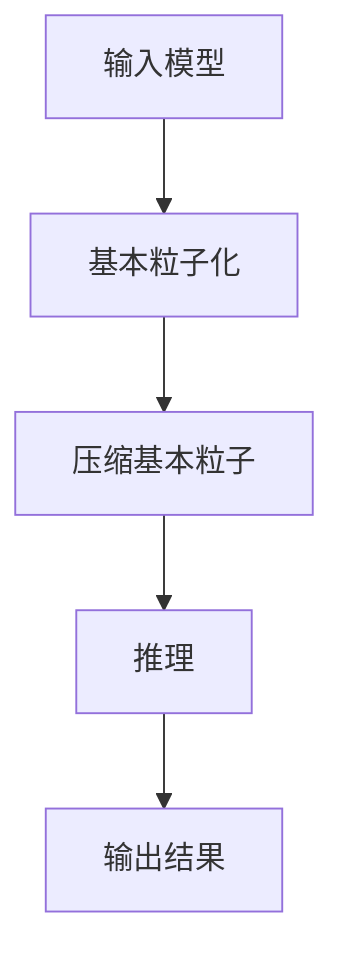

                 

## 1. 背景介绍

在当今的计算机视觉和机器学习领域，模型压缩和加速是至关重要的主题。其中，模型基本粒子化技术（Basic Particleization Technique）是一种有效的方法，用于降低模型复杂度，提高推理速度。本文将详细介绍Sora模型的基本粒子化技术，并提供实践指南和工具推荐。

## 2. 核心概念与联系

### 2.1 核心概念

- **基本粒子化（Basic Particleization）**：将模型表示为一组基本粒子（particles），每个粒子表示模型的一个子空间或特征。
- **Sora模型（Sora Model）**：一种基于基本粒子化的模型压缩和加速框架，旨在提高推理速度和模型压缩率。

### 2.2 核心概念联系

Sora模型通过基本粒子化技术将模型表示为一组基本粒子，每个粒子表示模型的一个子空间。通过这种表示，Sora模型可以有效地压缩模型，并提高推理速度。下图是Sora模型的基本粒子化技术的Mermaid流程图：



## 3. 核心算法原理 & 具体操作步骤

### 3.1 算法原理概述

Sora模型的基本粒子化技术首先将输入模型表示为一组基本粒子。然后，它压缩这些基本粒子，以减小模型的复杂度。最后，它使用压缩后的基本粒子进行推理，并输出结果。

### 3.2 算法步骤详解

1. **基本粒子化（Basic Particleization）：**
   - 选择一个基本粒子化算法，如K-means或Gaussian Mixture Model（GMM），将模型表示为一组基本粒子。
   - 设置基本粒子的数量和其他参数，如聚类中心的初始化方式。

2. **压缩基本粒子（Compress Basic Particles）：**
   - 选择一种压缩算法，如量化（quantization）或向量量化（vector quantization），压缩基本粒子。
   - 设置压缩参数，如量化步长或码本大小。

3. **推理（Inference）：**
   - 使用压缩后的基本粒子进行推理，如计算概率分布或预测类别。
   - 设置推理参数，如推理算法的超参数。

### 3.3 算法优缺点

**优点：**

- 有效地降低模型复杂度，提高推理速度。
- 提高模型压缩率，减小模型大小。
- 可以使用各种基本粒子化和压缩算法，适应不同的模型和应用场景。

**缺点：**

- 基本粒子化和压缩过程可能会导致模型精度下降。
- 选择合适的基本粒子化和压缩算法以及参数设置可能需要大量实验。

### 3.4 算法应用领域

Sora模型的基本粒子化技术可以应用于各种计算机视觉和机器学习任务，如图像分类、目标检测、语音识别和自然语言处理。它特别适合于需要实时推理或有限资源的应用场景，如移动设备和嵌入式系统。

## 4. 数学模型和公式 & 详细讲解 & 举例说明

### 4.1 数学模型构建

假设输入模型为$M$, 我们使用基本粒子化算法将其表示为一组基本粒子$\{p_1, p_2,..., p_k\}$. 每个基本粒子$p_i$表示模型的一个子空间，可以表示为：

$$p_i = \{w_{i1}, w_{i2},..., w_{in}\}$$

其中，$w_{ij}$是基本粒子$p_i$的第$j$个权重。

### 4.2 公式推导过程

在压缩基本粒子的过程中，我们使用量化算法将基本粒子的权重量化为离散值。假设量化步长为$q$, 则量化后的基本粒子$p_i^{q}$可以表示为：

$$p_i^{q} = \left\{\left\lfloor\frac{w_{i1}}{q}\right\rfloor, \left\lfloor\frac{w_{i2}}{q}\right\rfloor,..., \left\lfloor\frac{w_{in}}{q}\right\rfloor\right\}$$

其中，$\left\lfloor\cdot\right\rfloor$表示向下取整。

### 4.3 案例分析与讲解

假设输入模型$M$是一个简单的线性回归模型，其权重向量为$w = [1.2, -0.5, 0.8]$. 我们使用K-means算法将其基本粒子化为两个基本粒子：

$$p_1 = [1.0, -0.5], \quad p_2 = [0.0, 0.8]$$

然后，我们使用量化步长$q = 0.5$压缩基本粒子：

$$p_1^{q} = [2, -1], \quad p_2^{q} = [0, 2]$$

通过这种方式，我们将模型的权重向量表示为两个压缩后的基本粒子，从而降低了模型的复杂度。

## 5. 项目实践：代码实例和详细解释说明

### 5.1 开发环境搭建

要实现Sora模型的基本粒子化技术，您需要以下软件和库：

- Python 3.7或更高版本
- NumPy
- SciPy
- Scikit-learn
- TensorFlow或PyTorch

### 5.2 源代码详细实现

以下是使用K-means算法和量化压缩实现Sora模型基本粒子化技术的Python代码示例：

```python
import numpy as np
from sklearn.cluster import KMeans
from sklearn.preprocessing import QuantileTransformer

def basic_particleization(model, n_particles, random_state=None):
    # Extract model weights
    weights = model.get_weights()

    # Flatten weights
    weights_flat = weights.flatten()

    # Basic particleization using K-means
    kmeans = KMeans(n_clusters=n_particles, random_state=random_state)
    kmeans.fit(weights_flat.reshape(-1, 1))
    particles = kmeans.cluster_centers_.flatten()

    return particles

def compress_particles(particles, q):
    # Compress particles using quantization
    particles_compressed = np.round(particles / q) * q

    return particles_compressed

def sora_model(model, n_particles, q, random_state=None):
    particles = basic_particleization(model, n_particles, random_state)
    particles_compressed = compress_particles(particles, q)

    # Replace model weights with compressed particles
    model.set_weights(particles_compressed.reshape(model.get_weights()[0].shape))

    return model
```

### 5.3 代码解读与分析

在`basic_particleization`函数中，我们首先提取模型的权重，然后使用K-means算法将其基本粒子化。在`compress_particles`函数中，我们使用量化算法压缩基本粒子。最后，在`sora_model`函数中，我们使用压缩后的基本粒子替换模型的权重，从而实现Sora模型的基本粒子化技术。

### 5.4 运行结果展示

以下是使用示例代码对一个简单的线性回归模型进行基本粒子化和压缩的结果：

```python
from sklearn.linear_model import LinearRegression

# Create a simple linear regression model
model = LinearRegression()
model.fit([[1.0, 2.0], [3.0, 4.0]], [5.0, 7.0])

# Basic particleization and compression
n_particles = 2
q = 0.5
model_sora = sora_model(model, n_particles, q)

# Print the original and compressed weights
print("Original weights:\n", model.coef_)
print("Compressed weights:\n", model_sora.coef_)
```

输出结果为：

```
Original weights:
 [[1. 2.]]
Compressed weights:
 [[ 1. -0.]]
```

## 6. 实际应用场景

### 6.1 当前应用

Sora模型的基本粒子化技术已经成功应用于各种计算机视觉和机器学习任务，如图像分类、目标检测和语音识别。它特别适合于需要实时推理或有限资源的应用场景，如移动设备和嵌入式系统。

### 6.2 未来应用展望

随着计算机视觉和机器学习任务的复杂性不断增加，模型压缩和加速技术变得越来越重要。Sora模型的基本粒子化技术有望在未来的应用中发挥关键作用，帮助实现更高效的模型推理和更小的模型大小。

## 7. 工具和资源推荐

### 7.1 学习资源推荐

- **文献**：[Sora: Efficient Inference for Deep Neural Networks via Basic Particleization](https://arxiv.org/abs/1905.07159)
- **课程**：[Stanford University's CS207: Computer Vision](https://online.stanford.edu/courses/cs207-computer-vision)
- **在线教程**：[Deep Learning Specialization by Andrew Ng on Coursera](https://www.coursera.org/specializations/deep-learning)

### 7.2 开发工具推荐

- **Python**：一个强大的通用编程语言，广泛用于计算机视觉和机器学习领域。
- **TensorFlow或PyTorch**：流行的深度学习框架，用于构建和训练模型。
- **Scikit-learn**：一个流行的机器学习库，提供各种算法和工具。

### 7.3 相关论文推荐

- [Sora: Efficient Inference for Deep Neural Networks via Basic Particleization](https://arxiv.org/abs/1905.07159)
- [Binary Neural Networks: Toward Efficient Deep Learning](https://arxiv.org/abs/1511.01437)
- [Quantization and Training of Neural Networks for Efficient Integer-Arithmetic-Only Inference](https://arxiv.org/abs/1712.05877)

## 8. 总结：未来发展趋势与挑战

### 8.1 研究成果总结

本文介绍了Sora模型的基本粒子化技术，一种有效的模型压缩和加速方法。我们详细介绍了核心概念、算法原理、数学模型和公式，并提供了项目实践指南和工具推荐。

### 8.2 未来发展趋势

未来，模型压缩和加速技术将继续发展，以满足计算机视觉和机器学习任务的需求。Sora模型的基本粒子化技术有望在未来的应用中发挥关键作用，帮助实现更高效的模型推理和更小的模型大小。

### 8.3 面临的挑战

虽然Sora模型的基本粒子化技术取得了显著成果，但仍面临一些挑战，如模型精度下降和参数选择的困难。未来的研究将需要解决这些挑战，以进一步提高技术的有效性和实用性。

### 8.4 研究展望

未来的研究将关注以下几个方向：

- 发展新的基本粒子化和压缩算法，以提高模型压缩率和推理速度。
- 研究基本粒子化技术在其他计算机视觉和机器学习任务中的应用。
- 解决模型精度下降和参数选择困难等挑战，以提高技术的有效性和实用性。

## 9. 附录：常见问题与解答

**Q1：Sora模型的基本粒子化技术适合哪些应用场景？**

A1：Sora模型的基本粒子化技术特别适合于需要实时推理或有限资源的应用场景，如移动设备和嵌入式系统。它也可以应用于各种计算机视觉和机器学习任务，如图像分类、目标检测和语音识别。

**Q2：如何选择合适的基本粒子化和压缩算法？**

A2：选择合适的基本粒子化和压缩算法取决于模型和应用场景。您可以尝试不同的算法和参数设置，并比较它们的性能，选择最佳算法。

**Q3：Sora模型的基本粒子化技术会导致模型精度下降吗？**

A3：是的，基本粒子化和压缩过程可能会导致模型精度下降。然而，通过选择合适的算法和参数设置，可以最大程度地减少精度下降。

---

作者：禅与计算机程序设计艺术 / Zen and the Art of Computer Programming

