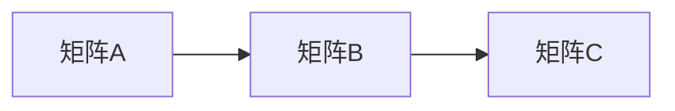

> Tensor计算，深度学习，张量，矩阵乘法，自动微分，梯度下降，神经网络

## 1. 背景介绍

深度学习近年来取得了令人瞩目的成就，在图像识别、自然语言处理、语音识别等领域展现出强大的能力。这些成就的背后离不开强大的计算基础——Tensor计算。Tensor计算是一种高效的数学运算方式，为深度学习模型的训练和推理提供了坚实的基础。

传统的计算机程序以标量和向量为基本数据类型，而Tensor计算则将张量作为基本数据类型。张量是一种多维数组，可以表示各种复杂的数据结构，例如图像、音频、文本等。Tensor计算利用矩阵乘法、加法等基本运算，对张量进行高效的处理，从而实现深度学习模型的复杂计算。

## 2. 核心概念与联系

### 2.1 张量

张量是深度学习的核心数据结构，它是一种多维数组，可以表示各种复杂的数据结构。

* **标量:** 0维张量，是一个单独的数字。
* **向量:** 1维张量，是一个一列数字。
* **矩阵:** 2维张量，是一个二维数组。
* **三维张量:** 可以表示图像数据，其中每个像素点对应一个数字。
* **更高维张量:** 可以表示更复杂的结构，例如视频、音频等。

### 2.2 矩阵乘法

矩阵乘法是Tensor计算的基础运算之一，它用于将两个矩阵组合成一个新的矩阵。



### 2.3 自动微分

自动微分是Tensor计算的关键技术之一，它可以自动计算Tensor的梯度。梯度是深度学习模型训练中重要的信息，它指示模型参数需要调整的方向和幅度。

### 2.4 梯度下降

梯度下降是一种常用的优化算法，它利用梯度信息来更新模型参数，从而使模型的损失函数最小化。

## 3. 核心算法原理 & 具体操作步骤

### 3.1 算法原理概述

Tensor计算的核心算法是基于矩阵乘法和自动微分的。通过将深度学习模型的计算表示为一系列的张量运算，可以利用GPU等硬件加速器进行高效的计算。

### 3.2 算法步骤详解

1. **数据预处理:** 将原始数据转换为适合Tensor计算的格式。
2. **模型构建:** 使用TensorFlow、PyTorch等深度学习框架构建深度学习模型。
3. **张量运算:** 将模型的计算表示为一系列的张量运算，例如矩阵乘法、加法、激活函数等。
4. **自动微分:** 利用自动微分技术计算张量运算的梯度。
5. **梯度下降:** 使用梯度下降算法更新模型参数，从而使模型的损失函数最小化。
6. **模型评估:** 使用测试数据评估模型的性能。

### 3.3 算法优缺点

**优点:**

* **高效性:** Tensor计算可以利用GPU等硬件加速器进行高效的计算。
* **可扩展性:** Tensor计算可以轻松扩展到处理大规模数据和复杂模型。
* **灵活性:** Tensor计算可以表示各种复杂的数据结构和模型架构。

**缺点:**

* **学习曲线:** Tensor计算的学习曲线相对陡峭，需要一定的数学和编程基础。
* **资源消耗:** Tensor计算需要大量的计算资源，例如GPU和内存。

### 3.4 算法应用领域

Tensor计算广泛应用于各种深度学习领域，例如：

* **图像识别:** 用于识别图像中的物体、场景和人脸。
* **自然语言处理:** 用于文本分类、机器翻译、问答系统等。
* **语音识别:** 用于将语音转换为文本。
* **推荐系统:** 用于推荐用户感兴趣的内容。
* **药物发现:** 用于预测药物的活性。

## 4. 数学模型和公式 & 详细讲解 & 举例说明

### 4.1 数学模型构建

深度学习模型通常可以表示为一个多层神经网络，每个神经元接收多个输入，并通过一个激活函数进行处理，输出一个结果。

### 4.2 公式推导过程

* **线性变换:** 每个神经元接收多个输入，并通过一个权重矩阵进行线性变换。

$$
y = Wx + b
$$

其中：

* $y$ 是神经元的输出。
* $x$ 是输入向量。
* $W$ 是权重矩阵。
* $b$ 是偏置项。

* **激活函数:** 线性变换后的结果通过一个激活函数进行非线性处理。常见的激活函数包括ReLU、Sigmoid、Tanh等。

$$
a = f(y)
$$

其中：

* $a$ 是激活后的输出。
* $f$ 是激活函数。

* **损失函数:** 深度学习模型的训练目标是最小化损失函数，损失函数衡量模型预测结果与真实结果之间的差异。常见的损失函数包括均方误差、交叉熵等。

$$
L(y, \hat{y})
$$

其中：

* $y$ 是真实值。
* $\hat{y}$ 是模型预测值。

### 4.3 案例分析与讲解

例如，一个简单的图像分类模型可以由一个卷积层、一个池化层和一个全连接层组成。卷积层使用卷积核对图像进行卷积运算，提取图像特征。池化层对卷积层的输出进行降维，减少计算量。全连接层将池化层的输出进行分类。

## 5. 项目实践：代码实例和详细解释说明

### 5.1 开发环境搭建

使用Python语言和深度学习框架TensorFlow或PyTorch进行开发。

### 5.2 源代码详细实现

```python
import tensorflow as tf

# 定义模型
model = tf.keras.models.Sequential([
    tf.keras.layers.Conv2D(32, (3, 3), activation='relu', input_shape=(28, 28, 1)),
    tf.keras.layers.MaxPooling2D((2, 2)),
    tf.keras.layers.Flatten(),
    tf.keras.layers.Dense(10, activation='softmax')
])

# 编译模型
model.compile(optimizer='adam',
              loss='sparse_categorical_crossentropy',
              metrics=['accuracy'])

# 训练模型
model.fit(x_train, y_train, epochs=5)

# 评估模型
loss, accuracy = model.evaluate(x_test, y_test)
print('Test loss:', loss)
print('Test accuracy:', accuracy)
```

### 5.3 代码解读与分析

* **模型定义:** 使用`tf.keras.models.Sequential`定义一个顺序模型，包含卷积层、池化层和全连接层。
* **模型编译:** 使用`model.compile`编译模型，指定优化器、损失函数和评价指标。
* **模型训练:** 使用`model.fit`训练模型，传入训练数据和训练轮数。
* **模型评估:** 使用`model.evaluate`评估模型，传入测试数据并打印测试损失和测试准确率。

### 5.4 运行结果展示

训练完成后，可以将模型应用于新的图像数据进行分类。

## 6. 实际应用场景

Tensor计算在深度学习领域有着广泛的应用场景，例如：

* **图像识别:** 用于识别图像中的物体、场景和人脸。
* **自然语言处理:** 用于文本分类、机器翻译、问答系统等。
* **语音识别:** 用于将语音转换为文本。
* **推荐系统:** 用于推荐用户感兴趣的内容。
* **药物发现:** 用于预测药物的活性。

### 6.4 未来应用展望

随着深度学习技术的不断发展，Tensor计算的应用场景将会更加广泛，例如：

* **自动驾驶:** 用于感知周围环境、规划路径和控制车辆。
* **医疗诊断:** 用于辅助医生诊断疾病、预测患者病情。
* **金融风险管理:** 用于识别金融风险、预测市场波动。

## 7. 工具和资源推荐

### 7.1 学习资源推荐

* **TensorFlow官方文档:** https://www.tensorflow.org/
* **PyTorch官方文档:** https://pytorch.org/
* **深度学习书籍:** 《深度学习》、《动手学深度学习》

### 7.2 开发工具推荐

* **TensorFlow:** https://www.tensorflow.org/
* **PyTorch:** https://pytorch.org/
* **Jupyter Notebook:** https://jupyter.org/

### 7.3 相关论文推荐

* **AlexNet:** http://papers.nips.cc/paper/4824-imagenet-classification-with-deep-convolutional-neural-networks.pdf
* **VGGNet:** http://arxiv.org/abs/1409.1556
* **ResNet:** http://arxiv.org/abs/1512.03385

## 8. 总结：未来发展趋势与挑战

### 8.1 研究成果总结

Tensor计算为深度学习的发展提供了坚实的基础，推动了深度学习在各个领域的应用。

### 8.2 未来发展趋势

* **更高效的计算方法:** 研究更有效的Tensor计算方法，例如稀疏计算、量子计算等。
* **更强大的模型架构:** 设计更强大的深度学习模型架构，例如Transformer、Graph Neural Networks等。
* **更广泛的应用场景:** 将Tensor计算应用于更多领域，例如自动驾驶、医疗诊断、金融风险管理等。

### 8.3 面临的挑战

* **计算资源需求:** Tensor计算需要大量的计算资源，例如GPU和内存。
* **模型可解释性:** 深度学习模型的决策过程难以解释，这限制了其在一些领域应用的推广。
* **数据隐私问题:** 深度学习模型的训练需要大量数据，这可能会引发数据隐私问题。

### 8.4 研究展望

未来，Tensor计算将会继续发展，推动深度学习技术的进步，并应用于更多领域，为人类社会带来更多福祉。

## 9. 附录：常见问题与解答

### 9.1 如何选择合适的Tensor计算框架？

选择Tensor计算框架需要根据具体应用场景和个人需求进行考虑。TensorFlow和PyTorch是目前最流行的深度学习框架，各有优缺点。

### 9.2 如何优化Tensor计算的效率？

可以采用以下方法优化Tensor计算的效率：

* 使用GPU加速计算。
* 使用稀疏计算方法。
* 优化模型架构。
* 减少模型参数数量。

### 9.3 如何解决Tensor计算中的数据隐私问题？

可以使用以下方法解决Tensor计算中的数据隐私问题：

* 使用联邦学习方法。
* 使用差分隐私技术。
* 使用同态加密技术。


作者：禅与计算机程序设计艺术 / Zen and the Art of Computer Programming 
<end_of_turn>