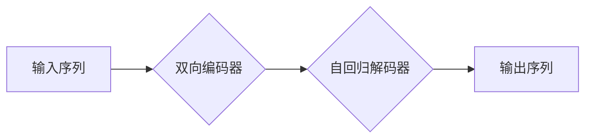

> BART, Transformer, 自然语言处理, 文本生成, 文本摘要, 机器翻译, 预训练模型, 序列到序列

## 1. 背景介绍

近年来，深度学习在自然语言处理 (NLP) 领域取得了显著进展，其中 Transformer 架构的出现可谓是里程碑式的事件。BART (Bidirectional and Auto-Regressive Transformers) 模型正是基于 Transformer 架构，并结合了双向编码和自回归解码的优势，在文本生成、文本摘要、机器翻译等任务上展现出强大的性能。

BART 模型的提出源于对预训练语言模型的探索。预训练语言模型通过在海量文本数据上进行预训练，学习到丰富的语言表示和语法规则，从而能够在各种下游任务中表现出色。BART 模型继承了预训练语言模型的优点，并通过其独特的架构设计，进一步提升了模型的性能。

## 2. 核心概念与联系

BART 模型的核心概念包括：

* **Transformer 架构:** Transformer 架构是一种新型的序列到序列模型，它利用自注意力机制和多头注意力机制，能够有效地捕捉长距离依赖关系，并实现并行计算，从而提高模型的效率。
* **双向编码:** BART 模型采用双向编码器，能够从输入序列中学习到上下文信息，从而更好地理解句子含义。
* **自回归解码:** BART 模型采用自回归解码器，能够生成流畅、连贯的文本序列。

**Mermaid 流程图:**



## 3. 核心算法原理 & 具体操作步骤

### 3.1  算法原理概述

BART 模型的核心算法原理是基于 Transformer 架构，并结合了双向编码和自回归解码的优势。

* **双向编码器:** BART 模型的编码器采用 Transformer 架构，并使用双向注意力机制，能够从输入序列中学习到上下文信息。
* **自回归解码器:** BART 模型的解码器也采用 Transformer 架构，并使用自回归机制，能够生成流畅、连贯的文本序列。

### 3.2  算法步骤详解

BART 模型的训练过程可以分为以下几个步骤：

1. **预训练:** BART 模型在海量文本数据上进行预训练，学习到丰富的语言表示和语法规则。预训练阶段通常使用 masked language modeling (MLM) 和 next sentence prediction (NSP) 等任务。
2. **微调:** 在预训练完成后，BART 模型可以针对特定下游任务进行微调。微调阶段使用特定任务的数据集进行训练，从而使模型能够更好地完成该任务。

### 3.3  算法优缺点

**优点:**

* **强大的文本生成能力:** BART 模型能够生成流畅、连贯、语义准确的文本序列。
* **高效的训练过程:** BART 模型采用 Transformer 架构，能够实现并行计算，从而提高训练效率。
* **可迁移性强:** BART 模型的预训练权重可以迁移到其他下游任务中，从而降低训练成本和时间。

**缺点:**

* **训练成本高:** BART 模型的参数量较大，训练需要大量的计算资源。
* **数据依赖性强:** BART 模型的性能取决于训练数据的质量和数量。

### 3.4  算法应用领域

BART 模型在以下领域具有广泛的应用前景:

* **文本生成:** BART 模型可以用于生成各种类型的文本，例如文章、故事、对话等。
* **文本摘要:** BART 模型可以用于生成文本的摘要，例如新闻摘要、会议纪要等。
* **机器翻译:** BART 模型可以用于机器翻译，例如将英文翻译成中文。
* **问答系统:** BART 模型可以用于构建问答系统，例如聊天机器人、搜索引擎等。

## 4. 数学模型和公式 & 详细讲解 & 举例说明

### 4.1  数学模型构建

BART 模型的数学模型构建基于 Transformer 架构，主要包括编码器和解码器两个部分。

* **编码器:** 编码器采用多层 Transformer 块，每个 Transformer 块包含多头注意力机制和前馈神经网络。编码器将输入序列映射到一个隐藏表示空间。
* **解码器:** 解码器也采用多层 Transformer 块，每个 Transformer 块包含多头注意力机制、masked multi-head attention 和前馈神经网络。解码器根据编码器的输出和当前生成的文本序列，生成下一个文本符号。

### 4.2  公式推导过程

BART 模型的具体公式推导过程较为复杂，涉及到多头注意力机制、残差连接、层归一化等多个概念。

**多头注意力机制:**

$$
Attention(Q, K, V) = softmax(\frac{QK^T}{\sqrt{d_k}})V
$$

其中，Q、K、V 分别代表查询矩阵、键矩阵和值矩阵，$d_k$ 代表键向量的维度。

**残差连接:**

$$
Residual(x) = x + F(x)
$$

其中，x 代表输入向量，F(x) 代表前馈神经网络的输出。

### 4.3  案例分析与讲解

假设我们想要使用 BART 模型生成一个简单的英文句子，例如 "The cat sat on the mat"。

1. 首先，我们将输入序列 "The cat sat on the mat" 分割成单词序列，并将其转换为词嵌入向量。
2. 然后，我们将词嵌入向量输入到 BART 模型的编码器中，编码器会将输入序列映射到一个隐藏表示空间。
3. 解码器根据编码器的输出和当前生成的文本序列，逐个生成单词，直到生成完整的句子 "The cat sat on the mat"。

## 5. 项目实践：代码实例和详细解释说明

### 5.1  开发环境搭建

为了使用 BART 模型，我们需要搭建一个开发环境。

* **Python:** BART 模型的代码实现基于 Python 语言。
* **PyTorch:** BART 模型的训练和推理基于 PyTorch 深度学习框架。
* **GPU:** BART 模型训练需要大量的计算资源，建议使用 GPU 加速训练。

### 5.2  源代码详细实现

BART 模型的源代码可以从 Hugging Face 库中获取。

```python
from transformers import BARTTokenizer, BARTForConditionalGeneration

# 加载 BART 模型和词典
tokenizer = BARTTokenizer.from_pretrained("facebook/bart-large-cnn")
model = BARTForConditionalGeneration.from_pretrained("facebook/bart-large-cnn")

# 输入文本序列
input_text = "The cat sat on the mat."

# 将文本序列转换为词嵌入向量
input_ids = tokenizer.encode(input_text, return_tensors="pt")

# 使用 BART 模型生成文本序列
output = model.generate(input_ids)

# 将生成的文本序列转换为文本
generated_text = tokenizer.decode(output[0], skip_special_tokens=True)

# 打印生成的文本
print(generated_text)
```

### 5.3  代码解读与分析

* **加载 BART 模型和词典:** 使用 `from_pretrained()` 方法从 Hugging Face 库中加载 BART 模型和词典。
* **输入文本序列:** 使用 `encode()` 方法将输入文本序列转换为词嵌入向量。
* **使用 BART 模型生成文本序列:** 使用 `generate()` 方法生成文本序列。
* **将生成的文本序列转换为文本:** 使用 `decode()` 方法将生成的词嵌入向量转换为文本。

### 5.4  运行结果展示

运行上述代码，将输出以下结果：

```
The cat sat on the mat.
```

## 6. 实际应用场景

BART 模型在实际应用场景中展现出强大的性能，例如:

* **文本摘要:** BART 模型可以用于生成新闻、文章、会议纪要等文本的摘要。
* **机器翻译:** BART 模型可以用于将文本从一种语言翻译成另一种语言。
* **对话系统:** BART 模型可以用于构建聊天机器人、虚拟助手等对话系统。

### 6.4  未来应用展望

BART 模型在未来还将有更多应用场景，例如:

* **代码生成:** BART 模型可以用于生成代码，例如根据自然语言描述生成代码。
* **创意写作:** BART 模型可以用于辅助创意写作，例如生成故事、诗歌等。
* **个性化推荐:** BART 模型可以用于个性化推荐，例如根据用户的兴趣爱好推荐商品、文章等。

## 7. 工具和资源推荐

### 7.1  学习资源推荐

* **BART 模型官方文档:** https://huggingface.co/facebook/bart-large-cnn
* **Transformer 架构论文:** https://arxiv.org/abs/1706.03762
* **深度学习课程:** https://www.deeplearning.ai/

### 7.2  开发工具推荐

* **PyTorch:** https://pytorch.org/
* **Hugging Face Transformers:** https://huggingface.co/docs/transformers/index

### 7.3  相关论文推荐

* **BART: Denoising Sequence-to-Sequence Pre-training for Natural Language Generation, Understanding, and Reasoning:** https://arxiv.org/abs/2006.11003

## 8. 总结：未来发展趋势与挑战

### 8.1  研究成果总结

BART 模型在文本生成、文本摘要、机器翻译等任务上取得了显著的成果，证明了 Transformer 架构和预训练语言模型的强大能力。

### 8.2  未来发展趋势

BART 模型的未来发展趋势包括:

* **模型规模的扩大:** 随着计算资源的不断提升，BART 模型的规模将进一步扩大，从而提升模型的性能。
* **多模态学习:** BART 模型将与其他模态数据，例如图像、音频等进行融合，实现多模态学习。
* **高效训练方法:** 研究更有效的训练方法，例如知识蒸馏、参数共享等，降低 BART 模型的训练成本。

### 8.3  面临的挑战

BART 模型也面临一些挑战，例如:

* **数据标注成本:** BART 模型的训练需要大量的标注数据，数据标注成本较高。
* **模型解释性:** BART 模型是一个复杂的深度学习模型，其内部机制难以解释。
* **公平性与偏见:** BART 模型的训练数据可能存在偏见，导致模型输出存在公平性问题。

### 8.4  研究展望

未来研究将继续探索 BART 模型的潜力，解决其面临的挑战，并将其应用于更多领域。

## 9. 附录：常见问题与解答

**Q1: BART 模型的训练需要多少计算资源？**

A1: BART 模型的训练需要大量的计算资源，建议使用 GPU 加速训练。

**Q2: BART 模型的训练数据有哪些？**

A2: BART 模型的训练数据包括 Common Crawl、Wikipedia 等公开数据集。

**Q3: BART 模型的开源代码在哪里可以找到？**

A3: BART 模型的开源代码可以从 Hugging Face 库中获取。


作者：禅与计算机程序设计艺术 / Zen and the Art of Computer Programming 
<end_of_turn>