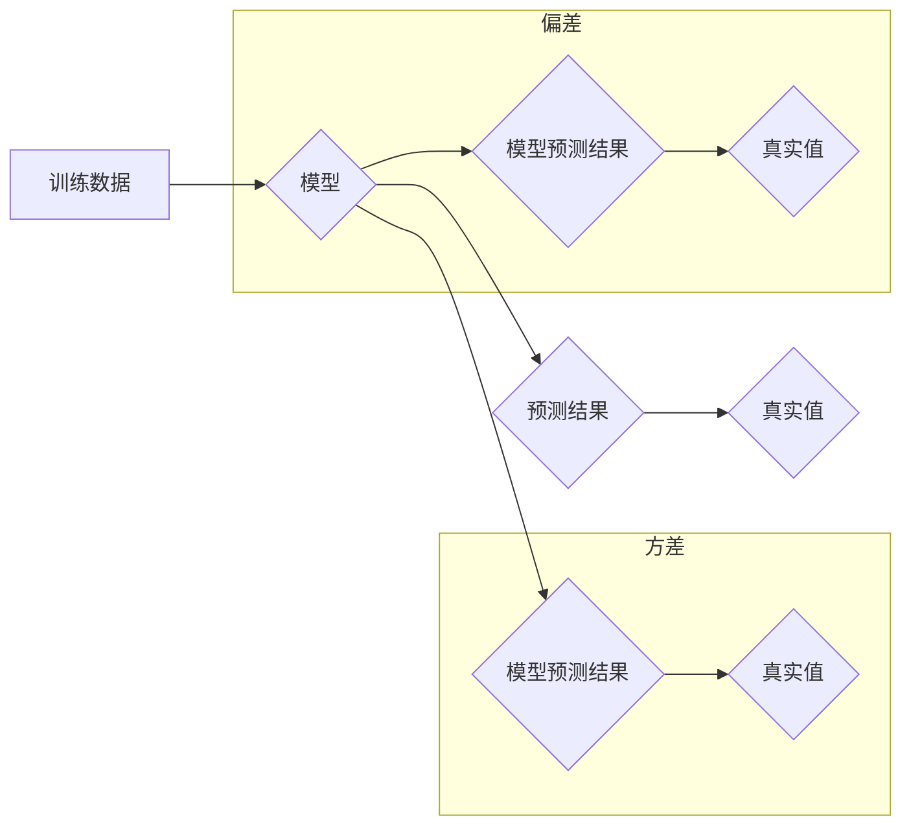

> Underfitting, 过度简化, 模型训练, 偏差, 误差, 性能评估, 代码实战, 机器学习

## 1. 背景介绍

在机器学习领域，我们经常会遇到模型训练效果不佳的问题。其中，**Underfitting**（过度简化）是一个常见的现象，它指的是模型过于简单，无法捕捉到训练数据中的复杂模式，导致模型在训练集和测试集上的表现都非常差。

与另一个常见问题**Overfitting**（过拟合）不同，Underfitting 意味着模型的复杂度太低，无法充分学习数据的特征。过拟合是指模型过于复杂，过度拟合了训练数据中的噪声，导致模型在训练集上表现很好，但在测试集上表现很差。

理解和解决 Underfitting 问题对于构建有效的机器学习模型至关重要。本文将深入探讨 Underfitting 的原理、识别方法、解决方案以及代码实战案例，帮助读者更好地理解和应对这一挑战。

## 2. 核心概念与联系

**2.1 Underfitting 的本质**

Underfitting 发生的原因是模型的复杂度不足以表达训练数据的复杂关系。 

**2.2 模型复杂度与偏差**

模型的复杂度是指模型能够学习到的特征数量和复杂程度。模型复杂度越高，模型能够学习到的特征就越多，模型的表达能力就越强。

**偏差（Bias）** 是模型预测结果与真实值的平均误差。模型的偏差与模型复杂度密切相关。

* **高偏差模型（Underfitting）:** 模型过于简单，无法学习到数据的复杂模式，导致偏差较大。
* **低偏差模型（Overfitting）:** 模型过于复杂，容易学习到数据的噪声，导致偏差较小，但泛化能力差。

**2.3 偏差-方差分解**

模型的性能可以由偏差和方差两个方面来衡量。

* **偏差:** 模型预测结果与真实值的平均误差。
* **方差:** 模型在不同训练数据集上的预测结果的变异程度。

**偏差-方差分解** 可以帮助我们理解模型性能的来源。



**2.4 误差分析**

模型的误差可以分为偏差误差和方差误差两部分。

* **偏差误差:** 模型预测结果与真实值的平均误差。
* **方差误差:** 模型在不同训练数据集上的预测结果的变异程度。

**2.5 模型选择与性能评估**

选择合适的模型复杂度是避免 Underfitting 和 Overfitting 的关键。

* **模型选择:** 根据问题的性质和数据的特点选择合适的模型。
* **性能评估:** 使用交叉验证等方法评估模型的性能，并根据性能指标选择最佳模型。

## 3. 核心算法原理 & 具体操作步骤

**3.1 算法原理概述**

Underfitting 通常发生在模型过于简单，无法学习到数据的复杂模式时。解决 Underfitting 的方法主要有以下几种：

* **增加模型复杂度:** 增加模型的层数、节点数量或其他参数，使模型能够学习到更复杂的特征。
* **增加训练数据:** 更多的训练数据可以帮助模型更好地学习数据的模式。
* **特征工程:** 通过对特征进行转换、组合等操作，可以增加特征的表达能力，帮助模型更好地学习数据。
* **正则化:** 正则化技术可以防止模型过拟合，但也可能导致 Underfitting。需要根据实际情况调整正则化参数。

**3.2 算法步骤详解**

1. **数据预处理:** 对数据进行清洗、转换、归一化等操作，使数据更适合模型训练。
2. **模型选择:** 根据问题的性质和数据的特点选择合适的模型。
3. **模型训练:** 使用训练数据训练模型，并调整模型参数，使模型的性能达到最佳。
4. **模型评估:** 使用测试数据评估模型的性能，并根据性能指标选择最佳模型。
5. **模型部署:** 将训练好的模型部署到实际应用场景中。

**3.3 算法优缺点**

* **优点:** 
    * 可以提高模型的表达能力，使其能够学习到更复杂的特征。
    * 可以减少模型的过拟合现象。
* **缺点:** 
    * 需要更多的计算资源和时间。
    * 如果模型过于复杂，可能会导致模型训练不稳定。

**3.4 算法应用领域**

* **图像识别:** 使用深度学习模型识别图像中的物体、场景等。
* **自然语言处理:** 使用深度学习模型进行文本分类、情感分析、机器翻译等任务。
* **语音识别:** 使用深度学习模型识别语音中的内容。

## 4. 数学模型和公式 & 详细讲解 & 举例说明

**4.1 数学模型构建**

在机器学习中，模型通常可以看作是一个函数，它将输入数据映射到输出结果。

例如，线性回归模型可以表示为：

$$y = w_0 + w_1x_1 + w_2x_2 + ... + w_nx_n$$

其中：

* $y$ 是输出结果
* $w_0, w_1, w_2, ..., w_n$ 是模型参数
* $x_1, x_2, ..., x_n$ 是输入特征

**4.2 公式推导过程**

模型参数的学习过程通常使用梯度下降算法。梯度下降算法的目标是找到使模型预测结果与真实值误差最小的参数值。

梯度下降算法的更新公式为：

$$w_i = w_i - \alpha \frac{\partial Loss}{\partial w_i}$$

其中：

* $w_i$ 是模型参数 $i$ 的值
* $\alpha$ 是学习率
* $\frac{\partial Loss}{\partial w_i}$ 是损失函数对参数 $w_i$ 的梯度

**4.3 案例分析与讲解**

假设我们有一个线性回归模型，用于预测房价。输入特征包括房屋面积、房间数量等，输出结果是房价。

我们可以使用梯度下降算法训练这个模型，并根据模型的预测结果评估模型的性能。

## 5. 项目实践：代码实例和详细解释说明

**5.1 开发环境搭建**

* Python 3.x
* TensorFlow 或 PyTorch 等深度学习框架
* Jupyter Notebook 或其他代码编辑器

**5.2 源代码详细实现**

```python
import tensorflow as tf

# 定义模型
model = tf.keras.models.Sequential([
    tf.keras.layers.Dense(64, activation='relu', input_shape=(7,)),
    tf.keras.layers.Dense(1)
])

# 编译模型
model.compile(optimizer='adam', loss='mse')

# 训练模型
model.fit(x_train, y_train, epochs=100)

# 评估模型
loss = model.evaluate(x_test, y_test)
print('Loss:', loss)
```

**5.3 代码解读与分析**

* 我们使用 TensorFlow 框架构建了一个简单的线性回归模型。
* 模型包含两层全连接层，第一层有 64 个神经元，使用 ReLU 激活函数，输入特征维度为 7。
* 第二层只有一个神经元，用于输出房价预测结果。
* 我们使用 Adam 优化器和均方误差损失函数训练模型。
* 训练模型 100 个 epochs，并使用测试数据评估模型的性能。

**5.4 运行结果展示**

运行代码后，会输出模型在测试集上的损失值。

## 6. 实际应用场景

Underfitting 问题在各种机器学习应用场景中都可能出现，例如：

* **图像分类:** 如果模型过于简单，无法识别出图像中的复杂特征，就会导致 Underfitting。
* **文本分类:** 如果模型无法学习到文本中的语义信息，也会导致 Underfitting。
* **预测分析:** 如果模型无法捕捉到时间序列中的趋势和模式，也会导致 Underfitting。

## 7. 工具和资源推荐

**7.1 学习资源推荐**

* **书籍:**
    * 《Hands-On Machine Learning with Scikit-Learn, Keras & TensorFlow》
    * 《Deep Learning》
* **在线课程:**
    * Coursera: Machine Learning
    * edX: Deep Learning

**7.2 开发工具推荐**

* **Python:** 
* **TensorFlow:** 
* **PyTorch:** 
* **Jupyter Notebook:** 

**7.3 相关论文推荐**

* **The Bias-Variance Tradeoff**
* **Regularization and Weight Decay**

## 8. 总结：未来发展趋势与挑战

**8.1 研究成果总结**

Underfitting 问题是一个常见的机器学习挑战，可以通过增加模型复杂度、增加训练数据、特征工程和正则化等方法来解决。

**8.2 未来发展趋势**

* **自动模型选择:** 自动选择最佳模型复杂度，减少人工干预。
* **数据增强:** 通过对现有数据进行合成和变换，增加训练数据量。
* **迁移学习:** 利用预训练模型，减少模型训练时间和数据需求。

**8.3 面临的挑战**

* **数据质量:** 训练数据质量直接影响模型性能，需要保证数据准确、完整和代表性。
* **计算资源:** 训练复杂模型需要大量的计算资源，成本较高。
* **模型解释性:** 复杂模型的决策过程难以解释，需要开发更可解释的模型。

**8.4 研究展望**

未来研究方向包括：

* 开发更有效的模型选择和训练方法。
* 研究更强大的数据增强技术。
* 开发更可解释的机器学习模型。


## 9. 附录：常见问题与解答

**9.1 如何判断模型是否 Underfitting？**

* 模型在训练集和测试集上的性能都非常差。
* 模型的损失函数在训练过程中没有明显下降。

**9.2 如何解决 Underfitting 问题？**

* 增加模型复杂度。
* 增加训练数据。
* 进行特征工程。
* 使用正则化技术。

**9.3 如何选择合适的模型复杂度？**

* 使用交叉验证等方法评估模型的性能，并选择最佳模型。
* 根据问题的性质和数据的特点选择合适的模型。


作者：禅与计算机程序设计艺术 / Zen and the Art of Computer Programming 
<end_of_turn>