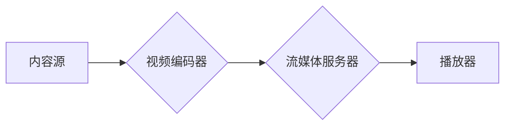

> m3u8,流媒体,HTTP,分段下载,视频直播,点播

## 1. 背景介绍

随着互联网技术的快速发展，流媒体技术已成为视频内容传播和消费的重要方式。流媒体协议允许用户在网络上实时观看视频内容，无需下载整个视频文件。其中，m3u8协议作为一种广泛应用的流媒体协议，在视频点播和直播领域发挥着重要作用。

m3u8协议是一种基于HTTP的文本文件格式，用于描述视频流的媒体片段。它可以将视频文件分割成多个小片段，并通过HTTP协议进行分段下载。这种分段下载机制可以有效解决网络带宽不足和视频文件过大等问题，提高用户观看体验。

## 2. 核心概念与联系

### 2.1  m3u8协议概述

m3u8协议是一种基于文本的播放列表格式，用于描述视频流的媒体片段。它可以包含多个媒体片段的URL地址，以及每个片段的时长、分辨率等信息。

### 2.2  流媒体架构

流媒体系统通常由以下几个主要组件组成：

* **内容源:** 视频内容的原始来源，可以是本地存储或网络服务器。
* **视频编码器:** 将视频内容编码成流媒体格式，例如H.264、H.265等。
* **流媒体服务器:** 负责接收视频流，切片分发，以及管理播放列表。
* **播放器:** 负责接收流媒体片段，解码并播放视频内容。

**Mermaid 流程图:**



### 2.3  分段下载机制

m3u8协议采用分段下载机制，将视频文件分割成多个小片段，每个片段的大小通常在几秒到几十秒之间。播放器会根据播放列表中的信息，逐个下载和播放这些片段。

这种分段下载机制可以带来以下优势：

* **降低网络带宽压力:** 由于每个片段的大小较小，可以减少一次性下载的数据量，降低网络带宽压力。
* **提高用户观看体验:** 即使网络连接不稳定，也可以保证视频播放的流畅性。
* **支持断点续传:** 如果播放过程中网络中断，播放器可以根据已下载的片段信息，从断点处继续下载和播放。

## 3. 核心算法原理 & 具体操作步骤

### 3.1  算法原理概述

m3u8协议的核心算法原理是基于HTTP协议的分段下载和播放列表管理。

* **分段下载:** 视频文件被分割成多个小片段，每个片段都对应一个唯一的URL地址。
* **播放列表管理:** m3u8文件包含了所有片段的URL地址，以及每个片段的时长、分辨率等信息。播放器会根据播放列表中的信息，逐个下载和播放这些片段。

### 3.2  算法步骤详解

1. **视频文件切片:** 将视频文件分割成多个小片段，每个片段的大小通常在几秒到几十秒之间。
2. **生成播放列表:** 创建一个m3u8文件，包含所有片段的URL地址，以及每个片段的时长、分辨率等信息。
3. **流媒体服务器分发:** 流媒体服务器负责接收播放请求，并根据播放列表信息，分发相应的片段给播放器。
4. **播放器下载和播放:** 播放器会根据播放列表中的信息，逐个下载和播放这些片段。

### 3.3  算法优缺点

**优点:**

* **高效的分段下载机制:** 降低网络带宽压力，提高用户观看体验。
* **支持断点续传:** 即使网络中断，也可以保证视频播放的流畅性。
* **灵活的播放列表管理:** 可以根据用户需求，动态调整播放列表内容。

**缺点:**

* **需要额外的服务器资源:** 流媒体服务器需要处理分段下载和播放列表管理等任务，需要额外的服务器资源。
* **播放列表文件大小:** 如果视频文件较大，播放列表文件可能也会比较大，需要额外的存储空间。

### 3.4  算法应用领域

m3u8协议广泛应用于以下领域:

* **视频点播:** 在线视频平台、OTT平台等。
* **视频直播:** 直播平台、游戏直播等。
* **视频会议:** 在线会议系统、远程教育等。

## 4. 数学模型和公式 & 详细讲解 & 举例说明

### 4.1  数学模型构建

m3u8协议的数学模型可以描述视频流的切片大小、播放列表的结构以及网络带宽的利用率。

* **切片大小:** 可以用公式 $S = T/N$ 来表示，其中 $S$ 是每个片段的大小，$T$ 是视频总时长，$N$ 是片段数量。
* **播放列表结构:** 可以用树形结构来表示，其中每个节点代表一个片段，子节点代表该片段的子片段。

### 4.2  公式推导过程

* **网络带宽利用率:** 可以用公式 $B = (S*R)/T$ 来表示，其中 $B$ 是网络带宽利用率，$S$ 是每个片段的大小，$R$ 是播放速率，$T$ 是视频总时长。

### 4.3  案例分析与讲解

假设一个视频文件时长为 10 分钟，分辨率为 1080p，播放速率为 2Mbps，则每个片段的大小可以设置为 5 秒，网络带宽利用率为 40%。

## 5. 项目实践：代码实例和详细解释说明

### 5.1  开发环境搭建

* **操作系统:** Linux/macOS/Windows
* **编程语言:** Python/Node.js/Java
* **开发工具:** Git、IDE

### 5.2  源代码详细实现

```python
# Python代码示例
import os
import time

def generate_m3u8(video_path, output_path, segment_duration=5):
    """
    生成m3u8播放列表文件
    """
    with open(output_path, 'w') as f:
        f.write("#EXTM3U
")
        start_time = 0
        while True:
            segment_path = os.path.join(video_path, f"{start_time:02d}.ts")
            if not os.path.exists(segment_path):
                break
            f.write(f"{segment_path}
")
            start_time += segment_duration

### 5.3  代码解读与分析

* **generate_m3u8函数:** 用于生成m3u8播放列表文件。
* **视频路径:** 指定视频文件所在的路径。
* **输出路径:** 指定m3u8播放列表文件的路径。
* **片段时长:** 指定每个片段的时长，单位为秒。
* **循环遍历:** 遍历所有视频片段，并写入播放列表文件。

### 5.4  运行结果展示

运行代码后，会在指定路径下生成一个m3u8播放列表文件，该文件包含了所有视频片段的URL地址。

## 6. 实际应用场景

### 6.1  视频点播平台

m3u8协议广泛应用于视频点播平台，例如Netflix、YouTube、爱奇艺等。这些平台使用m3u8协议来分发视频流，并根据用户的网络带宽和设备能力，动态调整视频分辨率和码率。

### 6.2  视频直播平台

m3u8协议也广泛应用于视频直播平台，例如Twitch、斗鱼、虎牙等。这些平台使用m3u8协议来分发直播流，并根据用户的网络带宽和设备能力，动态调整视频分辨率和码率。

### 6.3  其他应用场景

除了视频点播和直播平台，m3u8协议还可以应用于其他场景，例如：

* **远程教育:** 在线课程直播和点播。
* **视频会议:** 在线会议系统、远程教育等。
* **物联网视频监控:** 视频监控系统、智能家居等。

### 6.4  未来应用展望

随着5G网络和边缘计算技术的普及，m3u8协议的应用场景将会更加广泛。未来，m3u8协议可能会被用于以下领域：

* **VR/AR视频:** 提供沉浸式视频体验。
* **实时互动视频:** 支持多人实时互动视频。
* **智能视频分析:** 基于视频流进行智能分析和处理。

## 7. 工具和资源推荐

### 7.1  学习资源推荐

* **m3u8协议官方文档:** https://developer.apple.com/documentation/avfoundation/m3u8
* **流媒体技术博客:** https://blog.cloudflare.com/category/streaming/
* **视频编码技术书籍:** 《视频编码技术》

### 7.2  开发工具推荐

* **FFmpeg:** 视频处理工具，可以用于视频切片、编码和解码。
* **Nginx:** 流媒体服务器，可以用于分发m3u8播放列表和视频片段。
* **HLS.js:** JavaScript库，可以用于播放m3u8流媒体。

### 7.3  相关论文推荐

* **HTTP Live Streaming (HLS):** https://www.apple.com/newsroom/2011/09/apple-introduces-http-live-streaming-hls-a-new-standard-for-high-quality-streaming-video/
* **Adaptive Bitrate Streaming:** https://www.researchgate.net/publication/228975380_Adaptive_Bitrate_Streaming

## 8. 总结：未来发展趋势与挑战

### 8.1  研究成果总结

m3u8协议作为一种成熟的流媒体协议，在视频点播和直播领域发挥着重要作用。其高效的分段下载机制、灵活的播放列表管理以及广泛的应用场景，使其成为流媒体技术的重要组成部分。

### 8.2  未来发展趋势

未来，m3u8协议的发展趋势主要体现在以下几个方面：

* **更智能的适应性:** 基于用户网络状况、设备能力和观看偏好，更加智能地调整视频分辨率和码率。
* **更低延迟的直播:** 通过优化网络传输和播放机制，降低直播延迟，提高用户观看体验。
* **更丰富的互动功能:** 支持更多类型的互动功能，例如实时聊天、投票、点赞等，增强用户参与度。

### 8.3  面临的挑战

m3u8协议也面临着一些挑战，例如：

* **网络环境复杂:** 网络环境复杂多变，需要更加 robust 的协议设计和实现。
* **安全问题:** 流媒体数据传输过程中需要保障数据安全，防止恶意攻击和数据泄露。
* **跨平台兼容性:** 需要确保m3u8协议在不同平台和设备上都能正常工作。

### 8.4  研究展望

未来，研究者将继续探索m3u8协议的改进和扩展，以满足不断变化的流媒体需求。例如：

* 研究更先进的网络传输协议，提高视频流传输效率和可靠性。
* 开发更安全的流媒体传输机制，保障数据安全和用户隐私。
* 探索m3u8协议在新的应用场景中的应用，例如VR/AR视频、实时互动视频等。

## 9. 附录：常见问题与解答

### 9.1  问题：m3u8文件无法播放

**解答：**

* 确保播放器支持m3u8协议。
* 检查m3u8文件是否正确生成，以及视频片段是否存在。
* 检查网络连接是否稳定。

### 9.2  问题：视频播放卡顿

**解答：**

* 调整视频分辨率和码率。
* 优化网络环境，例如关闭其他应用程序，释放网络带宽。
* 升级播放器版本，以获得更好的性能。


作者：禅与计算机程序设计艺术 / Zen and the Art of Computer Programming 
<end_of_turn>