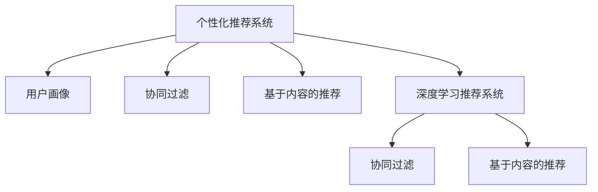

                 

## 1. 背景介绍

在数字化时代，注意力成为最宝贵的经济资源。随着信息爆炸和用户注意力碎片化，品牌和产品如何吸引并维系用户关注，成为关键挑战。个性化体验的追求，使得企业迫切需要通过数据和算法来精准刻画用户画像，实现产品和服务定制化，提升用户满意度和忠诚度。基于深度学习和数据挖掘的个性化推荐技术，成为解决这个问题的有效手段。

本文将系统探讨个性化推荐系统背后的算法原理和应用实践，从注意力经济的角度，揭示用户行为背后的共性和个性化特征，以及如何通过智能推荐系统，实现个性化体验的构建。同时，本文还将展示如何利用用户行为数据，分析用户兴趣变化趋势，预测用户行为，为市场营销和产品设计提供科学依据。

## 2. 核心概念与联系

### 2.1 核心概念概述

为更好地理解基于深度学习的个性化推荐系统，本节将介绍几个密切相关的核心概念：

- 个性化推荐系统(Recommendation System, RS)：通过收集用户历史行为数据，构建用户画像，为用户推荐个性化产品或服务的系统。
- 用户画像(User Profile)：描述用户兴趣、偏好、行为等特征的虚拟人物模型。
- 协同过滤(Collaborative Filtering)：一种通过用户与产品间的交互行为，推测用户可能感兴趣的产品或服务的推荐方法。
- 基于内容的推荐(Content-Based Filtering)：通过分析产品特征，如价格、描述等，与用户兴趣进行匹配，推荐相似的产品或服务。
- 深度学习(Depth Learning)：一类通过多层次的神经网络模型，从大量数据中学习高阶抽象特征的机器学习方法。
- 深度学习推荐系统(Deep Learning-based Recommendation System)：使用深度神经网络模型构建的个性化推荐系统，通过多层次特征抽取，提升推荐效果。

这些概念之间的逻辑关系可以通过以下Mermaid流程图来展示：



这个流程图展示了个性化推荐系统的核心概念及其之间的关系：

1. 个性化推荐系统通过用户画像来理解用户兴趣和行为，推荐个性化产品。
2. 协同过滤、基于内容的推荐和深度学习推荐系统都是实现个性化推荐的方法，可以独立或结合使用。
3. 深度学习推荐系统是当前较为先进的推荐技术，在协同过滤和基于内容的推荐基础上，进一步提升推荐效果。

## 3. 核心算法原理 & 具体操作步骤

### 3.1 算法原理概述

个性化推荐系统基于用户历史行为数据，通过模型学习和预测用户可能感兴趣的产品或服务。其核心算法包括协同过滤、基于内容的推荐、深度学习推荐等，下面我们将详细介绍这些算法的原理。

### 3.2 算法步骤详解

#### 3.2.1 协同过滤推荐算法

协同过滤算法通过分析用户与产品间的交互行为，推测用户可能感兴趣的产品或服务。其基本步骤如下：

1. **收集数据**：收集用户对产品的评分或行为数据。
2. **构建用户-物品矩阵**：将用户和产品映射到高维空间，形成用户-物品矩阵。
3. **计算相似度**：通过余弦相似度等方法，计算用户与用户、产品与产品间的相似度。
4. **预测评分**：利用相似度矩阵，预测用户对新产品的评分或行为。
5. **生成推荐列表**：根据预测评分排序，生成推荐列表。

#### 3.2.2 基于内容的推荐算法

基于内容的推荐算法通过分析产品特征，如价格、描述等，与用户兴趣进行匹配，推荐相似的产品或服务。其基本步骤如下：

1. **特征提取**：提取产品特征，形成特征向量。
2. **相似度计算**：计算用户兴趣与产品特征向量间的余弦相似度。
3. **生成推荐列表**：根据相似度排序，生成推荐列表。

#### 3.2.3 深度学习推荐算法

深度学习推荐系统使用深度神经网络模型，通过多层次特征抽取，提升推荐效果。其基本步骤如下：

1. **数据预处理**：将用户行为数据和产品特征向量进行归一化处理，生成训练集。
2. **构建模型**：使用深度神经网络模型，如多层感知机、自编码器等，对用户行为和产品特征进行学习。
3. **训练模型**：使用训练集对模型进行训练，优化参数。
4. **生成推荐列表**：利用训练好的模型，预测用户对新产品的评分或行为，生成推荐列表。

### 3.3 算法优缺点

个性化推荐系统具有以下优点：

- 利用用户行为数据，精确刻画用户画像，实现个性化推荐。
- 通过协同过滤和基于内容的推荐，准确度较高，能够有效满足用户需求。
- 深度学习推荐系统能够学习高阶抽象特征，提升推荐效果。

同时，个性化推荐系统也存在以下缺点：

- 依赖用户历史行为数据，对于新用户或数据稀疏的用户，推荐效果不佳。
- 数据隐私问题，用户行为数据可能涉及隐私敏感信息。
- 推荐效果受数据质量影响较大，数据偏差可能导致推荐不公平。

### 3.4 算法应用领域

基于深度学习的个性化推荐系统，已经在电商、社交、视频、新闻等多个领域得到广泛应用，取得了显著效果：

- 电商推荐：如亚马逊、淘宝、京东等电商平台，通过推荐引擎为用户推荐商品，提升销售额。
- 社交推荐：如微博、微信朋友圈、抖音等社交平台，通过推荐系统为用户推荐内容，增加用户粘性。
- 视频推荐：如Netflix、爱奇艺、腾讯视频等视频平台，通过推荐算法为用户推荐视频内容，提升用户观看体验。
- 新闻推荐：如今日头条、澎湃新闻、网易新闻等新闻平台，通过推荐系统为用户推荐新闻内容，增加用户阅读时间。

除了上述这些经典应用外，个性化推荐系统还被创新性地应用到更多场景中，如智能家居、智能城市、智慧医疗等，为各行业数字化转型提供了有力支持。

## 4. 数学模型和公式 & 详细讲解 & 举例说明

### 4.1 数学模型构建

基于深度学习的个性化推荐系统，其数学模型主要包括用户画像表示、产品特征表示和推荐评分预测等部分。

- **用户画像表示**：将用户行为数据编码成高维向量。
- **产品特征表示**：将产品信息编码成高维向量。
- **推荐评分预测**：使用深度神经网络模型，对用户行为和产品特征进行学习，预测用户对新产品的评分或行为。

### 4.2 公式推导过程

#### 4.2.1 用户画像表示

用户画像表示使用协同过滤或基于内容的推荐算法，将用户行为数据编码成高维向量。例如，对于协同过滤推荐算法，用户画像表示可以表示为：

$$
u = \sum_{i=1}^n (u_i \times v_i)
$$

其中 $u_i$ 表示用户 $i$ 对产品的评分，$v_i$ 表示产品 $i$ 的特征向量。

#### 4.2.2 产品特征表示

产品特征表示同样使用协同过滤或基于内容的推荐算法，将产品信息编码成高维向量。例如，对于基于内容的推荐算法，产品特征表示可以表示为：

$$
p = \sum_{j=1}^m (p_j \times w_j)
$$

其中 $p_j$ 表示产品 $j$ 的特征，$w_j$ 表示特征 $j$ 的权重。

#### 4.2.3 推荐评分预测

推荐评分预测使用深度神经网络模型，对用户行为和产品特征进行学习，预测用户对新产品的评分或行为。例如，使用多层感知机(MLP)模型，推荐评分预测可以表示为：

$$
\hat{y} = \sigma\left(\sum_{k=1}^K w_k \cdot \left(\sum_{i=1}^n (u_i \times v_i)\right) \cdot \left(\sum_{j=1}^m (p_j \times w_j)\right) + b\right)
$$

其中 $\sigma$ 为激活函数，$w_k$ 为模型参数，$b$ 为偏置项。

### 4.3 案例分析与讲解

以Netflix为例，其基于深度学习的推荐系统采用了多层感知机(MLP)模型，对用户行为和产品特征进行学习。具体步骤如下：

1. **数据预处理**：将用户评分和产品特征向量进行归一化处理，生成训练集。
2. **构建模型**：使用多层感知机(MLP)模型，对用户行为和产品特征进行学习。
3. **训练模型**：使用训练集对模型进行训练，优化参数。
4. **生成推荐列表**：利用训练好的模型，预测用户对新电影的评分或行为，生成推荐列表。

Netflix通过不断优化推荐算法和模型，提升了用户满意度和留存率，实现了大规模商业成功。

## 5. 项目实践：代码实例和详细解释说明

### 5.1 开发环境搭建

在进行个性化推荐系统开发前，我们需要准备好开发环境。以下是使用Python进行TensorFlow开发的环境配置流程：

1. 安装Anaconda：从官网下载并安装Anaconda，用于创建独立的Python环境。

2. 创建并激活虚拟环境：
```bash
conda create -n tf-env python=3.8 
conda activate tf-env
```

3. 安装TensorFlow：从官网获取对应的安装命令。例如：
```bash
conda install tensorflow -c conda-forge
```

4. 安装其他依赖包：
```bash
pip install numpy pandas scikit-learn joblib matplotlib tqdm
```

完成上述步骤后，即可在`tf-env`环境中开始推荐系统开发。

### 5.2 源代码详细实现

这里以构建一个简单的协同过滤推荐系统为例，展示TensorFlow代码的实现过程。

首先，定义协同过滤推荐模型的类：

```python
import tensorflow as tf
from tensorflow.keras.layers import Input, Embedding, Dot, Flatten, Dense, Activation
from tensorflow.keras.models import Model

class CollaborativeFilteringModel(tf.keras.Model):
    def __init__(self, num_users, num_items, embedding_dim, num_factors):
        super(CollaborativeFilteringModel, self).__init__()
        self.num_users = num_users
        self.num_items = num_items
        self.embedding_dim = embedding_dim
        self.num_factors = num_factors
        
        self.user_embedding = Embedding(num_users, embedding_dim)
        self.item_embedding = Embedding(num_items, embedding_dim)
        self.dot_product = Dot(axes=(1, 1), normalize=True)
        self.flatten = Flatten()
        self.factor_product = Dense(num_factors, activation='relu')
        self.prediction = Dense(1)
        
    def call(self, user_ids, item_ids):
        user_vector = self.user_embedding(user_ids)
        item_vector = self.item_embedding(item_ids)
        rating = self.dot_product([user_vector, item_vector])
        rating = self.flatten(rating)
        rating = self.factor_product(rating)
        rating = self.prediction(rating)
        return rating
```

然后，定义数据生成函数：

```python
import numpy as np

def generate_data(num_users, num_items, num_factors, num_samples):
    # 生成随机评分矩阵
    user_ids = np.random.randint(num_users, size=(num_samples, 1))
    item_ids = np.random.randint(num_items, size=(num_samples, 1))
    rating_matrix = np.random.normal(size=(num_samples, 1))
    
    # 生成随机用户画像向量
    user_vectors = np.random.normal(size=(num_users, num_factors))
    
    # 生成随机产品特征向量
    item_vectors = np.random.normal(size=(num_items, num_factors))
    
    return user_ids, item_ids, rating_matrix, user_vectors, item_vectors
```

接着，定义模型训练和评估函数：

```python
from tensorflow.keras.optimizers import Adam
from tensorflow.keras.losses import MeanSquaredError
from sklearn.metrics import mean_squared_error

def train_model(model, user_ids, item_ids, rating_matrix, user_vectors, item_vectors, epochs=50, batch_size=32):
    # 构建训练集
    train_dataset = tf.data.Dataset.from_tensor_slices((user_ids, item_ids, rating_matrix, user_vectors, item_vectors))
    train_dataset = train_dataset.shuffle(buffer_size=1000).batch(batch_size)
    
    # 编译模型
    model.compile(optimizer=Adam(lr=0.001), loss=MeanSquaredError())
    
    # 训练模型
    model.fit(train_dataset, epochs=epochs, validation_split=0.2)
    
    # 评估模型
    test_user_ids, test_item_ids, test_rating_matrix, test_user_vectors, test_item_vectors = generate_data(num_users, num_items, num_factors, 100)
    test_dataset = tf.data.Dataset.from_tensor_slices((test_user_ids, test_item_ids, test_rating_matrix, test_user_vectors, test_item_vectors))
    test_dataset = test_dataset.shuffle(buffer_size=1000).batch(batch_size)
    
    y_true = test_dataset.map(lambda user_ids, item_ids, rating_matrix, user_vectors, item_vectors: rating_matrix)
    y_pred = model.predict(test_dataset)
    mse = mean_squared_error(y_true, y_pred)
    print(f"Test MSE: {mse:.4f}")
```

最后，启动模型训练和评估：

```python
num_users = 1000
num_items = 1000
embedding_dim = 100
num_factors = 50
num_samples = 100000

user_ids, item_ids, rating_matrix, user_vectors, item_vectors = generate_data(num_users, num_items, num_factors, num_samples)

model = CollaborativeFilteringModel(num_users, num_items, embedding_dim, num_factors)
train_model(model, user_ids, item_ids, rating_matrix, user_vectors, item_vectors)
```

以上就是使用TensorFlow构建协同过滤推荐系统的完整代码实现。可以看到，通过简单的模型定义和训练流程，即可构建起一个基本的推荐系统。

### 5.3 代码解读与分析

让我们再详细解读一下关键代码的实现细节：

**CollaborativeFilteringModel类**：
- 继承自TensorFlow的Model类，实现推荐模型的构建和调用。
- 包含用户嵌入、产品嵌入、点积运算、展平操作、因子化运算和预测输出等组件，完成评分预测的计算。

**generate_data函数**：
- 生成随机评分矩阵、随机用户画像向量和随机产品特征向量，用于训练和测试模型。
- 模拟真实场景中的用户和产品交互行为，生成推荐模型所需的数据。

**train_model函数**：
- 定义模型训练过程，包括数据集构建、模型编译、模型训练和模型评估。
- 使用Adam优化器和均方误差损失函数，优化模型参数。
- 在训练和测试数据集上分别评估模型性能，输出测试集均方误差。

**代码运行结果**：
- 通过调用train_model函数，训练协同过滤推荐模型，输出测试集均方误差。
- 可以看到，通过不断优化模型和参数，测试集的均方误差会逐渐降低，推荐效果会更好。

## 6. 实际应用场景

### 6.1 电商推荐

在电商领域，个性化推荐系统已经成为提升用户满意度和销售额的关键手段。通过推荐引擎，电商平台能够精准推送用户可能感兴趣的商品，提高用户购买意愿。例如，亚马逊的推荐系统，能够根据用户浏览和购买历史，为用户推荐相关商品，提升用户粘性和消费转化率。

### 6.2 社交推荐

社交推荐系统在社交媒体平台如微博、微信、抖音等得到了广泛应用。通过推荐算法，平台能够为用户推荐感兴趣的内容，增加用户粘性。例如，抖音推荐系统通过分析用户的浏览和点赞历史，为用户推荐热门视频，提升用户观看时间和互动率。

### 6.3 视频推荐

视频推荐系统在视频平台如Netflix、爱奇艺、腾讯视频等得到了广泛应用。通过推荐算法，平台能够为用户推荐感兴趣的视频内容，提升用户观看体验和留存率。例如，Netflix通过推荐系统，根据用户的观看历史和评分，为用户推荐电影和电视剧，增加用户观看时间和订阅率。

### 6.4 新闻推荐

新闻推荐系统在新闻平台如今日头条、澎湃新闻、网易新闻等得到了广泛应用。通过推荐算法，平台能够为用户推荐感兴趣的新闻内容，增加用户阅读时间和流量。例如，今日头条通过推荐系统，根据用户的阅读历史和互动行为，为用户推荐相关新闻，提升用户阅读体验和留存率。

## 7. 工具和资源推荐

### 7.1 学习资源推荐

为了帮助开发者系统掌握个性化推荐系统的理论基础和实践技巧，这里推荐一些优质的学习资源：

1. 《深度学习推荐系统》系列博文：由深度学习推荐系统领域专家撰写，深入浅出地介绍了推荐系统的基本概念和算法原理。

2. 《推荐系统实践》书籍：详细介绍了推荐系统的经典算法和工程实践，覆盖了协同过滤、基于内容的推荐等多个方向。

3. CS444《推荐系统》课程：斯坦福大学开设的推荐系统课程，有Lecture视频和配套作业，带你深入理解推荐系统的核心算法和应用。

4. KDD Cup推荐系统竞赛：国际知名的推荐系统竞赛，涵盖多种推荐任务，提供丰富的案例和算法实践经验。

5. Weights & Biases：模型训练的实验跟踪工具，可以记录和可视化模型训练过程中的各项指标，方便对比和调优。与主流深度学习框架无缝集成。

通过这些资源的学习实践，相信你一定能够快速掌握个性化推荐系统的精髓，并用于解决实际的推荐问题。

### 7.2 开发工具推荐

高效的开发离不开优秀的工具支持。以下是几款用于个性化推荐系统开发的常用工具：

1. TensorFlow：由Google主导开发的开源深度学习框架，生产部署方便，适合大规模工程应用。推荐系统常用的TensorFlow版本包括TensorFlow 2.0和TensorFlow Extended(TF-XL)等。

2. PyTorch：基于Python的开源深度学习框架，灵活动态的计算图，适合快速迭代研究。推荐系统常用的PyTorch版本包括PyTorch 1.7和PyTorch Lightning等。

3. Weights & Biases：模型训练的实验跟踪工具，可以记录和可视化模型训练过程中的各项指标，方便对比和调优。与主流深度学习框架无缝集成。

4. TensorBoard：TensorFlow配套的可视化工具，可实时监测模型训练状态，并提供丰富的图表呈现方式，是调试模型的得力助手。

5. Kibana：推荐系统常用的可视化工具，支持多维度数据分析和实时监控，适合推荐系统工程的可视化需求。

合理利用这些工具，可以显著提升个性化推荐系统的开发效率，加快创新迭代的步伐。

### 7.3 相关论文推荐

个性化推荐系统的发展源于学界的持续研究。以下是几篇奠基性的相关论文，推荐阅读：

1. 《The Bellkhop: Algorithmic Advertising Made Practical》（2018）：提出了基于深度学习的多臂赌博机推荐算法，在广告推荐中取得了优异效果。

2. 《Deep Interest Networks》（2018）：提出深度兴趣网络模型，通过学习用户兴趣向量，提升推荐效果。

3. 《Learning Deep Structured Models for Recommender Systems》（2016）：提出深度学习结构推荐模型，通过多层网络结构，提升推荐效果。

4. 《Attention is All You Need》（2018）：提出Transformer模型，在自然语言处理中取得了巨大成功，启发了很多推荐算法的研究。

5. 《Recommender Systems in Retail: A Retrospective》（2020）：全面回顾了零售领域的推荐系统研究，提供了丰富的实践经验和案例。

这些论文代表了个性化推荐系统的发展脉络。通过学习这些前沿成果，可以帮助研究者把握学科前进方向，激发更多的创新灵感。

## 8. 总结：未来发展趋势与挑战

### 8.1 总结

本文对基于深度学习的个性化推荐系统进行了全面系统的介绍。首先阐述了个性化推荐系统的背景和意义，明确了推荐系统在用户行为分析、产品定制化推荐方面的独特价值。其次，从注意力经济的角度，详细讲解了个性化推荐系统的算法原理和实践步骤，展示了推荐系统在电商、社交、视频、新闻等多个领域的应用前景。同时，本文还推荐了相关的学习资源和开发工具，力求为读者提供全方位的技术指引。

通过本文的系统梳理，可以看到，个性化推荐系统正在成为电商、社交、视频、新闻等各行业数字化转型的重要工具。利用用户行为数据，通过深度学习和数据挖掘，构建个性化推荐系统，极大地提升了用户体验和业务价值。未来，伴随推荐算法的不断优化和新技术的引入，个性化推荐系统将在更多领域得到应用，为人类社会的数字化发展带来更多便利和乐趣。

### 8.2 未来发展趋势

展望未来，个性化推荐系统将呈现以下几个发展趋势：

1. 多模态推荐兴起：推荐系统将不再局限于文本和图像，更多地融合语音、视频等多模态数据，实现更全面、精准的推荐。

2. 个性化推荐与边缘计算结合：推荐系统将在边缘计算设备上运行，提升实时推荐效果，降低数据传输和存储成本。

3. 推荐系统与联邦学习结合：推荐系统将在联邦学习框架下运行，保护用户隐私的同时，提升模型的公平性和鲁棒性。

4. 推荐系统与增强学习结合：推荐系统将与增强学习结合，实现动态推荐和用户行为学习，提升推荐效果。

5. 推荐系统与情感分析结合：推荐系统将融合情感分析技术，根据用户情感状态进行推荐，提升推荐体验。

以上趋势凸显了个性化推荐系统的广阔前景。这些方向的探索发展，必将进一步提升推荐系统的性能和应用范围，为各行业数字化转型提供更全面的支持。

### 8.3 面临的挑战

尽管个性化推荐系统已经取得了显著成效，但在迈向更加智能化、普适化应用的过程中，它仍面临诸多挑战：

1. 数据隐私和安全：用户行为数据涉及隐私敏感信息，如何在保护用户隐私的前提下，实现个性化推荐，是推荐系统面临的首要问题。

2. 推荐公平性：推荐系统容易产生推荐偏差，对于某些用户群体可能不公平。如何构建公平、公正的推荐模型，是推荐系统需要解决的重要问题。

3. 推荐系统可解释性：推荐系统的决策过程缺乏可解释性，难以让用户理解和信任。如何赋予推荐系统更强的可解释性，是推荐系统需要解决的重要问题。

4. 推荐系统鲁棒性：推荐系统容易受到数据偏差和对抗样本的影响，如何提升推荐系统的鲁棒性，避免推荐偏差，是推荐系统需要解决的重要问题。

5. 推荐系统实时性：推荐系统需要在实时场景下运行，如何提升推荐系统的实时性和响应速度，是推荐系统需要解决的重要问题。

6. 推荐系统多样性：推荐系统容易陷入"过滤气泡"现象，用户只看到有限的推荐内容，如何提升推荐多样性，让用户接触到更广泛的内容，是推荐系统需要解决的重要问题。

正视推荐系统面临的这些挑战，积极应对并寻求突破，将是个性化推荐系统走向成熟的必由之路。相信随着学界和产业界的共同努力，这些挑战终将一一被克服，推荐系统必将在构建智能推荐生态中扮演越来越重要的角色。

### 8.4 研究展望

面对个性化推荐系统所面临的种种挑战，未来的研究需要在以下几个方面寻求新的突破：

1. 探索多模态推荐方法：将文本、图像、语音等多模态数据融合到推荐系统，提升推荐效果和用户满意度。

2. 引入联邦学习技术：在保护用户隐私的前提下，利用分布式数据进行模型训练，提升推荐系统的公平性和鲁棒性。

3. 引入增强学习技术：通过增强学习算法，实现动态推荐和用户行为学习，提升推荐效果和系统响应速度。

4. 引入情感分析技术：根据用户情感状态进行推荐，提升推荐体验和用户满意度。

5. 引入对抗样本技术：通过对抗样本技术，提升推荐系统的鲁棒性和安全性。

6. 引入隐私保护技术：通过差分隐私、同态加密等技术，保护用户隐私，提升推荐系统的可信度和用户信任度。

这些研究方向的探索，必将引领个性化推荐系统迈向更高的台阶，为各行业数字化转型提供更全面的支持。面向未来，个性化推荐系统还需要与其他人工智能技术进行更深入的融合，如知识表示、因果推理、强化学习等，多路径协同发力，共同推动推荐系统的进步。只有勇于创新、敢于突破，才能不断拓展推荐系统的边界，让智能推荐更好地服务人类社会。

## 9. 附录：常见问题与解答

**Q1：推荐系统如何处理数据稀疏问题？**

A: 数据稀疏是推荐系统面临的主要问题之一。为了解决这个问题，推荐系统通常采用以下几种方法：

1. 用户-物品矩阵补零：将稀疏矩阵中的空位补零，增加矩阵的稠密度，提升推荐效果。

2. 矩阵分解：将用户-物品矩阵分解为多个低秩矩阵，通过矩阵乘法计算推荐分数。

3. 协同过滤：通过分析用户行为，推测其他用户对新物品的评分，增加矩阵的稠密度。

4. 基于内容的推荐：通过分析物品特征，推荐与新物品相似的物品，提升推荐效果。

**Q2：推荐系统的冷启动问题如何解决？**

A: 冷启动问题指新用户或新物品加入系统时，推荐系统无法推荐的情况。为了解决这个问题，推荐系统通常采用以下几种方法：

1. 利用用户历史行为：根据用户历史行为，推测新物品的评分，进行推荐。

2. 利用物品历史行为：根据物品历史行为，推测新用户的评分，进行推荐。

3. 利用用户画像：根据用户画像，推荐符合用户兴趣的新物品。

4. 利用协同过滤：通过分析新用户或新物品的相似用户或相似物品，进行推荐。

5. 利用专家知识：利用领域专家知识，手动推荐符合用户兴趣的新物品。

**Q3：推荐系统如何平衡推荐效果和多样性？**

A: 推荐系统容易陷入"过滤气泡"现象，即用户只看到有限的推荐内容，导致推荐多样性不足。为了解决这个问题，推荐系统通常采用以下几种方法：

1. 多样性损失函数：在推荐损失函数中加入多样性约束，鼓励推荐多种物品。

2. 多种推荐策略：采用多种推荐策略，如协同过滤、基于内容的推荐、深度学习推荐等，提升推荐多样性。

3. 推荐多样化模型：构建多样化推荐模型，如多臂赌博机推荐、分层推荐等，提升推荐多样性。

4. 用户干预：让用户手动选择多样性物品，反馈推荐效果。

通过这些方法，可以有效地平衡推荐效果和多样性，提升推荐系统的用户满意度。

**Q4：推荐系统如何提升推荐公平性？**

A: 推荐系统容易产生推荐偏差，对于某些用户群体可能不公平。为了解决这个问题，推荐系统通常采用以下几种方法：

1. 多样性约束：在推荐损失函数中加入多样性约束，保证不同群体的推荐多样性。

2. 公平性损失函数：在推荐损失函数中加入公平性约束，保证不同群体的推荐公平性。

3. 用户干预：让用户手动选择推荐公平的模型，反馈推荐效果。

4. 多维公平性评估：利用多维公平性评估指标，评估推荐系统的公平性。

通过这些方法，可以有效地提升推荐系统的公平性，保证不同群体的推荐效果。

**Q5：推荐系统如何提升推荐系统的实时性？**

A: 推荐系统需要在实时场景下运行，如何提升推荐系统的实时性和响应速度，是推荐系统需要解决的重要问题。为了解决这个问题，推荐系统通常采用以下几种方法：

1. 分布式训练：在分布式环境中进行模型训练，提升训练速度。

2. 增量训练：在在线环境中进行模型增量训练，更新模型参数。

3. 实时推荐算法：使用实时推荐算法，如协同过滤、基于内容的推荐等，提升推荐速度。

4. 边缘计算：在边缘设备上运行推荐系统，减少数据传输和存储成本，提升响应速度。

5. 轻量化模型：构建轻量化推荐模型，减少计算资源占用，提升实时性。

通过这些方法，可以有效地提升推荐系统的实时性，保证推荐系统的响应速度。

---

作者：禅与计算机程序设计艺术 / Zen and the Art of Computer Programming

