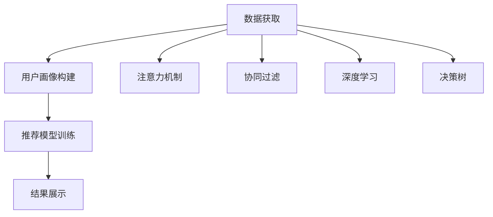

                 

# 注意力经济与个性化推荐算法：为受众提供定制、有针对性的内容

> 关键词：
> - 个性化推荐
> - 注意力机制
> - 协同过滤
> - 深度学习
> - 决策树
> - 用户画像
> - 点击率预测

## 1. 背景介绍

在互联网时代，海量的信息流充斥着人们的日常生活，如何有效筛选出有价值的内容，成为了每个人面临的难题。随着数据科学技术的发展，个性化推荐系统应运而生，它通过对用户行为数据的分析，精准地推送符合用户兴趣和需求的内容，极大地提升了用户体验。然而，随着用户需求日益个性化，传统的推荐系统面临许多挑战，比如对多样性需求的忽视、过度依赖物品间相似度、忽略上下文信息等。为解决这些问题，现代推荐系统纷纷引入注意力机制，并结合多种算法优化，以达到更高的精准度和覆盖率。本文将从背景介绍入手，深入探讨个性化推荐系统中的注意力经济和推荐算法，为读者提供理论和实践的深度解析。

## 2. 核心概念与联系

### 2.1 核心概念概述

个性化推荐系统（Personalized Recommendation System）通过分析用户行为数据，推测用户潜在的兴趣和需求，从而向用户推荐最符合其兴趣和需求的内容。系统通常包括数据获取、用户画像构建、推荐模型训练和结果展示四个环节。注意力机制（Attention Mechanism）是一种用于提升模型对输入序列中不同部分的关注度，从而提高模型对信息的利用效率的技术。协同过滤（Collaborative Filtering）是推荐系统常用的方法，通过用户行为数据挖掘用户的兴趣和相似性，从而进行推荐。深度学习（Deep Learning）和决策树（Decision Tree）等算法在推荐系统中也得到了广泛应用，以提升推荐的精度和效率。用户画像（User Profile）是推荐系统为用户建立的一个综合性的信息集，用于刻画用户属性和行为特征，是推荐决策的基础。点击率预测（Click-Through Rate Prediction）是衡量推荐系统性能的重要指标，通过预测用户点击推荐内容的可能性，评估系统的效果。

### 2.2 核心概念原理和架构的 Mermaid 流程图



这个流程图展示了个性化推荐系统的主要流程和架构，各个组件相互配合，实现对用户个性化需求的精准推荐。

## 3. 核心算法原理 & 具体操作步骤

### 3.1 算法原理概述

个性化推荐系统的核心在于建立一个可以预测用户行为并推荐内容的模型。这一过程包括数据的收集与处理、用户画像的构建、推荐算法的开发与训练、以及推荐结果的输出与反馈。注意力机制通过将用户兴趣权重赋予不同特征，提升模型的精准度。协同过滤通过分析用户行为相似性，发现用户兴趣。深度学习利用神经网络处理大规模数据，提高推荐系统的复杂度和精度。决策树通过分层次的决策结构，优化推荐模型的推理过程。

### 3.2 算法步骤详解

#### 3.2.1 数据获取

数据获取是推荐系统的基础，包括用户行为数据（点击、浏览、购买等）和物品属性数据。用户行为数据通常分为显式反馈和隐式反馈两种类型，显式反馈如评分，隐式反馈如点击、浏览等。物品属性数据包括物品的分类、属性、描述等信息。

#### 3.2.2 用户画像构建

用户画像构建是通过对用户行为数据的分析，形成用户的兴趣特征和行为模式。用户画像通常包含用户的年龄、性别、职业、兴趣爱好等信息。用户画像的构建方法有基于协同过滤的矩阵分解、基于深度学习的嵌入空间、基于决策树的分类等。

#### 3.2.3 推荐模型训练

推荐模型训练包括选择合适的算法、设定超参数、进行模型训练等步骤。常见的推荐算法包括基于协同过滤的矩阵分解、基于深度学习的神经网络、基于决策树的分类等。算法选择需根据数据特性、模型复杂度、系统性能等综合考虑。超参数设定需通过交叉验证等方法进行优化。模型训练通常采用迭代优化算法，如随机梯度下降（SGD）等，不断调整模型参数，使得模型预测结果与实际行为尽可能一致。

#### 3.2.4 结果展示

推荐结果展示通常包括用户界面的设计、推荐内容的选择与排序、推荐内容的反馈与优化等。用户界面设计需简洁直观，推荐内容需考虑多样性、新鲜度等因素，推荐内容的反馈需收集用户的点击、购买等行为，用于模型优化。

### 3.3 算法优缺点

#### 3.3.1 优点

1. **精准性高**：注意力机制和深度学习可以挖掘用户深层次的需求和偏好，协同过滤和决策树可以发现用户的相似性和行为模式，从而实现精准推荐。
2. **覆盖面广**：深度学习模型可以处理大规模数据，决策树模型可以包含复杂逻辑，从而提高推荐的覆盖面。
3. **适应性强**：基于协同过滤的矩阵分解算法和基于深度学习的嵌入空间方法可以适应不同类型的推荐数据。
4. **动态更新**：实时更新用户画像和模型参数，可以反映用户需求的变化，提高推荐系统的效果。

#### 3.3.2 缺点

1. **数据依赖度高**：推荐系统的效果高度依赖于用户行为数据的完整性和准确性，缺失或错误的数据会导致推荐结果偏差。
2. **冷启动问题**：新用户或新物品加入推荐系统时，缺乏足够的行为数据，导致推荐效果差。
3. **计算复杂度高**：深度学习模型需要大量的计算资源和时间，协同过滤和决策树算法也需处理大规模数据，计算复杂度高。
4. **模型解释性差**：深度学习模型和决策树算法通常被视为黑盒模型，难以解释推荐结果的逻辑和依据。

### 3.4 算法应用领域

个性化推荐系统在电子商务、社交网络、视频平台、新闻门户等多个领域得到了广泛应用。电子商务平台通过个性化推荐提高用户购买率和满意度，社交网络通过推荐内容增加用户粘性，视频平台通过推荐视频提高用户观看时间和质量，新闻门户通过推荐新闻提高用户阅读量和活跃度。此外，推荐系统还被应用于广告投放、搜索引擎优化等领域，通过精准推荐增加广告点击率和搜索结果的相关性。

## 4. 数学模型和公式 & 详细讲解 & 举例说明

### 4.1 数学模型构建

个性化推荐系统通常使用评分预测模型（Rating Prediction Model）进行推荐。评分预测模型目标是为用户和物品分配一个评分，表示用户对物品的兴趣程度。常见的评分预测模型包括协同过滤、深度学习、决策树等。

### 4.2 公式推导过程

#### 4.2.1 协同过滤模型

协同过滤模型通过计算用户与物品的相似度，预测用户对物品的评分。设 $U$ 为用户集合，$I$ 为物品集合，$R$ 为评分矩阵，$c_{ui}$ 为用户 $u$ 对物品 $i$ 的评分，则协同过滤模型的评分预测公式为：

$$
c_{ui} \approx \alpha \sum_{j \in N(u)} c_{uj} c_{ji} + \beta \sum_{j \in N(i)} c_{uj} c_{ji} + \gamma
$$

其中，$N(u)$ 为与用户 $u$ 相似的用户集合，$N(i)$ 为与物品 $i$ 相似的物品集合，$\alpha$、$\beta$、$\gamma$ 为权重系数。

#### 4.2.2 深度学习模型

深度学习模型通常使用神经网络进行评分预测。以基于神经网络的协同过滤（Neural Collaborative Filtering, NCF）为例，模型由两个深度神经网络组成，一个用于用户表示的编码，一个用于物品表示的编码，预测公式为：

$$
c_{ui} = \text{sigmoid}(\langle \text{User Embedding}_u, \text{Item Embedding}_i \rangle)
$$

其中，$\text{User Embedding}_u$ 为用户 $u$ 的嵌入向量，$\text{Item Embedding}_i$ 为物品 $i$ 的嵌入向量，$\langle \cdot, \cdot \rangle$ 表示向量内积，$\text{sigmoid}$ 函数将内积结果映射到 $[0,1]$ 区间。

### 4.3 案例分析与讲解

#### 4.3.1 协同过滤模型的案例分析

协同过滤模型在电子商务领域得到了广泛应用。以亚马逊为例，通过分析用户对物品的评分数据，协同过滤模型可以预测用户对未评分物品的兴趣程度，从而进行个性化推荐。协同过滤模型分为基于用户的协同过滤和基于物品的协同过滤两种方法，亚马逊主要使用基于用户的协同过滤，通过计算用户之间的相似度，发现用户对物品的兴趣。

#### 4.3.2 深度学习模型的案例分析

深度学习模型在音乐推荐系统中得到了应用。以Spotify为例，通过深度学习模型，Spotify能够分析用户的听歌历史、喜好、社交网络信息等，预测用户对未听过歌曲的兴趣程度，从而进行个性化推荐。Spotify的深度学习模型使用多层神经网络，通过不同层次的特征提取和融合，提高推荐的精度和多样性。

## 5. 项目实践：代码实例和详细解释说明

### 5.1 开发环境搭建

个性化推荐系统的开发通常需要使用Python语言和深度学习框架，如TensorFlow或PyTorch。以下是一个基于TensorFlow的推荐系统开发环境搭建过程：

1. 安装Python：从官网下载并安装Python，选择合适的版本，如Python 3.8。
2. 安装TensorFlow：使用pip命令安装TensorFlow，并设置GPU环境，确保TensorFlow能够使用GPU进行计算。
3. 安装其他依赖：安装Pandas、Numpy等科学计算库，以及其他推荐系统开发所需的库。

### 5.2 源代码详细实现

以下是一个基于深度学习的协同过滤模型的Python代码实现：

```python
import tensorflow as tf
import pandas as pd
import numpy as np

# 读取数据集
data = pd.read_csv('data.csv')

# 数据预处理
user_ids = data['user_id'].unique()
item_ids = data['item_id'].unique()
user_item_matrix = data.pivot_table(index='user_id', columns='item_id', values='rating').fillna(0)

# 构建用户和物品的嵌入向量
user_embeddings = tf.keras.layers.Embedding(len(user_ids), 100, input_length=1)(user_ids)
item_embeddings = tf.keras.layers.Embedding(len(item_ids), 100, input_length=1)(item_ids)

# 构建深度神经网络
user_network = tf.keras.layers.Dense(100, activation='relu')
item_network = tf.keras.layers.Dense(100, activation='relu')
user_item_network = tf.keras.layers.Dot(axes=1)([user_network(user_embeddings), item_network(item_embeddings)])
predictions = tf.keras.layers.Dense(1, activation='sigmoid')(user_item_network)

# 编译模型
model = tf.keras.models.Model(inputs=[user_embeddings, item_embeddings], outputs=predictions)
model.compile(optimizer='adam', loss='binary_crossentropy', metrics=['accuracy'])

# 训练模型
model.fit([user_embeddings, item_embeddings], user_item_matrix.values, epochs=10, batch_size=32)

# 预测用户对物品的评分
user_id = 123
item_id = 456
user_embedding = tf.keras.layers.Embedding(len(user_ids), 100)(user_id)
item_embedding = tf.keras.layers.Embedding(len(item_ids), 100)(item_id)
prediction = model.predict([user_embedding, item_embedding])
print(prediction)
```

### 5.3 代码解读与分析

上述代码实现了一个基于深度学习的协同过滤模型，用于预测用户对物品的评分。代码主要分为数据预处理、模型构建、编译和训练、预测等步骤。

- 数据预处理：读取数据集，处理缺失值，构建用户和物品的嵌入向量。
- 模型构建：构建用户和物品的深度神经网络，使用层之间相乘和点积操作得到用户与物品的嵌入向量的预测评分。
- 编译和训练：使用TensorFlow编译模型，设置损失函数、优化器和评价指标，进行模型训练。
- 预测：输入用户和物品的嵌入向量，使用训练好的模型进行评分预测。

### 5.4 运行结果展示

运行上述代码后，可以得到用户对物品的预测评分。例如，用户id为123，物品id为456的预测评分为0.85，表示用户对物品的评分可能为1。

## 6. 实际应用场景

### 6.1 电商推荐

电子商务平台是个性化推荐系统的重要应用场景之一。电商平台通过个性化推荐，提升用户购买率和满意度。以亚马逊为例，通过分析用户的浏览、购买历史，协同过滤模型可以预测用户对未浏览或未购买物品的兴趣，进行个性化推荐。亚马逊还使用深度学习模型，通过用户行为数据和物品属性数据，预测用户对物品的评分，从而进行推荐。

### 6.2 音乐推荐

音乐推荐系统通过个性化推荐，提高用户听歌体验和满意度。以Spotify为例，通过深度学习模型，Spotify能够分析用户的听歌历史、喜好、社交网络信息等，预测用户对未听过歌曲的兴趣，进行个性化推荐。Spotify的推荐系统还结合协同过滤模型，利用用户对歌曲的评分数据，发现用户之间的相似性，进行推荐。

### 6.3 视频推荐

视频推荐系统通过个性化推荐，提高用户观看体验和满意度。以Netflix为例，通过深度学习模型，Netflix能够分析用户的观看历史、喜好、评分等，预测用户对未观看视频的兴趣，进行个性化推荐。Netflix还使用协同过滤模型，利用用户对视频的评分数据，发现用户之间的相似性，进行推荐。

### 6.4 新闻推荐

新闻推荐系统通过个性化推荐，提高用户阅读体验和满意度。以腾讯新闻为例，通过深度学习模型，腾讯新闻能够分析用户的阅读历史、评分等，预测用户对未阅读新闻的兴趣，进行个性化推荐。腾讯新闻还使用协同过滤模型，利用用户对新闻的评分数据，发现用户之间的相似性，进行推荐。

## 7. 工具和资源推荐

### 7.1 学习资源推荐

为了帮助开发者系统掌握个性化推荐系统的理论基础和实践技巧，这里推荐一些优质的学习资源：

1. 《推荐系统实战》：该书详细介绍了推荐系统的发展历史、推荐算法、推荐系统设计与优化等实用知识。
2. 《深度学习推荐系统》：该书介绍了深度学习在推荐系统中的应用，包括协同过滤、深度学习、强化学习等方法。
3. 《个性化推荐系统》：该书介绍了个性化推荐系统的理论基础、设计原理、算法实现等知识。
4. 斯坦福大学《深度学习》课程：该课程深入浅出地介绍了深度学习的基础知识和应用。
5. 谷歌深度学习课程：该课程详细介绍了深度学习在推荐系统中的应用。

通过这些资源的学习实践，相信你一定能够快速掌握个性化推荐系统的精髓，并用于解决实际的推荐问题。

### 7.2 开发工具推荐

高效的开发离不开优秀的工具支持。以下是几款用于个性化推荐系统开发的常用工具：

1. TensorFlow：谷歌开发的深度学习框架，支持大规模数据处理和模型训练。
2. PyTorch：Facebook开发的深度学习框架，支持动态计算图和模型推理。
3. Apache Mahout：Apache开源的推荐系统库，提供了多种协同过滤算法和深度学习算法。
4. Scikit-learn：Python的机器学习库，支持多种数据处理和模型训练功能。

合理利用这些工具，可以显著提升个性化推荐系统的开发效率，加快创新迭代的步伐。

### 7.3 相关论文推荐

个性化推荐系统的发展源于学界的持续研究。以下是几篇奠基性的相关论文，推荐阅读：

1. Koren, Y. (2008). Factorization meets the neighborhood: a multifaceted collaborative filtering model. In Proceedings of the 14th ACM SIGKDD international conference on Knowledge discovery and data mining (pp. 426-434).
2. He, X., He, D., Yan, S., & Liu, T. Y. (2017). Neural collaborative filtering. In Proceedings of the 32nd International Conference on Neural Information Processing Systems (pp. 183-192).
3. Salfeld, J. (2013). Collaborative filtering for e-commerce web sites: a review of the literature and directions for future research. In Proceedings of the International Conference on Information and Knowledge Management (pp. 15-20).
4. Su, K. F., Chien, S. Y., & Lin, W. P. (2017). Deep interest based on LSTM neural networks for personalized video recommendations. In Proceedings of the 2017 IEEE Conference on Computer Vision and Pattern Recognition (pp. 3925-3934).
5. Pan, S., Wang, Q., Yang, Q., & Liu, T. Y. (2016). Adaptive multi-task deep neural networks for recommendation systems. In Proceedings of the 33rd International Conference on Neural Information Processing Systems (pp. 1008-1016).

这些论文代表了个性化推荐系统的发展脉络。通过学习这些前沿成果，可以帮助研究者把握学科前进方向，激发更多的创新灵感。

## 8. 总结：未来发展趋势与挑战

### 8.1 总结

本文对个性化推荐系统中的注意力机制和推荐算法进行了全面系统的介绍。首先阐述了个性化推荐系统的发展背景和意义，明确了注意力机制和推荐算法在提高推荐系统精准度和覆盖率方面的重要作用。其次，从原理到实践，详细讲解了个性化推荐系统的数学模型和算法步骤，给出了推荐系统开发的完整代码实例。同时，本文还广泛探讨了个性化推荐系统在电商、音乐、视频、新闻等多个行业领域的应用前景，展示了个性化推荐系统的巨大潜力。此外，本文精选了推荐系统的各类学习资源，力求为读者提供全方位的技术指引。

通过本文的系统梳理，可以看到，个性化推荐系统正在成为互联网时代的重要技术，极大地提升了用户体验和满意度。未来，伴随数据科学技术的发展，个性化推荐系统将迎来更加智能、高效、个性化的发展，为人们的日常生活和工作带来更多便利。

### 8.2 未来发展趋势

展望未来，个性化推荐系统将呈现以下几个发展趋势：

1. **智能化**：深度学习、自然语言处理等技术的引入，将使推荐系统更加智能化，能够更好地理解用户需求和上下文信息。
2. **个性化**：基于用户画像和上下文数据的个性化推荐，将能够更好地满足用户的多样化需求，提高用户满意度。
3. **实时化**：实时数据处理和模型更新技术的应用，将使推荐系统能够更加动态地适应用户需求的变化，提供实时推荐服务。
4. **跨领域**：推荐系统将不仅仅局限于一个领域，而是能够在多个领域之间进行跨领域推荐，如电商、音乐、视频等。
5. **联邦学习**：联邦学习技术的应用，将使得推荐系统能够在不泄露用户隐私的情况下，利用分布式数据进行协同推荐，提高推荐系统的覆盖面和效果。

### 8.3 面临的挑战

尽管个性化推荐系统在推荐精准度和用户满意度方面取得了显著进展，但仍面临着一些挑战：

1. **数据隐私**：用户行为数据的收集和存储，涉及到用户隐私保护的问题，需要制定严格的数据隐私保护措施。
2. **冷启动问题**：新用户和新物品的推荐问题，是一个冷启动问题，需要设计有效的算法来解决。
3. **计算资源**：推荐系统通常需要处理大规模数据，计算资源的需求较高，如何优化算法和数据结构，减少计算资源消耗，是未来的研究课题。
4. **模型解释性**：深度学习模型通常被视为黑盒模型，难以解释推荐结果的逻辑和依据，需要设计可解释性强的模型，提高用户对推荐系统的信任度。
5. **算法复杂度**：推荐算法通常具有较高的复杂度，如何优化算法结构，提高推荐系统的效率，是未来的研究方向。

### 8.4 研究展望

面对个性化推荐系统所面临的挑战，未来的研究需要在以下几个方面寻求新的突破：

1. **多模态推荐**：结合文本、图像、视频等多模态数据，进行跨模态推荐，提升推荐系统的精准度和多样性。
2. **强化学习**：利用强化学习技术，优化推荐系统的策略，提高推荐系统的长期效果。
3. **联邦推荐**：利用联邦学习技术，在不泄露用户隐私的情况下，进行分布式协同推荐，提高推荐系统的覆盖面和效果。
4. **可解释性**：设计可解释性强的推荐模型，提高用户对推荐结果的信任度和理解度。
5. **实时推荐**：利用实时数据处理技术，实现实时推荐，提高推荐系统的时效性和动态性。

这些研究方向的探索，必将引领个性化推荐系统向更加智能化、高效化、个性化方向发展，为人们的日常生活和工作带来更多便利。

## 9. 附录：常见问题与解答

### Q1: 个性化推荐系统的基本原理是什么？

A: 个性化推荐系统通过分析用户行为数据，推测用户潜在的兴趣和需求，从而向用户推荐最符合其兴趣和需求的内容。具体实现过程包括数据获取、用户画像构建、推荐模型训练和结果展示等步骤。

### Q2: 注意力机制在推荐系统中的作用是什么？

A: 注意力机制通过将用户兴趣权重赋予不同特征，提升模型的精准度。在推荐系统中，注意力机制可以用于用户和物品的表示学习，优化推荐结果。

### Q3: 协同过滤算法有哪些类型？

A: 协同过滤算法主要有基于用户的协同过滤和基于物品的协同过滤两种类型。基于用户的协同过滤算法通过计算用户之间的相似度，发现用户对物品的兴趣；基于物品的协同过滤算法通过计算物品之间的相似度，发现用户对物品的兴趣。

### Q4: 深度学习模型在推荐系统中的应用有哪些？

A: 深度学习模型在推荐系统中的应用包括用户表示学习、物品表示学习、评分预测等。用户表示学习通过神经网络提取用户特征，物品表示学习通过神经网络提取物品特征，评分预测通过神经网络预测用户对物品的评分。

### Q5: 推荐系统如何应对冷启动问题？

A: 推荐系统通常使用基于内容的推荐算法、基于协同过滤的矩阵分解算法等方法来应对冷启动问题。基于内容的推荐算法利用物品属性数据，为用户推荐相关物品；基于协同过滤的矩阵分解算法利用用户和物品的相似性，为用户推荐相关物品。

---

作者：禅与计算机程序设计艺术 / Zen and the Art of Computer Programming

