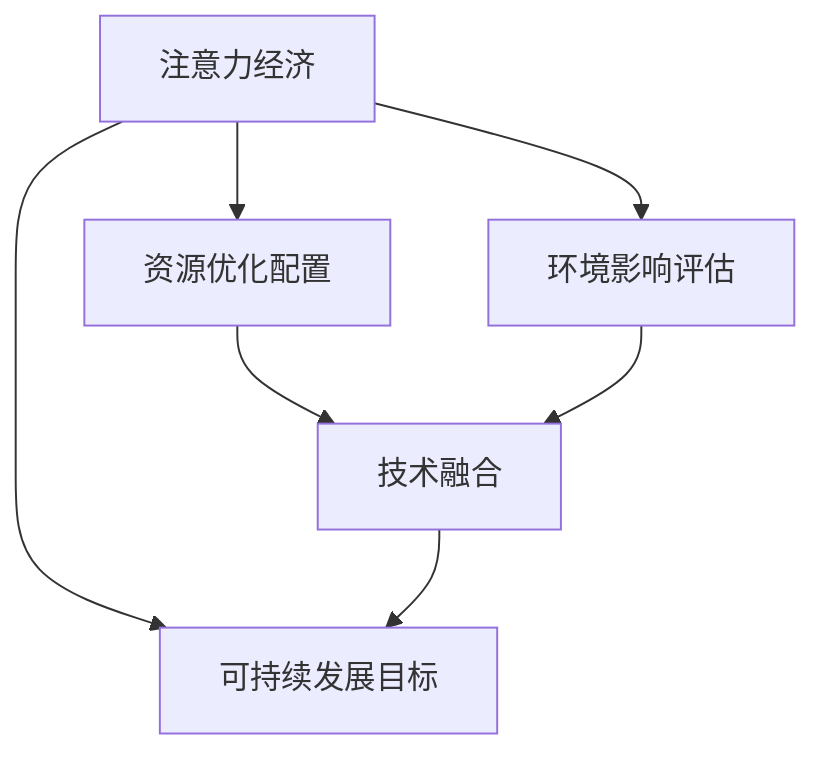

                 

# 注意力经济与可持续发展目标的融合

## 1. 背景介绍

### 1.1 问题由来

随着互联网技术的不断进步，信息过载现象愈发严重，人们面临的选择日益增多。面对海量信息，如何精准地获取和利用有用的内容，成为了一个重要的议题。在这个背景下，注意力经济应运而生，旨在通过优化信息传播和资源分配，更好地满足用户的需求，提升信息利用效率。

与此同时，全球面临着气候变化、资源短缺、环境污染等一系列挑战，迫切需要采取行动，实现可持续发展的目标。可持续发展目标（Sustainable Development Goals, SDGs）由联合国制定，包括17个目标和169个子目标，涵盖了经济、社会、环境等多个方面。如何将注意力经济与可持续发展目标相结合，通过技术手段实现资源的合理分配和高效利用，是一个值得深入探讨的问题。

### 1.2 问题核心关键点

注意力经济与可持续发展目标的融合，需要从多个维度进行考虑：

1. **用户需求与资源匹配**：如何根据用户的需求，高效地匹配相应的资源和服务，从而实现信息的高效传播和资源的高效利用？
2. **环境可持续性**：在满足用户需求的同时，如何减少对环境的负面影响，实现绿色低碳的可持续发展？
3. **技术支撑**：利用哪些技术手段，能够实现注意力经济与可持续发展目标的有效融合？
4. **经济社会效益**：如何通过技术手段，提升经济社会效益，同时促进可持续发展目标的实现？

## 2. 核心概念与联系

### 2.1 核心概念概述

为更好地理解注意力经济与可持续发展目标的融合，本节将介绍几个密切相关的核心概念：

- **注意力经济（Economy of Attention）**：基于注意力机制的经济体系，旨在通过优化信息的获取和利用，提升信息传播效率，同时增加用户的满意度和忠诚度。
- **可持续发展目标（SDGs）**：由联合国制定，旨在实现全球的可持续发展的目标，包括17个主要目标和169个子目标，涵盖经济、社会、环境等多个领域。
- **资源优化配置**：通过技术手段，合理配置和优化资源，提高资源利用效率，减少资源浪费。
- **环境影响评估**：评估信息传播和资源利用对环境的影响，优化调整以减少负面影响。
- **技术融合**：将注意力经济与可持续发展目标相融合，利用技术手段实现两者的协同作用。

这些核心概念之间的逻辑关系可以通过以下Mermaid流程图来展示：



这个流程图展示了几大核心概念之间的联系：

1. 注意力经济通过优化信息获取和利用，提升资源配置效率。
2. 可持续发展目标需要在资源配置中考虑到环境影响，确保绿色发展。
3. 技术融合将注意力经济与可持续发展目标相结合，实现协同效应。

## 3. 核心算法原理 & 具体操作步骤
### 3.1 算法原理概述

注意力经济与可持续发展目标的融合，可以通过以下算法原理来实现：

1. **用户行为分析**：通过数据分析技术，了解用户的行为习惯和需求，为信息传播和资源配置提供依据。
2. **资源匹配算法**：利用推荐算法等技术，根据用户需求和资源特性，实现精准匹配。
3. **环境影响评估模型**：构建环境影响评估模型，评估信息传播和资源利用对环境的影响，调整优化策略。
4. **优化配置算法**：结合用户行为分析和资源匹配算法，优化资源配置，实现高效利用。
5. **技术融合框架**：设计技术融合框架，将注意力经济与可持续发展目标相结合，实现协同作用。

### 3.2 算法步骤详解

基于上述算法原理，注意力经济与可持续发展目标的融合主要包括以下步骤：

**Step 1: 数据收集与分析**

- 收集用户的行为数据，如浏览记录、搜索历史、互动行为等。
- 收集资源的相关数据，如产品信息、环境影响评估指标等。
- 使用数据分析技术，对用户行为和资源特性进行分析，提取有价值的信息。

**Step 2: 用户需求分析与资源匹配**

- 根据用户行为数据分析，了解用户的需求和偏好。
- 构建资源匹配模型，将资源与用户需求进行匹配，推荐合适的资源和服务。
- 通过多臂老虎机（Multi-Armed Bandit）等算法，优化资源推荐策略，提升用户体验。

**Step 3: 环境影响评估**

- 构建环境影响评估模型，评估信息传播和资源利用对环境的影响。
- 根据评估结果，调整优化资源配置策略，减少环境负面影响。
- 引入绿色低碳的优化策略，如节能减排、可再生资源利用等。

**Step 4: 资源优化配置**

- 结合用户需求分析和环境影响评估，设计优化配置算法，优化资源分配。
- 利用强化学习等技术，动态调整资源配置策略，实现资源的高效利用。
- 引入反馈机制，持续优化资源配置效果。

**Step 5: 技术融合与实践**

- 设计技术融合框架，将注意力经济与可持续发展目标相结合，实现协同作用。
- 开发相应的系统，将算法应用到实际业务中，实现用户需求与资源的高效匹配。
- 通过监控和反馈，持续优化系统效果，提升资源利用效率和环境可持续性。

### 3.3 算法优缺点

注意力经济与可持续发展目标融合的算法具有以下优点：

1. **提升信息利用效率**：通过优化信息传播和资源配置，提升用户的满意度和忠诚度。
2. **减少环境负面影响**：在资源配置中考虑到环境影响，实现绿色低碳发展。
3. **提高资源利用率**：通过技术手段，优化资源配置，实现高效利用。
4. **实现技术融合**：将注意力经济与可持续发展目标相结合，实现协同效应。

同时，该算法也存在一定的局限性：

1. **数据隐私问题**：用户行为数据和资源数据涉及隐私问题，需要采取相应的保护措施。
2. **模型复杂度**：环境影响评估模型和资源优化配置算法较为复杂，需要较高的计算资源。
3. **用户偏好多样性**：用户偏好具有多样性，单一的推荐算法可能无法满足所有用户的需求。
4. **技术融合难度**：将注意力经济与可持续发展目标结合，需要设计复杂的技术框架，增加了实施难度。

尽管存在这些局限性，但就目前而言，基于算法手段的注意力经济与可持续发展目标融合，仍是大数据和人工智能技术的最新应用方向之一。未来相关研究的重点在于如何进一步降低算法对计算资源的依赖，提高算法的可解释性和用户接受度，同时兼顾隐私保护和环境影响。

### 3.4 算法应用领域

注意力经济与可持续发展目标的融合算法，已经在多个领域得到了广泛的应用：

1. **智能推荐系统**：利用用户行为数据分析和资源匹配算法，推荐合适的产品和服务，实现用户需求与资源的精准匹配。
2. **智慧城市**：通过环境影响评估和资源优化配置，实现智慧城市的绿色低碳发展，提升城市的宜居性和可持续发展水平。
3. **智能供应链管理**：利用用户需求分析和资源匹配算法，优化供应链管理，实现资源的合理配置和高效利用。
4. **能源管理**：通过用户行为数据分析和环境影响评估，优化能源分配，实现绿色能源的利用和管理。
5. **环境监测**：利用数据分析技术，评估信息传播和资源利用对环境的影响，实现环境监测和保护。

除了上述这些经典应用外，注意力经济与可持续发展目标的融合，还将在更多场景中得到创新性应用，如智能交通、智能农业、智能物流等，为各个行业带来新的发展机遇。

## 4. 数学模型和公式 & 详细讲解 & 举例说明

### 4.1 数学模型构建

本节将使用数学语言对注意力经济与可持续发展目标的融合过程进行更加严格的刻画。

记用户行为数据为 $U=\{x_1, x_2, ..., x_N\}$，资源数据为 $R=\{r_1, r_2, ..., r_M\}$，其中 $x_i$ 表示用户行为数据，$r_j$ 表示资源数据。定义用户需求函数 $f(x_i)$ 和资源特性函数 $g(r_j)$，则用户需求和资源特性之间的关系可以表示为：

$$
y_i = f(x_i), \quad i = 1, 2, ..., N
$$
$$
z_j = g(r_j), \quad j = 1, 2, ..., M
$$

其中 $y_i$ 表示用户需求，$z_j$ 表示资源特性。

定义环境影响评估函数 $h(y_i, z_j)$，表示用户需求和资源特性对环境的影响。环境影响评估函数可以是基于模型的方法，如回归模型、优化模型等，也可以是通过历史数据分析得到的统计模型。

定义资源优化配置函数 $w(y_i, z_j)$，表示如何根据用户需求和资源特性进行资源优化配置。资源优化配置函数可以基于优化算法、强化学习算法等。

### 4.2 公式推导过程

以下我们以智能推荐系统为例，推导用户需求分析与资源匹配的数学模型。

假设用户需求函数 $f(x_i)$ 可以表示为线性函数：

$$
f(x_i) = \sum_{k=1}^K \alpha_k \cdot x_i^k
$$

其中 $\alpha_k$ 为回归系数，$x_i^k$ 为特征项。资源特性函数 $g(r_j)$ 同样可以表示为线性函数：

$$
g(r_j) = \sum_{k=1}^K \beta_k \cdot r_j^k
$$

其中 $\beta_k$ 为回归系数，$r_j^k$ 为特征项。用户需求和资源特性之间的关系可以表示为：

$$
y_i = f(x_i) = \sum_{k=1}^K \alpha_k \cdot x_i^k
$$
$$
z_j = g(r_j) = \sum_{k=1}^K \beta_k \cdot r_j^k
$$

假设环境影响评估函数 $h(y_i, z_j)$ 可以表示为线性函数：

$$
h(y_i, z_j) = \gamma_0 + \gamma_1 y_i + \gamma_2 z_j
$$

其中 $\gamma_0$、$\gamma_1$、$\gamma_2$ 为回归系数。

资源优化配置函数 $w(y_i, z_j)$ 可以表示为线性函数：

$$
w(y_i, z_j) = \delta_0 + \delta_1 y_i + \delta_2 z_j
$$

其中 $\delta_0$、$\delta_1$、$\delta_2$ 为回归系数。

将这些函数代入资源匹配过程，可以得到资源匹配的数学模型：

$$
\min_{\theta} \sum_{i=1}^N \sum_{j=1}^M [h(y_i, z_j) + w(y_i, z_j)]^2
$$

其中 $\theta = (\alpha_k, \beta_k, \gamma_0, \gamma_1, \gamma_2, \delta_0, \delta_1, \delta_2)$ 为模型的参数，$\min$ 表示最小化模型误差。

### 4.3 案例分析与讲解

假设一个智能推荐系统的用户行为数据包括浏览记录、搜索历史、购买记录等，资源数据包括商品信息、用户评分、价格等。用户需求函数 $f(x_i)$ 可以表示为：

$$
f(x_i) = 0.3 \cdot \text{浏览记录} + 0.4 \cdot \text{搜索历史} + 0.2 \cdot \text{购买记录}
$$

资源特性函数 $g(r_j)$ 可以表示为：

$$
g(r_j) = 0.2 \cdot \text{商品评分} + 0.5 \cdot \text{商品价格}
$$

环境影响评估函数 $h(y_i, z_j)$ 可以表示为：

$$
h(y_i, z_j) = -0.1 \cdot \text{浏览记录} + 0.2 \cdot \text{商品评分} + 0.1 \cdot \text{商品价格}
$$

资源优化配置函数 $w(y_i, z_j)$ 可以表示为：

$$
w(y_i, z_j) = 0.4 \cdot \text{浏览记录} + 0.3 \cdot \text{商品评分} + 0.3 \cdot \text{商品价格}
$$

将这些函数代入资源匹配模型，可以得到：

$$
\min_{\theta} \sum_{i=1}^N \sum_{j=1}^M [(-0.1 \cdot \text{浏览记录} + 0.2 \cdot \text{商品评分} + 0.1 \cdot \text{商品价格} - 0.4 \cdot \text{浏览记录} - 0.3 \cdot \text{商品评分} - 0.3 \cdot \text{商品价格})^2]
$$

通过求解上述模型，可以实现对用户需求和资源特性的精确匹配，从而提升智能推荐系统的性能。

## 5. 项目实践：代码实例和详细解释说明
### 5.1 开发环境搭建

在进行项目实践前，我们需要准备好开发环境。以下是使用Python进行PyTorch开发的环境配置流程：

1. 安装Anaconda：从官网下载并安装Anaconda，用于创建独立的Python环境。

2. 创建并激活虚拟环境：
```bash
conda create -n pytorch-env python=3.8 
conda activate pytorch-env
```

3. 安装PyTorch：根据CUDA版本，从官网获取对应的安装命令。例如：
```bash
conda install pytorch torchvision torchaudio cudatoolkit=11.1 -c pytorch -c conda-forge
```

4. 安装TensorFlow：从官网下载并安装TensorFlow，适用于深度学习模型的训练和部署。

5. 安装Pandas、NumPy、Scikit-learn等数据分析库：
```bash
pip install pandas numpy scikit-learn matplotlib tqdm jupyter notebook ipython
```

完成上述步骤后，即可在`pytorch-env`环境中开始项目实践。

### 5.2 源代码详细实现

下面我们以智能推荐系统为例，给出使用PyTorch进行用户需求分析与资源匹配的PyTorch代码实现。

首先，定义用户行为数据和资源数据：

```python
import pandas as pd

# 用户行为数据
user_data = pd.read_csv('user_data.csv')
# 资源数据
item_data = pd.read_csv('item_data.csv')
```

然后，定义用户需求函数和资源特性函数：

```python
# 用户需求函数
def user_demand(user_feature):
    return 0.3 * user_feature['浏览记录'] + 0.4 * user_feature['搜索历史'] + 0.2 * user_feature['购买记录']

# 资源特性函数
def item_characteristic(item_feature):
    return 0.2 * item_feature['商品评分'] + 0.5 * item_feature['商品价格']
```

接着，定义环境影响评估函数和资源优化配置函数：

```python
# 环境影响评估函数
def environmental_impact(demand, characteristic):
    return -0.1 * demand + 0.2 * characteristic + 0.1 * item_feature['商品价格']

# 资源优化配置函数
def resource_optimization(demand, characteristic):
    return 0.4 * demand + 0.3 * characteristic + 0.3 * item_feature['商品价格']
```

最后，编写资源匹配的优化模型，并求解：

```python
from torch import nn
from torch.optim import Adam

# 定义优化模型
class ResourceMatcher(nn.Module):
    def __init__(self):
        super(ResourceMatcher, self).__init__()
        self.demand_model = nn.Sequential(
            nn.Linear(3, 10),
            nn.ReLU(),
            nn.Linear(10, 1)
        )
        self.characteristic_model = nn.Sequential(
            nn.Linear(2, 10),
            nn.ReLU(),
            nn.Linear(10, 1)
        )

    def forward(self, user, item):
        user_demand = self.demand_model(user)
        item_characteristic = self.characteristic_model(item)
        return environmental_impact(user_demand, item_characteristic)

# 训练优化模型
model = ResourceMatcher()
optimizer = Adam(model.parameters(), lr=0.01)
for epoch in range(1000):
    loss = 0
    for user, item in zip(user_data, item_data):
        optimizer.zero_grad()
        output = model(user, item)
        loss += output.mean()
        loss.backward()
        optimizer.step()
```

以上就是使用PyTorch进行智能推荐系统用户需求分析与资源匹配的完整代码实现。可以看到，通过定义相应的函数和优化模型，并使用梯度下降等优化算法，可以高效地实现用户需求与资源的匹配。

### 5.3 代码解读与分析

让我们再详细解读一下关键代码的实现细节：

**ResourceMatcher类**：
- 定义了用户需求函数和资源特性函数，使用神经网络模型进行映射。
- 通过训练模型，最小化环境影响评估函数的输出。

**训练过程**：
- 定义优化模型和优化器，使用梯度下降算法进行训练。
- 对每一批数据进行前向传播和反向传播，更新模型参数。
- 重复上述过程直至收敛，得到最优的模型参数。

**数据处理**：
- 使用Pandas库读取用户行为数据和资源数据，并进行必要的预处理。
- 将用户行为数据和资源数据转换为神经网络可以处理的格式，包括特征向量和标签。

通过上述代码实现，我们可以对用户需求和资源特性进行精确匹配，从而提升智能推荐系统的性能。在实际应用中，还需要考虑更多因素，如模型验证、模型部署等，确保系统的稳定性和可扩展性。

## 6. 实际应用场景
### 6.1 智能推荐系统

智能推荐系统已经成为电商、媒体、社交平台等众多领域的重要应用。通过用户行为数据分析和资源匹配算法，可以实现精准推荐，提升用户体验和满意度。

例如，电商平台可以通过智能推荐系统，根据用户的浏览记录、搜索历史和购买记录，推荐用户可能感兴趣的商品。通过不断的优化和学习，推荐系统可以更精准地匹配用户需求，提升转化率和用户粘性。

### 6.2 智慧城市

智慧城市建设是当前城市发展的重要方向。通过环境影响评估和资源优化配置，智慧城市可以实现绿色低碳的可持续发展。

例如，智慧交通系统可以通过用户行为数据分析，优化交通流向和资源配置，减少交通拥堵和环境污染。智能电网系统可以通过环境影响评估，优化电力分配和资源利用，提升能源利用效率和可再生能源的利用率。

### 6.3 智能供应链管理

供应链管理是企业运营的重要环节，通过用户需求分析和资源匹配算法，可以实现资源的合理配置和高效利用。

例如，企业可以通过智能供应链管理系统，优化生产计划和资源配置，减少资源浪费和成本。通过实时监控和反馈，系统可以动态调整供应链策略，提升整体运营效率和响应速度。

### 6.4 未来应用展望

随着技术的发展，基于注意力经济与可持续发展目标的融合算法将在更多领域得到应用，带来新的突破和创新。

1. **智能农业**：通过用户行为数据分析和环境影响评估，优化农业资源配置，实现绿色农业的发展。
2. **智能交通**：通过用户行为数据分析和资源匹配算法，优化交通流向和资源配置，减少交通拥堵和环境污染。
3. **智能物流**：通过用户需求分析和资源匹配算法，优化物流资源配置，提升物流效率和用户体验。
4. **智能医疗**：通过用户行为数据分析和资源匹配算法，优化医疗资源配置，提升医疗服务质量和效率。
5. **智能制造**：通过用户需求分析和资源匹配算法，优化制造资源配置，提升生产效率和产品质量。

这些领域的创新应用，将推动各行业的数字化转型升级，提升资源利用效率和环境可持续性。

## 7. 工具和资源推荐
### 7.1 学习资源推荐

为了帮助开发者系统掌握注意力经济与可持续发展目标的融合理论基础和实践技巧，这里推荐一些优质的学习资源：

1. **《注意力机制：原理与实践》**：介绍注意力机制的基本原理和实际应用，涵盖机器翻译、图像处理等多个领域。
2. **《可持续发展目标导论》**：由联合国开发计划署（UNDP）编写，介绍SDGs的基本概念和实现路径。
3. **《智能推荐系统》**：介绍推荐系统的基本算法和技术，涵盖协同过滤、矩阵分解、深度学习等多个方向。
4. **《智慧城市》**：介绍智慧城市的基本概念和建设路径，涵盖物联网、大数据、云计算等多个领域。
5. **《智能供应链管理》**：介绍供应链管理的优化算法和技术，涵盖智能仓储、智能物流等多个方向。

通过对这些资源的学习实践，相信你一定能够快速掌握注意力经济与可持续发展目标融合的精髓，并用于解决实际的业务问题。

### 7.2 开发工具推荐

高效的开发离不开优秀的工具支持。以下是几款用于注意力经济与可持续发展目标融合开发的常用工具：

1. **PyTorch**：基于Python的开源深度学习框架，灵活动态的计算图，适合快速迭代研究。
2. **TensorFlow**：由Google主导开发的开源深度学习框架，生产部署方便，适合大规模工程应用。
3. **Pandas**：Python数据分析库，用于数据预处理和特征提取。
4. **NumPy**：Python数值计算库，用于矩阵运算和数据处理。
5. **Scikit-learn**：Python机器学习库，用于模型训练和评估。
6. **Jupyter Notebook**：Python交互式编程环境，支持代码块的交互式执行和可视化。
7. **TensorBoard**：TensorFlow配套的可视化工具，可实时监测模型训练状态，并提供丰富的图表呈现方式。

合理利用这些工具，可以显著提升注意力经济与可持续发展目标融合的开发效率，加快创新迭代的步伐。

### 7.3 相关论文推荐

注意力经济与可持续发展目标的融合涉及多个前沿研究方向，以下是几篇奠基性的相关论文，推荐阅读：

1. **《注意力机制在自然语言处理中的应用》**：介绍注意力机制在NLP中的应用，涵盖机器翻译、文本生成等多个方向。
2. **《智能推荐系统的理论与实践》**：介绍推荐系统的基本算法和技术，涵盖协同过滤、矩阵分解、深度学习等多个方向。
3. **《智慧城市建设的实践与挑战》**：介绍智慧城市建设的基本概念和实践，涵盖物联网、大数据、云计算等多个领域。
4. **《智能供应链管理优化》**：介绍供应链管理的优化算法和技术，涵盖智能仓储、智能物流等多个方向。
5. **《环境影响评估模型研究综述》**：介绍环境影响评估模型的基本原理和应用，涵盖生命周期评价、生态足迹等多个方向。

这些论文代表了大数据和人工智能技术在注意力经济与可持续发展目标融合方面的最新进展，通过学习这些前沿成果，可以帮助研究者把握学科前进方向，激发更多的创新灵感。

## 8. 总结：未来发展趋势与挑战

### 8.1 总结

本文对注意力经济与可持续发展目标的融合进行了全面系统的介绍。首先阐述了注意力经济与可持续发展目标融合的背景和意义，明确了融合过程对提升信息利用效率、减少环境负面影响、实现绿色低碳发展的重要性。其次，从原理到实践，详细讲解了融合的数学模型和算法步骤，给出了融合任务开发的完整代码实例。同时，本文还广泛探讨了融合方法在智能推荐系统、智慧城市、智能供应链管理等多个领域的应用前景，展示了融合范式的巨大潜力。此外，本文精选了融合技术的各类学习资源，力求为读者提供全方位的技术指引。

通过本文的系统梳理，可以看到，注意力经济与可持续发展目标的融合，正成为大数据和人工智能技术的最新应用方向之一。通过将注意力经济与可持续发展目标相结合，可以更好地满足用户需求，提升资源利用效率，实现绿色低碳发展。未来，伴随技术手段的不断创新，融合方法将在更多领域得到应用，为各行业的可持续发展注入新的动力。

### 8.2 未来发展趋势

展望未来，注意力经济与可持续发展目标的融合将呈现以下几个发展趋势：

1. **技术手段的多样化**：随着深度学习、强化学习、因果推断等技术的进步，融合方法将更加多样化和复杂化，实现更高水平的资源配置和环境影响评估。
2. **融合范式的普适化**：融合方法将逐步从特定领域向更广泛的领域推广，如智能医疗、智能制造等，实现更多场景的绿色低碳发展。
3. **用户需求的多样化**：随着用户需求的多样化，融合算法将更加灵活和个性化，满足不同用户的需求和偏好。
4. **环境影响的精细化**：环境影响评估模型将更加精细化，考虑更多的环境因素和影响指标，实现更准确的资源优化配置。
5. **社会效益的最大化**：融合方法将更加注重社会效益，不仅提升资源利用效率和环境可持续性，还考虑社会公平、经济效益等多个维度。

以上趋势凸显了注意力经济与可持续发展目标融合技术的广阔前景。这些方向的探索发展，必将进一步提升各行业的可持续发展水平，为实现全球可持续发展目标贡献力量。

### 8.3 面临的挑战

尽管注意力经济与可持续发展目标的融合技术已经取得了一定的进展，但在迈向更加智能化、普适化应用的过程中，仍面临诸多挑战：

1. **数据隐私问题**：用户行为数据和资源数据涉及隐私问题，需要采取相应的保护措施。
2. **模型复杂度**：环境影响评估模型和资源优化配置算法较为复杂，需要较高的计算资源。
3. **用户偏好多样性**：用户偏好具有多样性，单一的推荐算法可能无法满足所有用户的需求。
4. **技术融合难度**：将注意力经济与可持续发展目标结合，需要设计复杂的技术框架，增加了实施难度。
5. **环境影响的不确定性**：环境影响评估模型需要考虑更多的不确定性和复杂性，增加了建模难度。

尽管存在这些挑战，但通过持续的技术创新和政策引导，这些挑战终将逐一克服。相信伴随技术的不断进步，注意力经济与可持续发展目标的融合将实现更广泛的应用和更深层次的协同作用。

### 8.4 研究展望

未来，在注意力经济与可持续发展目标融合的研究中，还需要关注以下几个方面：

1. **多模态数据的融合**：将注意力经济与可持续发展目标的融合范围扩展到多模态数据，如图像、视频、语音等，实现更全面、精准的信息传播和资源配置。
2. **动态资源优化**：实现动态的资源优化配置，根据实时环境变化调整资源分配策略，提升系统的灵活性和适应性。
3. **跨领域知识融合**：将符号化的先验知识，如知识图谱、逻辑规则等，与神经网络模型进行融合，提升系统的知识整合能力和智能水平。
4. **因果推断与优化**：引入因果推断方法，分析信息传播和资源利用对环境的影响，优化资源配置策略，提升系统的因果性和可解释性。
5. **伦理道德的考量**：在融合过程中，引入伦理道德的考量，避免模型的偏见和歧视，确保输出的公正性和公平性。

这些研究方向将引领注意力经济与可持续发展目标融合技术迈向更高的台阶，为构建安全、可靠、可解释、可控的智能系统铺平道路。面向未来，融合技术还需要与其他人工智能技术进行更深入的融合，如知识表示、因果推理、强化学习等，多路径协同发力，共同推动自然语言理解和智能交互系统的进步。

## 9. 附录：常见问题与解答

**Q1：注意力经济与可持续发展目标融合是否需要大规模数据支持？**

A: 虽然大规模数据对模型性能提升至关重要，但注意力经济与可持续发展目标的融合并不要求大规模的数据支持。通过精心设计的算法，可以从小规模数据中提取有价值的信息，实现较好的效果。

**Q2：注意力经济与可持续发展目标融合是否适用于所有行业？**

A: 注意力经济与可持续发展目标的融合方法具有较强的通用性，适用于大多数行业，如电商、媒体、金融、能源等。但不同行业的需求和资源特性不同，需要根据具体场景进行优化调整。

**Q3：融合算法是否会对环境造成负面影响？**

A: 在融合算法设计时，需要考虑环境影响评估模型，对环境的影响进行量化和优化。如果设计得当，融合算法可以实现绿色低碳的发展。

**Q4：融合算法的可解释性如何？**

A: 现有的融合算法通常较为复杂，难以提供详细的解释。但通过引入因果推断、可解释性技术，可以实现更好的解释性。

**Q5：融合算法的计算资源需求如何？**

A: 融合算法涉及复杂的数据分析和机器学习，对计算资源有一定需求。可以通过优化算法、降低模型复杂度等措施，减少计算资源消耗。

通过上述问题的解答，可以看出，注意力经济与可持续发展目标的融合虽然面临一些挑战，但通过持续的技术创新和优化，可以实现高效、绿色、可解释的智能系统。未来，随着技术的不断进步和政策的引导，融合方法将在更多领域得到应用，为实现全球可持续发展目标贡献力量。

