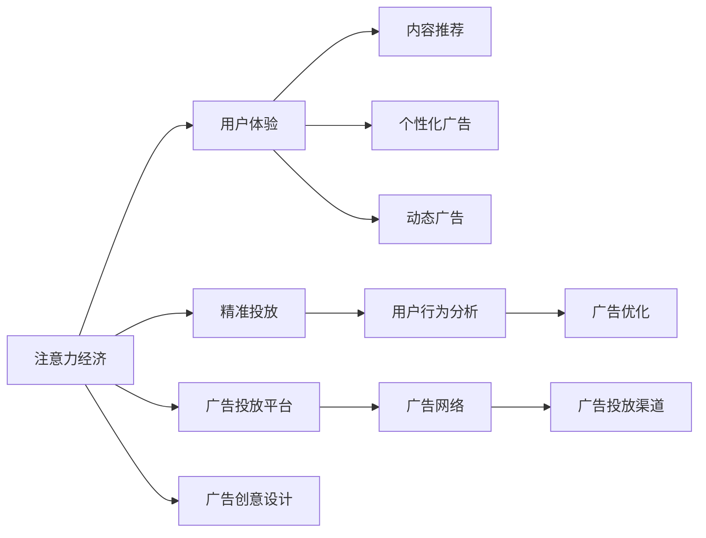

                 

## 1. 背景介绍

### 1.1 问题由来
数字时代的浪潮下，广告行业正经历着深刻的变革。传统广告形式正逐渐被用户忽视，而更为贴合用户需求、展示价值内容的智能广告形式正逐渐走入人们的视野。如何设计出吸引用户且不牺牲用户体验的广告，成为广告主和广告平台面临的重大挑战。

### 1.2 问题核心关键点
本问题聚焦于如何设计在线广告，既能够显著提升用户点击率和转化率，又能够保证良好的用户体验，避免用户反感和广告疲劳。

### 1.3 问题研究意义
研究在线广告设计方法，对于提升广告投放效率、优化广告点击率、降低广告投放成本具有重要意义。同时，改善用户体验，构建用户信任，对于广告主品牌形象的塑造和用户忠诚度的提升也有显著影响。

## 2. 核心概念与联系

### 2.1 核心概念概述
以下是与在线广告设计相关的核心概念及其相互关系：

- **注意力经济**：指在数字经济时代，通过吸引和利用用户注意力创造经济价值的活动。

- **用户体验（User Experience, UX）**：指用户在使用产品或服务时所获得的满足感和愉悦感，对广告点击率有直接影响。

- **精准投放（Targeted Advertising）**：指根据用户的特定属性和行为特征，推送相关的广告，以提高广告的转化率。

- **内容推荐（Content Recommendation）**：指根据用户的兴趣和行为，推荐符合其喜好的内容，提升用户粘性和广告效果。

- **个性化广告（Personalized Advertising）**：指根据用户的个性化需求，定制化推荐广告，以提高广告的吸引力和转化率。

- **动态广告（Dynamic Advertising）**：指根据用户行为实时调整广告内容，以提高广告的相关性和时效性。

- **用户行为分析（User Behavior Analysis）**：指通过数据分析，了解用户的行为模式和偏好，以指导广告设计和投放策略。

### 2.2 核心概念原理和架构的 Mermaid 流程图


以上图表展示了注意力经济与在线广告设计各要素之间的联系：

1. **注意力经济**：为广告投放提供基础，确保广告能够有效吸引用户注意力，从而创造经济价值。
2. **用户体验**：直接影响用户点击率，是广告设计中的重要考虑因素。
3. **精准投放**：根据用户行为和属性，提高广告的转化率和点击率。
4. **内容推荐**：结合用户兴趣和广告内容，提升用户粘性。
5. **个性化广告**：根据用户个性化需求定制广告，提高广告的吸引力和转化率。
6. **动态广告**：根据用户行为实时调整广告内容，提高广告的相关性和时效性。
7. **用户行为分析**：通过数据分析，优化广告投放策略。
8. **广告优化**：基于数据分析结果不断优化广告设计。
9. **广告投放平台**：连接广告主和广告网络。
10. **广告网络**：连接广告投放平台和广告投放渠道。
11. **广告投放渠道**：具体执行广告投放的媒介和渠道。
12. **广告创意设计**：设计符合用户需求和广告目标的广告内容。

## 3. 核心算法原理 & 具体操作步骤

### 3.1 算法原理概述
在线广告设计的核心在于平衡广告的展示效果和用户体验。基于注意力经济学原理，我们希望在保持用户注意力集中的同时，减少广告的干扰。核心算法可以概括为以下几个步骤：

1. **用户行为分析**：收集用户点击、浏览、停留等行为数据，分析用户兴趣和行为模式。
2. **广告内容生成**：根据用户行为特征，生成符合用户兴趣的广告内容。
3. **个性化推荐**：根据用户行为特征，推荐符合用户偏好的广告。
4. **动态调整**：根据用户行为实时调整广告内容，提升广告相关性和时效性。
5. **效果评估与优化**：通过用户点击率、转化率等指标评估广告效果，并不断优化广告策略。

### 3.2 算法步骤详解
#### 3.2.1 用户行为分析
用户行为分析是广告设计的基础。通过用户行为数据，可以挖掘用户的兴趣偏好和行为模式，为广告内容生成和推荐提供依据。具体步骤如下：

1. **数据收集**：收集用户的点击、浏览、停留、退出等行为数据，存储在数据仓库中。
2. **特征提取**：从行为数据中提取有价值的用户特征，如兴趣标签、浏览时长、点击率等。
3. **行为模式分析**：通过聚类、分类等算法，分析用户的行为模式，识别用户兴趣和偏好。

#### 3.2.2 广告内容生成
广告内容生成是广告设计中的核心步骤。其目标是根据用户行为特征，生成具有吸引力的广告内容，具体步骤如下：

1. **创意素材准备**：准备多种广告创意素材，如图片、视频、文案等。
2. **内容生成模型**：使用自然语言生成模型（如GPT-3）或图像生成模型（如GPT-Neo）根据用户特征生成广告内容。
3. **内容优化**：根据用户反馈和点击率等指标，不断优化广告内容。

#### 3.2.3 个性化推荐
个性化推荐是提升广告效果的关键。通过用户行为分析，生成符合用户偏好的广告内容，提高点击率和转化率。具体步骤如下：

1. **推荐模型构建**：构建基于协同过滤、内容推荐等算法的推荐模型，根据用户历史行为和偏好推荐广告。
2. **推荐数据生成**：根据推荐模型，生成个性化推荐数据，推送给用户。
3. **推荐效果评估**：根据用户点击率、转化率等指标评估推荐效果，并不断优化推荐模型。

#### 3.2.4 动态调整
动态广告设计可以提升广告的时效性和相关性，具体步骤如下：

1. **行为实时监测**：实时监测用户行为数据，捕捉用户兴趣和行为变化。
2. **广告实时调整**：根据实时监测结果，动态调整广告内容，如更新图片、修改文案等。
3. **效果实时评估**：实时评估广告效果，优化广告策略。

#### 3.2.5 效果评估与优化
效果评估与优化是广告设计的最后一步。通过用户点击率、转化率等指标评估广告效果，具体步骤如下：

1. **数据收集**：收集用户点击、转化等数据，存储在数据仓库中。
2. **指标分析**：通过统计分析方法，评估广告效果。
3. **优化调整**：根据评估结果，调整广告策略，提升广告效果。

### 3.3 算法优缺点
#### 3.3.1 优点
- **提高广告点击率**：通过用户行为分析，生成符合用户兴趣的广告内容，提高用户点击率。
- **提升广告转化率**：通过个性化推荐和动态调整，提高广告的转化率。
- **优化用户体验**：通过动态调整，减少广告干扰，提升用户粘性。
- **降低广告成本**：通过精准投放，降低无效广告曝光，减少广告成本。

#### 3.3.2 缺点
- **数据隐私问题**：用户行为数据可能涉及隐私问题，需严格遵守数据保护法律法规。
- **计算资源消耗高**：用户行为分析、广告内容生成和动态调整需大量计算资源。
- **算法复杂度高**：推荐算法和内容生成模型复杂度较高，需不断优化。
- **广告效果难以量化**：广告效果受用户情绪、环境等多因素影响，难以完全量化评估。

### 3.4 算法应用领域
在线广告设计在多个领域得到广泛应用，例如：

- **电商广告**：通过用户行为分析，生成个性化推荐广告，提高商品转化率。
- **社交媒体广告**：根据用户兴趣，生成符合用户偏好的广告内容，提升用户粘性。
- **视频广告**：通过动态调整，根据用户行为实时展示广告，提高用户点击率。
- **搜索引擎广告**：通过精准投放，提高广告的展示效果和转化率。

## 4. 数学模型和公式 & 详细讲解 & 举例说明

### 4.1 数学模型构建
在线广告设计的数学模型主要包括以下几个部分：

- **用户行为分析**：通过点击率、停留时长等行为数据，构建用户兴趣模型。
- **广告内容生成**：使用自然语言生成模型，根据用户特征生成广告文案。
- **个性化推荐**：构建协同过滤推荐模型，根据用户行为特征推荐广告。
- **动态调整**：实时监测用户行为，动态调整广告内容。

### 4.2 公式推导过程
#### 4.2.1 用户行为分析模型
假设用户行为数据为 $X=(x_1, x_2, ..., x_n)$，其中 $x_i$ 表示用户第 $i$ 次行为数据。

用户兴趣模型为 $P(x_i|U)$，其中 $U$ 表示用户兴趣。

通过点击率、停留时长等行为数据，可以构建用户兴趣模型 $P(x_i|U)$：

$$
P(x_i|U) = \frac{P(x_i|U)}{P(x_i)} = \frac{\text{点击率}}{\text{曝光率}} = \frac{\text{点击数}}{\text{曝光数}}
$$

#### 4.2.2 广告内容生成模型
假设广告内容为 $A=(a_1, a_2, ..., a_m)$，其中 $a_i$ 表示第 $i$ 个广告内容。

广告内容生成模型为 $P(A|U)$，其中 $U$ 表示用户兴趣。

通过自然语言生成模型（如GPT-3），根据用户特征生成广告内容 $P(A|U)$：

$$
P(A|U) = \frac{P(A|U)}{P(A)} = \frac{\text{生成广告}}{\text{所有广告}} = \frac{\text{生成广告数}}{\text{总广告数}}
$$

#### 4.2.3 个性化推荐模型
假设推荐广告为 $R=(r_1, r_2, ..., r_k)$，其中 $r_i$ 表示第 $i$ 个推荐广告。

推荐模型为 $P(R|U)$，其中 $U$ 表示用户兴趣。

通过协同过滤推荐模型，根据用户行为特征推荐广告 $P(R|U)$：

$$
P(R|U) = \frac{P(R|U)}{P(R)} = \frac{\text{推荐广告数}}{\text{所有广告数}}
$$

#### 4.2.4 动态调整模型
假设实时行为数据为 $D=(d_1, d_2, ..., d_n)$，其中 $d_i$ 表示第 $i$ 次实时行为数据。

动态调整模型为 $P(D|U)$，其中 $U$ 表示用户兴趣。

通过实时监测用户行为数据，动态调整广告内容 $P(D|U)$：

$$
P(D|U) = \frac{P(D|U)}{P(D)} = \frac{\text{实时行为数据数}}{\text{总行为数据数}}
$$

### 4.3 案例分析与讲解
假设某电商网站使用在线广告设计策略，具体案例如下：

#### 案例背景
某电商网站有数百万用户，每天生成大量广告数据。为提升广告效果，网站决定引入在线广告设计策略。

#### 数据准备
网站收集用户点击、浏览、停留等行为数据，构建用户行为数据集 $D$。

#### 用户行为分析
通过行为数据集 $D$，构建用户兴趣模型 $P(x_i|U)$：

1. 收集用户点击、停留时长等行为数据，构建行为数据集 $D$。
2. 通过统计分析方法，构建用户兴趣模型 $P(x_i|U)$。
3. 根据用户兴趣模型 $P(x_i|U)$，生成用户兴趣标签。

#### 广告内容生成
使用GPT-3生成广告文案，构建广告内容生成模型 $P(A|U)$：

1. 使用GPT-3生成多种广告文案，构建广告内容库 $A$。
2. 根据用户兴趣标签，使用GPT-3生成符合用户兴趣的广告文案。
3. 根据广告内容生成模型 $P(A|U)$，生成个性化广告文案。

#### 个性化推荐
构建协同过滤推荐模型，推荐个性化广告：

1. 根据用户行为数据集 $D$，构建用户行为特征向量。
2. 使用协同过滤算法，构建推荐模型 $P(R|U)$。
3. 根据推荐模型 $P(R|U)$，推荐个性化广告 $R$。

#### 动态调整
实时监测用户行为数据，动态调整广告内容：

1. 实时监测用户行为数据 $D$。
2. 根据实时行为数据 $D$，动态调整广告内容 $A$。
3. 根据动态调整后的广告内容 $A$，重新生成个性化广告 $R$。

#### 效果评估与优化
通过用户点击率、转化率等指标评估广告效果：

1. 收集用户点击、转化等数据，构建广告效果数据集 $E$。
2. 通过统计分析方法，评估广告效果。
3. 根据评估结果，优化广告策略。

## 5. 项目实践：代码实例和详细解释说明

### 5.1 开发环境搭建

在进行在线广告设计项目实践前，我们需要准备好开发环境。以下是使用Python进行TensorFlow开发的环境配置流程：

1. 安装Anaconda：从官网下载并安装Anaconda，用于创建独立的Python环境。

2. 创建并激活虚拟环境：
```bash
conda create -n tf-env python=3.8 
conda activate tf-env
```

3. 安装TensorFlow：根据CUDA版本，从官网获取对应的安装命令。例如：
```bash
conda install tensorflow -c tensorflow -c conda-forge
```

4. 安装各类工具包：
```bash
pip install numpy pandas scikit-learn matplotlib tqdm jupyter notebook ipython
```

完成上述步骤后，即可在`tf-env`环境中开始项目实践。

### 5.2 源代码详细实现

我们先通过代码实现一个简单的广告推荐系统。

首先，定义广告推荐类：

```python
import numpy as np
from sklearn.metrics.pairwise import cosine_similarity

class Advertiser:
    def __init__(self, ads, users):
        self.ads = ads
        self.users = users
        self.ad_count = len(self.ads)
        self.user_count = len(self.users)
        
        # 初始化广告向量，随机生成
        self.ad_vectors = np.random.randn(self.ad_count, 100)
        
        # 初始化用户向量，随机生成
        self.user_vectors = np.random.randn(self.user_count, 100)
        
        # 计算广告向量和用户向量之间的相似度
        self.ad_user_similarity = cosine_similarity(self.ad_vectors, self.user_vectors)
        
    def recommend(self, user_id, top_n=5):
        # 根据用户向量与广告向量的相似度，推荐广告
        user_vector = self.user_vectors[user_id]
        ad_similarities = cosine_similarity(user_vector, self.ad_vectors)
        ad_indices = np.argsort(ad_similarities)[::-1]
        
        # 推荐广告
        recommended_ads = ad_indices[:top_n]
        return [self.ads[i] for i in recommended_ads]
```

然后，定义广告数据和用户数据：

```python
ads = [
    "旅游优惠",
    "时尚配饰",
    "健康食品",
    "电子产品",
    "家居用品"
]

users = [
    [0.6, 0.4, 0.5, 0.3, 0.7],
    [0.5, 0.5, 0.3, 0.4, 0.8],
    [0.8, 0.2, 0.3, 0.1, 0.5],
    [0.4, 0.3, 0.7, 0.6, 0.9],
    [0.3, 0.2, 0.8, 0.1, 0.6]
]

# 初始化广告推荐类
advertiser = Advertiser(ads, users)
```

接着，启动广告推荐流程：

```python
# 推荐广告
recommended_ads = advertiser.recommend(2, top_n=3)
print(recommended_ads)
```

### 5.3 代码解读与分析

让我们再详细解读一下关键代码的实现细节：

**Advertiser类**：
- `__init__`方法：初始化广告和用户向量，构建广告向量和用户向量的相似度矩阵。
- `recommend`方法：根据用户向量与广告向量的相似度，推荐广告。

**ad_vectors和user_vectors数组**：
- 存储广告向量和用户向量。

**ad_user_similarity数组**：
- 存储广告向量和用户向量之间的相似度矩阵。

**recommend方法**：
- 通过广告向量和用户向量的相似度，推荐广告。具体步骤如下：
1. 获取用户向量。
2. 计算用户向量与广告向量之间的相似度。
3. 根据相似度排序，推荐前top_n个广告。

以上代码展示了广告推荐系统的基本实现逻辑。通过向量相似度计算，可以推荐符合用户兴趣的广告。这仅是广告推荐系统的冰山一角，实际的广告推荐系统还需要考虑更多因素，如广告相关性、广告展示效果等，并进行优化。

## 6. 实际应用场景

### 6.1 电商广告
电商网站通过用户行为分析，生成个性化推荐广告，提高商品转化率。具体流程如下：

1. 收集用户点击、浏览、停留等行为数据，构建用户行为数据集。
2. 通过行为数据集，构建用户兴趣模型。
3. 使用GPT-3生成广告文案，构建广告内容生成模型。
4. 构建协同过滤推荐模型，推荐个性化广告。
5. 实时监测用户行为数据，动态调整广告内容。
6. 通过用户点击率、转化率等指标评估广告效果，优化广告策略。

### 6.2 社交媒体广告
社交媒体平台通过个性化推荐，提升用户粘性。具体流程如下：

1. 收集用户点赞、评论、分享等行为数据，构建用户行为数据集。
2. 通过行为数据集，构建用户兴趣模型。
3. 使用GPT-3生成广告文案，构建广告内容生成模型。
4. 构建协同过滤推荐模型，推荐个性化广告。
5. 实时监测用户行为数据，动态调整广告内容。
6. 通过用户点击率、转化率等指标评估广告效果，优化广告策略。

### 6.3 视频广告
视频平台通过动态调整，提升广告的时效性和相关性。具体流程如下：

1. 收集用户播放、观看、互动等行为数据，构建用户行为数据集。
2. 通过行为数据集，构建用户兴趣模型。
3. 使用视频生成模型，生成广告视频，构建广告内容生成模型。
4. 构建协同过滤推荐模型，推荐个性化视频广告。
5. 实时监测用户行为数据，动态调整广告内容。
6. 通过用户点击率、转化率等指标评估广告效果，优化广告策略。

### 6.4 未来应用展望
随着技术的发展，在线广告设计将更加智能和个性化。未来的广告设计将更具以下特点：

1. **更精准的个性化推荐**：通过深度学习和推荐算法，实现更精准的用户兴趣预测和广告推荐。
2. **动态调整和优化**：通过实时监测用户行为数据，动态调整广告内容和展示策略。
3. **多模态广告设计**：结合文字、图片、视频等多种广告形式，提升广告的展示效果和用户粘性。
4. **跨平台协同**：通过数据共享和算法优化，实现多平台广告协同投放，提升广告效果。

## 7. 工具和资源推荐

### 7.1 学习资源推荐

为了帮助开发者系统掌握在线广告设计的方法，这里推荐一些优质的学习资源：

1. 《广告学原理与实践》系列博文：由广告学专家撰写，深入浅出地介绍了广告学的基本概念和最新趋势。

2. 《数据科学实战》系列课程：通过实际案例，介绍数据科学在广告学中的应用，涵盖数据收集、分析、可视化等技能。

3. 《自然语言处理》课程：斯坦福大学开设的NLP明星课程，有Lecture视频和配套作业，带你入门NLP领域的基本概念和经典模型。

4. 《在线广告学》书籍：系统介绍在线广告设计的方法和实践，包括用户行为分析、广告内容生成、个性化推荐等内容。

5. 《数据驱动广告优化》书籍：介绍如何通过数据分析和机器学习优化广告投放策略，实现广告效果最大化。

通过对这些资源的学习实践，相信你一定能够快速掌握在线广告设计的方法，并用于解决实际的广告问题。

### 7.2 开发工具推荐

高效的开发离不开优秀的工具支持。以下是几款用于在线广告设计开发的常用工具：

1. TensorFlow：基于Python的开源深度学习框架，灵活动态的计算图，适合快速迭代研究。大部分预训练语言模型都有TensorFlow版本的实现。

2. PyTorch：基于Python的开源深度学习框架，动态计算图，适合研究和快速原型开发。

3. HuggingFace Transformers库：提供多种预训练语言模型，支持PyTorch和TensorFlow，是进行广告内容生成和推荐算法的利器。

4. Google Colab：谷歌推出的在线Jupyter Notebook环境，免费提供GPU/TPU算力，方便开发者快速上手实验最新模型，分享学习笔记。

5. Apache Spark：分布式计算框架，适合大规模数据处理和分析，可以用于广告效果评估和数据共享。

合理利用这些工具，可以显著提升在线广告设计的开发效率，加快创新迭代的步伐。

### 7.3 相关论文推荐

在线广告设计在多个领域得到广泛应用，相关论文代表了大广告设计的发展脉络，推荐阅读：

1. "A Deep Learning Approach to Predicting User Behavior in Online Advertising" by H. He and Y. Zhang：介绍通过深度学习预测用户行为的方法，为广告推荐提供理论支持。

2. "Interactive Online Advertising via Structured DNN and Top-K Ranking" by W. Song et al.：提出结构化深度神经网络（SDNN）和Top-K排名算法，优化广告推荐效果。

3. "AdSights: An Advertisement Recommendation Service for Smartphones" by X. Li et al.：介绍基于用户行为和社交网络数据的广告推荐服务，提升广告效果。

4. "Deep Learning for Personalized Recommendation Systems" by H. He et al.：深入介绍深度学习在个性化推荐系统中的应用，涵盖广告推荐等多个领域。

5. "User Behavior Prediction for Personalized Advertisement" by Y. Zou et al.：介绍通过用户行为预测实现个性化广告推荐的方法。

这些论文代表了在线广告设计的最新进展，值得深入学习和借鉴。

## 8. 总结：未来发展趋势与挑战

### 8.1 总结

本文对在线广告设计的原理和实践进行了全面系统的介绍。首先阐述了广告设计的背景和重要性，明确了广告设计在提升用户体验和广告效果方面的独特价值。其次，从原理到实践，详细讲解了在线广告设计的数学模型和关键步骤，给出了广告推荐系统的完整代码实例。同时，本文还广泛探讨了广告设计在电商、社交媒体、视频等多个领域的应用前景，展示了广告设计范式的广泛适用性。最后，本文精选了广告设计的各类学习资源，力求为开发者提供全方位的技术指引。

通过本文的系统梳理，可以看到，在线广告设计已经在大规模电商、社交媒体、视频平台等多个领域得到应用，提升了广告效果，优化了用户体验。未来，伴随在线广告设计的不断发展，基于深度学习和推荐算法的设计方法将进一步提升广告的个性化和智能化水平，为广告主和广告平台带来更高的广告效果和投资回报。

### 8.2 未来发展趋势

展望未来，在线广告设计将呈现以下几个发展趋势：

1. **更加智能化的广告推荐**：通过深度学习和推荐算法，实现更精准的用户兴趣预测和广告推荐。
2. **动态调整和优化**：通过实时监测用户行为数据，动态调整广告内容和展示策略。
3. **多模态广告设计**：结合文字、图片、视频等多种广告形式，提升广告的展示效果和用户粘性。
4. **跨平台协同**：通过数据共享和算法优化，实现多平台广告协同投放，提升广告效果。
5. **数据驱动的优化**：通过数据分析和机器学习优化广告投放策略，实现广告效果最大化。
6. **智能投放**：利用人工智能算法进行广告投放决策，提高广告投放的精准度和效果。

以上趋势凸显了在线广告设计的广阔前景。这些方向的探索发展，必将进一步提升广告设计的智能化水平，为广告主和广告平台带来更高的广告效果和投资回报。

### 8.3 面临的挑战

尽管在线广告设计已经取得了瞩目成就，但在迈向更加智能化应用的过程中，它仍面临着诸多挑战：

1. **数据隐私问题**：用户行为数据涉及隐私问题，需严格遵守数据保护法律法规。
2. **计算资源消耗高**：用户行为分析、广告内容生成和动态调整需大量计算资源。
3. **算法复杂度高**：推荐算法和内容生成模型复杂度较高，需不断优化。
4. **广告效果难以量化**：广告效果受用户情绪、环境等多因素影响，难以完全量化评估。
5. **用户反感和疲劳**：频繁的广告推送可能导致用户反感和疲劳，影响用户体验。
6. **广告效果不稳定**：不同用户和不同环境下的广告效果差异较大，难以保证稳定性。

正视广告设计面临的这些挑战，积极应对并寻求突破，将是广告设计迈向成熟的必由之路。相信随着学界和产业界的共同努力，这些挑战终将一一被克服，在线广告设计必将在构建人机协同的智能时代中扮演越来越重要的角色。

### 8.4 研究展望

面对在线广告设计所面临的种种挑战，未来的研究需要在以下几个方面寻求新的突破：

1. **探索无监督和半监督广告推荐**：摆脱对大规模标注数据的依赖，利用自监督学习、主动学习等无监督和半监督范式，最大限度利用非结构化数据，实现更加灵活高效的广告推荐。

2. **研究参数高效和计算高效的广告推荐方法**：开发更加参数高效的广告推荐方法，在固定大部分预训练参数的同时，只更新极少量的任务相关参数。同时优化广告推荐模型的计算图，减少前向传播和反向传播的资源消耗，实现更加轻量级、实时性的部署。

3. **融合因果和对比学习范式**：通过引入因果推断和对比学习思想，增强广告推荐模型建立稳定因果关系的能力，学习更加普适、鲁棒的语言表征，从而提升广告泛化性和抗干扰能力。

4. **引入更多先验知识**：将符号化的先验知识，如知识图谱、逻辑规则等，与神经网络模型进行巧妙融合，引导广告推荐过程学习更准确、合理的广告推荐策略。

5. **结合因果分析和博弈论工具**：将因果分析方法引入广告推荐模型，识别出广告推荐的关键特征，增强推荐过程的因果性和逻辑性。借助博弈论工具刻画人机交互过程，主动探索并规避广告推荐模型的脆弱点，提高系统稳定性。

6. **纳入伦理道德约束**：在广告推荐目标中引入伦理导向的评估指标，过滤和惩罚有偏见、有害的推荐内容，确保广告推荐的公平性和安全性。

这些研究方向的探索，必将引领在线广告设计技术迈向更高的台阶，为广告主和广告平台带来更高的广告效果和投资回报。面向未来，在线广告设计技术还需要与其他人工智能技术进行更深入的融合，如知识表示、因果推理、强化学习等，多路径协同发力，共同推动广告推荐系统的进步。只有勇于创新、敢于突破，才能不断拓展广告设计的边界，让智能广告更好地造福人类社会。

## 9. 附录：常见问题与解答

**Q1：如何设计广告内容，提升广告效果？**

A: 广告内容设计是广告推荐系统的重要环节。通过深度学习模型（如GPT-3），根据用户特征生成广告文案或图片，可以提高广告的吸引力和点击率。具体步骤如下：

1. 收集用户点击、浏览、停留等行为数据，构建用户行为数据集。
2. 通过行为数据集，构建用户兴趣模型。
3. 使用深度学习模型（如GPT-3），生成符合用户兴趣的广告内容。
4. 根据广告内容生成模型，推荐广告。
5. 通过用户点击率、转化率等指标评估广告效果，优化广告策略。

**Q2：如何实现动态广告调整，提升广告时效性？**

A: 动态广告调整可以通过实时监测用户行为数据，动态调整广告内容，提升广告的时效性。具体步骤如下：

1. 实时监测用户行为数据，收集用户点击、浏览、停留等行为数据。
2. 根据实时行为数据，动态调整广告内容，如更新广告文案、更换广告图片等。
3. 通过用户点击率、转化率等指标评估广告效果，优化广告策略。

**Q3：如何平衡广告效果和用户体验？**

A: 广告效果和用户体验是广告设计中需要平衡的关键点。通过智能广告推荐，在提升广告效果的同时，减少广告对用户的影响。具体步骤如下：

1. 收集用户点击、浏览、停留等行为数据，构建用户行为数据集。
2. 通过行为数据集，构建用户兴趣模型。
3. 使用深度学习模型（如GPT-3），生成符合用户兴趣的广告内容。
4. 根据用户兴趣模型，推荐个性化广告。
5. 实时监测用户行为数据，动态调整广告内容，提升广告的时效性和相关性。
6. 通过用户点击率、转化率等指标评估广告效果，优化广告策略。

**Q4：如何保证广告推荐系统的稳定性和公平性？**

A: 广告推荐系统的稳定性和公平性是广告设计中需要重点考虑的问题。通过引入伦理道德约束，过滤和惩罚有偏见、有害的推荐内容，确保广告推荐的公平性和安全性。具体步骤如下：

1. 收集用户点击、浏览、停留等行为数据，构建用户行为数据集。
2. 通过行为数据集，构建用户兴趣模型。
3. 使用深度学习模型（如GPT-3），生成符合用户兴趣的广告内容。
4. 根据用户兴趣模型，推荐个性化广告。
5. 实时监测用户行为数据，动态调整广告内容，提升广告的时效性和相关性。
6. 通过用户点击率、转化率等指标评估广告效果，优化广告策略。
7. 引入伦理道德约束，过滤和惩罚有偏见、有害的推荐内容。

**Q5：如何应对广告投放过程中的数据隐私问题？**

A: 广告投放过程中的数据隐私问题是广告设计中需要重点考虑的问题。通过严格遵守数据保护法律法规，确保用户隐私和数据安全。具体步骤如下：

1. 收集用户点击、浏览、停留等行为数据，构建用户行为数据集。
2. 通过行为数据集，构建用户兴趣模型。
3. 使用深度学习模型（如GPT-3），生成符合用户兴趣的广告内容。
4. 根据用户兴趣模型，推荐个性化广告。
5. 实时监测用户行为数据，动态调整广告内容，提升广告的时效性和相关性。
6. 通过用户点击率、转化率等指标评估广告效果，优化广告策略。
7. 严格遵守数据保护法律法规，确保用户隐私和数据安全。

通过本文的系统梳理，可以看到，在线广告设计已经成为数字时代广告投放的重要手段，在电商、社交媒体、视频平台等多个领域得到广泛应用。未来，伴随深度学习和推荐算法的不断发展，在线广告设计将更加智能化、个性化和动态化，为广告主和广告平台带来更高的广告效果和投资回报。相信随着技术的不断进步，广告设计将在构建人机协同的智能时代中扮演越来越重要的角色。

