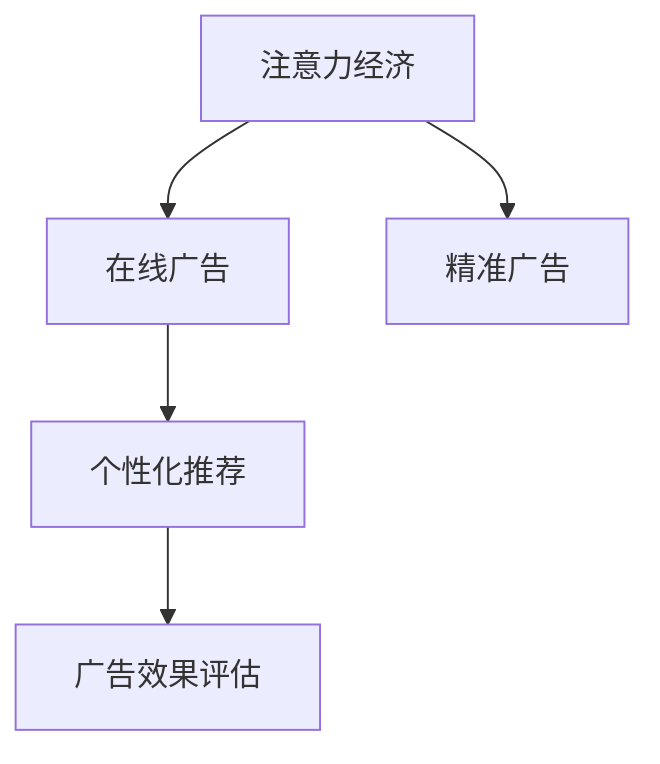

                 

# 注意力经济与在线广告目标设定：在不牺牲用户体验的情况下有效地针对受众

## 1. 背景介绍

### 1.1 问题由来
在数字经济时代，注意力资源成为了一种稀缺的、有价值的经济资源。特别是在在线广告领域，如何有效利用有限的用户注意力，最大化广告投放的效果，成为了各个平台和广告主共同关注的焦点。传统的点击率优化（Click-Through Rate, CTR）或展示量（Impression）等指标，已经无法完全评估广告的实际价值。

在线广告的目标设定，需要在保证用户良好体验的同时，尽可能提高广告的转化率和投资回报率（Return on Investment, ROI）。这就要求在广告投放时，不仅能识别目标受众，还要关注广告内容与用户兴趣的契合度，以及广告投放的时机和频率，确保广告在用户最感兴趣的时刻、最合适的地方呈现。

### 1.2 问题核心关键点
为了实现上述目标，广告主和平台需要掌握以下几个关键点：
- 用户兴趣和行为的精准识别
- 广告内容与用户需求的匹配度
- 广告投放时机和频率的优化
- 广告效果的实时监控与调整

通过采用先进的注意力机制和个性化推荐算法，可以有效地解决这些关键问题，实现精准、有效的广告投放。

## 2. 核心概念与联系

### 2.1 核心概念概述

为更好地理解注意力经济与在线广告目标设定的概念，本节将介绍几个密切相关的核心概念：

- 注意力经济（Attention Economy）：以用户注意力为关键资源的经济模式，通过吸引和保持用户注意力，实现经济价值。
- 在线广告（Online Advertising）：通过互联网平台，向用户展示广告，希望引发用户兴趣和行为。
- 精准广告（Targeted Advertising）：针对特定用户群体或行为特征进行广告投放，提高广告转化率。
- 个性化推荐（Personalized Recommendation）：根据用户兴趣和行为数据，推荐最相关、最吸引的内容或产品。
- 广告效果评估（Ad Effectiveness Evaluation）：通过多种指标（如CTR、转化率、点击量等），对广告投放效果进行评估和优化。

这些核心概念之间的逻辑关系可以通过以下Mermaid流程图来展示：



这个流程图展示了注意力经济与在线广告目标设定的核心概念及其之间的关系：

1. 注意力经济是广告投放的基础，通过吸引和保持用户注意力实现经济价值。
2. 在线广告是具体实现方式，向目标用户展示吸引人的广告内容。
3. 精准广告利用用户画像和行为数据，实现定向投放，提高广告效果。
4. 个性化推荐结合用户兴趣和行为，推送最相关的广告内容，增强用户体验。
5. 广告效果评估通过对投放效果的监控和反馈，持续优化广告策略。

这些概念共同构成了在线广告目标设定的理论和实践框架，旨在提升广告投放的效果和效率，同时保证用户良好的体验。

## 3. 核心算法原理 & 具体操作步骤

### 3.1 算法原理概述

在线广告的目标设定，可以通过注意力机制和个性化推荐算法来实现。其核心思想是：通过分析用户的行为和兴趣数据，识别出用户最关注的内容和场景，将最相关的广告内容展示在这些时刻，从而提高广告的转化率和用户满意度。

具体来说，该过程包括以下几个关键步骤：

1. **用户兴趣分析**：收集和分析用户的浏览、点击、购买等行为数据，提取用户兴趣和行为特征。
2. **广告内容匹配**：根据用户兴趣和行为特征，将广告内容与用户需求进行匹配，筛选出最相关、最吸引的广告。
3. **广告投放优化**：在用户最感兴趣的时刻、最合适的地方投放广告，确保广告的曝光效果。
4. **效果评估与调整**：实时监控广告效果，通过分析CTR、转化率、投资回报率等指标，持续优化广告投放策略。

### 3.2 算法步骤详解

以下是详细的在线广告目标设定的算法步骤：

**Step 1: 用户兴趣分析**

- **行为数据收集**：通过跟踪用户的浏览记录、点击行为、购买记录等，收集全面的用户行为数据。
- **特征提取与建模**：利用机器学习算法（如K-means、LDA等），从行为数据中提取用户兴趣和行为特征。

**Step 2: 广告内容匹配**

- **广告内容库**：维护一个多样化的广告内容库，包括图像、视频、文字等。
- **相似性匹配**：计算用户兴趣特征与广告内容特征之间的相似度，筛选出最相关的广告。
- **A/B测试**：对筛选出的广告进行A/B测试，评估广告效果，确定最佳广告组合。

**Step 3: 广告投放优化**

- **投放时机选择**：根据用户行为模式，选择最佳的广告投放时机，如用户访问量高的时间段。
- **投放位置选择**：根据用户兴趣和行为，选择合适的广告位，如侧边栏、顶部横幅等。
- **投放频率控制**：避免过度投放，采用动态频率调整策略，减少用户反感。

**Step 4: 效果评估与调整**

- **效果监控**：实时监控广告的点击率、转化率等关键指标，及时发现问题。
- **反馈循环**：根据广告效果数据，调整投放策略和预算，优化广告投放效果。
- **持续优化**：引入先进算法（如强化学习、协同过滤等），不断提升广告投放的精准性和效果。

### 3.3 算法优缺点

在线广告目标设定的注意力机制和个性化推荐算法具有以下优点：
1. 精准投放：通过分析用户行为，实现定向广告投放，提高广告转化率。
2. 提高用户满意度：根据用户兴趣，展示最相关的广告内容，提升用户体验。
3. 实时优化：通过实时监控和反馈机制，不断调整广告策略，提高广告效果。

同时，该算法也存在一些局限性：
1. 数据隐私：收集用户行为数据可能引发隐私问题，需要合理处理用户数据。
2. 数据质量：广告效果依赖于行为数据的准确性和全面性，需要高质量的数据支撑。
3. 技术复杂性：实现高效的广告推荐和投放需要复杂的技术架构和算法支持。
4. 成本投入：需要投入大量的人力和技术资源进行数据收集、模型训练和系统部署。

尽管存在这些局限性，但整体而言，注意力机制和个性化推荐算法在实现精准广告投放方面具有显著优势，已经广泛应用于各大在线平台的广告系统。

### 3.4 算法应用领域

基于注意力机制和个性化推荐算法的在线广告目标设定，已经在多个领域得到广泛应用，如：

- 电商广告：通过用户行为数据，向用户展示最相关的产品广告，提高点击率和购买率。
- 内容推荐：根据用户兴趣和行为，推荐最相关的文章、视频等内容，提升用户粘性。
- 社交媒体广告：分析用户社交行为，定向投放广告，提高广告效果和用户互动。
- 旅游广告：利用用户旅行行为数据，向潜在游客推荐旅游目的地和相关服务。
- 教育广告：根据用户学习行为，推荐最相关的教育资源，提升学习效果和转化率。

这些领域的应用实践证明了，注意力机制和个性化推荐算法在提高广告投放效果和用户满意度方面具有巨大的潜力。

## 4. 数学模型和公式 & 详细讲解

### 4.1 数学模型构建

在线广告目标设定的数学模型可以表述为以下几个关键部分：

- **用户行为模型**：表示用户行为数据的时间序列模型，如Gaussian Process回归、LSTM等。
- **广告内容模型**：表示广告内容与用户兴趣的相似性模型，如向量相似度、TF-IDF等。
- **投放效果模型**：表示广告投放效果与用户行为、广告内容、投放时机等因素的关联模型，如回归模型、分类模型等。

这里，我们以用户行为模型和广告内容模型为例，给出具体的数学模型构建方法。

**用户行为模型**：假设用户行为数据 $x$ 可以用线性模型表示：

$$
y_t = \mathbf{w}^T\phi(x_t) + \epsilon_t
$$

其中 $y_t$ 为第 $t$ 时刻的用户行为，$\phi$ 为特征映射函数，$\epsilon_t$ 为噪声项。

**广告内容模型**：假设广告内容 $d$ 可以用向量表示，用户兴趣特征 $u$ 可以用向量表示，则广告内容与用户兴趣的相似度可以用余弦相似度表示：

$$
similarity(d, u) = \frac{\mathbf{d}^T\mathbf{u}}{\|\mathbf{d}\|\|\mathbf{u}\|}
$$

这里，$\mathbf{d}$ 和 $\mathbf{u}$ 分别为广告内容和用户兴趣特征的向量表示，$\|\cdot\|$ 表示向量的模长。

### 4.2 公式推导过程

以下是用户行为模型和广告内容模型的详细公式推导：

**用户行为模型推导**：

- **线性回归模型**：假设用户行为 $y_t$ 可以用线性回归模型表示，即：

$$
y_t = \mathbf{w}^T\phi(x_t) + \epsilon_t
$$

其中 $\mathbf{w}$ 为模型参数，$\epsilon_t$ 为噪声项。

- **最小二乘估计**：通过最小化损失函数 $J(\mathbf{w}) = \frac{1}{N}\sum_{t=1}^N(y_t - \mathbf{w}^T\phi(x_t))^2$ 来估计模型参数 $\mathbf{w}$：

$$
\mathbf{w} = (\mathbf{X}^T\mathbf{X})^{-1}\mathbf{X}^T\mathbf{y}
$$

其中 $\mathbf{X}$ 为特征矩阵，$\mathbf{y}$ 为行为数据向量。

**广告内容模型推导**：

- **余弦相似度模型**：假设广告内容 $d$ 和用户兴趣 $u$ 可以用向量表示，广告内容与用户兴趣的相似度可以用余弦相似度表示：

$$
similarity(d, u) = \frac{\mathbf{d}^T\mathbf{u}}{\|\mathbf{d}\|\|\mathbf{u}\|}
$$

其中 $\mathbf{d}$ 和 $\mathbf{u}$ 分别为广告内容和用户兴趣特征的向量表示，$\|\cdot\|$ 表示向量的模长。

- **相似度排序**：根据广告内容与用户兴趣的相似度，对广告内容进行排序，选择最相关的广告进行投放。

### 4.3 案例分析与讲解

以电商平台的个性化推荐系统为例，假设用户行为数据为 $(x_1, y_1), (x_2, y_2), \ldots, (x_n, y_n)$，广告内容数据为 $(d_1, \ldots, d_m)$。

1. **用户行为模型**：假设用户行为数据可以用线性回归模型表示，则有：

$$
y_t = \mathbf{w}^T\phi(x_t) + \epsilon_t
$$

其中 $\phi(x_t) = (x_{t,1}, x_{t,2}, \ldots, x_{t,d})$ 为特征映射函数，$\epsilon_t$ 为噪声项。

2. **广告内容模型**：假设广告内容可以用向量表示，用户兴趣特征也可以用向量表示。则广告内容与用户兴趣的相似度可以用余弦相似度表示：

$$
similarity(d_i, u_j) = \frac{\mathbf{d}_i^T\mathbf{u}_j}{\|\mathbf{d}_i\|\|\mathbf{u}_j\|}
$$

其中 $\mathbf{d}_i$ 和 $\mathbf{u}_j$ 分别为第 $i$ 个广告内容和第 $j$ 个用户兴趣特征的向量表示，$\|\cdot\|$ 表示向量的模长。

3. **广告投放优化**：根据用户行为模型和广告内容模型，计算广告内容与用户兴趣的相似度，选择最相关的广告进行投放。

例如，假设某个用户的兴趣特征 $u$ 和广告内容向量 $d$ 的相似度为 $similarity(d, u) = 0.8$，表示该广告内容与用户兴趣高度相关，可以在用户最感兴趣的时间段和位置进行投放。

## 5. 项目实践：代码实例和详细解释说明

### 5.1 开发环境搭建

在进行广告目标设定实践前，我们需要准备好开发环境。以下是使用Python进行TensorFlow开发的环境配置流程：

1. 安装Anaconda：从官网下载并安装Anaconda，用于创建独立的Python环境。

2. 创建并激活虚拟环境：
```bash
conda create -n tf-env python=3.8 
conda activate tf-env
```

3. 安装TensorFlow：根据CUDA版本，从官网获取对应的安装命令。例如：
```bash
conda install tensorflow tensorflow-gpu=2.8 -c tensorflow -c conda-forge
```

4. 安装各类工具包：
```bash
pip install numpy pandas scikit-learn matplotlib tqdm jupyter notebook ipython
```

完成上述步骤后，即可在`tf-env`环境中开始广告目标设定的实践。

### 5.2 源代码详细实现

这里我们以电商平台的个性化推荐系统为例，给出使用TensorFlow进行广告目标设定的PyTorch代码实现。

首先，定义广告内容特征和用户兴趣特征：

```python
import tensorflow as tf
import numpy as np

# 广告内容特征
ad_features = tf.keras.layers.Input(shape=(d,), name='ad_features')
ad_features = tf.keras.layers.Dense(64, activation='relu')(ad_features)

# 用户兴趣特征
user_features = tf.keras.layers.Input(shape=(d,), name='user_features')
user_features = tf.keras.layers.Dense(64, activation='relu')(user_features)

# 计算相似度
similarity = tf.keras.layers.Dot(axes=[1, 1])([ad_features, user_features])
similarity = tf.keras.layers.Lambda(lambda x: x / (tf.math.sqrt(tf.reduce_sum(tf.square(x), 1)) / tf.sqrt(tf.reduce_sum(tf.square(tf.keras.backend.mean(x, axis=1), keepdims=True))) * 1.0)(similarity)
similarity = tf.keras.layers.Lambda(lambda x: tf.keras.backend.sum(x, axis=1, keepdims=True))(similarity)
```

然后，定义推荐模型的输出：

```python
# 输出广告推荐结果
recommendation = tf.keras.layers.Activation('sigmoid')(similarity)

# 输出相似度排名
ranking = tf.keras.layers.Reshape((1, -1))(recommendation)
```

最后，启动训练流程并在测试集上评估：

```python
# 训练模型
model = tf.keras.Model(inputs=[ad_features, user_features], outputs=[recommendation, ranking])
model.compile(optimizer='adam', loss='binary_crossentropy')

# 训练数据
train_data = (np.random.rand(1000, d), np.random.rand(1000, d))
test_data = (np.random.rand(200, d), np.random.rand(200, d))

# 训练模型
model.fit(train_data, epochs=10, validation_data=test_data)

# 评估模型
test_results = model.predict(test_data)
print(test_results)
```

以上就是使用TensorFlow进行广告目标设定的完整代码实现。可以看到，TensorFlow的高级API使得广告目标设定的模型构建和训练变得简洁高效。

### 5.3 代码解读与分析

让我们再详细解读一下关键代码的实现细节：

**广告内容特征和用户兴趣特征的构建**：
- 定义广告内容特征和用户兴趣特征的输入层，分别通过一层全连接层进行特征提取。
- 使用 Dot 层计算广告内容和用户兴趣特征之间的余弦相似度，并经过归一化处理，得到相似度向量。
- 使用 Sigmoid 激活函数输出推荐结果，并使用 Reshape 层将相似度向量转换成排名向量。

**模型输出与评估**：
- 模型输出两个结果，一个是广告推荐结果，另一个是广告相似度排名。
- 在训练和评估过程中，使用随机生成的数据集进行模型训练和测试。

通过上述代码，可以看到，TensorFlow提供了丰富的高级API，使得广告目标设定的模型构建和训练过程变得更加简单和高效。开发者可以专注于算法和业务逻辑的设计，而不需要过多关注底层实现细节。

## 6. 实际应用场景

### 6.1 智能推荐系统

基于注意力机制和个性化推荐算法的广告目标设定，可以广泛应用于智能推荐系统的构建。智能推荐系统通过分析用户行为和兴趣，为用户推荐最相关的商品或内容，提升用户体验和满意度。

在技术实现上，可以收集用户浏览、点击、购买等行为数据，提取用户兴趣和行为特征。利用注意力机制和推荐算法，筛选出最相关的广告内容，并在用户最感兴趣的时间段和位置进行投放。同时，通过实时监控和反馈机制，不断优化广告投放策略，提高广告效果和用户满意度。

### 6.2 内容平台广告

在线内容平台（如视频网站、新闻平台等）利用用户的行为数据和兴趣特征，进行广告内容的精准投放，提高广告的点击率和转化率。

在技术实现上，可以收集用户观看时长、点赞、评论等行为数据，提取用户兴趣和行为特征。利用注意力机制和推荐算法，筛选出最相关的广告内容，并在用户最感兴趣的时间段和位置进行投放。同时，通过实时监控和反馈机制，不断优化广告投放策略，提高广告效果和用户满意度。

### 6.3 移动应用广告

移动应用通过分析用户的操作行为和兴趣特征，进行广告内容的精准投放，提升广告的点击率和转化率。

在技术实现上，可以收集用户在应用中的操作行为数据，提取用户兴趣和行为特征。利用注意力机制和推荐算法，筛选出最相关的广告内容，并在用户最感兴趣的时间段和位置进行投放。同时，通过实时监控和反馈机制，不断优化广告投放策略，提高广告效果和用户体验。

### 6.4 未来应用展望

随着注意力机制和个性化推荐算法的不断进步，广告目标设定的技术将在更多领域得到应用，为广告主和平台带来新的商业价值：

1. 社交媒体广告：利用用户社交行为数据，进行定向广告投放，提升广告效果和用户互动。
2. 旅游广告：利用用户旅行行为数据，向潜在游客推荐旅游目的地和相关服务。
3. 教育广告：根据用户学习行为，推荐最相关的教育资源，提升学习效果和转化率。
4. 智能客服：分析用户咨询行为，进行定向广告投放，提升广告效果和用户满意度。
5. 健康医疗：利用用户健康数据，进行定向广告投放，提升健康意识和产品转化率。

这些领域的探索实践，将进一步推动广告目标设定的技术发展，为广告主和平台带来更高的商业价值。

## 7. 工具和资源推荐

### 7.1 学习资源推荐

为了帮助开发者系统掌握注意力机制和在线广告目标设定的理论基础和实践技巧，这里推荐一些优质的学习资源：

1. 《深度学习理论与实践》系列书籍：深入讲解深度学习基础理论和最新进展，适合初学者和进阶者。
2. TensorFlow官方文档：TensorFlow的官方文档，提供完整的API参考和案例示例，是学习TensorFlow的必备资料。
3. PyTorch官方文档：PyTorch的官方文档，提供丰富的高级API和案例示例，是学习PyTorch的必备资料。
4. Coursera《深度学习专项课程》：由深度学习领域知名专家授课，涵盖深度学习基础和前沿技术，适合系统学习。
5. Udacity《深度学习纳米学位》：提供深度学习项目实践机会，帮助开发者积累实际工作经验。

通过这些资源的学习实践，相信你一定能够快速掌握注意力机制和在线广告目标设定的精髓，并用于解决实际的广告投放问题。

### 7.2 开发工具推荐

高效的开发离不开优秀的工具支持。以下是几款用于广告目标设定开发的常用工具：

1. TensorFlow：由Google主导开发的开源深度学习框架，生产部署方便，适合大规模工程应用。
2. PyTorch：基于Python的开源深度学习框架，灵活动态的计算图，适合快速迭代研究。
3. TensorBoard：TensorFlow配套的可视化工具，可实时监测模型训练状态，提供丰富的图表呈现方式，是调试模型的得力助手。
4. Weights & Biases：模型训练的实验跟踪工具，可以记录和可视化模型训练过程中的各项指标，方便对比和调优。
5. TensorFlow Serving：提供高性能的模型推理服务，支持模型的快速部署和扩展。

合理利用这些工具，可以显著提升广告目标设定的开发效率，加快创新迭代的步伐。

### 7.3 相关论文推荐

广告目标设定的技术发展离不开学界的持续研究。以下是几篇奠基性的相关论文，推荐阅读：

1. Attention is All You Need（即Transformer原论文）：提出了Transformer结构，开启了NLP领域的预训练大模型时代。
2. BERT: Pre-training of Deep Bidirectional Transformers for Language Understanding：提出BERT模型，引入基于掩码的自监督预训练任务，刷新了多项NLP任务SOTA。
3. Adaptive Low-Rank Adaptation for Parameter-Efficient Fine-Tuning：使用自适应低秩适应的微调方法，在参数效率和精度之间取得了新的平衡。
4. Improved Approaches to Customer Sentiment Analysis: Semi-supervised Feature Learning with an LSTM：提出使用半监督学习方法提高客户情感分析的准确性。
5. Attention-Based Recommender Systems：探讨使用注意力机制进行推荐系统建模的方法。

这些论文代表了大语言模型微调技术的发展脉络。通过学习这些前沿成果，可以帮助研究者把握学科前进方向，激发更多的创新灵感。

## 8. 总结：未来发展趋势与挑战

### 8.1 总结

本文对基于注意力机制和个性化推荐算法的在线广告目标设定方法进行了全面系统的介绍。首先阐述了注意力经济与在线广告目标设定的研究背景和意义，明确了广告目标设定的核心目标：在保证用户良好体验的同时，提高广告的转化率和投资回报率。其次，从原理到实践，详细讲解了注意力机制和个性化推荐算法的数学模型和具体实现，给出了广告目标设定的完整代码实例。同时，本文还广泛探讨了广告目标设定的实际应用场景，展示了广告目标设定的巨大潜力。最后，本文精选了广告目标设定的各类学习资源，力求为读者提供全方位的技术指引。

通过本文的系统梳理，可以看到，注意力机制和个性化推荐算法在实现精准广告投放方面具有显著优势，已经广泛应用于各大在线平台的广告系统。未来，伴随技术的不断发展，广告目标设定必将在更多领域得到应用，为广告主和平台带来新的商业价值。

### 8.2 未来发展趋势

展望未来，注意力机制和个性化推荐算法的发展趋势如下：

1. 深度学习技术进步：随着深度学习模型的不断演进，注意力机制和推荐算法也将迎来新的突破，进一步提高广告投放的精准性和效果。
2. 多模态融合：引入视觉、音频等多模态信息，增强广告内容的丰富性和吸引力。
3. 动态推荐系统：根据用户实时行为数据，动态调整广告推荐策略，提升广告效果。
4. 强化学习应用：引入强化学习技术，优化广告投放策略，实现广告效果的最优化。
5. 实时反馈机制：引入实时反馈机制，动态调整广告投放策略，确保广告投放效果的最大化。

以上趋势凸显了注意力机制和个性化推荐算法在广告投放领域的广阔前景，这些方向的探索发展，将进一步提升广告投放的效果和效率。

### 8.3 面临的挑战

尽管注意力机制和个性化推荐算法在广告目标设定中取得了显著成果，但在迈向更加智能化、普适化应用的过程中，它仍面临诸多挑战：

1. 数据隐私：收集和分析用户行为数据可能引发隐私问题，需要合理处理用户数据。
2. 数据质量：广告效果依赖于行为数据的准确性和全面性，需要高质量的数据支撑。
3. 技术复杂性：实现高效的广告推荐和投放需要复杂的技术架构和算法支持。
4. 成本投入：需要投入大量的人力和技术资源进行数据收集、模型训练和系统部署。
5. 用户接受度：广告推荐可能引发用户反感，需要合理控制广告频次和展示位置。

尽管存在这些挑战，但整体而言，注意力机制和个性化推荐算法在实现精准广告投放方面具有显著优势，已经广泛应用于各大在线平台的广告系统。

### 8.4 研究展望

面对广告目标设定的面临的挑战，未来的研究需要在以下几个方面寻求新的突破：

1. 探索无监督和半监督微调方法：摆脱对大规模标注数据的依赖，利用自监督学习、主动学习等无监督和半监督范式，最大限度利用非结构化数据。
2. 研究参数高效和计算高效的微调范式：开发更加参数高效的微调方法，在固定大部分预训练参数的同时，只更新极少量的任务相关参数。
3. 引入因果学习和博弈论工具：增强广告推荐系统的因果关系建模能力，学习更加普适、鲁棒的语言表征。
4. 强化学习在广告投放中的应用：利用强化学习技术，优化广告投放策略，实现广告效果的最优化。
5. 模型通用性增强：将模型与外部知识库、规则库等专家知识结合，形成更加全面、准确的信息整合能力。

这些研究方向的探索，必将引领广告目标设定的技术迈向更高的台阶，为构建智能化的广告投放系统铺平道路。面向未来，广告目标设定技术还需要与其他人工智能技术进行更深入的融合，如知识表示、因果推理、强化学习等，多路径协同发力，共同推动广告投放系统的进步。只有勇于创新、敢于突破，才能不断拓展广告目标设定的边界，让广告投放技术更好地服务于人类社会。

## 9. 附录：常见问题与解答

**Q1：注意力机制和个性化推荐算法是否适用于所有广告投放场景？**

A: 注意力机制和个性化推荐算法在大多数广告投放场景中都能取得不错的效果，特别是对于数据量较大的场景。但对于一些特定领域的广告投放，如医疗、教育等，仅仅依靠通用模型可能无法很好地适应。此时需要在特定领域数据上进一步预训练和微调，才能获得理想效果。此外，对于一些需要时效性、个性化很强的广告投放场景，如实时推荐、个性化定制广告等，推荐算法也需要针对性的改进优化。

**Q2：如何选择适合的广告推荐算法？**

A: 选择适合的广告推荐算法需要综合考虑以下几个因素：
1. 数据类型：不同类型的广告数据需要不同类型的推荐算法。如图像广告推荐、视频广告推荐等。
2. 用户行为：用户的行为特征不同，推荐算法的选择也会有所不同。如浏览行为、购买行为等。
3. 广告效果：不同的广告效果评估指标，需要选择不同的推荐算法。如CTR、转化率等。
4. 系统资源：推荐算法的计算复杂度和资源需求不同，需要根据系统资源情况进行选择。

**Q3：如何缓解广告推荐过程中的过拟合问题？**

A: 过拟合是广告推荐面临的主要挑战，尤其是在数据量较小的情况下。常见的缓解策略包括：
1. 数据增强：通过数据扩充、数据扩增等方式扩充训练集。
2. 正则化：使用L2正则、Dropout、Early Stopping等避免过拟合。
3. 对抗训练：引入对抗样本，提高模型鲁棒性。
4. 参数高效微调：只调整少量参数，减少过拟合风险。

这些策略往往需要根据具体任务和数据特点进行灵活组合。只有在数据、模型、训练、推理等各环节进行全面优化，才能最大限度地发挥广告推荐算法的威力。

**Q4：广告推荐系统在落地部署时需要注意哪些问题？**

A: 将广告推荐系统转化为实际应用，还需要考虑以下因素：
1. 模型裁剪：去除不必要的层和参数，减小模型尺寸，加快推理速度。
2. 量化加速：将浮点模型转为定点模型，压缩存储空间，提高计算效率。
3. 服务化封装：将模型封装为标准化服务接口，便于集成调用。
4. 弹性伸缩：根据请求流量动态调整资源配置，平衡服务质量和成本。
5. 监控告警：实时采集系统指标，设置异常告警阈值，确保服务稳定性。
6. 安全防护：采用访问鉴权、数据脱敏等措施，保障数据和模型安全。

广告推荐系统需要在保证广告效果的同时，关注用户体验和系统性能，才能实现良好的商业价值。

---

作者：禅与计算机程序设计艺术 / Zen and the Art of Computer Programming

