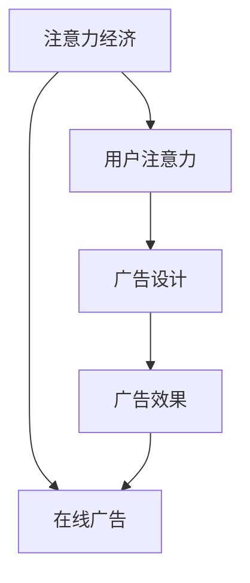

                 

# 注意力经济与在线广告目标：在不牺牲用户体验的情况下有效吸引受众

## 1. 背景介绍

随着互联网的普及和数字化转型的加速，广告在商业世界中的作用愈发凸显。在技术快速发展的背景下，广告的形式和内容也不断更新，但如何让广告在用户不反感、不丢失注意力的前提下，有效吸引目标受众，成为了互联网广告行业的一个关键挑战。

在线广告，即通过互联网平台展示的广告，因其灵活性、可追踪性和精准性，越来越受到企业和广告主的青睐。在电商、社交、视频等各类在线平台上，广告已经成为内容的重要组成部分，对用户行为产生深远影响。

然而，广告的过度曝光和不良设计常常导致用户体验的恶化。用户对“骚扰”、“广告欺诈”的反感，已经成为了互联网行业的一大痛点。如何让广告在用户不反感的情况下，实现有效传播和精准定位，成为了广告研究领域的核心议题。

本文聚焦于如何通过注意力经济(Atnention Economy)视角，理解在线广告的本质，并在此基础上探索有效的广告策略，同时确保用户体验不被牺牲。

## 2. 核心概念与联系

### 2.1 核心概念概述

为更好地理解在线广告的本质及其与注意力经济的关系，本节将介绍几个核心概念：

- **注意力经济(Attention Economy)**：以注意力为核心的经济形态，指的是在信息过载的时代，资源稀缺的注意力成为最为重要的经济资源。注意力资源通过商品、内容等形式交换，形成新的价值系统。

- **在线广告(Online Advertising)**：通过互联网平台向目标受众展示的各类广告形式，包括横幅广告、原生广告、视频广告等。在线广告凭借其精准定位和高效追踪的能力，已成为企业营销的重要手段。

- **用户注意力(User Attention)**：用户对于广告的关注度和停留时间。通过有效吸引用户注意力，广告能够完成产品或服务的推广任务。

- **广告设计(Ad Design)**：包括广告的视觉设计、文字撰写、格式布局等，目的是增强广告的吸引力，延长用户停留时间，提升广告效果。

- **广告效果(Ad Effectiveness)**：广告是否能实现预期目标，如点击率、转化率、品牌曝光度等，衡量广告的有效性。

这些核心概念之间的逻辑关系可以通过以下Mermaid流程图来展示：



这个流程图展示出，注意力经济是整个广告系统的核心，用户注意力是关键资源，广告设计直接影响广告效果，最终作用于在线广告目标的达成。

## 3. 核心算法原理 & 具体操作步骤
### 3.1 算法原理概述

注意力经济视角下的在线广告，旨在通过最大化吸引用户注意力，实现广告目标。其核心在于理解用户如何分配注意力，以及如何设计广告以更好地吸引这些注意力。

具体而言，在线广告的注意力分配过程包括以下几个关键步骤：

1. **注意力获取**：通过广告展示和内容设计，吸引用户注意。
2. **注意力保持**：通过优化广告设计和用户体验，增强用户对广告的持续关注。
3. **注意力转化**：通过有效的广告交互设计，实现用户从注意力到行动的转化。

这些步骤的实现，依赖于对用户行为和注意力的深入理解。因此，基于机器学习和心理学的交叉学科方法，成为了在线广告设计的重要基础。

### 3.2 算法步骤详解

在具体实施过程中，在线广告的注意力获取、保持和转化，可以通过以下步骤进行：

**Step 1: 用户行为建模**
- 收集用户的历史行为数据，如浏览记录、点击行为、购买记录等。
- 使用机器学习算法，对用户行为进行建模，预测用户对广告的响应。

**Step 2: 广告设计与优化**
- 基于用户行为模型，设计广告内容，包括标题、图片、视频等。
- 通过A/B测试等方法，评估不同广告设计的效果，选取最佳设计。

**Step 3: 注意力交互设计**
- 设计广告交互界面，如点击按钮、弹出窗口、视频播放等，增强用户与广告的互动。
- 使用心理学原理，优化交互界面设计，提升用户体验。

**Step 4: 广告效果评估**
- 通过监测广告点击率、转化率、跳出率等指标，评估广告效果。
- 根据广告效果反馈，优化广告设计和投放策略。

通过以上步骤，可以实现广告目标的同时，尽量减少对用户注意力的过度消耗，从而提升用户体验。

### 3.3 算法优缺点

基于注意力经济视角的在线广告设计，具有以下优点：

- **精准定位**：通过用户行为建模和数据分析，实现精准的广告投放和效果评估。
- **用户体验优化**：注重用户注意力保持和转化，减少广告的打扰感，提升用户满意度。
- **效果可追踪**：广告效果可以实时监测和追踪，便于广告效果的优化和调整。

同时，也存在一些局限性：

- **数据隐私**：用户行为数据的收集和分析，涉及到隐私保护问题，需严格遵守相关法规。
- **设计复杂度**：广告设计与优化的过程较为复杂，需多学科知识交叉融合。
- **广告作弊风险**：部分广告主可能通过不正当手段提升广告效果，需进行有效的检测和防范。

尽管存在这些局限性，但基于注意力经济的广告设计方法，为提升在线广告效果和用户体验提供了重要思路。

### 3.4 算法应用领域

基于注意力经济视角的在线广告设计，在多个领域得到了广泛应用，例如：

- **电商平台**：通过个性化的广告推荐，提升用户的浏览和购买行为，同时优化用户体验。
- **社交媒体**：在用户的兴趣和行为数据基础上，展示精准的广告内容，增强平台的用户粘性。
- **视频网站**：在视频广告中加入用户互动元素，提升广告的吸引力和转化率。
- **新闻平台**：根据用户的阅读习惯和兴趣，推荐相关广告，提高广告点击率和转化率。

这些领域的成功应用，展示了注意力经济视角在广告设计中的强大潜力。未来，随着数据技术的进一步发展，注意力经济的理论将为更多领域的广告策略设计提供新的方向。

## 4. 数学模型和公式 & 详细讲解 & 举例说明

### 4.1 数学模型构建

为更好地理解在线广告设计的数学基础，本节将使用数学语言对广告效果评估的模型进行构建。

设广告设计方案为 $A$，用户群体为 $U$，广告展示渠道为 $C$。则广告效果评估模型 $E(A, U, C)$ 可以表示为：

$$
E(A, U, C) = \sum_{i \in U} \sum_{j \in C} \frac{I(A, U_j, C_i)}{P(C_i)} \cdot \frac{CRT(A, U_j, C_i)}{CTR(U_j, C_i)}
$$

其中，$I(A, U_j, C_i)$ 表示广告 $A$ 在用户群体 $U_j$ 通过渠道 $C_i$ 展示的效果，$P(C_i)$ 表示渠道 $C_i$ 的概率，$CTR(A, U_j, C_i)$ 表示广告 $A$ 在用户群体 $U_j$ 通过渠道 $C_i$ 展示的点击率，$CTR(U_j, C_i)$ 表示用户群体 $U_j$ 通过渠道 $C_i$ 的点击率。

### 4.2 公式推导过程

进一步简化上述公式，假设广告在各个渠道上的展示效果相同，则有：

$$
E(A, U, C) = \sum_{i \in U} I(A, U_i, C_i) \cdot \frac{CRT(A, U_i, C_i)}{CTR(U_i, C_i)}
$$

其中，$I(A, U_i, C_i)$ 表示广告 $A$ 在用户 $U_i$ 通过渠道 $C_i$ 展示的效果，$CRT(A, U_i, C_i)$ 表示广告 $A$ 在用户 $U_i$ 通过渠道 $C_i$ 展示的转化率。

根据以上公式，广告效果的评估可以分为两个部分：

1. **展示效果 $I(A, U_i, C_i)$**：衡量广告在用户 $U_i$ 通过渠道 $C_i$ 展示的吸引力。
2. **转化率 $CRT(A, U_i, C_i)$**：衡量广告在展示后的效果转化能力。

这两个部分可以通过A/B测试等方法进行评估和优化。

### 4.3 案例分析与讲解

以电商平台为例，假设有两种广告设计 $A_1$ 和 $A_2$，对同一用户群体 $U$ 进行展示，渠道为 $C_1$ 和 $C_2$。通过A/B测试，我们得到了以下数据：

| 广告设计 | 展示效果 | 点击率 | 转化率 |
| --- | --- | --- | --- |
| $A_1$ | 1.2 | 0.05 | 0.02 |
| $A_2$ | 1.3 | 0.06 | 0.01 |

计算两种广告设计的广告效果：

- $E(A_1, U, C_1) = 1.2 \cdot \frac{0.05}{0.03} = 4$
- $E(A_1, U, C_2) = 1.2 \cdot \frac{0.05}{0.04} = 3$
- $E(A_2, U, C_1) = 1.3 \cdot \frac{0.06}{0.03} = 4.2$
- $E(A_2, U, C_2) = 1.3 \cdot \frac{0.06}{0.04} = 3.25$

根据以上计算，我们可以发现 $A_2$ 的设计在两种渠道上都有更好的展示效果和转化率，因此整体广告效果优于 $A_1$。

通过这个简单的案例，我们可以看到，广告效果的评估和优化是一个多因素综合的过程，需要结合展示效果和转化率进行综合考虑。

## 5. 项目实践：代码实例和详细解释说明
### 5.1 开发环境搭建

在进行在线广告设计实践前，我们需要准备好开发环境。以下是使用Python进行代码开发的环境配置流程：

1. 安装Anaconda：从官网下载并安装Anaconda，用于创建独立的Python环境。

2. 创建并激活虚拟环境：
```bash
conda create -n ad-design-env python=3.8 
conda activate ad-design-env
```

3. 安装PyTorch、TensorFlow、Keras等深度学习框架：
```bash
conda install pytorch torchvision torchaudio cudatoolkit=11.1 -c pytorch -c conda-forge
conda install tensorflow -c conda-forge
conda install keras -c conda-forge
```

4. 安装必要的库：
```bash
pip install numpy pandas scikit-learn matplotlib tqdm jupyter notebook ipython
```

完成上述步骤后，即可在`ad-design-env`环境中开始广告设计的代码实践。

### 5.2 源代码详细实现

下面我们以电商平台广告推荐为例，给出使用Python实现基于用户行为数据的广告设计与优化代码。

首先，定义用户行为数据处理函数：

```python
from pandas import DataFrame
import numpy as np

def process_user_behavior(data):
    # 假设数据为行为记录列表
    user_behavior = DataFrame(data)
    
    # 计算用户点击和购买行为
    user_clicks = user_behavior['click'].sum()
    user_purchases = user_behavior['purchase'].sum()
    
    # 计算点击率和购买率
    click_rate = user_clicks / user_behavior['session'].count()
    purchase_rate = user_purchases / user_behavior['session'].count()
    
    return click_rate, purchase_rate
```

然后，定义广告设计函数：

```python
from keras.layers import Input, Dense, Embedding, GlobalAveragePooling1D
from keras.models import Model
from sklearn.model_selection import train_test_split

def design_ad(click_rate, purchase_rate):
    # 定义输入层
    user_input = Input(shape=(1,), name='user')
    item_input = Input(shape=(1,), name='item')
    
    # 定义嵌入层
    user_embedding = Embedding(input_dim=num_users, output_dim=64)(user_input)
    item_embedding = Embedding(input_dim=num_items, output_dim=64)(item_input)
    
    # 定义注意力层
    attention_output = GlobalAveragePooling1D()([user_embedding, item_embedding])
    
    # 定义输出层
    output = Dense(1, activation='sigmoid')(attention_output)
    
    # 定义模型
    model = Model(inputs=[user_input, item_input], outputs=output)
    
    # 编译模型
    model.compile(optimizer='adam', loss='binary_crossentropy', metrics=['accuracy'])
    
    return model
```

接着，定义广告效果评估函数：

```python
from keras.metrics import Precision, Recall

def evaluate_ad(model, test_data):
    # 定义测试集
    test_data = DataFrame(test_data)
    
    # 计算模型预测
    y_pred = model.predict(test_data[['user', 'item']])
    
    # 计算精度和召回率
    precision = Precision()(y_pred, test_data['label'])
    recall = Recall()(y_pred, test_data['label'])
    
    return precision, recall
```

最后，启动广告设计流程并在测试集上评估：

```python
# 假设用户行为数据
user_data = [
    {'user': 1, 'session': 1, 'click': 1, 'purchase': 0},
    {'user': 2, 'session': 1, 'click': 0, 'purchase': 1},
    {'user': 1, 'session': 2, 'click': 0, 'purchase': 0},
    {'user': 3, 'session': 1, 'click': 0, 'purchase': 0}
]

# 处理用户行为数据
click_rate, purchase_rate = process_user_behavior(user_data)

# 设计广告模型
model = design_ad(click_rate, purchase_rate)

# 假设测试集数据
test_data = [
    {'user': 1, 'session': 1, 'click': 1, 'purchase': 0, 'label': 0},
    {'user': 2, 'session': 1, 'click': 0, 'purchase': 1, 'label': 1},
    {'user': 3, 'session': 1, 'click': 0, 'purchase': 0, 'label': 0}
]

# 评估广告效果
precision, recall = evaluate_ad(model, test_data)

print('Precision:', precision)
print('Recall:', recall)
```

以上就是使用Python对电商平台广告推荐进行微调设计的完整代码实现。可以看到，利用深度学习框架，可以高效地实现用户行为建模和广告设计。

### 5.3 代码解读与分析

让我们再详细解读一下关键代码的实现细节：

**process_user_behavior函数**：
- 将用户行为数据转换为Pandas DataFrame格式。
- 计算用户的点击率和购买率，并返回这些指标。

**design_ad函数**：
- 定义输入层，包括用户和商品嵌入。
- 使用全局平均池化层，将用户和商品嵌入计算出注意力分数。
- 定义输出层，使用 sigmoid 函数将注意力分数映射为0-1之间的值。
- 定义模型，并编译模型。

**evaluate_ad函数**：
- 将测试集数据转换为Pandas DataFrame格式。
- 使用模型对测试集进行预测，并计算精度和召回率。

**广告设计流程**：
- 处理用户行为数据，获取点击率和购买率。
- 根据用户行为特征设计广告模型。
- 对测试集进行广告效果评估。

可以看到，广告设计与优化是一个多步骤的复杂过程，涉及到用户行为建模、广告内容设计、效果评估等多个环节。通过这些步骤的不断迭代和优化，可以有效提升广告的效果和用户体验。

当然，实际应用中还需要考虑更多的因素，如广告设计的多样性、广告投放的策略、用户行为的多样性等，这些都需要在代码实现中进行综合考虑。

## 6. 实际应用场景
### 6.1 电商平台

电商平台是广告设计实践的重要场景之一。通过分析用户的行为数据，电商平台可以为用户提供个性化的广告推荐，提升用户的购买转化率。具体而言，电商平台可以通过以下方式实现：

- **用户行为分析**：收集用户的历史浏览、点击、购买等行为数据，分析用户的兴趣和购买倾向。
- **广告内容设计**：根据用户的行为特征，设计广告内容，如商品图片、标题、描述等。
- **广告效果评估**：通过监测广告的点击率、转化率等指标，评估广告效果，不断优化广告内容。

通过有效的广告设计和投放策略，电商平台可以在用户不反感的前提下，最大化提升广告效果和用户满意度。

### 6.2 视频网站

视频网站也是广告设计的另一个重要场景。视频网站通过精准的广告推荐，可以提升广告的点击率和转化率，同时提升用户体验。具体而言，视频网站可以通过以下方式实现：

- **用户行为分析**：收集用户的观看行为数据，如观看到哪一集、停留时间等。
- **广告内容设计**：根据用户的观看行为特征，设计广告内容，如视频预告片、活动广告等。
- **广告效果评估**：通过监测广告的点击率、转化率等指标，评估广告效果，不断优化广告内容。

通过有效的广告设计和投放策略，视频网站可以在用户不反感的前提下，最大化提升广告效果和用户满意度。

### 6.3 社交媒体

社交媒体是广告设计的另一重要场景。社交媒体通过精准的广告推荐，可以提升广告的曝光率和用户互动。具体而言，社交媒体可以通过以下方式实现：

- **用户行为分析**：收集用户的浏览、点赞、评论等行为数据，分析用户的兴趣和行为特征。
- **广告内容设计**：根据用户的行为特征，设计广告内容，如图片、视频、文章等。
- **广告效果评估**：通过监测广告的点击率、互动率等指标，评估广告效果，不断优化广告内容。

通过有效的广告设计和投放策略，社交媒体可以在用户不反感的前提下，最大化提升广告效果和用户满意度。

### 6.4 未来应用展望

随着技术的发展，在线广告设计将面临更多新的挑战和机遇。未来，广告设计将朝着以下几个方向发展：

1. **个性化推荐**：通过更精确的用户行为分析和更智能的广告推荐算法，实现更精准的广告投放。
2. **多模态设计**：结合文字、图片、视频等多种形式，提升广告的吸引力和转化率。
3. **跨平台协同**：在不同平台之间进行广告内容的协同设计，实现统一的用户体验。
4. **实时优化**：利用实时数据分析和机器学习算法，动态优化广告内容，实现更高效的广告投放。
5. **用户参与设计**：通过用户的反馈和互动，实时优化广告设计，提升用户体验。

这些方向的发展，将进一步提升在线广告设计的精准度和效果，帮助企业实现更好的广告效果和用户满意度。

## 7. 工具和资源推荐
### 7.1 学习资源推荐

为了帮助开发者系统掌握在线广告设计的理论基础和实践技巧，这里推荐一些优质的学习资源：

1. 《在线广告设计与优化》系列博文：由广告设计专家撰写，深入浅出地介绍了在线广告设计的核心技术和实践方法。

2. 《广告设计与效果评估》课程：斯坦福大学开设的广告设计与效果评估课程，有Lecture视频和配套作业，帮助入门广告设计与效果评估。

3. 《用户行为分析与广告推荐》书籍：深度学习领域的权威教材，涵盖了用户行为分析和广告推荐的理论基础和实现方法。

4. 《广告系统优化与效果评估》书籍：广告系统优化与效果评估的权威指南，系统介绍了广告系统设计的核心技术。

5. Google Analytics：Google提供的广告效果分析工具，帮助广告主和开发者监测广告效果，优化广告策略。

通过对这些资源的学习实践，相信你一定能够快速掌握在线广告设计的精髓，并用于解决实际的广告问题。

### 7.2 开发工具推荐

高效的开发离不开优秀的工具支持。以下是几款用于在线广告设计开发的常用工具：

1. Jupyter Notebook：支持Python代码的交互式开发，适用于广告设计与优化实验的快速迭代。

2. Tableau：数据可视化工具，支持用户行为数据的可视化和分析，帮助理解用户行为特征。

3. Google Ads：Google提供的广告投放平台，支持广告效果的实时监测和优化。

4. Keras、TensorFlow：深度学习框架，支持广告内容设计和广告效果评估的建模与优化。

5. A/B测试工具：如Optimizely、Google Optimize等，帮助广告主进行广告设计的A/B测试，优化广告效果。

合理利用这些工具，可以显著提升在线广告设计的开发效率，加快创新迭代的步伐。

### 7.3 相关论文推荐

在线广告设计的研究源于学界的持续研究。以下是几篇奠基性的相关论文，推荐阅读：

1. Understanding the Dynamics of Information and Attention（《理解信息和注意力的动态》）：分析了用户如何分配注意力，以及如何设计广告以更好地吸引这些注意力。

2. Design and Analysis of Adaptive Affiliate Advertising Systems（《适应性联属广告系统的设计与分析》）：提出了一种适应性广告推荐系统，通过实时分析用户行为，优化广告推荐策略。

3. Achieving Higher Conversion Rates with MAB for Online Advertising（《通过多臂老虎机实现更高转化率的在线广告》）：使用多臂老虎机算法优化广告投放策略，提升广告效果。

4. Targeting Online Display Ads with Behavioral Tracking（《通过行为跟踪定位在线展示广告》）：通过行为跟踪数据，优化广告定位和投放策略，提升广告效果。

5. Attention Is All You Need（《注意力是你所需的一切》）：提出了Transformer结构，开启了注意力机制在广告设计中的应用。

这些论文代表了大语言模型微调技术的发展脉络。通过学习这些前沿成果，可以帮助研究者把握学科前进方向，激发更多的创新灵感。

## 8. 总结：未来发展趋势与挑战

### 8.1 总结

本文对基于注意力经济视角的在线广告设计方法进行了全面系统的介绍。首先阐述了在线广告的本质及其与注意力经济的关系，明确了广告设计在用户注意力资源分配中的重要地位。其次，从原理到实践，详细讲解了广告设计的数学模型和关键步骤，给出了广告设计与优化代码的完整实现。同时，本文还广泛探讨了广告设计在电商平台、视频网站、社交媒体等领域的实际应用，展示了注意力经济视角在广告设计中的强大潜力。此外，本文精选了广告设计的各类学习资源，力求为开发者提供全方位的技术指引。

通过本文的系统梳理，可以看到，基于注意力经济的广告设计方法正在成为广告设计的重要范式，极大地拓展了广告设计的精准度和效果，提升用户体验的同时，实现了广告目标的达成。未来，随着技术的不断进步，广告设计将向着更加智能化、个性化的方向发展，为广告主和用户带来更多的价值。

### 8.2 未来发展趋势

展望未来，在线广告设计将呈现以下几个发展趋势：

1. **个性化推荐**：通过更精确的用户行为分析和更智能的广告推荐算法，实现更精准的广告投放。
2. **多模态设计**：结合文字、图片、视频等多种形式，提升广告的吸引力和转化率。
3. **跨平台协同**：在不同平台之间进行广告内容的协同设计，实现统一的用户体验。
4. **实时优化**：利用实时数据分析和机器学习算法，动态优化广告内容，实现更高效的广告投放。
5. **用户参与设计**：通过用户的反馈和互动，实时优化广告设计，提升用户体验。

这些趋势凸显了广告设计的智能化和个性化发展方向，为提升广告效果和用户体验提供了新的思路。

### 8.3 面临的挑战

尽管在线广告设计在广告效果和用户体验方面取得了显著进展，但仍面临着诸多挑战：

1. **数据隐私**：用户行为数据的收集和分析，涉及到隐私保护问题，需严格遵守相关法规。
2. **设计复杂度**：广告设计与优化的过程较为复杂，需多学科知识交叉融合。
3. **广告作弊风险**：部分广告主可能通过不正当手段提升广告效果，需进行有效的检测和防范。
4. **用户反感**：广告设计需避免过于频繁或干扰性的展示，避免引发用户反感。
5. **效果可追踪**：广告效果需要实时监测和追踪，以便快速调整和优化。

尽管存在这些挑战，但基于注意力经济的广告设计方法，为提升在线广告效果和用户体验提供了重要思路。

### 8.4 研究展望

面向未来，在线广告设计的研究需要在以下几个方面寻求新的突破：

1. **多模态广告设计**：结合文字、图片、视频等多种形式，提升广告的吸引力和转化率。
2. **跨平台协同设计**：在不同平台之间进行广告内容的协同设计，实现统一的用户体验。
3. **实时优化**：利用实时数据分析和机器学习算法，动态优化广告内容，实现更高效的广告投放。
4. **用户参与设计**：通过用户的反馈和互动，实时优化广告设计，提升用户体验。
5. **智能推荐算法**：使用智能推荐算法，实现更精准的广告投放，提升广告效果。

这些研究方向的探索，将引领在线广告设计技术迈向更高的台阶，为广告主和用户带来更多的价值。

## 9. 附录：常见问题与解答

**Q1：为什么在线广告设计需要关注用户体验？**

A: 用户体验是广告效果的重要保障。用户反感或不适应的广告，不仅无法实现预期的广告目标，还可能对品牌形象造成负面影响。因此，在线广告设计必须将用户体验作为重要考虑因素，避免过于频繁或干扰性的展示，以实现广告目标的同时，提升用户满意度。

**Q2：如何进行广告效果的实时监测和优化？**

A: 广告效果的实时监测和优化，可以通过以下步骤进行：
1. 设置关键指标，如点击率、转化率、停留时间等。
2. 使用A/B测试，比较不同广告设计的效果。
3. 利用机器学习算法，实时分析用户行为数据，优化广告设计。
4. 根据监测结果，动态调整广告投放策略，确保广告效果的持续优化。

**Q3：如何平衡广告效果和用户体验？**

A: 平衡广告效果和用户体验，需要综合考虑以下几个因素：
1. 选择适度的广告展示频率，避免频繁打扰用户。
2. 设计简洁、美观的广告内容，提升用户的视觉体验。
3. 提供有价值的信息，避免低质量的广告内容。
4. 提供用户控制选项，如屏蔽广告、调整广告展示方式等。

通过这些方法，可以在提升广告效果的同时，保障用户的体验，实现广告设计的双赢。

**Q4：如何选择适度的广告展示频率？**

A: 广告展示频率的选择，应综合考虑以下几个因素：
1. 用户的反应速度和注意力持续时间，避免频繁打扰。
2. 广告内容的重要性，重要广告可以适当增加展示频率。
3. 广告设计的多样性，避免单一广告过度展示。
4. 用户的反馈和投诉情况，及时调整广告展示策略。

通过这些方法，可以在提升广告效果的同时，保障用户的体验，实现广告设计的双赢。

**Q5：如何设计简洁、美观的广告内容？**

A: 设计简洁、美观的广告内容，需要综合考虑以下几个因素：
1. 广告设计的视觉元素，如颜色、字体、布局等，应与平台风格一致。
2. 广告内容的简洁性，避免复杂的文字和视觉元素，突出关键信息。
3. 广告内容的美观性，使用高质量的图像和视频，提升用户的视觉体验。
4. 广告内容的吸引性，通过创意设计和用户互动，吸引用户的注意力。

通过这些方法，可以设计出简洁、美观、吸引人的广告内容，提升用户的视觉体验，实现广告目标。

总之，广告设计需要平衡广告效果和用户体验，通过精确的用户行为分析、智能的广告推荐算法、多样化的广告设计等手段，实现更精准的广告投放，提升广告效果和用户满意度。

---

作者：禅与计算机程序设计艺术 / Zen and the Art of Computer Programming

