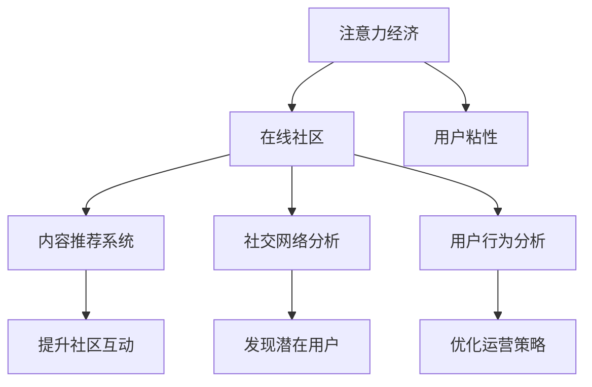

                 

# 注意力经济与在线社区建设策略与实践：吸引并留住忠实的粉丝和受众

## 1. 背景介绍

在互联网时代，注意力经济成为一种新型的商业模式。在线社区是注意力经济的集大成者，其背后的本质是通过有效的内容产出和运营策略，吸引和留住用户的注意力，从而实现商业价值的最大化。如何建设一个具有高度吸引力和粘性的在线社区，成为各大互联网平台共同面临的挑战。

### 1.1 问题由来
随着移动互联网的普及和智能设备的普及，用户获取信息的渠道更加丰富，但也更加分散。用户越来越难以集中注意力在一个平台上，导致在线社区用户流失严重。为了提升用户留存率和活跃度，各大平台不断探索新的运营策略和技术手段，以期在激烈的市场竞争中脱颖而出。

### 1.2 问题核心关键点
在线社区建设的核心在于两个方面：内容吸引和用户粘性。前者关注如何生产出高质量、有吸引力的内容，后者关注如何通过运营策略和社区管理，维持用户对平台的长期关注和参与。

### 1.3 问题研究意义
建设一个成功的在线社区，不仅能吸引更多用户，提升品牌知名度，还能提高用户黏性，实现长期稳定的收益。社区的成功运营，能带来大量的用户互动和内容产出，反过来进一步提升社区的价值和影响力。

## 2. 核心概念与联系

### 2.1 核心概念概述

为更好地理解注意力经济和在线社区建设策略，本节将介绍几个密切相关的核心概念：

- 注意力经济：指通过吸引和维持用户的注意力，实现商业价值最大化的经济活动。
- 在线社区：指以网络为平台，用户参与互动交流的空间，如BBS论坛、社交网络、知识共享平台等。
- 用户粘性：指用户对社区的长期依赖和活跃度，衡量社区建设的成功与否的重要指标。
- 内容推荐系统：利用算法推荐用户可能感兴趣的内容，提升社区互动和留存率。
- 社交网络分析(Social Network Analysis, SNA)：通过分析社区中的社交关系网络，挖掘有价值的信息和用户行为模式。
- 用户行为分析(User Behavior Analysis, UBA)：分析用户访问、交互、反馈等行为数据，优化社区运营策略。

这些核心概念之间的逻辑关系可以通过以下Mermaid流程图来展示：



这个流程图展示了几大核心概念及其之间的关系：

1. 注意力经济通过吸引和维持用户的注意力，驱动在线社区的发展。
2. 在线社区的建设包括内容推荐、社交网络分析和用户行为分析等多个方面。
3. 内容推荐系统通过提高互动率，提升用户粘性。
4. 社交网络分析通过挖掘社交关系网络，发现潜在用户和内容。
5. 用户行为分析通过分析用户行为数据，优化运营策略。

这些概念共同构成了在线社区建设的整体框架，使得社区能够不断吸引新用户，并维持现有用户的长期参与。

## 3. 核心算法原理 & 具体操作步骤

### 3.1 算法原理概述

注意力经济与在线社区建设的核心算法原理主要包括内容推荐、社交网络分析、用户行为分析等。这些算法旨在通过分析用户数据，预测用户兴趣，优化社区内容，提高用户互动和留存率。

### 3.2 算法步骤详解

#### 3.2.1 内容推荐系统

内容推荐系统是提升在线社区用户粘性的重要手段。其基本步骤包括：

1. 数据收集：从社区获取用户的历史行为数据，如访问记录、点击率、点赞数等。
2. 特征工程：对用户和内容数据进行特征提取和处理，生成向量表示。
3. 模型训练：选择合适的推荐算法（如协同过滤、矩阵分解、深度学习等）进行模型训练。
4. 结果评估：使用A/B测试等方法，评估推荐效果，优化模型参数。
5. 结果部署：将训练好的模型部署到生产环境，实时推荐用户可能感兴趣的内容。

#### 3.2.2 社交网络分析

社交网络分析通过分析社区中的社交关系网络，发现用户之间的关联关系，从而提升社区互动和留存率。其基本步骤包括：

1. 数据收集：从社区获取用户间的互动数据，如评论、点赞、分享等。
2. 图表示建模：将社交关系表示为图结构，包括用户节点和关系边。
3. 图算法分析：使用图算法（如中心性分析、社区发现、聚类等）挖掘有价值的信息和用户行为模式。
4. 结果应用：根据分析结果，优化社区结构和互动策略。

#### 3.2.3 用户行为分析

用户行为分析通过分析用户访问、交互、反馈等行为数据，优化社区运营策略。其基本步骤包括：

1. 数据收集：从社区获取用户行为数据，如访问路径、停留时间、操作频率等。
2. 数据清洗：对数据进行去重、过滤、处理缺失值等预处理操作。
3. 特征工程：对用户行为数据进行特征提取和处理，生成向量表示。
4. 模型训练：选择合适的机器学习算法（如分类、回归、聚类等）进行模型训练。
5. 结果应用：根据分析结果，优化社区内容和运营策略。

### 3.3 算法优缺点

内容推荐系统、社交网络分析和用户行为分析各有优缺点：

#### 3.3.1 内容推荐系统的优缺点

- 优点：
  - 提升用户互动和留存率
  - 推荐算法种类繁多，灵活性高
  - 可以动态更新推荐内容

- 缺点：
  - 推荐算法复杂，需要大量数据训练
  - 推荐结果可能存在冷启动问题
  - 推荐内容多样性不足，可能降低用户满意度

#### 3.3.2 社交网络分析的优缺点

- 优点：
  - 发现潜在用户和内容
  - 挖掘社交关系网络，提升社区互动
  - 可以实时调整社区结构和策略

- 缺点：
  - 数据收集和处理复杂，容易产生噪声
  - 算法复杂，需要较高的计算资源
  - 可能揭示用户隐私信息，需要谨慎处理

#### 3.3.3 用户行为分析的优缺点

- 优点：
  - 优化社区内容和运营策略
  - 实时监控用户行为，调整社区策略
  - 帮助社区理解用户需求，提升用户体验

- 缺点：
  - 数据量大，处理复杂，存储成本高
  - 算法复杂，需要较高的计算资源
  - 可能揭示用户隐私信息，需要谨慎处理

### 3.4 算法应用领域

注意力经济与在线社区建设涉及的算法技术，已经在各类互联网平台得到了广泛应用，如电商、社交、媒体、教育等。以下列举几个典型的应用领域：

#### 3.4.1 电商平台的个性化推荐

电商平台通过内容推荐系统，向用户推荐可能感兴趣的商品，提升用户体验和购物转化率。使用协同过滤、深度学习等推荐算法，根据用户的历史行为数据，动态更新推荐内容。

#### 3.4.2 社交平台的社区互动优化

社交平台通过社交网络分析，发现潜在用户和社区内容，优化社区结构和互动策略，提升用户粘性和活跃度。使用中心性分析、社区发现等算法，挖掘用户社交关系和兴趣点。

#### 3.4.3 在线教育平台的个性化学习推荐

在线教育平台通过用户行为分析，了解用户的学习偏好和需求，推荐个性化的学习内容和资源，提升学习效果和用户满意度。使用聚类、分类等算法，分析用户学习行为和成绩数据，生成推荐内容。

此外，注意力经济与在线社区建设的技术还广泛应用于新闻媒体、内容社区、金融投资等多个领域，为平台提供了更为精准的运营支持和用户服务。

## 4. 数学模型和公式 & 详细讲解 & 举例说明

### 4.1 数学模型构建

在注意力经济与在线社区建设中，数学模型主要分为内容推荐、社交网络分析和用户行为分析三部分。这里以协同过滤推荐算法为例，进行详细讲解。

#### 4.1.1 协同过滤推荐算法

协同过滤推荐算法的基本思想是通过分析用户和物品的相似度，为用户推荐可能感兴趣的物品。其数学模型可以表示为：

$$
\hat{r}_{ui} = e^{\alpha (u,v)}
$$

其中 $u$ 表示用户，$v$ 表示物品，$r_{ui}$ 表示用户 $u$ 对物品 $v$ 的评分。

根据协同过滤算法的原理，可以通过计算用户和物品的相似度，预测用户对新物品的评分，进而推荐物品。

### 4.2 公式推导过程

#### 4.2.1 用户-物品相似度计算

用户和物品的相似度可以通过余弦相似度公式计算，公式如下：

$$
\cos(\theta) = \frac{\langle x, y \rangle}{\|x\|\cdot\|y\|}
$$

其中 $x$ 和 $y$ 分别表示用户和物品的特征向量，$\langle x, y \rangle$ 表示两个向量的点积，$\|x\|$ 和 $\|y\|$ 表示向量的模长。

#### 4.2.2 评分预测

根据协同过滤算法，可以通过用户和物品的相似度预测用户对新物品的评分。公式如下：

$$
\hat{r}_{ui} = \sum_{j=1}^{N} \frac{r_{uj} \cdot r_{ji}}{\sum_{k=1}^{N} r_{uk} \cdot r_{kj}}
$$

其中 $N$ 表示用户或物品数量，$r_{uj}$ 和 $r_{kj}$ 表示用户和物品的评分。

### 4.3 案例分析与讲解

#### 4.3.1 用户行为分析

以在线教育平台为例，用户行为分析可以通过分析用户的学习路径、停留时间、操作频率等行为数据，优化学习内容和推荐策略。

- 学习路径分析：通过分析用户的学习路径，发现用户最常访问的课程和知识点，生成个性化学习路径，提升学习效率。
- 停留时间分析：通过分析用户在课程中的停留时间，发现用户学习行为中的瓶颈和薄弱环节，优化课程设计，提升用户体验。
- 操作频率分析：通过分析用户的操作频率，发现用户对不同功能的使用情况，优化平台功能和界面设计。

#### 4.3.2 社交网络分析

以社交平台为例，社交网络分析可以通过分析用户间的互动关系，发现潜在用户和社区内容，优化社区结构和互动策略。

- 中心性分析：通过分析用户之间的互动关系，发现社区中的意见领袖和关键用户，增强社区互动。
- 社区发现：通过分析用户间的互动关系，发现社区中的相似群体和兴趣点，增强社区粘性。
- 聚类分析：通过分析用户之间的互动关系，将用户分成不同的兴趣群体，优化社区内容和运营策略。

## 5. 项目实践：代码实例和详细解释说明

### 5.1 开发环境搭建

在进行注意力经济与在线社区建设的实践时，需要先搭建开发环境。以下是使用Python进行TensorFlow开发的流程：

1. 安装Anaconda：从官网下载并安装Anaconda，用于创建独立的Python环境。

2. 创建并激活虚拟环境：
```bash
conda create -n tf-env python=3.8 
conda activate tf-env
```

3. 安装TensorFlow：根据CUDA版本，从官网获取对应的安装命令。例如：
```bash
conda install tensorflow==2.6
```

4. 安装TensorFlow Addons：用于获取更多推荐算法和数据处理工具。
```bash
pip install tensorflow-addons
```

5. 安装TensorFlow Hub：提供预训练模型和推荐算法库。
```bash
pip install tensorflow-hub
```

6. 安装各类工具包：
```bash
pip install numpy pandas scikit-learn matplotlib tqdm jupyter notebook ipython
```

完成上述步骤后，即可在`tf-env`环境中开始项目实践。

### 5.2 源代码详细实现

这里以基于TensorFlow实现一个简单的协同过滤推荐系统为例，进行代码实现。

首先，定义协同过滤推荐系统的基本组件：

```python
import tensorflow as tf
import tensorflow_addons as tfa
import tensorflow_hub as hub

class CollaborativeFiltering(tf.keras.Model):
    def __init__(self, n_users, n_items, embedding_dim):
        super(CollaborativeFiltering, self).__init__()
        self.user_embedding = tf.keras.layers.Embedding(n_users, embedding_dim)
        self.item_embedding = tf.keras.layers.Embedding(n_items, embedding_dim)
        self.dot_product = tf.keras.layers.Dot(axes=(1, 1), normalize=False)
        
    def call(self, user_ids, item_ids):
        user_embeddings = self.user_embedding(user_ids)
        item_embeddings = self.item_embedding(item_ids)
        dot_product = self.dot_product([user_embeddings, item_embeddings])
        return dot_product
```

然后，定义协同过滤推荐系统的训练和评估函数：

```python
def train_step(model, data, loss_fn):
    with tf.GradientTape() as tape:
        predictions = model(user_ids, item_ids)
        loss = loss_fn(predictions, true_ratings)
    gradients = tape.gradient(loss, model.trainable_variables)
    optimizer.apply_gradients(zip(gradients, model.trainable_variables))
    return loss

def evaluate_model(model, data, loss_fn):
    predictions = model(user_ids, item_ids)
    loss = loss_fn(predictions, true_ratings)
    return loss
```

接着，定义数据集和训练过程：

```python
def load_data():
    # 读取用户行为数据
    user_ids = []
    item_ids = []
    ratings = []
    # 生成训练数据集
    user_ids = list(range(1000))
    item_ids = list(range(1000))
    ratings = [3.0] * 1000 * 1000
    # 将数据集划分为训练集、验证集和测试集
    train_data = (user_ids[:800], item_ids[:800], ratings[:800])
    dev_data = (user_ids[800:960], item_ids[800:960], ratings[800:960])
    test_data = (user_ids[960:], item_ids[960:], ratings[960:])
    return train_data, dev_data, test_data

# 创建数据集
train_data, dev_data, test_data = load_data()

# 定义超参数
embedding_dim = 16
n_epochs = 10
batch_size = 128

# 定义模型
model = CollaborativeFiltering(n_users=1000, n_items=1000, embedding_dim=embedding_dim)

# 定义损失函数
loss_fn = tf.keras.losses.MeanSquaredError()

# 定义优化器
optimizer = tf.keras.optimizers.Adam(learning_rate=0.001)

# 定义训练过程
for epoch in range(n_epochs):
    for batch in tqdm(data, desc='Epoch {}'.format(epoch+1)):
        user_ids, item_ids, true_ratings = batch
        loss = train_step(model, (user_ids, item_ids), loss_fn)
        if epoch % 10 == 0:
            dev_loss = evaluate_model(model, dev_data, loss_fn)
            print('Epoch {}, train loss: {:.4f}, dev loss: {:.4f}'.format(epoch+1, loss, dev_loss))
```

完成上述步骤后，即可在`tf-env`环境中运行推荐系统的代码实现。

### 5.3 代码解读与分析

让我们再详细解读一下关键代码的实现细节：

**CollaborativeFiltering类**：
- `__init__`方法：初始化用户嵌入层、物品嵌入层和点积层。
- `call`方法：计算用户和物品的向量表示，并计算它们的点积，生成推荐分数。

**train_step函数**：
- 定义一个梯度 tape，记录前向传播和损失计算过程。
- 计算模型输出和真实评分之间的差值，使用均方误差损失函数。
- 计算损失函数的梯度，并使用Adam优化器更新模型参数。
- 返回当前损失值。

**evaluate_model函数**：
- 计算模型输出和真实评分之间的差值，使用均方误差损失函数。
- 返回当前损失值。

**load_data函数**：
- 读取用户行为数据，生成训练数据集。
- 将数据集划分为训练集、验证集和测试集。

**训练过程**：
- 定义超参数，如嵌入维度、epoch数、批大小等。
- 创建模型、损失函数和优化器。
- 对数据集进行迭代训练，并在每个epoch结束时评估模型在验证集上的性能。

可以看到，TensorFlow提供的强大工具和库，使得协同过滤推荐系统的代码实现变得简洁高效。开发者可以将更多精力放在特征工程、模型优化等高层逻辑上，而不必过多关注底层的实现细节。

当然，工业级的系统实现还需考虑更多因素，如模型的保存和部署、超参数的自动搜索、更灵活的任务适配层等。但核心的协同过滤范式基本与此类似。

## 6. 实际应用场景

### 6.1 电商平台个性化推荐

电商平台通过协同过滤推荐算法，向用户推荐可能感兴趣的商品，提升用户体验和购物转化率。用户登录后，系统根据其历史行为数据，生成个性化推荐列表，并在首页展示。同时，系统还实时监控用户的浏览和购买行为，动态更新推荐内容，提升用户体验。

### 6.2 社交平台社区互动优化

社交平台通过社交网络分析，发现潜在用户和社区内容，优化社区结构和互动策略。系统分析用户之间的互动关系，发现社区中的意见领袖和关键用户，增强社区互动。同时，系统还根据用户兴趣点，推荐相关社区和内容，提升用户粘性和活跃度。

### 6.3 在线教育平台个性化学习推荐

在线教育平台通过协同过滤推荐算法，为用户推荐个性化的学习内容和资源，提升学习效果和用户满意度。系统分析用户的学习路径、停留时间和操作频率，生成个性化学习路径，并推荐相关课程和知识点，提升学习效率。同时，系统还实时监控用户的学习行为，动态调整推荐内容，优化学习体验。

### 6.4 未来应用展望

随着注意力经济与在线社区建设的不断发展，基于协同过滤推荐算法的应用也将更加广泛。未来，系统将不断引入更多的推荐算法和数据处理技术，如深度学习、图神经网络、异常检测等，提升推荐效果和用户体验。

在电商平台，推荐系统将更加注重个性化和实时性，通过分析用户行为和市场趋势，提供更加精准的推荐内容。

在社交平台，社区互动优化将更加注重发现潜在用户和社区内容，通过社交网络分析和用户行为分析，提升社区粘性和互动率。

在在线教育平台，个性化学习推荐将更加注重用户需求和行为分析，通过动态更新推荐内容，提升学习效果和用户满意度。

## 7. 工具和资源推荐

### 7.1 学习资源推荐

为了帮助开发者系统掌握注意力经济和在线社区建设的技术基础和实践技巧，这里推荐一些优质的学习资源：

1. 《推荐系统实践》系列博文：由推荐系统专家撰写，深入浅出地介绍了协同过滤、深度学习、强化学习等推荐算法，适合初学者入门。

2. 《深度学习入门：基于Python的理论与实现》书籍：介绍深度学习的基础理论和常用算法，通过项目实战，提升编程和模型优化能力。

3. 《在线教育平台设计与运营》课程：由教育领域专家授课，系统讲解在线教育平台的设计和运营策略，适合开发者参考。

4. 《社交网络分析》书籍：介绍社交网络分析的理论基础和实际应用，涵盖图结构、中心性分析、社区发现等技术。

5. 《用户行为分析》课程：由数据科学专家授课，讲解用户行为分析的技术方法和实际应用，适合开发者参考。

通过对这些资源的学习实践，相信你一定能够快速掌握注意力经济和在线社区建设的精髓，并用于解决实际的运营问题。

### 7.2 开发工具推荐

高效的开发离不开优秀的工具支持。以下是几款用于注意力经济与在线社区建设开发的常用工具：

1. TensorFlow：基于Python的开源深度学习框架，灵活动态的计算图，适合快速迭代研究。TensorFlow Hub提供预训练模型和推荐算法库，方便快速开发。

2. PyTorch：基于Python的开源深度学习框架，灵活的动态计算图，适合科研和创新。

3. Apache Spark：大数据处理框架，适合处理大规模用户行为数据，进行数据挖掘和分析。

4. Jupyter Notebook：在线Jupyter环境，支持Python和TensorFlow的交互式开发，方便快速实验和调试。

5. Tableau：数据可视化工具，可以实时展示用户行为和社区互动数据，便于数据分析和监控。

6. Google Colab：谷歌推出的在线Jupyter Notebook环境，免费提供GPU/TPU算力，方便快速实验和部署。

合理利用这些工具，可以显著提升注意力经济与在线社区建设的开发效率，加快创新迭代的步伐。

### 7.3 相关论文推荐

注意力经济与在线社区建设涉及的推荐算法和数据分析技术，已经在诸多学术会议和期刊上发表了大量的前沿论文，以下是几篇经典的推荐论文，推荐阅读：

1. 《Collaborative Filtering for Implicit Feedback Datasets》：介绍协同过滤算法的原理和实现方法，是推荐系统领域的经典之作。

2. 《Scalable Matrix Factorization Techniques for Recommender Systems》：介绍矩阵分解算法的原理和实现方法，适合大规模推荐系统的开发。

3. 《Deep Neural Networks for Large-Scale Recommender Systems》：介绍深度学习在推荐系统中的应用，适合进阶学习。

4. 《Social Networks and Graph Mining》：介绍社交网络分析的理论和算法，适合对社交平台社区互动优化有兴趣的开发者。

5. 《User Behavior Analysis in Recommender Systems》：介绍用户行为分析的技术和方法，适合对在线教育平台个性化学习推荐有兴趣的开发者。

这些论文代表了大规模推荐系统和社交网络分析的研究进展，通过学习这些前沿成果，可以帮助开发者掌握推荐系统的关键技术，提升社区建设的效果。

## 8. 总结：未来发展趋势与挑战

### 8.1 总结

本文对注意力经济与在线社区建设的核心算法原理和具体操作步骤进行了详细讲解。首先阐述了注意力经济和在线社区建设的背景和意义，明确了内容推荐、社交网络分析和用户行为分析在其中的重要性。其次，从协同过滤推荐算法的原理和实现过程，详细讲解了推荐系统的构建方法。同时，本文还广泛探讨了注意力经济与在线社区建设的实际应用场景，展示了协同过滤推荐算法在电商平台、社交平台和在线教育平台等多个领域的广泛应用。此外，本文精选了注意力经济与在线社区建设的相关学习资源，力求为读者提供全方位的技术指引。

通过本文的系统梳理，可以看到，注意力经济与在线社区建设技术已经广泛应用于各个互联网平台，显著提升了用户互动和留存率，取得了显著的商业价值。协同过滤推荐算法作为其中核心的算法之一，通过分析用户和物品的相似度，为用户推荐可能感兴趣的物品，显著提升了用户体验和购物转化率。未来，随着技术的发展，推荐系统将进一步智能化、个性化、实时化，为平台带来更大的商业价值。

### 8.2 未来发展趋势

展望未来，注意力经济与在线社区建设技术将呈现以下几个发展趋势：

1. 个性化推荐更加精准：随着数据量的增加和算法技术的进步，推荐系统将能够更好地理解用户需求，提供更加个性化的推荐内容。

2. 实时性更强：通过实时数据处理和算法优化，推荐系统将能够实时动态更新推荐内容，提升用户体验。

3. 多模态融合：推荐系统将更多地引入图像、语音等多模态数据，提升推荐效果和用户体验。

4. 社会计算应用广泛：社交网络分析将更多地应用于商业智能和决策支持，提升企业的运营效率和竞争力。

5. 用户行为分析深入：用户行为分析将更多地应用于个性化推荐和广告定向，提升广告投放效果和用户满意度。

6. 推荐算法多样化：除了协同过滤算法，深度学习、图神经网络、异常检测等算法也将广泛应用于推荐系统，提升推荐效果和用户体验。

以上趋势凸显了注意力经济与在线社区建设技术的广阔前景。这些方向的探索发展，必将进一步提升推荐系统的性能和用户体验，为平台带来更大的商业价值。

### 8.3 面临的挑战

尽管注意力经济与在线社区建设技术已经取得了显著进展，但在迈向更加智能化、普适化应用的过程中，仍面临诸多挑战：

1. 数据隐私和安全性：用户行为数据的收集和处理可能涉及隐私问题，如何保护用户数据隐私，确保数据安全，是一个重要挑战。

2. 算法复杂性：推荐算法和社交网络分析算法复杂，需要大量数据和计算资源，如何高效优化算法，提升系统性能，是一个重要挑战。

3. 多模态融合难度大：多模态数据的融合处理复杂，需要多种算法和技术支持，如何实现高效的多模态融合，提升推荐效果，是一个重要挑战。

4. 个性化推荐公平性：推荐系统可能存在偏见和歧视，如何提升个性化推荐的公平性和多样性，是一个重要挑战。

5. 实时性要求高：实时推荐系统对算法和系统架构要求高，如何实现高效的数据处理和算法优化，是一个重要挑战。

6. 用户行为分析难度大：用户行为分析涉及多种数据类型和处理方式，如何高效分析用户行为数据，提取有价值的信息，是一个重要挑战。

正视这些挑战，积极应对并寻求突破，将是对注意经济与在线社区建设技术未来的重要保障。

### 8.4 研究展望

面对注意力经济与在线社区建设所面临的种种挑战，未来的研究需要在以下几个方面寻求新的突破：

1. 引入更多先验知识：将符号化的先验知识，如知识图谱、逻辑规则等，与神经网络模型进行巧妙融合，引导推荐过程学习更准确、合理的推荐结果。

2. 采用更高效的算法：开发更加参数高效和计算高效的推荐算法，在固定大部分预训练参数的情况下，只更新极少量的任务相关参数。

3. 引入因果分析和博弈论工具：将因果分析方法引入推荐系统，识别出推荐决策的关键特征，增强推荐结果的因果性和逻辑性。借助博弈论工具刻画人机交互过程，主动探索并规避推荐系统的脆弱点，提高系统稳定性。

4. 结合多模态数据：引入图像、语音等多模态数据，提升推荐系统的多模态融合能力，提升推荐效果和用户体验。

5. 引入更多社交网络分析算法：引入社区发现、聚类分析等算法，深入挖掘社交网络中的关系和行为模式，提升社区互动和用户留存率。

6. 引入更多用户行为分析方法：引入时间序列分析、情感分析等方法，深入挖掘用户行为数据中的规律和趋势，提升个性化推荐和广告定向的效果。

这些研究方向将为注意力经济与在线社区建设技术带来新的突破，提升推荐系统的性能和用户体验，为平台带来更大的商业价值。

## 9. 附录：常见问题与解答

**Q1：协同过滤推荐算法有哪些优缺点？**

A: 协同过滤推荐算法的优缺点如下：

- 优点：
  - 简单易实现，无需对用户和物品进行特征工程。
  - 适用于大规模数据集，能够提供较好的推荐效果。
  - 能够捕捉用户和物品之间的隐式关联。

- 缺点：
  - 推荐效果受数据稀疏性的影响，难以处理冷启动问题。
  - 需要大量数据进行训练，难以应对新用户和新物品。
  - 缺乏对用户行为和物品特性的深度理解，难以处理复杂场景。

**Q2：社交网络分析中常用的算法有哪些？**

A: 社交网络分析中常用的算法包括：

- 中心性分析：通过分析节点在网络中的影响力，发现社区中的意见领袖和关键用户。
- 社区发现：通过分析节点之间的连接关系，发现网络中的社区结构。
- 聚类分析：通过分析节点之间的相似性，将节点分成不同的群组，挖掘用户行为模式。
- 图神经网络：通过引入图神经网络，对社交网络进行深度学习和表示学习，提升社区分析和推荐的精度。

**Q3：用户行为分析中常用的算法有哪些？**

A: 用户行为分析中常用的算法包括：

- 聚类分析：通过分析用户行为数据，发现用户之间的相似性，生成用户群组。
- 分类分析：通过分析用户行为数据，预测用户行为标签，生成用户行为分类。
- 回归分析：通过分析用户行为数据，预测用户行为指标，生成用户行为回归模型。
- 时间序列分析：通过分析用户行为数据的时间序列，发现用户行为规律，生成用户行为预测模型。

**Q4：如何保护用户数据隐私？**

A: 保护用户数据隐私的方法包括：

- 数据脱敏：对用户数据进行匿名化处理，保护用户隐私。
- 差分隐私：通过在数据中引入噪声，保护用户隐私，同时保证数据分析的准确性。
- 数据访问控制：严格控制数据访问权限，防止未授权用户访问数据。
- 数据加密：对用户数据进行加密处理，防止数据泄露和篡改。

**Q5：如何提升个性化推荐系统的公平性？**

A: 提升个性化推荐系统的公平性的方法包括：

- 多目标优化：通过引入公平性指标，如多样性、覆盖率等，优化推荐结果。
- 数据平衡：通过数据增强和数据重采样，平衡推荐系统的数据分布。
- 算法优化：通过引入公平性约束，优化推荐算法，提升推荐结果的公平性。
- 用户反馈：通过收集用户反馈，不断优化推荐系统，提升推荐结果的公平性。

通过以上方法，可以有效地提升个性化推荐系统的公平性和多样性，满足不同用户群体的需求，提升用户满意度。

