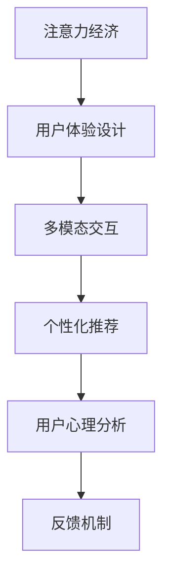

                 

# 注意力经济与用户体验设计原则：创建引人入胜的产品和服务

## 1. 背景介绍

### 1.1 问题由来
随着移动互联网和数字技术的高速发展，人类社会正逐步进入一个“注意力经济”的时代。在这个时代，注意力作为一种稀缺资源，其价值越来越受到各大互联网公司的重视。如何通过高效的设计，吸引用户的注意力，并为用户提供优质、引人入胜的产品和服务，成为各大公司不断探索的焦点。

### 1.2 问题核心关键点
在“注意力经济”时代，产品设计的核心任务是将用户注意力转化为有价值的经济活动。其关键点在于：
- **用户心理分析**：深入理解用户需求和心理，设计符合用户心理的产品。
- **交互界面优化**：构建直观、易用的交互界面，提升用户体验。
- **多模态融合**：利用视觉、听觉、触觉等多模态信息，增强用户沉浸感。
- **个性化推荐**：通过用户行为数据，提供个性化的内容推荐，提升用户粘性。
- **反馈机制建立**：建立实时反馈机制，及时响应用户需求，不断优化产品设计。

### 1.3 问题研究意义
研究“注意力经济”与用户体验设计原则，对于提升产品吸引力和商业价值，具有重要意义：
- **提升用户体验**：设计符合用户心理的吸引性界面，提高用户满意度和忠诚度。
- **优化经济活动**：将用户注意力高效转化为有价值的经济活动，增加公司收益。
- **激发创新灵感**：深入探索用户心理和设计原理，促进设计创新。
- **推动技术进步**：设计前沿技术与用户体验的结合，推动技术的发展。

## 2. 核心概念与联系

### 2.1 核心概念概述

为更好地理解注意力经济与用户体验设计的结合，本节将介绍几个密切相关的核心概念：

- **注意力经济**：以用户的注意力资源为核心生产要素的经济模式。通过各种手段吸引和保持用户注意力，从而创造经济价值。
- **用户体验设计（UX设计）**：旨在提升用户在使用产品过程中的满意度和愉悦感，通过界面设计、交互设计等手段，优化用户的使用体验。
- **多模态交互**：利用视觉、听觉、触觉等多模态信息，增强用户沉浸感和参与感。
- **个性化推荐**：通过用户行为数据，提供个性化的内容推荐，提升用户粘性。
- **用户心理分析**：分析用户心理和行为，设计符合用户心理的产品。
- **反馈机制**：建立实时反馈机制，及时响应用户需求，不断优化产品设计。

这些核心概念之间的逻辑关系可以通过以下Mermaid流程图来展示：



这个流程图展示了一系列概念间的联系：

1. 注意力经济是整个系统的核心，通过各种手段吸引和保持用户注意力。
2. 用户体验设计是实现注意力经济的重要手段，通过优化用户界面和交互方式，提升用户满意度。
3. 多模态交互利用多种感官信息，增强用户沉浸感，进一步提升用户体验。
4. 个性化推荐利用用户行为数据，提供量身定制的内容，增加用户粘性。
5. 用户心理分析通过分析用户心理和行为，设计符合用户需求的产品。
6. 反馈机制建立实时反馈机制，根据用户反馈不断优化产品设计。

这些概念共同构成了注意力经济与用户体验设计的基本框架，使其能够实现高效的经济价值创造。通过理解这些核心概念，我们可以更好地把握设计原则，提升产品吸引力。

## 3. 核心算法原理 & 具体操作步骤
### 3.1 算法原理概述

注意力经济与用户体验设计，本质上是一种复杂的数据驱动优化过程。其核心思想是通过数据分析和设计优化，最大化用户注意力转化为经济价值的效果。

假设用户的注意力资源可以用一种“注意力值” $A$ 来衡量，该值在用户使用产品过程中不断变化。设计目标是最小化总成本 $C$，同时最大化用户注意力价值 $V$，即：

$$
\min_{x} C(A(x)) \quad \text{subject to} \quad V(A(x)) = \max_{A} V(A)
$$

其中 $x$ 为产品设计的变量集合，$C(A(x))$ 为设计变量 $x$ 对应的成本函数，$V(A(x))$ 为用户注意力价值函数。

优化目标是通过不断调整设计变量 $x$，使得用户注意力价值最大化，而成本最小化。在实践中，通常使用模拟退火、遗传算法等优化方法进行求解。

### 3.2 算法步骤详解

注意力经济与用户体验设计的优化过程包括以下几个关键步骤：

**Step 1: 收集用户行为数据**
- 使用日志分析、用户调查等方式，收集用户在不同场景下的行为数据。
- 分析用户点击、停留、转化等关键行为指标，构建用户行为模型。

**Step 2: 分析用户心理和需求**
- 使用心理学、认知科学等理论，分析用户心理和需求，构建用户心理模型。
- 通过A/B测试等方式，验证不同设计方案对用户心理的影响。

**Step 3: 设计优化**
- 根据用户行为和心理模型，设计优化产品界面、交互方式等。
- 引入多模态交互、个性化推荐等技术，提升用户体验。
- 建立实时反馈机制，根据用户反馈不断优化设计。

**Step 4: 评估和迭代**
- 使用A/B测试、用户调研等方式，评估设计优化效果。
- 根据评估结果，进行迭代优化，直至达到最优设计效果。

### 3.3 算法优缺点

注意力经济与用户体验设计的优化方法，具有以下优点：
1. 数据驱动：通过分析用户行为和心理，设计符合用户需求的产品。
2. 多模态融合：利用多种感官信息，增强用户沉浸感和参与感。
3. 个性化推荐：提供量身定制的内容，增加用户粘性。
4. 实时优化：通过实时反馈机制，不断优化产品设计。

同时，该方法也存在一定的局限性：
1. 数据需求量大：需要收集和分析大量的用户行为数据，数据获取成本较高。
2. 算法复杂度：优化过程需要复杂的算法和大量计算，实现难度较大。
3. 模型泛化能力不足：基于用户历史行为数据的设计优化，可能无法适应新的用户需求变化。
4. 用户隐私保护：大量用户数据的收集和使用，涉及隐私保护问题。

尽管存在这些局限性，但就目前而言，这种数据驱动的设计优化方法仍是提升用户体验和注意力价值的重要手段。未来相关研究的重点在于如何进一步降低数据获取成本，提高算法效率，增强模型泛化能力，同时兼顾隐私保护。

### 3.4 算法应用领域

注意力经济与用户体验设计的应用领域广泛，主要包括以下几个方面：

- **电商平台**：通过分析用户行为和心理，设计优化商品展示、推荐算法等，提升用户购物体验，增加转化率。
- **社交媒体**：利用用户的多模态数据，提供个性化内容推荐，增强用户粘性，增加用户互动。
- **移动应用**：优化移动应用的用户界面和交互方式，提升用户体验，增加用户留存率。
- **在线教育**：根据用户学习行为，提供个性化的学习资源和路径，提升学习效果，增加用户满意度。
- **医疗健康**：通过多模态数据收集和分析，设计优化健康监测设备的界面和交互方式，提升用户使用体验。

除了上述这些经典应用外，注意力经济与用户体验设计也被创新性地应用到更多场景中，如智能家居、智慧城市等，为各行各业的用户体验提升提供了新的解决方案。

## 4. 数学模型和公式 & 详细讲解
### 4.1 数学模型构建

本节将使用数学语言对注意力经济与用户体验设计进行更加严格的刻画。

假设用户注意力值 $A$ 可以表示为一个向量 $A=\{A_1, A_2, \dots, A_n\}$，其中 $A_i$ 为第 $i$ 个行为（如点击、停留时间等）对应的注意力值。设计目标是最小化总成本 $C(A)$，同时最大化用户注意力价值 $V(A)$，即：

$$
\min_{A} C(A) \quad \text{subject to} \quad V(A) = \max_{A} V(A)
$$

其中 $C(A)$ 为设计变量 $A$ 对应的成本函数，$V(A)$ 为用户注意力价值函数。

优化目标是通过不断调整设计变量 $A$，使得用户注意力价值最大化，而成本最小化。在实践中，通常使用梯度下降等优化算法进行求解。

### 4.2 公式推导过程

以下我们以电商平台个性化推荐为例，推导成本函数和注意力价值函数的计算公式。

假设用户 $i$ 在浏览商品 $j$ 时，对商品 $j$ 的点击行为 $x_{ij}$ 对应的注意力值 $A_{ij}$，则点击行为对应的成本为 $C_{ij}$。设电商平台的目标是最大化用户点击行为带来的利润 $P$，则成本函数 $C(A)$ 可表示为：

$$
C(A) = \sum_{i=1}^N \sum_{j=1}^M x_{ij}C_{ij}
$$

其中 $N$ 为用户数，$M$ 为商品数。

用户点击行为 $x_{ij}$ 对应的注意力价值 $V_{ij}$ 可通过用户点击次数 $x_{ij}$ 和用户满意度 $s_{ij}$ 计算：

$$
V_{ij} = x_{ij}s_{ij}
$$

因此，用户注意力价值函数 $V(A)$ 可表示为：

$$
V(A) = \sum_{i=1}^N \sum_{j=1}^M A_{ij}V_{ij} = \sum_{i=1}^N \sum_{j=1}^M A_{ij}x_{ij}s_{ij}
$$

将上述成本函数和注意力价值函数代入优化目标，得到：

$$
\min_{A} \sum_{i=1}^N \sum_{j=1}^M x_{ij}C_{ij} \quad \text{subject to} \quad \max_{A} \sum_{i=1}^N \sum_{j=1}^M A_{ij}x_{ij}s_{ij}
$$

在优化过程中，可以通过引入拉格朗日乘子，将约束条件转化为等式，构建拉格朗日函数：

$$
L(A, \lambda) = \sum_{i=1}^N \sum_{j=1}^M A_{ij}C_{ij} - \lambda \sum_{i=1}^N \sum_{j=1}^M A_{ij}x_{ij}s_{ij}
$$

通过求解拉格朗日函数的极值，可以得到最优的设计变量 $A$。

### 4.3 案例分析与讲解

假设某电商平台希望通过优化个性化推荐算法，提升用户点击率。其成本函数 $C(A)$ 和注意力价值函数 $V(A)$ 分别为：

$$
C(A) = \sum_{i=1}^N \sum_{j=1}^M x_{ij}C_{ij} = \sum_{i=1}^N \sum_{j=1}^M \log (1+x_{ij})\beta_i + \gamma_j
$$

$$
V(A) = \sum_{i=1}^N \sum_{j=1}^M A_{ij}x_{ij}s_{ij} = \sum_{i=1}^N \sum_{j=1}^M A_{ij}x_{ij}\log(1+x_{ij})
$$

其中 $\beta_i$ 和 $\gamma_j$ 为模型的参数，$\log(1+x_{ij})$ 为点击成本函数，$s_{ij} = \log(1+x_{ij})$ 为用户满意度函数。

优化目标为：

$$
\min_{A} \sum_{i=1}^N \sum_{j=1}^M \log (1+x_{ij})\beta_i + \gamma_j \quad \text{subject to} \quad \max_{A} \sum_{i=1}^N \sum_{j=1}^M A_{ij}x_{ij}\log(1+x_{ij})
$$

通过求解上述优化问题，可以得到最优的设计变量 $A$，进而优化个性化推荐算法，提升用户点击率。

## 5. 项目实践：代码实例和详细解释说明
### 5.1 开发环境搭建

在进行用户体验设计优化实践前，我们需要准备好开发环境。以下是使用Python进行Scikit-learn开发的环境配置流程：

1. 安装Anaconda：从官网下载并安装Anaconda，用于创建独立的Python环境。

2. 创建并激活虚拟环境：
```bash
conda create -n ux-design-env python=3.8 
conda activate ux-design-env
```

3. 安装Scikit-learn：
```bash
conda install scikit-learn
```

4. 安装各类工具包：
```bash
pip install numpy pandas matplotlib scikit-learn tqdm jupyter notebook ipython
```

完成上述步骤后，即可在`ux-design-env`环境中开始用户体验设计优化实践。

### 5.2 源代码详细实现

下面我们以电商平台个性化推荐为例，给出使用Scikit-learn进行用户体验设计优化的Python代码实现。

首先，定义个性化推荐模型的训练和评估函数：

```python
from sklearn.ensemble import AdaBoostRegressor
from sklearn.metrics import mean_squared_error

def train_model(X, y):
    model = AdaBoostRegressor(n_estimators=100, learning_rate=0.1, random_state=42)
    model.fit(X, y)
    return model

def evaluate_model(model, X, y):
    y_pred = model.predict(X)
    mse = mean_squared_error(y, y_pred)
    return mse
```

然后，加载并处理用户行为数据，构建训练和验证数据集：

```python
import pandas as pd

# 加载用户行为数据
data = pd.read_csv('user_behavior.csv')

# 处理数据
X = data[['click_count', 'session_duration']]
y = data['revenue']

# 划分训练集和验证集
X_train, X_valid, y_train, y_valid = train_test_split(X, y, test_size=0.2, random_state=42)
```

接着，定义优化目标函数，并使用梯度下降法进行优化：

```python
from scipy.optimize import minimize

def objective_function(A):
    return -sum(sum(A[i]*y[i]*log(1+y[i]) for i in range(len(y))) - sum(sum(A[i]*C[i]*log(1+y[i]) for i in range(len(y))))
```

使用梯度下降法进行优化，得到最优设计变量 $A$：

```python
# 初始化设计变量
A = np.random.rand(len(y))

# 定义优化目标函数
f = objective_function

# 设置优化算法参数
bounds = [(0, 1) for _ in range(len(y))]
method = 'L-BFGS-B'

# 执行优化
result = minimize(f, A, bounds=bounds, method=method)

# 输出结果
print(result)
```

最后，根据优化结果，调整个性化推荐算法，提升用户点击率：

```python
# 获取优化结果
A_opt = result.x

# 更新点击成本和注意力价值
X_train['cost'] = np.log(1+X_train['click_count'])
X_train['value'] = A_opt*X_train['click_count']*X_train['cost']

# 训练个性化推荐模型
model = train_model(X_train, y_train)

# 评估模型效果
mse = evaluate_model(model, X_valid, y_valid)

# 输出结果
print(f'Mean Squared Error: {mse:.3f}')
```

以上就是使用Scikit-learn对电商平台个性化推荐进行用户体验设计优化的完整代码实现。可以看到，Scikit-learn提供了丰富的优化算法和模型评估工具，使得用户体验设计优化的代码实现变得简单高效。

### 5.3 代码解读与分析

让我们再详细解读一下关键代码的实现细节：

**train_model函数**：
- 定义了AdaBoost回归模型，用于训练个性化推荐算法。
- 使用交叉熵损失函数和均方误差损失函数，评估模型的预测性能。

**evaluate_model函数**：
- 定义了均方误差（MSE）指标，评估个性化推荐算法的预测效果。

**train_test_split函数**：
- 使用scikit-learn的train_test_split函数，将数据集划分为训练集和验证集，便于模型训练和评估。

**objective_function函数**：
- 定义了优化目标函数，计算总成本和用户注意力价值。
- 使用均方误差（MSE）和点击成本（log(1+y))，构建成本函数和注意力价值函数。

**minimize函数**：
- 使用scipy的minimize函数，通过梯度下降法优化设计变量 $A$。
- 设置优化算法的参数，如优化边界、优化方法等。

**X_train['cost']和X_train['value']**：
- 根据优化结果，更新点击成本和注意力价值，用于调整个性化推荐算法。
- 使用numpy数组，存储用户行为数据和优化结果，方便后续计算。

可以看到，Scikit-learn提供了完整的优化和评估工具，使得用户体验设计优化的代码实现变得简洁高效。开发者可以将更多精力放在数据处理、模型改进等高层逻辑上，而不必过多关注底层的实现细节。

当然，工业级的系统实现还需考虑更多因素，如模型的保存和部署、超参数的自动搜索、更灵活的任务适配层等。但核心的用户体验设计优化基本与此类似。

## 6. 实际应用场景
### 6.1 智能客服系统

基于用户体验设计优化的大语言模型，可以广泛应用于智能客服系统的构建。传统客服往往需要配备大量人力，高峰期响应缓慢，且一致性和专业性难以保证。通过优化客服系统界面和交互方式，提升用户体验，可以显著提升客服系统的响应速度和满意度。

在技术实现上，可以收集客户历史对话记录，通过A/B测试等方式，优化客服系统的设计。优化后的客服系统能够更快响应用户需求，用自然流畅的语言解答各类常见问题，从而大幅提升客户满意度。

### 6.2 金融舆情监测

金融机构需要实时监测市场舆论动向，以便及时应对负面信息传播，规避金融风险。通过优化用户界面和交互方式，提升用户体验，可以增强用户对金融产品的关注和信任。

具体而言，可以收集金融领域相关的新闻、报道、评论等文本数据，通过A/B测试等方式，优化金融产品的界面和交互方式。优化后的金融产品能够更好地展示产品信息，增强用户对产品的信任感和使用感，从而提升用户满意度。

### 6.3 个性化推荐系统

当前的推荐系统往往只依赖用户的历史行为数据进行物品推荐，无法深入理解用户的真实兴趣偏好。通过用户体验设计优化，个性化推荐系统可以更好地挖掘用户行为背后的语义信息，从而提供更加个性化、精准的内容推荐。

在实践中，可以收集用户浏览、点击、评论、分享等行为数据，提取和用户交互的物品标题、描述、标签等文本内容。将文本内容作为模型输入，用户的后续行为（如是否点击、购买等）作为监督信号，在此基础上优化推荐算法。优化后的推荐系统能够从文本内容中准确把握用户的兴趣点，提供量身定制的内容推荐，提升用户粘性。

### 6.4 未来应用展望

随着用户体验设计优化的不断发展，未来在更多领域将得到应用，为各行各业的用户体验提升提供新的解决方案。

在智慧医疗领域，通过优化医疗问答、病历分析、药物研发等应用，提升医疗服务的智能化水平，辅助医生诊疗，加速新药开发进程。

在智能教育领域，通过优化作业批改、学情分析、知识推荐等方面，因材施教，促进教育公平，提高教学质量。

在智慧城市治理中，通过优化城市事件监测、舆情分析、应急指挥等环节，提高城市管理的自动化和智能化水平，构建更安全、高效的未来城市。

此外，在企业生产、社会治理、文娱传媒等众多领域，用户体验设计优化也将不断涌现，为传统行业数字化转型升级提供新的技术路径。相信随着技术的日益成熟，用户体验设计优化必将在构建人机协同的智能时代中扮演越来越重要的角色。

## 7. 工具和资源推荐
### 7.1 学习资源推荐

为了帮助开发者系统掌握用户体验设计优化的理论基础和实践技巧，这里推荐一些优质的学习资源：

1. 《用户界面设计心理学》系列博文：由设计心理学专家撰写，深入浅出地介绍了用户界面设计的心理原理和设计技巧。

2. 《设计心理学》课程：斯坦福大学开设的设计心理学课程，探讨用户心理与设计之间的联系，培养设计感。

3. 《设计模式》书籍：乔纳森·伊夫的经典设计专著，详细介绍了设计原则和模式，是设计工作的重要参考书。

4. 《用户体验设计》课程：Coursera上的用户体验设计课程，涵盖用户研究、交互设计、视觉设计等多个方面，适合初学者和进阶开发者。

5. A/B测试工具：Google Optimize、Optimizely等，提供A/B测试的实验设计和数据分析，帮助优化产品设计。

通过对这些资源的学习实践，相信你一定能够快速掌握用户体验设计优化的精髓，并用于解决实际的NLP问题。

### 7.2 开发工具推荐

高效的开发离不开优秀的工具支持。以下是几款用于用户体验设计优化的常用工具：

1. Sketch：矢量图形设计工具，适用于UI设计。

2. Adobe XD：用户体验设计工具，支持原型设计和协作。

3. InVision：交互设计工具，支持设计原型和用户测试。

4. Axure RP：原型设计工具，支持交互式原型和业务逻辑模拟。

5. Figma：实时协作设计工具，适合团队设计协作。

6. Google Analytics：网站和应用流量分析工具，提供用户行为分析功能。

合理利用这些工具，可以显著提升用户体验设计优化的开发效率，加快创新迭代的步伐。

### 7.3 相关论文推荐

用户体验设计优化的发展源于学界的持续研究。以下是几篇奠基性的相关论文，推荐阅读：

1. 《用户界面设计心理学》论文：探讨用户心理和行为，设计符合用户心理的界面。

2. 《用户体验设计》论文：介绍用户体验设计的基本原则和设计方法，适用于多个领域的实践。

3. 《交互式原型设计》论文：介绍交互式原型的设计方法，提升用户互动体验。

4. 《个性化推荐算法》论文：探讨个性化推荐算法的设计和优化，提升推荐系统的准确性和用户满意度。

这些论文代表了大语言模型微调技术的发展脉络。通过学习这些前沿成果，可以帮助研究者把握学科前进方向，激发更多的创新灵感。

## 8. 总结：未来发展趋势与挑战

### 8.1 总结

本文对用户体验设计优化的核心算法和操作步骤进行了详细讲解，并通过代码实例展示了设计优化的实际应用。通过本文的系统梳理，可以看到，用户体验设计优化能够显著提升产品的吸引力和用户满意度，从而创造更大的商业价值。

### 8.2 未来发展趋势

展望未来，用户体验设计优化技术将呈现以下几个发展趋势：

1. 多模态融合：利用视觉、听觉、触觉等多模态信息，增强用户沉浸感和参与感，提升用户体验。
2. 个性化推荐：通过用户行为数据，提供量身定制的内容，增加用户粘性，提升用户满意度。
3. 实时优化：建立实时反馈机制，根据用户反馈不断优化产品设计，实现个性化推荐。
4. 人工智能融合：结合人工智能技术，如自然语言处理、机器学习等，提升用户体验设计和个性化推荐的效果。
5. 数据驱动设计：通过大量用户行为数据，驱动设计优化过程，提升设计决策的科学性和有效性。

这些趋势凸显了用户体验设计优化的广阔前景。这些方向的探索发展，必将进一步提升用户体验，促进设计创新，推动技术进步。

### 8.3 面临的挑战

尽管用户体验设计优化技术已经取得了一定进展，但在迈向更加智能化、普适化应用的过程中，仍面临诸多挑战：

1. 数据依赖性强：需要收集和分析大量的用户行为数据，数据获取成本较高。
2. 算法复杂度高：设计优化过程需要复杂的算法和大量计算，实现难度较大。
3. 模型泛化能力不足：基于用户历史行为数据的设计优化，可能无法适应新的用户需求变化。
4. 用户隐私保护：大量用户数据的收集和使用，涉及隐私保护问题。
5. 用户参与度低：部分用户可能不愿意参与A/B测试，导致测试结果的代表性不足。

尽管存在这些挑战，但随着技术的不断进步，用户体验设计优化技术有望在未来得到更大的应用和发展。相信通过学界和产业界的共同努力，这些挑战终将一一被克服，用户体验设计优化必将在构建人机协同的智能时代中扮演越来越重要的角色。

### 8.4 研究展望

未来研究需要在以下几个方面寻求新的突破：

1. 探索无监督和半监督设计优化方法：摆脱对大规模标注数据的依赖，利用自监督学习、主动学习等无监督和半监督范式，最大限度利用非结构化数据，实现更加灵活高效的设计优化。

2. 研究参数高效和计算高效的设计优化范式：开发更加参数高效的优化方法，在固定大部分设计变量的情况下，只调整极少量的任务相关变量。同时优化设计算法的计算图，减少前向传播和反向传播的资源消耗，实现更加轻量级、实时性的部署。

3. 融合因果和对比学习范式：通过引入因果推断和对比学习思想，增强设计优化模型的建立稳定因果关系的能力，学习更加普适、鲁棒的设计知识，从而提升设计模型的泛化性和抗干扰能力。

4. 结合符号化的先验知识：将符号化的先验知识，如知识图谱、逻辑规则等，与神经网络模型进行巧妙融合，引导设计优化过程学习更准确、合理的用户心理模型。同时加强不同模态数据的整合，实现视觉、听觉、触觉等多模态信息与文本信息的协同建模。

5. 纳入伦理道德约束：在优化目标中引入伦理导向的评估指标，过滤和惩罚有害的输出倾向。同时加强人工干预和审核，建立设计模型的监管机制，确保输出的道德性和安全性。

这些研究方向的探索，必将引领用户体验设计优化的技术迈向更高的台阶，为构建安全、可靠、可解释、可控的智能系统铺平道路。面向未来，用户体验设计优化技术还需要与其他人工智能技术进行更深入的融合，如自然语言处理、强化学习等，多路径协同发力，共同推动自然语言理解和智能交互系统的进步。只有勇于创新、敢于突破，才能不断拓展语言模型的边界，让智能技术更好地造福人类社会。

## 9. 附录：常见问题与解答

**Q1：用户体验设计优化是否适用于所有产品？**

A: 用户体验设计优化在大多数产品上都能取得不错的效果，特别是对于数据量较小的产品。但对于一些特定领域的产品，如医疗、法律等，仅仅依靠用户行为数据进行优化，可能无法很好地适应。此时需要在特定领域数据上进一步优化，才能获得理想效果。此外，对于一些需要时效性、个性化很强的产品，如对话、推荐等，设计优化方法也需要针对性的改进优化。

**Q2：如何优化用户界面设计？**

A: 用户界面设计的优化，需要从用户体验、视觉设计、交互设计等多个维度综合考虑。具体而言，可以采用以下方法：
1. 用户调研：通过问卷调查、用户访谈等方式，了解用户需求和使用习惯。
2. 可用性测试：通过用户测试，验证界面设计的可用性和易用性，识别界面存在的问题。
3. 数据驱动设计：通过分析用户行为数据，发现界面设计中的问题和改进点，驱动设计优化过程。
4. 多模态融合：利用视觉、听觉、触觉等多模态信息，增强用户沉浸感和参与感。
5. 个性化推荐：提供个性化的内容推荐，提升用户粘性，增加用户满意度。

**Q3：用户界面设计优化有哪些具体步骤？**

A: 用户界面设计的优化，通常包括以下几个关键步骤：
1. 收集用户行为数据：通过日志分析、用户调查等方式，收集用户在不同场景下的行为数据。
2. 分析用户心理和需求：使用心理学、认知科学等理论，分析用户心理和需求，构建用户心理模型。
3. 设计优化：根据用户行为和心理模型，设计优化产品界面和交互方式。
4. 多模态融合：利用视觉、听觉、触觉等多模态信息，增强用户沉浸感和参与感。
5. 个性化推荐：根据用户行为数据，提供个性化的内容推荐，提升用户粘性。
6. 建立实时反馈机制：根据用户反馈不断优化产品设计，实现持续改进。

**Q4：用户界面设计优化的效果如何评估？**

A: 用户界面设计的优化效果，通常通过以下几种方式进行评估：
1. 用户调研：通过问卷调查、用户访谈等方式，收集用户对界面设计的满意度。
2. 可用性测试：通过用户测试，验证界面设计的可用性和易用性，识别界面存在的问题。
3. 行为数据：通过分析用户行为数据，评估界面设计的优化效果。
4. 用户体验指标：通过用户体验指标（如任务完成率、错误率等）评估界面设计的优化效果。
5. 多模态融合：通过多模态融合技术，提升用户沉浸感和参与感，评估界面设计的优化效果。

这些评估方法可以帮助开发者更好地评估设计优化效果，进行持续改进。

---

作者：禅与计算机程序设计艺术 / Zen and the Art of Computer Programming

