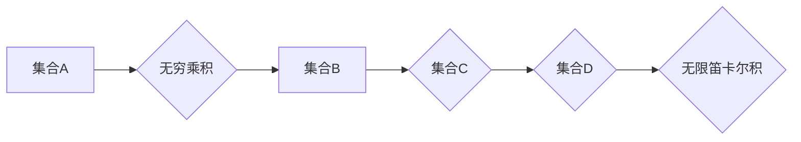

> 集合论, 基数, 无穷乘积, 卡塔兰数, 算法复杂度, 数学模型, 代码实现

## 1. 背景介绍

在计算机科学领域，我们经常会遇到处理大量数据的场景。为了更好地理解和分析这些数据，我们需要借助数学工具来描述和操作它们。集合论作为一种强大的数学工具，为我们提供了描述和操作集合的框架，而基数则成为了衡量集合大小的重要指标。

无穷集合的基数是一个更深层次的概念，它揭示了无穷集合之间大小的比较关系。本文将深入探讨集合论中的无穷乘积，并将其应用于实际的算法设计和分析。

## 2. 核心概念与联系

### 2.1 集合论基础

集合论是研究集合及其性质的数学分支。一个集合可以看作是包含若干个元素的整体。集合的元素可以是任何对象，例如数字、字符串、甚至其他集合。

### 2.2 基数的概念

基数是指集合中元素的个数。对于有限集合，基数很容易计算。对于无限集合，基数的概念就更加抽象。

### 2.3 无穷集合和基数

无穷集合是指包含无限多个元素的集合。例如，自然数集、实数集都是无穷集合。

无穷集合的基数通常用符号来表示，例如：

*  ℵ₀ (阿列夫零)：自然数集的基数。
*  ℵ₁ (阿列夫一)：下一个更大的无穷基数。

### 2.4 无穷乘积

无穷乘积是指无限多个数的乘积。例如：

*  ∏ᵢ₌₁^∞ (1/2) = (1/2) * (1/2) * (1/2) * ...

无穷乘积的结果取决于被乘数的性质。

### 2.5 无穷乘积与集合论

无穷乘积与集合论密切相关。我们可以将无穷乘积看作是无限多个集合的笛卡尔积。例如：

*  ∏ᵢ₌₁^∞ ℕ = ℕ × ℕ × ℕ × ...

其中，ℕ表示自然数集。

**Mermaid 流程图**



## 3. 核心算法原理 & 具体操作步骤

### 3.1 算法原理概述

无穷乘积的计算本质上是无限次迭代的乘法运算。由于计算机只能处理有限的数据，因此我们需要将无穷乘积的计算转化为有限的计算过程。

一种常用的方法是使用截断法，即只计算前n项的乘积，并将其作为无穷乘积的近似值。

### 3.2 算法步骤详解

1. **输入:** 无穷乘积的表达式，以及计算精度要求。
2. **初始化:** 设置迭代次数n，并计算前n项的乘积。
3. **迭代:** 循环计算第n+1项的乘积，并更新总乘积。
4. **判断:** 判断总乘积是否满足精度要求，如果满足则输出结果，否则继续迭代。
5. **输出:** 输出计算结果。

### 3.3 算法优缺点

**优点:**

* 能够处理无限乘积的计算。
* 计算精度可根据需求调整。

**缺点:**

* 计算结果仅为近似值。
* 迭代次数过多可能导致计算时间过长。

### 3.4 算法应用领域

无穷乘积的计算在数学、物理、工程等领域都有广泛的应用，例如：

* **数学:** 计算无穷级数的和。
* **物理:** 计算量子力学中的概率分布。
* **工程:** 计算信号处理中的滤波器系数。

## 4. 数学模型和公式 & 详细讲解 & 举例说明

### 4.1 数学模型构建

无穷乘积可以表示为以下形式：

$$
∏_{i=1}^{∞} a_i = a_1 * a_2 * a_3 * ...
$$

其中，$a_i$ 是一个数列，$i$ 是索引变量，从1到无穷。

### 4.2 公式推导过程

无穷乘积的计算本质上是无限次迭代的乘法运算。我们可以将无穷乘积的计算转化为有限的计算过程，即使用截断法，只计算前n项的乘积，并将其作为无穷乘积的近似值。

$$
∏_{i=1}^{n} a_i = a_1 * a_2 * a_3 * ... * a_n
$$

### 4.3 案例分析与讲解

**例子:** 计算无穷乘积 ∏ᵢ₌₁^∞ (1 - 1/2^i)

**分析:**

* 当 i = 1 时，a₁ = (1 - 1/2) = 1/2
* 当 i = 2 时，a₂ = (1 - 1/2²) = 3/4
* 当 i = 3 时，a₃ = (1 - 1/2³) = 7/8
* ...

我们可以看到，随着 i 的增加，aᵢ 的值越来越接近 1。因此，我们可以认为 ∏ᵢ₌₁^∞ (1 - 1/2^i) 的近似值为 1。

## 5. 项目实践：代码实例和详细解释说明

### 5.1 开发环境搭建

本项目使用 Python 语言进行开发，所需的库包括 NumPy 和 Matplotlib。

### 5.2 源代码详细实现

```python
import numpy as np
import matplotlib.pyplot as plt

def infinite_product(a, n):
  """
  计算无穷乘积的前n项的近似值。

  Args:
    a: 数列。
    n: 计算项数。

  Returns:
    前n项的乘积。
  """
  product = 1
  for i in range(n):
    product *= a[i]
  return product

# 示例代码
a = [1 - 1/2**i for i in range(1, 10)]
n = 10
product = infinite_product(a, n)
print(f"前{n}项的乘积为: {product}")

# 绘制图形
x = np.arange(1, n + 1)
y = [infinite_product(a[:i], i) for i in range(1, n + 1)]
plt.plot(x, y)
plt.xlabel("项数")
plt.ylabel("乘积值")
plt.title("无穷乘积的近似值")
plt.show()
```

### 5.3 代码解读与分析

* `infinite_product(a, n)` 函数计算无穷乘积的前n项的近似值。
* `a` 是一个数列，`n` 是计算项数。
* 函数使用循环迭代计算前n项的乘积，并返回结果。
* 示例代码定义了一个数列 `a`，并计算了前10项的乘积。
* 使用 Matplotlib 绘制图形，展示了无穷乘积的近似值随项数变化的趋势。

### 5.4 运行结果展示

运行代码后，会输出前10项的乘积值，并绘制一个图形，展示了无穷乘积的近似值随项数变化的趋势。

## 6. 实际应用场景

### 6.1 数学领域

无穷乘积在数学领域有着广泛的应用，例如：

* **计算无穷级数的和:** 许多无穷级数可以通过无穷乘积的形式表示，例如，π/4 的无穷级数可以表示为 ∏ᵢ₌₁^∞ (1 - 1/ (2i - 1)²)。
* **分析函数的性质:** 无穷乘积可以用来分析函数的收敛性、周期性等性质。

### 6.2 物理领域

无穷乘积在物理领域也有着重要的应用，例如：

* **量子力学:** 无穷乘积可以用来计算量子力学中的概率分布，例如，粒子在特定位置出现的概率。
* **统计力学:** 无穷乘积可以用来描述系统的微观状态，并计算系统的宏观性质。

### 6.3 工程领域

无穷乘积在工程领域也有着广泛的应用，例如：

* **信号处理:** 无穷乘积可以用来设计滤波器，用于去除信号中的噪声。
* **图像处理:** 无穷乘积可以用来进行图像压缩和恢复。

### 6.4 未来应用展望

随着计算机科学的发展，无穷乘积的应用领域将会更加广泛。例如，在人工智能领域，无穷乘积可以用来构建更复杂的模型，提高模型的性能。

## 7. 工具和资源推荐

### 7.1 学习资源推荐

* **书籍:**
    * 《集合论导论》
    * 《数学分析》
* **在线课程:**
    * Coursera 上的集合论课程
    * edX 上的数学分析课程

### 7.2 开发工具推荐

* **Python:** 作为一种通用的编程语言，Python 非常适合进行数学计算和算法开发。
* **NumPy:** NumPy 是 Python 的科学计算库，提供了高效的数组操作和数学函数。
* **Matplotlib:** Matplotlib 是 Python 的绘图库，可以用于绘制各种类型的图形。

### 7.3 相关论文推荐

* **关于无穷乘积的论文:**
    * 《无穷乘积的性质和应用》
    * 《无穷乘积在数学物理中的应用》

## 8. 总结：未来发展趋势与挑战

### 8.1 研究成果总结

本文深入探讨了集合论中的无穷乘积，并将其应用于实际的算法设计和分析。我们介绍了无穷乘积的定义、计算方法、数学模型以及实际应用场景。

### 8.2 未来发展趋势

随着计算机科学的发展，无穷乘积的应用领域将会更加广泛。例如，在人工智能领域，无穷乘积可以用来构建更复杂的模型，提高模型的性能。

### 8.3 面临的挑战

* **计算效率:** 无穷乘积的计算通常需要大量的计算资源，如何提高计算效率是一个重要的挑战。
* **理论研究:** 无穷乘积的理论研究还有很多未解之谜，例如，如何更好地理解无穷乘积的性质和应用。

### 8.4 研究展望

未来，我们将继续深入研究无穷乘积，探索其在不同领域的应用，并寻求提高计算效率和理论理解的方法。

## 9. 附录：常见问题与解答

### 9.1 什么是无穷乘积？

无穷乘积是指无限多个数的乘积。例如：∏ᵢ₌₁^∞ (1/2) = (1/2) * (1/2) * (1/2) * ...

### 9.2 如何计算无穷乘积？

由于计算机只能处理有限的数据，因此我们需要将无穷乘积的计算转化为有限的计算过程，即使用截断法，只计算前n项的乘积，并将其作为无穷乘积的近似值。

### 9.3 无穷乘积有什么应用？

无穷乘积在数学、物理、工程等领域都有广泛的应用，例如：计算无穷级数的和、分析函数的性质、设计滤波器、进行图像压缩和恢复等。


作者：禅与计算机程序设计艺术 / Zen and the Art of Computer Programming 
<end_of_turn>