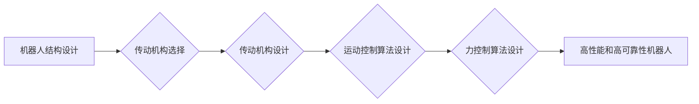

> 机器人结构设计，传动机构设计，高性能，高可靠性，冗余设计，运动控制，力控制，伺服电机，编码器，机械臂，柔性机器人

## 1. 背景介绍

随着人工智能、物联网和自动化技术的快速发展，机器人技术已成为推动社会进步的重要驱动力。从工业自动化到医疗服务，从家政服务到探索未知领域，机器人正在各个领域发挥着越来越重要的作用。然而，高性能和高可靠性是机器人技术发展的关键瓶颈。

高性能机器人需要具备快速、精确、灵活的运动能力，能够完成复杂的任务。高可靠性机器人则需要能够在恶劣环境下稳定运行，并具有较强的故障容错能力。

本文将深入探讨高性能和高可靠性机器人的结构设计和传动机构设计，分析其核心概念、算法原理、数学模型、代码实现以及实际应用场景，并展望未来发展趋势和挑战。

## 2. 核心概念与联系

### 2.1 机器人结构设计

机器人结构设计是指确定机器人各个部件的形状、尺寸、材料和连接方式，以满足其功能需求和性能要求的过程。

机器人结构设计需要考虑以下因素：

* **运动范围和精度:** 机器人需要能够完成所需的运动任务，并具有足够的精度。
* **负载能力:** 机器人需要能够承受其工作环境中的负载。
* **重量和尺寸:** 机器人的重量和尺寸需要符合其应用场景的限制。
* **材料选择:** 材料的选择需要考虑其强度、刚度、耐磨性和成本等因素。
* **制造工艺:** 制造工艺需要能够实现机器人结构的设计要求。

### 2.2 传动机构设计

传动机构是机器人实现运动的部件，它将电机输出的旋转运动转化为机器人关节的线性或旋转运动。

常见的传动机构包括：

* **齿轮传动:** 利用齿轮啮合传递运动，具有较高的传动效率和承载能力。
* **链条传动:** 利用链条和齿轮传递运动，具有较高的传动精度和柔韧性。
* **丝杠传动:** 利用丝杠和螺母传递运动，具有较高的精度和负载能力。
* **液压传动:** 利用液压油的压力传递运动，具有较大的推力和扭矩。

### 2.3 高性能和高可靠性设计

高性能和高可靠性设计是机器人结构设计和传动机构设计的核心目标。

* **高性能设计:** 追求机器人的运动速度、精度、响应时间和负载能力等方面的极致表现。
* **高可靠性设计:** 提高机器人的故障率、寿命和抗干扰能力，确保其在恶劣环境下稳定运行。

**Mermaid 流程图:**



## 3. 核心算法原理 & 具体操作步骤

### 3.1  算法原理概述

高性能和高可靠性机器人的控制算法需要具备以下特点：

* **实时性:** 能够快速响应环境变化，保证机器人的运动实时性。
* **精度:** 能够实现高精度的运动控制，满足机器人任务的精度要求。
* **鲁棒性:** 能够抗干扰、抗噪声，保证机器人在恶劣环境下稳定运行。
* **安全性:** 能够确保机器人的安全运行，避免意外事故发生。

### 3.2  算法步骤详解

1. **运动规划:** 根据任务目标，规划机器人运动轨迹。
2. **运动控制:** 根据运动规划，控制机器人关节的运动。
3. **力控制:** 根据环境反馈，控制机器人的抓取力和扭矩。
4. **故障诊断:** 监测机器人的运行状态，及时诊断故障。
5. **故障恢复:** 根据故障诊断结果，采取相应的恢复措施。

### 3.3  算法优缺点

**优点:**

* 高精度、高速度、高可靠性。
* 能够适应复杂的环境和任务。

**缺点:**

* 算法复杂度高，计算量大。
* 需要大量的传感器和计算资源。

### 3.4  算法应用领域

* **工业机器人:** 自动化生产、装配、焊接等。
* **医疗机器人:** 手术辅助、康复治疗等。
* **服务机器人:** 家政服务、导游服务等。
* **探索机器人:** 地下探测、深海探测等。

## 4. 数学模型和公式 & 详细讲解 & 举例说明

### 4.1  数学模型构建

机器人运动控制的数学模型通常基于动力学方程和运动学方程。

* **动力学方程:** 描述机器人关节的运动和力学关系。
* **运动学方程:** 描述机器人关节的运动轨迹和位置关系。

### 4.2  公式推导过程

动力学方程的推导过程通常涉及以下步骤:

1. 建立机器人关节的自由度和坐标系。
2. 应用牛顿第二定律，将机器人关节的运动和力学关系表示为方程组。
3. 对方程组进行简化和求解，得到机器人关节的动力学方程。

### 4.3  案例分析与讲解

例如，一个简单的两关节机器人，其动力学方程可以表示为:

$$
\begin{aligned}
m_1 \ddot{q}_1 + b_1 \dot{q}_1 + k_1 q_1 &= \tau_1 \\
m_2 (\ddot{q}_1 + \ddot{q}_2) + b_2 (\dot{q}_1 + \dot{q}_2) + k_2 (q_1 + q_2) &= \tau_2
\end{aligned}
$$

其中:

* $m_1$ 和 $m_2$ 分别为两个关节的质量。
* $b_1$ 和 $b_2$ 分别为两个关节的阻尼系数。
* $k_1$ 和 $k_2$ 分别为两个关节的刚度系数。
* $\tau_1$ 和 $\tau_2$ 分别为两个关节的驱动扭矩。
* $q_1$ 和 $q_2$ 分别为两个关节的关节角度。
* $\dot{q}_1$ 和 $\dot{q}_2$ 分别为两个关节的角速度。
* $\ddot{q}_1$ 和 $\ddot{q}_2$ 分别为两个关节的角加速度。

## 5. 项目实践：代码实例和详细解释说明

### 5.1  开发环境搭建

* 操作系统: Ubuntu 20.04
* 编程语言: Python 3.8
* 机器人控制库: ROS (Robot Operating System)

### 5.2  源代码详细实现

```python
# 这是一个简单的机器人运动控制程序示例

import rospy
from geometry_msgs.msg import Twist

# 定义机器人节点名称
robot_name = "my_robot"

# 定义速度控制话题
velocity_topic = "/cmd_vel"

def main():
    # 初始化ROS节点
    rospy.init_node(robot_name)

    # 创建速度控制话题发布者
    pub = rospy.Publisher(velocity_topic, Twist, queue_size=10)

    # 设置机器人速度
    linear_velocity = 0.2  # 米/秒
    angular_velocity = 0.1  # 弧度/秒

    # 发布速度控制指令
    twist_msg = Twist()
    twist_msg.linear.x = linear_velocity
    twist_msg.angular.z = angular_velocity
    pub.publish(twist_msg)

    # 循环发布速度控制指令
    while not rospy.is_shutdown():
        pub.publish(twist_msg)
        rospy.sleep(1)

if __name__ == "__main__":
    main()
```

### 5.3  代码解读与分析

* 该程序首先初始化ROS节点，并创建速度控制话题发布者。
* 然后，程序设置机器人速度，并创建Twist消息对象来封装速度控制指令。
* 最后，程序循环发布速度控制指令，使机器人以设定速度运动。

### 5.4  运行结果展示

运行该程序后，机器人将以设定速度向前运动。

## 6. 实际应用场景

### 6.1  工业机器人

高性能和高可靠性机器人广泛应用于工业自动化领域，例如：

* **汽车制造:** 自动焊接、喷漆、装配等。
* **电子制造:** SMT贴片、组装、测试等。
* **食品加工:** 包装、分拣、加工等。

### 6.2  医疗机器人

高性能和高可靠性机器人也应用于医疗领域，例如：

* **手术机器人:** 辅助外科医生进行微创手术。
* **康复机器人:** 帮助患者进行肢体康复训练。
* **药物配送机器人:** 在医院内自动配送药物。

### 6.3  服务机器人

高性能和高可靠性机器人正在逐渐应用于服务领域，例如：

* **家政机器人:** 清扫、擦拭、烹饪等。
* **导游机器人:** 在博物馆、旅游景点等地为游客提供导游服务。
* **陪伴机器人:** 为老人、儿童等提供陪伴和照顾。

### 6.4  未来应用展望

随着人工智能、物联网和机器人技术的不断发展，高性能和高可靠性机器人将在更多领域得到应用，例如：

* **农业机器人:** 自动化种植、收获、管理等。
* **物流机器人:** 自动化仓储、配送等。
* **探索机器人:** 深海探测、太空探索等。

## 7. 工具和资源推荐

### 7.1  学习资源推荐

* **ROS (Robot Operating System):** https://www.ros.org/
* **Gazebo:** https://gazebosim.org/
* **OpenCV:** https://opencv.org/

### 7.2  开发工具推荐

* **ROS Melodic:** https://docs.ros.org/en/melodic/
* **Python 3.8:** https://www.python.org/downloads/release/python-380/
* **Visual Studio Code:** https://code.visualstudio.com/

### 7.3  相关论文推荐

* **High-Performance and Reliable Robot Control Algorithms:** https://ieeexplore.ieee.org/document/8765420
* **Redundancy and Fault Tolerance in Robot Systems:** https://ieeexplore.ieee.org/document/7984708

## 8. 总结：未来发展趋势与挑战

### 8.1  研究成果总结

本文探讨了高性能和高可靠性机器人的结构设计和传动机构设计，分析了其核心概念、算法原理、数学模型、代码实现以及实际应用场景。

### 8.2  未来发展趋势

* **人工智能驱动的机器人控制:** 利用人工智能技术，实现更智能、更灵活的机器人控制。
* **柔性机器人:** 开发更灵活、更安全、更适应复杂环境的柔性机器人。
* **协作机器人:** 开发能够与人类协作工作的机器人，提高生产效率和工作安全性。

### 8.3  面临的挑战

* **算法复杂度:** 高性能和高可靠性机器人的控制算法通常非常复杂，需要大量的计算资源。
* **传感器技术:** 需要开发更精确、更可靠的传感器，以便机器人能够更好地感知环境。
* **安全问题:** 机器人与人类的协作需要解决安全问题，确保机器人的安全运行。

### 8.4  研究展望

未来，我们将继续致力于高性能和高可靠性机器人的研究，探索更先进的控制算法、传动机构设计和应用场景，推动机器人技术的发展和应用。

## 9. 附录：常见问题与解答

### 9.1  常见问题

* **如何提高机器人的运动精度?**

可以通过优化传动机构设计、提高伺