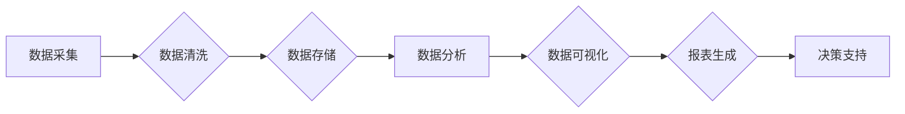

> AI DMP, 数据基建, 数据可视化, 报表, 数据分析, 数据驱动, 决策支持

## 1. 背景介绍

在当今数据爆炸的时代，企业积累了海量的用户数据、运营数据、市场数据等。如何有效地挖掘这些数据中的价值，并将其转化为可操作的决策依据，成为企业发展面临的重大挑战。数据可视化和报表作为数据分析的重要手段，能够帮助企业直观地理解数据趋势，发现隐藏的价值，并为决策提供支持。

AI DMP（人工智能数据管理平台）作为一种新型的数据管理平台，融合了人工智能技术和数据管理理念，能够对海量数据进行智能分析、挖掘和可视化，为企业提供更精准、更有效的决策支持。

## 2. 核心概念与联系

**2.1 AI DMP 数据基建**

AI DMP 数据基建是指构建一个能够支撑 AI DMP 系统运行和发展的基础数据设施。它包括数据存储、数据处理、数据分析、数据可视化等多个环节，需要采用先进的技术和架构来保证数据的安全、可靠、高效地管理和利用。

**2.2 数据可视化与报表**

数据可视化是指将数据以图形、图表等形式呈现出来，以便于人们直观地理解和分析数据。报表则是将数据以表格的形式整理和展示，方便人们进行统计分析和数据比较。

**2.3 核心概念联系**

AI DMP 数据基建为数据可视化和报表提供了坚实的基础。它提供的数据存储、数据处理和数据分析能力，为数据可视化和报表提供了数据源和分析结果。而数据可视化和报表则将 AI DMP 系统的分析结果以直观易懂的方式呈现出来，帮助企业更好地理解数据，并做出更明智的决策。

**2.4  Mermaid 流程图**



## 3. 核心算法原理 & 具体操作步骤

**3.1 算法原理概述**

数据可视化和报表生成通常涉及到以下核心算法：

* **聚合函数:** 用于对数据进行汇总分析，例如求和、平均值、最大值、最小值等。
* **数据分类:** 将数据按照一定的规则进行分类，例如按时间、地域、用户类型等进行分类。
* **趋势分析:** 分析数据随时间变化的趋势，例如增长率、衰减率等。
* **关联规则挖掘:** 发现数据之间的关联关系，例如哪些产品经常一起购买。

**3.2 算法步骤详解**

1. **数据准备:** 收集、清洗和转换数据，使其符合可视化和报表生成的要求。
2. **数据分析:** 使用聚合函数、数据分类、趋势分析等算法对数据进行分析，提取关键信息。
3. **可视化设计:** 根据分析结果，选择合适的图表类型和布局，设计数据可视化方案。
4. **报表生成:** 使用报表工具，将分析结果和可视化图表组合成报表，并进行格式设置。

**3.3 算法优缺点**

* **优点:** 数据可视化和报表生成能够直观地展示数据，帮助人们快速理解数据趋势和关键信息。
* **缺点:** 算法的复杂度和性能取决于数据的规模和类型，对于海量数据，需要采用更高级的算法和技术来保证效率。

**3.4 算法应用领域**

数据可视化和报表生成广泛应用于各个领域，例如：

* **商业分析:** 分析销售数据、市场趋势、客户行为等。
* **金融分析:** 分析股票价格、投资回报、风险评估等。
* **科学研究:** 分析实验数据、研究结果、模型预测等。
* **政府管理:** 分析人口数据、经济指标、社会发展等。

## 4. 数学模型和公式 & 详细讲解 & 举例说明

**4.1 数学模型构建**

数据可视化和报表生成过程中，可以使用数学模型来描述数据之间的关系，并进行分析和预测。例如，可以使用线性回归模型来预测销售额，可以使用聚类算法来将客户进行分组。

**4.2 公式推导过程**

具体的数学模型和公式推导过程取决于具体的应用场景。例如，线性回归模型的公式如下：

$$y = mx + c$$

其中：

* $y$ 是预测值
* $x$ 是自变量
* $m$ 是回归系数
* $c$ 是截距

**4.3 案例分析与讲解**

假设我们想要预测某个产品的销售额，可以使用线性回归模型。我们可以收集过去一段时间的产品销售数据和相关因素数据，例如广告投入、促销活动等。然后，使用线性回归算法对数据进行拟合，得到回归系数和截距。最后，我们可以使用得到的模型公式来预测未来一段时间的产品销售额。

## 5. 项目实践：代码实例和详细解释说明

**5.1 开发环境搭建**

* 操作系统: Ubuntu 20.04
* 编程语言: Python 3.8
* 开发工具: Jupyter Notebook
* 数据库: MySQL

**5.2 源代码详细实现**

```python
import pandas as pd
from sklearn.linear_model import LinearRegression

# 加载数据
data = pd.read_csv('sales_data.csv')

# 选择特征变量和目标变量
X = data[['广告投入', '促销活动']]
y = data['销售额']

# 创建线性回归模型
model = LinearRegression()

# 训练模型
model.fit(X, y)

# 预测未来销售额
future_sales = model.predict([[1000, 2]])

# 打印预测结果
print(f'未来销售额预测值为: {future_sales[0]}')
```

**5.3 代码解读与分析**

* 首先，我们使用 pandas 库加载数据，并选择特征变量和目标变量。
* 然后，我们使用 scikit-learn 库中的 LinearRegression 类创建线性回归模型。
* 接着，我们使用 model.fit() 方法训练模型，将特征变量和目标变量作为输入。
* 最后，我们使用 model.predict() 方法预测未来销售额，并将结果打印出来。

**5.4 运行结果展示**

运行上述代码后，会输出未来销售额的预测值。

## 6. 实际应用场景

**6.1  电商平台**

电商平台可以利用 AI DMP 数据基建进行用户画像分析，根据用户的购买历史、浏览记录、评价等数据，构建用户画像，并进行精准营销。

**6.2  金融机构**

金融机构可以利用 AI DMP 数据基建进行风险评估，根据用户的信用记录、交易行为等数据，评估用户的信用风险，并进行精准授信。

**6.3  医疗机构**

医疗机构可以利用 AI DMP 数据基建进行疾病预测，根据患者的病史、检查结果等数据，预测患者患病风险，并进行预防和治疗。

**6.4 未来应用展望**

随着人工智能技术的不断发展，AI DMP 数据基建将在更多领域得到应用，例如智能制造、智慧城市、教育等。

## 7. 工具和资源推荐

**7.1 学习资源推荐**

* **书籍:**
    * 《Python数据科学手册》
    * 《机器学习实战》
* **在线课程:**
    * Coursera: 数据科学
    * edX: 人工智能

**7.2 开发工具推荐**

* **数据分析工具:**
    * pandas
    * scikit-learn
* **可视化工具:**
    * matplotlib
    * seaborn
* **报表工具:**
    * Tableau
    * Power BI

**7.3 相关论文推荐**

* 《深度学习》
* 《机器学习》

## 8. 总结：未来发展趋势与挑战

**8.1 研究成果总结**

AI DMP 数据基建在数据可视化和报表生成方面取得了显著成果，能够帮助企业更好地理解数据，并做出更明智的决策。

**8.2 未来发展趋势**

* **更智能的数据分析:** 利用人工智能技术，实现更智能的数据分析，例如自动发现数据异常、预测未来趋势等。
* **更个性化的数据可视化:** 根据用户的需求和偏好，提供更个性化的数据可视化方案。
* **更强大的数据报表:** 支持更复杂的报表类型和功能，例如动态报表、交互式报表等。

**8.3 面临的挑战**

* **数据质量问题:** 数据质量问题会影响数据分析和可视化结果的准确性。
* **数据安全问题:** 数据安全问题需要得到妥善解决，确保数据的安全性和隐私性。
* **技术复杂性:** AI DMP 数据基建的技术复杂性需要不断降低，以便于更广泛的应用。

**8.4 研究展望**

未来，AI DMP 数据基建的研究将继续深入，朝着更智能、更个性化、更强大的方向发展。


## 9. 附录：常见问题与解答

**9.1 如何选择合适的图表类型？**

选择合适的图表类型取决于要展示的数据类型和分析目标。例如，使用柱状图来比较不同类别的数据，使用折线图来展示数据随时间变化的趋势。

**9.2 如何保证数据可视化的准确性？**

保证数据可视化的准确性需要从数据采集、数据清洗、数据分析等各个环节进行控制，并使用合适的图表类型和数据呈现方式。

**9.3 如何提高数据可视化的美观度？**

提高数据可视化的美观度需要关注图表布局、颜色搭配、字体选择等细节，并使用合适的工具和技术进行设计。


作者：禅与计算机程序设计艺术 / Zen and the Art of Computer Programming 
<end_of_turn>