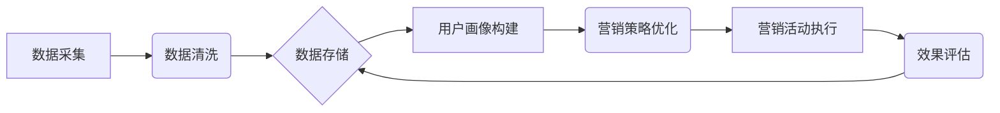

> AI DMP, 数据基建, 营销生态, 数据驱动, 个性化营销, 算法模型, 数据分析, 营销自动化

## 1. 背景介绍

在当今数据爆炸的时代，企业积累了海量的用户数据，但如何有效地利用这些数据来提升营销效果，实现精准营销，成为了一个亟待解决的问题。传统的营销方式往往依靠经验和直觉，缺乏数据支撑，难以精准触达目标用户。而数据驱动营销则通过数据分析和算法模型，洞察用户行为，精准定位目标群体，实现个性化营销，从而提升营销效率和转化率。

数据管理平台 (DMP) 作为数据驱动营销的核心基础设施，扮演着至关重要的角色。DMP 可以收集、整合、清洗和分析来自各种渠道的用户数据，构建用户画像，并为营销活动提供数据支持。然而，传统的 DMP 往往局限于数据存储和分析，缺乏人工智能 (AI) 的赋能，难以实现更智能化、更精准化的营销决策。

随着人工智能技术的快速发展，AI DMP 应运而生，它将 AI 技术与 DMP 相结合，赋予 DMP 更强大的数据分析和预测能力，能够更深入地洞察用户行为，提供更精准的营销建议，从而构建更加智能化、数据驱动的营销生态。

## 2. 核心概念与联系

**2.1 AI DMP 的核心概念**

AI DMP 是将人工智能技术与数据管理平台相结合，构建智能化数据驱动的营销平台。它通过机器学习、深度学习等算法模型，对用户数据进行分析和预测，为营销活动提供数据支持和智能化决策建议。

**2.2 AI DMP 与传统 DMP 的区别**

| 特性 | 传统 DMP | AI DMP |
|---|---|---|
| 数据分析 | 基于规则和统计分析 | 基于机器学习和深度学习 |
| 用户画像 | 基于静态特征 | 基于动态行为和预测 |
| 营销决策 | 基于经验和直觉 | 基于数据分析和算法模型 |
| 个性化程度 | 有限 | 高度个性化 |
| 智能化程度 | 低 | 高 |

**2.3 AI DMP 的架构**



**2.4 AI DMP 的核心功能**

* **数据采集:** 从各种渠道收集用户数据，包括网站访问数据、App 使用数据、社交媒体数据等。
* **数据清洗:** 对收集到的数据进行清洗和处理，去除无效数据和重复数据，确保数据质量。
* **数据存储:** 将清洗后的数据存储在数据库中，方便后续分析和使用。
* **用户画像构建:** 利用机器学习算法，对用户数据进行分析，构建用户画像，包括用户基本信息、兴趣爱好、行为偏好等。
* **营销策略优化:** 根据用户画像和营销目标，优化营销策略，例如目标用户定位、广告投放策略、内容推荐策略等。
* **营销活动执行:** 通过营销自动化工具，执行营销活动，例如发送邮件、推送消息、展示广告等。
* **效果评估:** 对营销活动的效果进行评估，分析数据，优化营销策略。

## 3. 核心算法原理 & 具体操作步骤

**3.1 算法原理概述**

AI DMP 中常用的算法模型包括：

* **机器学习算法:** 用于从数据中学习规律，例如分类算法、回归算法、聚类算法等。
* **深度学习算法:** 用于处理复杂的数据，例如卷积神经网络、循环神经网络等。

**3.2 算法步骤详解**

1. **数据预处理:** 对数据进行清洗、转换、特征工程等操作，使其适合算法训练。
2. **模型选择:** 根据业务需求和数据特点，选择合适的算法模型。
3. **模型训练:** 利用训练数据，训练算法模型，使其能够学习数据中的规律。
4. **模型评估:** 利用测试数据，评估模型的性能，例如准确率、召回率、F1-score等。
5. **模型优化:** 根据评估结果，调整模型参数，优化模型性能。
6. **模型部署:** 将训练好的模型部署到生产环境中，用于数据分析和预测。

**3.3 算法优缺点**

* **机器学习算法:**
    * **优点:** 
        * 能够从数据中学习规律，实现自动化决策。
        * 适用范围广，可以应用于各种数据分析任务。
    * **缺点:** 
        * 需要大量的训练数据。
        * 对数据质量要求高。
        * 难以解释模型决策过程。
* **深度学习算法:**
    * **优点:** 
        * 能够处理复杂的数据，例如图像、文本、语音等。
        * 性能优于传统机器学习算法。
    * **缺点:** 
        * 需要更多的计算资源和训练时间。
        * 对数据质量要求更高。
        * 难以解释模型决策过程。

**3.4 算法应用领域**

* **用户画像构建:** 根据用户行为数据，构建用户画像，了解用户的兴趣爱好、消费习惯等。
* **精准营销:** 根据用户画像，精准定位目标用户，推送个性化广告和内容。
* **营销效果评估:** 分析营销活动的数据，评估营销效果，优化营销策略。
* **客户关系管理:** 分析客户行为数据，预测客户流失风险，提供个性化服务。

## 4. 数学模型和公式 & 详细讲解 & 举例说明

**4.1 数学模型构建**

AI DMP 中常用的数学模型包括：

* **线性回归模型:** 用于预测连续型变量，例如用户购买金额。
* **逻辑回归模型:** 用于预测分类型变量，例如用户是否会点击广告。
* **支持向量机 (SVM):** 用于分类和回归问题，能够处理高维数据。
* **决策树:** 用于分类和回归问题，能够解释模型决策过程。

**4.2 公式推导过程**

例如，线性回归模型的公式如下：

$$y = \beta_0 + \beta_1x_1 + \beta_2x_2 + ... + \beta_nx_n + \epsilon$$

其中：

* $y$ 是预测变量
* $x_1, x_2, ..., x_n$ 是自变量
* $\beta_0, \beta_1, ..., \beta_n$ 是模型参数
* $\epsilon$ 是误差项

模型参数可以通过最小二乘法估计。

**4.3 案例分析与讲解**

假设我们想要预测用户的购买金额，我们可以使用线性回归模型。

* 自变量包括用户的年龄、收入、购买历史等。
* 预测变量是用户的购买金额。

通过训练模型，我们可以得到模型参数，例如：

* $\beta_0 = 100$
* $\beta_1 = 5$
* $\beta_2 = 2$

这意味着，用户的购买金额与年龄、收入等因素相关。

## 5. 项目实践：代码实例和详细解释说明

**5.1 开发环境搭建**

* 操作系统: Ubuntu 20.04
* Python 版本: 3.8
* 必要的库: pandas, numpy, scikit-learn, TensorFlow

**5.2 源代码详细实现**

```python
import pandas as pd
from sklearn.linear_model import LinearRegression

# 加载数据
data = pd.read_csv('user_data.csv')

# 选择特征和目标变量
X = data[['age', 'income']]
y = data['purchase_amount']

# 创建线性回归模型
model = LinearRegression()

# 训练模型
model.fit(X, y)

# 预测新的用户购买金额
new_user_data = pd.DataFrame({'age': [30], 'income': [50000]})
predicted_amount = model.predict(new_user_data)

# 打印预测结果
print(f'Predicted purchase amount: {predicted_amount[0]}')
```

**5.3 代码解读与分析**

* 首先，我们加载用户数据，并选择特征和目标变量。
* 然后，我们创建线性回归模型，并使用训练数据训练模型。
* 最后，我们使用训练好的模型预测新的用户购买金额。

**5.4 运行结果展示**

运行代码后，会输出预测的购买金额。

## 6. 实际应用场景

**6.1 个性化广告推荐**

AI DMP 可以根据用户的兴趣爱好、浏览历史等数据，推荐个性化的广告，提高广告点击率和转化率。

**6.2 内容推荐**

AI DMP 可以根据用户的阅读习惯、观看历史等数据，推荐个性化的内容，提高用户粘性和参与度。

**6.3 客户关系管理**

AI DMP 可以分析客户行为数据，预测客户流失风险，提供个性化服务，提升客户满意度和忠诚度。

**6.4 营销自动化**

AI DMP 可以自动执行营销活动，例如发送邮件、推送消息、展示广告等，提高营销效率。

**6.5 未来应用展望**

随着人工智能技术的不断发展，AI DMP 将在更多领域得到应用，例如：

* **精准营销:** 更深入地洞察用户需求，提供更精准的营销建议。
* **个性化体验:** 为用户提供更个性化的产品和服务体验。
* **数据驱动决策:** 基于数据分析，为企业决策提供更科学的依据。

## 7. 工具和资源推荐

**7.1 学习资源推荐**

* **书籍:**
    * 《深度学习》
    * 《机器学习实战》
* **在线课程:**
    * Coursera: 深度学习
    * Udacity: 机器学习工程师
* **博客:**
    * Towards Data Science
    * Machine Learning Mastery

**7.2 开发工具推荐**

* **Python:** 
    * pandas
    * numpy
    * scikit-learn
    * TensorFlow
* **云平台:**
    * AWS
    * Azure
    * GCP

**7.3 相关论文推荐**

* **Attention Is All You Need**
* **BERT: Pre-training of Deep Bidirectional Transformers for Language Understanding**
* **Generative Adversarial Networks**

## 8. 总结：未来发展趋势与挑战

**8.1 研究成果总结**

AI DMP 已经取得了显著的成果，能够有效地提升营销效率和精准度。

**8.2 未来发展趋势**

* **更智能化的算法模型:** 
    * 更深入地洞察用户需求，提供更精准的营销建议。
* **更强大的数据分析能力:** 
    * 处理更复杂的数据，提供更全面的数据洞察。
* **更完善的生态系统:** 
    * 与其他营销工具和平台的集成，构建更完整的营销生态。

**8.3 面临的挑战**

* **数据隐私和安全:** 
    * 如何保护用户数据隐私，确保数据安全。
* **算法偏见:** 
    * 如何避免算法模型产生偏见，确保公平公正的营销决策。
* **技术人才短缺:** 
    * 如何培养更多AI DMP领域的专业人才。

**8.4 研究展望**

未来，AI DMP 将继续朝着更智能化、更精准化、更安全化的方向发展，为企业提供更强大的数据驱动营销能力。


## 9. 附录：常见问题与解答

**9.1 如何选择合适的 AI DMP 平台？**

选择 AI DMP 平台时，需要考虑以下因素：

* **功能需求:** 
    * 平台是否支持您需要的功能，例如用户画像构建、精准营销、营销效果评估等。
* **数据处理能力:** 
    * 平台是否能够处理您需要处理的数据量和类型。
* **价格和服务:** 
    * 平台的价格和服务是否符合您的预算和需求。

**9.2 如何保证 AI DMP 的数据安全？**

* **数据加密:** 对用户数据进行加密，防止数据泄露。
*