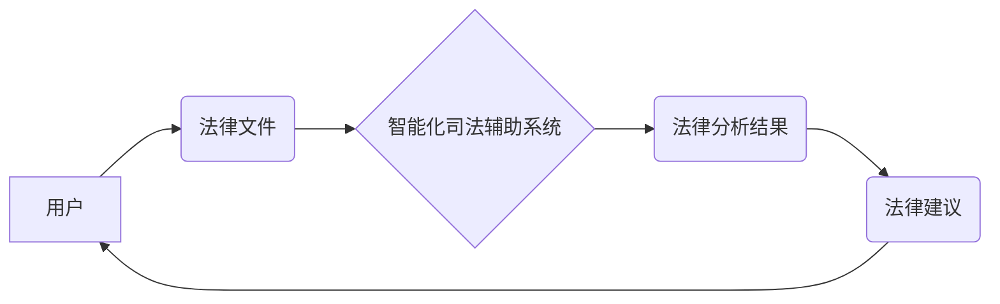

>人工智能，司法辅助系统，法律服务，智能化，机器学习，自然语言处理，法律推理，数据分析，可解释性

## 1. 背景介绍

在当今数字时代，人工智能（AI）技术正在迅速发展，并开始渗透到各个领域，包括法律服务。传统法律服务模式面临着效率低下、成本高昂、信息获取困难等挑战。而智能化司法辅助系统，作为AI技术在法律领域的应用，正逐渐成为解决这些问题的关键。

智能化司法辅助系统利用AI技术，例如机器学习、自然语言处理和法律推理，帮助法律专业人员提高工作效率、降低成本、提升服务质量。它可以自动分析法律文件、识别法律风险、预测案件结果、提供法律建议等，从而解放法律专业人员的时间和精力，让他们能够专注于更复杂和需要专业判断的法律问题。

## 2. 核心概念与联系

**2.1 核心概念**

* **人工智能 (AI):**  指模拟人类智能行为的计算机系统，包括学习、推理、决策、感知和语言理解等能力。
* **司法辅助系统:** 指利用计算机技术辅助法律专业人员进行法律工作，提高效率和准确性的系统。
* **智能化:** 指利用人工智能技术赋予司法辅助系统自主学习、分析和决策的能力，使其能够更智能地辅助法律工作。

**2.2 架构关系**



**2.3 核心技术**

* **机器学习 (ML):**  通过算法训练模型，使模型能够从数据中学习规律，并进行预测或分类。
* **自然语言处理 (NLP):**  使计算机能够理解和处理人类语言，包括文本分析、情感识别、机器翻译等。
* **法律推理:**  利用逻辑规则和法律知识库，对法律问题进行推理和分析，得出法律结论。

## 3. 核心算法原理 & 具体操作步骤

**3.1 算法原理概述**

智能化司法辅助系统通常采用基于机器学习的算法，例如支持向量机 (SVM)、决策树、随机森林等，对法律文件进行分析和理解。这些算法通过训练模型，学习法律文本的特征和模式，从而能够识别法律问题、预测案件结果、提供法律建议等。

**3.2 算法步骤详解**

1. **数据收集和预处理:** 收集大量法律文件，并进行清洗、格式化和标注等预处理工作。
2. **特征提取:** 从法律文件中提取关键特征，例如法律条款、案件事实、当事人信息等。
3. **模型训练:** 利用机器学习算法，对训练数据进行训练，建立法律分析模型。
4. **模型评估:** 使用测试数据对模型进行评估，并根据评估结果进行模型优化。
5. **模型部署:** 将训练好的模型部署到司法辅助系统中，供法律专业人员使用。

**3.3 算法优缺点**

* **优点:**
    * 自动化处理法律文件，提高效率。
    * 分析海量法律数据，发现隐藏的法律趋势。
    * 提供客观、中立的法律建议。
* **缺点:**
    * 依赖于训练数据的质量，数据偏差会导致模型误判。
    * 缺乏对复杂法律问题的理解能力。
    * 难以解释模型的决策过程，缺乏可解释性。

**3.4 算法应用领域**

* **法律风险评估:** 分析合同、协议等法律文件，识别潜在的法律风险。
* **案件预测:** 根据案件事实和法律依据，预测案件结果。
* **法律研究:** 分析法律法规、判例等法律文献，发现法律趋势和热点问题。
* **法律咨询:** 提供基于法律数据的法律咨询服务。

## 4. 数学模型和公式 & 详细讲解 & 举例说明

**4.1 数学模型构建**

智能化司法辅助系统中，常用的数学模型包括支持向量机 (SVM)、逻辑回归 (Logistic Regression) 和神经网络 (Neural Network)。

* **支持向量机 (SVM):** SVM是一种监督学习算法，用于分类和回归问题。其核心思想是找到一个最佳的分隔超平面，将不同类别的数据点分开。

* **逻辑回归 (Logistic Regression):** 逻辑回归是一种用于二分类问题的算法，其输出结果是一个概率值，表示数据点属于某一类别的概率。

* **神经网络 (Neural Network):** 神经网络是一种模仿人脑神经网络结构的算法，具有强大的学习能力，可以处理复杂的数据模式。

**4.2 公式推导过程**

* **SVM:** SVM的目标函数是最大化间隔，即找到一个最佳的分隔超平面，使得不同类别的数据点之间的距离最大化。

$$
\max_{w,b} \frac{1}{2} ||w||^2
$$

$$
s.t. y_i (w^T x_i + b) \geq 1, i = 1, 2, ..., n
$$

* **逻辑回归:** 逻辑回归的输出结果是一个概率值，可以使用sigmoid函数进行计算。

$$
p(y = 1 | x) = \frac{1}{1 + e^{-(w^T x + b)}}
$$

**4.3 案例分析与讲解**

假设我们想要构建一个智能化司法辅助系统，用于预测案件结果。我们可以使用SVM算法，训练一个模型，将案件事实作为输入，预测案件结果作为输出。

在训练过程中，我们需要收集大量的案件数据，并进行标注，例如案件类型、当事人信息、案件结果等。然后，我们可以使用SVM算法，对这些数据进行训练，建立一个预测案件结果的模型。

## 5. 项目实践：代码实例和详细解释说明

**5.1 开发环境搭建**

* 操作系统: Ubuntu 20.04 LTS
* Python 版本: 3.8.10
* 必要的库: scikit-learn, pandas, numpy, matplotlib

**5.2 源代码详细实现**

```python
from sklearn.svm import SVC
from sklearn.model_selection import train_test_split
from sklearn.metrics import accuracy_score

# 加载数据
data = pd.read_csv('case_data.csv')

# 提取特征和标签
X = data[['特征1', '特征2', '特征3']]
y = data['标签']

# 将数据分成训练集和测试集
X_train, X_test, y_train, y_test = train_test_split(X, y, test_size=0.2, random_state=42)

# 创建SVM模型
model = SVC()

# 训练模型
model.fit(X_train, y_train)

# 预测测试集结果
y_pred = model.predict(X_test)

# 计算准确率
accuracy = accuracy_score(y_test, y_pred)
print(f'准确率: {accuracy}')
```

**5.3 代码解读与分析**

* 该代码首先加载案件数据，并提取特征和标签。
* 然后，将数据分成训练集和测试集，用于训练和评估模型。
* 创建一个SVM模型，并使用训练集进行训练。
* 最后，使用测试集进行预测，并计算模型的准确率。

**5.4 运行结果展示**

运行该代码后，会输出模型的准确率。

## 6. 实际应用场景

**6.1 法律风险评估**

智能化司法辅助系统可以分析合同、协议等法律文件，识别潜在的法律风险，帮助企业规避法律风险。

**6.2 案件预测**

智能化司法辅助系统可以根据案件事实和法律依据，预测案件结果，帮助律师制定法律策略。

**6.3 法律研究**

智能化司法辅助系统可以分析法律法规、判例等法律文献，发现法律趋势和热点问题，帮助法律学者进行法律研究。

**6.4 未来应用展望**

* **个性化法律服务:** 根据用户的具体情况，提供个性化的法律建议和服务。
* **智能化合同生成:** 自动生成符合法律要求的合同。
* **法律数据分析:** 对法律数据进行分析，发现法律趋势和规律。

## 7. 工具和资源推荐

**7.1 学习资源推荐**

* **书籍:**
    * 《深度学习》
    * 《机器学习实战》
    * 《自然语言处理入门》
* **在线课程:**
    * Coursera: 深度学习
    * edX: 机器学习
    * Udacity: 自然语言处理

**7.2 开发工具推荐**

* **Python:** 广泛应用于机器学习和自然语言处理领域。
* **scikit-learn:** Python机器学习库。
* **TensorFlow:** 深度学习框架。
* **PyTorch:** 深度学习框架。

**7.3 相关论文推荐**

* **BERT: Pre-training of Deep Bidirectional Transformers for Language Understanding**
* **Attention Is All You Need**
* **Deep Learning for Legal Text Analysis**

## 8. 总结：未来发展趋势与挑战

**8.1 研究成果总结**

智能化司法辅助系统在法律服务领域取得了显著的成果，例如提高了法律工作效率、降低了法律成本、提升了法律服务质量。

**8.2 未来发展趋势**

* **更强大的AI模型:** 随着人工智能技术的不断发展，未来将出现更强大的AI模型，能够更好地理解和处理法律问题。
* **更广泛的应用场景:** 智能化司法辅助系统将应用于更广泛的法律场景，例如法律咨询、法律研究、法律教育等。
* **更强的可解释性:** 未来将更加注重智能化司法辅助系统的可解释性，使法律专业人员能够更好地理解模型的决策过程。

**8.3 面临的挑战**

* **数据质量问题:** 智能化司法辅助系统的性能依赖于训练数据的质量，而法律数据往往存在不完整、不一致、格式混乱等问题。
* **法律法规的复杂性:** 法律法规的复杂性和动态性使得智能化司法辅助系统难以完全理解和应用。
* **伦理和法律问题:** 智能化司法辅助系统的应用可能会引发伦理和法律问题，例如数据隐私、算法偏见等。

**8.4 研究展望**

未来研究将重点关注以下几个方面:

* **提高法律数据的质量:** 开发新的方法和技术，提高法律数据的质量和可利用性。
* **增强模型的法律理解能力:** 研究更有效的法律知识表示和推理方法，使模型能够更好地理解和应用法律法规。
* **解决伦理和法律问题:** 制定相应的法律法规和伦理规范，规范智能化司法辅助系统的应用。


## 9. 附录：常见问题与解答

**9.1 智能化司法辅助系统是否会取代律师？**

智能化司法辅助系统可以帮助律师提高工作效率，但它不会取代律师。律师需要具备专业知识、法律判断能力和沟通能力，这些都是AI技术难以替代的。

**9.2 智能化司法辅助系统的数据安全如何保障？**

智能化司法辅助系统的数据安全需要得到严格的保护。开发人员需要采取相应的技术措施，例如数据加密、访问控制等，确保数据的安全性和隐私性。

**9.3 智能化司法辅助系统的算法是否公平公正？**

智能化司法辅助系统的算法需要经过严格的测试和评估，确保其公平公正。开发人员需要关注算法的潜在偏见，并采取措施避免算法歧视。


作者：禅与计算机程序设计艺术 / Zen and the Art of Computer Programming 
<end_of_turn>