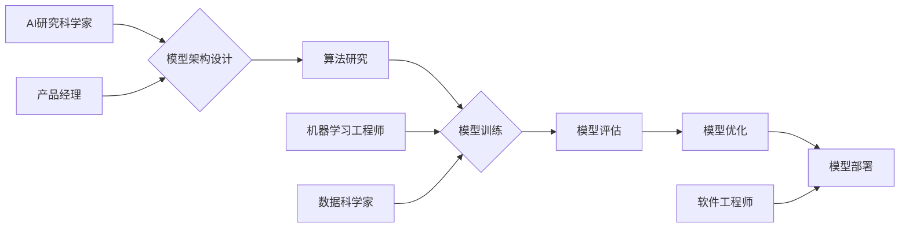

> AI大模型，技术团队，创业，人才招聘，团队建设，技术架构，项目管理，沟通协作

## 1. 背景介绍

近年来，人工智能（AI）技术蓬勃发展，特别是大模型的涌现，为各行各业带来了革命性的变革。从自然语言处理到计算机视觉，从药物研发到金融预测，AI大模型正在深刻地改变着我们的生活和工作方式。

在这个充满机遇和挑战的时代，许多创业者看到了AI大模型的巨大潜力，纷纷涌入这个领域。然而，构建一个成功的AI大模型创业公司并不容易，它需要一个强大的技术团队来支撑。

## 2. 核心概念与联系

**2.1 AI大模型的定义**

AI大模型是指在海量数据上训练，拥有庞大参数规模的深度学习模型。它们能够学习复杂的模式和关系，并应用于各种下游任务，例如文本生成、图像识别、语音合成等。

**2.2 技术团队的构成**

一个成功的AI大模型创业团队通常由以下几个关键角色组成：

* **AI研究科学家:** 负责模型的架构设计、算法研究和性能优化。
* **机器学习工程师:** 负责模型的训练、评估和部署。
* **数据科学家:** 负责数据收集、清洗、预处理和分析。
* **软件工程师:** 负责开发模型的应用系统和API接口。
* **产品经理:** 负责产品规划、市场调研和用户需求分析。

**2.3 团队建设与协作**

团队建设是AI大模型创业的关键。一个高效的团队需要良好的沟通协作机制、清晰的职责分工和共同的目标。

**Mermaid 流程图**



## 3. 核心算法原理 & 具体操作步骤

**3.1 算法原理概述**

深度学习是AI大模型的核心算法之一。它通过多层神经网络来模拟人类大脑的学习过程，能够学习复杂的非线性关系。常见的深度学习算法包括卷积神经网络（CNN）、循环神经网络（RNN）和Transformer等。

**3.2 算法步骤详解**

1. **数据预处理:** 将原始数据清洗、转换和格式化，使其适合模型训练。
2. **模型构建:** 根据任务需求选择合适的深度学习算法，并设计模型的架构。
3. **模型训练:** 使用训练数据训练模型，调整模型参数，使其能够准确地预测目标输出。
4. **模型评估:** 使用测试数据评估模型的性能，例如准确率、召回率和F1-score等。
5. **模型优化:** 根据评估结果，调整模型参数或架构，提高模型性能。
6. **模型部署:** 将训练好的模型部署到生产环境中，用于实际应用。

**3.3 算法优缺点**

**优点:**

* 能够学习复杂的非线性关系。
* 性能优于传统机器学习算法。
* 可应用于多种下游任务。

**缺点:**

* 需要海量数据进行训练。
* 计算资源消耗大。
* 模型解释性差。

**3.4 算法应用领域**

深度学习算法广泛应用于以下领域：

* 自然语言处理：文本分类、情感分析、机器翻译等。
* 计算机视觉：图像识别、目标检测、图像分割等。
* 语音识别：语音转文本、语音合成等。
* 医疗诊断：疾病预测、影像分析等。
* 金融预测：风险评估、欺诈检测等。

## 4. 数学模型和公式 & 详细讲解 & 举例说明

**4.1 数学模型构建**

深度学习模型本质上是一个复杂的数学模型，其核心是神经网络。神经网络由多个层组成，每一层包含多个神经元。每个神经元接收来自上一层的输入，并通过激活函数进行处理，输出到下一层。

**4.2 公式推导过程**

神经网络的训练过程是通过反向传播算法来实现的。反向传播算法的核心是计算模型输出与真实值的误差，并根据误差反向传播，调整每个神经元的权重和偏置，使得模型输出更接近真实值。

**4.3 案例分析与讲解**

例如，在图像识别任务中，我们可以使用卷积神经网络（CNN）作为模型。CNN的结构包含多个卷积层、池化层和全连接层。卷积层负责提取图像特征，池化层负责降低特征维度，全连接层负责分类。

**4.3.1 卷积层公式**

```latex
y_{ij} = f(\sum_{m=0}^{M-1} \sum_{n=0}^{N-1} x_{i+m,j+n} * w_{m,n} + b)
```

其中：

* $y_{ij}$ 是卷积层的输出特征图上的元素。
* $x_{i+m,j+n}$ 是输入图像的像素值。
* $w_{m,n}$ 是卷积核的权重。
* $b$ 是卷积层的偏置。
* $f$ 是激活函数。

**4.3.2 池化层公式**

```latex
y_{ij} = max(x_{i*s,j*s}, x_{i*s,j*s+1}, ..., x_{i*s+s-1,j*s+s-1})
```

其中：

* $y_{ij}$ 是池化层的输出特征图上的元素。
* $x_{i*s,j*s}$ 是输入特征图上的元素。
* $s$ 是池化窗口的大小。

## 5. 项目实践：代码实例和详细解释说明

**5.1 开发环境搭建**

* 操作系统：Linux或macOS
* Python版本：3.7或更高版本
* 深度学习框架：TensorFlow或PyTorch
* 其他工具：Git、Jupyter Notebook

**5.2 源代码详细实现**

以下是一个使用TensorFlow构建简单的图像分类模型的代码示例：

```python
import tensorflow as tf

# 定义模型架构
model = tf.keras.models.Sequential([
    tf.keras.layers.Conv2D(32, (3, 3), activation='relu', input_shape=(28, 28, 1)),
    tf.keras.layers.MaxPooling2D((2, 2)),
    tf.keras.layers.Conv2D(64, (3, 3), activation='relu'),
    tf.keras.layers.MaxPooling2D((2, 2)),
    tf.keras.layers.Flatten(),
    tf.keras.layers.Dense(10, activation='softmax')
])

# 编译模型
model.compile(optimizer='adam',
              loss='sparse_categorical_crossentropy',
              metrics=['accuracy'])

# 训练模型
model.fit(x_train, y_train, epochs=5)

# 评估模型
loss, accuracy = model.evaluate(x_test, y_test)
print('Test loss:', loss)
print('Test accuracy:', accuracy)
```

**5.3 代码解读与分析**

这段代码定义了一个简单的卷积神经网络模型，用于图像分类任务。模型包含两个卷积层、两个池化层、一个全连接层和一个softmax输出层。

* 卷积层负责提取图像特征。
* 池化层负责降低特征维度。
* 全连接层负责分类。
* softmax输出层将输出转换为概率分布。

**5.4 运行结果展示**

训练完成后，我们可以使用测试数据评估模型的性能。

## 6. 实际应用场景

**6.1 自然语言处理**

* 文本分类：例如垃圾邮件过滤、情感分析、新闻主题分类等。
* 机器翻译：将一种语言翻译成另一种语言。
* 文本生成：例如自动写作、聊天机器人、代码生成等。

**6.2 计算机视觉**

* 图像识别：例如人脸识别、物体检测、场景理解等。
* 图像分割：将图像分割成不同的区域。
* 视频分析：例如动作识别、视频摘要等。

**6.3 其他领域**

* 医疗诊断：例如疾病预测、影像分析、药物研发等。
* 金融预测：例如风险评估、欺诈检测、股票预测等。
* 自动驾驶：例如道路场景理解、目标检测、路径规划等。

**6.4 未来应用展望**

AI大模型的应用场景还在不断扩展，未来将更加广泛地应用于各个领域，例如：

* 个性化教育：根据学生的学习情况提供个性化的学习方案。
* 智能家居：通过语音控制和图像识别，实现智能家居的自动化。
* 医疗保健：提供更精准的诊断和治疗方案。
* 科学研究：加速科学发现和技术创新。

## 7. 工具和资源推荐

**7.1 学习资源推荐**

* **书籍:**
    * 深度学习 (Deep Learning) - Ian Goodfellow, Yoshua Bengio, Aaron Courville
    * 构建深度学习模型 (Hands-On Machine Learning with Scikit-Learn, Keras & TensorFlow) - Aurélien Géron
* **在线课程:**
    * TensorFlow 官方教程: https://www.tensorflow.org/tutorials
    * PyTorch 官方教程: https://pytorch.org/tutorials/
    * Coursera 深度学习课程: https://www.coursera.org/specializations/deep-learning

**7.2 开发工具推荐**

* **深度学习框架:** TensorFlow, PyTorch, Keras
* **数据处理工具:** Pandas, NumPy
* **可视化工具:** Matplotlib, Seaborn

**7.3 相关论文推荐**

* Attention Is All You Need (Transformer模型)
* ImageNet Classification with Deep Convolutional Neural Networks
* Deep Residual Learning for Image Recognition

## 8. 总结：未来发展趋势与挑战

**8.1 研究成果总结**

近年来，AI大模型取得了显著的进展，在各种任务上都取得了优异的性能。

**8.2 未来发展趋势**

* 模型规模的进一步扩大
* 模型训练效率的提升
* 模型解释性和可解释性的增强
* 模型的泛化能力和鲁棒性的提高
* 模型的安全性、公平性和可控性的研究

**8.3 面临的挑战**

* 数据获取和隐私保护
* 计算资源的限制
* 模型的解释性和可控性
* 模型的公平性和偏见问题
* 伦理和社会影响

**8.4 研究展望**

未来，AI大模型的研究将继续朝着更强大、更安全、更可解释的方向发展。


## 9. 附录：常见问题与解答

**9.1 如何选择合适的深度学习框架？**

TensorFlow 和 PyTorch 是目前最流行的深度学习框架，各有优缺点。TensorFlow 更适合于生产环境部署，PyTorch 更灵活易用，适合于研究和开发。

**9.2 如何处理过拟合问题？**

过拟合是指模型在训练数据上表现很好，但在测试数据上表现较差。常用的解决方法包括：

* 增加训练数据量
* 使用正则化技术
* 使用 dropout 技巧
* 使用交叉验证

**9.3 如何评估模型性能？**

常用的模型性能评估指标包括：

* 准确率
* 召回率
* F1-score
* AUC

选择合适的评估指标取决于具体的任务和数据特点。


作者：禅与计算机程序设计艺术 / Zen and the Art of Computer Programming 
<end_of_turn>