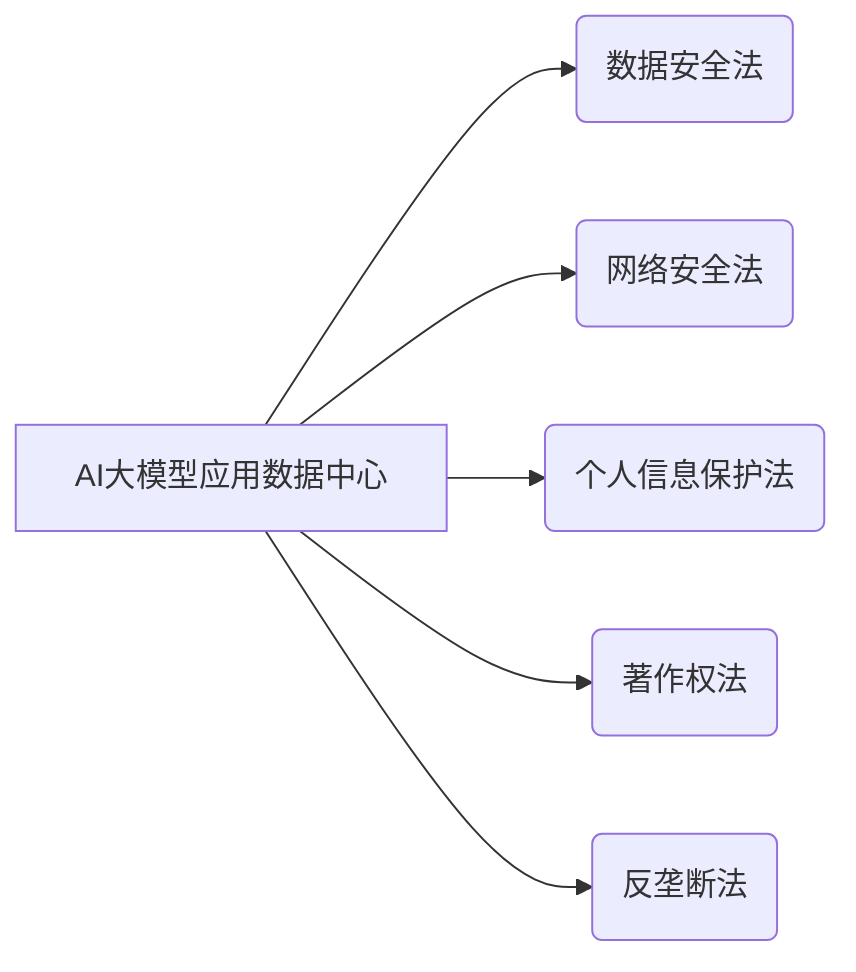

> AI大模型、数据中心、法律法规、伦理规范、数据安全、隐私保护、知识产权、监管政策、合规性

## 1. 背景介绍

近年来，人工智能（AI）技术蓬勃发展，特别是大模型的涌现，为各行各业带来了革命性的变革。AI大模型的强大能力使其能够处理海量数据，学习复杂模式，并生成高质量的文本、图像、音频等内容。然而，大模型的应用也带来了新的挑战，其中法律法规和伦理规范问题尤为突出。

随着AI大模型应用的普及，其数据中心也成为重要的基础设施。这些数据中心存储着海量训练数据和模型参数，涉及到个人隐私、商业机密等敏感信息。因此，建立完善的法律法规体系，规范AI大模型应用数据中心的运营，保障数据安全和用户权益，至关重要。

## 2. 核心概念与联系

**2.1 AI大模型应用数据中心**

AI大模型应用数据中心是指专门用于存储、处理和管理AI大模型训练数据和模型参数的计算资源集群。它通常由高性能计算节点、存储系统、网络设备等组成，并配备专业的管理和监控系统。

**2.2 相关法律法规**

* **数据安全法:** 规定了个人信息和重要数据安全的收集、使用、存储、传输等方面的规则，旨在保护数据主体权益。
* **网络安全法:** 规定了网络安全保护的原则、责任和措施，旨在维护网络安全和稳定。
* **个人信息保护法:** 规定了个人信息的收集、使用、存储、传输等方面的规则，旨在保护个人信息安全和隐私。
* **著作权法:** 规定了对作品的著作权保护，包括对AI生成内容的著作权归属问题。
* **反垄断法:** 规定了禁止垄断行为，防止AI大模型应用数据中心形成垄断地位。

**2.3 核心概念关系图**



## 3. 核心算法原理 & 具体操作步骤

**3.1 算法原理概述**

AI大模型的训练通常采用深度学习算法，例如Transformer、BERT等。这些算法通过多层神经网络结构，学习数据中的复杂模式和关系，从而实现对文本、图像、音频等数据的理解和生成。

**3.2 算法步骤详解**

1. **数据预处理:** 将原始数据清洗、格式化、编码等，使其适合模型训练。
2. **模型构建:** 根据任务需求，选择合适的深度学习模型架构，并设置模型参数。
3. **模型训练:** 使用训练数据，通过反向传播算法，调整模型参数，使其能够准确预测或生成目标输出。
4. **模型评估:** 使用测试数据，评估模型的性能，例如准确率、召回率、F1-score等。
5. **模型部署:** 将训练好的模型部署到生产环境，用于实际应用。

**3.3 算法优缺点**

* **优点:** 能够学习复杂模式，实现高精度预测和生成。
* **缺点:** 训练数据量大，计算资源消耗高，容易出现过拟合问题。

**3.4 算法应用领域**

* **自然语言处理:** 文本分类、情感分析、机器翻译、对话系统等。
* **计算机视觉:** 图像识别、物体检测、图像生成等。
* **语音识别:** 语音转文本、语音合成等。
* **推荐系统:** 商品推荐、内容推荐等。

## 4. 数学模型和公式 & 详细讲解 & 举例说明

**4.1 数学模型构建**

深度学习模型通常采用神经网络结构，其核心是激活函数和权重参数。激活函数用于引入非线性，使模型能够学习复杂模式。权重参数决定了神经网络的输出，通过训练过程不断调整，使其能够最小化预测误差。

**4.2 公式推导过程**

深度学习模型的训练过程基于梯度下降算法，其目标是找到最优的权重参数，使得模型的预测误差最小。梯度下降算法通过计算误差对权重参数的梯度，并根据梯度方向更新权重参数，逐步逼近最优解。

**4.3 案例分析与讲解**

例如，在图像分类任务中，深度学习模型会将图像输入到神经网络中，经过多层卷积和池化操作，提取图像特征。然后，将特征输入到全连接层，进行分类预测。模型的损失函数通常采用交叉熵损失函数，其目标是使模型的预测概率与真实标签尽可能接近。

**4.4 数学公式示例**

* **激活函数:** sigmoid函数

$$
f(x) = \frac{1}{1 + e^{-x}}
$$

* **损失函数:** 交叉熵损失函数

$$
L = -\sum_{i=1}^{N} y_i \log(p_i)
$$

其中，$y_i$为真实标签，$p_i$为模型预测概率。

## 5. 项目实践：代码实例和详细解释说明

**5.1 开发环境搭建**

使用Python语言和深度学习框架TensorFlow或PyTorch搭建开发环境。

**5.2 源代码详细实现**

```python
import tensorflow as tf

# 定义模型结构
model = tf.keras.models.Sequential([
    tf.keras.layers.Conv2D(32, (3, 3), activation='relu', input_shape=(28, 28, 1)),
    tf.keras.layers.MaxPooling2D((2, 2)),
    tf.keras.layers.Conv2D(64, (3, 3), activation='relu'),
    tf.keras.layers.MaxPooling2D((2, 2)),
    tf.keras.layers.Flatten(),
    tf.keras.layers.Dense(10, activation='softmax')
])

# 编译模型
model.compile(optimizer='adam',
              loss='sparse_categorical_crossentropy',
              metrics=['accuracy'])

# 训练模型
model.fit(x_train, y_train, epochs=5)

# 评估模型
loss, accuracy = model.evaluate(x_test, y_test)
print('Test loss:', loss)
print('Test accuracy:', accuracy)
```

**5.3 代码解读与分析**

这段代码定义了一个简单的卷积神经网络模型，用于手写数字识别任务。模型包含两层卷积层、两层池化层、一层全连接层和softmax激活函数。模型使用Adam优化器、交叉熵损失函数和准确率作为评估指标。

**5.4 运行结果展示**

训练完成后，模型可以用于预测新的手写数字图像。

## 6. 实际应用场景

**6.1 医疗诊断:** AI大模型可以辅助医生诊断疾病，例如分析医学影像、预测患者风险等。

**6.2 金融风险控制:** AI大模型可以用于识别金融欺诈、评估信用风险等。

**6.3 智能客服:** AI大模型可以构建智能客服系统，自动回答用户问题、提供个性化服务等。

**6.4 自动驾驶:** AI大模型可以用于感知环境、规划路径、控制车辆等，推动自动驾驶技术发展。

**6.5 未来应用展望**

AI大模型的应用场景还在不断扩展，未来将更加广泛地应用于各个领域，例如教育、娱乐、科研等。

## 7. 工具和资源推荐

**7.1 学习资源推荐**

* **深度学习课程:** Coursera、edX、Udacity等平台提供丰富的深度学习课程。
* **深度学习书籍:** 《深度学习》、《动手学深度学习》等书籍。
* **开源代码库:** TensorFlow、PyTorch等开源深度学习框架。

**7.2 开发工具推荐**

* **Python语言:** 深度学习开发的主要语言。
* **深度学习框架:** TensorFlow、PyTorch等框架。
* **云计算平台:** AWS、Azure、GCP等云平台提供深度学习服务。

**7.3 相关论文推荐**

* **Attention Is All You Need:** https://arxiv.org/abs/1706.03762
* **BERT: Pre-training of Deep Bidirectional Transformers for Language Understanding:** https://arxiv.org/abs/1810.04805

## 8. 总结：未来发展趋势与挑战

**8.1 研究成果总结**

近年来，AI大模型取得了显著进展，在多个领域展现出强大的应用潜力。

**8.2 未来发展趋势**

* **模型规模和能力提升:** 未来将出现更大规模、更强大的AI大模型。
* **模型泛化能力增强:** 提高模型在不同领域和任务上的泛化能力。
* **模型解释性和可解释性提升:** 增强模型的透明度和可解释性，提高用户信任度。

**8.3 面临的挑战**

* **数据安全和隐私保护:** 确保AI大模型训练数据和模型参数的安全性和隐私性。
* **算法偏见和公平性:** 避免AI大模型算法产生偏见和歧视。
* **伦理规范和社会影响:** 关注AI大模型的伦理规范和社会影响，确保其安全、可控和可持续发展。

**8.4 研究展望**

未来研究将重点关注AI大模型的安全性、可靠性、可解释性和伦理规范等方面，推动AI技术朝着更加安全、可控、可持续的方向发展。

## 9. 附录：常见问题与解答

**9.1 如何保护AI大模型训练数据和模型参数的安全？**

* 使用加密技术保护数据和模型参数。
* 采用身份验证和授权机制，控制对数据的访问权限。
* 定期备份数据和模型参数，防止数据丢失。

**9.2 如何避免AI大模型算法产生偏见和歧视？**

* 使用多样化的训练数据，减少数据偏差。
* 采用公平性评估指标，监测模型的公平性。
* 开发可解释的AI模型，帮助识别和解决算法偏见。

**9.3 如何确保AI大模型的伦理规范和社会影响？**

* 制定相关的法律法规和伦理规范，指导AI技术发展。
* 加强公众对AI技术的认知和参与，促进社会共识。
* 建立AI技术监督机制，确保AI技术安全、可控和可持续发展。


作者：禅与计算机程序设计艺术 / Zen and the Art of Computer Programming 
<end_of_turn>