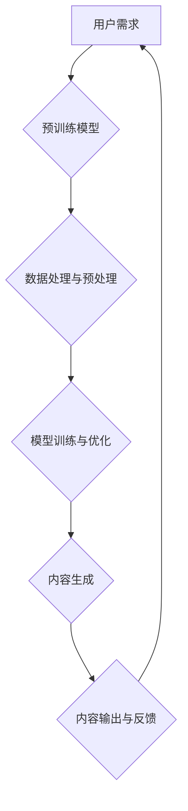

> AIGC, 文本生成, 图像生成, 代码生成, 深度学习, Transformer, 

## 1. 背景介绍

近年来，人工智能（AI）技术取得了飞速发展，特别是深度学习的突破，使得人工智能在各个领域展现出强大的应用潜力。其中，AIGC（人工智能生成内容）作为人工智能发展的重要方向之一，引起了广泛关注。AIGC是指利用人工智能技术自动生成各种类型的内容，例如文本、图像、音频、视频等。

AIGC技术能够帮助人们更高效地创作内容，解放人力资源，并为人们提供更加个性化、智能化的体验。例如，AIGC可以帮助作家创作小说，帮助设计师生成设计稿，帮助程序员编写代码，甚至可以帮助人们创作音乐和绘画作品。

## 2. 核心概念与联系

AIGC的核心概念包括：

* **深度学习:** AIGC技术的基础是深度学习算法，特别是Transformer模型。Transformer模型能够学习语言的复杂结构和语义关系，从而生成高质量的文本内容。
* **生成模型:** 生成模型是AIGC的核心技术之一，它能够从训练数据中学习到数据的分布规律，并根据这些规律生成新的数据。常见的生成模型包括：
    * **GAN (Generative Adversarial Networks):** 
    * **VAEs (Variational Autoencoders):** 
    * **Transformer-based models:** 
* **预训练模型:** 预训练模型是在海量数据上预先训练好的模型，它已经掌握了大量的语言知识和模式，可以用于各种下游任务，例如文本生成、机器翻译、问答系统等。

**AIGC技术架构**



## 3. 核心算法原理 & 具体操作步骤

### 3.1  算法原理概述

AIGC的核心算法原理是基于深度学习的生成模型，例如Transformer模型。Transformer模型通过自注意力机制学习语言的上下文关系，并利用编码器-解码器结构生成新的文本内容。

### 3.2  算法步骤详解

1. **数据预处理:** 收集和清洗训练数据，并将其转换为模型可识别的格式。
2. **模型训练:** 使用深度学习算法训练Transformer模型，使其能够学习语言的语法和语义规则。
3. **文本生成:** 将用户输入的文本作为解码器的输入，模型根据训练数据和输入文本生成新的文本内容。
4. **结果输出:** 将生成的文本内容输出给用户。

### 3.3  算法优缺点

**优点:**

* **生成高质量的文本内容:** Transformer模型能够学习语言的复杂结构和语义关系，生成更加自然、流畅的文本内容。
* **可扩展性强:** Transformer模型可以很容易地扩展到处理更长的文本序列和更大的数据集。
* **参数共享:** Transformer模型的参数共享机制可以有效地减少模型参数量，提高训练效率。

**缺点:**

* **训练成本高:** 训练Transformer模型需要大量的计算资源和时间。
* **数据依赖性强:** Transformer模型的性能取决于训练数据的质量和数量。
* **可解释性差:** Transformer模型的内部工作机制比较复杂，难以解释其生成文本的具体过程。

### 3.4  算法应用领域

AIGC技术在各个领域都有广泛的应用，例如：

* **内容创作:** 自动生成新闻报道、小说、诗歌、剧本等。
* **机器翻译:** 将文本从一种语言翻译成另一种语言。
* **聊天机器人:** 与用户进行自然语言对话。
* **代码生成:** 自动生成代码片段或完整的程序。
* **数据分析:** 从文本数据中提取关键信息和洞察。

## 4. 数学模型和公式 & 详细讲解 & 举例说明

### 4.1  数学模型构建

Transformer模型的核心是自注意力机制和多头注意力机制。

**自注意力机制:**

自注意力机制能够计算每个词与其他词之间的相关性，从而学习语言的上下文关系。

**公式:**

$$
Attention(Q, K, V) = softmax(\frac{QK^T}{\sqrt{d_k}})V
$$

其中：

* $Q$：查询矩阵
* $K$：键矩阵
* $V$：值矩阵
* $d_k$：键向量的维度

**多头注意力机制:**

多头注意力机制是将多个自注意力机制并行执行，并将其结果进行融合，从而学习到更丰富的上下文信息。

**公式:**

$$
MultiHeadAttention(Q, K, V) = Concat(head_1, head_2, ..., head_h)W^O
$$

其中：

* $head_i$：第 $i$ 个自注意力头的输出
* $h$：注意力头的数量
* $W^O$：最终输出层的权重矩阵

### 4.2  公式推导过程

自注意力机制的公式推导过程如下：

1. 将查询矩阵 $Q$、键矩阵 $K$ 和值矩阵 $V$ 转换为相同维度。
2. 计算 $Q$ 和 $K$ 的点积，并进行归一化处理，得到注意力权重矩阵。
3. 将注意力权重矩阵与值矩阵 $V$ 进行加权求和，得到自注意力机制的输出。

### 4.3  案例分析与讲解

例如，在机器翻译任务中，Transformer模型可以将源语言文本编码成向量表示，然后利用自注意力机制学习源语言和目标语言之间的对应关系，最后将目标语言的向量表示解码成目标语言文本。

## 5. 项目实践：代码实例和详细解释说明

### 5.1  开发环境搭建

* Python 3.7+
* PyTorch 1.7+
* CUDA 10.2+

### 5.2  源代码详细实现

```python
import torch
import torch.nn as nn

class Transformer(nn.Module):
    def __init__(self, vocab_size, embedding_dim, num_heads, num_layers):
        super(Transformer, self).__init__()
        self.embedding = nn.Embedding(vocab_size, embedding_dim)
        self.transformer_layers = nn.ModuleList([
            nn.TransformerEncoderLayer(embedding_dim, num_heads)
            for _ in range(num_layers)
        ])
        self.linear = nn.Linear(embedding_dim, vocab_size)

    def forward(self, x):
        x = self.embedding(x)
        for layer in self.transformer_layers:
            x = layer(x)
        x = self.linear(x)
        return x
```

### 5.3  代码解读与分析

* `__init__` 方法初始化模型参数，包括词嵌入层、Transformer编码器层和输出层。
* `forward` 方法定义模型的正向传播过程，将输入序列编码成向量表示，并输出预测的下一个词的概率分布。

### 5.4  运行结果展示

运行上述代码，可以训练一个简单的Transformer模型，并进行文本生成任务。

## 6. 实际应用场景

### 6.1  新闻报道生成

AIGC可以自动生成新闻报道，例如从新闻稿件中提取关键信息，并自动生成新闻标题、摘要和正文。

### 6.2  小说创作辅助

AIGC可以帮助作家创作小说，例如生成情节、人物对话和场景描述。

### 6.3  代码生成工具

AIGC可以生成代码片段或完整的程序，例如根据用户需求生成Python代码、Java代码等。

### 6.4  未来应用展望

AIGC技术在未来将有更广泛的应用，例如：

* **个性化教育:** 根据学生的学习进度和需求生成个性化的学习内容。
* **虚拟助手:** 更智能、更自然的虚拟助手，能够理解用户的自然语言指令并提供更精准的帮助。
* **创意内容生成:** 帮助艺术家、设计师等创意工作者生成新的创意内容。

## 7. 工具和资源推荐

### 7.1  学习资源推荐

* **论文:**
    * "Attention Is All You Need"
    * "BERT: Pre-training of Deep Bidirectional Transformers for Language Understanding"
* **博客:**
    * Jay Alammar's Blog
    * Hugging Face Blog

### 7.2  开发工具推荐

* **PyTorch:** 深度学习框架
* **TensorFlow:** 深度学习框架
* **Hugging Face Transformers:** 预训练模型库

### 7.3  相关论文推荐

* "Generative Pre-trained Transformer 2"
* "T5: Text-to-Text Transfer Transformer"
* "GPT-3: Language Models are Few-Shot Learners"

## 8. 总结：未来发展趋势与挑战

### 8.1  研究成果总结

AIGC技术取得了显著进展，能够生成高质量的文本、图像、音频等内容。

### 8.2  未来发展趋势

* **模型规模和能力提升:** 未来AIGC模型将更加强大，能够处理更复杂的任务，生成更逼真的内容。
* **多模态生成:** AIGC将融合多模态数据，例如文本、图像、音频等，生成更加丰富和沉浸式的体验。
* **个性化定制:** AIGC将更加注重个性化定制，根据用户的需求生成更加符合其口味和偏好的内容。

### 8.3  面临的挑战

* **数据安全和隐私:** AIGC模型的训练需要大量数据，如何保证数据安全和隐私是一个重要挑战。
* **内容质量和可控性:** AIGC生成的內容可能存在偏差、错误或不准确的情况，如何保证内容质量和可控性是一个需要解决的问题。
* **伦理和社会影响:** AIGC技术可能带来一些伦理和社会问题，例如内容造假、信息操控等，需要进行深入的探讨和研究。

### 8.4  研究展望

未来AIGC技术将继续发展，为人们带来更多便利和惊喜。我们需要加强对AIGC技术的研究和探索，并积极应对其带来的挑战，确保其健康、可持续发展。

## 9. 附录：常见问题与解答

**Q1: AIGC技术与传统内容创作有什么区别？**

**A1:** AIGC技术利用人工智能自动生成内容，而传统内容创作则需要人工创作。AIGC可以提高内容创作效率，但仍然需要人工进行内容审核和修改。

**Q2: AIGC技术是否会取代人类内容创作者？**

**A2:** AIGC技术可以辅助人类内容创作者，但不会完全取代他们。人类仍然需要发挥创造力和审美能力，为内容创作提供方向和指导。

**Q3: 如何评估AIGC生成的內容质量？**

**A3:** AIGC生成的內容质量可以从多个方面进行评估，例如流畅度、准确性、原创性、实用性等。

**Q4: AIGC技术有哪些伦理和社会问题？**

**A4:** AIGC技术可能带来一些伦理和社会问题，例如内容造假、信息操控、就业影响等，需要进行深入的探讨和研究。


作者：禅与计算机程序设计艺术 / Zen and the Art of Computer Programming 
<end_of_turn>