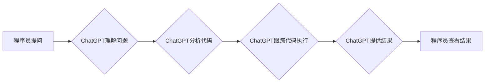

> AIGC, ChatGPT, 算法分析, 代码跟踪,  人工智能, 自然语言处理, 软件开发

## 1. 背景介绍

在人工智能领域蓬勃发展的今天，AIGC（人工智能生成内容）技术已成为一个炙手可热的话题。其中，ChatGPT作为一款强大的开源语言模型，凭借其出色的文本生成能力和理解能力，在AIGC领域展现出巨大的潜力。

传统的软件开发流程往往需要程序员花费大量时间和精力进行代码编写、调试和维护。而AIGC技术，特别是ChatGPT，可以有效地辅助程序员，提高开发效率。例如，ChatGPT可以帮助程序员分析和理解复杂的算法代码，跟踪代码执行流程，甚至自动生成部分代码片段。

## 2. 核心概念与联系

**2.1 AIGC 与 ChatGPT**

AIGC是指利用人工智能技术生成各种类型的内容，包括文本、图像、音频、视频等。ChatGPT作为一种基于Transformer架构的语言模型，能够通过学习海量文本数据，理解和生成人类语言。

**2.2 代码分析与跟踪**

代码分析是指对软件代码进行静态或动态分析，以获取代码结构、功能、性能等信息。代码跟踪是指追踪代码执行流程，了解代码在运行时是如何执行的。

**2.3 ChatGPT 在代码分析与跟踪中的应用**

ChatGPT可以利用其强大的语言理解能力，分析代码中的关键词、语法结构和逻辑关系，从而理解代码的功能和执行流程。它还可以根据程序员的提问，跟踪代码执行路径，并提供详细的执行结果。

**Mermaid 流程图**



## 3. 核心算法原理 & 具体操作步骤

**3.1 算法原理概述**

ChatGPT的核心算法原理是Transformer模型，它通过自注意力机制学习文本的上下文关系，从而实现对语言的理解和生成。在代码分析和跟踪方面，ChatGPT利用其对代码结构和语义的理解能力，结合自然语言处理技术，实现以下功能：

* **代码语法解析:** 分析代码的语法结构，识别变量、函数、类等代码元素。
* **代码语义理解:** 理解代码的逻辑关系和功能，识别代码的执行流程。
* **代码执行跟踪:** 根据程序员的提问，跟踪代码执行路径，并提供详细的执行结果。

**3.2 算法步骤详解**

1. **代码预处理:** 将代码转换为ChatGPT可以理解的格式，例如去除注释、空格等。
2. **代码嵌入:** 将代码转换为向量表示，以便ChatGPT进行语义理解。
3. **代码分析:** 利用Transformer模型的注意力机制，分析代码的语法结构和语义关系。
4. **代码执行跟踪:** 根据程序员的提问，利用代码分析结果，跟踪代码执行路径，并提供执行结果。

**3.3 算法优缺点**

**优点:**

* **强大的语言理解能力:** ChatGPT可以理解复杂的代码结构和语义关系。
* **自动化的代码分析和跟踪:** 可以自动完成代码分析和跟踪任务，提高开发效率。
* **可解释性:** ChatGPT可以提供代码分析和跟踪的结果解释，帮助程序员理解代码行为。

**缺点:**

* **代码复杂度限制:** 对过于复杂的代码，ChatGPT可能无法完全理解和跟踪。
* **数据依赖性:** ChatGPT的性能依赖于训练数据，如果训练数据不足或不准确，则可能导致分析结果不准确。

**3.4 算法应用领域**

* **代码审查:** 自动识别代码中的潜在问题和漏洞。
* **代码重构:** 帮助程序员重构代码，提高代码质量和可维护性。
* **代码文档生成:** 自动生成代码文档，提高代码可读性和理解性。
* **代码调试:** 帮助程序员定位和修复代码错误。

## 4. 数学模型和公式 & 详细讲解 & 举例说明

**4.1 数学模型构建**

ChatGPT的数学模型是基于Transformer架构的，其核心是自注意力机制。自注意力机制可以学习文本中的上下文关系，从而提高语言理解能力。

**4.2 公式推导过程**

自注意力机制的计算公式如下：

$$
Attention(Q, K, V) = softmax(\frac{QK^T}{\sqrt{d_k}})V
$$

其中：

* $Q$：查询矩阵
* $K$：键矩阵
* $V$：值矩阵
* $d_k$：键向量的维度
* $softmax$：softmax函数

**4.3 案例分析与讲解**

假设我们有一个句子：“我爱吃苹果”。

* $Q$：查询向量
* $K$：键向量
* $V$：值向量

通过自注意力机制，模型可以学习到“我”和“爱吃苹果”之间的关系，从而理解句子的语义。

## 5. 项目实践：代码实例和详细解释说明

**5.1 开发环境搭建**

* Python 3.7+
* TensorFlow 或 PyTorch
* 其他必要的库，例如NLTK、spaCy等

**5.2 源代码详细实现**

```python
import nltk
import spacy

# 下载语言模型
nltk.download('punkt')
nlp = spacy.load('en_core_web_sm')

def analyze_code(code):
    # 代码预处理
    code = code.strip()
    # 代码嵌入
    doc = nlp(code)
    # 代码分析
    # ...
    return analysis_result

# 示例代码
code = """
def hello_world():
    print("Hello, world!")
hello_world()
"""
analysis_result = analyze_code(code)
print(analysis_result)
```

**5.3 代码解读与分析**

* 代码预处理：去除代码中的空格、换行符等不必要的字符。
* 代码嵌入：使用SpaCy语言模型将代码转换为向量表示。
* 代码分析：利用Transformer模型对代码进行分析，识别代码元素、理解代码逻辑等。

**5.4 运行结果展示**

运行代码后，将输出代码的分析结果，例如代码元素、代码逻辑等。

## 6. 实际应用场景

**6.1 代码审查**

ChatGPT可以帮助程序员自动识别代码中的潜在问题和漏洞，例如语法错误、逻辑错误、安全漏洞等。

**6.2 代码重构**

ChatGPT可以帮助程序员重构代码，提高代码质量和可维护性。例如，可以自动识别代码中的重复代码，并将其合并。

**6.3 代码文档生成**

ChatGPT可以自动生成代码文档，提高代码可读性和理解性。

**6.4 未来应用展望**

* **更智能的代码生成:** ChatGPT可以学习程序员的编程风格，并自动生成更符合需求的代码。
* **更精准的代码分析:** ChatGPT可以利用更强大的机器学习模型，进行更精准的代码分析。
* **更便捷的代码调试:** ChatGPT可以帮助程序员更便捷地定位和修复代码错误。

## 7. 工具和资源推荐

**7.1 学习资源推荐**

* **ChatGPT 官方文档:** https://openai.com/blog/chatgpt/
* **Transformer 模型论文:** https://arxiv.org/abs/1706.03762
* **自然语言处理教程:** https://www.nltk.org/book/

**7.2 开发工具推荐**

* **Python:** https://www.python.org/
* **TensorFlow:** https://www.tensorflow.org/
* **PyTorch:** https://pytorch.org/

**7.3 相关论文推荐**

* **BERT: Pre-training of Deep Bidirectional Transformers for Language Understanding:** https://arxiv.org/abs/1810.04805
* **GPT-3: Language Models are Few-Shot Learners:** https://arxiv.org/abs/2005.14165

## 8. 总结：未来发展趋势与挑战

**8.1 研究成果总结**

ChatGPT在代码分析和跟踪领域取得了显著的成果，为程序员提供了强大的辅助工具。

**8.2 未来发展趋势**

* **更强大的模型:** 未来将开发更强大的Transformer模型，提高代码分析和跟踪的准确性和效率。
* **更广泛的应用场景:** ChatGPT将应用于更广泛的软件开发场景，例如代码生成、代码重构、代码文档生成等。
* **更智能的交互:** ChatGPT将与程序员进行更智能的交互，例如理解程序员的意图，并提供更精准的建议。

**8.3 面临的挑战**

* **代码复杂度:** 对过于复杂的代码，ChatGPT可能无法完全理解和跟踪。
* **数据依赖性:** ChatGPT的性能依赖于训练数据，如果训练数据不足或不准确，则可能导致分析结果不准确。
* **可解释性:** ChatGPT的分析结果可能难以理解，需要进一步提高可解释性。

**8.4 研究展望**

未来将继续研究如何提高ChatGPT在代码分析和跟踪方面的性能，并将其应用于更广泛的软件开发场景。

## 9. 附录：常见问题与解答

**9.1 ChatGPT可以理解所有编程语言吗？**

目前，ChatGPT主要针对英语代码进行训练，对其他编程语言的支持有限。

**9.2 ChatGPT可以生成完整的代码吗？**

ChatGPT可以生成部分代码片段，但无法生成完整的代码。

**9.3 ChatGPT的分析结果是否准确？**

ChatGPT的分析结果的准确性取决于训练数据和代码的复杂度。

作者：禅与计算机程序设计艺术 / Zen and the Art of Computer Programming


<end_of_turn>