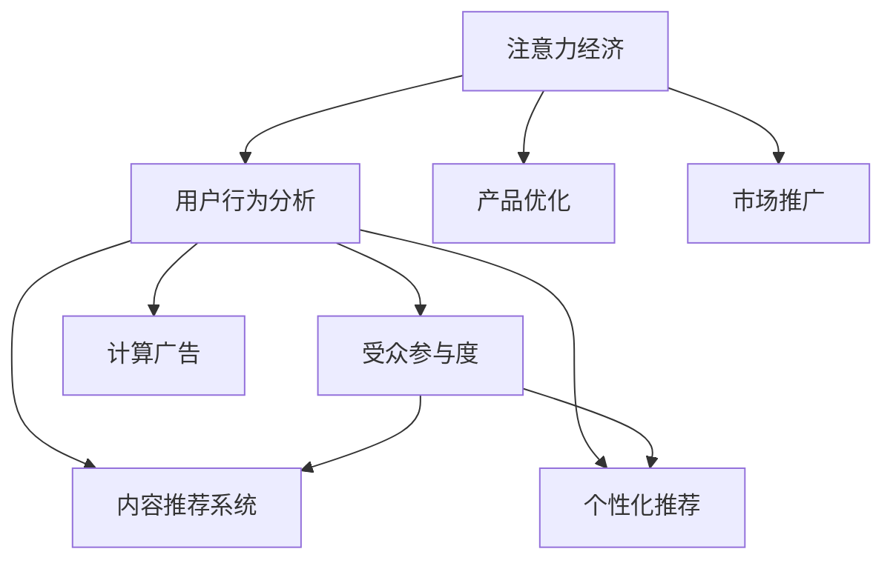

                 

# 注意力经济与用户行为分析：了解受众行为以增强参与度

> 关键词：注意力经济,用户行为分析,受众参与度,内容推荐系统,个性化推荐,参与度提升,计算广告

## 1. 背景介绍

### 1.1 问题由来

在数字化时代，注意力成为稀缺资源。随着互联网和移动设备普及，用户每天接触的信息量呈爆炸式增长，如何吸引用户注意成为关键问题。注意力经济的兴起，使得掌握用户注意力成为了商业竞争的焦点。

在注意力经济背景下，企业需要通过深入了解用户行为和兴趣，为用户提供个性化内容，从而提升用户参与度和留存率。这需要结合大数据分析、机器学习等技术，对用户行为数据进行建模和预测，进而优化产品和服务策略。

### 1.2 问题核心关键点

注意力经济的核心在于如何通过对用户注意力模式的分析，制定相应的内容策略和推广策略，以最大化用户参与和消费行为。通过精确的用户行为分析，企业可以更精准地预测用户兴趣和需求，实现内容的个性化推荐，提升用户的粘性和满意度。

## 2. 核心概念与联系

### 2.1 核心概念概述

为更好地理解注意力经济和用户行为分析，本节将介绍几个密切相关的核心概念：

- **注意力经济（Attention Economy）**：指通过获取和分配用户注意力资源，进行价值创造和商业变现的经济模式。互联网时代的信息泛滥，注意力成为稀缺资源，企业需要投入大量资源争夺用户注意力。

- **用户行为分析（User Behavior Analysis）**：指通过分析用户在互联网平台上的行为数据，了解用户兴趣、需求和行为规律，以指导产品优化和市场推广。

- **受众参与度（Audience Engagement）**：指用户对特定产品或服务内容的主动关注和互动程度，是衡量用户粘性和忠诚度的重要指标。

- **内容推荐系统（Content Recommendation System）**：利用用户行为数据，对用户可能感兴趣的内容进行预测和推荐，以提升用户参与度和满意度。

- **个性化推荐（Personalized Recommendation）**：指根据用户个性化特征，量身定制推荐内容，满足用户独特需求，提升用户体验和购买转化率。

- **计算广告（Programmatic Advertising）**：指通过程序化购买渠道，实现广告投放的精准化和自动化，提升广告效果和ROI。

这些核心概念之间的逻辑关系可以通过以下Mermaid流程图来展示：



这个流程图展示了大语言模型的核心概念及其之间的关系：

1. 注意力经济通过用户行为分析获取用户注意力，进而通过产品优化和市场推广吸引用户。
2. 用户行为分析对受众参与度、内容推荐、个性化推荐和计算广告等各个环节起到支撑作用。
3. 个性化推荐和内容推荐系统是用户行为分析的直接应用，提升用户参与度和满意度。
4. 计算广告则通过精准投放，实现高效的市场推广。

## 3. 核心算法原理 & 具体操作步骤

### 3.1 算法原理概述

用户行为分析的核心在于通过对用户行为数据的建模，预测用户未来的行为趋势。其中，建模主要使用分类和回归等机器学习算法，预测方法则包括协同过滤、矩阵分解、深度学习等。

基于用户行为数据的建模过程一般包括以下几个关键步骤：

1. 数据采集：从用户互动行为中获取有用数据，如浏览记录、点击记录、评分数据、评价数据等。
2. 数据清洗：对数据进行去噪、填补缺失值等处理，以保证模型训练数据的准确性和可靠性。
3. 特征提取：从采集的数据中提取有用的特征，如浏览时长、点击位置、评分高低等，作为模型输入。
4. 模型训练：使用机器学习算法（如随机森林、SVM、神经网络等）训练用户行为预测模型。
5. 预测评估：利用测试集评估模型的预测效果，选择最优模型进行应用。

### 3.2 算法步骤详解

以下将详细讲解基于机器学习算法进行用户行为分析的一般流程：

**Step 1: 数据准备与预处理**

1. 数据采集：从用户行为数据中提取有意义的信息，如浏览记录、评分数据、点击行为等。
2. 数据清洗：处理数据中的噪音和缺失值，保证数据完整性和准确性。
3. 特征工程：提取和构建特征，如用户ID、访问时间、浏览时长、点击位置等。

**Step 2: 模型选择与训练**

1. 选择合适的模型：根据具体应用场景选择合适的机器学习算法，如分类、回归、聚类等。
2. 特征选择：选择对模型预测性能影响大的特征。
3. 数据划分：将数据划分为训练集、验证集和测试集。
4. 模型训练：使用训练集对模型进行训练。

**Step 3: 模型评估与调优**

1. 模型评估：使用验证集对模型进行评估，选择性能最优的模型。
2. 参数调优：调整模型参数以提高性能。
3. 交叉验证：使用交叉验证方法提升模型泛化能力。

**Step 4: 预测与结果分析**

1. 模型预测：使用训练好的模型对新数据进行预测。
2. 结果分析：分析预测结果与实际行为之间的差异，发现模型不足。
3. 反馈优化：根据预测结果反馈，调整模型和特征工程策略。

### 3.3 算法优缺点

用户行为分析的算法具有以下优点：

1. 精准预测：通过深度学习和复杂模型，可以实现高精度的用户行为预测。
2. 可解释性：传统机器学习模型的结果可解释性强，易于理解和使用。
3. 快速迭代：算法简单，训练速度快，可以实时调整和优化。

然而，该算法也存在一些局限：

1. 数据依赖：模型效果高度依赖于高质量标注数据，数据获取成本高。
2. 模型复杂：复杂模型需要较高的计算资源和专业知识，难以快速部署。
3. 隐私问题：用户行为数据涉及个人隐私，数据处理需要严格遵守隐私保护法规。

### 3.4 算法应用领域

用户行为分析在多个领域都有广泛应用，以下是一些主要领域：

- **电子商务**：通过用户行为分析，推荐个性化商品，提升销售转化率。
- **内容平台**：通过分析用户对内容的操作行为，优化内容推荐策略，提升用户粘性。
- **社交媒体**：通过用户互动数据，分析用户兴趣和需求，提供个性化内容，提升用户参与度。
- **广告投放**：通过用户行为预测，实现精准广告投放，提升广告效果和ROI。
- **在线教育**：通过学生行为数据，分析学习效果和偏好，提供个性化学习建议，提升教学效果。

## 4. 数学模型和公式 & 详细讲解 & 举例说明

### 4.1 数学模型构建

用户行为分析的核心在于构建用户行为预测模型，该模型通常使用监督学习算法（如随机森林、支持向量机、神经网络等）。模型输入为用户行为特征，输出为用户行为预测结果。

以一个简单的线性回归模型为例，模型的数学公式为：

$$
\hat{y} = \theta_0 + \theta_1 x_1 + \theta_2 x_2 + \ldots + \theta_n x_n
$$

其中，$\hat{y}$表示用户行为预测结果，$\theta$为模型参数，$x$为特征向量。

### 4.2 公式推导过程

假设有一个包含$N$个用户的数据集，每个用户有$m$个行为特征$x$和一个目标行为$y$。我们的目标是训练一个线性回归模型，最小化预测值与实际值的差异。

根据最小二乘法，目标函数为：

$$
\min_{\theta} \sum_{i=1}^N (y_i - \hat{y_i})^2
$$

其中，$\hat{y_i}$为模型对第$i$个用户的预测结果，$y_i$为实际行为结果。

将目标函数对$\theta$求偏导，得：

$$
\frac{\partial \sum_{i=1}^N (y_i - \hat{y_i})^2}{\partial \theta} = -2\sum_{i=1}^N (y_i - \hat{y_i}) \frac{\partial \hat{y_i}}{\partial \theta}
$$

其中，$\frac{\partial \hat{y_i}}{\partial \theta} = x_{i1} x_{i2} \ldots x_{in}$，代入线性回归模型公式。

最终，可得梯度下降算法的迭代公式：

$$
\theta = \theta - \alpha \frac{\partial \sum_{i=1}^N (y_i - \hat{y_i})^2}{\partial \theta}
$$

其中，$\alpha$为学习率，$\theta$为模型参数，$\partial \sum_{i=1}^N (y_i - \hat{y_i})^2/\partial \theta$为梯度向量。

### 4.3 案例分析与讲解

假设我们有一份用户行为数据集，包含以下特征：用户ID、浏览时间、浏览时长、点击位置、评分。我们需要预测用户是否会购买该商品。

1. 数据准备：将数据集分为训练集和测试集，并进行特征工程，提取用户ID、浏览时间、浏览时长等特征。
2. 模型选择：选择线性回归模型作为预测模型。
3. 模型训练：使用训练集对模型进行训练，并使用交叉验证调整学习率。
4. 模型评估：使用测试集评估模型预测效果，选择最优模型。
5. 预测结果：使用训练好的模型对新用户行为数据进行预测，判断其是否会购买商品。

## 5. 项目实践：代码实例和详细解释说明

### 5.1 开发环境搭建

在进行用户行为分析的项目实践中，需要搭建一个包括数据采集、数据清洗、特征提取、模型训练、预测与结果分析的全流程开发环境。以下是使用Python进行环境配置的流程：

1. 安装Python：确保Python版本为3.6以上，下载并安装。
2. 安装必要的库：安装NumPy、Pandas、Scikit-learn、TensorFlow等库，用于数据处理和模型训练。
3. 准备数据集：收集用户行为数据，并将数据集划分为训练集和测试集。
4. 配置环境：配置虚拟环境，使用Anaconda或Virtualenv等工具，创建Python虚拟环境，安装必要的库。
5. 搭建模型：使用Scikit-learn、TensorFlow等框架搭建用户行为预测模型，并进行训练。

### 5.2 源代码详细实现

以下是一个使用Scikit-learn进行用户行为预测的Python代码实现：

```python
import numpy as np
import pandas as pd
from sklearn.linear_model import LinearRegression
from sklearn.model_selection import train_test_split
from sklearn.metrics import mean_squared_error

# 准备数据
data = pd.read_csv('user_behavior.csv')
X = data[['browsing_time', 'click_position', 'rating']]
y = data['purchase']

# 数据预处理
X = pd.get_dummies(X)

# 数据划分
X_train, X_test, y_train, y_test = train_test_split(X, y, test_size=0.2, random_state=42)

# 模型训练
model = LinearRegression()
model.fit(X_train, y_train)

# 模型评估
y_pred = model.predict(X_test)
mse = mean_squared_error(y_test, y_pred)
print(f"MSE: {mse}")

# 预测新数据
new_data = pd.DataFrame([[120, 3, 4]], columns=['browsing_time', 'click_position', 'rating'])
new_data = pd.get_dummies(new_data)
prediction = model.predict(new_data)
print(f"Prediction: {prediction}")
```

### 5.3 代码解读与分析

让我们再详细解读一下关键代码的实现细节：

**数据准备**：
- `pd.read_csv('user_behavior.csv')`：从CSV文件中读取用户行为数据。
- `X = data[['browsing_time', 'click_position', 'rating']]`：选择需要的特征。
- `y = data['purchase']`：选择目标变量。

**数据预处理**：
- `X = pd.get_dummies(X)`：使用独热编码将分类特征转换为数值型特征。

**模型训练**：
- `model = LinearRegression()`：创建线性回归模型。
- `model.fit(X_train, y_train)`：使用训练集对模型进行拟合。

**模型评估**：
- `y_pred = model.predict(X_test)`：使用测试集进行预测。
- `mse = mean_squared_error(y_test, y_pred)`：计算均方误差，评估模型性能。

**预测新数据**：
- `new_data = pd.DataFrame([[120, 3, 4]], columns=['browsing_time', 'click_position', 'rating'])`：创建新的数据样本。
- `new_data = pd.get_dummies(new_data)`：使用独热编码。
- `prediction = model.predict(new_data)`：对新数据进行预测。

可以看到，通过Scikit-learn库，可以方便地搭建、训练和评估用户行为预测模型。开发者可以将更多精力放在数据处理和特征工程上，而不必过多关注底层实现细节。

## 6. 实际应用场景

### 6.1 智能推荐系统

智能推荐系统是用户行为分析的重要应用场景之一。通过分析用户浏览记录、点击行为等数据，可以推荐用户感兴趣的商品、内容或服务。推荐系统需要实时处理大量用户数据，快速生成个性化推荐结果。

例如，电商网站可以根据用户浏览历史和购买行为，推荐相似的商品，提升用户购物体验和满意度。

### 6.2 个性化广告投放

个性化广告投放需要根据用户行为数据，精准投放广告内容，提高广告效果和用户点击率。通过用户行为分析，可以识别出用户的兴趣和需求，实现广告内容的个性化展示。

例如，在线视频平台可以根据用户观看记录和评价数据，推荐用户感兴趣的视频内容，并展示相关广告。

### 6.3 客户细分与忠诚度管理

客户细分与忠诚度管理需要对用户行为进行深入分析，识别出不同客户群体的特征和需求，制定差异化的营销策略，提升客户满意度和忠诚度。

例如，银行可以根据客户的金融行为数据，细分客户群体，进行精准营销，提高客户粘性和满意度。

### 6.4 未来应用展望

随着数据量的不断增长和技术的不断进步，用户行为分析将在更多领域得到应用，为传统行业带来变革性影响。

在智慧城市治理中，通过对市民行为数据的分析，可以优化城市交通、环境、公共服务等方面的管理。例如，通过对市民出行数据进行分析，优化交通信号灯控制，提高交通流畅度。

在医疗健康领域，通过分析患者的就诊记录和健康行为数据，可以提供个性化健康建议，提升医疗服务质量。例如，根据患者历史健康数据，推荐适合的饮食、运动方案。

在企业内部，通过对员工行为数据的分析，可以优化人力资源管理，提升员工满意度和工作效率。例如，根据员工日常行为数据，评估员工工作状态，进行激励和调整。

此外，在教育、旅游、金融等多个领域，用户行为分析都将发挥重要作用，推动各行各业的数字化转型升级。相信随着技术的不断演进，用户行为分析将为企业带来更大的商业价值和社会效益。

## 7. 工具和资源推荐

### 7.1 学习资源推荐

为了帮助开发者系统掌握用户行为分析的理论基础和实践技巧，这里推荐一些优质的学习资源：

1. 《推荐系统实战》书籍：由推荐系统领域的专家撰写，全面介绍了推荐系统的原理、算法和应用。
2. 《机器学习实战》书籍：该书涵盖机器学习的基本概念和算法，适合初学者入门。
3. 《Python机器学习》书籍：该书介绍了使用Python进行机器学习项目开发的具体方法，适合有一定编程基础的读者。
4. Coursera和edX等在线学习平台提供的推荐系统课程，如斯坦福大学的《推荐系统》课程。
5. Kaggle等数据科学竞赛平台，提供丰富的推荐系统比赛数据集和优秀案例。

通过对这些资源的学习实践，相信你一定能够快速掌握用户行为分析的精髓，并用于解决实际的NLP问题。

### 7.2 开发工具推荐

高效的开发离不开优秀的工具支持。以下是几款用于用户行为分析开发的常用工具：

1. Python：一种广泛使用的编程语言，具有强大的数据分析和机器学习库支持，如NumPy、Pandas、Scikit-learn等。
2. R语言：适合统计分析和数据建模，拥有丰富的数据科学库和工具。
3. Jupyter Notebook：一种交互式编程环境，支持Python、R等多种语言，方便数据处理和模型训练。
4. Tableau和Power BI：数据可视化工具，方便快速生成图表和报表，支持多种数据源。
5. Apache Hadoop和Spark：大数据处理和分析平台，支持大规模数据集的处理和存储。

合理利用这些工具，可以显著提升用户行为分析的开发效率，加快创新迭代的步伐。

### 7.3 相关论文推荐

用户行为分析领域的研究始于早期，以下是几篇奠基性的相关论文，推荐阅读：

1. Koren, Y. (2008). "Collaborative Filtering for Implicit Feedback Data". International Conference on Machine Learning.
2. Bhatnagar, A. (2012). "Curator: A Collaborative Curating System". International Conference on Human-Computer Interaction.
3. Adams, R., et al. (2012). "The Pinball Recommendation Engine". International Conference on Recommender Systems.
4. He, D., et al. (2015). "Neural Collaborative Filtering". International Conference on Neural Information Processing Systems.
5. Covington, P., et al. (2016). "Deep Neural Networks for YouTube Recommendations". International Conference on Neural Information Processing Systems.

这些论文代表了大语言模型微调技术的发展脉络。通过学习这些前沿成果，可以帮助研究者把握学科前进方向，激发更多的创新灵感。

## 8. 总结：未来发展趋势与挑战

### 8.1 研究成果总结

本文对用户行为分析的方法进行了全面系统的介绍。首先阐述了用户行为分析的背景和意义，明确了其对注意力经济和商业竞争的重要性。其次，从原理到实践，详细讲解了用户行为分析的数学模型和关键步骤，给出了项目实践的完整代码实例。同时，本文还广泛探讨了用户行为分析在多个行业领域的应用前景，展示了其巨大的潜力。

通过本文的系统梳理，可以看到，用户行为分析作为数据驱动决策的重要手段，正在成为企业提升竞争力和用户满意度的重要工具。未来，伴随数据量的不断增长和技术手段的不断进步，用户行为分析必将在更多领域得到应用，为各行各业带来更大的商业价值和社会效益。

### 8.2 未来发展趋势

展望未来，用户行为分析技术将呈现以下几个发展趋势：

1. **实时性**：随着大数据和云计算技术的不断发展，用户行为分析将逐步实现实时处理和分析，为用户提供即时响应。例如，在线客服系统可以通过实时分析用户行为数据，提供个性化服务。
2. **多模态**：用户行为分析将从单一模态（如文本、行为）扩展到多模态（如文本、语音、图像）融合，全面了解用户行为和需求。例如，通过分析用户的语音和行为数据，提升语音助手和智能设备的交互体验。
3. **个性化**：用户行为分析将进一步细化用户画像，实现更精准的个性化推荐和服务。例如，在线零售平台可以根据用户行为数据，提供个性化的商品推荐和促销策略。
4. **集成化**：用户行为分析将与其他技术（如自然语言处理、计算机视觉、强化学习等）进行更深入的集成，提升整体系统性能。例如，通过集成自然语言处理技术，提升智能客服系统的交互能力。

### 8.3 面临的挑战

尽管用户行为分析技术已经取得了一定的进展，但在实现实时性、多模态、个性化和集成化等方面，仍面临诸多挑战：

1. **数据隐私**：用户行为数据涉及个人隐私，数据收集和处理需要严格遵守隐私保护法规。如何在使用数据时保护用户隐私，将是重要挑战。
2. **计算资源**：实时处理和分析大量用户数据需要高性能计算资源，如何优化计算资源使用，将是重要问题。
3. **模型复杂度**：用户行为分析的模型需要不断优化和调整，以适应不同应用场景和数据特性。如何提高模型的可解释性和泛化能力，将是重要课题。
4. **数据质量**：用户行为数据的准确性和完整性直接影响分析结果的可靠性。如何提高数据质量，去除噪音和缺失值，将是重要挑战。

### 8.4 研究展望

面对用户行为分析所面临的挑战，未来的研究需要在以下几个方面寻求新的突破：

1. **隐私保护技术**：研究数据匿名化、差分隐私等隐私保护技术，确保用户数据的安全性和隐私性。例如，使用差分隐私算法对用户行为数据进行去标识化处理。
2. **分布式计算**：研究分布式计算框架（如Hadoop、Spark）和大数据技术，提升用户行为分析的实时性和可扩展性。例如，通过分布式计算平台实现实时数据处理和分析。
3. **模型可解释性**：研究可解释性机器学习算法，提升用户行为分析模型的透明性和可解释性。例如，使用模型可解释性工具（如SHAP、LIME）对模型进行可视化解释。
4. **多模态融合**：研究多模态融合技术，提升用户行为分析系统的综合能力。例如，通过结合文本和图像数据，提升智能推荐系统的准确性和个性化程度。
5. **在线学习**：研究在线学习算法，提升用户行为分析模型的自适应和自优化能力。例如，使用在线学习算法对模型进行实时更新和优化。

这些研究方向将推动用户行为分析技术向更加全面、智能、安全的方向发展，为各行各业带来更高效、精准的用户行为分析服务。

## 9. 附录：常见问题与解答

**Q1: 如何优化用户行为分析模型的训练效率？**

A: 优化用户行为分析模型的训练效率可以从以下几个方面入手：
1. **数据预处理**：使用高效的特征工程和数据清洗技术，去除噪音和缺失值，提高数据质量。
2. **模型选择**：选择适合应用的模型架构，避免过度复杂化和冗余计算。
3. **优化算法**：使用高效的优化算法（如SGD、Adam等），降低训练时间。
4. **硬件加速**：使用GPU、TPU等高性能计算设备，加速模型训练和推理。

**Q2: 如何提高用户行为分析的准确性？**

A: 提高用户行为分析的准确性需要从以下几个方面入手：
1. **数据质量**：确保数据采集和标注的准确性，减少数据噪音和偏差。
2. **特征工程**：提取和构建高质量的特征，增强模型的表现力。
3. **模型选择**：选择适合的机器学习算法和模型架构，提高模型的泛化能力。
4. **模型调优**：通过交叉验证、网格搜索等方法，优化模型参数和超参数。
5. **模型融合**：使用集成学习方法，将多个模型进行融合，提升整体预测精度。

**Q3: 如何保护用户行为数据的隐私？**

A: 保护用户行为数据的隐私需要从以下几个方面入手：
1. **数据匿名化**：对用户数据进行匿名化处理，去除或模糊化个人身份信息。
2. **差分隐私**：使用差分隐私算法，在保证数据准确性的同时，保护用户隐私。
3. **数据安全**：采用数据加密、访问控制等安全措施，防止数据泄露和攻击。
4. **合规性**：遵守相关的隐私保护法规和标准，如GDPR、CCPA等。

**Q4: 用户行为分析在实际应用中需要注意哪些问题？**

A: 用户行为分析在实际应用中需要注意以下几个问题：
1. **数据采集**：确保数据的合法性和隐私性，避免侵犯用户隐私。
2. **数据清洗**：处理数据中的噪音和缺失值，确保数据完整性和准确性。
3. **模型选择**：选择适合应用的模型架构，避免过度复杂化和冗余计算。
4. **模型调优**：通过交叉验证、网格搜索等方法，优化模型参数和超参数。
5. **结果解释**：确保模型结果的可解释性，提高用户对模型的信任度。

**Q5: 用户行为分析在哪些领域有广泛应用？**

A: 用户行为分析在多个领域都有广泛应用，以下是一些主要领域：
1. **电子商务**：通过用户行为分析，推荐个性化商品，提升销售转化率。
2. **内容平台**：通过分析用户对内容的操作行为，优化内容推荐策略，提升用户粘性。
3. **社交媒体**：通过用户互动数据，分析用户兴趣和需求，提供个性化内容，提升用户参与度。
4. **广告投放**：通过用户行为预测，实现精准广告投放，提升广告效果和ROI。
5. **在线教育**：通过学生行为数据，分析学习效果和偏好，提供个性化学习建议，提升教学效果。

---

作者：禅与计算机程序设计艺术 / Zen and the Art of Computer Programming

