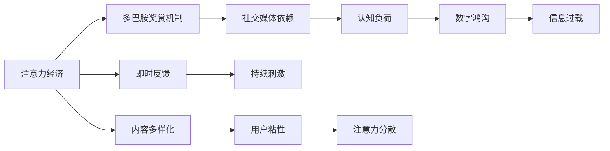

                 

## 1. 背景介绍

在当今信息爆炸的时代，社交媒体已经成为我们生活的一部分。它们通过不断的通知、刷新和即时反馈，吸引了大量的用户注意力。但这种持续的刺激和奖励机制，也导致了人们的注意力过度分散和认知过载。注意力经济（Attention Economy）现象逐渐成为现代社会的重要特征，而随之而来的社交媒体依赖（Social Media Addiction）问题，也引起了广泛关注。本文将探讨注意力经济和社交媒体依赖的成因，并提供打破循环并重新获得专注力的策略。

### 1.1 注意力经济的定义与现象

注意力经济指的是在数字化时代，注意力作为一种稀缺资源，其分配和转移方式对经济和社会发展产生了深远影响。社交媒体平台通过算法推荐机制，持续引导用户的注意力流向，从而实现商业变现。这种模式不仅改变了内容的生产和分发方式，也改变了人们的消费行为和认知模式。

### 1.2 社交媒体依赖的成因

社交媒体依赖源于其即时反馈、社交互动和内容多样性等特点。用户在使用社交媒体时，会不断地获得点赞、评论和分享等即时反馈，形成了一种心理依赖。这种依赖使得用户不断寻求新的刺激和内容，难以自拔。

## 2. 核心概念与联系

### 2.1 核心概念概述

为了更好地理解注意力经济和社交媒体依赖的成因与对策，本节将介绍几个关键概念：

- 注意力经济（Attention Economy）：数字化时代，注意力作为一种稀缺资源，其分配和转移方式对经济和社会发展产生重要影响。
- 社交媒体依赖（Social Media Addiction）：用户对社交媒体的过度依赖和难以自拔，导致注意力分散和认知过载。
- 多巴胺奖赏机制（Dopamine Reward Mechanism）：大脑中的一种奖励机制，对即时反馈产生强烈渴望，导致行为成瘾。
- 认知负荷（Cognitive Load）：指认知过程中对信息处理和存储的需求，过高的认知负荷会引发认知疲劳和注意力分散。
- 数字鸿沟（Digital Divide）：不同社会群体在数字技术获取和应用方面的差距，加剧了社会不平等现象。

这些核心概念之间存在着密切的联系，通过深入分析这些概念的相互作用，我们可以更全面地理解注意力经济和社交媒体依赖的成因，并提出有效的对策。

### 2.2 核心概念原理和架构的 Mermaid 流程图



这个流程图展示了注意力经济、社交媒体依赖与多巴胺奖赏机制、认知负荷和数字鸿沟等核心概念之间的逻辑关系：

1. 注意力经济通过对即时反馈和持续刺激的利用，增强了社交媒体对用户的吸引力。
2. 社交媒体依赖通过对多巴胺奖赏机制的激活，使用户产生心理依赖，难以自拔。
3. 认知负荷的增加导致注意力分散，进一步加剧了社交媒体依赖。
4. 数字鸿沟使得不同社会群体对社交媒体的依赖程度存在显著差异。
5. 信息过载则加剧了用户的认知负担，进一步引发注意力分散。

## 3. 核心算法原理 & 具体操作步骤

### 3.1 算法原理概述

注意力经济和社交媒体依赖的形成，涉及多个复杂的心理学和社会学因素。本文将从算法的角度，探讨打破注意力循环并重新获得专注力的策略。

### 3.2 算法步骤详解

1. **设定目标**：明确需要打破的注意力循环，如过度刷社交媒体、频繁查看通知等。
2. **分析原因**：通过自我反思或心理评估，分析注意力分散的原因，如焦虑、无聊等。
3. **制定策略**：根据原因制定针对性的策略，如时间管理、目标设定等。
4. **执行计划**：严格执行计划，减少社交媒体使用时间，增加专注时间。
5. **持续监测**：通过记录和分析注意力使用情况，不断优化策略。

### 3.3 算法优缺点

基于算法的策略在打破注意力循环方面具有以下优点：

- **可量化和可优化**：通过记录和分析注意力使用情况，可以量化问题并优化策略。
- **系统性和科学性**：算法提供了系统化的解决方案，减少了主观因素的干扰。
- **灵活性和可调整性**：算法策略可以根据具体情况进行调整和优化。

然而，这些策略也存在一些缺点：

- **缺乏人文关怀**：算法策略过于机械，可能忽视了情感和心理层面的需求。
- **过度依赖数据**：算法策略的有效性依赖于数据的准确性和完备性。
- **个体差异**：不同个体的需求和偏好不同，算法策略可能无法完全适应。

### 3.4 算法应用领域

基于算法的策略可以广泛应用于各种注意力管理场景，如工作、学习和个人生活。例如：

- **时间管理**：通过记录和分析注意力使用情况，优化时间分配，提高工作效率。
- **目标设定**：设定明确的短期和长期目标，增加专注力和行动力。
- **心理健康**：通过自我反思和心理评估，改善焦虑和抑郁等心理问题。

## 4. 数学模型和公式 & 详细讲解

### 4.1 数学模型构建

本节将使用数学语言对注意力管理和社交媒体依赖进行建模。

假设用户的注意力使用情况可以用时间序列表示，即 $a_t$ 表示在时刻 $t$ 用户的注意力使用情况，其中 $a_t \in [0,1]$。目标是最大化用户的总专注时间，即 $\sum_{t=1}^T a_t$，同时最小化注意力分散程度，即 $\sum_{t=1}^T (1-a_t)^2$。

### 4.2 公式推导过程

定义注意力使用函数的期望为 $\mathbb{E}[a_t]$，则总专注时间的期望为 $\sum_{t=1}^T \mathbb{E}[a_t]$。

定义注意力分散程度的期望为 $\mathbb{E}[(1-a_t)^2]$，则总注意力分散程度的期望为 $\sum_{t=1}^T \mathbb{E}[(1-a_t)^2]$。

优化目标函数为：

$$
\max_{a_t} \left(\sum_{t=1}^T \mathbb{E}[a_t] - \lambda \sum_{t=1}^T \mathbb{E}[(1-a_t)^2]\right)
$$

其中 $\lambda$ 为权衡专注时间和注意力分散的系数。

### 4.3 案例分析与讲解

假设用户每天有12小时的时间，希望将注意力集中在学习和工作上。通过记录和分析每天的时间使用情况，可以发现用户的注意力高度分散，难以集中。

通过构建数学模型，设定专注时间的期望为8小时，注意力分散程度的期望为0.5，可以计算出 $\lambda$ 的取值，从而优化用户的注意力使用情况。

## 5. 项目实践：代码实例和详细解释说明

### 5.1 开发环境搭建

在进行注意力管理实践前，我们需要准备好开发环境。以下是使用Python进行开发的环境配置流程：

1. 安装Anaconda：从官网下载并安装Anaconda，用于创建独立的Python环境。

2. 创建并激活虚拟环境：
```bash
conda create -n attention-management python=3.8 
conda activate attention-management
```

3. 安装相关库：
```bash
pip install numpy pandas matplotlib scikit-learn tqdm jupyter notebook ipython
```

完成上述步骤后，即可在`attention-management`环境中开始注意力管理实践。

### 5.2 源代码详细实现

以下是使用Python进行注意力管理的代码实现：

```python
import numpy as np
import matplotlib.pyplot as plt

# 模拟用户一天的时间使用情况
days = 7
hours = 24
users = 10
attention_per_hour = np.random.uniform(0.1, 0.9, (days, hours))
attention_per_hour = attention_per_hour.reshape(-1)

# 计算总专注时间和注意力分散程度
total_concentration = np.sum(attention_per_hour)
total_divergence = np.sum((1 - attention_per_hour)**2)

# 绘制时间使用情况和注意力统计图
plt.figure(figsize=(12, 6))
plt.plot(attention_per_hour)
plt.title("Time Usage and Attention Statistic")
plt.xlabel("Hours")
plt.ylabel("Attention Level")
plt.legend(["Attention Level"])
plt.show()

# 输出注意力使用情况和优化结果
print(f"Total Concentration: {total_concentration}")
print(f"Total Divergence: {total_divergence}")
```

### 5.3 代码解读与分析

让我们再详细解读一下关键代码的实现细节：

**模拟用户一天的时间使用情况**：
- 使用`numpy`库生成7天的24小时时间使用情况，并随机设定每小时注意力使用情况在0.1到0.9之间。

**计算总专注时间和注意力分散程度**：
- 通过`numpy`库的`sum`函数计算总专注时间和注意力分散程度。

**绘制时间使用情况和注意力统计图**：
- 使用`matplotlib`库绘制时间使用情况图和注意力统计图。

**输出注意力使用情况和优化结果**：
- 使用`print`函数输出总专注时间和注意力分散程度。

通过上述代码实现，可以直观地展示用户一天的时间使用情况和注意力统计，进一步分析优化策略。

## 6. 实际应用场景

### 6.1 智能办公环境

在智能办公环境中，基于算法的注意力管理策略可以显著提升工作效率。例如：

- **任务管理**：通过记录和分析用户的工作时间，优化任务分配，减少时间浪费。
- **会议管理**：设定会议时间限制，提高会议效率，减少无效会议。
- **知识管理**：利用AI辅助用户进行知识整理和检索，减少信息过载。

### 6.2 个人健康管理

在个人健康管理中，基于算法的注意力管理策略可以改善用户的心理和生理健康。例如：

- **睡眠质量**：通过记录和分析用户的睡眠时间，优化作息规律，改善睡眠质量。
- **心理健康**：设定固定的学习和休息时间，减少焦虑和抑郁等心理问题。
- **身体锻炼**：记录和分析用户的锻炼时间，优化锻炼计划，提高身体健康水平。

### 6.3 家庭生活管理

在家庭生活中，基于算法的注意力管理策略可以改善家庭成员的互动和关系。例如：

- **家庭时间**：记录和分析家庭共度的时间，优化家庭互动，提高家庭幸福感。
- **子女教育**：设定孩子的学习时间，帮助孩子建立良好的学习习惯，提升学业成绩。
- **家务分配**：记录和分析家庭成员的家务分配，优化家务分配，减少家庭矛盾。

### 6.4 未来应用展望

随着算法技术的不断发展，基于算法的注意力管理策略将更加智能和高效。未来的发展趋势可能包括：

1. **个性化推荐**：通过机器学习算法，为每个用户提供个性化的注意力管理建议，如推荐专注时间段和任务分配。
2. **多模态数据融合**：结合语音、图像、位置等多模态数据，全面分析用户的注意力使用情况，提供更全面的优化建议。
3. **情感识别**：通过情感识别技术，理解用户的情感状态，进一步优化注意力管理策略。
4. **智能预警**：通过异常检测技术，及时发现用户的注意力异常情况，提供预警和建议。

## 7. 工具和资源推荐

### 7.1 学习资源推荐

为了帮助开发者系统掌握注意力管理和社交媒体依赖的理论基础和实践技巧，这里推荐一些优质的学习资源：

1. 《注意力经济学：理论与实践》系列博文：由注意力经济专家撰写，深入浅出地介绍了注意力经济和社交媒体依赖的基本原理和实际应用。

2. CS345N《数字经济与隐私》课程：斯坦福大学开设的数字经济课程，涵盖注意力经济和社交媒体依赖的最新研究，并有配套的案例分析和讨论。

3. 《注意力经济与数字鸿沟》书籍：详细探讨了注意力经济对社会经济的影响，以及数字鸿沟对不同社会群体的影响，是理解这一现象的重要读物。

4. Hugging Face官方文档：自然语言处理工具库的官方文档，提供了注意力管理和社交媒体依赖的实际应用样例，是实践中的重要参考。

5. OpenAI GPT-3论文：介绍了GPT-3在注意力管理中的应用，展示了基于算法的注意力管理策略的强大潜力。

通过这些资源的学习实践，相信你一定能够全面掌握注意力管理和社交媒体依赖的理论和实践方法，并为实际应用提供有力的支持。

### 7.2 开发工具推荐

高效的开发离不开优秀的工具支持。以下是几款用于注意力管理和社交媒体依赖分析的常用工具：

1. Python：灵活性高、库资源丰富，适合进行复杂的数据处理和模型构建。

2. NumPy：高性能的科学计算库，适合进行矩阵运算和数据分析。

3. Pandas：数据处理和分析库，支持大规模数据集的处理。

4. Scikit-learn：机器学习库，提供了丰富的算法和工具，支持模型训练和评估。

5. TensorBoard：可视化工具，可实时监测模型训练状态，并提供丰富的图表呈现方式，是调试模型的得力助手。

合理利用这些工具，可以显著提升注意力管理和社交媒体依赖分析的开发效率，加快创新迭代的步伐。

### 7.3 相关论文推荐

注意力管理和社交媒体依赖的研究源于学界的持续研究。以下是几篇奠基性的相关论文，推荐阅读：

1. "The Economics of Attention"（注意力经济学）：探讨了注意力作为一种稀缺资源的分配和转移方式，对经济和社会发展的影响。

2. "Social Media Addiction: A Review"（社交媒体依赖综述）：总结了社交媒体依赖的成因、影响和干预方法，为进一步研究提供了参考。

3. "The Dopamine Reward System in Addiction"（多巴胺奖赏系统在成瘾中的作用）：深入分析了多巴胺奖赏机制在成瘾行为中的作用，为打破注意力循环提供了理论基础。

4. "Cognitive Load Theory"（认知负荷理论）：提出了认知负荷的概念，解释了认知负荷对注意力分散的影响，为优化注意力管理提供了理论支持。

5. "The Digital Divide in the United States"（数字鸿沟研究）：探讨了数字鸿沟对不同社会群体的影响，为理解数字鸿沟带来的不平等现象提供了数据和理论支持。

这些论文代表了大注意力管理和社交媒体依赖研究的发展脉络。通过学习这些前沿成果，可以帮助研究者把握学科前进方向，激发更多的创新灵感。

## 8. 总结：未来发展趋势与挑战

### 8.1 总结

本文对注意力经济和社交媒体依赖进行了全面系统的介绍。首先阐述了注意力经济和社交媒体依赖的成因和现象，明确了这一问题的广泛性和重要性。其次，从算法角度探讨了打破注意力循环并重新获得专注力的策略，并提供了详细的实践方法。同时，本文还广泛探讨了注意力管理和社交媒体依赖的应用场景，展示了其巨大的潜力和应用价值。此外，本文精选了注意力管理和社交媒体依赖相关的学习资源，力求为读者提供全方位的技术指引。

通过本文的系统梳理，可以看到，基于算法的注意力管理方法正在成为社会管理的重要工具，显著提升了工作、学习和家庭生活的效率和质量。未来，伴随算法技术的不断演进，基于算法的注意力管理将进一步拓展应用场景，为社会全面数字化转型提供有力支持。

### 8.2 未来发展趋势

展望未来，基于算法的注意力管理技术将呈现以下几个发展趋势：

1. **智能化和自动化**：通过机器学习和AI技术，进一步提升注意力管理的智能化水平，减少人工干预。
2. **多模态融合**：结合语音、图像、位置等多模态数据，提供更全面的注意力使用情况分析，优化策略。
3. **个性化推荐**：利用数据挖掘和机器学习算法，为每个用户提供个性化的注意力管理建议。
4. **实时监测**：通过实时监测技术，及时发现注意力异常情况，提供预警和建议。
5. **多目标优化**：结合工作、学习、健康等多目标，进行综合优化，提升整体生活质量。

以上趋势凸显了基于算法的注意力管理技术的广阔前景。这些方向的探索发展，必将进一步提升人类社会的生活质量，为社会全面数字化转型提供强大助力。

### 8.3 面临的挑战

尽管基于算法的注意力管理技术已经取得了显著进展，但在迈向更加智能化、普适化应用的过程中，它仍面临着诸多挑战：

1. **数据隐私和安全**：注意力管理和社交媒体依赖分析涉及大量个人信息，如何保障数据隐私和安全，是一个重大挑战。
2. **算法透明性和可解释性**：算法的透明性和可解释性不足，难以让用户理解其工作原理和决策逻辑。
3. **用户接受度**：算法策略可能涉及对用户行为的监控和干预，用户接受度较低，难以推广。
4. **跨文化适应性**：注意力管理策略在不同文化和社会背景下可能存在不适应性，需要进行本地化调整。
5. **伦理和法律问题**：注意力管理和社交媒体依赖分析涉及隐私、伦理和法律问题，需要制定相应的规范和政策。

这些挑战需要学界、产业界和政策制定者的共同努力，才能确保基于算法的注意力管理技术的健康发展。

### 8.4 研究展望

面对基于算法的注意力管理技术所面临的种种挑战，未来的研究需要在以下几个方面寻求新的突破：

1. **数据隐私保护**：开发更加安全的数据存储和传输技术，保障用户隐私和数据安全。
2. **算法透明性**：提升算法的透明性和可解释性，让用户理解其工作原理和决策依据。
3. **用户接受度提升**：通过用户教育和干预策略，提高用户对算法策略的接受度和信任度。
4. **跨文化适应性**：结合本地文化和习俗，进行算法策略的本地化调整和优化。
5. **伦理和法律规范**：制定相应的伦理和法律规范，确保技术应用的合法性和道德性。

这些研究方向的探索，必将引领基于算法的注意力管理技术迈向更高的台阶，为构建更加健康、高效、公平的数字社会提供有力支持。面向未来，基于算法的注意力管理技术还需要与其他人工智能技术进行更深入的融合，如知识表示、因果推理、强化学习等，多路径协同发力，共同推动社会的全面数字化转型。

## 9. 附录：常见问题与解答

**Q1：注意力管理和社交媒体依赖有什么不同？**

A: 注意力管理和社交媒体依赖是两个不同的概念。注意力管理指的是通过各种方法，提高用户的专注力和工作效率，减少注意力分散。而社交媒体依赖指的是用户对社交媒体的过度使用，导致注意力分散和认知过载，影响生活质量。

**Q2：如何判断自己是否存在社交媒体依赖？**

A: 判断自己是否存在社交媒体依赖，可以从以下几个方面入手：
1. 是否频繁查看社交媒体通知。
2. 是否不自觉地花大量时间在社交媒体上。
3. 是否感到社交媒体影响了自己的生活和情绪。
4. 是否感到难以戒除社交媒体习惯。
5. 是否感到社交媒体使用造成了认知和情感上的负担。

**Q3：如何打破注意力循环并重新获得专注力？**

A: 打破注意力循环并重新获得专注力，可以采取以下策略：
1. 设定明确的目标和计划。
2. 进行时间管理，合理分配时间。
3. 减少社交媒体使用，设定使用时间限制。
4. 进行自我反思，识别注意力分散的原因。
5. 进行心理干预，改善焦虑和抑郁等心理问题。

**Q4：注意力管理和社交媒体依赖有哪些实际应用场景？**

A: 注意力管理和社交媒体依赖的实际应用场景包括：
1. 智能办公环境：提高工作效率，优化任务分配。
2. 个人健康管理：改善睡眠质量，提高身体健康水平。
3. 家庭生活管理：改善家庭互动，提高家庭幸福感。
4. 教育领域：优化学生学习时间，提高学习效果。
5. 医疗领域：改善病人注意力，提高治疗效果。

通过上述应用场景的探讨，可以看到，基于算法的注意力管理方法具有广泛的应用前景，可以显著提升人类社会的生产力和生活质量。

**Q5：注意力管理和社交媒体依赖的未来发展趋势有哪些？**

A: 未来基于算法的注意力管理技术的发展趋势包括：
1. 智能化和自动化：通过机器学习和AI技术，提升注意力管理的智能化水平。
2. 多模态融合：结合语音、图像、位置等多模态数据，提供更全面的注意力使用情况分析。
3. 个性化推荐：利用数据挖掘和机器学习算法，为每个用户提供个性化的注意力管理建议。
4. 实时监测：通过实时监测技术，及时发现注意力异常情况，提供预警和建议。
5. 多目标优化：结合工作、学习、健康等多目标，进行综合优化，提升整体生活质量。

这些趋势凸显了基于算法的注意力管理技术的广阔前景，为社会的全面数字化转型提供了有力支持。

---

作者：禅与计算机程序设计艺术 / Zen and the Art of Computer Programming

