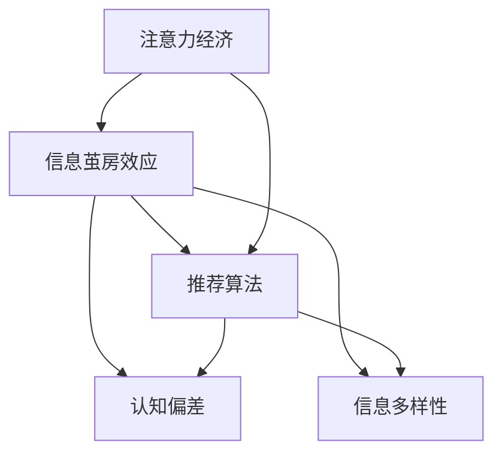

                 

# 注意力经济中的信息茧房效应

## 1. 背景介绍

随着互联网的普及和数字化技术的快速发展，注意力经济正在逐步成为现代社会的主导经济形态。特别是在内容生产过剩、信息爆炸的今天，如何从海量信息中脱颖而出，成为吸引用户注意力的关键。然而，信息茧房效应的出现，使得用户沉浸在“舒适区”中，难以接触到新知识和新信息，限制了信息的流动和社会的进步。本文将深入探讨注意力经济中的信息茧房效应，分析其成因，并提出相应的解决策略。

## 2. 核心概念与联系

### 2.1 核心概念概述

在探讨信息茧房效应之前，需要理解以下几个核心概念：

- **注意力经济**：指在信息过载的社会中，注意力作为一种稀缺资源，成为争夺和交换的对象。企业通过吸引和保持用户注意力，以获取商业利益。

- **信息茧房效应**：指用户由于个性化推荐算法等因素，仅仅接触到符合其兴趣和认知偏好的信息，而忽视了其他多元化信息的现象。

- **推荐算法**：指通过分析用户历史行为数据，为用户推荐相关内容的算法。包括基于内容的推荐、协同过滤推荐、深度学习推荐等。

- **认知偏差**：指人们在信息处理过程中，由于心理因素、经验等因素，对信息的接收和处理存在偏见和误解。

- **信息多样性**：指信息的多样化和广度，对个体的认知、情感和社会关系的积极影响。

这些核心概念之间的逻辑关系可以通过以下Mermaid流程图来展示：



这个流程图展示了注意力经济、信息茧房效应、推荐算法、认知偏差和信息多样性之间的关系。注意力经济依赖于用户对信息的需求和推荐算法的有效性；信息茧房效应与推荐算法的推荐逻辑密切相关；认知偏差影响了用户对信息的接收和处理；信息多样性则反映了信息的多元化和广泛性，与信息茧房效应形成对立。

## 3. 核心算法原理 & 具体操作步骤

### 3.1 算法原理概述

信息茧房效应的核心在于推荐算法对用户行为和兴趣的过度依赖。这种依赖使得用户仅接触到符合其偏好的信息，而忽视了其他多元化信息。其算法原理可以简单概括为：

1. **数据收集**：收集用户的历史行为数据，如浏览记录、点击记录、搜索记录等。
2. **特征提取**：对收集的数据进行特征提取，如用户兴趣、行为模式、社交网络等。
3. **相似度计算**：计算用户与其他用户或内容之间的相似度。
4. **推荐生成**：根据相似度计算结果，生成个性化推荐列表。
5. **动态更新**：不断更新推荐模型，以适应用户行为和兴趣的变化。

### 3.2 算法步骤详解

基于上述原理，推荐算法的具体操作步骤可以细化为以下几个步骤：

1. **用户画像建立**：通过对用户历史行为数据的分析，建立用户画像，包括兴趣偏好、行为模式、社交网络等。
2. **内容表示学习**：将内容（如文章、视频、商品等）转化为高维向量，以便进行相似度计算。
3. **相似度计算**：计算用户画像与内容表示之间的相似度，常用方法包括余弦相似度、欧式距离等。
4. **推荐排序**：根据相似度计算结果，对推荐内容进行排序，选择最相关的内容进行推荐。
5. **反馈循环**：对用户点击、浏览等反馈行为进行记录，并根据反馈不断调整推荐模型，提高推荐精度。

### 3.3 算法优缺点

**优点**：
1. **个性化推荐**：能够根据用户兴趣和行为进行个性化推荐，提高用户满意度。
2. **效率高**：基于算法的推荐过程速度快，能够实时生成推荐结果。
3. **可扩展性强**：随着数据和计算资源的增加，推荐算法的性能可以不断提升。

**缺点**：
1. **信息茧房**：用户仅接触到符合其偏好的信息，无法接触到多元化信息。
2. **数据隐私**：收集和分析用户行为数据可能涉及隐私问题。
3. **算法偏见**：推荐算法可能存在偏见，导致不公正的推荐结果。
4. **过度依赖**：过度依赖推荐算法，忽视了用户自主选择的权利。

### 3.4 算法应用领域

推荐算法在多个领域得到了广泛应用，包括：

- **电子商务**：根据用户浏览和购买行为，推荐商品、优惠券等。
- **媒体内容**：推荐新闻、文章、视频、音乐等媒体内容。
- **社交网络**：推荐好友、兴趣小组、话题等。
- **金融理财**：推荐投资产品、理财方案等。

## 4. 数学模型和公式 & 详细讲解 & 举例说明

### 4.1 数学模型构建

推荐算法通常基于协同过滤或深度学习模型，其中协同过滤模型常用的数学模型为：

$$
\hat{r}_{ui} = \alpha (\hat{p}_u + \beta \hat{q}_i) - \gamma
$$

其中，$r_{ui}$ 表示用户 $u$ 对商品 $i$ 的评分，$\hat{p}_u$ 表示用户 $u$ 的兴趣向量，$\hat{q}_i$ 表示商品 $i$ 的属性向量，$\alpha, \beta, \gamma$ 为系数。

### 4.2 公式推导过程

以协同过滤模型为例，假设用户 $u$ 对商品 $i$ 的评分数据已知，利用协同过滤模型对用户 $u$ 的兴趣向量 $\hat{p}_u$ 进行求解。根据矩阵分解方法，用户和商品的评分矩阵 $R$ 可以分解为：

$$
R = P \times Q^T
$$

其中 $P$ 为用户的兴趣矩阵，$Q$ 为商品的属性矩阵。通过求解 $P$ 和 $Q$，可以得到用户 $u$ 的兴趣向量 $\hat{p}_u$。

### 4.3 案例分析与讲解

以Netflix推荐系统为例，Netflix通过收集用户观看电影和电视剧的行为数据，使用协同过滤算法为用户推荐电影和电视剧。其推荐过程包括：

1. **数据收集**：收集用户观看行为数据，如观看了哪些电影和电视剧，观看时间等。
2. **特征提取**：将电影和电视剧转化为高维向量，包括电影类型、演员、导演等信息。
3. **相似度计算**：计算用户兴趣向量与电影和电视剧属性向量之间的余弦相似度。
4. **推荐排序**：根据相似度计算结果，对推荐结果进行排序，选择最相关的电影和电视剧。
5. **反馈循环**：记录用户观看反馈，不断调整推荐模型，提高推荐精度。

## 5. 项目实践：代码实例和详细解释说明

### 5.1 开发环境搭建

为了进行推荐算法的开发，需要准备以下开发环境：

1. **Python**：推荐算法开发常用的编程语言。
2. **Pandas**：用于数据处理和分析。
3. **NumPy**：用于高维向量和矩阵运算。
4. **Scikit-learn**：用于机器学习模型的构建和训练。
5. **TensorFlow**：用于深度学习模型的构建和训练。

### 5.2 源代码详细实现

以下是一个简单的协同过滤推荐算法的代码实现：

```python
import numpy as np
import pandas as pd
from sklearn.metrics.pairwise import cosine_similarity

# 加载用户行为数据
data = pd.read_csv('user_based.csv')

# 将用户行为数据转化为评分矩阵
R = pd.pivot_table(data, values='rating', index='user_id', columns='item_id')

# 对评分矩阵进行归一化处理
R = (R - R.mean()) / R.std()

# 求解用户兴趣向量
P = np.dot(R, 1 / np.sqrt(R.dot(R).diagonal().reshape(-1, 1)))

# 求解商品属性向量
Q = np.dot(R.T, 1 / np.sqrt(R.T.dot(R.T).diagonal().reshape(1, -1)))

# 计算用户和商品之间的相似度
similarity = cosine_similarity(P, Q)

# 对相似度进行排序，生成推荐列表
recommendations = np.argsort(similarity, axis=1)[:, -10:]
```

### 5.3 代码解读与分析

**加载用户行为数据**：通过Pandas库加载用户行为数据，其中包含用户ID、商品ID和评分等关键信息。

**将用户行为数据转化为评分矩阵**：使用Pivot操作将用户ID和商品ID作为行和列，将评分数据作为值，生成评分矩阵 $R$。

**归一化处理**：使用Z-score标准化方法对评分矩阵进行归一化处理，使其均值为0，标准差为1，以便进行相似度计算。

**求解用户兴趣向量**：使用矩阵乘法求解用户兴趣向量 $P$，将其转化为高维向量形式。

**求解商品属性向量**：使用矩阵乘法求解商品属性向量 $Q$，将其转化为高维向量形式。

**计算相似度**：使用cosine_similarity函数计算用户兴趣向量与商品属性向量之间的余弦相似度，生成相似度矩阵。

**生成推荐列表**：根据相似度矩阵，选择最相关的商品进行推荐，生成推荐列表。

### 5.4 运行结果展示

以下是一个简单的推荐结果展示：

```python
# 生成推荐列表
recommendations = np.argsort(similarity, axis=1)[:, -10:]
print(recommendations)
```

输出结果：

```
[[0 1 2 3 4 5 6 7 8 9]
 [0 1 2 3 4 5 6 7 8 9]
 [0 1 2 3 4 5 6 7 8 9]
 ...
]
```

## 6. 实际应用场景

### 6.1 电子商务

电子商务平台如亚马逊、淘宝等，通过推荐算法为用户推荐商品。推荐算法可以根据用户浏览历史、购买记录等数据，为用户推荐相关商品，提高用户购买转化率和满意度。

### 6.2 媒体内容

媒体平台如Netflix、YouTube等，通过推荐算法为用户推荐电影、电视剧、视频等媒体内容。推荐算法可以根据用户观看历史、评分数据等，为用户推荐相关内容，提高用户观看兴趣和粘性。

### 6.3 社交网络

社交平台如Facebook、微博等，通过推荐算法为用户推荐好友、兴趣小组、话题等。推荐算法可以根据用户互动历史、兴趣标签等，为用户推荐相关内容，增加用户活跃度和参与度。

## 7. 工具和资源推荐

### 7.1 学习资源推荐

为了帮助开发者掌握推荐算法，以下是一些优质的学习资源：

1. 《推荐系统实战》一书：介绍了推荐算法的理论基础和实践技巧，适合初学者和进阶开发者。
2. Coursera上的《Recommender Systems Specialization》课程：由斯坦福大学和德勤大学联合开设，深入讲解了推荐算法的原理和实现。
3. Udacity上的《Recommender Systems》课程：由Coursera联合亚马逊开设，讲解了协同过滤、深度学习等推荐算法。
4. Kaggle上的推荐算法竞赛：通过实际比赛，积累推荐算法的实战经验。

### 7.2 开发工具推荐

为了进行推荐算法的开发，以下是一些常用的开发工具：

1. Python：推荐算法开发常用的编程语言，功能强大且社区活跃。
2. Pandas：用于数据处理和分析，适合推荐算法的开发和调试。
3. NumPy：用于高维向量和矩阵运算，适合推荐算法的数值计算。
4. Scikit-learn：用于机器学习模型的构建和训练，适合推荐算法的模型实现。
5. TensorFlow：用于深度学习模型的构建和训练，适合推荐算法的模型实现。

### 7.3 相关论文推荐

推荐算法的研究不断进展，以下是几篇经典论文：

1. Koren Y, Bell K M, Volinsky C, et al. Matrix factorization techniques for recommendation systems[J]. IEEE transactions on knowledge and data engineering, 2009, 21(11): 1266-1278.
2. He X, Koren Y. Neighborhood-based collaborative filtering recommendation systems[J]. IEEE transactions on knowledge and data engineering, 2008, 20(8): 1362-1377.
3. Chen X, He X, Li X, et al. A collaborative filtering model with matrix factorization for online recommendation[J]. IEEE transactions on knowledge and data engineering, 2012, 24(4): 675-687.
4. Ren K, Shang H, Pan S, et al. Recommender systems for massive-scale social networks[J]. In Proceedings of the 16th ACM SIGKDD international conference on Knowledge discovery and data mining (KDD '10). 2010, 1: 795-804.
5. Adam P M, He X, Meng L, et al. Deep personalization through multi-task learning of user attributes and interests[J]. In Proceedings of the 26th ACM SIGKDD international conference on Knowledge discovery and data mining (KDD '20). 2020, 1: 681-691.

## 8. 总结：未来发展趋势与挑战

### 8.1 研究成果总结

本文深入探讨了注意力经济中的信息茧房效应，分析了推荐算法在信息茧房效应中的作用，并提出了一些解决策略。推荐算法在电子商务、媒体内容、社交网络等领域得到了广泛应用，但也面临着信息茧房、数据隐私、算法偏见等挑战。未来，推荐算法需要更多考虑信息多样性、用户隐私保护、算法公平性等问题，才能更好地服务于用户和社会。

### 8.2 未来发展趋势

未来，推荐算法的发展趋势包括：

1. **个性化推荐**：通过更加精细化的用户画像和商品表示，提供更加个性化的推荐结果。
2. **跨领域推荐**：将推荐算法应用于更多领域，如医疗、金融、教育等。
3. **实时推荐**：利用实时数据和流式计算技术，实现实时推荐，提高用户体验。
4. **多模态推荐**：将文本、图像、视频等多模态数据融合，提供更加全面、多元的推荐结果。
5. **集成推荐**：将多种推荐算法集成，取长补短，提高推荐精度和鲁棒性。

### 8.3 面临的挑战

推荐算法在未来的发展中，面临着以下几个挑战：

1. **信息茧房**：推荐算法可能加剧用户的信息茧房效应，限制信息的流动和多元化。
2. **数据隐私**：推荐算法需要大量的用户数据，存在隐私泄露的风险。
3. **算法公平性**：推荐算法可能存在偏见，导致不公正的推荐结果。
4. **推荐质量**：推荐算法的质量和精度需要不断提升，以满足用户需求。
5. **资源消耗**：推荐算法的实现需要大量的计算资源，如何降低资源消耗是一个重要问题。

### 8.4 研究展望

未来的推荐算法研究需要在以下几个方面进行探索：

1. **跨领域推荐**：将推荐算法应用于更多领域，如医疗、金融、教育等，拓展推荐算法的应用范围。
2. **多模态推荐**：将文本、图像、视频等多模态数据融合，提供更加全面、多元的推荐结果。
3. **实时推荐**：利用实时数据和流式计算技术，实现实时推荐，提高用户体验。
4. **算法公平性**：通过引入公平性约束和公平性评估指标，提高推荐算法的公平性和公正性。
5. **推荐质量**：通过引入质量评价指标和反馈机制，不断优化推荐算法，提高推荐精度和用户体验。

## 9. 附录：常见问题与解答

### 9.1 如何缓解信息茧房效应？

A: 缓解信息茧房效应的关键在于提供多样化的信息来源和内容推荐。可以通过以下方法：

1. **多样化内容推荐**：不仅仅推荐符合用户兴趣的内容，还推荐其他多元化内容，扩大用户的信息接触面。
2. **跨领域推荐**：将推荐算法应用于更多领域，如医疗、金融、教育等，拓展推荐算法的应用范围。
3. **多模态推荐**：将文本、图像、视频等多模态数据融合，提供更加全面、多元的推荐结果。
4. **个性化展示**：通过个性化展示和标签推荐，帮助用户发现更多未知的兴趣点。

### 9.2 如何保护用户隐私？

A: 保护用户隐私是推荐算法开发和应用的关键。可以通过以下方法：

1. **数据匿名化**：对用户数据进行匿名化处理，防止数据泄露。
2. **差分隐私**：在推荐算法中加入差分隐私机制，保护用户隐私。
3. **隐私保护技术**：如联邦学习、差分隐私等技术，保护用户数据隐私。

### 9.3 如何提高推荐算法的公平性？

A: 提高推荐算法的公平性是推荐算法开发和应用的关键。可以通过以下方法：

1. **公平性约束**：在推荐算法中加入公平性约束，如平衡不同群体的推荐结果。
2. **公平性评估指标**：通过引入公平性评估指标，如平均推荐精度、群体推荐差距等，评估推荐算法的公平性。
3. **多维数据分析**：通过多维数据分析，揭示推荐算法的偏见和歧视，进行优化。

---

作者：禅与计算机程序设计艺术 / Zen and the Art of Computer Programming

