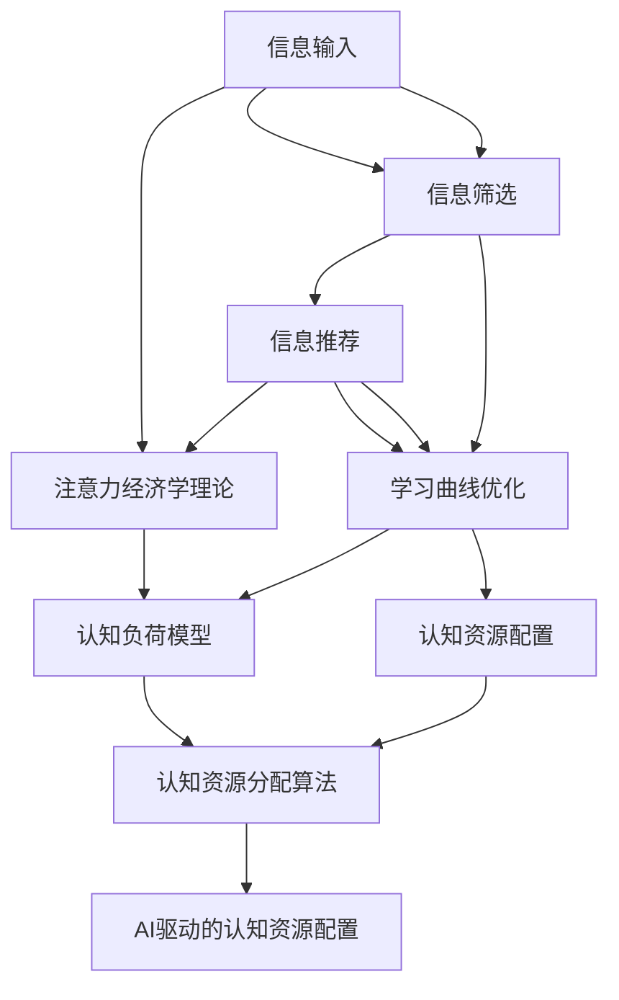

                 

# 注意力经济学前沿：AI驱动的认知资源配置

> 关键词：注意力经济学, 认知资源配置, AI驱动, 信息获取, 数据筛选, 学习曲线优化

## 1. 背景介绍

在现代社会，信息爆炸和认知负荷的增加已成为制约人类学习、工作和生活的重大挑战。由于信息量过于庞大，人类认知系统的有限性使其无法有效地处理所有输入，这种认知资源的限制被称为认知负荷（Cognitive Load）。为了应对这一问题，认知科学家提出了注意力经济学的理论，用以优化认知资源的配置，从而提高信息处理效率。

在人工智能时代，AI驱动的认知资源配置方法正在逐渐兴起，旨在通过自动化的方式优化信息获取、筛选和学习曲线，减少人类认知负荷，提升信息处理效率。AI技术在信息检索、推荐系统、学习辅助等多个领域的应用，为认知资源的配置提供了新的解决思路。

本文将深入探讨注意力经济学及其在AI驱动下的应用，探讨如何利用AI技术优化认知资源的配置，提升信息处理效率，降低认知负荷，推动认知经济学的进一步发展。

## 2. 核心概念与联系

### 2.1 核心概念概述

注意力经济学（Economics of Attention），源于认知科学的研究成果，强调了认知资源在信息处理中的核心作用。认知资源包括注意力、工作记忆等，是人类认知系统处理信息的基础。注意力经济学的研究目标是找到最优的认知资源配置策略，使得在有限的时间内获取和处理尽可能多的有用信息，避免认知资源的浪费和过度消耗。

AI驱动的认知资源配置，则是指利用人工智能技术，如机器学习、自然语言处理、计算机视觉等，自动进行信息筛选、推荐和学习曲线优化，从而实现认知资源的自动配置和优化。其核心在于通过算法模型对大量数据进行高效分析和处理，辅助人类进行信息选择和理解。

### 2.2 核心概念原理和架构的 Mermaid 流程图



这个流程图展示了从信息输入到认知资源配置的全过程，其中：

- A：信息输入，指从外界获取的信息源，包括文本、图像、视频等。
- B：信息筛选，通过模型算法自动进行信息过滤，剔除无用或无关信息，保留有价值的内容。
- C：信息推荐，通过算法模型对已筛选信息进行排序和推荐，辅助用户快速获取重要信息。
- D：学习曲线优化，通过分析用户的学习行为和反馈，优化信息展示方式和学习路径。
- E：认知资源配置，最终通过AI驱动的方式，实现对用户认知资源的自动配置和优化。
- F：注意力经济学理论，提供认知资源配置的基本原理和指导思想。
- G：认知负荷模型，分析用户认知负荷，指导信息处理策略。
- H：认知资源分配算法，基于认知负荷模型和注意力经济学理论，制定资源配置方案。
- I：AI驱动的认知资源配置，通过算法模型自动实现认知资源的优化配置。

这些核心概念共同构成了认知资源配置的完整框架，展现了AI技术在优化信息处理和认知资源配置中的重要作用。

## 3. 核心算法原理 & 具体操作步骤

### 3.1 算法原理概述

AI驱动的认知资源配置，核心在于通过机器学习算法，对大量数据进行分析和处理，辅助用户进行信息筛选和认知资源的优化配置。其原理包括以下几个关键步骤：

1. **信息筛选**：利用自然语言处理、计算机视觉等技术，对信息进行自动化的过滤和筛选，剔除无用或无关信息，保留有价值的内容。
2. **信息推荐**：通过机器学习模型对已筛选信息进行排序和推荐，辅助用户快速获取重要信息。
3. **学习曲线优化**：分析用户的学习行为和反馈，优化信息展示方式和学习路径，使得学习过程更加高效。
4. **认知资源配置**：基于注意力经济学理论和认知负荷模型，制定认知资源的自动配置方案，实现对用户认知资源的优化。

### 3.2 算法步骤详解

以一个简单的信息检索和推荐系统为例，详细讲解AI驱动的认知资源配置的实现步骤：

1. **数据准备**：收集用户的历史行为数据和兴趣偏好，获取待检索的信息源，如新闻、文章、视频等。
2. **信息筛选**：利用自然语言处理技术，对信息进行关键词提取和语义分析，识别有用信息，剔除无用信息。
3. **信息推荐**：通过协同过滤、内容推荐等算法，对已筛选信息进行排序和推荐，辅助用户快速获取重要信息。
4. **学习曲线优化**：分析用户的学习行为和反馈，优化信息展示方式和学习路径，如通过调整信息展示顺序、展示方式等，提高学习效率。
5. **认知资源配置**：根据用户的学习进度和认知负荷，动态调整信息展示量和学习难度，避免认知资源过度消耗。

### 3.3 算法优缺点

**优点**：

1. **高效性**：通过算法模型对大量数据进行自动分析和处理，显著提高信息获取和处理效率。
2. **个性化**：利用用户的历史行为数据和兴趣偏好，提供个性化信息推荐，提升用户体验。
3. **动态调整**：根据用户的学习进度和认知负荷，动态调整信息展示量和难度，避免认知资源过度消耗。

**缺点**：

1. **数据依赖**：算法模型的效果依赖于数据质量，需要高质量的标注数据和用户行为数据。
2. **模型复杂性**：复杂的信息筛选、推荐和学习曲线优化算法，需要较高的计算资源和技术门槛。
3. **可解释性**：部分AI驱动的认知资源配置算法模型存在"黑盒"问题，难以解释其内部决策逻辑。

### 3.4 算法应用领域

AI驱动的认知资源配置，已在多个领域得到广泛应用，具体包括：

1. **信息检索和推荐系统**：通过信息筛选和推荐，帮助用户快速获取有用信息，提升信息检索效率。
2. **在线学习和教育**：通过学习曲线优化和认知资源配置，提高在线学习的效率和效果。
3. **健康和医疗**：利用认知资源配置技术，优化医疗信息的获取和处理，提升医疗服务质量。
4. **金融和投资**：通过信息筛选和推荐，帮助投资者获取有价值的信息，提升投资决策的准确性。
5. **新闻和媒体**：通过信息筛选和推荐，优化新闻和媒体内容的展示方式，提升用户获取信息的效率。

## 4. 数学模型和公式 & 详细讲解 & 举例说明

### 4.1 数学模型构建

在AI驱动的认知资源配置中，常用的数学模型包括线性回归模型、协同过滤模型、深度学习模型等。这里以一个简单的协同过滤推荐模型为例，详细讲解其数学模型构建过程。

假设用户集合为 $U=\{u_1,u_2,...,u_M\}$，物品集合为 $I=\{i_1,i_2,...,i_N\}$，用户 $u$ 对物品 $i$ 的评分 $r_{ui}$ 为二值评分（如1或0），推荐系统需要预测用户 $u$ 对物品 $i$ 的评分，从而进行推荐。协同过滤模型的目标是最小化预测评分与真实评分之间的差异，即：

$$
\min_{\theta} \sum_{(u,i)\in U\times I} (r_{ui} - f_\theta(u,i))^2
$$

其中 $f_\theta(u,i)$ 为预测评分函数， $\theta$ 为模型参数。常用的预测评分函数包括点积模型、矩阵分解模型等。

### 4.2 公式推导过程

以矩阵分解模型为例，推导其预测评分函数：

假设用户 $u$ 对物品 $i$ 的真实评分 $r_{ui}$ 由用户 $u$ 的潜在特征 $h_u$ 和物品 $i$ 的潜在特征 $h_i$ 的线性组合得到：

$$
r_{ui} = \langle h_u, h_i \rangle
$$

其中 $\langle \cdot, \cdot \rangle$ 为内积运算。进一步，令 $H_u = [h_{u1}, h_{u2}, ..., h_{um}]$ 和 $H_i = [h_{i1}, h_{i2}, ..., h_{in}]$ 分别为用户 $u$ 和物品 $i$ 的潜在特征矩阵，则：

$$
r_{ui} = \langle H_u, H_i^T \rangle
$$

即用户 $u$ 对物品 $i$ 的真实评分由其潜在特征矩阵和物品潜在特征矩阵的内积决定。通过最小化预测评分与真实评分之间的差异，可以求解出最优的潜在特征矩阵 $H_u$ 和 $H_i$，从而实现协同过滤模型的推荐。

### 4.3 案例分析与讲解

考虑一个新闻阅读应用，用户在应用中浏览的文章会被打上“推荐”标签，供其他用户阅读。基于协同过滤模型，可以通过分析用户的历史阅读行为，找到与当前用户兴趣相似的群体，推荐其感兴趣的文章。例如，一个经常阅读技术新闻的用户，推荐系统可以为他推荐其他有相似阅读习惯的用户喜欢的文章。

## 5. 项目实践：代码实例和详细解释说明

### 5.1 开发环境搭建

为了实现AI驱动的认知资源配置，需要进行一定的环境搭建。以下是使用Python进行PyTorch开发的环境配置流程：

1. 安装Anaconda：从官网下载并安装Anaconda，用于创建独立的Python环境。

2. 创建并激活虚拟环境：
```bash
conda create -n pytorch-env python=3.8 
conda activate pytorch-env
```

3. 安装PyTorch：根据CUDA版本，从官网获取对应的安装命令。例如：
```bash
conda install pytorch torchvision torchaudio cudatoolkit=11.1 -c pytorch -c conda-forge
```

4. 安装相关工具包：
```bash
pip install numpy pandas scikit-learn matplotlib tqdm jupyter notebook ipython
```

完成上述步骤后，即可在`pytorch-env`环境中开始项目实践。

### 5.2 源代码详细实现

以协同过滤模型为例，展示使用PyTorch进行信息推荐系统的代码实现。

首先，定义用户-物品评分矩阵和用户潜在特征矩阵：

```python
import torch
from torch import nn
from torch.nn import functional as F

# 定义用户-物品评分矩阵
rating_matrix = torch.randn(1000, 500)  # 假设有1000个用户和500个物品

# 定义用户潜在特征矩阵
user_embeddings = torch.randn(1000, 10)  # 每个用户有10个潜在特征

# 定义物品潜在特征矩阵
item_embeddings = torch.randn(500, 10)  # 每个物品有10个潜在特征
```

然后，定义协同过滤模型的预测评分函数：

```python
# 定义预测评分函数
class CollaborativeFiltering(nn.Module):
    def __init__(self, user_dim=10, item_dim=10):
        super(CollaborativeFiltering, self).__init__()
        self.user_embeddings = nn.Embedding(user_dim, user_dim)
        self.item_embeddings = nn.Embedding(item_dim, item_dim)

    def forward(self, user, item):
        user_vector = self.user_embeddings(user)
        item_vector = self.item_embeddings(item)
        return (user_vector * item_vector).sum(dim=1)

# 实例化协同过滤模型
model = CollaborativeFiltering()

# 定义损失函数
criterion = nn.MSELoss()

# 定义优化器
optimizer = torch.optim.Adam(model.parameters(), lr=0.01)
```

接着，定义训练和评估函数：

```python
# 定义训练函数
def train(model, optimizer, criterion, user, item, labels):
    optimizer.zero_grad()
    output = model(user, item)
    loss = criterion(output, labels)
    loss.backward()
    optimizer.step()
    return loss

# 定义评估函数
def evaluate(model, user, item, labels):
    output = model(user, item)
    return F.mse_loss(output, labels).item()

# 训练模型
for epoch in range(100):
    loss = train(model, optimizer, criterion, user, item, labels)
    print(f"Epoch {epoch+1}, loss: {loss:.3f}")
    
# 评估模型
evaluate(model, user, item, labels)
```

最后，启动训练流程并在测试集上评估：

```python
# 训练模型
for epoch in range(100):
    loss = train(model, optimizer, criterion, user, item, labels)
    print(f"Epoch {epoch+1}, loss: {loss:.3f}")
    
# 评估模型
evaluate(model, user, item, labels)
```

以上代码展示了使用PyTorch实现协同过滤模型的基本流程，包括模型的定义、训练和评估等。在实际应用中，还需要考虑更多的细节，如数据预处理、模型验证、超参数调优等。

### 5.3 代码解读与分析

让我们再详细解读一下关键代码的实现细节：

- `CollaborativeFiltering`类：定义协同过滤模型的预测评分函数，包括用户和物品潜在特征的嵌入层。
- `train`函数：通过反向传播算法更新模型参数，最小化预测评分与真实评分之间的差异。
- `evaluate`函数：评估模型在测试集上的表现，计算均方误差。
- 训练模型时，在每个epoch结束时输出损失值，并在测试集上评估模型表现。

通过上述代码，可以看到，PyTorch提供了强大的自动微分和优化功能，可以方便地实现协同过滤模型的训练和评估。开发者可以进一步扩展该模型，融入更多的AI技术，如深度学习、注意力机制等，提升信息推荐的准确性和个性化程度。

## 6. 实际应用场景

### 6.1 在线学习和教育

在线学习和教育领域，学生通过在线平台获取学习资源，AI驱动的认知资源配置技术可以帮助学生筛选重要学习材料，优化学习路径，提高学习效率。例如，学习管理系统可以根据学生的学习进度和反馈，动态调整推荐的内容和难度，提升学习效果。

### 6.2 健康和医疗

在健康和医疗领域，AI驱动的认知资源配置技术可以帮助患者获取有用的健康信息，辅助医生进行诊断和治疗决策。例如，智能健康助手可以分析患者的历史医疗记录，推荐最新的医疗资讯和治疗方法，提升医疗服务的质量和效率。

### 6.3 金融和投资

在金融和投资领域，AI驱动的认知资源配置技术可以帮助投资者筛选有用的市场信息，优化投资策略，提高投资决策的准确性。例如，智能投顾系统可以分析市场动态，推荐有价值的投资建议，辅助投资者做出更好的投资决策。

### 6.4 新闻和媒体

在新闻和媒体领域，AI驱动的认知资源配置技术可以帮助用户筛选重要新闻信息，优化新闻阅读路径，提高信息获取效率。例如，新闻推荐系统可以根据用户的历史阅读行为，推荐用户感兴趣的新闻文章，提升用户体验。

## 7. 工具和资源推荐

### 7.1 学习资源推荐

为了帮助开发者系统掌握AI驱动的认知资源配置理论，以下是一些优质的学习资源：

1. 《人工智能导论》系列博文：由大模型技术专家撰写，深入浅出地介绍了AI驱动认知资源配置的基本原理和实现方法。

2. CS230N《深度学习在认知科学中的应用》课程：斯坦福大学开设的AI课程，有Lecture视频和配套作业，带你入门AI驱动认知资源配置的基本概念和经典模型。

3. 《认知科学与人机交互》书籍：全面介绍了认知科学的基本理论和应用，涵盖认知负荷、注意力经济学等多个关键概念，为AI驱动的认知资源配置提供了理论基础。

4. HuggingFace官方文档：提供了丰富的预训练语言模型和AI驱动的认知资源配置模型，适合学习实践。

5. CLUE开源项目：包含大量不同类型的NLP数据集，并提供了基于微调的baseline模型，助力AI驱动的认知资源配置技术的发展。

通过对这些资源的学习实践，相信你一定能够快速掌握AI驱动的认知资源配置的精髓，并用于解决实际的AI应用问题。

### 7.2 开发工具推荐

高效的开发离不开优秀的工具支持。以下是几款用于AI驱动的认知资源配置开发的常用工具：

1. PyTorch：基于Python的开源深度学习框架，灵活动态的计算图，适合快速迭代研究。

2. TensorFlow：由Google主导开发的开源深度学习框架，生产部署方便，适合大规模工程应用。

3. Transformers库：HuggingFace开发的NLP工具库，集成了众多SOTA语言模型，支持PyTorch和TensorFlow，适合进行认知资源配置任务开发。

4. Weights & Biases：模型训练的实验跟踪工具，可以记录和可视化模型训练过程中的各项指标，方便对比和调优。

5. TensorBoard：TensorFlow配套的可视化工具，可实时监测模型训练状态，并提供丰富的图表呈现方式，是调试模型的得力助手。

6. Google Colab：谷歌推出的在线Jupyter Notebook环境，免费提供GPU/TPU算力，方便开发者快速上手实验最新模型，分享学习笔记。

合理利用这些工具，可以显著提升AI驱动认知资源配置任务的开发效率，加快创新迭代的步伐。

### 7.3 相关论文推荐

AI驱动的认知资源配置的研究源于学界的持续研究。以下是几篇奠基性的相关论文，推荐阅读：

1. Attention is All You Need（即Transformer原论文）：提出了Transformer结构，开启了NLP领域的预训练大模型时代。

2. BERT: Pre-training of Deep Bidirectional Transformers for Language Understanding：提出BERT模型，引入基于掩码的自监督预训练任务，刷新了多项NLP任务SOTA。

3. Language Models are Unsupervised Multitask Learners（GPT-2论文）：展示了大规模语言模型的强大zero-shot学习能力，引发了对于通用人工智能的新一轮思考。

4. Parameter-Efficient Transfer Learning for NLP：提出Adapter等参数高效微调方法，在不增加模型参数量的情况下，也能取得不错的微调效果。

5. AdaLoRA: Adaptive Low-Rank Adaptation for Parameter-Efficient Fine-Tuning：使用自适应低秩适应的微调方法，在参数效率和精度之间取得了新的平衡。

6. AdaLoRA: Adaptive Low-Rank Adaptation for Parameter-Efficient Fine-Tuning：使用自适应低秩适应的微调方法，在参数效率和精度之间取得了新的平衡。

这些论文代表了大语言模型微调技术的发展脉络。通过学习这些前沿成果，可以帮助研究者把握学科前进方向，激发更多的创新灵感。

## 8. 总结：未来发展趋势与挑战

### 8.1 总结

本文对AI驱动的认知资源配置方法进行了全面系统的介绍。首先阐述了注意力经济学及其在AI驱动下的应用，明确了认知资源配置的基本原理和指导思想。其次，从原理到实践，详细讲解了AI驱动的认知资源配置的数学模型和具体实现方法，给出了AI驱动认知资源配置的完整代码实例。同时，本文还探讨了AI驱动认知资源配置技术在在线学习、健康医疗、金融投资等多个领域的应用前景，展示了AI驱动认知资源配置技术的巨大潜力。

通过本文的系统梳理，可以看到，AI驱动的认知资源配置技术正在成为认知经济学的重要工具，显著提升了信息处理效率，降低了认知负荷，为认知经济学的进一步发展提供了新的可能性。未来，伴随AI技术的不断演进，认知资源配置技术也将不断完善，进一步推动认知经济学的快速发展。

### 8.2 未来发展趋势

展望未来，AI驱动的认知资源配置技术将呈现以下几个发展趋势：

1. **自动化和智能化**：通过进一步优化算法模型，使得认知资源配置更加自动化和智能化，减少人工干预。

2. **多模态信息融合**：将视觉、语音、文本等多模态信息进行融合，提升信息处理的全面性和准确性。

3. **个性化推荐**：通过更深入的用户行为分析和建模，提供更个性化、精准的信息推荐，提升用户体验。

4. **跨领域应用**：将认知资源配置技术应用于更多领域，如金融、医疗、教育等，推动这些领域的信息处理效率提升。

5. **模型可解释性**：开发更透明的认知资源配置算法模型，增强模型的可解释性和可审计性。

6. **伦理和安全**：在认知资源配置过程中，考虑模型的伦理和安全问题，确保输出结果符合人类价值观和伦理道德。

以上趋势凸显了AI驱动认知资源配置技术的广阔前景。这些方向的探索发展，必将进一步提升信息处理效率，推动认知经济学的进一步发展。

### 8.3 面临的挑战

尽管AI驱动的认知资源配置技术已经取得了显著成就，但在迈向更加智能化、普适化应用的过程中，它仍面临着诸多挑战：

1. **数据依赖**：算法模型的效果依赖于数据质量，需要高质量的标注数据和用户行为数据，获取高质量数据成本高昂。

2. **计算资源**：算法模型复杂性高，需要较高的计算资源和技术门槛，普通用户难以直接应用。

3. **模型可解释性**：部分AI驱动的认知资源配置算法模型存在"黑盒"问题，难以解释其内部决策逻辑。

4. **伦理和安全**：模型输出可能包含有害信息，对用户隐私和数据安全造成威胁，需要建立相应的监管机制。

5. **多模态融合**：多模态信息融合技术复杂，需进一步研究如何将不同模态的信息进行高效整合。

6. **跨领域适应**：不同领域的认知资源配置需求不同，需要针对性地设计算法模型。

正视AI驱动认知资源配置面临的这些挑战，积极应对并寻求突破，将是大规模AI技术走向成熟的重要一步。相信随着学界和产业界的共同努力，这些挑战终将一一被克服，AI驱动认知资源配置技术必将在构建人机协同的智能时代中扮演越来越重要的角色。

### 8.4 研究展望

未来，认知资源配置技术需要进一步发展，以应对更加复杂和多样化的信息处理需求。以下是几个未来研究方向：

1. **多模态信息融合**：将视觉、语音、文本等多模态信息进行高效整合，提升信息处理的全面性和准确性。

2. **自动化决策系统**：开发更自动化、智能化的决策系统，通过算法模型自动进行信息筛选和认知资源配置，减少人工干预。

3. **模型可解释性**：开发更透明的认知资源配置算法模型，增强模型的可解释性和可审计性。

4. **伦理和安全**：在认知资源配置过程中，考虑模型的伦理和安全问题，确保输出结果符合人类价值观和伦理道德。

5. **跨领域应用**：将认知资源配置技术应用于更多领域，如金融、医疗、教育等，推动这些领域的信息处理效率提升。

这些研究方向将推动认知资源配置技术向更加智能化、普适化、安全化的方向发展，为人类信息处理效率的提升提供新的可能性。

## 9. 附录：常见问题与解答

**Q1：什么是注意力经济学？**

A: 注意力经济学源于认知科学的研究成果，强调了认知资源在信息处理中的核心作用。认知资源包括注意力、工作记忆等，是人类认知系统处理信息的基础。注意力经济学的研究目标是找到最优的认知资源配置策略，使得在有限的时间内获取和处理尽可能多的有用信息，避免认知资源的浪费和过度消耗。

**Q2：AI驱动的认知资源配置有哪些优点和缺点？**

A: AI驱动的认知资源配置具有以下优点：

1. 高效性：通过算法模型对大量数据进行自动分析和处理，显著提高信息获取和处理效率。
2. 个性化：利用用户的历史行为数据和兴趣偏好，提供个性化信息推荐，提升用户体验。
3. 动态调整：根据用户的学习进度和认知负荷，动态调整信息展示量和学习难度，避免认知资源过度消耗。

缺点包括：

1. 数据依赖：算法模型的效果依赖于数据质量，需要高质量的标注数据和用户行为数据，获取高质量数据成本高昂。
2. 计算资源：算法模型复杂性高，需要较高的计算资源和技术门槛，普通用户难以直接应用。
3. 模型可解释性：部分AI驱动的认知资源配置算法模型存在"黑盒"问题，难以解释其内部决策逻辑。

**Q3：如何优化AI驱动的认知资源配置的算法模型？**

A: 优化AI驱动的认知资源配置的算法模型，可以从以下几个方面入手：

1. 数据质量：提高数据标注质量和用户行为数据的覆盖面，增强模型的准确性和泛化能力。
2. 模型结构：通过优化算法模型，减少计算资源消耗，提高模型效率。
3. 参数调优：通过调整模型参数，优化模型性能和可解释性。
4. 多模态融合：将视觉、语音、文本等多模态信息进行高效整合，提升信息处理的全面性和准确性。
5. 自动化决策：开发更自动化、智能化的决策系统，通过算法模型自动进行信息筛选和认知资源配置，减少人工干预。

通过这些优化措施，可以进一步提升AI驱动认知资源配置技术的效果和适用性，推动其在更多领域的应用。

**Q4：AI驱动的认知资源配置技术未来有哪些应用前景？**

A: AI驱动的认知资源配置技术具有广泛的应用前景，包括：

1. 在线学习和教育：通过信息筛选和推荐，提高在线学习的效率和效果。
2. 健康和医疗：通过智能健康助手，辅助患者获取有用的健康信息，提升医疗服务的质量和效率。
3. 金融和投资：通过智能投顾系统，推荐有价值的投资建议，提升投资决策的准确性。
4. 新闻和媒体：通过新闻推荐系统，优化新闻阅读路径，提升用户体验。
5. 生产管理：通过信息筛选和推荐，优化生产管理流程，提高生产效率。
6. 智能家居：通过智能助手，优化家居设备的控制和互动，提升生活品质。

随着AI技术的不断演进，AI驱动认知资源配置技术的应用前景将更加广阔，推动各个领域的智能化和自动化发展。

**Q5：如何在认知资源配置过程中避免偏见和有害信息的输出？**

A: 在认知资源配置过程中，避免偏见和有害信息的输出，可以从以下几个方面入手：

1. 数据预处理：对数据进行清洗和预处理，去除含有偏见和有害信息的样本。
2. 模型训练：在训练过程中加入伦理导向的评估指标，过滤和惩罚有偏见、有害的输出倾向。
3. 人工干预：在模型输出前，加入人工干预和审核机制，确保输出符合人类价值观和伦理道德。
4. 透明性：提高模型的可解释性，确保模型的决策过程透明和可解释，减少模型输出中的偏见和有害信息。

通过这些措施，可以最大限度地减少AI驱动认知资源配置过程中偏见和有害信息的输出，确保输出的公正性和道德性。

---

作者：禅与计算机程序设计艺术 / Zen and the Art of Computer Programming

