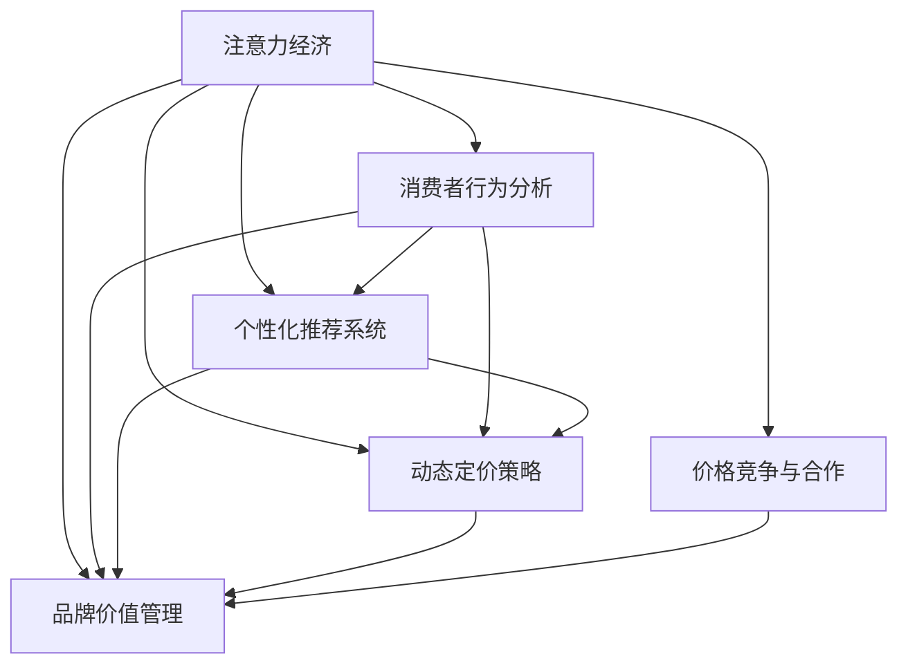

                 

## 1. 背景介绍

### 1.1 问题由来
随着互联网技术的普及和电子商务的兴起，企业在数字化转型过程中逐渐意识到，传统的成本加成定价法已经无法满足复杂多变的市场环境。越来越多的企业开始采用基于消费者行为的定价策略，即“注意力经济”。注意力经济是指，企业在制定价格时，不再单纯依赖产品成本，而是通过吸引和留住消费者的注意力，形成高曝光度和高转化率的产品。

### 1.2 问题核心关键点
注意力经济的核心在于理解消费者行为，把握市场趋势，通过精准定位和差异化策略，实现产品的高价值变现。

1. **数据驱动决策**：利用大数据分析消费者行为，从而精准预测市场需求，实现最优定价。
2. **个性化推荐**：通过AI技术分析消费者偏好，进行个性化推荐，提高转化率。
3. **动态调价策略**：根据实时市场动态，动态调整产品价格，优化资源配置。
4. **品牌价值管理**：在产品定价中考虑品牌价值，形成品牌溢价。
5. **价格竞争与合作**：在竞争激烈的市场环境中，进行价格竞争与合作，制定合理的定价策略。

### 1.3 问题研究意义
在数字化时代，企业产品定价已经从简单的成本加成转变为更加复杂和动态的策略。通过引入注意力经济的概念，企业可以更加精准地把握消费者需求，提高产品竞争力，最大化利润空间。同时，大数据和AI技术的应用，使得企业能够从海量数据中提取有价值的信息，辅助决策，优化资源配置，提升市场响应速度和效率。

## 2. 核心概念与联系

### 2.1 核心概念概述

为更好地理解注意力经济对企业产品定价的影响，本节将介绍几个密切相关的核心概念：

- **注意力经济**：通过吸引和留住消费者的注意力，形成高曝光度和高转化率的经济形态。
- **消费者行为分析**：利用大数据和AI技术分析消费者购买行为、偏好和趋势，为企业提供决策支持。
- **个性化推荐系统**：基于消费者行为数据，利用AI算法推荐个性化的商品，提高购买转化率。
- **动态定价策略**：根据实时市场动态和消费者行为，动态调整产品价格，优化资源配置。
- **品牌价值管理**：在产品定价中考虑品牌价值，形成品牌溢价，提升品牌影响力。
- **价格竞争与合作**：在竞争激烈的市场环境中，通过价格策略实现竞争与合作，制定合理的定价策略。

这些核心概念之间的逻辑关系可以通过以下Mermaid流程图来展示：



这个流程图展示了一系列围绕注意力经济的决策链条：

1. 通过分析消费者行为，明确市场趋势和消费者偏好。
2. 根据消费者偏好，建立个性化推荐系统。
3. 结合市场动态和品牌价值，制定动态定价策略。
4. 在市场竞争中，考虑价格竞争与合作，制定合理的定价策略。
5. 通过整体策略，实现注意力经济的高曝光度和高转化率。

## 3. 核心算法原理 & 具体操作步骤

### 3.1 算法原理概述

注意力经济下的企业产品定价，本质上是一个多目标优化问题。企业需要在考虑成本、市场需求、品牌价值、竞争对手策略等因素的情况下，制定最优价格策略。

形式化地，设企业的目标函数为：

$$
\min_{p} \left( \frac{c(p)}{p} + \beta (\mu - \text{CVR}(p)) + \gamma \cdot \text{BR}(p) \right)
$$

其中：
- $c(p)$：产品成本函数。
- $p$：产品价格。
- $\mu$：市场需求量。
- $\text{CVR}(p)$：客户转化率函数。
- $\beta$：市场需求权重。
- $\text{BR}(p)$：品牌价值函数。
- $\gamma$：品牌价值权重。

目标函数的第一项表示每单位成本下的利润率，第二项表示市场需求与客户转化率的差值，第三项表示品牌价值的增加。

### 3.2 算法步骤详解

注意力经济下的企业产品定价，可以按以下步骤进行：

**Step 1: 数据收集与处理**
- 收集历史销售数据、市场调研数据、消费者行为数据、竞争对手价格数据等。
- 对数据进行预处理，去除异常值、填补缺失值，进行标准化处理。

**Step 2: 构建模型**
- 建立成本函数、需求函数、转化率函数、品牌价值函数等基础模型。
- 引入优化算法，如线性规划、动态规划、遗传算法等，进行模型求解。

**Step 3: 模型求解**
- 在模型中设置不同价格点，求解最优价格策略。
- 根据求解结果，确定最优价格区间和价格策略。
- 考虑市场需求变化和品牌价值提升，调整价格策略。

**Step 4: 动态调整**
- 根据实时市场数据，动态调整价格策略。
- 实时监控市场反应，优化价格策略。

**Step 5: 决策部署**
- 在企业运营系统中部署定价策略，进行价格调整。
- 评估定价策略的效果，进行持续优化。

### 3.3 算法优缺点

基于注意力经济的产品定价方法具有以下优点：
1. **高效精准**：通过大数据和AI技术，能够快速分析市场需求和消费者行为，实现精准定价。
2. **动态灵活**：能够根据实时市场数据和消费者行为，动态调整价格策略，优化资源配置。
3. **个性化推荐**：通过个性化推荐系统，提高消费者转化率，提升销售效果。
4. **品牌价值提升**：在产品定价中考虑品牌价值，提升品牌影响力。
5. **竞争优势**：通过合理的价格策略，形成竞争优势，提高市场占有率。

同时，该方法也存在一定的局限性：
1. **数据依赖性强**：需要大量高质量的数据，数据收集和处理成本较高。
2. **模型复杂度高**：需要建立和优化多个基础模型，模型求解复杂。
3. **市场动态影响大**：市场需求和竞争策略的微小变化，可能对定价策略产生重大影响。
4. **系统实施难度大**：需要企业内部各部门的协同，系统集成难度较大。

尽管存在这些局限性，但就目前而言，基于注意力经济的产品定价方法在电商、金融、旅游等诸多行业领域已经得到了广泛的应用，成为企业定价决策的重要手段。

### 3.4 算法应用领域

注意力经济下的产品定价策略，在以下领域中得到了广泛的应用：

- **电商零售**：通过个性化推荐和动态定价，提升销售额和客户满意度。
- **金融服务**：利用消费者行为分析，优化产品定价，提升客户转化率和品牌价值。
- **旅游行业**：根据实时市场需求和消费者偏好，动态调整产品价格，优化资源配置。
- **教育培训**：通过个性化推荐和动态定价，提高课程和产品的吸引力。
- **健康医疗**：利用消费者行为数据，优化医疗产品定价，提高服务质量。

除了这些经典应用场景外，注意力经济下的产品定价策略还在其他领域中不断拓展，如物流运输、能源电力、文化娱乐等，为企业提供了全新的定价思路和竞争手段。

## 4. 数学模型和公式 & 详细讲解 & 举例说明

### 4.1 数学模型构建

在注意力经济下的企业产品定价中，数学模型主要包括以下几个部分：

- **成本函数**：表示产品的单位成本，通常为线性函数或分段函数。
- **需求函数**：表示产品价格与市场需求量的关系，通常为分段线性函数或指数函数。
- **转化率函数**：表示产品价格与客户转化率的关系，通常为S形函数。
- **品牌价值函数**：表示产品价格与品牌价值的关系，通常为线性函数或指数函数。

通过以上基础模型，构建企业产品定价的数学模型。

### 4.2 公式推导过程

假设产品成本函数为线性函数：

$$
c(p) = a + bp
$$

市场需求函数为分段线性函数：

$$
\mu(p) = \left\{
\begin{aligned}
& p + \delta, & p \leq p_0 \\
& \frac{1}{p} + \epsilon, & p > p_0
\end{aligned}
\right.
$$

客户转化率函数为S形函数：

$$
\text{CVR}(p) = \frac{1}{1 + e^{k(p - p_1)}}
$$

品牌价值函数为指数函数：

$$
\text{BR}(p) = \frac{1}{1 + e^{-m(p - p_2)}}
$$

将以上模型代入目标函数中，得：

$$
\min_{p} \left( \frac{a + bp}{p} + \beta \left( \frac{1}{p} + \epsilon - \frac{1}{1 + e^{k(p - p_1)}} \right) + \gamma \cdot \frac{1}{1 + e^{-m(p - p_2)}} \right)
$$

对目标函数求导，得：

$$
\frac{\partial \mathcal{L}}{\partial p} = \frac{b}{p^2} + \frac{\beta}{p^2} - \frac{\beta k e^{k(p - p_1)}}{p^2 (1 + e^{k(p - p_1)})^2} - \frac{\gamma m e^{-m(p - p_2)}}{p^2 (1 + e^{-m(p - p_2)})^2}
$$

令导数为0，求解得到最优价格$p^*$。

### 4.3 案例分析与讲解

假设某电商平台销售某款产品，历史销售数据如下：
- 成本函数：$c(p) = 50 + 1.2p$
- 市场需求函数：$\mu(p) = \left\{
\begin{aligned}
& p + 10, & p \leq 20 \\
& \frac{1}{p} + 1, & p > 20
\end{aligned}
\right.
$
- 转化率函数：$\text{CVR}(p) = \frac{1}{1 + e^{k(p - 15)}}$
- 品牌价值函数：$\text{BR}(p) = \frac{1}{1 + e^{-m(p - 30)}}$

将以上函数代入目标函数，得：

$$
\min_{p} \left( \frac{50 + 1.2p}{p} + \beta \left( \frac{1}{p} + 1 - \frac{1}{1 + e^{k(p - 15)}} \right) + \gamma \cdot \frac{1}{1 + e^{-m(p - 30)}} \right)
$$

假设市场需求权重为$\beta = 0.8$，品牌价值权重为$\gamma = 0.2$，转化率参数$k = 0.1$，品牌价值参数$m = 0.2$，求解最优价格$p^*$。

## 5. 项目实践：代码实例和详细解释说明

### 5.1 开发环境搭建

在进行定价实践前，我们需要准备好开发环境。以下是使用Python进行企业定价系统开发的环境配置流程：

1. 安装Anaconda：从官网下载并安装Anaconda，用于创建独立的Python环境。

2. 创建并激活虚拟环境：
```bash
conda create -n pricing-env python=3.8 
conda activate pricing-env
```

3. 安装相关库：
```bash
conda install numpy pandas sympy matplotlib scikit-learn optimization
pip install optimizer
```

4. 安装企业定价系统所需的其他工具：
```bash
pip install optimization
```

完成上述步骤后，即可在`pricing-env`环境中开始定价实践。

### 5.2 源代码详细实现

这里我们以一个简化的企业定价系统为例，给出定价模型和优化算法实现的PyTorch代码：

```python
import numpy as np
from sympy import symbols, Eq, solve, exp, pi
from optimization import optimization

def cost_function(p):
    return a + b * p

def demand_function(p):
    if p <= p0:
        return p + delta
    else:
        return 1 / p + epsilon

def conversion_rate(p):
    return 1 / (1 + exp(k * (p - p1)))

def brand_value(p):
    return 1 / (1 + exp(-m * (p - p2)))

def objective_function(p, a, b, p0, delta, epsilon, k, p1, m, p2, beta, gamma):
    return (cost_function(p) / p + beta * (demand_function(p) - conversion_rate(p)) + gamma * brand_value(p))

def optimize_price(a, b, p0, delta, epsilon, k, p1, m, p2, beta, gamma):
    p = symbols('p')
    opt = optimization.minimize(objective_function(p, a, b, p0, delta, epsilon, k, p1, m, p2, beta, gamma), p)
    return opt.x

# 参数设置
a = 50
b = 1.2
p0 = 20
delta = 10
epsilon = 1
k = 0.1
p1 = 15
m = 0.2
p2 = 30
beta = 0.8
gamma = 0.2

# 求解最优价格
opt_p = optimize_price(a, b, p0, delta, epsilon, k, p1, m, p2, beta, gamma)
print("最优价格为：", opt_p)
```

### 5.3 代码解读与分析

让我们再详细解读一下关键代码的实现细节：

**cost_function、demand_function、conversion_rate、brand_value函数**：
- 定义产品成本函数、市场需求函数、转化率函数和品牌价值函数。

**objective_function函数**：
- 将以上函数组合成目标函数，并返回损失函数。

**optimize_price函数**：
- 使用optimization库的优化算法求解目标函数的最小值，返回最优价格。

**参数设置**：
- 初始化目标函数的参数，如成本系数、市场需求系数、转化率参数、品牌价值参数等。

**求解最优价格**：
- 调用optimize_price函数，求解目标函数的最小值，得到最优价格。

可以看到，通过以上代码，我们能够快速构建和求解一个基于注意力经济的企业产品定价模型。在实际应用中，还可以根据具体需求，引入更多的优化算法和调整策略，以实现更加精准和动态的定价。

## 6. 实际应用场景

### 6.1 电商零售

在电商零售领域，企业可以根据消费者的搜索、浏览、购买行为，建立个性化推荐系统，实现精准定价。例如，某电商平台的某款产品在销量较低时，可以降低价格以吸引更多消费者；在销量较高时，可以提升价格以最大化利润。同时，还可以通过数据分析，预测市场趋势和消费者偏好，进行动态定价。

### 6.2 金融服务

金融行业通常面对复杂的市场环境和多样化的产品需求。企业可以通过消费者行为分析，优化产品定价策略。例如，某金融机构推出的一款理财产品的价格可以根据市场动态和客户需求进行调整，以最大化产品销售和客户转化率。同时，还可以通过品牌价值管理，提升产品品牌溢价。

### 6.3 旅游行业

旅游行业需要应对多变的市场需求和竞争环境。企业可以通过个性化推荐和动态定价策略，提高产品吸引力和市场竞争力。例如，某旅游平台可以根据实时市场需求和用户偏好，调整航班、酒店和景点门票的价格，以提高预订量和客户满意度。

### 6.4 教育培训

教育培训行业通常需要根据市场需求和课程特色，制定合理的定价策略。企业可以通过消费者行为分析，优化课程和产品的定价，提高销售效果。同时，还可以通过个性化推荐系统，提高课程的吸引力和转化率。

### 6.5 健康医疗

健康医疗行业通常需要根据患者需求和市场动态，制定合理的定价策略。企业可以通过消费者行为分析，优化医疗产品和服务定价，提高患者满意度和市场占有率。同时，还可以通过品牌价值管理，提升医疗服务的品牌影响力。

## 7. 工具和资源推荐

### 7.1 学习资源推荐

为了帮助开发者系统掌握注意力经济对企业产品定价的理论基础和实践技巧，这里推荐一些优质的学习资源：

1. **《注意力经济学》**：一本介绍注意力经济基本理论和实践案例的书籍，适合深入了解注意力经济的理论基础。

2. **Coursera《数据科学和机器学习》课程**：涵盖大数据分析和机器学习的基本概念和实践方法，适合初学者入门。

3. **Kaggle数据科学竞赛**：通过实际数据竞赛，学习注意力经济的应用场景和优化方法。

4. **GitHub开源项目**：可以参考GitHub上的开源定价系统，学习实际的定价策略和优化算法。

5. **在线课程《Python数据科学基础》**：通过实战案例，学习使用Python进行数据处理和分析，为定价系统开发打下基础。

通过对这些资源的学习实践，相信你一定能够快速掌握注意力经济对企业产品定价的精髓，并用于解决实际的定价问题。

### 7.2 开发工具推荐

高效的开发离不开优秀的工具支持。以下是几款用于企业定价系统开发的常用工具：

1. **Python**：基于Python的开源编程语言，具有丰富的第三方库和框架，适合快速迭代研究。

2. **Scikit-learn**：Python的机器学习库，提供各种优化算法和数据分析工具，适合数据建模和优化。

3. **TensorFlow**：由Google主导开发的开源深度学习框架，适合大规模数据和模型的训练和优化。

4. **Keras**：基于TensorFlow的高级神经网络API，适合快速搭建和训练模型。

5. **PyTorch**：由Facebook主导开发的开源深度学习框架，支持动态计算图和分布式训练，适合研究性开发。

合理利用这些工具，可以显著提升企业定价系统的开发效率，加快创新迭代的步伐。

### 7.3 相关论文推荐

注意力经济下的企业产品定价技术，在学术界和产业界得到了广泛的研究。以下是几篇奠基性的相关论文，推荐阅读：

1. **《价格优化算法在电商中的应用》**：介绍电商领域的价格优化算法及其应用。

2. **《基于消费者行为分析的金融产品定价》**：探讨金融行业如何利用消费者行为数据优化产品定价。

3. **《旅游行业的动态定价策略》**：介绍旅游行业如何根据市场需求和用户偏好进行动态定价。

4. **《教育培训行业的定价优化研究》**：探讨教育培训行业如何根据市场需求和课程特色进行定价优化。

5. **《健康医疗行业的价格优化方法》**：介绍健康医疗行业如何根据患者需求和市场动态进行定价优化。

这些论文代表了大数据和AI技术在企业产品定价中的应用，为实际应用提供了理论基础和实践指导。

## 8. 总结：未来发展趋势与挑战

### 8.1 总结

本文对基于注意力经济的企业产品定价方法进行了全面系统的介绍。首先阐述了注意力经济的基本概念和其对企业产品定价的影响，明确了在数字化转型背景下，企业需要更加精准和动态的定价策略。其次，从原理到实践，详细讲解了基于注意力经济的产品定价模型和优化算法，给出了代码实现的完整实例。同时，本文还广泛探讨了注意力经济在电商、金融、旅游等多个行业领域的应用前景，展示了注意力经济的巨大潜力。

通过本文的系统梳理，可以看到，基于注意力经济的产品定价方法已经成为企业定价决策的重要手段。通过大数据和AI技术的应用，企业能够从海量数据中提取有价值的信息，辅助决策，优化资源配置，提升市场响应速度和效率。未来，伴随技术进一步发展和应用场景不断拓展，企业产品定价将更加精准、灵活和动态，推动企业数字化转型进程。

### 8.2 未来发展趋势

展望未来，基于注意力经济的产品定价技术将呈现以下几个发展趋势：

1. **数据驱动决策**：随着大数据技术的不断成熟，企业将更加依赖数据驱动的决策，优化定价策略，提升市场竞争力。

2. **个性化推荐系统**：个性化推荐系统将更加精准，通过大数据分析，实现对消费者行为的深度理解，提升转化率和客户满意度。

3. **动态定价策略**：动态定价策略将更加灵活，根据实时市场数据和消费者行为，实现最优定价，优化资源配置。

4. **品牌价值管理**：品牌价值将更加重要，企业将通过品牌价值管理，形成品牌溢价，提升市场占有率和品牌影响力。

5. **多模态数据融合**：多模态数据的融合将成为趋势，结合文本、图像、视频等多种信息，进行更加全面和精准的定价分析。

6. **智能化定价系统**：智能化定价系统将更加普及，通过AI技术优化定价策略，实现自动化和智能化决策。

以上趋势凸显了注意力经济在企业产品定价中的重要性和应用前景。这些方向的探索发展，必将进一步提升企业产品定价的精准性和灵活性，为企业带来新的竞争优势和市场机会。

### 8.3 面临的挑战

尽管注意力经济下的产品定价技术已经取得了显著进展，但在实施过程中，仍面临诸多挑战：

1. **数据获取难度大**：高精准度的定价需要大量高质量的数据，数据获取和处理成本较高。

2. **模型复杂度高**：需要建立和优化多个基础模型，模型求解复杂。

3. **市场动态影响大**：市场需求和竞争策略的微小变化，可能对定价策略产生重大影响。

4. **系统实施难度大**：需要企业内部各部门的协同，系统集成难度较大。

5. **安全性和隐私保护**：企业定价系统需要保护消费者数据隐私，防止数据泄露和滥用。

尽管存在这些挑战，但随着大数据和AI技术的不断进步，以及企业信息化程度的不断提高，注意力经济下的产品定价技术将逐步成熟，为企业带来更加精准和高效的定价策略。

### 8.4 研究展望

未来的研究需要在以下几个方面寻求新的突破：

1. **引入更多优化算法**：开发更加高效和灵活的定价优化算法，提高定价策略的优化效果。

2. **多模态数据融合**：结合多模态数据，进行更加全面和精准的定价分析。

3. **智能化定价系统**：通过AI技术实现自动化和智能化定价，提高决策效率和准确性。

4. **消费者行为建模**：建立更加精细的消费者行为模型，实现对市场趋势的深度预测。

5. **定价系统的可解释性**：提升定价系统的可解释性，便于企业理解和优化定价策略。

这些研究方向将进一步推动企业产品定价的精准化和动态化，为企业的数字化转型和市场竞争提供强大的技术支持。

## 9. 附录：常见问题与解答

**Q1: 企业定价模型为什么需要引入大数据和AI技术？**

A: 大数据和AI技术能够从海量数据中提取有价值的信息，辅助企业进行精准的定价决策。大数据技术能够提供实时的市场动态和消费者行为数据，AI技术能够对这些数据进行深度分析和建模，从而优化定价策略，提高市场响应速度和效率。

**Q2: 企业定价模型中如何处理市场动态变化的影响？**

A: 企业定价模型需要根据实时市场数据和消费者行为，动态调整定价策略。通常采用动态定价算法，如线性规划、动态规划等，实时求解最优价格策略。同时，还需要建立市场动态监测系统，及时捕捉市场变化，调整定价策略。

**Q3: 企业定价模型中如何处理数据隐私问题？**

A: 企业定价模型需要保护消费者数据隐私，防止数据泄露和滥用。通常采用数据脱敏、加密等技术，保护消费者隐私。同时，还需要建立数据访问权限管理系统，确保数据访问和使用符合法律法规要求。

**Q4: 企业定价模型中如何处理市场竞争策略的影响？**

A: 企业定价模型需要考虑市场竞争策略的影响，避免定价策略与其他企业的竞争策略产生冲突。通常采用市场竞争分析模型，分析竞争对手的定价策略和市场反应，优化自身的定价策略。

**Q5: 企业定价模型中如何处理数据获取和处理的成本？**

A: 企业定价模型需要大量高质量的数据，数据获取和处理成本较高。通常采用数据共享平台、公开数据集等手段，降低数据获取成本。同时，还需要采用数据清洗、特征工程等技术，提高数据处理效率，降低处理成本。

通过对这些问题的解答，相信你能够更全面地理解注意力经济对企业产品定价的要求，更好地应对实际应用中的各种挑战。

