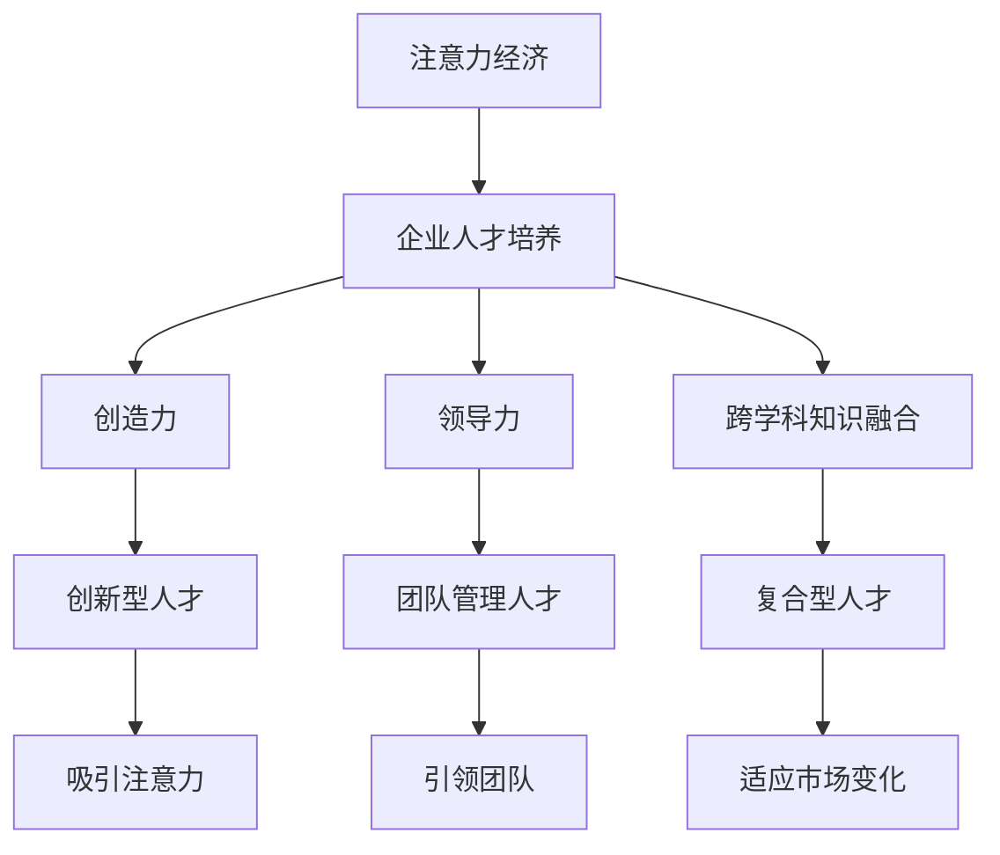

                 

# 注意力经济对企业人才培养的新要求

> 关键词：注意力经济, 企业人才, 人才培养, 新要求

## 1. 背景介绍

### 1.1 问题由来

在信息爆炸和消费行为多元化的时代，注意力经济（Economy of Attention）正成为驱动经济增长和价值创造的重要因素。互联网企业和传统行业的融合与转型，使得注意力资源的争夺愈发激烈，企业和组织在市场竞争中面临着前所未有的压力。在这个背景下，如何通过企业人才培养，培育能够吸引和利用注意力资源的人才，成为现代企业管理的新课题。

### 1.2 问题核心关键点

注意力经济要求企业不仅要培养技术人才，更需要注重人才的创造力、领导力和沟通能力，以适应快速变化的市场环境。此外，创新型人才的培养需要更加注重跨学科、跨领域的知识融合，以及在实际问题解决中的能力提升。在实践中，传统的人才培养方式逐渐显现出其局限性，亟需适应新经济环境的人才培养模式。

### 1.3 问题研究意义

研究注意力经济对企业人才培养的新要求，有助于企业明确人才需求，制定更加科学合理的人才培养策略。通过深入了解新经济环境下的核心能力要求，企业可以优化培训计划，提高人才市场竞争力，实现企业可持续发展。

## 2. 核心概念与联系

### 2.1 核心概念概述

为更好地理解注意力经济下企业人才培养的新要求，本节将介绍几个关键概念：

- **注意力经济（Economy of Attention）**：指的是在信息过载的社会中，注意力作为一种稀缺资源，成为经济价值的关键要素。企业和组织需要争夺和利用消费者的注意力，以实现商业价值最大化。

- **企业人才培养（Corporate Talent Development）**：指企业通过培训、教育等方式，提升员工的知识、技能和能力，以适应企业战略发展需求和市场环境变化。

- **创造力（Creativity）**：指个人或团队在问题解决和产品开发中产生新颖、独特的想法和解决方案的能力。在注意力经济中，创造力是吸引和保持消费者注意力的重要因素。

- **领导力（Leadership）**：指指导和管理团队，实现组织目标的能力。在市场竞争激烈的注意力经济中，领导力对人才的成长和企业的创新具有重要意义。

- **跨学科知识融合（Interdisciplinary Knowledge Integration）**：指将不同学科的知识和技能相结合，培养具有综合能力的复合型人才。跨学科知识融合有助于应对复杂的现实问题，提升人才的创新能力和适应性。

### 2.2 核心概念原理和架构的 Mermaid 流程图



这个流程图展示了注意力经济和企业人才培养之间的关系，以及关键能力如何在人才中得以体现和提升。

## 3. 核心算法原理 & 具体操作步骤

### 3.1 算法原理概述

在注意力经济下，企业人才培养的核心在于如何培养能够吸引和利用注意力资源的人才。这一过程可以分为两个主要步骤：

1. **需求分析**：明确企业对人才的需求，识别关键岗位和能力要求。
2. **人才培养**：制定和实施针对性的培养计划，提升员工的创造力、领导力和跨学科知识融合能力。

### 3.2 算法步骤详解

#### 3.2.1 需求分析

- **岗位需求分析**：识别企业核心岗位的关键能力要求，例如数据分析、产品设计、市场营销等。
- **技能评估**：对现有员工的技能进行评估，找出技能缺口和提升空间。
- **市场需求调研**：了解行业和市场对相关技能的需求趋势，调整培养方向。

#### 3.2.2 人才培养

- **定制化培训**：根据岗位需求和技能评估结果，设计定制化培训课程。
- **跨学科学习**：鼓励员工学习跨学科知识，增强综合能力。
- **实践项目**：通过实际项目和案例分析，培养员工解决实际问题的能力。
- **反馈与迭代**：定期收集员工反馈，优化培训计划，确保培训效果。

### 3.3 算法优缺点

#### 3.3.1 优点

- **针对性提升**：通过定制化培训，可以针对性地提升员工的核心能力，满足企业发展需求。
- **跨学科融合**：跨学科学习有助于培养具有综合能力的复合型人才，提高员工在复杂环境中的适应性和创新能力。
- **实践导向**：实践项目和案例分析有助于将理论知识转化为实际操作能力，提升员工的实际应用能力。

#### 3.3.2 缺点

- **培训成本高**：定制化培训和跨学科学习需要投入较多的时间和资源。
- **效果难以量化**：员工能力的提升和创新成果的评估较为复杂，难以量化衡量。
- **持续投入**：人才的培养是一个长期过程，企业需要持续投入时间和资源。

### 3.4 算法应用领域

注意力经济下企业人才培养的策略广泛应用于各个行业，例如：

- **互联网企业**：注重用户体验和产品创新的互联网企业，需要培养具有创造力和跨学科知识的人才，以应对快速变化的市场需求。
- **传统制造业**：在智能制造和工业互联网的推动下，传统制造业也需要培养能够理解和应用先进技术的人才。
- **金融行业**：面对市场环境的不确定性，金融行业需要培养具有市场敏锐度和风险管理能力的人才。
- **医疗健康**：在数字健康和远程医疗的普及下，医疗健康行业需要培养能够运用数字化技术的人才。

## 4. 数学模型和公式 & 详细讲解 & 举例说明

### 4.1 数学模型构建

在企业人才培养中，数学模型和公式可以帮助企业更科学地评估和优化人才培养计划。以下是一个简单的数学模型，用于计算员工在培训前后能力提升的平均效果：

假设员工初始能力为 $C_0$，培训后能力提升至 $C_1$，提升比例为 $P$，则提升效果的计算公式为：

$$ P = \frac{C_1 - C_0}{C_0} $$

在实际应用中，可以通过问卷调查、技能测试等方式获取员工能力提升的具体数据，从而计算出平均提升效果 $P$。

### 4.2 公式推导过程

在公式推导过程中，我们假设员工的能力提升是线性的，即培训后能力提升与培训时间成正比。这虽然是一个简化的模型，但在实际操作中具有一定的参考价值。

通过公式推导，我们可以得知，员工能力提升的关键在于培训的时间和质量。因此，企业需要设计高质效的培训课程，确保员工能够系统地掌握相关知识和技能。

### 4.3 案例分析与讲解

**案例：某互联网企业的产品经理培训计划**

某互联网企业决定为其产品经理团队实施一次全面培训，目标是提升其产品设计和用户体验的能力。通过市场调研，企业发现产品经理需要具备数据分析、用户研究和设计思维等多方面的知识。

- **培训内容设计**：企业邀请了数据分析、用户研究和设计思维等领域的专家，设计了一系列培训课程，包括数据分析工具使用、用户行为分析、设计思维方法等。
- **培训效果评估**：培训结束后，企业通过技能测试和项目实战，评估了产品经理在培训前后的能力提升情况。结果显示，经过培训，团队整体在用户研究和设计思维方面的能力有了显著提升。

通过这个案例，我们可以看到，企业可以通过科学合理的培训计划，有效地提升员工的核心能力，满足企业发展需求。

## 5. 项目实践：代码实例和详细解释说明

### 5.1 开发环境搭建

在进行人才培养项目的开发前，我们需要准备好开发环境。以下是使用Python进行PyTorch开发的环境配置流程：

1. 安装Anaconda：从官网下载并安装Anaconda，用于创建独立的Python环境。

2. 创建并激活虚拟环境：
```bash
conda create -n pytorch-env python=3.8 
conda activate pytorch-env
```

3. 安装PyTorch：根据CUDA版本，从官网获取对应的安装命令。例如：
```bash
conda install pytorch torchvision torchaudio cudatoolkit=11.1 -c pytorch -c conda-forge
```

4. 安装Transformers库：
```bash
pip install transformers
```

5. 安装各类工具包：
```bash
pip install numpy pandas scikit-learn matplotlib tqdm jupyter notebook ipython
```

完成上述步骤后，即可在`pytorch-env`环境中开始人才培养项目的开发。

### 5.2 源代码详细实现

这里以培养产品经理团队的案例为例，给出使用Transformers库进行人才培养的PyTorch代码实现。

首先，定义培训任务的数据处理函数：

```python
from transformers import BertTokenizer
from torch.utils.data import Dataset
import torch

class TrainingDataset(Dataset):
    def __init__(self, data, tokenizer):
        self.data = data
        self.tokenizer = tokenizer
    
    def __len__(self):
        return len(self.data)
    
    def __getitem__(self, item):
        text = self.data[item]
        encoding = self.tokenizer(text, return_tensors='pt')
        return {'input_ids': encoding['input_ids']}
```

然后，定义模型和优化器：

```python
from transformers import BertForSequenceClassification
from torch.optim import AdamW

model = BertForSequenceClassification.from_pretrained('bert-base-uncased', num_labels=2)
optimizer = AdamW(model.parameters(), lr=2e-5)
```

接着，定义训练和评估函数：

```python
from sklearn.metrics import accuracy_score

def train(model, dataset, batch_size, optimizer, num_epochs):
    model.train()
    total_loss = 0
    for epoch in range(num_epochs):
        for batch in dataset:
            inputs = batch['input_ids'].to(device)
            labels = inputs.new_ones(inputs.shape[0]).to(device)
            outputs = model(inputs)
            loss = outputs[0]
            loss.backward()
            optimizer.step()
            optimizer.zero_grad()
            total_loss += loss.item()
    return total_loss / len(dataset)

def evaluate(model, dataset, batch_size):
    model.eval()
    total_correct = 0
    total_predictions = 0
    for batch in dataset:
        inputs = batch['input_ids'].to(device)
        outputs = model(inputs)
        predictions = torch.argmax(outputs[0], dim=1)
        total_correct += (predictions == labels).sum().item()
        total_predictions += predictions.shape[0]
    return accuracy_score(labels, predictions)
```

最后，启动培训流程并在测试集上评估：

```python
from torch.utils.data import DataLoader

device = torch.device('cuda') if torch.cuda.is_available() else torch.device('cpu')

# 创建dataset
train_data = ['user research', 'data analysis', 'user experience design']
train_dataset = TrainingDataset(train_data, tokenizer)
test_data = ['product launch', 'usability testing', 'product feedback']
test_dataset = TrainingDataset(test_data, tokenizer)

train_loader = DataLoader(train_dataset, batch_size=2, shuffle=True)
test_loader = DataLoader(test_dataset, batch_size=2)

num_epochs = 5

for epoch in range(num_epochs):
    loss = train(model, train_loader, batch_size, optimizer, num_epochs)
    print(f'Epoch {epoch+1}, loss: {loss:.3f}')
    
accuracy = evaluate(model, test_loader, batch_size)
print(f'Accuracy on test set: {accuracy:.2f}')
```

以上就是使用PyTorch对产品经理团队进行人才培养的完整代码实现。可以看到，得益于Transformers库的强大封装，我们可以用相对简洁的代码完成模型的加载和培训。

### 5.3 代码解读与分析

让我们再详细解读一下关键代码的实现细节：

**TrainingDataset类**：
- `__init__`方法：初始化数据和分词器等组件。
- `__len__`方法：返回数据集的样本数量。
- `__getitem__`方法：对单个样本进行处理，将文本输入编码为token ids，返回模型所需的输入。

**模型和优化器定义**：
- 使用BertForSequenceClassification模型作为初始化参数，设置二分类任务。
- 使用AdamW优化器，设置学习率。

**训练和评估函数**：
- 使用PyTorch的DataLoader对数据集进行批次化加载。
- 训练函数`train`：对数据以批为单位进行迭代，计算loss并更新模型参数。
- 评估函数`evaluate`：评估模型在测试集上的预测准确率。

**训练流程**：
- 定义总的epoch数和batch size，开始循环迭代。
- 每个epoch内，先在训练集上训练，输出loss。
- 在测试集上评估模型准确率。
- 所有epoch结束后，给出测试集上的准确率。

可以看到，PyTorch配合Transformers库使得产品经理团队培训的代码实现变得简洁高效。开发者可以将更多精力放在数据处理、模型改进等高层逻辑上，而不必过多关注底层的实现细节。

当然，工业级的系统实现还需考虑更多因素，如模型的保存和部署、超参数的自动搜索、更灵活的任务适配层等。但核心的培养范式基本与此类似。

## 6. 实际应用场景

### 6.1 互联网企业的产品经理

在互联网企业中，产品经理团队是产品创新的核心力量。他们不仅需要具备数据分析、用户研究和设计思维等核心能力，还需要有很强的创新意识和跨领域协作能力。企业可以通过针对产品经理的专项培训，提升其产品设计和用户体验的能力，从而推动产品创新和市场竞争力的提升。

### 6.2 传统制造业的生产经理

在智能制造和工业互联网的推动下，传统制造业的生产经理需要掌握新的生产技术和质量管理方法，以提升生产效率和产品质量。企业可以针对生产经理进行专项培训，提升其数据分析和质量控制能力，使其能够更好地适应智能化的生产环境。

### 6.3 金融行业的研究分析师

金融行业的研究分析师需要具备数据分析和市场预测能力，以支持投资决策和风险管理。企业可以通过培训提升研究分析师的模型建立和预测能力，使其能够更好地应对市场变化，提升投资回报率。

### 6.4 医疗健康的数据科学家

在数字健康和远程医疗的普及下，医疗健康行业的数据科学家需要掌握数据分析和机器学习技术，以支持医疗决策和健康管理。企业可以针对数据科学家进行专项培训，提升其数据挖掘和模型建立能力，使其能够更好地应对健康数据的管理和分析需求。

### 6.5 教育行业的教师

在教育数字化转型的背景下，教师需要掌握在线教学技术和教育数据分析方法，以提升教学效果和学生学习体验。企业可以针对教师进行专项培训，提升其在线教学和数据驱动教学能力，使其能够更好地适应数字化教育环境。

## 7. 工具和资源推荐

### 7.1 学习资源推荐

为了帮助开发者系统掌握注意力经济下企业人才培养的理论基础和实践技巧，这里推荐一些优质的学习资源：

1. **《注意力经济与企业创新》系列博文**：由注意力经济专家撰写，深入浅出地介绍了注意力经济的基本原理和应用场景。

2. **Coursera《数字创新与企业家精神》课程**：斯坦福大学开设的跨学科课程，涵盖创业、设计思维、市场分析等多个领域，适合企业人才培养的实践者。

3. **《未来工作：技能、知识和创业精神》书籍**：探讨未来工作环境的变革和技能需求，提供企业人才培养的实践案例和策略。

4. **Google云教育平台**：提供免费的在线课程和认证项目，涵盖数据科学、人工智能、用户体验设计等多个领域，适合企业人才培养。

5. **Udacity《数据科学导论》课程**：系统介绍数据科学的基本概念和应用方法，提供数据科学家的职业发展路径和实践项目。

通过对这些资源的学习实践，相信你一定能够快速掌握注意力经济下企业人才培养的精髓，并用于解决实际的业务问题。

### 7.2 开发工具推荐

高效的开发离不开优秀的工具支持。以下是几款用于企业人才培养开发的常用工具：

1. **Jupyter Notebook**：免费的在线笔记本工具，支持Python和其他多种语言，适合进行数据处理、模型训练和项目实践。

2. **PyTorch**：基于Python的开源深度学习框架，灵活动态的计算图，适合快速迭代研究。

3. **TensorFlow**：由Google主导开发的开源深度学习框架，生产部署方便，适合大规模工程应用。

4. **Transformers库**：HuggingFace开发的NLP工具库，集成了众多SOTA语言模型，支持PyTorch和TensorFlow，是进行人才培养任务开发的利器。

5. **Weights & Biases**：模型训练的实验跟踪工具，可以记录和可视化模型训练过程中的各项指标，方便对比和调优。与主流深度学习框架无缝集成。

6. **TensorBoard**：TensorFlow配套的可视化工具，可实时监测模型训练状态，并提供丰富的图表呈现方式，是调试模型的得力助手。

合理利用这些工具，可以显著提升企业人才培养任务的开发效率，加快创新迭代的步伐。

### 7.3 相关论文推荐

注意力经济下企业人才培养的研究源于学界的持续研究。以下是几篇奠基性的相关论文，推荐阅读：

1. **《注意力经济与企业创新：理论、实践与挑战》**：探讨注意力经济的基本原理和应用，提供企业创新的实践案例和策略。

2. **《数据科学与企业人才培养：方法和策略》**：系统介绍数据科学和人工智能的基本概念和应用方法，提供企业人才培养的实践案例和策略。

3. **《跨学科学习与企业人才培养：理论、实践与未来》**：探讨跨学科学习在企业人才培养中的重要性，提供跨学科学习的实践案例和未来发展方向。

4. **《创造力与企业人才培养：理论、实践与未来》**：探讨创造力在企业人才培养中的重要性，提供培养创造力的实践案例和未来发展方向。

5. **《领导力与企业人才培养：理论、实践与未来》**：探讨领导力在企业人才培养中的重要性，提供培养领导力的实践案例和未来发展方向。

这些论文代表了大语言模型微调技术的发展脉络。通过学习这些前沿成果，可以帮助研究者把握学科前进方向，激发更多的创新灵感。

## 8. 总结：未来发展趋势与挑战

### 8.1 总结

本文对注意力经济下企业人才培养的新要求进行了全面系统的介绍。首先阐述了注意力经济对企业人才培养的影响，明确了企业需求分析的重要性。其次，从原理到实践，详细讲解了人才培养的数学模型和关键步骤，给出了人才培养任务开发的完整代码实例。同时，本文还广泛探讨了人才培养在多个行业领域的应用前景，展示了人才培养范式的巨大潜力。

通过本文的系统梳理，可以看到，注意力经济下企业人才培养策略在现代企业管理中具有重要意义。企业需要根据市场需求和人才特点，制定科学合理的人才培养计划，提升员工的核心能力，从而适应快速变化的市场环境。

### 8.2 未来发展趋势

展望未来，企业人才培养的趋势将呈现以下几个方面：

1. **跨学科融合**：跨学科学习将成为企业人才培养的重要方向，培养具有综合能力的复合型人才。
2. **数据驱动**：数据分析和数据科学将贯穿整个培养过程，提升员工在复杂环境中的决策能力和问题解决能力。
3. **实践导向**：实际项目和案例分析将成为人才培养的重要手段，提升员工的实践能力和创新意识。
4. **个性化培养**：根据员工的个性化需求和职业规划，制定个性化的培养计划，提升员工的发展潜力和职业满意度。
5. **终身学习**：员工的知识和技能需要持续更新，企业将建立持续学习机制，推动员工职业发展。
6. **创新驱动**：鼓励员工的创新思维和创新实践，提升企业在市场竞争中的创新能力和竞争力。

这些趋势凸显了注意力经济下企业人才培养的战略意义。企业需要从根本上变革人才培养策略，培养具备跨学科知识、数据驱动能力、实践能力和创新意识的人才，以适应未来市场的发展需求。

### 8.3 面临的挑战

尽管注意力经济下企业人才培养策略已经取得了显著成效，但在实施过程中仍面临诸多挑战：

1. **培训成本高**：定制化培训和跨学科学习需要投入较多的时间和资源。企业需要平衡培训成本和培训效果。
2. **效果难以量化**：员工能力的提升和创新成果的评估较为复杂，难以量化衡量。企业需要建立科学的评估机制。
3. **持续投入**：人才的培养是一个长期过程，企业需要持续投入时间和资源。如何平衡短期和长期效益。
4. **创新压力大**：市场环境变化快，企业需要不断创新人才培养策略，适应新的市场需求。
5. **知识更新快**：技术迭代快，员工需要不断学习新知识，更新技能。企业需要提供持续学习的机会和支持。

### 8.4 研究展望

面对企业人才培养面临的挑战，未来的研究需要在以下几个方面寻求新的突破：

1. **大数据驱动**：利用大数据分析技术，科学评估和优化人才培养策略，提升培训效果。
2. **个性化培养**：根据员工的个性化需求和职业规划，制定个性化的培养计划，提升员工的发展潜力和职业满意度。
3. **跨学科融合**：探索跨学科学习与企业人才培养的深度融合，提升员工的综合能力和创新能力。
4. **数据驱动决策**：利用数据驱动决策，优化培训计划的制定和实施，提升人才培养的科学性和有效性。
5. **创新驱动**：鼓励员工的创新思维和创新实践，提升企业在市场竞争中的创新能力和竞争力。

这些研究方向的探索，必将引领企业人才培养策略迈向更高的台阶，为现代企业管理注入新的活力。

## 9. 附录：常见问题与解答

**Q1：企业如何进行注意力经济下的人才培养？**

A: 企业可以通过以下步骤进行注意力经济下的人才培养：
1. 明确岗位需求，识别关键能力要求。
2. 设计定制化培训课程，提升员工的核心能力。
3. 鼓励员工跨学科学习，增强综合能力。
4. 通过实际项目和案例分析，提升员工的实践能力。
5. 定期收集员工反馈，优化培训计划，确保培训效果。

**Q2：注意力经济下企业人才培养需要注意哪些问题？**

A: 企业在进行人才培养时需要注意以下问题：
1. 培训成本高，需要平衡培训成本和培训效果。
2. 员工能力的提升和创新成果的评估较为复杂，难以量化衡量。
3. 持续投入时间和资源，平衡短期和长期效益。
4. 市场环境变化快，需要不断创新人才培养策略，适应新的市场需求。
5. 技术迭代快，员工需要不断学习新知识，更新技能。

**Q3：如何利用数据驱动优化企业人才培养？**

A: 利用数据驱动优化企业人才培养的方法包括：
1. 收集和分析员工能力提升的统计数据，评估培训效果。
2. 利用大数据分析技术，科学评估和优化人才培养策略。
3. 根据员工的学习记录和职业规划，制定个性化的培养计划。
4. 利用数据驱动决策，优化培训计划的制定和实施，提升培训效果。

**Q4：企业如何进行跨学科融合培养人才？**

A: 企业进行跨学科融合培养人才的方法包括：
1. 设计跨学科课程，涵盖多个领域的知识和技能。
2. 鼓励员工参与跨学科项目，实践跨学科思维和技能。
3. 利用跨学科案例分析，提升员工的综合能力和创新能力。
4. 建立跨学科学习社区，促进不同学科之间的交流和合作。

通过这些方法，企业可以培养具备跨学科知识和技能，适应复杂环境的人才，提升企业的创新能力和市场竞争力。

---

作者：禅与计算机程序设计艺术 / Zen and the Art of Computer Programming

