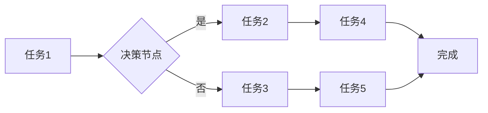

> AI代理，工作流，性能监控，指标分析，机器学习，深度学习，自然语言处理，数据可视化

## 1. 背景介绍

随着人工智能技术的飞速发展，AI代理（AI Agent）作为一种能够自主学习、决策和执行任务的智能实体，在各个领域得到了广泛的应用。从智能客服到自动驾驶，从医疗诊断到金融交易，AI代理正在改变着我们的生活方式和工作模式。

然而，随着AI代理应用场景的不断扩展，对其性能的监控和分析变得尤为重要。只有对AI代理的性能进行有效的监控和分析，才能确保其能够稳定、高效地完成任务，并不断提升其智能水平。

本篇文章将深入探讨AI代理工作流的性能监控指标与分析技术，旨在为开发者和研究者提供一个全面的理解和实践指南。

## 2. 核心概念与联系

**2.1 AI代理工作流**

AI代理工作流是指AI代理在执行任务过程中所遵循的一系列步骤或流程。它通常由多个任务节点组成，每个节点代表一个特定的操作或决策。AI代理需要根据预先定义的规则或策略，在各个节点之间进行跳转，最终完成整个任务。

**2.2 性能监控指标**

性能监控指标是用来评估AI代理工作流运行效率和效果的标准。常见的性能监控指标包括：

* **任务完成时间:** 指AI代理完成整个任务所花费的时间。
* **任务成功率:** 指AI代理成功完成任务的比例。
* **资源消耗:** 指AI代理执行任务过程中消耗的计算资源、内存资源等。
* **错误率:** 指AI代理执行过程中出现的错误数量或比例。
* **用户满意度:** 指用户对AI代理服务体验的评价。

**2.3 性能分析技术**

性能分析技术是指利用各种工具和方法，对AI代理工作流的性能数据进行分析和挖掘，以发现性能瓶颈、优化工作流程、提升系统效率。常见的性能分析技术包括：

* **数据可视化:** 通过图表、图形等方式，直观地展示AI代理工作流的性能数据，帮助用户快速了解系统运行状况。
* **统计分析:** 对性能数据进行统计分析，计算平均值、标准差等指标，发现数据分布规律和异常情况。
* **机器学习:** 利用机器学习算法，对性能数据进行预测和分析，识别潜在的性能问题，并提供优化建议。

**2.4 Mermaid 流程图**



## 3. 核心算法原理 & 具体操作步骤

### 3.1  算法原理概述

本节将介绍一种用于AI代理性能监控的机器学习算法，例如基于时间序列预测的算法。该算法可以根据历史性能数据，预测未来AI代理工作流的性能指标，并及时发出预警，帮助用户提前采取措施，避免性能问题。

### 3.2  算法步骤详解

1. **数据收集:** 收集AI代理工作流的历史性能数据，包括任务完成时间、任务成功率、资源消耗等指标。
2. **数据预处理:** 对收集到的数据进行清洗、转换和特征工程，例如处理缺失值、归一化数据、提取时间特征等。
3. **模型训练:** 选择合适的机器学习模型，例如ARIMA、LSTM等，对预处理后的数据进行训练，建立性能预测模型。
4. **模型评估:** 使用测试数据对训练好的模型进行评估，评估模型的预测精度和鲁棒性。
5. **性能预测:** 将最新的性能数据输入到训练好的模型中，预测未来AI代理工作流的性能指标。
6. **预警机制:** 设置预警阈值，当预测的性能指标超过预警阈值时，触发预警机制，通知相关人员采取措施。

### 3.3  算法优缺点

**优点:**

* 能够准确预测未来AI代理工作流的性能指标。
* 可以提前发现潜在的性能问题，避免系统崩溃或服务中断。
* 可以帮助用户优化工作流程，提升系统效率。

**缺点:**

* 需要大量的历史性能数据进行训练。
* 模型的训练和评估需要一定的专业知识和技术能力。
* 模型的预测精度受数据质量和模型选择的影响。

### 3.4  算法应用领域

* **云计算平台:** 预测虚拟机资源消耗，优化资源分配。
* **金融交易系统:** 预测交易系统性能，避免交易失败。
* **医疗诊断系统:** 预测诊断系统运行时间，确保及时诊断。
* **智能客服系统:** 预测客服系统响应时间，提升用户体验。

## 4. 数学模型和公式 & 详细讲解 & 举例说明

### 4.1  数学模型构建

假设我们想要预测AI代理工作流的任务完成时间。我们可以使用ARIMA模型来构建数学模型。ARIMA模型是一种时间序列预测模型，它假设时间序列数据具有自回归性、移动平均性和季节性。

ARIMA模型的数学公式如下：

$$
y_t = c + \phi_1 y_{t-1} + \phi_2 y_{t-2} + ... + \phi_p y_{t-p} + \theta_1 \epsilon_{t-1} + \theta_2 \epsilon_{t-2} + ... + \theta_q \epsilon_{t-q} + \epsilon_t
$$

其中：

* $y_t$ 是时间t的任务完成时间。
* $c$ 是截距项。
* $\phi_i$ 是自回归系数。
* $p$ 是自回归阶数。
* $\theta_i$ 是移动平均系数。
* $q$ 是移动平均阶数。
* $\epsilon_t$ 是随机误差项。

### 4.2  公式推导过程

ARIMA模型的推导过程比较复杂，需要一定的统计学和数学基础。这里不再详细介绍，可以参考相关书籍和论文进行学习。

### 4.3  案例分析与讲解

假设我们收集了AI代理工作流的任务完成时间数据，并使用ARIMA模型进行训练。训练结果表明，模型的预测精度较高。我们可以使用训练好的模型，预测未来AI代理工作流的任务完成时间，并根据预测结果，采取相应的措施，例如调整工作流程、增加资源分配等。

## 5. 项目实践：代码实例和详细解释说明

### 5.1  开发环境搭建

本项目使用Python语言进行开发，需要安装以下软件包：

* pandas
* numpy
* statsmodels
* matplotlib

### 5.2  源代码详细实现

```python
import pandas as pd
from statsmodels.tsa.arima.model import ARIMA
import matplotlib.pyplot as plt

# 加载数据
data = pd.read_csv('task_completion_time.csv', index_col='timestamp')

# 训练ARIMA模型
model = ARIMA(data['task_completion_time'], order=(5,1,0))
model_fit = model.fit()

# 预测未来一周的任务完成时间
forecast = model_fit.predict(start=len(data), end=len(data)+6)

# 可视化预测结果
plt.plot(data['task_completion_time'], label='历史数据')
plt.plot(forecast, label='预测结果')
plt.legend()
plt.show()
```

### 5.3  代码解读与分析

* 首先，我们使用pandas库加载任务完成时间数据。
* 然后，我们使用statsmodels库中的ARIMA模型训练模型。
* 训练好的模型可以用来预测未来任务完成时间。
* 最后，我们使用matplotlib库可视化预测结果。

### 5.4  运行结果展示

运行代码后，会生成一个图表，展示历史任务完成时间数据和预测结果。

## 6. 实际应用场景

### 6.1  云计算平台

在云计算平台中，AI代理可以用于自动分配资源、监控资源使用情况、优化资源调度等。通过对AI代理工作流的性能监控，可以及时发现资源瓶颈，并采取措施进行调整，确保平台的稳定运行和资源利用率。

### 6.2  金融交易系统

在金融交易系统中，AI代理可以用于自动执行交易、监控市场风险、识别异常交易等。通过对AI代理工作流的性能监控，可以及时发现交易系统性能问题，避免交易失败或损失。

### 6.3  医疗诊断系统

在医疗诊断系统中，AI代理可以用于辅助医生诊断疾病、分析患者数据、推荐治疗方案等。通过对AI代理工作流的性能监控，可以确保诊断系统的准确性和效率，提高医疗服务质量。

### 6.4  未来应用展望

随着人工智能技术的不断发展，AI代理将在更多领域得到应用。例如，在自动驾驶、机器人、智能家居等领域，AI代理将发挥越来越重要的作用。

## 7. 工具和资源推荐

### 7.1  学习资源推荐

* **书籍:**
    * 《人工智能：现代方法》
    * 《深度学习》
    * 《机器学习》
* **在线课程:**
    * Coursera
    * edX
    * Udacity

### 7.2  开发工具推荐

* **Python:** 
    * pandas
    * numpy
    * scikit-learn
    * TensorFlow
    * PyTorch
* **监控工具:**
    * Prometheus
    * Grafana
    * ELK Stack

### 7.3  相关论文推荐

* **论文:**
    * 《Reinforcement Learning: An Introduction》
    * 《Deep Learning》
    * 《Generative Adversarial Networks》

## 8. 总结：未来发展趋势与挑战

### 8.1  研究成果总结

本篇文章介绍了AI代理工作流的性能监控指标与分析技术，并探讨了相关的算法原理、代码实现和实际应用场景。

### 8.2  未来发展趋势

未来，AI代理性能监控技术将朝着以下方向发展：

* **更精准的预测:** 利用更先进的机器学习算法，提高性能预测的准确性。
* **更全面的监控:** 监控更多类型的性能指标，例如用户体验、安全风险等。
* **更智能的分析:** 利用人工智能技术，自动分析性能数据，发现隐藏的性能问题。
* **更自动化化的操作:** 自动化性能监控和优化操作，减少人工干预。

### 8.3  面临的挑战

AI代理性能监控技术也面临一些挑战：

* **数据质量:** 性能监控需要大量高质量的数据，而获取高质量数据的难度较大。
* **模型复杂度:** 随着模型复杂度的增加，模型训练和评估的难度也随之增加。
* **解释性:** 一些机器学习模型的预测结果难以解释，这可能会影响用户的信任度。

### 8.4  研究展望

未来，我们将继续深入研究AI代理性能监控技术，探索更精准、更智能、更自动化的监控方法，为AI代理的应用提供更强大的支持。

## 9. 附录：常见问题与解答

**问题:** 如何选择合适的性能监控指标？

**解答:** 选择性能监控指标需要根据具体的应用场景和需求进行确定。例如，对于一个实时交易系统，任务完成时间和错误率可能是最重要的指标；而对于一个医疗诊断系统，准确率和召回率可能是最重要的指标。

**问题:** 如何处理缺失数据？

**解答:** 可以使用多种方法处理缺失数据，例如插值法、删除法、模型填充法等。选择哪种方法需要根据数据的特点和应用场景进行判断。

**问题:** 如何评估模型的预测精度？

**解答:** 可以使用多种指标评估模型的预测精度，例如均方误差、平均绝对误差、R-squared等。选择哪种指标需要根据具体的应用场景和需求进行确定。


作者：禅与计算机程序设计艺术