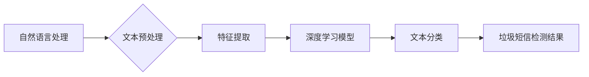

> 垃圾短信检测，深度学习，自然语言处理，卷积神经网络，循环神经网络，文本分类

## 1. 背景介绍

在当今信息爆炸的时代，手机短信已成为人们日常生活中不可或缺的沟通工具。然而，伴随着短信的普及，垃圾短信也日益泛滥，给人们带来了困扰。垃圾短信不仅浪费了宝贵的时间和流量，还可能包含恶意信息，例如诈骗、钓鱼等，危害个人安全和财产安全。因此，开发高效、准确的垃圾短信检测系统显得尤为重要。

传统的垃圾短信检测方法主要依赖于规则匹配和特征工程，但这些方法难以应对日益复杂的垃圾短信内容，且需要不断更新规则，维护成本较高。近年来，深度学习技术在自然语言处理领域取得了突破性进展，为垃圾短信检测提供了新的思路和方法。

深度学习算法能够自动学习文本特征，并根据学习到的特征对短信进行分类，具有更高的准确率和更强的泛化能力。本文将深入探讨深度学习算法在垃圾短信检测中的应用，介绍核心概念、算法原理、实践案例以及未来发展趋势。

## 2. 核心概念与联系

### 2.1 自然语言处理 (NLP)

自然语言处理 (NLP) 是人工智能的一个分支，旨在使计算机能够理解、处理和生成人类语言。在垃圾短信检测中，NLP技术用于对短信内容进行分析和理解，提取关键信息，并为深度学习模型提供输入。

### 2.2 深度学习 (DL)

深度学习 (DL) 是一种机器学习的子领域，利用多层神经网络来模拟人类大脑的学习过程。深度学习算法能够自动学习数据中的复杂特征，并进行模式识别和分类。

### 2.3 文本分类

文本分类是自然语言处理中的一种重要任务，旨在将文本内容归类到预定义的类别中。垃圾短信检测属于文本分类任务，目标是将短信分类为“垃圾短信”或“正常短信”。

**核心概念与联系流程图:**



## 3. 核心算法原理 & 具体操作步骤

### 3.1 算法原理概述

深度学习算法在垃圾短信检测中主要采用卷积神经网络 (CNN) 和循环神经网络 (RNN) 两种架构。

* **卷积神经网络 (CNN)**：CNN擅长提取文本中的局部特征，例如单词、短语等。在垃圾短信检测中，CNN可以学习到短信中常见的垃圾词汇、语法结构和模式。

* **循环神经网络 (RNN)**：RNN能够处理序列数据，例如文本，并捕捉文本中的上下文信息。在垃圾短信检测中，RNN可以学习到短信中单词之间的语义关系，更好地理解短信的整体含义。

### 3.2 算法步骤详解

1. **文本预处理**: 对短信内容进行预处理，例如去除停用词、转换大小写、进行词干提取等，以提高模型的训练效率和准确率。

2. **特征提取**: 将预处理后的短信内容转换为数字向量，例如使用词向量表示单词，或者使用TF-IDF等方法提取文本特征。

3. **模型训练**: 使用深度学习框架，例如TensorFlow或PyTorch，训练CNN或RNN模型。训练过程中，将预处理后的短信内容和对应的标签 (垃圾短信或正常短信) 作为输入，模型会学习到短信特征和分类规则。

4. **模型评估**: 使用测试集对训练好的模型进行评估，计算模型的准确率、召回率、F1-score等指标，以衡量模型的性能。

5. **模型部署**: 将训练好的模型部署到实际应用环境中，例如手机应用程序或服务器端，用于实时检测垃圾短信。

### 3.3 算法优缺点

**优点**:

* **高准确率**: 深度学习算法能够自动学习文本特征，并进行模式识别和分类，具有更高的准确率。
* **泛化能力强**: 深度学习模型能够从大量数据中学习到通用的特征，具有较强的泛化能力，能够应对新的垃圾短信类型。
* **无需人工特征工程**: 深度学习算法能够自动学习特征，无需人工进行特征工程，降低了开发成本和时间。

**缺点**:

* **训练数据需求高**: 深度学习算法需要大量的训练数据才能达到较高的准确率。
* **计算资源消耗大**: 训练深度学习模型需要大量的计算资源，例如GPU。
* **模型解释性差**: 深度学习模型的内部机制较为复杂，难以解释模型的决策过程。

### 3.4 算法应用领域

深度学习算法在垃圾短信检测之外，还广泛应用于其他自然语言处理任务，例如：

* **情感分析**: 分析文本内容的情感倾向，例如正面、负面或中性。
* **文本摘要**: 自动生成文本的摘要，提取关键信息。
* **机器翻译**: 将文本从一种语言翻译成另一种语言。
* **问答系统**: 回答用户提出的问题。

## 4. 数学模型和公式 & 详细讲解 & 举例说明

### 4.1 数学模型构建

在深度学习模型中，常用的激活函数包括ReLU、Sigmoid和Softmax等。

* **ReLU (Rectified Linear Unit)**:

$$
f(x) = max(0, x)
$$

ReLU函数能够有效解决梯度消失问题，在深度学习模型中应用广泛。

* **Sigmoid**:

$$
f(x) = \frac{1}{1 + e^{-x}}
$$

Sigmoid函数将输入映射到0到1之间，常用于二分类问题。

* **Softmax**:

$$
f(x_i) = \frac{e^{x_i}}{\sum_{j=1}^{n} e^{x_j}}
$$

Softmax函数将多个输入映射到概率分布，常用于多分类问题。

### 4.2 公式推导过程

深度学习模型的训练过程是通过反向传播算法来进行的。反向传播算法的核心思想是通过计算损失函数对模型参数的梯度，并利用梯度下降法更新模型参数，从而使模型的预测结果越来越接近真实值。

### 4.3 案例分析与讲解

假设我们有一个垃圾短信检测模型，训练数据包含1000条垃圾短信和1000条正常短信。模型的损失函数为交叉熵损失函数，目标是将垃圾短信和正常短信分类准确。

在训练过程中，模型会不断学习短信特征，并更新模型参数。当模型的预测结果与真实标签相符时，损失函数的值会降低。反之，如果预测结果与真实标签不符，损失函数的值会增加。

通过反复训练和更新模型参数，模型的预测准确率会逐渐提高。最终，我们可以得到一个能够准确识别垃圾短信的深度学习模型。

## 5. 项目实践：代码实例和详细解释说明

### 5.1 开发环境搭建

* **操作系统**: Ubuntu 18.04
* **Python 版本**: 3.6
* **深度学习框架**: TensorFlow 2.0
* **其他依赖**: numpy, pandas, matplotlib

### 5.2 源代码详细实现

```python
import tensorflow as tf
from tensorflow.keras.models import Sequential
from tensorflow.keras.layers import Embedding, LSTM, Dense

# 1. 数据加载和预处理
# ...

# 2. 模型构建
model = Sequential()
model.add(Embedding(input_dim=vocab_size, output_dim=embedding_dim, input_length=max_length))
model.add(LSTM(units=128))
model.add(Dense(units=1, activation='sigmoid'))

# 3. 模型编译
model.compile(optimizer='adam', loss='binary_crossentropy', metrics=['accuracy'])

# 4. 模型训练
model.fit(x_train, y_train, epochs=10, batch_size=32)

# 5. 模型评估
loss, accuracy = model.evaluate(x_test, y_test)
print('Test Loss:', loss)
print('Test Accuracy:', accuracy)

# 6. 模型保存
model.save('spam_detection_model.h5')
```

### 5.3 代码解读与分析

* **数据加载和预处理**: 首先需要加载训练数据和测试数据，并对数据进行预处理，例如去除停用词、转换大小写、进行词干提取等。
* **模型构建**: 使用TensorFlow框架构建深度学习模型，例如使用CNN或RNN架构。
* **模型编译**: 使用优化器、损失函数和评价指标对模型进行编译。
* **模型训练**: 使用训练数据训练模型，并监控模型的训练过程。
* **模型评估**: 使用测试数据评估模型的性能，计算模型的准确率、召回率等指标。
* **模型保存**: 将训练好的模型保存为文件，以便后续使用。

### 5.4 运行结果展示

训练完成后，可以将模型应用于实际场景，例如手机应用程序或服务器端，用于实时检测垃圾短信。

## 6. 实际应用场景

### 6.1 手机短信拦截

手机运营商可以利用深度学习算法构建垃圾短信拦截系统，自动识别并拦截垃圾短信，保护用户免受垃圾短信骚扰。

### 6.2 企业邮件过滤

企业可以利用深度学习算法构建邮件过滤系统，自动识别并过滤垃圾邮件，提高邮件收件箱的效率。

### 6.3 网络安全防护

深度学习算法可以用于识别网络钓鱼邮件、恶意软件等网络威胁，增强网络安全防护。

### 6.4 未来应用展望

随着深度学习技术的不断发展，垃圾短信检测的应用场景将会更加广泛，例如：

* **个性化垃圾短信过滤**: 根据用户的偏好和行为，定制化垃圾短信过滤规则。
* **跨语言垃圾短信检测**: 支持多种语言的垃圾短信检测，满足全球用户的需求。
* **主动学习**: 利用少量标注数据，通过主动学习的方式不断提高模型的准确率。

## 7. 工具和资源推荐

### 7.1 学习资源推荐

* **书籍**:
    * 深度学习
    * 自然语言处理
* **在线课程**:
    * Coursera: 深度学习
    * Udacity: 自然语言处理
* **博客**:
    * TensorFlow Blog
    * PyTorch Blog

### 7.2 开发工具推荐

* **深度学习框架**: TensorFlow, PyTorch
* **自然语言处理库**: NLTK, spaCy
* **数据处理工具**: Pandas, NumPy

### 7.3 相关论文推荐

* **Recurrent Neural Network for Spam Detection**
* **Convolutional Neural Networks for Text Classification**
* **Deep Learning for Spam Filtering: A Survey**

## 8. 总结：未来发展趋势与挑战

### 8.1 研究成果总结

深度学习算法在垃圾短信检测领域取得了显著的成果，能够有效识别和过滤垃圾短信，提高用户体验。

### 8.2 未来发展趋势

* **模型性能提升**: 探索更深、更复杂的深度学习模型架构，提高垃圾短信检测的准确率和效率。
* **数据增强**: 利用数据增强技术，生成更多高质量的训练数据，提升模型的泛化能力。
* **迁移学习**: 利用预训练模型，减少训练数据需求，降低模型训练成本。

### 8.3 面临的挑战

* **数据标注**: 垃圾短信检测需要大量的标注数据，数据标注成本较高。
* **模型解释性**: 深度学习模型的内部机制较为复杂，难以解释模型的决策过程。
* **对抗攻击**: 攻击者可能利用对抗样本攻击深度学习模型，导致模型性能下降。

### 8.4 研究展望

未来，垃圾短信检测领域的研究将继续朝着更准确、更智能、更鲁棒的方向发展。


## 9. 附录：常见问题与解答

**Q1: 深度学习算法在垃圾短信检测中有哪些优势？**

**A1:** 深度学习算法能够自动学习文本特征，并进行模式识别和分类，具有更高的准确率和更强的泛化能力。