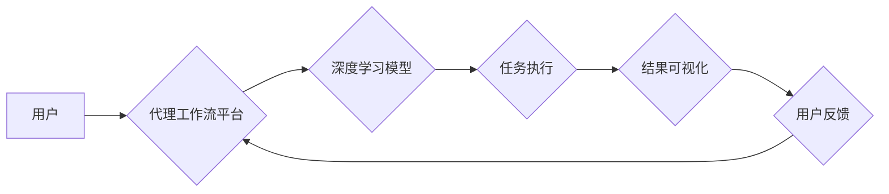

> 深度学习、代理工作流、可视化、用户交互、人工智能、算法设计

## 1. 背景介绍

随着人工智能技术的飞速发展，深度学习算法在各个领域取得了显著的成果。从图像识别、自然语言处理到语音合成，深度学习已经成为推动科技进步的重要驱动力。然而，深度学习模型的复杂性和黑盒属性也带来了新的挑战。如何更好地理解和解释深度学习模型的决策过程，以及如何将深度学习技术应用于更广泛的场景，成为了当前研究的热点问题。

代理工作流是一种将任务分解成一系列子任务，并由多个代理协同完成的自动化工作流程。代理工作流在许多领域具有广泛的应用前景，例如：

* **企业流程自动化:** 自动化审批流程、客户服务流程等。
* **科学研究:** 自动化实验设计、数据分析等。
* **医疗保健:** 自动化诊断、治疗方案推荐等。

然而，传统的代理工作流设计往往依赖于人工规则和经验，难以适应复杂、动态的环境。深度学习技术的引入为代理工作流的设计和优化提供了新的思路。

## 2. 核心概念与联系

深度学习代理工作流的可视化与用户交互设计旨在通过可视化技术和用户交互设计，使深度学习模型驱动的代理工作流更加透明、易于理解和控制。

**核心概念:**

* **深度学习模型:** 用于学习数据模式和关系的算法，例如卷积神经网络、循环神经网络等。
* **代理:** 执行特定任务的智能体，可以是软件程序、机器人等。
* **工作流:** 一系列相互关联的任务和步骤，用于完成一个复杂的目标。
* **可视化:** 将抽象的数据和信息转化为直观易懂的图形和图表。
* **用户交互:** 用户与系统之间的互动，例如输入指令、选择选项、浏览数据等。

**架构:**



## 3. 核心算法原理 & 具体操作步骤

### 3.1  算法原理概述

深度学习代理工作流的可视化与用户交互设计通常基于以下核心算法原理：

* **强化学习:** 用于训练代理在工作流中执行任务并获得最大奖励的算法。
* **图神经网络:** 用于表示和分析工作流中的任务和关系的算法。
* **可视化算法:** 用于将工作流和代理的行为可视化的算法，例如流程图、网络图、时间序列图等。

### 3.2  算法步骤详解

1. **工作流建模:** 将任务分解成一系列子任务，并定义任务之间的依赖关系，构建工作流图。
2. **代理训练:** 使用强化学习算法训练代理，使其能够在工作流中执行任务并获得最大奖励。
3. **可视化设计:** 设计可视化界面，展示工作流的执行过程、代理的行为以及相关数据。
4. **用户交互:** 提供用户交互机制，例如拖拽操作、筛选功能、数据分析工具等，使用户能够更好地理解和控制工作流。

### 3.3  算法优缺点

**优点:**

* **自动化:** 可以自动执行复杂的工作流程，提高效率。
* **智能化:** 可以根据数据和环境动态调整工作流程，提高适应性。
* **可视化:** 可以直观展示工作流程和代理的行为，提高透明度。
* **用户友好:** 可以提供用户友好的交互界面，使用户更容易理解和控制工作流程。

**缺点:**

* **复杂性:** 深度学习模型和代理工作流的构建和训练需要一定的技术难度。
* **数据依赖:** 深度学习模型的性能依赖于训练数据的质量和数量。
* **解释性:** 深度学习模型的决策过程往往难以解释，这可能导致用户对模型的信任度降低。

### 3.4  算法应用领域

深度学习代理工作流的可视化与用户交互设计在以下领域具有广泛的应用前景:

* **企业流程自动化:** 自动化审批流程、客户服务流程等。
* **科学研究:** 自动化实验设计、数据分析等。
* **医疗保健:** 自动化诊断、治疗方案推荐等。
* **教育:** 自动化教学、个性化学习等。

## 4. 数学模型和公式 & 详细讲解 & 举例说明

### 4.1  数学模型构建

深度学习代理工作流的可视化与用户交互设计通常基于以下数学模型:

* **强化学习模型:** 使用状态、动作、奖励等概念，构建代理在工作流中执行任务的决策模型。
* **图神经网络模型:** 使用图结构表示工作流中的任务和关系，并使用神经网络进行学习和推理。
* **可视化模型:** 使用数学公式和算法，将工作流和代理的行为转化为直观易懂的图形和图表。

### 4.2  公式推导过程

强化学习模型的核心公式是Bellman方程:

$$
V(s) = \max_{\alpha} \sum_{s'} P(s' | s, \alpha) [r(s, \alpha, s') + \gamma V(s')]
$$

其中:

* $V(s)$ 是状态 $s$ 的价值函数。
* $\alpha$ 是代理的动作。
* $P(s' | s, \alpha)$ 是从状态 $s$ 执行动作 $\alpha$ 到状态 $s'$ 的转移概率。
* $r(s, \alpha, s')$ 是从状态 $s$ 执行动作 $\alpha$ 到状态 $s'$ 的奖励。
* $\gamma$ 是折扣因子，控制未来奖励的权重。

### 4.3  案例分析与讲解

假设一个代理工作流用于自动处理客户服务请求。

* 状态 $s$ 可以表示客户请求的类型、优先级等信息。
* 动作 $\alpha$ 可以表示代理执行的操作，例如回复邮件、转接电话等。
* 奖励 $r(s, \alpha, s')$ 可以根据客户满意度等指标进行评估。

通过训练强化学习模型，代理可以学习到在不同状态下执行不同动作以获得最大奖励的策略。

## 5. 项目实践：代码实例和详细解释说明

### 5.1  开发环境搭建

* Python 3.x
* TensorFlow 或 PyTorch 深度学习框架
* Jupyter Notebook 或 VS Code 开发环境

### 5.2  源代码详细实现

```python
# 使用 TensorFlow 构建强化学习模型
import tensorflow as tf

# 定义状态空间和动作空间
state_size = 10
action_size = 5

# 创建神经网络模型
model = tf.keras.Sequential([
    tf.keras.layers.Dense(64, activation='relu', input_shape=(state_size,)),
    tf.keras.layers.Dense(32, activation='relu'),
    tf.keras.layers.Dense(action_size)
])

# 定义损失函数和优化器
optimizer = tf.keras.optimizers.Adam()
loss_fn = tf.keras.losses.CategoricalCrossentropy()

# 训练模型
for epoch in range(100):
    # 训练数据
    states = ...
    actions = ...
    rewards = ...
    # 计算损失
    with tf.GradientTape() as tape:
        predictions = model(states)
        loss = loss_fn(actions, predictions)
    # 反向传播
    gradients = tape.gradient(loss, model.trainable_variables)
    optimizer.apply_gradients(zip(gradients, model.trainable_variables))

# 保存模型
model.save('agent_model.h5')
```

### 5.3  代码解读与分析

* 代码首先定义了状态空间和动作空间，即代理可以感知到的信息和可以执行的操作。
* 然后构建了一个神经网络模型，用于学习代理在不同状态下执行不同动作的策略。
* 使用 TensorFlow 的强化学习 API，定义了损失函数和优化器，并训练了模型。
* 最后，将训练好的模型保存为文件，以便后续使用。

### 5.4  运行结果展示

训练完成后，可以将模型加载到代理工作流平台中，并测试代理在工作流中的执行效果。

## 6. 实际应用场景

### 6.1  案例介绍

例如，可以将深度学习代理工作流应用于医疗保健领域，自动处理患者的诊断和治疗方案推荐。

* **工作流:** 患者提供症状信息，代理根据症状信息和患者的病历数据，调用深度学习模型进行诊断，并推荐相应的治疗方案。
* **代理:** 代理负责收集患者信息、调用深度学习模型、生成诊断报告和治疗方案。
* **可视化:** 可视化界面展示患者的症状信息、诊断结果、治疗方案以及相关数据分析。

### 6.2  优势分析

* **提高效率:** 自动化诊断和治疗方案推荐，可以显著提高医疗机构的效率。
* **降低成本:** 自动化处理可以减少人工成本，降低医疗费用。
* **提高准确性:** 深度学习模型可以学习到大量的医疗数据，提高诊断和治疗方案的准确性。
* **个性化服务:** 根据患者的个体差异，提供个性化的诊断和治疗方案。

### 6.4  未来应用展望

随着深度学习技术的不断发展，深度学习代理工作流的可视化与用户交互设计将在更多领域得到应用，例如：

* **金融领域:** 自动化风险评估、欺诈检测等。
* **制造业:** 自动化生产流程优化、设备故障预测等。
* **教育领域:** 自动化个性化学习、智能辅导等。

## 7. 工具和资源推荐

### 7.1  学习资源推荐

* **书籍:**
    * 深度学习
    * 强化学习
    * 自然语言处理
* **在线课程:**
    * Coursera
    * edX
    * Udacity

### 7.2  开发工具推荐

* **深度学习框架:** TensorFlow, PyTorch
* **可视化工具:** Matplotlib, Seaborn, Plotly
* **代理工作流平台:** Apache Airflow, Prefect

### 7.3  相关论文推荐

* **深度学习代理工作流的可视化与用户交互设计**
* **强化学习在代理工作流中的应用**
* **图神经网络在代理工作流中的应用**

## 8. 总结：未来发展趋势与挑战

### 8.1  研究成果总结

深度学习代理工作流的可视化与用户交互设计是一个新兴的研究领域，取得了一些重要的成果。例如，开发了多种深度学习模型和算法，用于训练代理和可视化工作流。

### 8.2  未来发展趋势

* **更强大的深度学习模型:** 开发更强大的深度学习模型，提高代理的工作效率和准确性。
* **更智能的用户交互:** 设计更智能的用户交互机制，使用户能够更方便地理解和控制工作流。
* **更广泛的应用场景:** 将深度学习代理工作流应用于更多领域，解决更多实际问题。

### 8.3  面临的挑战

* **解释性:** 深度学习模型的决策过程往往难以解释，这可能导致用户对模型的信任度降低。
* **数据依赖:** 深度学习模型的性能依赖于训练数据的质量和数量。
* **安全性:** 深度学习代理工作流可能存在安全风险，例如数据泄露、恶意攻击等。

### 8.4  研究展望

未来，我们将继续致力于深度学习代理工作流的可视化与用户交互设计，努力解决上述挑战，并推动该技术在更多领域得到应用。

## 9. 附录：常见问题与解答

**Q1: 深度学习代理工作流与传统工作流有什么区别？**

**A1:** 深度学习代理工作流与传统工作流的主要区别在于，深度学习代理工作流可以自动学习和优化工作流程，而传统工作流则需要人工设计和维护。

**Q2: 深度学习代理工作流