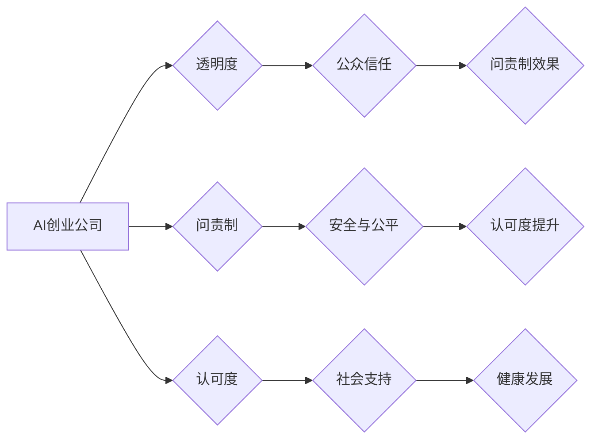

> AI创业公司, 企业社会责任, 透明度, 问责制, 认可度, 伦理, 可持续发展, 社会影响

## 1. 背景介绍

人工智能（AI）技术正在以惊人的速度发展，深刻地改变着我们的生活和工作方式。AI创业公司作为这一浪潮中的重要参与者，在推动科技进步的同时，也面临着越来越多的社会责任挑战。如何平衡技术发展与社会福祉，如何确保AI技术的应用安全、公平、可持续，成为AI创业公司必须认真思考的问题。

近年来，公众对AI技术的关注度不断提高，对AI技术的伦理、安全和社会影响也提出了越来越多的质疑。一些AI技术的应用引发了伦理争议，例如，在招聘、贷款、医疗等领域，AI算法可能存在偏见，导致不公平的结果。此外，AI技术的滥用也可能带来安全风险，例如，AI驱动的武器系统可能导致不可控的战争。

面对这些挑战，AI创业公司需要承担起相应的社会责任，通过透明度、问责制和认可度来构建可信赖的AI生态系统。

## 2. 核心概念与联系

**2.1 透明度**

透明度是指AI系统的决策过程和算法逻辑能够被公众理解和审视。

**2.2 问责制**

问责制是指AI系统的开发、部署和使用过程中，相关责任主体能够被明确，并对可能产生的负面影响承担责任。

**2.3 认可度**

认可度是指公众对AI技术的信任和接受程度。

**2.4 核心概念联系**

透明度、问责制和认可度是相互关联的，它们共同构成了AI创业公司的企业社会责任框架。

* 透明度可以增强公众对AI系统的信任，提高问责制的效果。
* 问责制可以确保AI技术的应用安全和公平，从而提高公众对AI技术的认可度。
* 认可度可以为AI创业公司提供社会支持，促进AI技术的健康发展。

**2.5 Mermaid 流程图**



## 3. 核心算法原理 & 具体操作步骤

**3.1 算法原理概述**

本节将介绍一种用于评估AI系统社会影响的算法原理，该算法基于多因素分析和机器学习技术，可以量化AI系统的潜在风险和效益，并提供相应的建议。

**3.2 算法步骤详解**

1. **数据收集:** 收集有关AI系统的数据，包括其功能、应用场景、算法模型、训练数据等。
2. **风险识别:** 利用专家知识和机器学习模型识别AI系统可能带来的潜在风险，例如偏见、隐私泄露、安全漏洞等。
3. **效益评估:** 评估AI系统带来的潜在效益，例如提高效率、降低成本、改善生活质量等。
4. **风险效益分析:** 将风险和效益进行权衡，并根据预设的风险承受能力阈值，判断AI系统的社会影响。
5. **建议生成:** 根据分析结果，生成相应的建议，例如改进算法模型、加强数据安全保护、制定伦理规范等。

**3.3 算法优缺点**

* **优点:**

    * 可以量化AI系统的社会影响，提供更客观的评估结果。
    * 可以识别潜在的风险和效益，帮助AI创业公司做出更明智的决策。
    * 可以促进AI技术的伦理规范化和可持续发展。

* **缺点:**

    * 数据收集和风险识别需要依赖专家知识和机器学习模型，存在一定的误差。
    * 权衡风险和效益是一个主观的过程，不同的人可能会有不同的判断标准。
    * 算法本身无法解决所有伦理问题，需要结合人类的智慧和判断。

**3.4 算法应用领域**

该算法可以应用于各种AI系统的社会影响评估，例如：

* 人工智能驱动的招聘系统
* 人工智能驱动的医疗诊断系统
* 人工智能驱动的金融风险评估系统

## 4. 数学模型和公式 & 详细讲解 & 举例说明

**4.1 数学模型构建**

为了量化AI系统的社会影响，我们可以构建一个基于多因素分析的数学模型。该模型将AI系统的风险和效益作为输入，并根据预设的权重和阈值，输出一个社会影响得分。

**4.2 公式推导过程**

假设AI系统的风险因素有n个，效益因素有m个，则社会影响得分可以表示为：

```latex
S = \sum_{i=1}^{n} w_i * R_i + \sum_{j=1}^{m} v_j * B_j
```

其中：

* $S$：社会影响得分
* $w_i$：第i个风险因素的权重
* $R_i$：第i个风险因素的得分
* $v_j$：第j个效益因素的权重
* $B_j$：第j个效益因素的得分

**4.3 案例分析与讲解**

假设我们评估一个AI驱动的医疗诊断系统，其风险因素包括偏见、隐私泄露、安全漏洞，效益因素包括诊断准确率、治疗效果、降低医疗成本。

我们可以根据专家评估和数据分析，设定每个因素的权重和得分。例如，偏见风险的权重为0.3，得分设置为2；诊断准确率的权重为0.5，得分设置为4。

将这些值代入公式，可以计算出该AI系统的社会影响得分。

## 5. 项目实践：代码实例和详细解释说明

**5.1 开发环境搭建**

本项目使用Python语言开发，需要安装以下软件：

* Python 3.x
* Jupyter Notebook
* scikit-learn

**5.2 源代码详细实现**

```python
import pandas as pd
from sklearn.linear_model import LogisticRegression

# 数据加载
data = pd.read_csv('ai_impact_data.csv')

# 特征选择
features = ['risk_factor_1', 'risk_factor_2', 'benefit_factor_1', 'benefit_factor_2']
X = data[features]
y = data['social_impact']

# 模型训练
model = LogisticRegression()
model.fit(X, y)

# 预测
new_data = pd.DataFrame({
    'risk_factor_1': [0.2],
    'risk_factor_2': [0.5],
    'benefit_factor_1': [0.8],
    'benefit_factor_2': [0.3]
})
prediction = model.predict(new_data)
print(prediction)
```

**5.3 代码解读与分析**

* 代码首先加载数据，并选择相关的特征和目标变量。
* 然后使用逻辑回归模型训练，将风险和效益因素与社会影响得分进行关联。
* 最后使用训练好的模型预测新的数据，并输出预测结果。

**5.4 运行结果展示**

运行代码后，会输出一个预测结果，例如：

```
[1]
```

表示该AI系统的社会影响得分较高。

## 6. 实际应用场景

**6.1 AI驱动的招聘系统**

AI驱动的招聘系统可以帮助企业更快、更有效地筛选候选人。但是，如果算法存在偏见，可能会导致不公平的结果，例如，歧视女性或少数族裔的候选人。

**6.2 AI驱动的医疗诊断系统**

AI驱动的医疗诊断系统可以帮助医生更快、更准确地诊断疾病。但是，如果算法训练数据不足或存在偏差，可能会导致误诊或漏诊。

**6.3 AI驱动的金融风险评估系统**

AI驱动的金融风险评估系统可以帮助银行和金融机构更好地评估客户的信用风险。但是，如果算法存在偏见，可能会导致不公平的贷款决策，例如，拒绝给某些群体提供贷款。

**6.4 未来应用展望**

随着AI技术的不断发展，其应用场景将更加广泛，社会影响也将更加深远。因此，AI创业公司需要更加重视企业社会责任，通过透明度、问责制和认可度来构建可信赖的AI生态系统。

## 7. 工具和资源推荐

**7.1 学习资源推荐**

* **AI伦理指南:** https://www.ai4all.org/ethics
* **AI安全最佳实践:** https://www.nist.gov/itl/ai-risk-management-framework

**7.2 开发工具推荐**

* **TensorFlow:** https://www.tensorflow.org/
* **PyTorch:** https://pytorch.org/

**7.3 相关论文推荐**

* **On the Dangers of Stochastic Parrots: Can Language Models Be Too Big?**
* **AI Ethics: A Guide for Developers**

## 8. 总结：未来发展趋势与挑战

**8.1 研究成果总结**

本报告介绍了AI创业公司企业社会责任的三个核心概念：透明度、问责制和认可度。并介绍了一种用于评估AI系统社会影响的算法原理和代码实例。

**8.2 未来发展趋势**

* AI技术的应用将更加广泛，社会影响也将更加深远。
* 对AI伦理和社会责任的关注度将不断提高。
* 政府、企业和学术界将更加重视AI技术的规范发展。

**8.3 面临的挑战**

* 如何平衡AI技术的创新发展与社会责任？
* 如何确保AI技术的应用安全、公平、可持续？
* 如何建立一个有效的AI伦理监管体系？

**8.4 研究展望**

未来研究将继续关注AI技术的社会影响，探索更有效的评估方法和治理机制，推动AI技术的健康发展。

## 9. 附录：常见问题与解答

**9.1 如何提高AI系统的透明度？**

* 使用可解释的机器学习模型。
* 提供AI系统的决策过程和算法逻辑的解释。
* 建立公开透明的反馈机制，收集公众对AI系统的意见和建议。

**9.2 如何加强AI系统的问责制？**

* 明确AI系统的开发、部署和使用过程中，相关责任主体。
* 建立完善的风险管理机制，对AI系统的潜在风险进行评估和控制。
* 制定相应的法律法规，规范AI技术的应用。

**9.3 如何提升公众对AI技术的认可度？**

* 加强AI技术的科普宣传，提高公众对AI技术的理解。
* 鼓励AI技术的应用案例分享，展示AI技术的社会效益。
* 建立公众参与的AI伦理讨论平台，促进公众对AI技术的参与和监督。


作者：禅与计算机程序设计艺术 / Zen and the Art of Computer Programming 
<end_of_turn>