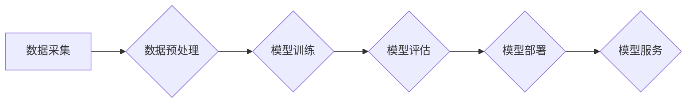

> AI大模型、创业、机遇、技术趋势、商业模式、应用场景、伦理风险

## 1. 背景介绍

人工智能（AI）技术近年来发展迅速，特别是大模型的涌现，为各行各业带来了前所未有的机遇。大模型是指参数规模庞大、训练数据海量的人工智能模型，具备强大的泛化能力和学习能力，能够在自然语言处理、计算机视觉、语音识别等领域取得突破性进展。

随着大模型技术的成熟，其商业化应用也逐渐成为现实。越来越多的创业公司涌入AI大模型领域，致力于开发基于大模型的创新产品和服务。然而，AI大模型创业也面临着诸多挑战，例如高昂的开发成本、数据安全和隐私保护、算法伦理等问题。

## 2. 核心概念与联系

**2.1 AI大模型概述**

AI大模型是指参数规模庞大、训练数据海量的人工智能模型，其核心特点包括：

* **规模化：** 大模型拥有数亿甚至数十亿个参数，远超传统机器学习模型。
* **泛化能力强：** 由于训练数据量大，大模型能够更好地泛化到未知数据，表现出更强的学习能力。
* **多任务学习：** 大模型可以同时学习多个任务，例如文本生成、图像识别、语音合成等。

**2.2 核心技术架构**

大模型的训练和应用通常基于以下核心技术架构：



**2.3 关键技术**

* **深度学习：** 大模型的核心技术是深度学习，通过多层神经网络结构学习数据特征。
* **Transformer：** Transformer是一种新型神经网络架构，能够有效处理序列数据，是近年来大模型发展的重要推动力量。
* **分布式训练：** 由于大模型参数规模庞大，需要采用分布式训练技术，将模型参数和数据分布到多个计算节点上进行训练。

## 3. 核心算法原理 & 具体操作步骤

**3.1 算法原理概述**

大模型的训练主要基于深度学习算法，例如Transformer模型。Transformer模型通过自注意力机制学习数据之间的关系，能够捕捉长距离依赖关系，从而实现更准确的预测和生成。

**3.2 算法步骤详解**

1. **数据预处理：** 将原始数据进行清洗、格式化、编码等操作，使其能够被模型理解。
2. **模型构建：** 根据任务需求选择合适的模型架构，例如Transformer模型，并设置模型参数。
3. **模型训练：** 使用训练数据训练模型，通过反向传播算法更新模型参数，使模型的预测结果越来越准确。
4. **模型评估：** 使用测试数据评估模型的性能，例如准确率、召回率、F1-score等指标。
5. **模型部署：** 将训练好的模型部署到生产环境中，用于实际应用。

**3.3 算法优缺点**

* **优点：** 泛化能力强、学习能力强、多任务学习能力强。
* **缺点：** 训练成本高、数据依赖性强、解释性差。

**3.4 算法应用领域**

* 自然语言处理：文本生成、机器翻译、问答系统、情感分析等。
* 计算机视觉：图像识别、物体检测、图像分割等。
* 语音识别：语音转文本、语音合成等。
* 其他领域：药物研发、金融预测、个性化推荐等。

## 4. 数学模型和公式 & 详细讲解 & 举例说明

**4.1 数学模型构建**

大模型的训练过程可以看作是一个优化问题，目标是找到最优的模型参数，使得模型的预测结果与真实值之间的误差最小。

**4.2 公式推导过程**

常用的损失函数包括均方误差（MSE）、交叉熵损失（Cross-Entropy Loss）等。

* **均方误差（MSE）：**

$$MSE = \frac{1}{N} \sum_{i=1}^{N} (y_i - \hat{y}_i)^2$$

其中，$y_i$为真实值，$\hat{y}_i$为模型预测值，$N$为样本数量。

* **交叉熵损失（Cross-Entropy Loss）：**

$$Cross-Entropy Loss = -\sum_{i=1}^{N} y_i \log(\hat{y}_i)$$

其中，$y_i$为真实值，$\hat{y}_i$为模型预测值。

**4.3 案例分析与讲解**

例如，在文本生成任务中，可以使用交叉熵损失函数来评估模型的性能。模型预测的文本序列与真实文本序列之间的差异越大，交叉熵损失值就越大。训练过程中，模型会不断调整参数，使得交叉熵损失值最小化，从而生成更符合真实文本的文本序列。

## 5. 项目实践：代码实例和详细解释说明

**5.1 开发环境搭建**

* 操作系统：Linux
* Python版本：3.7+
* 深度学习框架：TensorFlow或PyTorch
* GPU：建议使用NVIDIA GPU

**5.2 源代码详细实现**

```python
import tensorflow as tf

# 定义模型架构
model = tf.keras.Sequential([
    tf.keras.layers.Embedding(input_dim=vocab_size, output_dim=embedding_dim),
    tf.keras.layers.LSTM(units=hidden_size),
    tf.keras.layers.Dense(units=vocab_size, activation='softmax')
])

# 编译模型
model.compile(optimizer='adam', loss='sparse_categorical_crossentropy', metrics=['accuracy'])

# 训练模型
model.fit(x_train, y_train, epochs=10, batch_size=32)

# 评估模型
loss, accuracy = model.evaluate(x_test, y_test)
print('Loss:', loss)
print('Accuracy:', accuracy)
```

**5.3 代码解读与分析**

* **Embedding层：** 将单词映射到低维向量空间，捕捉单词之间的语义关系。
* **LSTM层：** 长短期记忆网络，能够处理序列数据，捕捉文本中的长距离依赖关系。
* **Dense层：** 全连接层，将LSTM层的输出映射到每个单词的概率分布。
* **softmax激活函数：** 将输出概率分布归一化，使得每个单词的概率之和为1。

**5.4 运行结果展示**

训练完成后，可以使用模型对新的文本进行预测，例如生成续写文本、翻译文本等。

## 6. 实际应用场景

**6.1 自然语言处理**

* **文本生成：** 生成小说、诗歌、新闻报道等文本。
* **机器翻译：** 将文本从一种语言翻译成另一种语言。
* **问答系统：** 回答用户提出的问题。
* **情感分析：** 分析文本的情感倾向，例如正面、负面、中性。

**6.2 计算机视觉**

* **图像识别：** 识别图像中的物体、场景、人物等。
* **物体检测：** 在图像中定位和识别物体。
* **图像分割：** 将图像分割成不同的区域。

**6.3 语音识别**

* **语音转文本：** 将语音转换为文本。
* **语音合成：** 将文本转换为语音。

**6.4 其他领域**

* **药物研发：** 预测药物的活性、毒性等。
* **金融预测：** 预测股票价格、风险等。
* **个性化推荐：** 推荐用户感兴趣的商品、服务等。

**6.5 未来应用展望**

随着大模型技术的不断发展，其应用场景将更加广泛，例如：

* **智能客服：** 提供更加智能、人性化的客服服务。
* **自动驾驶：** 提高自动驾驶系统的安全性、可靠性。
* **医疗诊断：** 辅助医生进行疾病诊断。

## 7. 工具和资源推荐

**7.1 学习资源推荐**

* **书籍：**
    * 《深度学习》
    * 《自然语言处理》
    * 《机器学习》
* **在线课程：**
    * Coursera
    * edX
    * Udacity

**7.2 开发工具推荐**

* **深度学习框架：** TensorFlow、PyTorch
* **编程语言：** Python
* **云计算平台：** AWS、Azure、GCP

**7.3 相关论文推荐**

* **BERT：** Devlin et al. (2018)
* **GPT-3：** Brown et al. (2020)
* **LaMDA：** Google AI (2021)

## 8. 总结：未来发展趋势与挑战

**8.1 研究成果总结**

近年来，AI大模型取得了显著进展，在自然语言处理、计算机视觉等领域取得了突破性成果。

**8.2 未来发展趋势**

* **模型规模化：** 模型参数规模将继续扩大，训练数据量也将进一步增加。
* **多模态学习：** 大模型将能够处理多种模态数据，例如文本、图像、音频等。
* **可解释性：** 研究如何提高大模型的解释性，使其决策过程更加透明。

**8.3 面临的挑战**

* **高昂的开发成本：** 训练大模型需要大量的计算资源和数据，成本较高。
* **数据安全和隐私保护：** 大模型的训练需要大量数据，如何保证数据安全和隐私保护是一个重要问题。
* **算法伦理：** 大模型的应用可能带来伦理风险，例如偏见、歧视等问题。

**8.4 研究展望**

未来，AI大模型研究将继续朝着更强大、更安全、更可解释的方向发展。


## 9. 附录：常见问题与解答

**9.1 如何选择合适的AI大模型？**

选择合适的AI大模型需要根据具体的应用场景和需求进行考虑。例如，对于文本生成任务，可以选择GPT-3等文本生成模型；对于图像识别任务，可以选择ResNet、EfficientNet等图像识别模型。

**9.2 如何训练自己的AI大模型？**

训练自己的AI大模型需要具备一定的深度学习知识和经验，以及强大的计算资源和数据资源。可以参考开源的深度学习框架和教程进行学习和实践。

**9.3 如何解决AI大模型的伦理风险？**

解决AI大模型的伦理风险需要多方共同努力，包括研究者、开发者、监管机构等。可以采取以下措施：

* **数据清洗：** 确保训练数据中不存在偏见和歧视。
* **模型评估：** 对模型进行全面评估，识别潜在的伦理风险。
* **透明度：** 使模型的决策过程更加透明，方便用户理解和监督。
* **监管政策：** 制定相应的监管政策，规范AI大模型的开发和应用。


作者：禅与计算机程序设计艺术 / Zen and the Art of Computer Programming 
<end_of_turn>