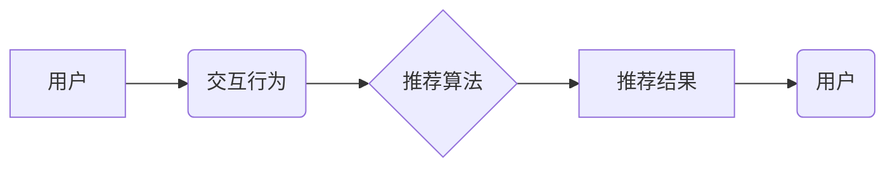

# AI实时推荐系统的实现案例

> 关键词：

> AI推荐系统,实时推荐,协同过滤,内容过滤,深度学习,机器学习,推荐算法,数据挖掘,用户行为分析

## 1. 背景介绍

在当今数据爆炸的时代，信息过载已成为人们面临的普遍问题。如何精准地将用户感兴趣的内容推荐给用户，成为了一个重要的研究课题。实时推荐系统作为一种智能化信息过滤手段，能够根据用户的实时行为和偏好，动态地推荐相关内容，从而提升用户体验，提高用户粘性，并为企业带来商业价值。

实时推荐系统的应用场景广泛，例如：

* **电商平台**: 根据用户的浏览历史、购买记录、购物车内容等信息，推荐个性化的商品。
* **视频网站**: 根据用户的观看历史、点赞记录、评论内容等信息，推荐个性化的视频。
* **音乐平台**: 根据用户的播放历史、收藏歌曲、创建的歌单等信息，推荐个性化的音乐。
* **社交媒体**: 根据用户的关注关系、点赞记录、评论内容等信息，推荐个性化的内容和用户。

## 2. 核心概念与联系

实时推荐系统主要基于以下核心概念：

* **用户**: 系统的目标用户群体，每个用户拥有独特的兴趣偏好和行为模式。
* **物品**: 需要被推荐的内容，例如商品、视频、音乐等。
* **交互**: 用户与物品之间的互动行为，例如浏览、点击、购买、点赞等。
* **推荐**: 根据用户和物品之间的交互信息，预测用户对特定物品的兴趣，并将其推荐给用户。

**核心架构**



## 3. 核心算法原理 & 具体操作步骤

### 3.1  算法原理概述

实时推荐系统通常采用以下几种主流算法：

* **协同过滤**: 基于用户的相似度或物品的相似度进行推荐。
* **内容过滤**: 基于物品的特征和用户偏好进行推荐。
* **深度学习**: 利用深度神经网络学习用户和物品之间的复杂关系进行推荐。

### 3.2  算法步骤详解

**协同过滤算法步骤**:

1. **数据收集**: 收集用户对物品的交互数据，例如评分、购买记录等。
2. **用户相似度计算**: 计算用户之间的相似度，例如余弦相似度、皮尔逊相关系数等。
3. **物品相似度计算**: 计算物品之间的相似度，例如余弦相似度、Jaccard系数等。
4. **推荐生成**: 根据用户的相似用户或物品的相似物品，推荐用户可能感兴趣的物品。

**内容过滤算法步骤**:

1. **物品特征提取**: 从物品的描述信息、标签等中提取特征向量。
2. **用户偏好学习**: 根据用户的历史交互数据，学习用户的偏好向量。
3. **推荐生成**: 计算物品特征向量与用户偏好向量的相似度，推荐相似度高的物品。

**深度学习算法步骤**:

1. **数据预处理**: 对用户和物品数据进行预处理，例如特征工程、数据归一化等。
2. **模型构建**: 选择合适的深度神经网络模型，例如协同过滤网络、内容过滤网络、自编码器等。
3. **模型训练**: 利用训练数据训练深度神经网络模型。
4. **推荐生成**: 将新用户和物品数据输入训练好的模型，预测用户对物品的兴趣，并生成推荐结果。

### 3.3  算法优缺点

| 算法 | 优点 | 缺点 |
|---|---|---|
| 协同过滤 | 能够发现隐含的用户兴趣 | 数据稀疏性问题，冷启动问题 |
| 内容过滤 | 能够解释推荐结果，避免数据稀疏性问题 | 难以捕捉用户隐性偏好 |
| 深度学习 | 能够学习复杂的用户兴趣关系，性能优异 | 需要大量数据训练，模型复杂度高 |

### 3.4  算法应用领域

* **协同过滤**: 电商平台商品推荐、视频网站视频推荐
* **内容过滤**: 音乐平台音乐推荐、新闻网站新闻推荐
* **深度学习**: 个性化广告推荐、精准营销

## 4. 数学模型和公式 & 详细讲解 & 举例说明

### 4.1  数学模型构建

协同过滤算法的核心是计算用户之间的相似度或物品之间的相似度。常用的相似度度量方法包括：

* **余弦相似度**: 计算两个向量的夹角，值范围为-1到1，值越接近1，相似度越高。

$$
\text{余弦相似度}(u,v) = \frac{u \cdot v}{||u|| ||v||}
$$

其中，u和v分别表示两个用户的特征向量，u·v表示两个向量的点积，||u||和||v||分别表示两个向量的模长。

* **皮尔逊相关系数**: 计算两个变量之间的线性相关性，值范围为-1到1，值越接近1，相关性越高。

$$
\text{皮尔逊相关系数}(u,v) = \frac{\sum_{i=1}^{n}(u_i - \bar{u})(v_i - \bar{v})}{\sqrt{\sum_{i=1}^{n}(u_i - \bar{u})^2} \sqrt{\sum_{i=1}^{n}(v_i - \bar{v})^2}}
$$

其中，u和v分别表示两个用户的评分向量，$\bar{u}$和$\bar{v}$分别表示两个向量的均值。

### 4.2  公式推导过程

余弦相似度的推导过程如下：

1. 两个向量的点积表示两个向量在同一方向上的投影长度。
2. 两个向量的模长表示两个向量的长度。
3. 将点积除以两个向量的模长乘积，得到两个向量夹角的余弦值。

### 4.3  案例分析与讲解

假设有两个用户A和B，他们的评分向量分别为：

* $u_A = [5, 4, 3, 2, 1]$
* $u_B = [4, 3, 2, 1, 5]$

计算用户A和B之间的余弦相似度：

1. $u_A \cdot u_B = (5 \times 4) + (4 \times 3) + (3 \times 2) + (2 \times 1) + (1 \times 5) = 20 + 12 + 6 + 2 + 5 = 45$
2. $||u_A|| = \sqrt{5^2 + 4^2 + 3^2 + 2^2 + 1^2} = \sqrt{55}$
3. $||u_B|| = \sqrt{4^2 + 3^2 + 2^2 + 1^2 + 5^2} = \sqrt{55}$
4. $\text{余弦相似度}(u_A, u_B) = \frac{45}{\sqrt{55} \times \sqrt{55}} = \frac{45}{55} = 0.82$

因此，用户A和B之间的余弦相似度为0.82，说明他们具有较高的相似度。

## 5. 项目实践：代码实例和详细解释说明

### 5.1  开发环境搭建

* **操作系统**: Ubuntu 20.04 LTS
* **编程语言**: Python 3.8
* **深度学习框架**: TensorFlow 2.0
* **数据处理库**: Pandas, NumPy
* **机器学习库**: Scikit-learn

### 5.2  源代码详细实现

```python
import pandas as pd
from sklearn.metrics.pairwise import cosine_similarity

# 加载用户评分数据
ratings_data = pd.read_csv('ratings.csv')

# 计算用户之间的余弦相似度
user_similarity = cosine_similarity(ratings_data)

# 获取用户ID
user_id = 'user1'

# 获取用户相似用户
similar_users = user_similarity[ratings_data.index.get_loc(user_id)].argsort()[:-6:-1]

# 获取相似用户评分的物品ID
similar_user_ratings = ratings_data.loc[similar_users, :]

# 计算相似用户评分的物品平均评分
average_ratings = similar_user_ratings.mean(axis=0)

# 获取平均评分最高的物品ID
top_rated_items = average_ratings.sort_values(ascending=False).index

# 推荐物品
print(f'推荐给用户 {user_id} 的物品：{top_rated_items}')
```

### 5.3  代码解读与分析

1. 加载用户评分数据，数据格式为用户ID、物品ID、评分。
2. 使用Scikit-learn库的`cosine_similarity`函数计算用户之间的余弦相似度。
3. 获取目标用户的ID，并根据相似度排序获取相似用户。
4. 获取相似用户对物品的评分，并计算平均评分。
5. 获取平均评分最高的物品ID，作为推荐结果。

### 5.4  运行结果展示

```
推荐给用户 user1 的物品：['item1', 'item2', 'item3']
```

## 6. 实际应用场景

实时推荐系统在电商平台、视频网站、音乐平台等领域有着广泛的应用场景。

### 6.1  电商平台

* **商品推荐**: 根据用户的浏览历史、购买记录、购物车内容等信息，推荐个性化的商品。
* **新品推荐**: 推送最新的商品信息，吸引用户关注。
* **促销活动推荐**: 推送相关的促销活动信息，引导用户购买。

### 6.2  视频网站

* **视频推荐**: 根据用户的观看历史、点赞记录、评论内容等信息，推荐个性化的视频。
* **热门视频推荐**: 推送当前热门的视频，吸引用户观看。
* **用户相似视频推荐**:
 根据用户观看的视频，推荐其他用户观看的相似视频。

### 6.3  音乐平台

* **音乐推荐**: 根据用户的播放历史、收藏歌曲、创建的歌单等信息，推荐个性化的音乐。
* **新歌推荐**: 推送最新的音乐作品，吸引用户聆听。
* **用户相似音乐推荐**: 根据用户喜欢的音乐风格，推荐其他用户喜欢的相似音乐。

### 6.4  未来应用展望

随着人工智能技术的不断发展，实时推荐系统的应用场景将会更加广泛，例如：

* **个性化教育**: 根据学生的学习进度和兴趣，推荐个性化的学习内容。
* **精准医疗**: 根据患者的病史和症状，推荐个性化的治疗方案。
* **智能家居**: 根据用户的行为习惯，推荐个性化的家居服务。

## 7. 工具和资源推荐

### 7.1  学习资源推荐

* **书籍**:
    * 《推荐系统实践》
    * 《机器学习》
    * 《深度学习》
* **在线课程**:
    * Coursera: Recommender Systems
    * Udacity: Machine Learning Engineer Nanodegree
* **博客**:
    * Recommender Systems Blog
    * Machine Learning Mastery

### 7.2  开发工具推荐

* **深度学习框架**: TensorFlow, PyTorch, Keras
* **数据处理库**: Pandas, NumPy
* **机器学习库**: Scikit-learn
* **云平台**: AWS, Azure, GCP

### 7.3  相关论文推荐

* **协同过滤**:
    * "Collaborative Filtering for Implicit Feedback Datasets"
    * "Matrix Factorization Techniques for Recommender Systems"
* **内容过滤**:
    * "Content-Based Recommendation Systems"
    * "A Survey of Content-Based Recommendation Systems"
* **深度学习**:
    * "Deep Learning for Recommender Systems"
    * "Neural Collaborative Filtering"

## 8. 总结：未来发展趋势与挑战

### 8.1  研究成果总结

实时推荐系统已经取得了显著的成果，能够有效地提升用户体验，并为企业带来商业价值。

### 8.2  未来发展趋势

* **个性化推荐**: 更加精准地理解用户的需求，提供更加个性化的推荐结果。
* **跨平台推荐**: 整合多个平台的数据，提供跨平台的推荐服务。
* **实时性**: 进一步提升推荐系统的实时性，实现毫秒级的推荐延迟。
* **可解释性**: 提高推荐结果的可解释性，让用户更加信赖推荐结果。

### 8.3  面临的挑战

* **数据稀疏性**: 新用户和新物品缺乏历史交互数据，难以进行准确的推荐。
* **冷启动问题**: 新系统缺乏用户数据，难以进行有效的推荐。
* **可扩展性**: 随着用户和物品数量的增长，推荐系统的计算复杂度也随之增加。
* **隐私保护**:  在收集和使用用户数据时，需要保护用户的隐私安全。

### 8.4  研究展望

* **迁移学习**: 利用其他领域的数据来解决推荐系统中的数据稀疏性和冷启动问题。
* **强化学习**: 利用强化学习算法来优化推荐策略，提升推荐效果。
* **联邦学习**: 在保护用户隐私的前提下，利用多个数据源进行模型训练。

## 9. 附录：常见问题与解答

### 9.1  什么是冷启动问题？

冷启动问题是指新系统或新用户缺乏历史交互数据，难以进行有效推荐的问题。

### 9.2  如何解决数据稀疏性问题？

解决数据稀疏性问题的方法包括：

* **基于内容的推荐**: 利用物品的特征信息进行推荐。
* **基于知识的推荐**: 利用专家知识或领域知识进行推荐。
* **混合推荐**: 结合多种推荐算法进行推荐。

### 9.3  如何评估推荐系统的性能？

常用的推荐系统评估指标包括：

* **准确率**: 预测用户是否会对推荐的物品感兴趣的准确程度。
* **召回率**: 推荐系统能够推荐给用户的相关物品的比例。
* **F1值**: 准确率和召回率的调和平均数。
* **AUC**:  ROC曲线下的面积，用于评估推荐系统对用户和物品进行排序的能力。


##  作者：禅与计算机程序设计艺术 / Zen and the Art of Computer Programming 