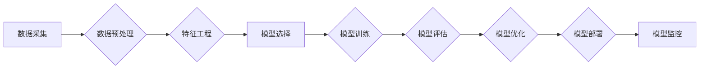

> AI工程学,机器学习,深度学习,算法设计,模型训练,数据处理,工程实践,可解释性

## 1. 背景介绍

人工智能（AI）正以惊人的速度发展，从语音识别到图像生成，AI技术已经渗透到我们生活的方方面面。然而，将AI技术从实验室的理论研究转化为现实世界的应用，需要跨越诸多技术和工程挑战。这就是AI工程学的核心所在。

AI工程学是一门将人工智能理论与工程实践相结合的学科，它关注如何构建、部署和维护可扩展、可靠、高效的AI系统。它涵盖了从数据采集和预处理到模型训练、评估和部署的整个AI生命周期。

随着AI技术的日益成熟，AI工程学的重要性日益凸显。越来越多的企业和组织希望利用AI技术来提升效率、降低成本、创造新的价值。然而，AI工程学是一个相对年轻的领域，缺乏统一的标准和最佳实践。

## 2. 核心概念与联系

AI工程学的核心概念包括：

* **数据驱动:** AI模型的性能直接取决于训练数据的质量和数量。
* **算法设计:** 选择合适的算法模型是构建高效AI系统的关键。
* **模型训练:** 利用算法和数据训练AI模型，使其能够学习并做出预测。
* **模型评估:** 评估模型的性能，并根据评估结果进行模型优化。
* **模型部署:** 将训练好的模型部署到实际应用环境中。
* **可解释性:** 理解AI模型的决策过程，并确保其结果是可解释和可信的。

**Mermaid 流程图:**



## 3. 核心算法原理 & 具体操作步骤

### 3.1  算法原理概述

**机器学习算法**是AI工程学的基础，它允许计算机从数据中学习，并做出预测或决策。常见的机器学习算法包括：

* **监督学习:** 利用标记数据训练模型，例如分类和回归问题。
* **无监督学习:** 从未标记数据中发现模式，例如聚类和降维。
* **强化学习:** 通过试错学习，在环境中获得最大奖励。

### 3.2  算法步骤详解

以**线性回归**算法为例，详细说明其步骤：

1. **数据准备:** 收集并预处理数据，包括特征选择、数据清洗和数据标准化。
2. **模型构建:** 定义线性回归模型，即假设目标变量与特征变量之间存在线性关系。
3. **模型训练:** 利用训练数据，通过最小化模型误差，调整模型参数，使模型能够拟合数据。
4. **模型评估:** 利用测试数据评估模型的性能，例如使用均方误差（MSE）或R-squared值。
5. **模型优化:** 根据评估结果，调整模型参数或选择其他算法，以提高模型性能。

### 3.3  算法优缺点

**线性回归算法**的优点：

* 计算简单，易于理解和实现。
* 训练速度快，适合处理大规模数据。

**线性回归算法**的缺点：

* 只能处理线性关系，对于非线性关系的预测效果较差。
* 对异常值敏感，容易受到异常值的影响。

### 3.4  算法应用领域

**线性回归算法**广泛应用于以下领域：

* **预测分析:** 预测销售额、房价、股票价格等。
* **风险评估:** 评估贷款风险、信用风险等。
* **市场营销:** 分析客户行为，预测客户购买意愿。

## 4. 数学模型和公式 & 详细讲解 & 举例说明

### 4.1  数学模型构建

**线性回归模型**的数学表达式为：

$$y = \theta_0 + \theta_1x_1 + \theta_2x_2 + ... + \theta_nx_n + \epsilon$$

其中：

* $y$ 是目标变量。
* $x_1, x_2, ..., x_n$ 是特征变量。
* $\theta_0, \theta_1, ..., \theta_n$ 是模型参数。
* $\epsilon$ 是误差项。

### 4.2  公式推导过程

模型参数的估计可以通过最小化模型误差来实现。常用的误差函数是均方误差（MSE）：

$$MSE = \frac{1}{n}\sum_{i=1}^{n}(y_i - \hat{y}_i)^2$$

其中：

* $n$ 是样本数量。
* $y_i$ 是第 $i$ 个样本的目标变量值。
* $\hat{y}_i$ 是模型预测的第 $i$ 个样本的目标变量值。

通过求解MSE的最小值，可以得到模型参数的最佳估计值。

### 4.3  案例分析与讲解

假设我们想要预测房屋价格，特征变量包括房屋面积、房间数量、地理位置等。我们可以使用线性回归模型来建立房屋价格预测模型。

通过训练模型，我们可以得到模型参数，例如：

* $\theta_0 = 100000$
* $\theta_1 = 500$
* $\theta_2 = 10000$

这意味着：

* 房屋价格的基准值为100000元。
* 每增加1平方米的房屋面积，房屋价格增加500元。
* 每增加一个房间，房屋价格增加10000元。

## 5. 项目实践：代码实例和详细解释说明

### 5.1  开发环境搭建

本项目使用Python语言进行开发，需要安装以下软件：

* Python 3.x
* NumPy
* Pandas
* Scikit-learn

### 5.2  源代码详细实现

```python
import numpy as np
from sklearn.linear_model import LinearRegression
from sklearn.model_selection import train_test_split

# 加载数据
data = np.loadtxt('housing_data.csv', delimiter=',')

# 分割数据
X = data[:, :-1]  # 特征变量
y = data[:, -1]  # 目标变量
X_train, X_test, y_train, y_test = train_test_split(X, y, test_size=0.2, random_state=42)

# 创建线性回归模型
model = LinearRegression()

# 训练模型
model.fit(X_train, y_train)

# 预测测试数据
y_pred = model.predict(X_test)

# 评估模型性能
from sklearn.metrics import mean_squared_error
mse = mean_squared_error(y_test, y_pred)
print(f'均方误差: {mse}')
```

### 5.3  代码解读与分析

* 代码首先加载数据，并将其分割为训练集和测试集。
* 然后，创建线性回归模型，并使用训练集训练模型。
* 训练完成后，使用测试集预测目标变量值，并计算模型性能指标，例如均方误差。

### 5.4  运行结果展示

运行代码后，会输出模型的均方误差值。

## 6. 实际应用场景

AI工程学在各个领域都有广泛的应用场景，例如：

* **医疗保健:** 诊断疾病、预测患者风险、辅助手术。
* **金融服务:** 欺诈检测、信用评分、风险管理。
* **制造业:** 预测设备故障、优化生产流程、质量控制。
* **零售业:** 个性化推荐、库存管理、客户服务。

### 6.4  未来应用展望

随着AI技术的不断发展，AI工程学将在未来发挥更加重要的作用。例如：

* **边缘计算:** 将AI模型部署到边缘设备，实现实时决策和数据处理。
* **联邦学习:** 在不共享原始数据的情况下，训练联合模型。
* **可解释AI:** 开发能够解释AI模型决策过程的算法和工具。

## 7. 工具和资源推荐

### 7.1  学习资源推荐

* **在线课程:** Coursera, edX, Udacity
* **书籍:**
    * "Hands-On Machine Learning with Scikit-Learn, Keras & TensorFlow" by Aurélien Géron
    * "Deep Learning" by Ian Goodfellow, Yoshua Bengio, and Aaron Courville
* **博客和网站:** Towards Data Science, Machine Learning Mastery

### 7.2  开发工具推荐

* **Python:** 广泛使用的编程语言，用于AI开发。
* **Scikit-learn:** Python机器学习库，提供各种算法和工具。
* **TensorFlow:** Google开发的开源深度学习框架。
* **PyTorch:** Facebook开发的开源深度学习框架。

### 7.3  相关论文推荐

* "Attention Is All You Need" by Vaswani et al. (2017)
* "BERT: Pre-training of Deep Bidirectional Transformers for Language Understanding" by Devlin et al. (2018)
* "Generative Adversarial Networks" by Goodfellow et al. (2014)

## 8. 总结：未来发展趋势与挑战

### 8.1  研究成果总结

AI工程学取得了显著的进展，例如：

* **模型性能提升:** 深度学习算法的不断发展，使得AI模型的性能大幅提升。
* **算法多样化:** 出现了各种新的AI算法，例如Transformer、GAN等。
* **工具和平台的成熟:** 出现了许多开源工具和平台，降低了AI开发的门槛。

### 8.2  未来发展趋势

* **更强大的AI模型:** 研究更强大的AI模型，例如通用人工智能（AGI）。
* **更广泛的应用场景:** 将AI技术应用到更多领域，例如医疗保健、教育、交通运输等。
* **更可解释的AI:** 开发能够解释AI模型决策过程的算法和工具。

### 8.3  面临的挑战

* **数据获取和隐私保护:** 训练高质量的AI模型需要大量数据，同时需要考虑数据隐私保护问题。
* **算法可解释性:** 许多AI模型是黑盒模型，难以解释其决策过程，这可能会导致信任问题。
* **伦理问题:** AI技术的发展也带来了伦理问题，例如算法偏见、工作岗位替代等。

### 8.4  研究展望

未来，AI工程学将继续是一个充满挑战和机遇的领域。我们需要不断探索新的算法、模型和技术，以推动AI技术的进步，并将其应用于解决人类面临的各种问题。

## 9. 附录：常见问题与解答

* **什么是AI工程学？**

AI工程学是一门将人工智能理论与工程实践相结合的学科，它关注如何构建、部署和维护可扩展、可靠、高效的AI系统。

* **AI工程学与机器学习有什么区别？**

机器学习是AI工程学的基础，它提供了一系列算法和工具，用于训练AI模型。而AI工程学则更关注整个AI生命周期的管理和优化，包括数据采集、预处理、模型训练、评估、部署和维护等。

* **学习AI工程学需要哪些技能？**

学习AI工程学需要掌握以下技能：

* 编程语言，例如Python
* 机器学习算法
* 数据处理和分析
* 软件工程

* **AI工程学有哪些应用场景？**

AI工程学在各个领域都有广泛的应用场景，例如：医疗保健、金融服务、制造业、零售业等。

作者：禅与计算机程序设计艺术 / Zen and the Art of Computer Programming


<end_of_turn>