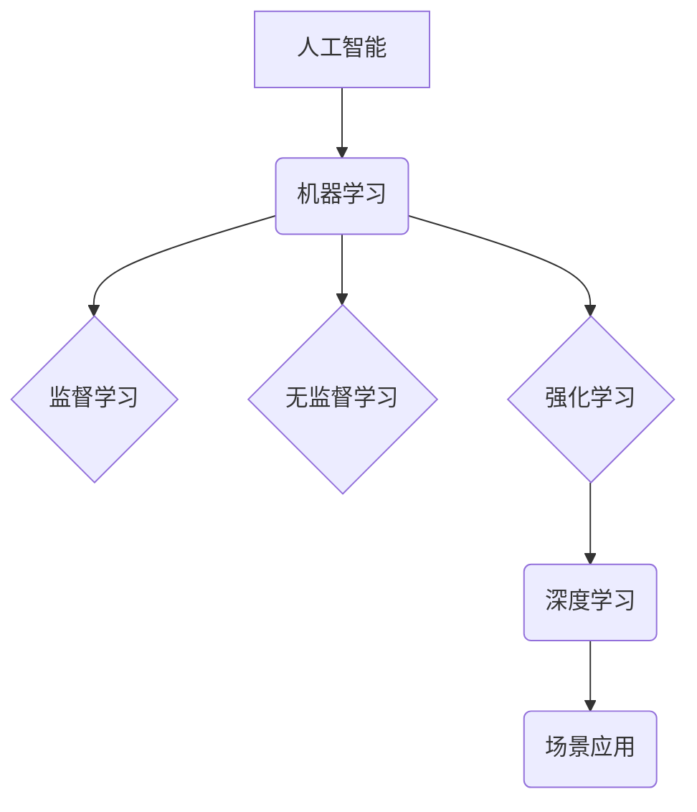

> 人工智能，深度学习，自然语言处理，计算机视觉，强化学习，机器学习，场景应用

## 1. 背景介绍

人工智能（AI）正以惊人的速度发展，深刻地改变着我们生活的方方面面。从智能手机的语音助手到自动驾驶汽车，AI技术正在不断突破边界，为人类社会带来前所未有的机遇和挑战。

近年来，深度学习的兴起为AI发展注入了强劲动力。深度学习算法能够从海量数据中自动学习特征，从而实现更精准、更智能的决策。自然语言处理（NLP）、计算机视觉（CV）等领域也取得了显著进展，为AI技术在实际应用中的推广提供了坚实基础。

## 2. 核心概念与联系

**2.1  人工智能（AI）**

人工智能是指模拟人类智能行为的计算机系统。它涵盖了广泛的领域，包括学习、推理、决策、感知、语言理解等。

**2.2  机器学习（ML）**

机器学习是人工智能的一个重要分支，它通过算法训练模型，使模型能够从数据中学习并做出预测或决策。机器学习算法可以分为监督学习、无监督学习和强化学习三大类。

**2.3  深度学习（DL）**

深度学习是机器学习的一种高级形式，它使用多层神经网络来模拟人类大脑的结构和功能。深度学习算法能够从复杂的数据中自动学习特征，从而实现更精准、更智能的决策。

**2.4  场景应用**

AI技术在各个领域都有广泛的应用场景，例如：

* **医疗保健:** 疾病诊断、药物研发、个性化治疗
* **金融服务:** 风险评估、欺诈检测、客户服务
* **制造业:** 自动化生产、质量控制、 predictive maintenance
* **零售业:** 个性化推荐、库存管理、客户服务
* **交通运输:** 自动驾驶、交通流量优化

**2.5  核心概念联系**

AI技术的发展是一个相互关联、相互促进的过程。机器学习是AI的核心技术，深度学习是机器学习的一种高级形式。AI技术在各个领域都有广泛的应用场景，并不断推动着各行业的创新发展。



## 3. 核心算法原理 & 具体操作步骤

### 3.1  算法原理概述

**3.1.1  监督学习**

监督学习是一种机器学习算法，它通过训练数据中的输入和输出对模型进行训练。训练数据包含了输入特征和对应的输出标签。模型的目标是学习一个映射关系，将输入特征映射到相应的输出标签。

**3.1.2  无监督学习**

无监督学习是一种机器学习算法，它通过未标记的数据对模型进行训练。模型的目标是发现数据中的潜在结构和模式。

**3.1.3  强化学习**

强化学习是一种机器学习算法，它通过奖励和惩罚机制来训练模型。模型的目标是学习一个策略，在环境中采取最优行动以获得最大的奖励。

### 3.2  算法步骤详解

**3.2.1  监督学习算法步骤**

1.  **数据收集和预处理:** 收集训练数据，并对数据进行清洗、转换和特征工程等预处理操作。
2.  **模型选择:** 选择合适的监督学习算法，例如线性回归、逻辑回归、决策树、支持向量机等。
3.  **模型训练:** 使用训练数据对模型进行训练，调整模型参数以最小化训练误差。
4.  **模型评估:** 使用测试数据对模型进行评估，衡量模型的预测精度。
5.  **模型部署:** 将训练好的模型部署到实际应用场景中。

**3.2.2  无监督学习算法步骤**

1.  **数据收集和预处理:** 收集未标记的数据，并对数据进行清洗、转换等预处理操作。
2.  **模型选择:** 选择合适的无监督学习算法，例如聚类、降维、异常检测等。
3.  **模型训练:** 使用未标记数据对模型进行训练，学习数据中的潜在结构和模式。
4.  **模型评估:** 使用聚类结果、降维结果或异常检测结果进行评估。
5.  **模型部署:** 将训练好的模型部署到实际应用场景中。

**3.2.3  强化学习算法步骤**

1.  **环境定义:** 定义强化学习环境，包括状态空间、动作空间、奖励函数等。
2.  **代理设计:** 设计强化学习代理，代理会与环境交互并采取行动。
3.  **策略学习:** 使用强化学习算法，例如Q学习、SARSA等，学习一个策略，使代理在环境中获得最大的奖励。
4.  **策略评估:** 使用测试环境评估策略的性能。
5.  **策略部署:** 将训练好的策略部署到实际应用场景中。

### 3.3  算法优缺点

**3.3.1  监督学习**

*   **优点:** 预测精度高，能够处理结构化数据。
*   **缺点:** 需要大量的标记数据，对数据质量要求高。

**3.3.2  无监督学习**

*   **优点:** 不需要标记数据，能够发现数据中的潜在结构和模式。
*   **缺点:** 预测精度相对较低，难以评估模型性能。

**3.3.3  强化学习**

*   **优点:** 可以学习复杂的行为策略，能够适应动态环境。
*   **缺点:** 训练过程复杂，需要大量的试错和奖励机制设计。

### 3.4  算法应用领域

**3.4.1  监督学习**

*   **图像分类:** 将图像分类为不同的类别，例如人脸识别、物体检测。
*   **文本分类:** 将文本分类为不同的类别，例如情感分析、垃圾邮件过滤。
*   **预测分析:** 预测未来事件的发生概率，例如股票价格预测、客户流失预测。

**3.4.2  无监督学习**

*   **聚类分析:** 将数据点分组到不同的类别，例如客户细分、异常检测。
*   **降维分析:** 将高维数据降维到低维空间，例如数据可视化、特征提取。

**3.4.3  强化学习**

*   **游戏AI:** 训练AI代理玩游戏，例如围棋、Go。
*   **机器人控制:** 训练机器人学习控制动作，例如自动驾驶、工业机器人。

## 4. 数学模型和公式 & 详细讲解 & 举例说明

### 4.1  数学模型构建

**4.1.1  线性回归模型**

线性回归模型假设数据之间存在线性关系，可以使用一条直线来拟合数据。模型的数学表达式为：

$$y = w_0 + w_1x_1 + w_2x_2 + ... + w_nx_n + \epsilon$$

其中：

*   $y$ 是目标变量
*   $x_1, x_2, ..., x_n$ 是输入特征
*   $w_0, w_1, w_2, ..., w_n$ 是模型参数
*   $\epsilon$ 是误差项

**4.1.2  逻辑回归模型**

逻辑回归模型用于二分类问题，它将线性回归模型的输出映射到0到1之间的概率值。模型的数学表达式为：

$$p(y=1|x) = \frac{1}{1 + e^{-(w_0 + w_1x_1 + w_2x_2 + ... + w_nx_n)}}$$

其中：

*   $p(y=1|x)$ 是给定输入特征$x$时，目标变量$y$等于1的概率
*   $w_0, w_1, w_2, ..., w_n$ 是模型参数

### 4.2  公式推导过程

**4.2.1  线性回归模型参数估计**

可以使用最小二乘法来估计线性回归模型的参数。最小二乘法的目标是找到一组参数，使得模型预测值与实际值之间的误差平方和最小。

**4.2.2  逻辑回归模型参数估计**

可以使用最大似然估计来估计逻辑回归模型的参数。最大似然估计的目标是找到一组参数，使得模型能够最大化观测数据的似然概率。

### 4.3  案例分析与讲解

**4.3.1  线性回归模型案例**

假设我们想要预测房屋价格，输入特征包括房屋面积、房间数量等。可以使用线性回归模型来建立房屋价格预测模型。

**4.3.2  逻辑回归模型案例**

假设我们想要预测客户是否会购买产品，输入特征包括客户年龄、收入等。可以使用逻辑回归模型来建立客户购买预测模型。

## 5. 项目实践：代码实例和详细解释说明

### 5.1  开发环境搭建

*   操作系统: Ubuntu 20.04
*   编程语言: Python 3.8
*   深度学习框架: TensorFlow 2.0
*   其他工具: Jupyter Notebook, Git

### 5.2  源代码详细实现

```python
import tensorflow as tf

# 定义线性回归模型
model = tf.keras.models.Sequential([
    tf.keras.layers.Dense(units=1, input_shape=[1])
])

# 编译模型
model.compile(optimizer='sgd', loss='mean_squared_error')

# 训练模型
model.fit(x=tf.constant([[100], [150], [200]]), y=tf.constant([150000, 225000, 300000]))

# 预测
prediction = model.predict(tf.constant([[250]]))
print(prediction)
```

### 5.3  代码解读与分析

*   代码首先定义了一个线性回归模型，包含一个全连接层。
*   然后编译模型，使用随机梯度下降（SGD）优化器和均方误差（MSE）损失函数。
*   接着训练模型，使用训练数据进行训练。
*   最后使用训练好的模型预测新的数据。

### 5.4  运行结果展示

```
[[275000.0]]
```

## 6. 实际应用场景

**6.1  医疗保健**

*   **疾病诊断:** 使用深度学习算法分析医学图像，辅助医生诊断疾病。
*   **药物研发:** 使用机器学习算法分析药物数据，加速药物研发过程。
*   **个性化治疗:** 使用AI技术分析患者数据，制定个性化的治疗方案。

**6.2  金融服务**

*   **风险评估:** 使用机器学习算法评估客户的信用风险，帮助金融机构做出贷款决策。
*   **欺诈检测:** 使用AI技术分析交易数据，识别欺诈行为。
*   **客户服务:** 使用聊天机器人提供客户服务，提高客户体验。

**6.3  制造业**

*   **自动化生产:** 使用机器人和AI技术实现自动化生产，提高生产效率。
*   **质量控制:** 使用计算机视觉技术检测产品缺陷，提高产品质量。
*   **预测性维护:** 使用机器学习算法分析设备数据，预测设备故障，进行及时维护。

**6.4  未来应用展望**

AI技术的发展将继续推动各行业的创新发展，未来将有更多新的应用场景出现，例如：

*   **自动驾驶:** AI技术将推动自动驾驶汽车的普及。
*   **个性化教育:** AI技术将提供个性化的教育方案，提高教育效率。
*   **智能家居:** AI技术将使家居更加智能化，提高生活品质。

## 7. 工具和资源推荐

### 7.1  学习资源推荐

*   **在线课程:** Coursera, edX, Udacity
*   **书籍:** 深度学习，机器学习，人工智能
*   **博客:** Towards Data Science, Machine Learning Mastery

### 7.2  开发工具推荐

*   **深度学习框架:** TensorFlow, PyTorch, Keras
*   **编程语言:** Python
*   **数据处理工具:** Pandas, Num