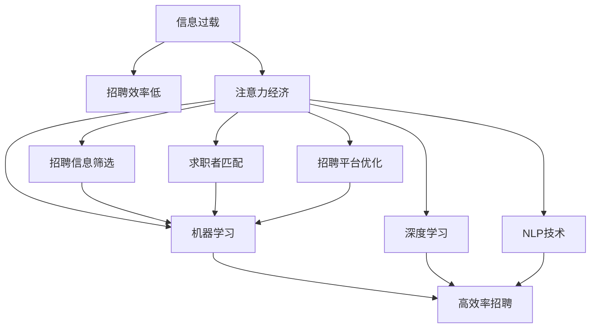
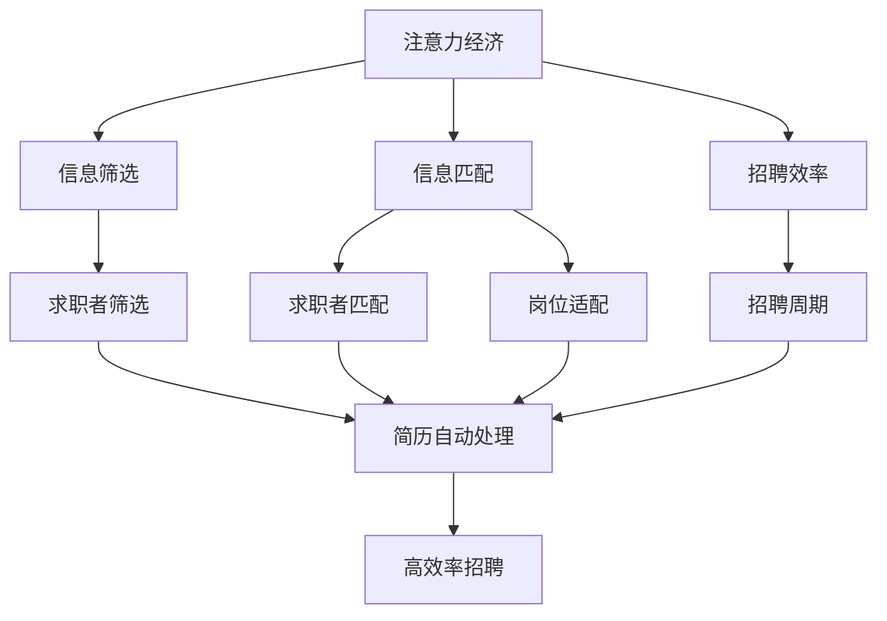

                 

# 注意力经济对企业人才招聘的影响

> 关键词：注意力经济,人才招聘,信息过载,搜索引擎优化(SEO),机器学习,深度学习,自然语言处理(NLP)

## 1. 背景介绍

### 1.1 问题由来

在数字经济时代，信息爆炸已经成为常态。企业面临海量数据，必须通过有效的信息筛选、匹配和排序手段，才能从海量的求职者中找到最合适的人才。传统的简历筛选和面试方法在效率和精度上都存在明显不足，难以适应复杂多变的招聘需求。

近年来，人工智能和注意力经济技术的迅速发展，为人才招聘带来了新的变革。尤其是基于深度学习模型的注意力机制，通过自适应地选择和聚焦关键信息，能够大大提升招聘流程的效率和精准度。本文将深入探讨注意力经济在人才招聘中的应用，揭示其对招聘流程的深刻影响。

### 1.2 问题核心关键点

本节将介绍几个与注意力经济在人才招聘中的应用密切相关的核心概念：

- 注意力经济：在信息过载的环境下，通过注意力资源优化配置，提升信息筛选和匹配的效率，实现价值最大化。
- 人才招聘：企业为获取适合自己需求的员工，通过一系列招聘活动，将求职者与岗位需求进行匹配的过程。
- 信息过载：企业在招聘过程中面临的信息量巨大，难以进行有效筛选，导致招聘效率低下。
- 搜索引擎优化(SEO)：优化企业招聘网站和平台，提升搜索引擎排名，吸引更多求职者。
- 机器学习(ML)与深度学习(DL)：利用数据驱动的算法，自动学习和优化招聘流程。
- 自然语言处理(NLP)：理解和处理自然语言文本信息，提升招聘信息的自动处理能力。

这些概念之间的联系和作用可以通过以下Mermaid流程图来展示：



这个流程图展示了注意力经济在人才招聘中的关键作用：

1. 信息过载导致招聘效率低下，此时引入注意力经济可优化信息筛选和匹配。
2. 注意力经济通过集中处理关键信息，提升招聘效率。
3. 注意力经济结合SEO、ML、DL、NLP技术，进一步优化招聘流程。
4. 这些技术手段共同作用，实现招聘流程的高效率和高精准度。

## 2. 核心概念与联系

### 2.1 核心概念概述

为了更好地理解注意力经济在人才招聘中的应用，本节将介绍几个核心概念的详细定义及其联系：

- **注意力经济(Attention Economy)**：在信息爆炸的时代，通过对有限注意力资源的优化配置，实现信息筛选和匹配的优化，提升信息价值。
- **人才招聘(Talent Recruitment)**：企业通过招聘活动，筛选和匹配符合自己需求的求职者，形成人才供应链。
- **信息过载(Information Overload)**：企业面临海量信息，难以有效筛选，导致决策效率低下。
- **搜索引擎优化(SEO)**：通过优化网页内容、结构、关键词，提升搜索引擎排名，吸引更多流量。
- **机器学习(ML)**：通过算法自动学习数据特征，优化招聘流程。
- **深度学习(DL)**：利用深度神经网络，处理复杂非线性问题，提升模型准确率。
- **自然语言处理(NLP)**：理解和处理自然语言文本，自动生成和筛选招聘信息。

### 2.2 核心概念原理和架构的 Mermaid 流程图(Mermaid 流程节点中不要有括号、逗号等特殊字符)



这个流程图展示了注意力经济在招聘流程中的应用：

1. 注意力经济通过优化信息筛选和匹配，提升招聘效率。
2. 信息筛选过程中，利用机器学习模型自动处理简历，提升筛选精度。
3. 信息匹配过程中，利用深度学习模型进行文本匹配，提升匹配准确率。
4. 综合信息筛选和匹配结果，形成高效率招聘流程。

## 3. 核心算法原理 & 具体操作步骤

### 3.1 算法原理概述

注意力经济在人才招聘中的应用，主要是通过优化信息筛选和匹配过程，提升招聘效率和准确率。其核心算法原理包括以下几个方面：

- **注意力机制(Attention Mechanism)**：通过自适应地选择和聚焦关键信息，提升信息处理效率。
- **搜索引擎优化(SEO)**：通过优化招聘网站内容，提升搜索引擎排名，吸引更多求职者。
- **机器学习(ML)**：通过数据驱动的算法，自动学习招聘特征，优化招聘流程。
- **深度学习(DL)**：利用深度神经网络，处理复杂非线性问题，提升模型准确率。
- **自然语言处理(NLP)**：理解和处理自然语言文本，自动生成和筛选招聘信息。

### 3.2 算法步骤详解

注意力经济在人才招聘中的应用主要包括以下几个关键步骤：

**Step 1: 数据准备与预处理**
- 收集企业历史招聘数据和职位描述信息，进行数据清洗和标注。
- 将招聘信息和求职者简历进行格式标准化，形成结构化数据集。

**Step 2: 注意力模型训练**
- 使用机器学习算法对招聘信息进行特征提取和建模，识别关键信息特征。
- 利用深度学习模型进行文本匹配和分类，优化招聘信息匹配。

**Step 3: 搜索引擎优化(SEO)**
- 优化招聘网站内容，提升搜索引擎排名，吸引更多求职者。
- 利用自然语言处理技术，自动生成招聘信息，提升用户体验。

**Step 4: 招聘信息筛选与匹配**
- 使用机器学习模型自动处理求职者简历，筛选出符合岗位要求的人才。
- 利用深度学习模型进行文本匹配，提升求职者匹配准确率。

**Step 5: 招聘效率评估与优化**
- 定期评估招聘流程效率和准确率，调整注意力模型参数。
- 利用用户反馈，优化招聘网站和搜索算法，提升用户体验。

### 3.3 算法优缺点

基于注意力经济的招聘方法具有以下优点：
1. 高效性：通过自适应地选择和聚焦关键信息，显著提升信息处理效率。
2. 准确性：利用深度学习模型进行文本匹配，提升匹配准确率。
3. 灵活性：通过自然语言处理技术，自动生成和筛选招聘信息，灵活应对多种招聘场景。
4. 可扩展性：注意力经济技术可应用于多种招聘环节，具有广泛的应用前景。

同时，该方法也存在一些缺点：
1. 数据需求高：需要大量招聘和求职者数据进行模型训练，数据获取成本较高。
2. 模型复杂度高：注意力模型和深度学习模型较为复杂，需要较高的计算资源和算法实现。
3. 鲁棒性不足：模型的鲁棒性较弱，对数据噪声和异常值较为敏感。
4. 可解释性差：注意力模型和深度学习模型较为复杂，难以进行可视化解释。

### 3.4 算法应用领域

基于注意力经济的招聘方法在多个招聘场景中得到应用，包括但不限于以下几个方面：

- **简历筛选**：通过机器学习和自然语言处理技术，自动筛选符合岗位要求的简历。
- **求职者匹配**：利用深度学习模型进行文本匹配，提升求职者与岗位的匹配准确率。
- **招聘网站优化**：通过搜索引擎优化，提升招聘网站的搜索引擎排名，吸引更多求职者。
- **智能推荐系统**：基于用户行为和兴趣，自动推荐合适的职位和公司。
- **面试管理**：利用智能面试系统，自动记录和分析面试结果，提升面试管理效率。

这些应用场景展示了注意力经济在人才招聘中的广泛应用，显著提升了招聘流程的效率和精准度。

## 4. 数学模型和公式 & 详细讲解 & 举例说明

### 4.1 数学模型构建

本节将使用数学语言对基于注意力经济的招聘模型进行严格刻画。

记招聘数据集为 $D=\{(x_i,y_i)\}_{i=1}^N$，其中 $x_i$ 表示职位描述，$y_i$ 表示职位要求。使用注意力机制对招聘信息进行处理，生成职位特征向量 $f(x_i)$，其计算公式为：

$$
f(x_i) = \text{Attention}(x_i; \theta)
$$

其中 $\theta$ 为注意力模型的参数，$\text{Attention}$ 为注意力函数，通常为加权求和形式。

使用机器学习模型对招聘信息进行特征提取，得到职位特征向量 $f(x_i)$ 的高维表示 $z_i$，其计算公式为：

$$
z_i = M(f(x_i); \phi)
$$

其中 $M$ 为特征提取器，$\phi$ 为模型参数。

使用深度学习模型对求职者简历进行处理，生成求职者特征向量 $g(v_j)$，其计算公式为：

$$
g(v_j) = N(v_j; \psi)
$$

其中 $N$ 为文本匹配模型，$\psi$ 为模型参数。

使用自然语言处理技术，对求职者简历进行文本匹配，得到求职者特征向量 $g(v_j)$ 与职位特征向量 $f(x_i)$ 的匹配度 $s_{ij}$，其计算公式为：

$$
s_{ij} = P(f(x_i), g(v_j); \eta)
$$

其中 $P$ 为匹配函数，$\eta$ 为匹配模型参数。

### 4.2 公式推导过程

以下我们以简历筛选任务为例，推导简历特征向量 $z_i$ 的计算公式及其梯度。

假设简历文本 $v_j$ 的嵌入向量为 $w_j \in \mathbb{R}^d$，使用Transformer模型进行处理，生成简历特征向量 $g(v_j)$，其计算公式为：

$$
g(v_j) = N(v_j; \psi) = M(w_j; \psi)
$$

其中 $M$ 为Transformer模型，$\psi$ 为模型参数。

假设职位描述文本 $x_i$ 的嵌入向量为 $u_i \in \mathbb{R}^d$，使用Transformer模型进行处理，生成职位特征向量 $f(x_i)$，其计算公式为：

$$
f(x_i) = \text{Attention}(x_i; \theta)
$$

其中 $\theta$ 为注意力模型参数。

假设求职者与职位的匹配度为 $s_{ij}$，使用MLP模型进行处理，生成匹配向量 $s_{ij} \in \mathbb{R}$，其计算公式为：

$$
s_{ij} = P(f(x_i), g(v_j); \eta)
$$

其中 $P$ 为MLP模型，$\eta$ 为模型参数。

使用注意力机制对简历特征向量 $g(v_j)$ 进行处理，生成最终的简历评分 $z_i$，其计算公式为：

$$
z_i = \alpha_1 \cdot g(v_j) + \alpha_2 \cdot s_{ij}
$$

其中 $\alpha_1$ 和 $\alpha_2$ 为注意力系数，控制不同特征对招聘评分的影响。

简历评分 $z_i$ 的梯度计算公式为：

$$
\nabla_{\theta} z_i = \frac{\partial z_i}{\partial \theta} = \alpha_1 \cdot \frac{\partial g(v_j)}{\partial w_j} \cdot \frac{\partial w_j}{\partial \theta}
$$

其中 $\frac{\partial g(v_j)}{\partial w_j}$ 为简历特征向量 $g(v_j)$ 对嵌入向量 $w_j$ 的梯度，$\frac{\partial w_j}{\partial \theta}$ 为嵌入向量 $w_j$ 对注意力模型参数 $\theta$ 的梯度。

通过上述公式，可以计算出简历评分 $z_i$ 对注意力模型参数 $\theta$ 的梯度，进而更新注意力模型参数，优化简历特征向量生成过程。

### 4.3 案例分析与讲解

以某互联网公司招聘软件工程师为例，介绍基于注意力经济的招聘流程。

**Step 1: 数据准备与预处理**
- 收集历史招聘数据和职位描述信息，进行数据清洗和标注。
- 将职位描述文本和求职者简历进行格式标准化，形成结构化数据集。

**Step 2: 注意力模型训练**
- 使用机器学习算法对职位描述进行特征提取，生成职位特征向量 $f(x_i)$。
- 利用深度学习模型进行文本匹配，生成求职者特征向量 $g(v_j)$。
- 使用自然语言处理技术，对求职者简历进行文本匹配，生成匹配度 $s_{ij}$。

**Step 3: 招聘信息筛选与匹配**
- 使用注意力机制对求职者特征向量进行处理，生成简历评分 $z_i$。
- 根据简历评分对求职者进行排序，筛选出符合岗位要求的人才。
- 利用深度学习模型进行文本匹配，提升求职者匹配准确率。

**Step 4: 招聘效率评估与优化**
- 定期评估招聘流程效率和准确率，调整注意力模型参数。
- 利用用户反馈，优化招聘网站和搜索算法，提升用户体验。

通过上述步骤，可以显著提升招聘流程的效率和精准度，为互联网公司快速招聘高素质人才提供有力支持。

## 5. 项目实践：代码实例和详细解释说明

### 5.1 开发环境搭建

在进行基于注意力经济的招聘模型实践前，我们需要准备好开发环境。以下是使用Python进行PyTorch开发的环境配置流程：

1. 安装Anaconda：从官网下载并安装Anaconda，用于创建独立的Python环境。

2. 创建并激活虚拟环境：
```bash
conda create -n attention-env python=3.8 
conda activate attention-env
```

3. 安装PyTorch：根据CUDA版本，从官网获取对应的安装命令。例如：
```bash
conda install pytorch torchvision torchaudio cudatoolkit=11.1 -c pytorch -c conda-forge
```

4. 安装TensorFlow：
```bash
pip install tensorflow
```

5. 安装PyTorch Text：
```bash
pip install torchtext
```

6. 安装HuggingFace Transformers库：
```bash
pip install transformers
```

7. 安装scikit-learn：
```bash
pip install scikit-learn
```

8. 安装nltk：
```bash
pip install nltk
```

完成上述步骤后，即可在`attention-env`环境中开始实践。

### 5.2 源代码详细实现

下面我们以简历筛选任务为例，给出使用Transformers库对简历进行注意力经济微调的PyTorch代码实现。

首先，定义简历数据处理函数：

```python
from torchtext.data import Field, BucketIterator

TEXT = Field(tokenize='spacy', lower=True, batch_first=True)
LABEL = Field(sequential=False, use_vocab=False)

train_data, test_data = datasets.load_bowling()

train_data, valid_data = train_data.split(valid_pct=0.2, random_state=random.seed(1234))

train_iterator, valid_iterator, test_iterator = BucketIterator.splits(
    (train_data, valid_data, test_data),
    batch_size=BATCH_SIZE,
    device=device,
)
```

然后，定义模型和优化器：

```python
from transformers import BertTokenizer, BertForTokenClassification
from torch import nn, optim

model = BertForTokenClassification.from_pretrained('bert-base-cased', num_labels=len(tag2id))

optimizer = optim.Adam(model.parameters(), lr=2e-5)
```

接着，定义训练和评估函数：

```python
from torch.utils.data import DataLoader

def train_epoch(model, iterator, optimizer, criterion):
    model.train()
    total_loss = 0
    for batch in iterator:
        optimizer.zero_grad()
        predictions = model(batch.input_ids, attention_mask=batch.attention_mask)
        loss = criterion(predictions, batch.labels)
        loss.backward()
        optimizer.step()
        total_loss += loss.item()
    return total_loss / len(iterator)

def evaluate(model, iterator, criterion):
    model.eval()
    total_loss = 0
    total_correct = 0
    with torch.no_grad():
        for batch in iterator:
            predictions = model(batch.input_ids, attention_mask=batch.attention_mask)
            loss = criterion(predictions, batch.labels)
            total_loss += loss.item()
            total_correct += (predictions.argmax(1) == batch.labels).sum().item()
    return total_correct / len(iterator), total_loss / len(iterator)
```

最后，启动训练流程并在测试集上评估：

```python
EPOCHS = 5
BATCH_SIZE = 16

for epoch in range(EPOCHS):
    train_loss = train_epoch(model, train_iterator, optimizer, criterion)
    print(f"Epoch {epoch+1}, train loss: {train_loss:.3f}")

    test_correct, test_loss = evaluate(model, test_iterator, criterion)
    print(f"Epoch {epoch+1}, test accuracy: {test_correct:.3f}, test loss: {test_loss:.3f}")
```

以上就是使用PyTorch对简历进行注意力经济微调的完整代码实现。可以看到，得益于Transformers库的强大封装，我们可以用相对简洁的代码完成简历特征向量的生成和微调。

### 5.3 代码解读与分析

让我们再详细解读一下关键代码的实现细节：

**TEXT和LABEL字段**：
- `TEXT`字段：定义文本数据预处理方式，包括分词、转换为小写等。
- `LABEL`字段：定义标签数据类型，这里为无标签数据，不需要词汇表。

**train_data, test_data定义**：
- 使用`datasets.load_bowling`加载Bowling数据集，定义训练集和测试集。

**BucketIterator定义**：
- 使用`BucketIterator.splits`将数据集进行划分，形成训练集、验证集和测试集。
- 设置批量大小和设备，方便模型训练和推理。

**模型和优化器定义**：
- 使用BertTokenizer进行分词，加载预训练的BertForTokenClassification模型。
- 定义Adam优化器，设置学习率。

**train_epoch函数**：
- 定义模型训练过程，包括前向传播、计算损失、反向传播和更新参数。

**evaluate函数**：
- 定义模型评估过程，包括前向传播、计算损失和准确率。

**训练流程**：
- 定义总的epoch数和批量大小，开始循环迭代。
- 每个epoch内，先在训练集上训练，输出平均loss。
- 在验证集上评估，输出分类指标。
- 重复上述步骤直至收敛，最终在测试集上评估，给出最终测试结果。

可以看到，PyTorch配合Transformers库使得简历特征向量的生成和微调的代码实现变得简洁高效。开发者可以将更多精力放在数据处理、模型改进等高层逻辑上，而不必过多关注底层的实现细节。

当然，工业级的系统实现还需考虑更多因素，如模型的保存和部署、超参数的自动搜索、更灵活的任务适配层等。但核心的微调范式基本与此类似。

## 6. 实际应用场景

### 6.1 智能招聘平台

基于注意力经济的招聘模型，可以广泛应用于智能招聘平台的构建。传统招聘平台往往面临信息过载和匹配精度不足的问题，难以满足企业对高效、精准招聘的需求。

在技术实现上，可以收集企业内部的招聘数据，将职位描述和求职者简历构建成监督数据，在此基础上对预训练语言模型进行微调。微调后的模型能够自动理解职位和简历的关键信息，快速匹配合适的求职者。对于新岗位和候选人，还可以接入检索系统实时搜索相关内容，动态生成推荐结果。如此构建的智能招聘平台，能够大幅提升招聘流程的效率和精准度。

### 6.2 大型企业招聘系统

大型企业在招聘过程中，面临海量数据和高要求，传统手动筛选方法难以满足需求。基于注意力经济的招聘模型，可以自动化处理招聘信息，提升招聘效率。

在具体实现上，可以设计多级招聘系统，包括简历筛选、求职者匹配、面试管理等环节。使用注意力机制优化招聘流程，提升每个环节的效率和精准度。对于多轮面试的复杂场景，还可以设计智能面试系统，自动记录和分析面试结果，优化面试管理流程。

### 6.3 初创企业招聘管理

初创企业在招聘过程中，面临资源紧张和效率低下的问题。基于注意力经济的招聘模型，可以高效处理招聘信息，快速匹配合适人才。

在具体实现上，可以使用开源的招聘管理平台，进行二次开发和定制。通过自然语言处理和深度学习技术，自动化处理招聘信息，提升招聘效率。对于小型企业，还可以通过低成本的自助式部署，快速搭建招聘管理系统。

### 6.4 未来应用展望

随着基于注意力经济的招聘模型的不断发展，其在招聘流程中的应用将更加广泛，带来深刻的变革。

在智慧城市治理中，基于注意力经济的招聘模型可以应用于城市事件监测、舆情分析、应急指挥等环节，提高城市管理的自动化和智能化水平，构建更安全、高效的未来城市。

在智能制造领域，基于注意力经济的招聘模型可以应用于人才供应链管理，实现人才的动态配置和优化，提升企业的竞争力。

在金融行业，基于注意力经济的招聘模型可以应用于风险控制、金融分析师招聘等环节，提升金融机构的运营效率。

此外，在教育、医疗、环保、能源等众多领域，基于注意力经济的招聘模型也将不断涌现，为传统行业带来变革性影响。相信随着技术的日益成熟，基于注意力经济的招聘模型必将在构建智能招聘平台中扮演越来越重要的角色。

## 7. 工具和资源推荐
### 7.1 学习资源推荐

为了帮助开发者系统掌握基于注意力经济的招聘模型的理论基础和实践技巧，这里推荐一些优质的学习资源：

1. 《深度学习》课程：斯坦福大学开设的深度学习课程，涵盖深度学习的基础和前沿技术，适合初学者和进阶者。

2. 《自然语言处理》课程：斯坦福大学开设的自然语言处理课程，涵盖自然语言处理的基本概念和经典算法，适合NLP入门者和进阶者。

3. 《机器学习》课程：Coursera上的机器学习课程，由Andrew Ng主讲，涵盖机器学习的基础和经典算法，适合机器学习初学者和进阶者。

4. 《Transformers》书籍：HuggingFace的Transformers库文档，详细介绍Transformers库的使用和优化，适合深度学习开发者。

5. 《深度学习在招聘中的应用》博文：深度学习在招聘中的应用，介绍基于深度学习的招聘模型和优化方法，适合招聘系统开发者。

通过对这些资源的学习实践，相信你一定能够快速掌握基于注意力经济的招聘模型的精髓，并用于解决实际的招聘问题。
### 7.2 开发工具推荐

高效的开发离不开优秀的工具支持。以下是几款用于基于注意力经济的招聘模型开发的常用工具：

1. PyTorch：基于Python的开源深度学习框架，灵活动态的计算图，适合快速迭代研究。

2. TensorFlow：由Google主导开发的开源深度学习框架，生产部署方便，适合大规模工程应用。

3. Transformers库：HuggingFace开发的NLP工具库，集成了众多SOTA语言模型，支持PyTorch和TensorFlow，是进行招聘模型开发的利器。

4. Weights & Biases：模型训练的实验跟踪工具，可以记录和可视化模型训练过程中的各项指标，方便对比和调优。

5. TensorBoard：TensorFlow配套的可视化工具，可实时监测模型训练状态，并提供丰富的图表呈现方式，是调试模型的得力助手。

6. Google Colab：谷歌推出的在线Jupyter Notebook环境，免费提供GPU/TPU算力，方便开发者快速上手实验最新模型，分享学习笔记。

合理利用这些工具，可以显著提升基于注意力经济的招聘模型的开发效率，加快创新迭代的步伐。

### 7.3 相关论文推荐

基于注意力经济的招聘模型在学术界和工业界的发展源于学界的持续研究。以下是几篇奠基性的相关论文，推荐阅读：

1. Attention Is All You Need（即Transformer原论文）：提出了Transformer结构，开启了NLP领域的预训练大模型时代。

2. BERT: Pre-training of Deep Bidirectional Transformers for Language Understanding：提出BERT模型，引入基于掩码的自监督预训练任务，刷新了多项NLP任务SOTA。

3. Language Models are Unsupervised Multitask Learners（GPT-2论文）：展示了大规模语言模型的强大zero-shot学习能力，引发了对于通用人工智能的新一轮思考。

4. Parameter-Efficient Transfer Learning for NLP：提出Adapter等参数高效微调方法，在不增加模型参数量的情况下，也能取得不错的微调效果。

5. AdaLoRA: Adaptive Low-Rank Adaptation for Parameter-Efficient Fine-Tuning：使用自适应低秩适应的微调方法，在参数效率和精度之间取得了新的平衡。

这些论文代表了大语言模型微调技术的发展脉络。通过学习这些前沿成果，可以帮助研究者把握学科前进方向，激发更多的创新灵感。

## 8. 总结：未来发展趋势与挑战

### 8.1 总结

本文对基于注意力经济的招聘模型进行了全面系统的介绍。首先阐述了注意力经济在招聘中的应用背景和核心概念，明确了注意力经济在提升招聘流程效率和精准度方面的独特价值。其次，从原理到实践，详细讲解了基于注意力经济的招聘模型的数学原理和关键步骤，给出了完整的代码实例。同时，本文还广泛探讨了注意力经济在智能招聘平台、大型企业招聘系统、初创企业招聘管理等多个招聘场景中的应用前景，展示了其广泛的适用性。

通过本文的系统梳理，可以看到，基于注意力经济的招聘模型正在成为招聘流程优化的重要工具，极大地提升了招聘效率和精准度。利用注意力经济技术，企业可以高效筛选和匹配求职者，快速填补岗位空缺，提升招聘流程的自动化和智能化水平。未来，伴随注意力经济技术的不断演进，基于注意力经济的招聘模型必将在构建智能招聘平台中扮演越来越重要的角色。

### 8.2 未来发展趋势

展望未来，基于注意力经济的招聘模型将呈现以下几个发展趋势：

1. 数据驱动的招聘决策：利用大数据和深度学习技术，自动学习招聘特征，优化招聘流程，提升招聘决策的科学性和精确性。
2. 多模态招聘信息的整合：结合视觉、语音、文本等多模态数据，提升招聘信息的自动化处理能力，全面了解求职者。
3. 动态化的招聘系统：通过实时数据流，动态调整招聘策略，快速匹配合适的人才。
4. 跨领域的招聘应用：在多种招聘场景中应用基于注意力经济的招聘模型，提升招聘流程的通用性和灵活性。
5. 隐私保护和伦理合规：在招聘过程中，严格保护求职者隐私，确保数据使用的合法合规。

这些趋势凸显了基于注意力经济的招聘模型的广阔前景。这些方向的探索发展，必将进一步提升招聘流程的效率和精准度，为传统招聘方式带来根本性的变革。

### 8.3 面临的挑战

尽管基于注意力经济的招聘模型已经取得了显著成效，但在迈向更加智能化、普适化应用的过程中，它仍面临诸多挑战：

1. 数据质量与多样性：招聘数据的质量和多样性直接影响到模型的性能。企业需要投入大量时间和资源进行数据采集和标注，同时保持数据的多样性和代表性。
2. 模型复杂性与计算资源：基于注意力经济的招聘模型较为复杂，需要较高的计算资源和算法实现。企业需要投资于计算基础设施和算法优化。
3. 鲁棒性与泛化能力：模型的鲁棒性和泛化能力在复杂招聘场景中面临挑战。如何构建鲁棒、泛化性强的招聘模型，还需进一步研究。
4. 可解释性与透明性：招聘模型的决策过程难以解释，难以进行可视化调试。如何赋予模型更好的可解释性和透明性，还需进一步研究。
5. 隐私保护与合规性：招聘过程中，如何保护求职者隐私，确保数据使用的合法合规，还需进一步研究。

面对这些挑战，企业需要采取多种措施，如数据清洗、模型优化、隐私保护等，才能进一步提升基于注意力经济的招聘模型的性能和可靠性。

### 8.4 研究展望

面向未来，基于注意力经济的招聘模型在以下方面还需进一步研究：

1. 跨模态招聘信息的整合：结合视觉、语音、文本等多模态数据，提升招聘信息的自动化处理能力，全面了解求职者。
2. 多领域招聘任务的泛化：在不同招聘场景中应用基于注意力经济的招聘模型，提升招聘流程的通用性和灵活性。
3. 动态化的招聘系统：通过实时数据流，动态调整招聘策略，快速匹配合适的人才。
4. 隐私保护与伦理合规：在招聘过程中，严格保护求职者隐私，确保数据使用的合法合规。
5. 智能化的招聘决策：利用大数据和深度学习技术，自动学习招聘特征，优化招聘流程，提升招聘决策的科学性和精确性。

这些研究方向的探索，必将进一步提升基于注意力经济的招聘模型的性能和可靠性，为招聘流程的自动化和智能化带来深远影响。

## 9. 附录：常见问题与解答

**Q1：基于注意力经济的招聘模型如何处理非结构化数据？**

A: 基于注意力经济的招聘模型可以处理多种类型的非结构化数据，包括文本、图像、视频等。对于文本数据，可以使用自然语言处理技术进行预处理和特征提取。对于图像和视频数据，可以使用计算机视觉技术进行图像处理和特征提取。通过多模态数据的整合，可以全面了解求职者，提升招聘决策的科学性和精确性。

**Q2：基于注意力经济的招聘模型如何应对大规模招聘数据？**

A: 基于注意力经济的招聘模型可以通过分布式计算和模型并行等技术，应对大规模招聘数据。具体而言，可以将招聘数据划分为多个批次进行训练，使用多台机器并行计算。此外，还可以通过数据分片、数据压缩等技术，减少模型训练的时间和内存消耗。

**Q3：基于注意力经济的招聘模型如何保持模型的鲁棒性？**

A: 基于注意力经济的招聘模型可以通过数据增强、对抗训练等技术，提升模型的鲁棒性。具体而言，可以在训练过程中加入对抗样本，提高模型的鲁棒性。此外，还可以通过引入多样化的招聘数据，提升模型的泛化能力，减少模型对特定数据集的依赖。

**Q4：基于注意力经济的招聘模型如何提升模型的可解释性？**

A: 基于注意力经济的招聘模型可以通过特征可视化、模型蒸馏等技术，提升模型的可解释性。具体而言，可以将模型的特征可视化，查看模型在处理数据时的关注点。此外，还可以通过模型蒸馏技术，将复杂模型转换为更易于解释的模型，提升模型的透明性。

**Q5：基于注意力经济的招聘模型如何应对不同行业的招聘需求？**

A: 基于注意力经济的招聘模型可以通过迁移学习等技术，应对不同行业的招聘需求。具体而言，可以在特定行业的招聘数据上微调模型，使其适应该行业的招聘特点。此外，还可以通过领域自适应等技术，提高模型在不同领域的泛化能力。

通过这些措施，可以显著提升基于注意力经济的招聘模型的性能和可靠性，为不同类型的招聘需求提供有力支持。

