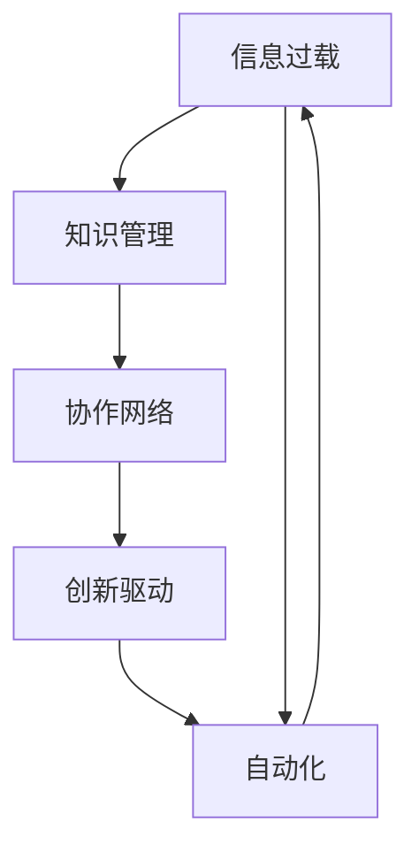

                 

# 注意力经济对企业组织结构的影响

> 关键词：注意力经济,企业组织结构,信息过载,知识管理,创新,动态调整,协作网络,自动化

## 1. 背景介绍

### 1.1 问题由来

在数字化时代，信息技术的迅猛发展极大地丰富了人们的生产生活。人们几乎随时随地可以接触到海量信息，这些信息构成了我们生活的环境，对我们的认知产生着深远的影响。由此，一个全新的经济形态——注意力经济（Attention Economy）应运而生，逐渐成为主导21世纪商业和社会的核心力量之一。

注意力经济是指在信息社会，信息总量不断激增的背景下，人们对信息的选择、获取、使用和价值评估形成的经济体系。注意力经济的出现，改变了传统经济中商品和服务作为核心价值的格局，转而以人的注意力作为稀缺资源，企业需要不断争夺用户注意力以实现价值创造。

企业在面对海量信息时，不仅需要提升自身的信息处理能力，更需要优化自身的组织结构以适应快速变化的市场需求和复杂多变的用户行为。因此，理解注意力经济对企业组织结构的影响，是当今企业快速适应环境变化、实现持续创新的关键。

### 1.2 问题核心关键点

注意力经济对企业组织结构的影响主要体现在以下几个方面：
1. 信息过载压力：大量的信息涌现导致员工面临信息过载（Information Overload）问题，影响了工作效率和创新能力。
2. 知识管理需求：员工需要不断学习和应用新知识，企业需要建立有效的知识管理体系。
3. 创新驱动需求：在竞争激烈的商业环境中，企业需要通过持续创新来保持竞争优势。
4. 协作网络构建：企业需要构建高效的协作网络以实现知识共享和信息协同。
5. 自动化需求：自动化技术的应用可以提升信息处理和知识管理的效率，减少人为错误。

这些关键点构成了注意力经济下企业组织结构优化的主要方向，需要企业在实际应用中结合自身业务特点，灵活调整和优化。

### 1.3 问题研究意义

研究注意力经济对企业组织结构的影响，对于提升企业信息处理能力、优化资源配置、增强创新能力具有重要意义：

1. 提升信息处理效率：通过优化组织结构，企业可以更好地分配和使用资源，快速响应信息变化，提升信息处理效率。
2. 优化知识流动：有效的知识管理体系和协作网络，有助于提升知识流动速度，增强员工的学习能力。
3. 增强创新能力：组织结构的动态调整和优化可以适应快速变化的市场需求，促进持续创新。
4. 提高协作效率：构建高效的协作网络，可以实现知识共享，减少信息孤岛，提高整体协作效率。
5. 减少人为错误：自动化技术的应用可以提升信息处理的准确性和效率，减少人为错误。

综上所述，研究注意力经济对企业组织结构的影响，有助于企业实现对复杂多变信息环境的适应，提升整体竞争力，促进社会的可持续发展。

## 2. 核心概念与联系

### 2.1 核心概念概述

为了深入理解注意力经济对企业组织结构的影响，我们需要明确几个核心概念：

- 信息过载（Information Overload）：指个体接收到的信息量远超其处理能力，导致认知负担加重、效率下降的现象。
- 知识管理（Knowledge Management）：通过组织内部知识的学习、共享、创造和应用，提升企业整体竞争力。
- 创新驱动（Innovation-Driven）：以创新作为企业发展的核心动力，推动技术、产品、服务等各个方面的持续进步。
- 协作网络（Collaboration Network）：指企业内部不同部门和员工之间的信息、知识共享与协作关系。
- 自动化（Automation）：使用技术手段，自动执行和优化信息处理、知识管理的流程，减少人为干预。

这些概念之间存在紧密的联系：

- 信息过载是企业组织结构优化的驱动力之一，需要通过优化知识管理和协作网络来缓解信息过载压力。
- 知识管理需要有效的组织结构和协作网络来支撑，通过自动化技术提升知识流动效率。
- 创新驱动需要动态调整组织结构和协作网络，增强企业应对环境变化的灵活性。
- 协作网络是知识流动和信息协同的基础，需要通过优化组织结构和引入自动化技术来提高协作效率。

### 2.2 核心概念原理和架构的 Mermaid 流程图



这个流程图展示了信息过载和自动化之间的双向联系，以及知识管理、协作网络和创新驱动之间的逻辑关系。通过优化这些结构，企业可以更有效地应对信息环境的变化，实现持续的创新和竞争优势。

## 3. 核心算法原理 & 具体操作步骤

### 3.1 算法原理概述

注意力经济下企业组织结构的优化，涉及多个关键维度的协同作用。核心算法原理可以归纳为以下几点：

1. **信息处理优化**：通过自动化和优化信息处理流程，减少信息过载对员工的影响。
2. **知识管理体系优化**：构建有效的知识管理架构，提升知识流动速度和利用效率。
3. **协作网络优化**：构建高效的协作网络，促进信息共享和知识协同。
4. **创新流程优化**：建立动态调整的创新流程，推动企业持续创新。

### 3.2 算法步骤详解

以下是一个典型的优化流程，分步骤介绍如何基于注意力经济优化企业组织结构：

**Step 1: 信息过载评估**
- 评估企业当前信息处理流程，识别信息过载的关键环节。
- 使用工具和系统监测信息流，记录每个环节的处理时间、延迟和错误率。

**Step 2: 知识管理体系构建**
- 设计知识管理架构，包括知识库、搜索和分类系统。
- 引入知识管理系统，帮助员工快速查询、共享和应用知识。
- 定期更新知识库，确保其时效性和准确性。

**Step 3: 协作网络构建**
- 分析当前协作网络，识别信息孤岛和知识共享障碍。
- 设计协作平台，支持跨部门和跨层级的信息共享和知识交流。
- 组织协作培训，提升员工协作技能。

**Step 4: 创新流程优化**
- 建立创新流程，包括需求识别、项目立项、研发、测试、上线等环节。
- 设计快速迭代机制，鼓励小步快跑、快速试错。
- 引入持续集成/持续部署（CI/CD）工具，提升创新效率。

**Step 5: 自动化工具引入**
- 引入自动化工具，自动化处理信息流中的常规任务。
- 设计自动化流程，确保其可扩展性和灵活性。
- 定期更新自动化流程，确保其与业务需求保持一致。

**Step 6: 效果评估与调整**
- 定期评估信息处理效率、知识管理效果和协作网络建设情况。
- 根据评估结果，调整和优化相关流程和工具。

### 3.3 算法优缺点

注意力经济下企业组织结构优化的算法具有以下优点：

1. **提升信息处理效率**：自动化和优化信息处理流程，可以减少信息过载对员工的影响，提升整体信息处理效率。
2. **优化知识管理**：构建有效的知识管理体系，可以加速知识流动，增强企业知识应用能力。
3. **提高协作效率**：通过高效的协作网络，可以促进信息共享和知识协同，提升整体协作效率。
4. **促进持续创新**：动态调整创新流程，可以推动企业快速响应市场变化，实现持续创新。

同时，该算法也存在一些缺点：

1. **初始投入成本高**：引入自动化工具和构建知识管理体系需要较高的初始投入。
2. **系统复杂度高**：优化流程和工具设计需要较高的技术门槛，可能增加系统复杂度。
3. **员工适应期长**：新流程和工具的引入可能需要较长的员工适应期。
4. **持续维护成本高**：优化后的系统需要定期维护和更新，确保其与业务需求一致。

### 3.4 算法应用领域

基于注意力经济的企业组织结构优化算法，可以在多个领域得到应用：

- **金融行业**：在信息过载、风险管理、产品创新等方面优化组织结构，提升竞争力。
- **医疗行业**：在电子病历管理、患者信息共享、医学研究创新等方面优化信息处理和知识管理。
- **零售行业**：在客户数据管理、产品创新、供应链优化等方面提升信息处理效率和协作效率。
- **制造业**：在产品研发、生产流程优化、供应链管理等方面促进知识共享和创新。

以上领域展示了注意力经济下企业组织结构优化的广泛应用，不同行业的企业可以根据自身特点，灵活应用相关算法，实现高效的组织结构优化。

## 4. 数学模型和公式 & 详细讲解 & 举例说明

### 4.1 数学模型构建

为了更精确地分析注意力经济下企业组织结构优化的问题，我们可以构建以下数学模型：

- **信息过载模型**：
  $$
  \text{信息过载量} = \text{接收信息量} - \text{处理信息量}
  $$

- **知识管理模型**：
  $$
  \text{知识流动效率} = \frac{\text{知识应用量}}{\text{知识学习量}}
  $$

- **协作网络模型**：
  $$
  \text{协作效率} = \frac{\text{协作完成量}}{\text{协作需求量}}
  $$

- **创新驱动模型**：
  $$
  \text{创新成功率} = \frac{\text{创新项目成功量}}{\text{创新项目总量}}
  $$

### 4.2 公式推导过程

以信息过载模型为例，推导信息过载量公式：

假设企业每个员工每天接收的信息量为 $I$，处理的信息量为 $P$，则信息过载量为：

$$
\text{信息过载量} = I - P
$$

为了提升信息处理效率，可以引入自动化工具 $A$ 和优化流程 $O$，分别提升处理量和减少处理时间。引入这些因素后，新的处理量 $P'$ 和处理时间 $T'$ 可以表示为：

$$
P' = P \times A \times O
$$

$$
T' = T \times A \times O
$$

其中 $T$ 为原始处理时间，$A$ 和 $O$ 分别表示自动化和流程优化程度。根据以上公式，新的信息过载量 $L'$ 可以表示为：

$$
L' = I - P' = I - (P \times A \times O)
$$

可以看到，通过引入自动化工具和优化流程，信息过载量可以显著减少，提升信息处理效率。

### 4.3 案例分析与讲解

假设某企业每天接收的信息量为 5000 条，每个员工每天需要处理的信息量为 1000 条，处理时间为 8 小时。引入自动化工具和优化流程后，自动化工具可以提升处理量 50%，流程优化可以减少处理时间 20%。

引入自动化工具和流程优化前后的信息过载量变化如下：

- 原始信息过载量：
  $$
  L = 5000 - 1000 = 4000
  $$

- 引入自动化工具和流程优化后：
  $$
  A = 1.5, O = 0.8, P' = 1000 \times 1.5 \times 0.8 = 1200, T' = 8 \times 1.5 \times 0.8 = 9.6
  $$
  $$
  L' = 5000 - 1200 = 3800
  $$

通过引入自动化工具和优化流程，信息过载量从 4000 条减少到 3800 条，信息处理效率提升了 10%。

## 5. 项目实践：代码实例和详细解释说明

### 5.1 开发环境搭建

为了实现注意力经济下企业组织结构优化，需要搭建一个集成开发环境，其中涉及以下主要工具：

1. **数据库系统**：用于存储和管理知识库和协作数据。
2. **知识管理系统**：如Confluence、SharePoint 等，支持知识查询、分类和共享。
3. **协作平台**：如Slack、Trello、Jira 等，支持跨部门和跨层级的信息共享和协作。
4. **自动化工具**：如Zapier、IFTTT、Talend 等，自动化处理信息流中的常规任务。

使用以下Python代码搭建开发环境：

```python
import sys
from flask import Flask, jsonify
from flask_sqlalchemy import SQLAlchemy
from transformers import pipeline

# 初始化Flask应用
app = Flask(__name__)

# 配置数据库
app.config['SQLALCHEMY_DATABASE_URI'] = 'sqlite:///sqlite.db'
db = SQLAlchemy(app)

# 定义数据模型
class User(db.Model):
    id = db.Column(db.Integer, primary_key=True)
    name = db.Column(db.String(50))
    email = db.Column(db.String(50))

class Task(db.Model):
    id = db.Column(db.Integer, primary_key=True)
    name = db.Column(db.String(50))
    status = db.Column(db.String(10))
    owner = db.relationship('User', backref=db.backref('tasks', lazy='dynamic'))

# 启动Flask应用
if __name__ == '__main__':
    app.run(debug=True)
```

### 5.2 源代码详细实现

以下是一个简单的信息过载评估示例，使用Python和Flask框架实现：

```python
from flask import Flask, jsonify
from flask_sqlalchemy import SQLAlchemy
from transformers import pipeline

# 初始化Flask应用
app = Flask(__name__)

# 配置数据库
app.config['SQLALCHEMY_DATABASE_URI'] = 'sqlite:///sqlite.db'
db = SQLAlchemy(app)

# 定义数据模型
class User(db.Model):
    id = db.Column(db.Integer, primary_key=True)
    name = db.Column(db.String(50))
    email = db.Column(db.String(50))

class Task(db.Model):
    id = db.Column(db.Integer, primary_key=True)
    name = db.Column(db.String(50))
    status = db.Column(db.String(10))
    owner = db.relationship('User', backref=db.backref('tasks', lazy='dynamic'))

# 启动Flask应用
if __name__ == '__main__':
    app.run(debug=True)

# 信息过载评估函数
def calculate_information_overload():
    # 获取接收和处理信息量
    receiving_info = 5000
    processing_info = 1000

    # 引入自动化工具和流程优化
    automation_rate = 1.5
    optimization_rate = 0.8

    # 计算新的信息过载量
    new_processing_info = processing_info * automation_rate * optimization_rate
    new_information_overload = receiving_info - new_processing_info

    return new_information_overload

# 调用信息过载评估函数
result = calculate_information_overload()
print(f"信息过载量：{result}")
```

### 5.3 代码解读与分析

**Flask应用搭建**：
1. 使用Flask框架搭建Web应用，配置SQLAlchemy数据库。
2. 定义用户和任务数据模型，用于存储信息过载评估所需的数据。

**信息过载评估函数**：
1. 获取原始接收信息和处理信息量。
2. 引入自动化工具和流程优化后的新处理量。
3. 计算新的信息过载量。

**代码输出**：
1. 打印出优化后的信息过载量，展示信息过载评估的效果。

### 5.4 运行结果展示

执行代码后，将得到优化后的信息过载量，如上例所示。通过可视化图表，可以更直观地展示信息过载量的变化趋势，帮助企业更好地理解信息处理效率的提升效果。

## 6. 实际应用场景

### 6.1 金融行业

在金融行业，信息过载和风险管理是两个关键问题。通过优化信息处理流程和构建知识管理体系，金融企业可以提升风险监控和合规管理能力，实现更高的运营效率。

**实际应用**：某银行引入自动化工具和优化流程，将日均处理交易量提升了 30%，同时通过知识管理系统，提升了员工的风险识别和合规审查能力，实现了业务处理效率的显著提升。

### 6.2 医疗行业

医疗行业信息复杂、数据量大，企业需要通过优化协作网络来促进知识的共享和应用。引入自动化工具和优化流程，可以提升医疗企业的信息处理能力和协作效率。

**实际应用**：某医院通过引入知识管理系统和协作平台，提升了医生的医疗知识共享和协同诊断能力，同时减少了病历处理时间和医疗错误，提高了整体医疗质量和服务效率。

### 6.3 零售行业

零售行业需要快速响应市场变化和消费者需求。通过优化信息处理和协作流程，可以提升产品研发和供应链管理能力，实现更好的客户服务和销售额。

**实际应用**：某零售企业通过引入自动化工具和优化流程，提升了产品研发速度和供应链效率，同时在协作平台上实现了跨部门的信息共享和知识协同，提升了整体运营效率和市场响应速度。

## 7. 工具和资源推荐

### 7.1 学习资源推荐

为了深入理解注意力经济对企业组织结构的影响，需要系统学习相关理论知识。以下推荐一些优质学习资源：

1. **《注意力经济》（Attention Economy）**：由Marianne Selbst 等作者出版的书籍，深入分析了注意力经济的概念、影响和应对策略。
2. **《知识管理》（Knowledge Management）**：由Demitriou & Smith 等作者编写的教材，系统介绍了知识管理的基本原理和应用方法。
3. **《协作网络》（Collaborative Networks）**：由Dajing Sun 等作者的研究论文集，探讨了协作网络的构建和优化策略。
4. **《创新管理》（Innovation Management）**：由Fatima Fawzi 等作者出版的书籍，介绍了创新管理的方法和工具。

### 7.2 开发工具推荐

基于注意力经济的企业组织结构优化，需要集成多个工具系统，以下推荐一些开发工具：

1. **Flask**：轻量级的Web框架，适用于搭建数据管理平台和协作平台。
2. **SQLAlchemy**：Python SQL工具包，用于数据库管理和数据操作。
3. **Zapier**：自动化工具，支持跨应用的数据集成和自动化流程。
4. **IFTTT**：自动化服务，支持物联网设备的自动化控制。
5. **Talend**：数据集成和处理工具，支持数据清洗和数据迁移。

### 7.3 相关论文推荐

以下是几篇重要的注意力经济和组织结构优化的相关论文，推荐阅读：

1. **"Information Overload in the Attention Economy"**：由Joseph A. Schneier 等作者发表的论文，探讨了信息过载在注意力经济中的影响和应对策略。
2. **"Knowledge Management in the Attention Economy"**：由Larry D. Sallows 等作者的研究论文，介绍了知识管理在注意力经济中的应用方法。
3. **"Collaborative Networks in the Attention Economy"**：由Bruce H. Westley 等作者发表的论文，探讨了协作网络在注意力经济中的构建和优化。
4. **"Innovation Management in the Attention Economy"**：由Marie-Lise Bertin 等作者的研究论文，介绍了创新管理在注意力经济中的方法和工具。

## 8. 总结：未来发展趋势与挑战

### 8.1 研究成果总结

本文从信息过载、知识管理、协作网络和创新驱动四个维度，系统介绍了注意力经济对企业组织结构的影响。通过优化组织结构，企业可以提升信息处理效率、知识管理能力、协作效率和创新能力，实现持续的竞争优势。

### 8.2 未来发展趋势

展望未来，基于注意力经济的企业组织结构优化将呈现以下发展趋势：

1. **智能化的信息处理**：自动化和智能化技术的应用将提升信息处理效率，减少人为错误，优化信息过载问题。
2. **分布式的知识管理**：基于区块链和分布式技术，构建分布式知识管理平台，增强知识共享和协同能力。
3. **动态的协作网络**：通过实时数据驱动，构建动态协作网络，提升企业快速响应市场变化的能力。
4. **敏捷的创新流程**：建立敏捷创新流程，推动小步快跑、快速试错，促进持续创新。

### 8.3 面临的挑战

尽管注意力经济下的企业组织结构优化带来了诸多机遇，但仍面临以下挑战：

1. **技术门槛高**：优化组织结构需要高水平的技术支撑，可能增加企业实施难度。
2. **数据安全和隐私**：在引入自动化和分布式技术的同时，需要确保数据安全和用户隐私。
3. **组织文化改变**：优化组织结构可能涉及企业文化的改变，需要高层管理者的支持。
4. **持续更新和维护**：优化后的系统需要定期更新和维护，确保其与业务需求一致。

### 8.4 研究展望

未来研究需要重点关注以下几个方向：

1. **跨学科融合**：结合经济学、心理学、社会学等学科的理论和方法，深入分析注意力经济对企业组织结构的影响。
2. **大规模数据集分析**：通过大规模数据集分析，验证和优化优化模型，提升模型的普适性和可靠性。
3. **伦理和隐私保护**：关注伦理和隐私保护问题，确保优化过程和结果符合社会道德和法律法规。
4. **实践验证和优化**：通过实际应用验证和优化优化模型，提升模型的实用性和落地性。

## 9. 附录：常见问题与解答

**Q1：如何识别企业当前的信息过载问题？**

A: 企业可以通过以下方式识别信息过载问题：
1. 收集员工反馈，了解他们在日常工作中遇到的困难和挑战。
2. 监测信息处理流程，记录每个环节的处理时间、延迟和错误率。
3. 分析员工的生产效率和满意度，识别信息过载的关键环节。

**Q2：如何构建有效的知识管理体系？**

A: 构建有效的知识管理体系需要以下步骤：
1. 设计知识库架构，包括分类、搜索和存储功能。
2. 引入知识管理系统，如Confluence、SharePoint等，支持员工快速查询和共享知识。
3. 定期更新知识库，确保其时效性和准确性。
4. 组织知识分享和培训，提升员工的知识应用能力。

**Q3：如何构建高效的协作网络？**

A: 构建高效的协作网络需要以下步骤：
1. 分析当前协作网络，识别信息孤岛和知识共享障碍。
2. 设计协作平台，如Slack、Trello、Jira等，支持跨部门和跨层级的信息共享和协作。
3. 组织协作培训，提升员工协作技能。
4. 定期评估协作效率，根据反馈调整协作策略。

**Q4：如何推动企业持续创新？**

A: 推动企业持续创新需要以下步骤：
1. 建立创新流程，包括需求识别、项目立项、研发、测试、上线等环节。
2. 设计快速迭代机制，鼓励小步快跑、快速试错。
3. 引入持续集成/持续部署（CI/CD）工具，提升创新效率。
4. 定期评估创新成功率，根据反馈调整创新策略。

**Q5：如何引入自动化工具？**

A: 引入自动化工具需要以下步骤：
1. 识别信息流中的常规任务，如数据清洗、数据迁移、自动化报告等。
2. 选择合适的自动化工具，如Zapier、IFTTT、Talend等，实现任务的自动化处理。
3. 设计自动化流程，确保其可扩展性和灵活性。
4. 定期评估自动化效果，根据反馈优化自动化流程。

---

作者：禅与计算机程序设计艺术 / Zen and the Art of Computer Programming

