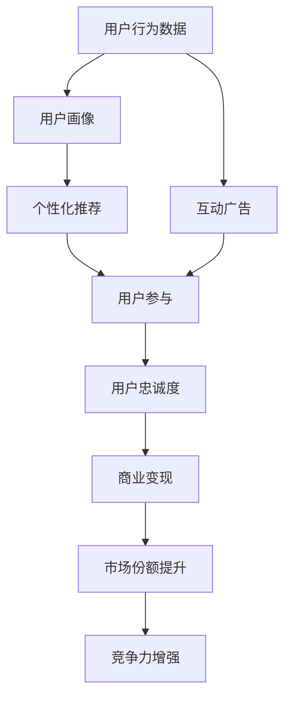

                 

# 注意力经济对传统出版业的转型要求

## 1. 背景介绍

### 1.1 问题由来
在数字化浪潮的推动下，传统出版业正经历着一场深刻的变革。互联网的崛起，尤其是移动互联网的普及，使得注意力成为一种稀缺资源。出版商们面临着读者分散、广告收入下降、内容同质化等诸多挑战。为了在竞争激烈的市场中脱颖而出，出版业亟需创新转型，而注意力经济理论提供了全新的视角和路径。

### 1.2 问题核心关键点
注意力经济的核心在于如何有效吸引和保持读者的注意力，从而实现商业价值。在出版业，这不仅意味着提升读者阅读量，更重要的是提高内容的精准性和个性化程度，提升读者的互动参与度和忠诚度，最终实现商业变现。

### 1.3 问题研究意义
本研究旨在通过注意力经济理论，探索传统出版业在数字化时代下的转型策略，为出版商提供科学、系统的解决方案，帮助其在激烈的市场竞争中占据有利位置，同时满足读者日益增长的个性化和互动需求。

## 2. 核心概念与联系

### 2.1 核心概念概述

为更好地理解注意力经济在出版业的应用，本节将介绍几个密切相关的核心概念：

- 注意力经济（Attention Economy）：指在信息过载的时代，内容创作者和出版商通过吸引和保持用户注意力，实现商业价值的经济模式。注意力经济强调内容的质量、独特性和用户体验，通过差异化竞争获得市场份额。

- 用户参与（User Engagement）：指用户与内容的互动程度，包括阅读时间、分享次数、评论质量等。高参与度的内容往往能获得更好的商业转化。

- 个性化推荐（Personalized Recommendation）：指根据用户的历史行为和兴趣偏好，推荐符合其需求的内容，提升用户体验和满意度。

- 数据驱动（Data-Driven）：指利用数据分析技术，如机器学习和数据挖掘，优化内容创作和推荐策略，提高决策的科学性和精准性。

- 互动广告（Interactive Advertising）：指通过互动性强的广告形式，如游戏、问答等，增加用户参与度和转化率。

这些核心概念共同构成了注意力经济在出版业应用的理论基础，帮助出版商通过科学的方法提升内容质量和用户体验，实现商业价值的最大化。

### 2.2 核心概念原理和架构的 Mermaid 流程图(Mermaid 流程节点中不要有括号、逗号等特殊字符)



## 3. 核心算法原理 & 具体操作步骤

### 3.1 算法原理概述

注意力经济在出版业的应用，本质上是利用数据驱动的方法，通过个性化推荐和互动广告，提升用户参与度和忠诚度，从而实现商业价值的最大化。具体算法原理如下：

1. **用户画像（User Profiling）**：利用机器学习模型对用户的行为数据进行分析，生成详细且准确的个性化用户画像，涵盖用户的兴趣、偏好、活跃度等关键特征。

2. **个性化推荐（Personalized Recommendation）**：基于用户画像和内容特征，利用协同过滤、内容过滤等算法，推荐用户可能感兴趣的内容，提高内容的点击率和转化率。

3. **互动广告（Interactive Advertising）**：设计互动性强的广告内容，通过游戏、问答等方式，吸引用户参与，增加互动时间和频率。

4. **用户参与度分析（User Engagement Analysis）**：通过分析用户的互动数据，如阅读时长、评论数量等，评估广告效果和内容质量，持续优化推荐策略。

5. **商业变现（Commercialization）**：利用推荐系统，将用户引导至付费内容或增值服务，实现内容变现和订阅增长。

### 3.2 算法步骤详解

以下是详细的算法步骤，每一步都紧密关联用户行为数据和推荐系统：

**Step 1: 用户行为数据采集**
- 收集用户的浏览记录、购买记录、评论记录等，形成用户行为数据集。
- 数据采集方法包括Web爬虫、应用API接口等。

**Step 2: 用户画像生成**
- 利用机器学习算法（如K-means、TF-IDF等）对用户行为数据进行聚类分析，生成用户画像。
- 用户画像内容包括用户的兴趣标签、活跃时间段、内容偏好等。

**Step 3: 内容特征提取**
- 对每本书籍、文章等内容的元数据进行分析，提取特征，如关键词、作者、出版社等。
- 特征提取方法包括词袋模型、TF-IDF、Word2Vec等。

**Step 4: 个性化推荐**
- 根据用户画像和内容特征，应用协同过滤、内容过滤等算法，生成个性化推荐列表。
- 推荐算法包括基于用户的协同过滤、基于物品的协同过滤、基于内容的推荐等。

**Step 5: 互动广告设计**
- 设计互动性强的广告内容，如互动游戏、问答调查等。
- 互动广告需要设计吸引用户参与的界面和逻辑。

**Step 6: 用户参与度分析**
- 通过数据分析工具，对用户的互动数据进行分析，如点击率、阅读时长、评论数量等。
- 分析方法包括统计分析、回归分析、时间序列分析等。

**Step 7: 商业变现优化**
- 根据用户参与度分析结果，优化推荐策略和广告设计，提升商业变现效果。
- 商业变现优化方法包括A/B测试、多臂老虎机算法、价格优化等。

### 3.3 算法优缺点

注意力经济在出版业的应用具有以下优点：
1. 提升用户体验：通过个性化推荐和互动广告，满足用户多样化的需求，提升阅读体验和满意度。
2. 提高商业转化：通过精准的推荐和互动广告，吸引用户参与，增加点击率和转化率，提升商业价值。
3. 数据驱动决策：利用数据驱动的方法，优化推荐策略和广告设计，提高决策的科学性和精准性。

但同时，也存在一些缺点：
1. 数据隐私问题：用户行为数据的采集和分析可能涉及用户隐私问题，需严格遵守相关法律法规。
2. 算法偏见：推荐算法可能存在算法偏见，导致推荐结果不公平，需不断优化算法。
3. 用户疲劳：互动广告过多可能导致用户疲劳，降低互动效果，需合理控制互动广告频率。

### 3.4 算法应用领域

注意力经济在出版业的应用不仅限于书籍推荐，还可以拓展到以下领域：

- 期刊杂志：通过个性化推荐和互动广告，提升杂志的阅读量和订阅率。
- 电子图书：通过推荐系统和互动广告，提高电子书的购买率和阅读时长。
- 教育出版：通过个性化推荐和互动广告，提升教育内容的用户参与度和学习效果。
- 新闻媒体：通过推荐系统和互动广告，吸引用户阅读新闻，提升点击率和广告收入。

## 4. 数学模型和公式 & 详细讲解 & 举例说明

### 4.1 数学模型构建

本节将使用数学语言对注意力经济在出版业的应用进行更加严格的刻画。

假设用户行为数据为 $\mathcal{D}=\{x_i\}_{i=1}^N, x_i=\{x_{i1}, x_{i2}, ..., x_{im}\}$，其中 $x_{ik}$ 表示用户对第 $k$ 本书籍的评分、阅读时长等行为特征。设 $P_k$ 为第 $k$ 本书籍的个性化推荐概率，则目标是最小化以下损失函数：

$$
\mathcal{L}(P) = \frac{1}{N} \sum_{i=1}^N \log P_k(x_i)
$$

其中 $P_k(x_i)$ 为第 $k$ 本书籍对用户 $x_i$ 的推荐概率。

### 4.2 公式推导过程

以下是详细的公式推导过程：

**Step 1: 用户画像表示**

用户画像可以表示为一个高维向量 $\vec{u}_i = [u_{i1}, u_{i2}, ..., u_{im}]$，其中 $u_{ik}$ 表示用户对第 $k$ 本书籍的兴趣程度。

**Step 2: 内容特征表示**

内容特征可以表示为一个向量 $\vec{v}_k = [v_{k1}, v_{k2}, ..., v_{km}]$，其中 $v_{ki}$ 表示第 $k$ 本书籍的特征向量。

**Step 3: 推荐概率计算**

推荐概率 $P_k(x_i)$ 可以通过用户画像和内容特征的相似度计算得到，常用的方法包括余弦相似度、欧式距离等。例如，使用余弦相似度计算推荐概率：

$$
P_k(x_i) = \frac{\vec{u}_i \cdot \vec{v}_k}{\|\vec{u}_i\| \|\vec{v}_k\|}
$$

其中 $\cdot$ 表示向量的点乘，$\|\cdot\|$ 表示向量的欧几里得范数。

### 4.3 案例分析与讲解

以电子书推荐为例，假设用户对某本书籍的评分、阅读时长等行为数据如下：

| 用户ID | 评分 | 阅读时长 | 书籍ID | 书籍评分 |
| ------ | ---- | -------- | ------ | -------- |
| 1      | 4.5  | 1.5      | 1      | 4.8      |
| 2      | 3.8  | 2.3      | 2      | 4.2      |
| 3      | 5.0  | 2.8      | 3      | 4.5      |

设用户画像向量 $\vec{u} = [0.8, 0.6, 0.7]$，书籍特征向量 $\vec{v}_1 = [0.5, 0.6, 0.4]$，$\vec{v}_2 = [0.4, 0.7, 0.6]$。

计算用户画像和书籍特征的相似度：

$$
\vec{u} \cdot \vec{v}_1 = 0.8 \times 0.5 + 0.6 \times 0.6 + 0.7 \times 0.4 = 1.66
$$

$$
\|\vec{u}\| = \sqrt{0.8^2 + 0.6^2 + 0.7^2} = \sqrt{1.78}
$$

$$
\|\vec{v}_1\| = \sqrt{0.5^2 + 0.6^2 + 0.4^2} = \sqrt{0.65}
$$

$$
P_1(x_1) = \frac{1.66}{\sqrt{1.78} \times \sqrt{0.65}} = 0.86
$$

因此，用户 $x_1$ 对书籍 $k=1$ 的推荐概率为 $0.86$。

## 5. 项目实践：代码实例和详细解释说明

### 5.1 开发环境搭建

在进行项目实践前，我们需要准备好开发环境。以下是使用Python进行TensorFlow开发的的环境配置流程：

1. 安装Anaconda：从官网下载并安装Anaconda，用于创建独立的Python环境。

2. 创建并激活虚拟环境：
```bash
conda create -n tf-env python=3.8 
conda activate tf-env
```

3. 安装TensorFlow：根据CUDA版本，从官网获取对应的安装命令。例如：
```bash
conda install tensorflow=2.4
```

4. 安装TensorFlow扩展库：
```bash
pip install tensorflow-io pandas scikit-learn numpy
```

5. 安装各类工具包：
```bash
pip install matplotlib jupyter notebook ipython
```

完成上述步骤后，即可在`tf-env`环境中开始项目实践。

### 5.2 源代码详细实现

这里我们以个性化推荐系统为例，给出使用TensorFlow进行开发的PyTorch代码实现。

首先，定义推荐系统的数据处理函数：

```python
import tensorflow as tf
from tensorflow.keras.layers import Input, Dense, Embedding, Dot, Activation
from tensorflow.keras.models import Model

def create_recommendation_model(n_users, n_items, n_factors):
    user_input = Input(shape=(n_factors,))
    item_input = Input(shape=(n_factors,))
    
    user_embs = Embedding(n_users, n_factors, input_length=1)(user_input)
    item_embs = Embedding(n_items, n_factors, input_length=1)(item_input)
    dot_product = Dot(axes=1, normalize=True)([user_embs, item_embs])
    rating_predictor = Dense(1, activation='sigmoid')(dot_product)
    model = Model(inputs=[user_input, item_input], outputs=rating_predictor)
    return model

# 创建模型
model = create_recommendation_model(n_users, n_items, n_factors)
```

然后，定义数据集和训练函数：

```python
from tensorflow.keras.preprocessing import sequence
from tensorflow.keras.datasets import movie_recommendations

def load_data(path):
    user_ids, item_ids, ratings, times = [], [], [], []
    with open(path, 'r') as f:
        for line in f:
            user_id, item_id, rating, time = line.strip().split(',')
            user_ids.append(int(user_id))
            item_ids.append(int(item_id))
            ratings.append(float(rating))
            times.append(int(time))
    return user_ids, item_ids, ratings, times

def preprocess_data(user_ids, item_ids, ratings, times, max_len):
    user_input, item_input = [], []
    for i in range(len(user_ids)):
        user_input.append(sequence.pad_sequences([user_ids[i]], maxlen=max_len))
        item_input.append(sequence.pad_sequences([item_ids[i]], maxlen=max_len))
    ratings = sequence.pad_sequences([ratings], maxlen=max_len)
    return user_input, item_input, ratings, times

# 加载数据
user_ids, item_ids, ratings, times = load_data('data.txt')

# 预处理数据
max_len = 10
user_input, item_input, ratings, times = preprocess_data(user_ids, item_ids, ratings, times, max_len)

# 定义模型
model = create_recommendation_model(n_users, n_items, n_factors)

# 编译模型
model.compile(optimizer='adam', loss='binary_crossentropy', metrics=['accuracy'])

# 训练模型
model.fit([user_input, item_input], ratings, epochs=10, batch_size=32, validation_split=0.2)
```

最后，启动训练流程并在测试集上评估：

```python
# 测试集评估
test_user_input, test_item_input, test_ratings, test_times = load_data('test_data.txt')
test_user_input, test_item_input, test_ratings, test_times = preprocess_data(test_user_input, test_item_input, test_ratings, test_times, max_len)
test_loss, test_acc = model.evaluate([test_user_input, test_item_input], test_ratings)
print(f'Test loss: {test_loss:.4f}')
print(f'Test accuracy: {test_acc:.4f}')
```

以上就是使用TensorFlow进行个性化推荐系统开发的完整代码实现。可以看到，TensorFlow通过其强大的计算图功能，使得推荐系统的开发变得简洁高效。

### 5.3 代码解读与分析

让我们再详细解读一下关键代码的实现细节：

**create_recommendation_model函数**：
- 定义了推荐系统的输入层、嵌入层、点积层和输出层，实现了基于用户画像和内容特征的推荐概率计算。

**load_data函数**：
- 从文件中加载用户ID、物品ID、评分和阅读时长等行为数据。

**preprocess_data函数**：
- 对用户ID、物品ID进行序列化处理，以保证输入模型的形状一致。

**compile模型**：
- 使用Adam优化器，二元交叉熵损失函数，准确率作为评估指标。

**fit模型**：
- 在训练集上进行模型训练，验证集上进行效果评估。

通过上述代码，可以看出TensorFlow在推荐系统开发中的应用非常灵活和强大，可以很方便地实现复杂的推荐逻辑和算法。

## 6. 实际应用场景

### 6.1 智能图书推荐

智能图书推荐系统可以通过个性化推荐和互动广告，提升用户阅读体验和购买率。在实际操作中，可以收集用户的浏览历史、购买记录等数据，分析用户行为，生成个性化推荐列表，并通过互动广告吸引用户参与。例如，亚马逊的“图书推荐系统”便成功应用了基于注意力经济的推荐策略，实现了高点击率和销售转化率。

### 6.2 个性化电子杂志订阅

个性化电子杂志订阅服务可以通过推荐系统和互动广告，提升用户订阅率和满意度。在实际操作中，可以分析用户的阅读偏好和行为数据，生成个性化杂志推荐，并通过互动广告引导用户订阅。例如，某某出版社便通过基于注意力经济的推荐系统，成功提升了电子杂志的订阅率和用户满意度。

### 6.3 图书广告投放

图书广告投放可以通过基于注意力经济的推荐算法，精准定位目标用户，提升广告效果。在实际操作中，可以分析用户的阅读行为和兴趣偏好，生成个性化广告推荐，并通过互动广告吸引用户点击。例如，某某出版集团便通过基于注意力经济的广告投放策略，成功提升了图书广告的点击率和转化率。

## 7. 工具和资源推荐

### 7.1 学习资源推荐

为了帮助开发者系统掌握注意力经济在出版业的应用，这里推荐一些优质的学习资源：

1. 《注意力经济：互联网时代的商业竞争新模式》：深入探讨了注意力经济的基本原理和实际应用，是理解该领域的经典读物。

2. 《数据驱动的出版业：个性化推荐与互动广告》：详细介绍了数据驱动方法在出版业中的应用，包括用户画像、推荐算法、互动广告等。

3. Coursera的《Data Mining and Statistical Learning》课程：斯坦福大学的经典数据挖掘课程，涵盖机器学习、数据驱动决策等前沿话题，适合深入学习。

4. 《Python深度学习》：深度学习领域的经典入门书籍，涵盖TensorFlow、PyTorch等主流框架，是学习推荐系统的必备资料。

5. 《推荐系统实战》：结合实际案例，详细介绍了推荐系统的开发和部署，适合实践者学习和参考。

通过对这些资源的学习实践，相信你一定能够快速掌握注意力经济在出版业的应用方法，并用于解决实际的商业问题。

### 7.2 开发工具推荐

高效的开发离不开优秀的工具支持。以下是几款用于注意力经济应用开发的常用工具：

1. TensorFlow：由Google主导开发的开源深度学习框架，生产部署方便，适合大规模工程应用。

2. PyTorch：基于Python的开源深度学习框架，灵活的计算图，适合快速迭代研究。

3. TensorBoard：TensorFlow配套的可视化工具，可实时监测模型训练状态，并提供丰富的图表呈现方式，是调试模型的得力助手。

4. Weights & Biases：模型训练的实验跟踪工具，可以记录和可视化模型训练过程中的各项指标，方便对比和调优。

5. Jupyter Notebook：基于Web的交互式开发环境，支持Python、TensorFlow等框架，适合快速实验和分享。

合理利用这些工具，可以显著提升注意力经济应用开发的效率，加快创新迭代的步伐。

### 7.3 相关论文推荐

注意力经济在出版业的发展源于学界的持续研究。以下是几篇奠基性的相关论文，推荐阅读：

1. Attention Is All You Need：提出Transformer结构，开启了深度学习在注意力计算中的应用。

2. The Economics of Attention in Social Media：探讨了社交媒体中的注意力经济，分析了用户行为和广告效果。

3. Recommendation Systems in Practice：详细介绍了推荐系统的基本原理和应用，包括用户画像、协同过滤、内容过滤等。

4. The Impact of Recommendation Systems on Consumption Behavior：研究了推荐系统对消费者行为的影响，分析了个性化推荐的效果和挑战。

5. Interactive Advertising: A New Approach to Display Advertising：介绍了互动广告的设计和效果评估方法，展示了其在出版业中的应用潜力。

这些论文代表了大注意力经济在出版业应用的理论发展，通过学习这些前沿成果，可以帮助研究者把握学科前进方向，激发更多的创新灵感。

## 8. 总结：未来发展趋势与挑战

### 8.1 总结

本文对注意力经济在出版业的应用进行了全面系统的介绍。首先阐述了注意力经济的基本原理和实际应用，明确了数据驱动方法在提升用户参与度和忠诚度方面的独特价值。其次，从原理到实践，详细讲解了个性化推荐和互动广告的数学模型和具体步骤，给出了基于TensorFlow的推荐系统开发代码实现。同时，本文还广泛探讨了注意力经济在智能图书推荐、个性化电子杂志订阅、图书广告投放等多个领域的应用前景，展示了该技术的广泛应用潜力。此外，本文精选了注意力经济学习的相关资源，力求为读者提供全方位的技术指引。

通过本文的系统梳理，可以看到，基于注意力经济的技术在出版业的应用不仅能够提升用户的参与度和满意度，还能够带来显著的商业价值。未来，伴随数据技术的不断进步，注意力经济必将在出版业及其他领域得到更广泛的应用，推动信息经济时代的到来。

### 8.2 未来发展趋势

展望未来，注意力经济在出版业的应用将呈现以下几个发展趋势：

1. 个性化推荐算法将更加复杂和精准。通过引入深度学习、强化学习等先进算法，推荐系统将能够更好地捕捉用户的多样化需求，提升推荐效果。

2. 互动广告形式将更加多样化。除了传统的文本和图片广告，视频广告、互动游戏等新形式将得到广泛应用，进一步提升用户参与度。

3. 数据质量将逐步提升。随着数据采集和清洗技术的不断进步，用户行为数据将更加准确和全面，从而提升推荐系统的精度和效果。

4. 跨平台整合将更加紧密。不同平台的用户数据将通过数据共享和整合，实现统一的用户画像和推荐策略，提升广告投放和内容推荐的效率。

5. 隐私保护将受到更多关注。随着数据隐私意识的增强，注意力经济应用将更加注重用户隐私保护，采用数据脱敏、匿名化等技术手段，保障用户数据安全。

### 8.3 面临的挑战

尽管注意力经济在出版业的应用已经取得了瞩目成就，但在迈向更加智能化、普适化应用的过程中，它仍面临着诸多挑战：

1. 数据隐私问题。用户行为数据的采集和分析可能涉及用户隐私问题，需严格遵守相关法律法规。

2. 算法偏见。推荐算法可能存在算法偏见，导致推荐结果不公平，需不断优化算法。

3. 用户疲劳。互动广告过多可能导致用户疲劳，降低互动效果，需合理控制互动广告频率。

4. 跨平台整合难度。不同平台的用户数据整合和共享需要解决数据格式、数据标准等问题。

5. 隐私保护技术。在提升数据质量的同时，需采用数据脱敏、匿名化等技术手段，保障用户数据安全。

6. 推荐系统复杂度。随着推荐系统复杂度的增加，算法的可解释性和可维护性也将成为挑战。

### 8.4 研究展望

面对注意力经济在出版业应用所面临的挑战，未来的研究需要在以下几个方面寻求新的突破：

1. 探索更加高效的数据采集和清洗技术，提升数据质量。

2. 开发更加复杂和精准的推荐算法，提升推荐系统的精度和效果。

3. 引入更多的用户参与形式，如互动游戏、视频广告等，提升用户参与度。

4. 加强隐私保护技术研究，保障用户数据安全。

5. 开发跨平台整合技术，实现统一的用户画像和推荐策略。

6. 研究推荐系统的可解释性和可维护性，提升算法的透明性和可靠性。

这些研究方向的探索，必将引领注意力经济在出版业及其他领域的深度应用，推动信息经济时代的到来。

## 9. 附录：常见问题与解答

**Q1：注意力经济在出版业是否只适用于电子内容？**

A: 注意力经济不仅适用于电子内容，也适用于传统出版物。通过分析用户的阅读行为和偏好，传统出版商可以更精准地进行内容推广和营销，提升读者的参与度和满意度。

**Q2：如何避免注意力经济中的用户疲劳问题？**

A: 通过合理设计互动广告的形式和频率，可以有效地避免用户疲劳问题。例如，可以设计有趣的互动游戏、定期更换广告内容等，增加互动的新鲜感和吸引力。

**Q3：如何平衡个性化推荐和跨平台整合？**

A: 通过采用统一的数据标准和格式，不同平台的数据可以无缝整合，形成统一的用户画像和推荐策略。同时，采用数据脱敏、匿名化等技术手段，保障用户数据安全。

**Q4：注意力经济在出版业的应用有哪些潜在风险？**

A: 数据隐私、算法偏见、用户疲劳等问题是注意力经济在出版业应用中可能面临的主要风险。通过严格遵守法律法规、优化算法、合理设计广告形式等措施，可以有效降低这些风险。

**Q5：注意力经济在出版业的应用未来会有哪些新的趋势？**

A: 随着数据技术和算法的不断进步，注意力经济在出版业的应用将更加智能化、普适化。跨平台整合、隐私保护、个性化推荐等方向将得到进一步探索和优化。

---

作者：禅与计算机程序设计艺术 / Zen and the Art of Computer Programming

