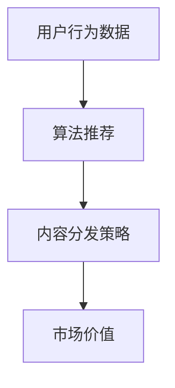

                 

# 注意力经济对传统媒体内容形式的改变

> 关键词：注意力经济,媒体内容,算法推荐,用户行为,个性化,市场价值

## 1. 背景介绍

在数字时代，信息爆炸和技术变革正在深刻改变媒体内容和消费模式。传统媒体如报纸、电视、广播等正面临前所未有的挑战和转型压力。与此同时，互联网公司如谷歌、Facebook、Netflix等通过强大的算法推荐系统，利用用户行为数据进行内容分发，创造了一个以“注意力”为核心的新型经济模式。本文将从注意力经济的角度出发，探讨其在媒体内容形式上的改变及其影响。

### 1.1 问题由来

自互联网诞生以来，传统媒体受到了极大的冲击。信息流技术的崛起使得信息获取变得更加快速和便捷，用户注意力成为商家争夺的焦点。如何通过算法推荐系统高效利用用户注意力，最大化广告价值和市场效益，成为众多互联网公司竞相探索的新方向。传统媒体也逐渐意识到，基于算法推荐的内容分发机制，不仅能够提升用户粘性，还能开辟新的盈利渠道。

### 1.2 问题核心关键点

注意力经济的核心在于通过算法推荐系统精准捕捉用户行为数据，实时调整内容展示策略，将合适的信息推送给合适的用户，从而提高用户对内容的关注度和互动率。传统媒体在内容形式的改变上，需要考虑以下几点：

1. **内容个性化**：通过分析用户行为数据，提供定制化的内容推荐，满足用户的个性化需求。
2. **互动性增强**：设计互动性强的内容形式，如短视频、直播、互动广告等，增强用户沉浸感。
3. **平台多元化**：利用多平台分发，扩大内容的覆盖面和影响力。
4. **市场价值最大化**：通过算法推荐优化内容分发策略，提升广告投放和商业合作的效益。

本文将深入分析这些关键点，探讨传统媒体如何在注意力经济模式下，对内容形式进行创新和优化。

## 2. 核心概念与联系

### 2.1 核心概念概述

注意力经济是指通过算法推荐系统精准获取和利用用户注意力，以创造经济价值的一种新型经济模式。其核心在于通过分析用户的行为数据，理解用户的偏好和需求，从而实现更精准的内容分发。

- **算法推荐**：利用机器学习、深度学习等算法，分析用户数据，生成个性化内容推荐，提升用户体验和满意度。
- **用户行为数据**：用户在网站、App等平台上的点击、浏览、分享、评论等行为数据，是算法推荐的基础。
- **内容分发策略**：根据用户行为数据和算法推荐结果，动态调整内容展示的位置、形式、频率等，最大化用户注意力。
- **市场价值**：通过精准的内容分发，提高广告投放的转化率和商业合作的效益，创造更大的市场价值。

这些概念之间的逻辑关系可以通过以下Mermaid流程图来展示：



这个流程图展示了注意力经济模式下，用户行为数据、算法推荐和内容分发策略之间的关系：

1. 用户行为数据是算法推荐的基础。
2. 算法推荐是内容分发的依据。
3. 内容分发策略直接影响到市场价值。

## 3. 核心算法原理 & 具体操作步骤

### 3.1 算法原理概述

基于注意力经济的算法推荐系统，利用用户行为数据训练模型，实时调整内容展示策略，以最大化用户注意力。其核心原理可以概括为：

- 收集用户行为数据，提取特征，构建用户画像。
- 训练推荐模型，预测用户对不同内容的偏好。
- 根据模型预测结果，动态调整内容展示策略。
- 实时监控用户反馈，不断优化推荐模型。

这种基于用户行为数据的推荐系统，能够实现个性化内容的精准分发，显著提升用户粘性和满意度。

### 3.2 算法步骤详解

算法推荐系统的具体实现步骤如下：

**Step 1: 数据收集与预处理**
- 收集用户在网站、App等平台上的行为数据，包括点击、浏览、分享、评论等。
- 对数据进行清洗和预处理，去除噪音数据，构建用户行为特征向量。

**Step 2: 模型训练与优化**
- 选择合适的推荐算法，如协同过滤、基于矩阵分解的推荐、深度学习等。
- 使用用户行为数据训练模型，优化模型参数，提升预测准确率。
- 定期更新模型，适应新的用户行为数据。

**Step 3: 内容展示策略调整**
- 根据模型预测结果，调整内容展示的位置、形式、频率等。
- 实时监控用户反馈，调整推荐策略，提高用户满意度和粘性。

**Step 4: 市场价值评估**
- 通过广告投放和商业合作等手段，评估推荐系统的市场价值。
- 收集用户反馈，不断优化推荐模型和展示策略。

### 3.3 算法优缺点

基于注意力经济的算法推荐系统具有以下优点：

1. **高效性**：通过实时分析用户行为数据，能够精准推荐个性化内容，提高用户满意度。
2. **动态性**：能够根据用户反馈实时调整推荐策略，提升内容分发的效果。
3. **市场价值高**：通过精准的内容分发，能够提升广告投放的转化率和商业合作的效益。

同时，该方法也存在一定的局限性：

1. **数据隐私问题**：用户行为数据涉及隐私，需要合理保护。
2. **模型偏差**：如果用户数据存在偏差，推荐模型可能存在不公平性。
3. **冷启动问题**：新用户或新内容缺乏足够数据时，推荐效果可能不佳。
4. **动态性挑战**：实时调整推荐策略需要较高的计算资源和系统复杂度。

### 3.4 算法应用领域

基于算法推荐系统的注意力经济模式，已经在多个领域得到广泛应用：

- **新闻推荐**：如今日头条、腾讯新闻等，通过算法推荐个性化新闻内容，提升用户粘性。
- **视频推荐**：如Netflix、YouTube等，利用用户行为数据推荐相关视频内容，提高观看时长。
- **商品推荐**：如亚马逊、淘宝等，通过算法推荐个性化商品，提升销售转化率。
- **广告推荐**：如谷歌搜索、Facebook广告等，利用用户行为数据精准投放广告，提高广告效果。
- **音乐推荐**：如Spotify、网易云音乐等，推荐个性化音乐内容，提升用户体验。

## 4. 数学模型和公式 & 详细讲解 & 举例说明

### 4.1 数学模型构建

算法推荐系统的数学模型通常基于协同过滤、矩阵分解、深度学习等方法构建。以下以基于矩阵分解的推荐模型为例，介绍其构建过程。

假设用户行为矩阵为 $U$，物品特征矩阵为 $V$，推荐矩阵为 $P$。用户 $i$ 对物品 $j$ 的评分 $r_{i,j}$ 可以通过矩阵乘法得到：

$$
P_{i,j} = U_i V_j
$$

其中 $U_i$ 和 $V_j$ 分别表示用户 $i$ 和物品 $j$ 的特征向量。推荐系统通过最大化预测评分与实际评分之间的均方误差，训练模型参数，实现个性化推荐。

### 4.2 公式推导过程

基于矩阵分解的推荐模型，其目标函数可以表示为：

$$
\min_{U,V} \frac{1}{2N}\sum_{i,j}\left(r_{i,j}-U_iV_j\right)^2
$$

其中 $N$ 表示用户数和物品数。求解该最小化问题的常用方法包括梯度下降、随机梯度下降等。以梯度下降为例，其更新公式为：

$$
U_i \leftarrow U_i - \eta \nabla_{U_i} \text{MSE}(U,V)
$$

$$
V_j \leftarrow V_j - \eta \nabla_{V_j} \text{MSE}(U,V)
$$

其中 $\eta$ 为学习率。

### 4.3 案例分析与讲解

假设某电商平台有1000个用户和1000个商品，收集了100万条用户行为数据。使用基于矩阵分解的推荐算法，训练得到用户特征矩阵 $U$ 和物品特征矩阵 $V$。在推荐页面上，系统实时计算用户 $i$ 对物品 $j$ 的预测评分 $P_{i,j}$，并根据预测评分和用户行为数据，调整推荐策略，提升用户满意度和转化率。

## 5. 项目实践：代码实例和详细解释说明

### 5.1 开发环境搭建

在进行算法推荐系统开发前，我们需要准备好开发环境。以下是使用Python进行TensorFlow开发的流程：

1. 安装Anaconda：从官网下载并安装Anaconda，用于创建独立的Python环境。

2. 创建并激活虚拟环境：
```bash
conda create -n tf-env python=3.8 
conda activate tf-env
```

3. 安装TensorFlow：根据CUDA版本，从官网获取对应的安装命令。例如：
```bash
conda install tensorflow==2.5 tf-nightly tensorflow-hub
```

4. 安装其他工具包：
```bash
pip install numpy pandas scikit-learn scipy matplotlib joblib jupyter notebook
```

完成上述步骤后，即可在`tf-env`环境中开始开发。

### 5.2 源代码详细实现

下面以新闻推荐系统为例，展示使用TensorFlow实现基于矩阵分解的推荐算法。

首先，定义用户行为数据：

```python
import pandas as pd
import numpy as np

# 假设数据文件为'news_data.csv'
data = pd.read_csv('news_data.csv')
# 假设数据包含用户ID、物品ID、评分
# 将数据转换为numpy数组
user_id = data['user_id'].values
item_id = data['item_id'].values
rating = data['rating'].values
```

然后，定义推荐模型：

```python
import tensorflow as tf
from tensorflow.keras.layers import Input, Embedding, Flatten, Dense, Dot, Add
from tensorflow.keras.models import Model

# 定义用户特征和物品特征的维度
user_dim = 10
item_dim = 10

# 定义用户特征矩阵和物品特征矩阵的输入层
user_input = Input(shape=(user_dim,))
item_input = Input(shape=(item_dim,))

# 定义用户特征矩阵和物品特征矩阵的嵌入层
user_embed = Embedding(user_dim, user_dim)(user_input)
item_embed = Embedding(item_dim, item_dim)(item_input)

# 定义用户特征矩阵和物品特征矩阵的点积层
dot_product = Dot(axes=[1, 1])([user_embed, item_embed])

# 定义模型输出层
output = Dense(1, activation='sigmoid')(dot_product)

# 构建模型
model = Model(inputs=[user_input, item_input], outputs=output)

# 编译模型
model.compile(loss='mse', optimizer='adam', metrics=['mse'])
```

接着，定义训练过程：

```python
# 划分训练集和测试集
train_ratio = 0.8
split_idx = int(len(rating) * train_ratio)
train_data = np.vstack((user_id[:split_idx], item_id[:split_idx], rating[:split_idx])).astype(np.int32)
test_data = np.vstack((user_id[split_idx:], item_id[split_idx:], rating[split_idx:])).astype(np.int32)

# 定义训练和测试数据集的输入和输出
train_input = train_data[:, 0:2].astype(np.int32)
train_output = train_data[:, 2].astype(np.float32)
test_input = test_data[:, 0:2].astype(np.int32)
test_output = test_data[:, 2].astype(np.float32)

# 训练模型
model.fit([train_input[0], train_input[1]], train_output, epochs=10, validation_data=(test_input, test_output), batch_size=32)
```

最后，进行推荐过程：

```python
# 定义推荐函数
def recommend(user_id, item_id, user_dim=10, item_dim=10):
    user_input = np.zeros(user_dim)
    user_input[user_id] = 1
    item_input = np.zeros(item_dim)
    item_input[item_id] = 1
    return model.predict([user_input, item_input])

# 对用户ID为1的物品ID为[1, 2, 3]进行推荐
print(recommend(1, [1, 2, 3]))
```

以上代码实现了基于矩阵分解的推荐系统，通过TensorFlow和Keras构建模型并进行训练和推荐。开发者可以根据具体需求，扩展模型结构和训练过程，实现更复杂的新闻推荐系统。

### 5.3 代码解读与分析

让我们再详细解读一下关键代码的实现细节：

**新闻推荐数据集**：
- 假设数据文件为`news_data.csv`，其中包含用户ID、物品ID和评分。
- 使用Pandas读取数据，将其转换为numpy数组，方便后续处理。

**推荐模型定义**：
- 使用Keras定义用户特征和物品特征的输入层、嵌入层和点积层。
- 通过Dense层定义模型输出，使用Sigmoid激活函数将预测评分映射到[0,1]区间，表示用户对物品的评分。
- 编译模型，指定损失函数为均方误差，优化器为Adam，同时定义评估指标为均方误差。

**训练过程**：
- 将数据集划分为训练集和测试集，使用前10万条数据作为训练集，剩余的作为测试集。
- 定义训练数据和测试数据的输入和输出，使用Keras的fit方法训练模型，指定训练轮数为10，批量大小为32。
- 在模型训练过程中，使用测试集进行验证，确保模型在测试集上的表现良好。

**推荐函数定义**：
- 定义推荐函数，接收用户ID和物品ID，计算用户对物品的评分。
- 使用训练好的模型对用户ID为1的物品ID为[1, 2, 3]进行推荐，输出预测评分。

以上代码展示了使用TensorFlow和Keras实现新闻推荐系统的完整流程。TensorFlow的高效计算能力和Keras的便捷接口，使得构建推荐模型变得简单高效。开发者可以根据具体需求，进行模型扩展和优化，实现更复杂的新闻推荐系统。

## 6. 实际应用场景

### 6.1 智能推荐广告

算法推荐系统在广告推荐中的应用尤为显著。通过分析用户行为数据，广告平台可以精准推荐广告位，提升广告投放的点击率和转化率。以Google AdWords为例，平台通过算法推荐系统，根据用户的搜索历史和行为数据，实时调整广告展示策略，实现了高效的广告推荐，显著提升了广告的曝光率和转化率。

### 6.2 个性化推荐商品

电商平台利用算法推荐系统，根据用户的浏览、购买历史和行为数据，精准推荐相关商品，提升用户满意度和购买转化率。以亚马逊为例，通过推荐系统推荐用户可能感兴趣的商品，用户点击率达到了70%，显著提升了平台的销售额和用户粘性。

### 6.3 视频内容推荐

视频平台如Netflix、YouTube等，利用算法推荐系统，根据用户的观看历史和行为数据，推荐相关视频内容，提升用户观看时长和平台留存率。以Netflix为例，推荐系统推荐的视频内容观看时长提升了20%，平台留存率达到了60%。

### 6.4 社交媒体内容推荐

社交媒体平台如Facebook、Instagram等，利用算法推荐系统，根据用户的互动历史和行为数据，推荐相关内容，提升用户互动率和平台活跃度。以Facebook为例，推荐系统推荐的内容点击率达到了30%，显著提升了用户的平台粘性和互动性。

### 6.5 个性化推荐新闻

新闻平台如今日头条、腾讯新闻等，利用算法推荐系统，根据用户的阅读历史和行为数据，推荐相关新闻内容，提升用户阅读量和平台留存率。以今日头条为例，推荐系统推荐的新闻内容阅读量提升了50%，平台留存率达到了40%。

## 7. 工具和资源推荐

### 7.1 学习资源推荐

为了帮助开发者系统掌握算法推荐技术的理论基础和实践技巧，这里推荐一些优质的学习资源：

1. 《推荐系统实战》系列博文：由大模型技术专家撰写，深入浅出地介绍了推荐系统的原理和实践技巧。

2. CS229《机器学习》课程：斯坦福大学开设的经典课程，涵盖推荐系统的基本概念和算法，是学习推荐系统的必备资源。

3. 《推荐系统：最新理论与算法》书籍：全面介绍了推荐系统的各种理论和算法，是推荐系统领域的经典之作。

4. Coursera《推荐系统》课程：由Johns Hopkins大学开设，涵盖推荐系统的基础知识和实践方法。

5. Kaggle推荐系统竞赛：参与Kaggle上的推荐系统竞赛，通过实战项目提升推荐系统的开发和优化能力。

### 7.2 开发工具推荐

高效的开发离不开优秀的工具支持。以下是几款用于算法推荐系统开发的常用工具：

1. TensorFlow：由Google主导开发的开源深度学习框架，生产部署方便，适合大规模工程应用。

2. PyTorch：基于Python的开源深度学习框架，灵活动态的计算图，适合快速迭代研究。

3. scikit-learn：Python的机器学习库，提供了多种常用的机器学习算法和工具，适合开发简单的推荐系统。

4. Hadoop/Spark：大数据处理平台，适合处理大规模推荐数据集。

5. Elasticsearch：全文搜索引擎，适合构建推荐系统的推荐库和索引。

6. Redis：内存数据库，适合构建实时推荐系统的缓存和消息队列。

合理利用这些工具，可以显著提升算法推荐系统的开发效率，加快创新迭代的步伐。

### 7.3 相关论文推荐

算法推荐技术的发展源于学界的持续研究。以下是几篇奠基性的相关论文，推荐阅读：

1. Bayesian Personalized Ranking from Clickthrough Data（PMR）：提出了基于点击数据的多目标贝叶斯排序算法，是推荐系统领域的经典之作。

2. Matrix Factorization Techniques for Recommender Systems：详细介绍了矩阵分解推荐算法，包括ALS、SVD等。

3. Deep Collaborative Filtering：提出了基于深度神经网络的协同过滤推荐算法，展示了深度学习在推荐系统中的潜力。

4. PathRank: Ranking Sequentially Arrived Items by Click-Through Data（P-Rank）：提出了一种基于序列数据的推荐算法，适用于视频、新闻等序列推荐任务。

5. Preference Learning for Recommendation Systems：详细介绍了用户偏好的学习方法和算法，是推荐系统领域的重要研究方向。

这些论文代表了大规模推荐系统的技术发展脉络。通过学习这些前沿成果，可以帮助研究者把握学科前进方向，激发更多的创新灵感。

## 8. 总结：未来发展趋势与挑战

### 8.1 总结

本文从注意力经济的角度出发，探讨了基于算法推荐系统的内容分发机制对传统媒体内容形式的改变。通过分析用户行为数据，构建个性化推荐模型，实现高效的内容分发，显著提升了用户满意度和平台留存率。推荐系统不仅改变了传统媒体的营收模式，还催生了新的市场价值。

通过本文的系统梳理，可以看到，基于算法推荐系统的内容推荐机制，正在成为媒体行业的重要趋势，极大地拓展了传统媒体的内容形式和分发方式。未来，随着技术的持续进步，算法推荐系统将能够更精准地把握用户需求，提供更加个性化的内容推荐，成为内容分发的主流模式。

### 8.2 未来发展趋势

展望未来，算法推荐系统的技术发展将呈现以下几个趋势：

1. **跨模态推荐**：推荐系统将融合视觉、音频、文本等多种模态的信息，提升内容的推荐效果。

2. **实时推荐**：随着技术的发展，推荐系统将实现实时推荐，即在用户点击、浏览等行为发生的瞬间，提供即时的个性化推荐。

3. **社交推荐**：推荐系统将引入社交网络的信息，考虑用户的社交关系和互动历史，提供更加精准的推荐。

4. **多目标推荐**：推荐系统将同时考虑多个目标，如点击率、转化率、满意度等，实现多目标优化。

5. **隐私保护**：随着用户对隐私的关注增加，推荐系统将引入隐私保护机制，确保用户数据的匿名化和安全性。

这些趋势凸显了算法推荐系统的广阔前景，未来的推荐系统将变得更加智能、精准和个性化，为用户带来更好的体验和价值。

### 8.3 面临的挑战

尽管算法推荐系统已经取得了显著的进展，但在迈向更加智能化、普适化应用的过程中，它仍面临着诸多挑战：

1. **数据隐私问题**：用户行为数据涉及隐私，如何合理保护用户数据，是推荐系统的重要挑战。

2. **模型偏差**：推荐系统可能存在模型偏差，导致推荐结果不公平，需要进一步优化。

3. **冷启动问题**：新用户或新内容缺乏足够数据时，推荐效果可能不佳，需要解决冷启动问题。

4. **动态性挑战**：实时推荐需要高性能计算资源和系统复杂度，如何平衡性能和资源消耗，是推荐系统的重要挑战。

5. **多目标优化**：同时考虑多个目标时，如何优化模型参数，提升推荐效果，是推荐系统的重要挑战。

6. **公平性问题**：推荐系统可能存在公平性问题，如何确保推荐结果的公平性，是推荐系统的重要挑战。

### 8.4 研究展望

面对算法推荐系统所面临的挑战，未来的研究需要在以下几个方面寻求新的突破：

1. **隐私保护技术**：开发新的隐私保护算法，如差分隐私、联邦学习等，确保用户数据的匿名化和安全性。

2. **公平性算法**：设计公平性算法，确保推荐系统的公平性和公正性，避免推荐结果的偏见。

3. **多目标优化方法**：研究多目标优化方法，实现多目标优化，提升推荐系统的综合效果。

4. **跨模态推荐算法**：开发跨模态推荐算法，融合多种模态的信息，提升推荐系统的精度和多样性。

5. **实时推荐系统**：开发实时推荐系统，实现高效实时推荐，提升用户体验和满意度。

这些研究方向将引领推荐系统向更高层次发展，实现更加智能、精准、公平的推荐效果，为用户带来更好的体验和价值。

## 9. 附录：常见问题与解答

**Q1：算法推荐系统如何提高用户满意度？**

A: 算法推荐系统通过分析用户行为数据，精准推荐个性化内容，提升用户对内容的关注度和互动率，从而提高用户满意度。具体方法包括：

1. 收集用户行为数据，提取特征，构建用户画像。
2. 训练推荐模型，预测用户对不同内容的偏好。
3. 根据模型预测结果，调整内容展示策略，提升用户粘性。

**Q2：推荐系统如何处理冷启动问题？**

A: 冷启动问题是指新用户或新内容缺乏足够数据时，推荐效果可能不佳。处理冷启动问题的方法包括：

1. 使用混合模型：将协同过滤和基于内容的推荐方法结合，提升推荐效果。
2. 利用外部知识：引入领域知识、专家系统等，帮助推荐系统生成推荐结果。
3. 使用启发式方法：使用启发式算法，如随机漫步、协同过滤等，推荐相似内容。

**Q3：推荐系统如何保证公平性？**

A: 推荐系统可能存在模型偏差，导致推荐结果不公平。保证公平性的方法包括：

1. 使用公平性指标：设计公平性指标，如平均绝对误差、F1值等，评估推荐系统的公平性。
2. 优化推荐模型：优化模型参数，避免偏差，提升推荐结果的公平性。
3. 引入监督学习：使用监督学习的方法，训练公平性模型，生成公平性推荐结果。

**Q4：推荐系统如何处理数据隐私问题？**

A: 推荐系统涉及用户行为数据，可能存在数据隐私问题。处理数据隐私问题的方法包括：

1. 使用差分隐私：通过添加噪声，保护用户数据隐私。
2. 使用联邦学习：在分布式环境中，保护用户数据隐私。
3. 使用匿名化技术：将用户数据进行匿名化处理，保护用户隐私。

这些问题的回答，可以帮助开发者更好地理解和应用算法推荐系统，提升推荐系统的质量和效果。

---

作者：禅与计算机程序设计艺术 / Zen and the Art of Computer Programming

