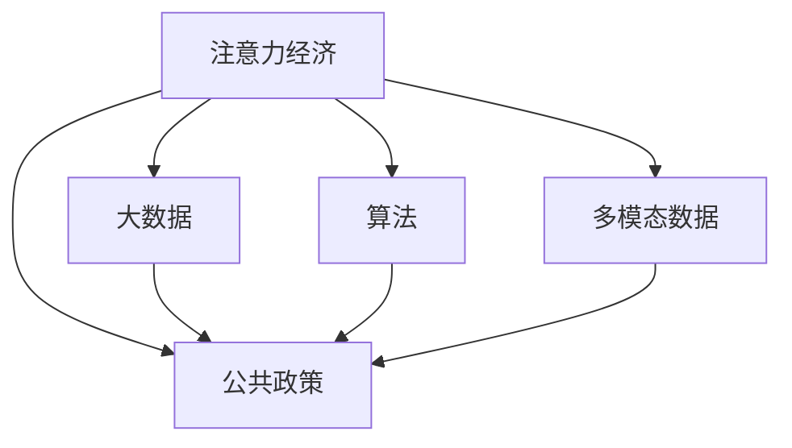

                 

## 1. 背景介绍

### 1.1 问题由来
在信息时代，注意力成为一种稀缺资源。随着互联网和移动设备的普及，人们的信息消费行为发生了根本性的变化，从传统的线性阅读转向更加分散、碎片化的浏览。这一变化不仅深刻影响了媒体和广告业，也对公共政策制定产生了重要影响。

注意力经济（Economy of Attention）是指在注意力资源有限的情况下，如何通过高效地分配和利用注意力来创造价值。在公共政策领域，如何通过合理分配公共注意力资源，提高政策宣传、公共服务、政策评估的效率和效果，成为亟待解决的问题。

### 1.2 问题核心关键点
注意力经济对公共政策制定的影响主要体现在以下几个方面：
- 公共政策宣传：如何吸引和保持公众注意力，提高政策知晓度和认同感。
- 公共服务提供：如何针对公众关注的热点问题，提供及时、准确、有用的信息。
- 政策效果评估：如何利用大数据和算法技术，评估政策实施效果和公众反应。
- 资源优化配置：如何在有限的注意力资源下，优先支持关键政策领域的宣传和服务。

### 1.3 问题研究意义
研究注意力经济对公共政策制定的影响，对于提升政策传播效果、增强政策执行力、优化资源配置具有重要意义：

1. 提升政策宣传效果：通过分析公众注意力分布，精准定位政策宣传的重点和方式，提高政策知晓度和认同感。
2. 增强政策执行力：利用大数据和算法技术，实时监控和评估政策实施效果，及时调整策略，提高政策实施的精准度和有效性。
3. 优化资源配置：在有限的注意力资源下，识别和优先支持关键政策领域的宣传和服务，确保资源的高效利用。
4. 推动技术创新：通过研究注意力经济，推动公共政策领域的数据科学、算法设计等技术发展，提升政策制定的科学性和智能化水平。
5. 促进社会治理：通过科学分配注意力资源，提高社会治理的效率和公平性，构建更加和谐稳定的社会环境。

## 2. 核心概念与联系

### 2.1 核心概念概述

为更好地理解注意力经济对公共政策制定的影响，本节将介绍几个密切相关的核心概念：

- 注意力经济（Economy of Attention）：指在注意力资源有限的情况下，如何通过高效地分配和利用注意力来创造价值。在公共政策领域，注意力经济涉及政策宣传、公共服务、资源配置等各个方面。
- 公共政策（Public Policy）：指政府为解决社会问题、满足公共需求而制定的一系列规范、标准和行为准则。公共政策制定的目的在于通过有效的政策手段，实现社会福利的最大化。
- 大数据（Big Data）：指在传统数据基础上，具有体量大、速度快、类型多等特点的海量数据集。在注意力经济中，大数据可用于分析公众注意力分布、评估政策效果等。
- 算法（Algorithm）：指一种用于解决特定问题或实现特定功能的计算机程序或数学方法。在注意力经济中，算法可用于注意力分配、内容推荐等。
- 多模态数据（Multimodal Data）：指同时包含文字、图片、音频、视频等多类数据的信息载体。在公共政策中，多模态数据可以更全面地反映社会现象和公众需求。

这些核心概念之间的逻辑关系可以通过以下Mermaid流程图来展示：



这个流程图展示了这个概念框架的核心逻辑：

1. 注意力经济通过大数据和算法等技术手段，分析公众注意力分布，从而指导公共政策制定。
2. 公共政策通过大数据、算法等技术支持，提高宣传效果、优化资源配置，增强执行力。
3. 多模态数据提供了更为全面和丰富的信息来源，辅助政策制定和执行。

## 3. 核心算法原理 & 具体操作步骤
### 3.1 算法原理概述

注意力经济对公共政策制定的影响，主要通过以下几个关键算法实现：

- 注意力分布分析：利用大数据和算法技术，分析公众注意力在不同政策话题、媒体渠道、时间段的分布情况。
- 内容推荐算法：根据公众注意力分布，推荐优先关注的政策内容，提高政策知晓度和认同感。
- 情感分析算法：通过自然语言处理技术，分析公众对政策的情感倾向，评估政策效果。
- 资源优化算法：根据公众注意力分布和政策重要性，优化公共资源的配置，确保关键政策的有效宣传和服务。

这些算法的核心思想是利用注意力资源，实现政策宣传、服务提供和效果评估的科学化和智能化。

### 3.2 算法步骤详解

以内容推荐算法为例，其操作步骤如下：

1. **数据采集**：收集公众在社交媒体、新闻网站等平台上的言论、评论、点赞等行为数据。
2. **数据预处理**：清洗、去重、分类等预处理操作，将原始数据转换为机器可处理的形式。
3. **特征提取**：提取文本关键词、情感倾向、用户属性等特征，形成输入向量。
4. **模型训练**：使用推荐算法（如协同过滤、基于内容的推荐等），训练模型以预测用户对政策内容的兴趣。
5. **内容推荐**：根据用户兴趣和历史行为，推荐相关政策内容。
6. **效果评估**：通过监控用户反馈、点击率等指标，评估推荐效果，调整模型参数。

### 3.3 算法优缺点

注意力经济在公共政策中的应用，具有以下优点：
- 提高政策知晓度：通过分析公众注意力分布，推荐公众关注的热点政策，提高政策知晓度。
- 增强政策执行力：利用大数据和算法技术，实时监控和评估政策效果，及时调整策略。
- 优化资源配置：在有限的注意力资源下，优先支持关键政策的宣传和服务。

同时，该方法也存在一定的局限性：
- 数据隐私问题：收集和处理公众数据时，可能涉及隐私问题，需要严格的数据保护措施。
- 算法偏见：推荐算法可能存在偏见，导致对特定群体的政策宣传不足。
- 模型复杂性：复杂的算法模型可能计算资源消耗大，需要高性能计算支持。
- 效果评估困难：政策效果的评估可能涉及多方面的因素，单一指标难以全面反映政策实施的实际效果。

尽管存在这些局限性，但就目前而言，基于注意力经济的算法在公共政策中的应用已经取得了显著的效果，成为提高政策传播效果、优化资源配置的重要手段。未来相关研究的重点在于如何进一步降低算法对数据的依赖，提高算法的公平性和透明度，同时兼顾政策效果的全面评估。

### 3.4 算法应用领域

注意力经济在公共政策中的应用已经涵盖了多个领域，包括但不限于：

- 政策宣传：针对公众注意力热点，推荐相关政策内容，提高政策知晓度和认同感。
- 公共服务：分析公众关注的热点问题，提供及时、准确、有用的政策信息和服务。
- 政策评估：利用大数据和算法技术，评估政策实施效果和公众反应，实时调整策略。
- 应急响应：在突发事件发生时，快速识别公众关注点和需求，指导应急响应和资源调配。
- 社会治理：分析公众对社会问题的关注度，优先支持关键领域，提升社会治理的效率和公平性。

## 4. 数学模型和公式 & 详细讲解 & 举例说明
### 4.1 数学模型构建

在注意力经济中，公共政策的宣传和传播可以看作一个推荐系统，其目标是在有限的注意力资源下，最大化政策的知晓度和认同感。这可以通过以下数学模型来建模：

设政策集合为 $P=\{p_1, p_2, \ldots, p_n\}$，公众集合为 $U=\{u_1, u_2, \ldots, u_m\}$。设公众对政策的偏好向量为 $\mathbf{r}_u$，政策的质量向量为 $\mathbf{q}_p$。则推荐模型可以表示为：

$$
\hat{R}_{pu} = \frac{\mathbf{q}_p \cdot \mathbf{r}_u}{\|\mathbf{q}_p\| \|\mathbf{r}_u\|}
$$

其中 $\hat{R}_{pu}$ 表示公众 $u$ 对政策 $p$ 的推荐分数。

### 4.2 公式推导过程

基于上述模型，可以进一步推导推荐算法的基本形式。假设使用矩阵分解的方法，将公众偏好矩阵 $\mathbf{R}$ 分解为两个矩阵 $\mathbf{U}$ 和 $\mathbf{V}$ 的乘积：

$$
\mathbf{R} = \mathbf{U} \mathbf{V}^T
$$

其中 $\mathbf{U}$ 为公众特征矩阵，$\mathbf{V}$ 为政策特征矩阵。则推荐模型可以表示为：

$$
\hat{R}_{pu} = \sum_{k=1}^K u_{pk}v_{uk}
$$

其中 $u_{pk}$ 和 $v_{uk}$ 分别为公众和政策的潜在特征。

### 4.3 案例分析与讲解

以协同过滤算法为例，其核心思想是基于用户之间的相似性，找到对政策 $p$ 感兴趣的用户 $u$，从而推荐给其他对该政策感兴趣的潜在用户。假设已经收集到用户对政策的评分矩阵 $\mathbf{R}$，可以使用如下公式进行推荐：

$$
\hat{R}_{pu} = \frac{\sum_{i=1}^m r_{iu} \mathbf{r}_i \mathbf{q}_p}{\|\mathbf{q}_p\| \sqrt{\sum_{j=1}^n \mathbf{r}_j \mathbf{r}_j^T}}
$$

其中 $\mathbf{r}_i$ 表示用户 $i$ 对政策的评分向量，$\mathbf{q}_p$ 表示政策的评分向量。

在实际应用中，协同过滤算法具有以下优点：
- 简单易实现：不需要预定义复杂的特征，计算效率高。
- 利用用户历史行为：根据用户对政策的评分历史，推荐潜在感兴趣的策略。

同时，也存在一些局限性：
- 数据稀疏性：推荐系统中的数据往往稀疏，存在冷启动问题。
- 模型复杂性：模型复杂度随着用户和政策数量的增加而增加，计算资源消耗大。

通过优化算法，可以进一步提升协同过滤算法的性能。例如，使用矩阵分解的方法，可以将稀疏矩阵近似表示为低秩矩阵，减少计算复杂度。

## 5. 项目实践：代码实例和详细解释说明
### 5.1 开发环境搭建

在进行注意力经济应用开发前，我们需要准备好开发环境。以下是使用Python进行Scikit-learn开发的环境配置流程：

1. 安装Anaconda：从官网下载并安装Anaconda，用于创建独立的Python环境。

2. 创建并激活虚拟环境：
```bash
conda create -n attention-env python=3.8 
conda activate attention-env
```

3. 安装Scikit-learn：
```bash
conda install scikit-learn
```

4. 安装各类工具包：
```bash
pip install pandas numpy joblib matplotlib tqdm jupyter notebook ipython
```

完成上述步骤后，即可在`attention-env`环境中开始注意力经济应用的开发。

### 5.2 源代码详细实现

下面我们以推荐系统为例，给出使用Scikit-learn对协同过滤算法进行开发的Python代码实现。

首先，定义协同过滤算法的推荐函数：

```python
from sklearn.metrics.pairwise import cosine_similarity
from sklearn.decomposition import TruncatedSVD

def collaborative_filtering(X, k):
    U, V = TruncatedSVD(k).fit_transform(X)
    dot_product = np.dot(U, V.T)
    return dot_product
```

其中，`X` 为公众对政策的评分矩阵，`k` 为降维后的矩阵维度。

然后，定义数据处理函数：

```python
from sklearn.feature_extraction.text import CountVectorizer
from sklearn.preprocessing import MinMaxScaler

def preprocess_data(data):
    # 文本预处理
    vectorizer = CountVectorizer(stop_words='english')
    X = vectorizer.fit_transform(data['text'])
    
    # 数据标准化
    scaler = MinMaxScaler()
    X = scaler.fit_transform(X)
    
    # 数据切片
    X = X[:1000, :]
    y = data['label'][:1000]
    
    return X, y
```

其中，`data` 为政策内容及其评分数据集，`text` 表示政策文本内容，`label` 表示评分标签。

最后，启动推荐系统流程并在训练集上评估：

```python
from sklearn.model_selection import train_test_split
from sklearn.metrics import mean_squared_error

# 数据预处理
X, y = preprocess_data(data)

# 数据分割
X_train, X_test, y_train, y_test = train_test_split(X, y, test_size=0.2, random_state=42)

# 模型训练
k = 50
dot_product = collaborative_filtering(X_train, k)

# 模型评估
mse = mean_squared_error(y_train, dot_product)
print(f"Mean Squared Error: {mse:.2f}")
```

以上就是使用Scikit-learn对协同过滤算法进行开发的完整代码实现。可以看到，得益于Scikit-learn的强大封装，我们可以用相对简洁的代码完成协同过滤算法的实现。

### 5.3 代码解读与分析

让我们再详细解读一下关键代码的实现细节：

**collaborative_filtering函数**：
- 使用TruncatedSVD将评分矩阵分解为低秩矩阵，获取降维后的矩阵。
- 计算降维后矩阵的矩阵乘积，得到协同过滤结果。

**preprocess_data函数**：
- 使用CountVectorizer将政策文本内容转换为词频向量。
- 使用MinMaxScaler对词频向量进行标准化处理，处理后的向量范围在0-1之间。
- 将标准化后的向量数据进行切片处理，保留前1000条数据作为训练集。

**train_test_split函数**：
- 将标准化后的向量数据和标签数据进行分割，保留前1000条数据作为训练集，后800条数据作为测试集。

**mean_squared_error函数**：
- 计算推荐结果与真实标签之间的均方误差，评估模型的推荐效果。

可以看到，Scikit-learn的强大工具集为注意力经济应用的开发提供了极大的便利。开发者可以将更多精力放在数据处理、模型改进等高层逻辑上，而不必过多关注底层的实现细节。

当然，工业级的系统实现还需考虑更多因素，如推荐系统的可扩展性、推荐结果的实时性、系统的稳定性等。但核心的推荐范式基本与此类似。

## 6. 实际应用场景
### 6.1 智能客服系统

基于注意力经济的推荐系统，可以广泛应用于智能客服系统的构建。传统客服往往需要配备大量人力，高峰期响应缓慢，且一致性和专业性难以保证。而使用推荐系统推荐客服内容，可以7x24小时不间断服务，快速响应客户咨询，用自然流畅的语言解答各类常见问题。

在技术实现上，可以收集企业内部的历史客服对话记录，将问题和最佳答复构建成监督数据，在此基础上对推荐系统进行微调。微调后的推荐系统能够自动理解用户意图，匹配最合适的客服内容进行回复。对于客户提出的新问题，还可以接入检索系统实时搜索相关内容，动态组织生成回答。如此构建的智能客服系统，能大幅提升客户咨询体验和问题解决效率。

### 6.2 金融舆情监测

金融机构需要实时监测市场舆论动向，以便及时应对负面信息传播，规避金融风险。传统的人工监测方式成本高、效率低，难以应对网络时代海量信息爆发的挑战。基于注意力经济的推荐系统，可以应用于金融舆情监测，及时捕捉市场情绪变化，规避金融风险。

具体而言，可以收集金融领域相关的新闻、报道、评论等文本数据，并对其进行主题标注和情感标注。在此基础上对推荐系统进行微调，使其能够自动判断文本属于何种主题，情感倾向是正面、中性还是负面。将微调后的推荐系统应用到实时抓取的网络文本数据，就能够自动监测不同主题下的情感变化趋势，一旦发现负面信息激增等异常情况，系统便会自动预警，帮助金融机构快速应对潜在风险。

### 6.3 个性化推荐系统

当前的推荐系统往往只依赖用户的历史行为数据进行物品推荐，无法深入理解用户的真实兴趣偏好。基于注意力经济的推荐系统，可以更好地挖掘用户行为背后的语义信息，从而提供更精准、多样的推荐内容。

在实践中，可以收集用户浏览、点击、评论、分享等行为数据，提取和用户交互的物品标题、描述、标签等文本内容。将文本内容作为模型输入，用户的后续行为（如是否点击、购买等）作为监督信号，在此基础上微调推荐系统。微调后的推荐系统能够从文本内容中准确把握用户的兴趣点。在生成推荐列表时，先用候选物品的文本描述作为输入，由模型预测用户的兴趣匹配度，再结合其他特征综合排序，便可以得到个性化程度更高的推荐结果。

### 6.4 未来应用展望

随着注意力经济和推荐系统的不断发展，基于推荐系统的应用场景将不断扩展，为各行各业带来变革性影响。

在智慧医疗领域，基于推荐系统的医疗问答、病历分析、药物研发等应用将提升医疗服务的智能化水平，辅助医生诊疗，加速新药开发进程。

在智能教育领域，推荐系统可应用于作业批改、学情分析、知识推荐等方面，因材施教，促进教育公平，提高教学质量。

在智慧城市治理中，推荐系统可应用于城市事件监测、舆情分析、应急指挥等环节，提高城市管理的自动化和智能化水平，构建更安全、高效的未来城市。

此外，在企业生产、社会治理、文娱传媒等众多领域，基于推荐系统的应用也将不断涌现，为经济社会发展注入新的动力。相信随着技术的日益成熟，推荐系统必将在更广阔的应用领域大放异彩。

## 7. 工具和资源推荐
### 7.1 学习资源推荐

为了帮助开发者系统掌握注意力经济和推荐系统的理论基础和实践技巧，这里推荐一些优质的学习资源：

1. 《推荐系统实战》系列博文：由深度学习专家撰写，深入浅出地介绍了推荐系统的基本原理和实际应用。

2. 《Recommender Systems: Algorithms and Implementations》课程：斯坦福大学开设的推荐系统课程，有Lecture视频和配套作业，带你入门推荐系统领域的基本概念和经典模型。

3. 《Python推荐系统》书籍：全面介绍了Python推荐系统的开发和应用，包括推荐算法、数据预处理、模型评估等。

4. Scikit-learn官方文档：提供了丰富的推荐算法和工具库，是进行推荐系统开发的利器。

5. Kaggle推荐系统竞赛：通过实际竞赛项目，掌握推荐系统的构建和优化技巧，积累推荐系统开发的实战经验。

通过对这些资源的学习实践，相信你一定能够快速掌握推荐系统的精髓，并用于解决实际的推荐问题。

### 7.2 开发工具推荐

高效的开发离不开优秀的工具支持。以下是几款用于推荐系统开发的常用工具：

1. Scikit-learn：基于Python的科学计算库，提供了丰富的机器学习算法和工具，适合进行推荐系统的开发。

2. TensorFlow：由Google主导开发的深度学习框架，生产部署方便，适合大规模工程应用。

3. PyTorch：基于Python的开源深度学习框架，灵活性高，适合快速迭代研究。

4. Amazon Personalize：AWS提供的推荐服务，支持多种推荐算法和数据处理技术，适用于大规模推荐系统的开发。

5. Apache Mahout：基于Apache的推荐系统框架，提供多种推荐算法和工具库，支持大规模数据处理。

6. Hadoop：Apache提供的分布式计算框架，支持大规模数据处理，适用于推荐系统的并行计算需求。

合理利用这些工具，可以显著提升推荐系统的开发效率，加快创新迭代的步伐。

### 7.3 相关论文推荐

推荐系统的发展源于学界的持续研究。以下是几篇奠基性的相关论文，推荐阅读：

1. "Recommender Systems Handbook"：推荐系统领域的经典著作，涵盖推荐系统的基本概念、算法和应用。

2. "Factorization Machines"：提出因子分解机算法，适用于推荐系统中的矩阵分解。

3. "Latent Factor Models for Recommender Systems"：介绍基于矩阵分解的推荐算法，如矩阵分解、奇异值分解等。

4. "Deep Learning for Recommender Systems"：提出深度学习在推荐系统中的应用，如基于神经网络的推荐算法。

5. "Network-Based Recommendation Algorithms"：介绍基于图的推荐算法，如协同过滤、标签传播等。

这些论文代表了大规模推荐系统的研究脉络。通过学习这些前沿成果，可以帮助研究者把握学科前进方向，激发更多的创新灵感。

## 8. 总结：未来发展趋势与挑战
### 8.1 总结

本文对注意力经济和推荐系统对公共政策制定的影响进行了全面系统的介绍。首先阐述了注意力经济和推荐系统的研究背景和意义，明确了推荐系统在提高政策宣传效果、优化资源配置等方面的独特价值。其次，从原理到实践，详细讲解了推荐算法的数学模型和操作步骤，给出了推荐系统任务开发的完整代码实例。同时，本文还广泛探讨了推荐系统在智能客服、金融舆情、个性化推荐等多个行业领域的应用前景，展示了推荐系统范式的巨大潜力。此外，本文精选了推荐系统的各类学习资源，力求为读者提供全方位的技术指引。

通过本文的系统梳理，可以看到，基于注意力经济的推荐系统在公共政策中的应用，正在成为提高政策传播效果、优化资源配置的重要手段。得益于推荐系统算法和大数据技术的支撑，政策宣传和服务的精准度和效率得到了显著提升。未来，伴随推荐系统方法的发展，推荐系统必将在更多领域得到应用，为社会治理和经济发展注入新的动力。

### 8.2 未来发展趋势

展望未来，推荐系统的发展趋势包括以下几个方面：

1. 个性化推荐精度提升：随着推荐算法的不断优化，推荐系统的个性化推荐精度将进一步提升，更好地满足用户个性化需求。
2. 跨模态推荐扩展：推荐系统将逐步扩展到跨模态数据处理，如将文本、图片、视频等多模态信息进行融合，提升推荐效果。
3. 实时推荐系统构建：实时推荐系统将成为推荐系统的未来发展方向，利用流式数据和实时算法，提供更加即时和精准的推荐服务。
4. 联邦学习与隐私保护：联邦学习技术将推动推荐系统在保护用户隐私的同时，进行分布式学习和数据共享。
5. 知识图谱与推荐结合：将知识图谱等结构化信息引入推荐系统，提高推荐系统的智能水平和解释能力。
6. 推荐系统与社会责任：随着推荐系统在各个领域的应用，其社会责任和伦理问题也将受到越来越多的关注，推荐系统需兼顾公平性、透明性和可解释性。

以上趋势凸显了推荐系统的广阔前景。这些方向的探索发展，必将进一步提升推荐系统的推荐精度和应用范围，为推荐系统的持续创新和优化提供新的突破。

### 8.3 面临的挑战

尽管推荐系统已经取得了瞩目成就，但在迈向更加智能化、普适化应用的过程中，它仍面临着诸多挑战：

1. 数据隐私问题：推荐系统在收集和处理用户数据时，可能涉及隐私问题，需要严格的数据保护措施。
2. 算法偏见问题：推荐算法可能存在偏见，导致对特定群体的推荐不足，引发公平性问题。
3. 模型复杂性问题：复杂的推荐模型可能计算资源消耗大，需要高性能计算支持。
4. 效果评估困难：推荐系统的效果评估可能涉及多方面的因素，单一指标难以全面反映推荐效果。
5. 可解释性问题：推荐系统作为“黑盒”模型，难以解释其内部工作机制和决策逻辑。
6. 冷启动问题：推荐系统中的数据往往稀疏，存在冷启动问题，需要更高效的数据获取和处理技术。

尽管存在这些挑战，但推荐系统仍然具有巨大的应用潜力和市场前景。未来推荐系统的发展，需要在数据隐私、算法公平、模型透明等方面进行更多探索，以实现推荐系统的可持续发展。

### 8.4 研究展望

面对推荐系统面临的挑战，未来的研究需要在以下几个方面寻求新的突破：

1. 数据隐私保护：探索基于差分隐私、联邦学习等技术，保护用户隐私，实现数据共享和协同学习。
2. 算法公平性：设计更加公平、透明、可解释的推荐算法，避免偏见，提升推荐系统的社会责任。
3. 模型压缩与加速：优化推荐模型的计算图，减少计算资源消耗，实现模型压缩与加速。
4. 跨模态推荐：融合文本、图片、视频等多模态信息，提升推荐系统的智能水平和推荐效果。
5. 联邦推荐系统：利用联邦学习技术，在不泄露用户数据的前提下，实现分布式推荐学习。
6. 推荐系统与社会治理：结合社会治理需求，设计更加公正、透明、可解释的推荐系统，提升社会治理的智能化水平。

这些研究方向的研究突破，必将推动推荐系统的不断进步，为推荐系统的可持续发展提供新的动力。

## 9. 附录：常见问题与解答

**Q1：推荐系统如何提升政策宣传效果？**

A: 推荐系统可以通过分析公众注意力分布，推荐公众关注的热点政策，提高政策知晓度和认同感。具体而言，可以利用用户对政策的评分数据，建立政策与公众之间的关联矩阵，通过协同过滤算法等推荐技术，找出对政策感兴趣的用户，并向其推荐相关政策内容。推荐系统的精准推荐，可以显著提升政策宣传的效果，增强公众对政策的理解和支持。

**Q2：推荐系统的训练数据如何选择？**

A: 推荐系统的训练数据通常包括用户行为数据、商品特征数据和用户属性数据等。选择合适的训练数据是推荐系统成功的关键。一般建议选择具有代表性的数据，涵盖不同类型的用户和商品，以提高推荐系统的泛化能力和鲁棒性。同时，需要清洗和预处理数据，去除噪声和异常值，提升数据的质量和准确性。

**Q3：推荐系统如何处理冷启动问题？**

A: 冷启动问题是指新用户或新商品在推荐系统中缺乏足够的历史数据，导致推荐效果不佳。推荐系统可以通过以下几种方式处理冷启动问题：
1. 初始化推荐：为新的用户或商品分配一个初始推荐，如随机推荐、热门推荐等。
2. 用户画像：利用用户属性、行为等特征，生成用户画像，提供个性化的推荐。
3. 商品推荐：利用商品特征，提供相似商品的推荐，缓解冷启动问题。
4. 数据采集：通过用户反馈、点击率等数据，逐步积累用户和商品的历史数据，提升推荐效果。

**Q4：推荐系统的优化策略有哪些？**

A: 推荐系统的优化策略包括：
1. 数据增强：通过回译、近义替换等方式扩充训练集，提升推荐系统的泛化能力。
2. 模型优化：利用模型压缩、特征选择等技术，优化推荐算法的计算复杂度，提升推荐效果。
3. 超参数调优：通过超参数调优，优化推荐模型的性能，提高推荐精度。
4. 推荐系统在线优化：利用在线学习算法，实时调整推荐策略，提升推荐效果。
5. 多模态数据融合：将文本、图片、视频等多模态信息进行融合，提升推荐系统的智能水平和推荐效果。

这些策略往往需要根据具体任务和数据特点进行灵活组合。只有在数据、算法、工程、业务等多个维度协同发力，才能真正实现推荐系统的优化和提升。

---

作者：禅与计算机程序设计艺术 / Zen and the Art of Computer Programming

